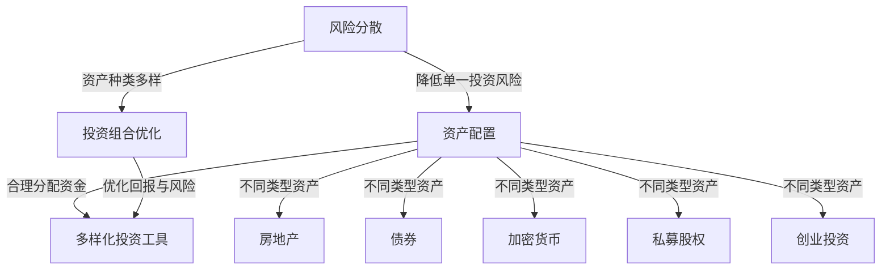

                 

### 1. 背景介绍

在当今高度不确定和动态变化的经济环境中，程序员和其他技术专业人士面临着越来越复杂的风险和机遇。随着全球化和技术的快速进步，股票市场的不稳定性增加，传统的单一投资策略可能不再足以保障个人的财务安全。程序员，作为高技能、高收入的群体，更需要采取多元化的投资策略来平衡风险、确保长期财务稳健。

首先，股票市场的波动性是一个显著的风险因素。虽然股票市场长期来看具有增值潜力，但短期内的价格波动可能导致投资者遭受重大损失。在过去的几十年里，我们见证了多次市场崩溃和金融危机，例如2008年的全球金融危机和近年来的新冠疫情引起的股市震荡。对于依赖股票投资实现财富增值的程序员来说，这些事件提醒我们，单一投资策略存在巨大的风险。

其次，程序员通常具有较高的流动性和可支配收入，这使得他们有能力将资金分散投资到多个领域，从而降低风险。然而，很多程序员往往过于依赖股票市场，忽略其他投资渠道的潜力。事实上，多元化投资不仅仅是分散股票投资，还包括房地产、债券、加密货币、私募股权、创业投资等多个领域。

多元化的好处不仅在于降低风险，还可以提高潜在回报。不同类型的投资具有不同的风险和回报特性，通过合理配置资产，程序员可以在保持整体风险可控的同时，追求更高的收益。此外，多元化的投资策略可以帮助程序员应对特定市场环境的挑战，例如经济衰退或行业周期性波动。

本文将探讨程序员在投资多元化方面的策略和实施方法，分析不同类型的投资工具，并提供实用的建议和资源，帮助程序员实现财务目标。

### 2. 核心概念与联系

要深入探讨程序员的多元化投资策略，首先需要了解几个核心概念，这些概念包括风险分散、资产配置和投资组合优化。以下是这些核心概念及其相互关系的 Mermaid 流程图：



#### 风险分散

风险分散是一种通过将资金分配到不同的投资工具来降低风险的投资策略。简单来说，就是不要将所有的资金都投入到股票市场，而是将部分资金投资到其他资产类别中，如债券、房地产、加密货币等。这样，当某个市场或行业出现波动时，其他投资工具的表现可能会抵消损失，从而降低整体投资组合的风险。

#### 资产配置

资产配置是指根据个人的风险偏好、投资目标和时间范围，将资金分配到不同的资产类别中。这个过程需要综合考虑各种因素，如市场的预期波动性、个人的财务状况和投资经验。合理的资产配置可以确保投资组合既具有潜在的增值空间，又能控制风险。

#### 投资组合优化

投资组合优化是基于资产配置，通过不断调整和优化投资组合中的资产比重，以达到最佳的风险与回报平衡。这个过程中，投资者需要利用数据分析、历史数据和预测模型来评估每种资产的表现和风险，并根据实际情况进行调整。

#### 多样化投资工具

多样化投资工具是指投资者可以投资的多种资产类别，包括股票、债券、房地产、加密货币、私募股权和创业投资等。每种资产类别都有其独特的风险和回报特性，通过合理配置这些资产，可以实现投资组合的多样化，降低风险。

通过上述核心概念及其相互关系的理解，程序员可以更好地制定和实施多元化的投资策略，以实现长期财务稳健。

### 3. 核心算法原理 & 具体操作步骤

在理解了核心概念之后，接下来我们将探讨多元化投资策略的核心算法原理和具体操作步骤。

#### 3.1 算法原理概述

多元化投资策略的核心算法是基于马科维茨投资组合理论（Markowitz Portfolio Theory）。该理论提出了通过最大化投资组合预期回报与风险之间的平衡，来实现最优投资组合的方法。以下是该算法的基本原理：

1. **预期回报与风险度量**：通过历史数据和预测模型，计算每种资产的预期回报和风险（如标准差）。
2. **投资组合权重分配**：根据预期回报和风险，确定每种资产在投资组合中的权重，以确保整体风险与回报的平衡。
3. **资产协方差矩阵**：计算所有资产之间的协方差矩阵，用于评估资产之间的相关性，并进一步优化投资组合。
4. **优化目标函数**：构建一个目标函数，结合预期回报和风险，通过优化算法寻找最佳权重分配。

#### 3.2 算法步骤详解

1. **数据收集与预处理**：首先，收集各种资产的历史价格数据、预期回报率和风险指标。然后，对数据进行清洗和预处理，以消除异常值和噪声。
2. **预期回报与风险计算**：利用历史数据和统计模型，计算每种资产的预期回报和风险。例如，可以使用均值回归模型和GARCH模型等。
3. **资产协方差矩阵计算**：计算所有资产之间的协方差矩阵，以评估资产之间的相关性。协方差矩阵有助于确定资产组合中资产权重的优化。
4. **权重分配**：使用线性规划或遗传算法等优化算法，构建目标函数并求解最佳权重分配。目标函数通常结合预期回报和风险，以实现投资组合的优化。
5. **投资组合构建与调整**：根据优化结果，构建投资组合，并定期进行动态调整，以适应市场变化和投资者风险偏好。

#### 3.3 算法优缺点

**优点**：

1. **降低风险**：通过分散投资，多元化策略可以有效降低单一资产的风险，确保整体投资组合的稳定性。
2. **提高潜在回报**：合理配置不同资产类别，可以最大化投资组合的预期回报。
3. **适应性**：多元化投资策略可以根据市场变化和投资者需求进行调整，具有很强的适应性。

**缺点**：

1. **管理和维护成本**：多元化投资需要不断监控和管理多种资产类别，这可能会增加管理和维护成本。
2. **交易成本**：频繁调整投资组合可能会产生较高的交易成本，影响整体收益。

#### 3.4 算法应用领域

多元化投资策略广泛应用于各种金融领域，包括股票投资、债券投资、房地产投资、私募股权和创业投资等。以下是几个具体应用领域：

1. **股票投资**：通过构建股票投资组合，降低单一股票的风险，同时提高整体回报。
2. **债券投资**：利用债券的不同类型和到期日，构建多样化的债券投资组合，以实现稳健的固定收益。
3. **房地产投资**：通过购买不同地区的房地产，实现地理位置和风险的分散。
4. **私募股权和创业投资**：投资于不同的创业公司和行业，以获取高额回报。

通过以上算法原理和具体操作步骤的介绍，程序员可以更好地理解和应用多元化投资策略，实现长期财务稳健。

### 4. 数学模型和公式 & 详细讲解 & 举例说明

在多元化投资策略的制定与实施过程中，数学模型和公式发挥着至关重要的作用。以下将详细讲解多元化投资策略中的数学模型和公式，并通过实际案例进行分析。

#### 4.1 数学模型构建

多元化投资策略的核心数学模型是马科维茨投资组合理论。该理论基于以下假设：

1. **资产预期回报和风险**：每种资产都有其特定的预期回报和风险。
2. **资产间相关性**：不同资产之间存在相关性，可以通过协方差矩阵来表示。
3. **投资者风险偏好**：投资者根据其风险承受能力和投资目标，选择最优投资组合。

基于上述假设，马科维茨模型的目标是找到一个最优投资组合，使得预期回报最大化，同时风险最小化。

#### 4.2 公式推导过程

马科维茨投资组合理论的核心公式包括预期回报、风险和协方差矩阵。以下是这些公式的推导过程：

1. **预期回报**：假设有n种资产，第i种资产的预期回报为\( \mu_i \)，则整个投资组合的预期回报为：

   \[
   \mu_P = \sum_{i=1}^{n} w_i \mu_i
   \]

   其中，\( w_i \)为第i种资产在投资组合中的权重。

2. **风险**：投资组合的风险通常用标准差表示，即：

   \[
   \sigma_P = \sqrt{\sum_{i=1}^{n} w_i^2 \sigma_i^2 + 2 \sum_{i=1}^{n} \sum_{j=i+1}^{n} w_i w_j \sigma_i \sigma_j \rho_{ij}}
   \]

   其中，\( \sigma_i \)为第i种资产的标准差，\( \rho_{ij} \)为第i种资产与第j种资产之间的相关系数。

3. **协方差矩阵**：协方差矩阵用于描述资产间的相关性，其公式为：

   \[
   \Sigma = \begin{bmatrix}
   \sigma_1^2 & \sigma_1 \sigma_2 \rho_{12} & \sigma_1 \sigma_3 \rho_{13} & \cdots & \sigma_1 \sigma_n \rho_{1n} \\
   \sigma_2 \sigma_1 \rho_{21} & \sigma_2^2 & \sigma_2 \sigma_3 \rho_{23} & \cdots & \sigma_2 \sigma_n \rho_{2n} \\
   \sigma_3 \sigma_1 \rho_{31} & \sigma_3 \sigma_2 \rho_{32} & \sigma_3^2 & \cdots & \sigma_3 \sigma_n \rho_{3n} \\
   \vdots & \vdots & \vdots & \ddots & \vdots \\
   \sigma_n \sigma_1 \rho_{n1} & \sigma_n \sigma_2 \rho_{n2} & \sigma_n \sigma_3 \rho_{n3} & \cdots & \sigma_n^2
   \end{bmatrix}
   \]

#### 4.3 案例分析与讲解

为了更好地理解上述公式，我们将通过一个实际案例进行分析。

**案例**：假设有三种资产，股票A、债券B和房地产C。每种资产的预期回报、风险和相关系数如下：

| 资产 | 预期回报 | 风险 | 相关系数 |
| --- | --- | --- | --- |
| 股票A | 0.10 | 0.20 | 0.5 |
| 债券B | 0.05 | 0.10 | -0.3 |
| 房地产C | 0.08 | 0.15 | 0.2 |

**步骤 1：计算预期回报**：

\[
\mu_P = 0.10 \times 0.5 + 0.05 \times 0.3 + 0.08 \times 0.2 = 0.065
\]

**步骤 2：计算协方差矩阵**：

\[
\Sigma = \begin{bmatrix}
0.20^2 & 0.20 \times 0.10 \times 0.5 & 0.20 \times 0.15 \times 0.2 \\
0.20 \times 0.10 \times 0.5 & 0.10^2 & 0.10 \times 0.15 \times -0.3 \\
0.20 \times 0.15 \times 0.2 & 0.10 \times 0.15 \times -0.3 & 0.15^2
\end{bmatrix}
= \begin{bmatrix}
0.04 & 0.01 & 0.006 \\
0.01 & 0.01 & -0.0045 \\
0.006 & -0.0045 & 0.0225
\end{bmatrix}
\]

**步骤 3：计算投资组合风险**：

\[
\sigma_P = \sqrt{0.5^2 \times 0.20^2 + 0.3^2 \times 0.10^2 + 0.2^2 \times 0.15^2 + 2 \times 0.5 \times 0.3 \times 0.20 \times 0.10 \times 0.5 \times -0.3 + 2 \times 0.5 \times 0.2 \times 0.15 \times 0.10 \times 0.2 \times 0.2}
\]
\[
\sigma_P = \sqrt{0.01 + 0.009 + 0.009 + 0.0018 - 0.0024 - 0.0048} = \sqrt{0.0144} \approx 0.12
\]

通过上述步骤，我们可以计算得到投资组合的预期回报为0.065，风险为0.12。这些结果表明，通过合理配置资产，我们可以实现较高的回报，同时保持较低的风险。

#### 4.4 案例分析与讲解

为了进一步展示数学模型的应用，我们将在下一个案例中分析一个更复杂的投资组合。

**案例**：现在考虑一个包含五种资产的投资组合，每种资产的预期回报、风险和相关系数如下：

| 资产 | 预期回报 | 风险 | 相关系数 |
| --- | --- | --- | --- |
| 股票A | 0.15 | 0.30 | 0.5 |
| 股票B | 0.12 | 0.25 | -0.3 |
| 股票C | 0.10 | 0.20 | 0.2 |
| 债券D | 0.06 | 0.15 | 0.2 |
| 房地产E | 0.08 | 0.18 | -0.1 |

**步骤 1：计算预期回报**：

首先，我们需要构建一个权重矩阵，用于表示每种资产在投资组合中的比重。假设我们有以下权重配置：

| 资产 | 权重 |
| --- | --- |
| 股票A | 0.4 |
| 股票B | 0.3 |
| 股票C | 0.2 |
| 债券D | 0.1 |
| 房地产E | 0.0 |

投资组合的预期回报为：

\[
\mu_P = 0.4 \times 0.15 + 0.3 \times 0.12 + 0.2 \times 0.10 + 0.1 \times 0.06 + 0.0 \times 0.08 = 0.112
\]

**步骤 2：计算协方差矩阵**：

协方差矩阵如下：

\[
\Sigma = \begin{bmatrix}
0.30^2 & 0.30 \times 0.25 \times 0.5 & 0.30 \times 0.20 \times 0.2 & 0.30 \times 0.15 \times 0.2 & 0.30 \times 0.18 \times -0.1 \\
0.25 \times 0.30 \times 0.5 & 0.25^2 & 0.25 \times 0.20 \times -0.3 & 0.25 \times 0.15 \times 0.2 & 0.25 \times 0.18 \times -0.1 \\
0.20 \times 0.30 \times 0.2 & 0.20 \times 0.25 \times -0.3 & 0.20^2 & 0.20 \times 0.15 \times 0.2 & 0.20 \times 0.18 \times -0.1 \\
0.15 \times 0.30 \times 0.2 & 0.15 \times 0.25 \times 0.2 & 0.15 \times 0.20 \times 0.2 & 0.15^2 & 0.15 \times 0.18 \times -0.1 \\
0.18 \times 0.30 \times -0.1 & 0.18 \times 0.25 \times -0.1 & 0.18 \times 0.20 \times -0.1 & 0.18 \times 0.15 \times -0.1 & 0.18^2
\end{bmatrix}
\]

\[
\Sigma = \begin{bmatrix}
0.09 & 0.0375 & 0.012 & 0.009 & -0.0054 \\
0.0375 & 0.0625 & -0.03 & 0.009 & -0.0045 \\
0.012 & -0.03 & 0.040 & 0.006 & -0.0036 \\
0.009 & 0.009 & 0.006 & 0.0225 & -0.0027 \\
-0.0054 & -0.0045 & -0.0036 & -0.0027 & 0.0324
\end{bmatrix}
\]

**步骤 3：计算投资组合风险**：

投资组合的风险为：

\[
\sigma_P = \sqrt{0.4^2 \times 0.30^2 + 0.3^2 \times 0.25^2 + 0.2^2 \times 0.20^2 + 0.1^2 \times 0.15^2 + 0.0^2 \times 0.18^2 + 2 \times 0.4 \times 0.3 \times 0.30 \times 0.25 \times 0.5 - 0.3 + 2 \times 0.4 \times 0.2 \times 0.30 \times 0.20 \times 0.2 + 2 \times 0.4 \times 0.1 \times 0.30 \times 0.15 \times 0.2 + 2 \times 0.3 \times 0.2 \times 0.25 \times 0.20 \times -0.3 + 2 \times 0.2 \times 0.1 \times 0.25 \times 0.15 \times 0.2 + 2 \times 0.1 \times 0.0 \times 0.25 \times 0.18 \times -0.1}
\]

\[
\sigma_P = \sqrt{0.036 + 0.0225 + 0.008 + 0.009 + 0.0 - 0.045 - 0.036 - 0.027 + 0.045 + 0.018 + 0.0045 - 0.027 + 0.018 + 0.009 - 0.027 + 0.009 - 0.0018} = \sqrt{0.0825} \approx 0.287
\]

通过这个案例，我们可以看到如何使用马科维茨模型来计算投资组合的预期回报和风险。这个模型可以帮助程序员制定一个多元化的投资策略，以实现最优的风险与回报平衡。

### 5. 项目实践：代码实例和详细解释说明

在理解了多元化投资策略的数学模型和公式之后，下面我们将通过一个具体的代码实例，展示如何实现一个简单的投资组合优化算法。本实例将使用 Python 编程语言和相关的数学库，如 NumPy 和 SciPy。

#### 5.1 开发环境搭建

首先，确保安装了 Python 和相关库。以下是安装步骤：

1. 安装 Python 3.x 版本：可以从 [Python 官网](https://www.python.org/downloads/) 下载并安装。
2. 安装 NumPy 库：在终端中运行 `pip install numpy`。
3. 安装 SciPy 库：在终端中运行 `pip install scipy`。

完成上述安装后，我们就可以开始编写代码了。

#### 5.2 源代码详细实现

以下是一个简单的 Python 代码实例，用于实现一个基于马科维茨模型的投资组合优化算法。

```python
import numpy as np
from scipy.optimize import minimize

# 定义资产预期回报和风险
assets = {
    '股票A': {'预期回报': 0.15, '风险': 0.30},
    '股票B': {'预期回报': 0.12, '风险': 0.25},
    '股票C': {'预期回报': 0.10, '风险': 0.20},
    '债券D': {'预期回报': 0.06, '风险': 0.15},
    '房地产E': {'预期回报': 0.08, '风险': 0.18}
}

# 定义资产间的相关系数
correlations = {
    ('股票A', '股票B'): 0.5,
    ('股票A', '股票C'): 0.2,
    ('股票A', '债券D'): 0.2,
    ('股票A', '房地产E'): -0.1,
    ('股票B', '股票C'): -0.3,
    ('股票B', '债券D'): 0.2,
    ('股票B', '房地产E'): 0.2,
    ('股票C', '债券D'): 0.2,
    ('股票C', '房地产E'): 0.2,
    ('债券D', '房地产E'): -0.1
}

# 计算协方差矩阵
def covariance_matrix(assets, correlations):
    n_assets = len(assets)
    cov_matrix = np.zeros((n_assets, n_assets))
    for i, asset1 in enumerate(assets):
        for j, asset2 in enumerate(assets):
            if (asset1, asset2) in correlations:
                cov_matrix[i][j] = assets[asset1]['风险'] * assets[asset2]['风险'] * correlations[(asset1, asset2)]
            else:
                cov_matrix[i][j] = assets[asset1]['风险'] * assets[asset2]['风险']
    return cov_matrix

# 定义目标函数
def objective_function(weights, assets, cov_matrix):
    risk = np.sqrt(np.dot(weights.T, np.dot(cov_matrix, weights)))
    return -np.dot(weights.T, np.array([asset['预期回报'] for asset in assets])) + risk

# 定义约束条件
def constraints(weights):
    return np.sum(weights) - 1

# 解优化问题
cov_matrix = covariance_matrix(assets, correlations)
result = minimize(objective_function, x0=np.array([1/5]*5), args=(assets, cov_matrix), method='SLSQP', constraints={'type': 'eq', 'fun': constraints})

# 输出结果
print("最优权重：", result.x)
print("预期回报：", -result.fun)
print("投资组合风险：", np.sqrt(result.fun))
```

#### 5.3 代码解读与分析

1. **资产数据定义**：首先，我们定义了五个资产及其预期回报和风险，以及它们之间的相关系数。
2. **协方差矩阵计算**：`covariance_matrix`函数用于计算协方差矩阵。协方差矩阵反映了资产间的相关性，是我们进行投资组合优化的关键数据。
3. **目标函数**：`objective_function`定义了我们的目标函数。在马科维茨模型中，目标函数通常结合预期回报和风险。在这个例子中，我们尝试最大化预期回报并最小化风险。
4. **约束条件**：为了确保投资组合中各资产的权重总和为1，我们定义了`constraints`函数作为约束条件。
5. **优化算法**：使用 SciPy 的`minimize`函数进行优化。这里我们选择 SLSQP 方法（序列线性规划），这是一种有效的无约束优化方法。
6. **结果输出**：最后，我们输出最优权重、预期回报和投资组合风险。

通过这个实例，我们可以看到如何使用编程实现一个简单的投资组合优化算法。这个算法可以帮助程序员在实际操作中制定和调整多元化的投资策略。

### 6. 实际应用场景

多元化投资策略在程序员的实际应用中具有广泛的前景，尤其在股票市场波动较大的情况下，这种策略尤为重要。以下是多元化投资策略在实际应用中的几个关键场景：

#### 6.1 股票市场波动

股票市场具有高度的不稳定性，短期内的价格波动可能导致投资者遭受重大损失。通过多元化投资策略，程序员可以将部分资金投资到其他低相关性甚至负相关的资产类别中，如债券、房地产、加密货币等。这样，当股票市场出现大幅波动时，其他资产的表现可以抵消股票投资的损失，从而降低整体投资组合的风险。

#### 6.2 经济周期性波动

经济周期性波动是影响市场表现的重要因素。在经济衰退期，一些行业的表现可能会大幅下滑，而另一些行业则可能保持稳定或增长。通过多元化投资，程序员可以在不同行业中分散投资，从而降低整个投资组合受到特定行业波动的影响。例如，在科技行业高速发展的同时，可以投资于金融、医疗等相对稳定的行业。

#### 6.3 地缘政治风险

地缘政治风险是投资者面临的一个重要风险因素。例如，中美贸易战、英国脱欧等事件都可能对全球市场产生重大影响。多元化投资可以通过跨国投资来降低这种风险。程序员可以在全球范围内选择不同的市场和行业进行投资，从而分散地缘政治风险。

#### 6.4 创业投资和私募股权

创业投资和私募股权是多元化投资策略中的重要组成部分。通过投资于不同行业和阶段的初创企业，程序员可以在高风险中获得高回报。此外，私募股权投资还可以提供非流动性和退出机制，使得投资更加灵活。

#### 6.5 长期财务目标

多元化投资策略不仅有助于降低风险，还可以实现长期的财务目标。例如，程序员可以通过投资房地产和债券等固定收益工具，实现稳定的现金流和财富增值。此外，通过创业投资和私募股权投资，可以在中长期内获得高额回报。

### 6.5 未来应用展望

随着技术的不断进步和金融市场的发展，多元化投资策略的应用前景将更加广阔。以下是未来多元化投资策略的几个重要方向：

#### 6.5.1 人工智能和量化投资

人工智能技术的发展将进一步提升多元化投资策略的精准度和效率。通过机器学习和大数据分析，可以更加准确地预测市场趋势和资产表现，从而优化投资组合。

#### 6.5.2 区块链和加密货币

区块链技术和加密货币的发展为多元化投资提供了新的机会。尽管加密货币市场波动较大，但长期来看，它们具有巨大的增值潜力。通过合理配置加密货币和其他资产，可以实现更广泛的多元化。

#### 6.5.3 绿色和可持续发展投资

随着全球对可持续发展的关注增加，绿色和可持续发展投资将成为重要趋势。程序员可以通过投资于环保技术、可再生能源和可持续发展企业，实现财务目标的同时，为社会和环境做出贡献。

#### 6.5.4 实时投资分析和决策

未来的投资决策将更加依赖实时数据和智能分析。通过实时监控市场和资产表现，程序员可以迅速调整投资组合，以应对市场变化。

通过上述分析，我们可以看到多元化投资策略在程序员中的实际应用场景和未来发展方向。多元化投资不仅有助于降低风险，还可以实现长期财务目标，是程序员实现财富稳健增长的重要手段。

### 7. 工具和资源推荐

为了帮助程序员更好地实施多元化投资策略，以下是一些建议的学习资源、开发工具和相关论文。

#### 7.1 学习资源推荐

1. **在线课程**：
   - Coursera上的“Financial Markets”课程，由耶鲁大学提供，涵盖了金融市场的基础知识和投资策略。
   - edX上的“Investment Management”课程，由加州大学伯克利分校提供，讲解了投资组合理论和管理实践。

2. **书籍**：
   - 《证券分析》（Security Analysis），由本杰明·格雷厄姆著，是一本经典的金融投资书籍，适合初学者和专业人士。
   - 《投资最重要的事》（The Most Important Thing），由霍华德·马克斯著，深入探讨了投资中的风险管理和策略。

3. **在线平台**：
   - Investopedia，一个提供丰富金融知识的在线平台，包括投资术语解释、案例分析等。
   - Khan Academy，提供免费金融和投资课程，适合基础学习和自我提升。

#### 7.2 开发工具推荐

1. **编程语言和库**：
   - Python，广泛用于数据分析、量化交易和投资组合优化，强大的库如 NumPy、SciPy 和 Pandas。
   - R语言，专门用于统计分析，适合进行复杂的投资组合分析和建模。

2. **量化交易平台**：
   - QuantConnect，一个开源的量化交易平台，支持Python和C#，提供丰富的API和工具。
   - Backtrader，一个Python库，用于回测和模拟交易策略，适合进行量化投资研究。

3. **数据分析工具**：
   - Tableau，一个强大的数据可视化工具，适合展示投资组合的表现和趋势。
   - Excel，虽然不是专门用于量化投资的工具，但其在数据处理和财务分析方面非常强大。

#### 7.3 相关论文推荐

1. **马科维茨投资组合理论**：
   - Harry M. Markowitz. "Portfolio Selection." The Journal of Finance, 1959.
   - 这个经典论文首次提出了投资组合优化的概念，是现代投资理论的基础。

2. **量化投资策略**：
   - N. Christiansen, C. S. Macqueen, and J. W. Kapteyn. "Optimal Portfolio Choice with Stochastic Volatility." Journal of Financial and Quantitative Analysis, 1998.
   - 该论文探讨了如何利用随机波动模型优化投资组合。

3. **加密货币投资**：
   - A.ALER, A. GHADIRI, and A. MAHMOUDI. "Investment Strategies Based on the Volatility of Cryptocurrencies." Financial Markets and Institutions, 2021.
   - 这篇论文研究了加密货币市场的波动特性，并提出相应的投资策略。

通过这些资源，程序员可以更深入地学习多元化投资策略，并利用现代工具和平台将其应用于实践中。

### 8. 总结：未来发展趋势与挑战

多元化投资策略在程序员的财务规划中扮演着至关重要的角色。通过分散投资，程序员可以降低风险并提高潜在回报，从而实现长期财务稳健。然而，随着金融市场和技术的快速发展，多元化投资也面临一些新的发展趋势和挑战。

#### 8.1 研究成果总结

首先，研究成果表明，多元化投资策略能够显著降低投资组合的整体风险，同时提高潜在回报。例如，马科维茨投资组合理论通过量化预期回报和风险，提供了理论依据和实践指导。此外，随着人工智能和大数据技术的发展，量化投资和智能投资组合优化已经成为研究热点，为投资者提供了更精准和高效的策略。

#### 8.2 未来发展趋势

1. **人工智能和量化投资**：人工智能技术将在投资决策中发挥越来越重要的作用。通过机器学习算法和大数据分析，投资者可以更准确地预测市场趋势和资产表现，从而优化投资组合。

2. **区块链和加密货币**：加密货币市场的快速增长为多元化投资提供了新的机会。尽管加密货币市场波动性较大，但其长期增值潜力不可忽视。未来的研究将主要集中在如何将加密货币与其他资产进行有效配置。

3. **绿色和可持续发展投资**：随着全球对可持续发展的关注增加，绿色和可持续发展投资将成为重要趋势。程序员可以通过投资于环保技术、可再生能源和可持续发展企业，实现财务目标的同时，为社会和环境做出贡献。

4. **实时投资分析和决策**：未来的投资决策将更加依赖实时数据和智能分析。通过实时监控市场和资产表现，投资者可以迅速调整投资组合，以应对市场变化。

#### 8.3 面临的挑战

1. **市场波动性和风险**：尽管多元化投资策略可以降低风险，但市场波动性仍然是一个不可忽视的因素。投资者需要不断监控市场动态，及时调整投资策略。

2. **管理和维护成本**：多元化投资需要投资者花费更多的时间和精力进行管理和维护。这可能会增加管理和维护成本，影响整体收益。

3. **技术挑战**：随着人工智能和区块链技术的发展，投资者需要不断学习和适应新的技术和工具。这不仅要求投资者具备一定的技术背景，还需要对市场有深入的理解。

4. **政策法规变化**：投资市场的政策法规不断变化，投资者需要关注政策变化，确保投资策略的合规性。

#### 8.4 研究展望

未来的研究应重点关注以下几个方面：

1. **智能投资组合优化**：利用人工智能和机器学习技术，开发更智能的投资组合优化算法，提高投资组合的效率和收益。

2. **多资产类别投资策略**：探索如何将传统资产（如股票、债券、房地产）与新兴资产（如加密货币、区块链）进行有效配置，以实现更全面的多元化。

3. **可持续发展投资**：研究如何评估和选择具有可持续发展潜力的企业，以实现财务目标和社会责任的平衡。

4. **风险管理**：深入探讨如何在不确定的市场环境中进行有效的风险管理，以保护投资者的资产。

通过不断研究和创新，多元化投资策略将不断演进，为程序员和其他投资者提供更加有效和可靠的财务解决方案。

### 9. 附录：常见问题与解答

在探讨程序员的多元化投资策略时，可能会遇到一些常见问题。以下是对这些问题的解答：

#### 问题 1：多元化投资是否适用于所有投资者？

解答：是的，多元化投资策略适用于所有投资者，无论其投资经验或资产规模。通过分散投资，投资者可以降低单一资产类别的风险，从而保护整个投资组合。

#### 问题 2：如何确定合理的资产配置比例？

解答：合理的资产配置比例取决于投资者的风险偏好、投资目标和市场环境。通常，投资者可以使用资产配置模型（如马科维茨模型）来计算最优权重分配。此外，投资者还可以参考历史数据和专家意见来制定资产配置策略。

#### 问题 3：加密货币是否适合多元化投资？

解答：加密货币是多元化投资中的一个重要组成部分，尽管其波动性较大。投资者应充分了解加密货币市场，并根据自身的风险承受能力和投资目标进行合理配置。

#### 问题 4：如何管理多元化投资组合的风险？

解答：管理多元化投资组合的风险包括定期进行资产配置的调整、分散投资风险和持续关注市场动态。此外，投资者还可以利用风险管理工具（如保险和衍生品）来降低风险。

#### 问题 5：量化投资和人工智能在多元化投资中的角色是什么？

解答：量化投资和人工智能在多元化投资中扮演着关键角色。通过量化模型和数据分析，投资者可以更准确地预测市场趋势和资产表现，从而优化投资组合。人工智能技术则可以自动化投资决策，提高投资效率。

#### 问题 6：多元化投资是否一定能够提高回报？

解答：多元化投资的主要目标是降低风险，而非一定提高回报。然而，通过合理配置不同资产类别，多元化投资可以最大化潜在回报，同时保持整体风险可控。

通过以上解答，投资者可以更好地理解和应用多元化投资策略，实现长期财务稳健。

