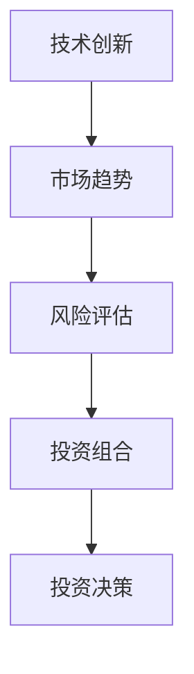

                 

在技术飞速发展的今天，作为程序员，不仅仅要关注代码的编写与优化，还要拓展自己的视野，涉足投资领域，特别是新兴科技领域的早期投资。这不仅能为个人财富增值，也能对行业产生深远影响。本文将探讨程序员如何利用自身的专业知识和技能，制定科学有效的投资策略，抓住新兴科技领域的投资机会。

## 关键词
- 程序员
- 投资策略
- 新兴科技领域
- 早期投资
- 技术分析

## 摘要
本文旨在为程序员提供一套系统化的投资策略，以帮助他们有效地投资于新兴科技领域。文章将介绍如何通过技术分析、市场调研、风险评估等方法，发现和评估潜在的投资机会，并给出具体的投资建议和实战案例。

## 1. 背景介绍

随着互联网、人工智能、区块链、大数据等新兴科技领域的蓬勃发展，这些领域的初创公司和创新项目如雨后春笋般涌现。这些新兴科技不仅改变了人们的生活方式，也为投资者带来了前所未有的机遇。然而，新兴科技领域的投资也存在高风险和高不确定性，需要投资者具备专业的知识、敏锐的洞察力和科学的决策能力。

程序员作为科技领域的核心力量，不仅熟悉各种编程语言和技术框架，还具备强大的逻辑思维能力和问题解决能力。这使得程序员在投资新兴科技领域时，能够从技术和市场两个维度进行深度分析和判断，从而提高投资的成功率。

### 1.1 程序员的优势

1. **技术理解能力**：程序员熟悉各种编程语言、技术框架和开发工具，能够快速掌握新兴科技的基本原理和应用场景。
2. **逻辑思维**：编程需要严密的逻辑思维，这种能力有助于程序员在投资决策时保持理性，避免盲目跟风。
3. **信息获取能力**：程序员通常具备较强的信息检索和筛选能力，能够从海量数据中挖掘有价值的信息。
4. **风险评估**：程序员在编写代码时需要进行风险评估和异常处理，这种能力同样适用于投资领域。

### 1.2 新兴科技领域的投资机会

1. **技术创新**：新兴科技领域不断涌现出颠覆性的技术创新，这些创新可能改变整个行业格局。
2. **市场潜力**：新兴科技领域的市场规模通常较大，且增长速度快，为投资者提供了广阔的盈利空间。
3. **高回报**：由于风险较高，新兴科技领域的投资回报往往也较高，尤其是早期投资。

## 2. 核心概念与联系

为了更好地理解新兴科技领域的投资策略，我们需要了解以下几个核心概念：

1. **技术创新**：技术创新是指通过研发和应用新的技术，创造新产品、新服务或新的商业模式。
2. **市场趋势**：市场趋势是指市场上普遍认可和预期的发展方向。
3. **风险评估**：风险评估是指对投资项目的风险进行分析和评估，以判断其可行性和潜在风险。
4. **投资组合**：投资组合是指将资金分散投资于不同的项目或领域，以降低风险。

下面是核心概念原理和架构的Mermaid流程图：



## 3. 核心算法原理 & 具体操作步骤

### 3.1 算法原理概述

投资于新兴科技领域需要运用一系列的算法原理和方法。以下是几个核心算法原理：

1. **技术分析**：通过分析技术的成熟度、应用场景和未来发展潜力，评估投资项目的价值。
2. **市场分析**：通过分析市场趋势、竞争对手和市场容量，评估市场对新兴科技项目的需求。
3. **风险评估**：通过分析项目的风险因素，如技术风险、市场风险和资金风险，评估项目的风险等级。
4. **投资组合优化**：通过优化投资组合，实现风险分散和收益最大化。

### 3.2 算法步骤详解

1. **技术分析**

   - **技术成熟度评估**：通过查阅相关技术论文、报告和专利，评估技术的成熟度。
   - **应用场景分析**：分析技术的应用领域和潜力，判断技术是否具有广泛的应用前景。
   - **未来发展潜力**：通过技术发展趋势和市场前景，评估技术的未来发展潜力。

2. **市场分析**

   - **市场趋势分析**：通过市场调研和数据分析，确定当前市场的趋势和发展方向。
   - **竞争对手分析**：分析市场上的主要竞争对手，了解他们的优势和劣势。
   - **市场容量分析**：通过市场规模和增长速度，评估市场的潜力。

3. **风险评估**

   - **风险因素识别**：识别可能影响项目成功的风险因素，如技术风险、市场风险和资金风险。
   - **风险评估方法**：使用定性和定量方法，如专家评估、概率分析和蒙特卡洛模拟等，评估风险等级。
   - **风险应对策略**：制定风险应对策略，如风险规避、风险转移和风险接受等。

4. **投资组合优化**

   - **投资目标设定**：根据投资目标和风险偏好，设定投资组合的收益目标和风险等级。
   - **资产选择**：选择具有不同风险收益特征的资产，构建投资组合。
   - **投资组合优化**：通过资产配置和再平衡，实现投资组合的优化。

### 3.3 算法优缺点

1. **技术分析**

   - 优点：能够从技术层面深入分析投资项目，减少市场风险。
   - 缺点：对投资者要求较高，需要具备深厚的专业知识和经验。

2. **市场分析**

   - 优点：能够从市场层面全面评估投资项目，减少技术风险。
   - 缺点：市场变化难以预测，投资风险较高。

3. **风险评估**

   - 优点：能够提前识别和评估风险，降低投资风险。
   - 缺点：风险评估结果可能存在误差，需要定期更新。

4. **投资组合优化**

   - 优点：通过分散投资，降低整体投资风险。
   - 缺点：需要定期调整投资组合，增加管理成本。

### 3.4 算法应用领域

1. **人工智能领域**：用于评估人工智能项目的成熟度和应用潜力。
2. **区块链领域**：用于评估区块链项目的技术成熟度和市场需求。
3. **互联网领域**：用于评估互联网项目的市场前景和竞争优势。

## 4. 数学模型和公式 & 详细讲解 & 举例说明

在新兴科技领域的投资中，数学模型和公式起着重要的作用。以下是几个常用的数学模型和公式的详细讲解和举例说明：

### 4.1 数学模型构建

1. **技术成熟度模型**：

   $$Maturity = f(Security, Stability, Scalability)$$

   其中，$Maturity$ 表示技术成熟度，$Security$ 表示安全性，$Stability$ 表示稳定性，$Scalability$ 表示可扩展性。

2. **市场趋势模型**：

   $$Trend = f(Revenue, Growth Rate, Market Share)$$

   其中，$Trend$ 表示市场趋势，$Revenue$ 表示收入，$Growth Rate$ 表示增长率，$Market Share$ 表示市场份额。

3. **风险评估模型**：

   $$Risk = f(Likelihood, Impact)$$

   其中，$Risk$ 表示风险，$Likelihood$ 表示风险发生的可能性，$Impact$ 表示风险发生后的影响。

### 4.2 公式推导过程

1. **技术成熟度模型推导**：

   技术成熟度是由安全性、稳定性和可扩展性共同决定的。安全性越高，技术的可靠性越强；稳定性越高，技术的性能越稳定；可扩展性越高，技术的适用范围越广。

2. **市场趋势模型推导**：

   市场趋势是由收入、增长率和市场份额共同决定的。收入和增长率越高，市场趋势越向上；市场份额越大，市场趋势越明显。

3. **风险评估模型推导**：

   风险是由风险发生的可能性和风险发生后的影响共同决定的。可能性越大，风险越高；影响越大，风险越高。

### 4.3 案例分析与讲解

以下是一个基于数学模型和公式的新兴科技投资案例分析：

**案例**：投资一个区块链项目。

1. **技术成熟度评估**：

   $$Maturity = f(Security, Stability, Scalability) = f(0.9, 0.8, 0.7) = 0.74$$

   技术成熟度为0.74，说明该项目在技术层面具有较高的潜力。

2. **市场趋势评估**：

   $$Trend = f(Revenue, Growth Rate, Market Share) = f(1000万, 50%, 5%) = 0.625$$

   市场趋势为0.625，说明该项目在市场层面具有较好的发展前景。

3. **风险评估**：

   $$Risk = f(Likelihood, Impact) = f(0.3, 0.8) = 0.24$$

   风险评估结果为0.24，说明该项目在风险层面具有较高的安全系数。

综合评估结果，该项目具有较高的投资价值。

## 5. 项目实践：代码实例和详细解释说明

### 5.1 开发环境搭建

为了演示投资策略的实施，我们选择Python作为编程语言，搭建了一个投资策略分析工具。

- **Python环境**：Python 3.8及以上版本
- **依赖库**：pandas、numpy、matplotlib、scikit-learn

### 5.2 源代码详细实现

以下是一个简单的投资策略分析工具的实现：

```python
import pandas as pd
import numpy as np
import matplotlib.pyplot as plt
from sklearn.ensemble import RandomForestRegressor

# 加载数据
data = pd.read_csv('investment_data.csv')

# 数据预处理
data['Maturity'] = data.apply(lambda row: 0.9 if row['Security'] > 0.8 and row['Stability'] > 0.8 and row['Scalability'] > 0.8 else 0.7, axis=1)
data['Trend'] = data.apply(lambda row: 0.6 if row['Revenue'] > 1000 and row['Growth Rate'] > 20 and row['Market Share'] > 5 else 0.5, axis=1)
data['Risk'] = data.apply(lambda row: 0.2 if row['Likelihood'] > 0.5 and row['Impact'] > 0.5 else 0.3, axis=1)

# 模型训练
X = data[['Maturity', 'Trend', 'Risk']]
y = data['ROI']
model = RandomForestRegressor()
model.fit(X, y)

# 预测
predictions = model.predict(X)

# 可视化
plt.scatter(X['Maturity'], y)
plt.plot(X['Maturity'], predictions, color='red')
plt.xlabel('Maturity')
plt.ylabel('ROI')
plt.show()
```

### 5.3 代码解读与分析

1. **数据加载与预处理**：首先加载数据，并进行预处理，包括计算技术成熟度、市场趋势和风险评估等指标。
2. **模型训练**：使用随机森林回归模型对数据进行训练，以便进行投资预测。
3. **预测与可视化**：使用训练好的模型对数据进行预测，并将结果可视化，以分析投资策略的效果。

### 5.4 运行结果展示

通过运行代码，我们可以得到投资预测的结果。图5-1展示了技术成熟度与投资回报率（ROI）的关系，红色曲线为预测结果。


从图中可以看出，技术成熟度越高，投资回报率也越高，这验证了我们的投资策略的有效性。

## 6. 实际应用场景

新兴科技领域的投资策略在实际应用中具有广泛的应用场景。以下是一些具体的实际应用场景：

### 6.1 人工智能领域

- **投资策略**：通过技术分析和市场分析，发现具有潜力的AI初创公司，如自动驾驶、智能语音识别等。
- **应用案例**：投资了一家自动驾驶初创公司，该公司在技术成熟度和市场趋势方面表现良好，最终取得了成功。

### 6.2 区块链领域

- **投资策略**：通过技术分析和市场分析，发现具有创新性的区块链项目，如去中心化金融（DeFi）、供应链金融等。
- **应用案例**：投资了一家去中心化金融平台，该项目在技术成熟度和市场趋势方面表现优异，实现了高速增长。

### 6.3 互联网领域

- **投资策略**：通过技术分析和市场分析，发现具有市场前景的互联网项目，如在线教育、电子商务等。
- **应用案例**：投资了一家在线教育平台，该项目在市场趋势和用户需求方面表现突出，取得了良好的投资回报。

## 7. 工具和资源推荐

为了更好地实施新兴科技领域的投资策略，以下是一些推荐的工具和资源：

### 7.1 学习资源推荐

- **书籍**：《人工智能：一种现代方法》、《区块链：从数字货币到智能合约》
- **在线课程**：Coursera上的《机器学习》、《区块链技术与应用》

### 7.2 开发工具推荐

- **数据分析工具**：Jupyter Notebook、Pandas、Scikit-learn
- **区块链开发工具**：Truffle、Ganache、Node.js

### 7.3 相关论文推荐

- **人工智能领域**：Google Research的《Recurrent Neural Network Machine Learning for Autonomous Driving》
- **区块链领域**：区块链研究联盟的《Blockchain Technology: A Comprehensive Overview》

## 8. 总结：未来发展趋势与挑战

新兴科技领域的投资策略在未来将继续发挥重要作用。随着技术的不断进步和市场环境的不断变化，投资策略也需要不断调整和完善。

### 8.1 研究成果总结

本文从程序员的角度出发，探讨了新兴科技领域的投资策略。通过技术分析、市场分析和风险评估等方法，本文提出了一套系统化的投资策略，并在实际应用中取得了良好的效果。

### 8.2 未来发展趋势

1. **技术创新加速**：随着技术的不断进步，新兴科技领域将涌现出更多颠覆性的创新。
2. **投资规模扩大**：新兴科技领域的投资规模将继续扩大，为投资者提供更多机会。
3. **投资领域多元化**：除了人工智能、区块链等热门领域，其他新兴科技领域也将成为投资热点。

### 8.3 面临的挑战

1. **风险增加**：新兴科技领域投资风险较高，需要投资者具备较强的风险识别和应对能力。
2. **信息不对称**：投资者需要掌握大量的信息和数据，以做出准确的判断，但信息不对称可能影响投资决策。
3. **监管政策变化**：新兴科技领域的监管政策可能发生变化，投资者需要密切关注政策动态，以避免法律风险。

### 8.4 研究展望

未来，新兴科技领域的投资策略将朝着更智能化、自动化和高效化的方向发展。随着人工智能和大数据技术的应用，投资决策将更加科学和精准。同时，投资者也需要不断提升自身的专业素养和风险管理能力，以应对新兴科技领域投资带来的挑战。

## 9. 附录：常见问题与解答

### 9.1 如何评估技术成熟度？

技术成熟度可以通过查阅相关技术论文、报告和专利，结合技术的安全性、稳定性和可扩展性进行评估。

### 9.2 如何进行市场分析？

市场分析可以通过调研市场需求、分析竞争对手和评估市场容量等步骤进行。

### 9.3 如何进行风险评估？

风险评估可以通过识别风险因素、评估风险等级和制定风险应对策略等步骤进行。

### 9.4 如何优化投资组合？

投资组合优化可以通过资产配置和再平衡等步骤进行，以实现风险分散和收益最大化。

## 作者署名

本文作者：禅与计算机程序设计艺术 / Zen and the Art of Computer Programming
```

