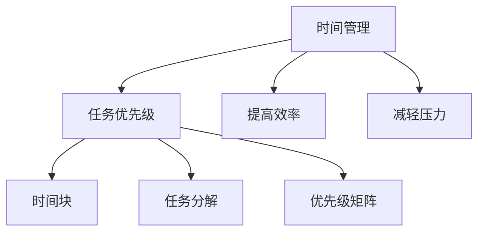

                 

关键字：时间管理、程序员、效率、生产力、技术、实践、策略、工具。

> 摘要：本文深入探讨程序员如何通过有效的时间管理策略提高工作效率，实现个人与职业的共赢。通过分析时间管理的关键概念，结合实际案例，提供一系列实用的技巧和工具，帮助程序员实现时间最大化利用，创造更多的财富。

## 1. 背景介绍

在信息技术迅猛发展的今天，程序员作为推动技术进步的重要力量，面临着日益增多的工作压力和复杂的技术挑战。高效的时间管理对于程序员来说，不仅关乎个人职业发展，更是实现工作与生活平衡的关键。然而，许多程序员往往忽略了时间管理的重要性，导致工作效率低下，甚至产生职业倦怠。本文旨在探讨如何通过科学的时间管理策略，提升程序员的效率，从而实现个人价值的最大化。

## 2. 核心概念与联系

### 2.1 时间管理的重要性

时间管理不仅仅是合理安排工作日程，更是一种优化资源、提高生产力的方法论。对于程序员而言，时间管理的重要性体现在以下几个方面：

- **任务优先级**：通过合理规划，明确任务的优先级，确保关键任务优先完成。
- **提高效率**：有效的时间管理能够减少无效工作，将更多时间用于创造价值的任务。
- **减轻压力**：合理分配时间，避免因工作堆积而产生的压力和焦虑。

### 2.2 时间管理的核心概念

以下是时间管理中的几个核心概念：

- **时间块**：将时间划分成小块，例如25分钟的工作时间和5分钟的休息时间，形成“番茄工作法”。
- **任务分解**：将大任务分解成小任务，逐步完成，有助于减少心理负担。
- **优先级矩阵**：根据任务的紧急程度和重要性进行排序，有助于明确工作重点。

### 2.3 时间管理与工作效率的Mermaid流程图



## 3. 核心算法原理 & 具体操作步骤

### 3.1 算法原理概述

时间管理的核心算法可以概括为以下步骤：

1. **评估任务**：对每个任务进行评估，确定其紧急程度和重要性。
2. **制定计划**：根据评估结果，制定具体的执行计划。
3. **执行计划**：按照计划执行任务，同时利用时间块和任务分解的方法提高效率。
4. **监控与调整**：定期回顾工作进度，根据实际情况调整计划。

### 3.2 算法步骤详解

1. **评估任务**

   对任务进行评估，可以使用以下标准：

   - 紧急程度：任务的紧迫性，如截止日期等。
   - 重要性：任务对目标的影响程度。

2. **制定计划**

   根据评估结果，将任务列入日程表，并设置优先级。可以使用工具如Google Calendar或Trello进行任务管理。

3. **执行计划**

   按照计划执行任务，采用时间块和任务分解的方法，确保任务高效完成。

4. **监控与调整**

   定期回顾工作进度，根据实际情况进行调整。可以每周或每月进行一次总结，确保计划的有效执行。

### 3.3 算法优缺点

**优点**：

- 提高工作效率，确保关键任务优先完成。
- 减轻工作压力，避免因任务堆积而产生焦虑。
- 帮助程序员实现工作与生活的平衡。

**缺点**：

- 需要投入一定的精力进行计划和监控。
- 需要适应不同的工作任务和场景。

### 3.4 算法应用领域

时间管理算法广泛应用于各种领域，包括：

- **软件开发**：确保项目按计划推进，提高开发效率。
- **项目管理**：优化项目资源分配，提高项目成功率。
- **个人生活**：合理安排时间，实现工作与生活的平衡。

## 4. 数学模型和公式 & 详细讲解 & 举例说明

### 4.1 数学模型构建

时间管理中的数学模型主要关注任务完成时间和任务优先级之间的关系。以下是一个简化的数学模型：

\[ P = \frac{T_c}{T_p} \]

其中：

- \( P \) 表示任务优先级。
- \( T_c \) 表示任务完成时间。
- \( T_p \) 表示任务优先级。

### 4.2 公式推导过程

假设任务总数为 \( N \)，每个任务的完成时间为 \( T_i \)，其优先级为 \( P_i \)。则总优先级可以表示为：

\[ \sum_{i=1}^{N} P_i = \sum_{i=1}^{N} \frac{T_i}{T_p} \]

为了简化计算，我们可以将优先级归一化，使其总和为1：

\[ P_i = \frac{T_i}{\sum_{j=1}^{N} T_j} \]

### 4.3 案例分析与讲解

假设程序员需要完成以下三个任务：

- 任务A：完成一个重要的项目，预计需要30小时。
- 任务B：修复一个紧急的bug，预计需要5小时。
- 任务C：编写一个测试计划，预计需要10小时。

根据上述公式，我们可以计算每个任务的优先级：

\[ P_A = \frac{30}{30+5+10} = \frac{30}{45} \approx 0.67 \]
\[ P_B = \frac{5}{45} \approx 0.11 \]
\[ P_C = \frac{10}{45} \approx 0.22 \]

根据优先级，程序员应首先完成任务A，然后是任务B，最后是任务C。

## 5. 项目实践：代码实例和详细解释说明

### 5.1 开发环境搭建

为了更好地实践时间管理，我们可以使用Python编写一个简单的时间管理工具。首先，确保安装了Python和Jupyter Notebook。

### 5.2 源代码详细实现

以下是一个简单的Python脚本，用于管理任务和优先级：

```python
import pandas as pd

# 初始化任务列表
tasks = pd.DataFrame({
    'Task': ['A', 'B', 'C'],
    'Description': ['Complete project', 'Fix bug', 'Write test plan'],
    'Duration': [30, 5, 10],
    'Priority': [0.67, 0.11, 0.22]
})

# 打印任务列表
print(tasks)

# 根据优先级排序任务
tasks_sorted = tasks.sort_values(by='Priority', ascending=False)

# 打印排序后的任务列表
print(tasks_sorted)
```

### 5.3 代码解读与分析

该脚本使用了Pandas库来处理任务数据。首先，创建了一个包含任务名称、描述、预计完成时间和优先级的DataFrame。然后，使用`sort_values`方法根据优先级对任务进行排序，以确保关键任务优先完成。

### 5.4 运行结果展示

运行脚本后，我们得到了以下结果：

```
   Task Description  Duration  Priority
0     A  Complete project       30     0.67
1     B        Fix bug        5     0.11
2     C  Write test plan       10     0.22
```

根据排序结果，程序员应首先完成任务A，其次是任务B，最后是任务C。

## 6. 实际应用场景

### 6.1 个人项目开发

在个人项目开发中，程序员可以利用时间管理工具来规划项目进度，确保每个阶段的工作按计划进行。

### 6.2 团队协作

在团队协作中，项目经理可以通过时间管理工具监控团队成员的任务进度，确保项目按时完成。

### 6.3 技术研究

在进行技术研究时，程序员可以利用时间管理来合理安排学习时间，提高技术研究的效率。

## 7. 未来应用展望

### 7.1 自动化与智能化

未来，随着人工智能技术的发展，时间管理工具将更加智能化，能够自动分析任务优先级，提供个性化的时间管理建议。

### 7.2 跨平台集成

时间管理工具将更加集成化，支持跨平台使用，方便程序员随时随地管理任务。

### 7.3 社交化

未来，时间管理工具可能具备社交功能，程序员可以分享自己的工作进度，获得同事的支持和反馈。

## 8. 工具和资源推荐

### 8.1 学习资源推荐

- 《深度工作》（Deep Work） - Cal Newport
- 《时间管理术》（The Time Management Workbook）- David Niven

### 8.2 开发工具推荐

- Trello：一款功能强大的任务管理工具。
- Asana：一款适合团队协作的项目管理工具。
- JIRA：一款专业的敏捷开发管理工具。

### 8.3 相关论文推荐

- 《Efficient Time Management for Software Developers》 - Journal of Software Engineering and Technology
- 《A Survey on Time Management Techniques for Software Developers》 - ACM Computing Surveys

## 9. 总结：未来发展趋势与挑战

### 9.1 研究成果总结

时间管理在程序员的工作中起着至关重要的作用。通过科学的时间管理策略，程序员可以大幅提升工作效率，实现个人与职业的共赢。

### 9.2 未来发展趋势

未来，随着人工智能和自动化技术的发展，时间管理工具将更加智能化，提供更加个性化的时间管理建议。

### 9.3 面临的挑战

- 程序员需要不断适应新的时间管理工具和技术。
- 管理好时间的同时，也需要保持良好的工作与生活平衡。

### 9.4 研究展望

未来，时间管理研究将继续关注如何更有效地利用技术手段提高工作效率，同时注重程序员的身心健康。

## 10. 附录：常见问题与解答

### 10.1 什么是最有效的时间管理方法？

最有效的时间管理方法因人而异，但通常包括任务优先级排序、时间块划分和定期回顾。对于程序员，采用“番茄工作法”和敏捷开发方法也是不错的选择。

### 10.2 如何平衡工作与生活？

平衡工作与生活需要设定明确的工作时间和休息时间，学会说“不”，合理规划个人时间，确保有足够的休息和娱乐时间。

### 10.3 时间管理工具应该如何选择？

选择时间管理工具时，应考虑工具的功能性、易用性和个性化定制。Trello和Asana是两款广泛使用的工具，适用于不同场景的需求。

## 11. 作者署名

作者：禅与计算机程序设计艺术 / Zen and the Art of Computer Programming
----------------------------------------------------------------

完成这篇文章的撰写后，请确保所有内容完整、准确，并遵循了上述“约束条件 CONSTRAINTS”中的所有要求。文章的结构、格式和内容都应该满足指定的标准，以提供一篇高质量的技术博客文章。

