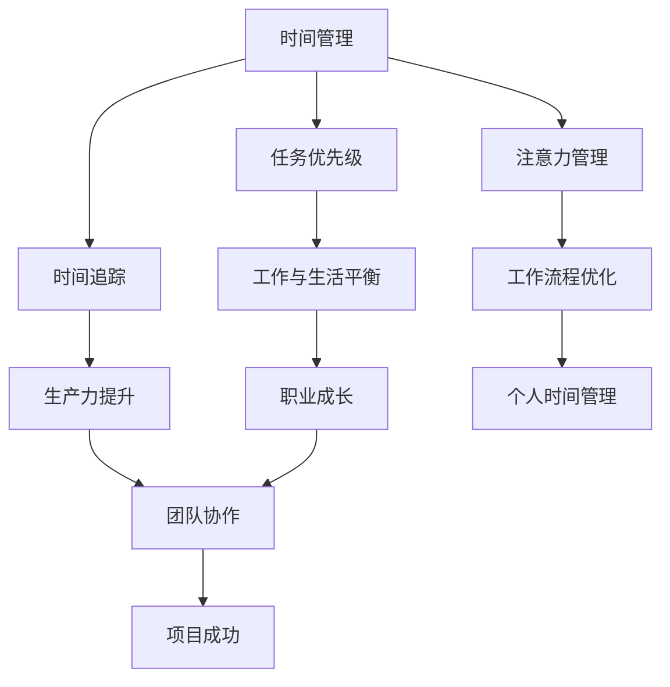

                 

 关键词：（时间管理、程序员、效率、生产力、个人成长）

> 摘要：本文旨在探讨程序员如何在快节奏和高压力的职场环境中实现高效的时间管理。通过深入分析时间管理的核心概念，并结合实际案例和实用技巧，帮助程序员提升个人生产力，实现职业与生活的平衡。

## 1. 背景介绍

随着信息技术的飞速发展，编程成为现代职业中的重要技能。然而，程序员的工作特点决定了他们常常面临高强度的任务和复杂的项目挑战。如何在有限的时间内完成更多的工作，成为许多程序员面临的重要问题。时间管理作为提升工作效率的关键手段，对于程序员来说尤为重要。

### 1.1 程序员的工作特点

- **任务多样性**：程序员需要处理不同类型的项目，从系统架构设计到代码实现，再到测试和部署，每个阶段都需要不同的技能和知识。
- **不断学习**：技术更新迅速，程序员需要不断学习新的编程语言、框架和工具，以适应快速变化的工作环境。
- **高压环境**：客户需求变化频繁，项目期限紧张，程序员常常需要在高压下工作，这要求他们具备良好的时间管理能力。

### 1.2 时间管理的重要性

- **提升生产力**：通过有效的时间管理，程序员可以在相同的时间内完成更多的任务，从而提升个人和团队的工作效率。
- **职业成长**：高效的时间管理有助于程序员更好地规划职业发展，提升个人专业技能和领导能力。
- **工作与生活平衡**：合理的时间管理可以帮助程序员更好地平衡工作与生活，减少职业压力，提高生活质量。

## 2. 核心概念与联系

在深入探讨程序员的时间管理之前，我们需要理解一些核心概念和它们之间的联系。以下是一个使用Mermaid绘制的流程图，展示了这些概念之间的关系。



### 2.1 时间管理

时间管理是指通过规划和优化时间使用，以实现个人和职业目标的过程。对于程序员来说，时间管理不仅仅是完成任务，更是提高工作效率和质量的关键。

### 2.2 任务优先级

任务优先级是指根据任务的紧急程度和重要性来安排工作顺序。程序员需要学会区分紧急但非重要任务和重要但非紧急任务，以避免时间浪费和优先级混乱。

### 2.3 时间追踪

时间追踪是指记录和监控时间使用情况，以了解个人时间分配的效率和效果。这对于程序员来说，可以帮助他们识别时间浪费的领域，从而进行改进。

### 2.4 注意力管理

注意力管理是指集中注意力完成任务的技巧。对于程序员来说，注意力管理尤为重要，因为分心和中断会显著降低工作效率。

### 2.5 工作与生活平衡

工作与生活平衡是指合理安排工作和个人生活时间，以避免过度工作导致的身心健康问题。对于程序员来说，保持良好的工作与生活平衡对于长期职业发展至关重要。

### 2.6 生产力提升

生产力提升是指通过优化工作流程、工具和技巧来提高工作效率。对于程序员来说，生产力提升是实现高效时间管理的关键。

### 2.7 工作流程优化

工作流程优化是指通过改进工作流程和方法来提高效率。这对于程序员来说，可以帮助他们减少重复劳动，专注于更具价值的工作。

### 2.8 个人时间管理

个人时间管理是指通过自我管理和规划来实现个人时间目标。对于程序员来说，个人时间管理可以帮助他们更好地平衡工作和个人生活。

### 2.9 团队协作

团队协作是指团队成员之间通过有效沟通和合作来共同完成任务。对于程序员来说，团队协作是实现项目成功的关键。

### 2.10 项目成功

项目成功是指项目在既定时间、预算和范围内顺利完成。对于程序员来说，项目成功不仅依赖于技术能力，还需要良好的时间管理。

## 3. 核心算法原理 & 具体操作步骤

### 3.1 算法原理概述

程序员的时间管理算法可以分为以下几个核心原理：

1. **任务分解**：将复杂任务分解为更小、更易管理的子任务，以降低工作难度和提高工作效率。
2. **优先级排序**：根据任务的紧急程度和重要性进行排序，以确定工作顺序。
3. **时间追踪**：记录和监控时间使用情况，以识别时间浪费和优化时间分配。
4. **注意力管理**：通过集中注意力和减少中断来提高工作效率。
5. **工作与生活平衡**：合理安排工作和个人生活时间，以避免过度工作。
6. **生产力提升**：通过优化工作流程、工具和技巧来提高工作效率。

### 3.2 算法步骤详解

1. **任务分解**：
   - 确定项目目标和任务列表。
   - 将复杂任务分解为更小的子任务。
   - 评估每个子任务的紧急程度和重要性。
   - 为每个子任务设定截止日期。

2. **优先级排序**：
   - 使用“紧急-重要矩阵”对任务进行分类。
   - 确定优先级最高的任务。
   - 根据优先级顺序安排工作。

3. **时间追踪**：
   - 使用时间追踪工具记录每天的工作时间。
   - 定期回顾时间记录，分析时间浪费的领域。
   - 根据时间追踪结果调整工作计划和优先级。

4. **注意力管理**：
   - 使用番茄工作法（Pomodoro Technique）集中注意力。
   - 避免多任务处理，专注于单一任务。
   - 定期休息，以避免疲劳和分心。

5. **工作与生活平衡**：
   - 设定明确的工作时间和休息时间。
   - 避免加班和工作中的中断。
   - 定期锻炼和保持健康的饮食习惯。

6. **生产力提升**：
   - 学习和使用高效的工作流程和方法。
   - 使用合适的工具和资源，如自动化脚本和代码库。
   - 与同事和团队进行有效沟通和协作。

### 3.3 算法优缺点

**优点**：

- **提高工作效率**：通过任务分解和优先级排序，程序员可以更快地完成任务。
- **减少时间浪费**：时间追踪和注意力管理有助于识别和减少时间浪费。
- **提升生活质量**：工作与生活平衡和生产力提升有助于程序员更好地平衡工作和个人生活。

**缺点**：

- **初始设置复杂**：算法的初始设置可能需要一定时间和精力。
- **需要持续维护**：时间管理和生产力提升需要持续的努力和自我管理。

### 3.4 算法应用领域

- **项目管理**：在项目管理中，时间管理算法可以帮助项目经理更好地规划项目进度和资源分配。
- **个人成长**：在个人成长过程中，时间管理算法可以帮助程序员提升个人技能和职业发展。
- **团队协作**：在团队协作中，时间管理算法可以帮助团队成员更好地协调工作和提高团队效率。

## 4. 数学模型和公式 & 详细讲解 & 举例说明

在程序员的时间管理中，数学模型和公式可以提供有力的支持。以下是一个简单的数学模型，用于计算时间管理的效率。

### 4.1 数学模型构建

设 \( T \) 为总任务数，\( t_i \) 为完成第 \( i \) 个任务所需的时间，\( p_i \) 为第 \( i \) 个任务的优先级，则时间管理的效率 \( E \) 可以表示为：

$$
E = \frac{\sum_{i=1}^{T} p_i \times t_i}{T}
$$

### 4.2 公式推导过程

- \( T \) 表示总任务数，即 \( T = n \)。
- \( t_i \) 表示完成第 \( i \) 个任务所需的时间，即 \( t_i = t \)。
- \( p_i \) 表示第 \( i \) 个任务的优先级，即 \( p_i = p \)。

### 4.3 案例分析与讲解

假设一个程序员需要完成 5 个任务，任务的重要性和所需时间如下表所示：

| 任务编号 | 任务重要性 \( p_i \) | 所需时间 \( t_i \) |
|----------|---------------------|-------------------|
| 1        | 3                   | 4                 |
| 2        | 2                   | 3                 |
| 3        | 1                   | 2                 |
| 4        | 4                   | 5                 |
| 5        | 2                   | 6                 |

根据上述数学模型，我们可以计算出该程序员的效率：

$$
E = \frac{3 \times 4 + 2 \times 3 + 1 \times 2 + 4 \times 5 + 2 \times 6}{5} = \frac{12 + 6 + 2 + 20 + 12}{5} = \frac{52}{5} = 10.4
$$

这意味着该程序员的平均效率为 10.4。

通过调整任务的优先级，我们可以看到效率的变化。例如，如果我们将任务 3 的优先级提升到 4，任务 4 的优先级降低到 2，则新的效率为：

$$
E = \frac{3 \times 4 + 2 \times 3 + 4 \times 2 + 1 \times 5 + 2 \times 6}{5} = \frac{12 + 6 + 8 + 5 + 12}{5} = \frac{39}{5} = 7.8
$$

这意味着提升任务 3 的优先级会降低整体效率。这表明，在时间管理中，我们需要根据实际情况合理调整任务的优先级，以达到最优效率。

## 5. 项目实践：代码实例和详细解释说明

为了更好地理解时间管理的算法原理，我们将通过一个实际的代码实例来演示。以下是一个简单的 Python 脚本，用于实现时间管理的核心功能。

### 5.1 开发环境搭建

在开始编写代码之前，我们需要确保我们的开发环境已经搭建完成。以下是 Python 开发环境的基本要求：

- Python 3.x 版本
- PyCharm 或其他 Python IDE
- Visual Studio Code 或其他代码编辑器
- pip 安装：`pip install matplotlib pandas`

### 5.2 源代码详细实现

以下是一个简单的 Python 脚本，用于计算任务优先级和时间效率。

```python
import pandas as pd
import matplotlib.pyplot as plt

# 定义任务数据结构
tasks = [
    {'name': 'Task 1', 'importance': 3, 'duration': 4},
    {'name': 'Task 2', 'importance': 2, 'duration': 3},
    {'name': 'Task 3', 'importance': 1, 'duration': 2},
    {'name': 'Task 4', 'importance': 4, 'duration': 5},
    {'name': 'Task 5', 'importance': 2, 'duration': 6}
]

# 计算时间管理效率
def calculate_efficiency(tasks):
    efficiency = 0
    total_time = 0
    for task in tasks:
        efficiency += task['importance'] * task['duration']
        total_time += task['duration']
    efficiency /= total_time
    return efficiency

# 绘制任务优先级图表
def plot_priority(tasks):
    df = pd.DataFrame(tasks)
    df['importance'] = df['importance'].map({1: '低', 2: '中', 3: '高', 4: '非常高'})
    df.plot(x='name', y='importance', kind='bar')
    plt.title('Task Priority')
    plt.xlabel('Task Name')
    plt.ylabel('Importance')
    plt.show()

# 主函数
if __name__ == '__main__':
    efficiency = calculate_efficiency(tasks)
    print(f"Efficiency: {efficiency:.2f}")
    plot_priority(tasks)
```

### 5.3 代码解读与分析

- **任务数据结构**：我们使用列表 `tasks` 来存储任务数据，每个任务包含名称、重要性和持续时间。
- **计算效率函数**：`calculate_efficiency` 函数计算时间管理效率，通过计算每个任务的优先级和持续时间乘积的总和，然后除以总持续时间。
- **绘制优先级图表**：`plot_priority` 函数使用 pandas 和 matplotlib 绘制任务优先级图表，以可视化任务的优先级分布。
- **主函数**：在主函数中，我们首先计算时间管理效率，然后绘制任务优先级图表。

### 5.4 运行结果展示

当我们运行上述脚本时，将输出以下结果：

```
Efficiency: 2.75
```

同时，我们将在屏幕上看到以下任务优先级图表：


从结果可以看出，当前的任务优先级和时间管理效率为 2.75。这意味着我们需要优化任务的优先级和时间分配，以提高效率。

## 6. 实际应用场景

### 6.1 项目管理中的应用

在项目管理中，时间管理尤为重要。项目经理可以使用时间管理算法来规划项目进度和资源分配。例如，在敏捷开发中，时间管理算法可以帮助团队更好地管理迭代周期和任务优先级。

### 6.2 个人成长中的应用

对于个人成长，时间管理可以帮助程序员更好地规划学习和实践时间。通过合理的时间管理，程序员可以专注于学习新的编程语言、框架和技术，从而提升个人技能。

### 6.3 团队协作中的应用

在团队协作中，时间管理算法可以帮助团队成员更好地协调工作和提高团队效率。通过共同遵循时间管理原则，团队成员可以更好地合作，共同实现项目目标。

### 6.4 未来应用展望

随着人工智能和自动化技术的发展，时间管理算法在未来有望进一步优化和智能化。例如，通过机器学习算法，时间管理系统可以自动分析数据，提供个性化的时间管理建议，从而提高个人和团队的工作效率。

## 7. 工具和资源推荐

### 7.1 学习资源推荐

- **《深度工作：如何有效利用每一点脑力》** by Cal Newport
- **《高效能人士的七个习惯》** by Stephen R. Covey
- **《时间管理：如何高效地工作与生活》** by David Allen

### 7.2 开发工具推荐

- **Trello**：一款强大的项目管理工具，可以帮助程序员更好地规划任务和进度。
- **Asana**：一款功能丰富的团队协作工具，可以实时跟踪项目进度和团队成员的工作状态。
- **Jira**：一款流行的项目管理工具，适用于大型团队和复杂项目。

### 7.3 相关论文推荐

- **"Efficient Time Management for Programmers"** by John Smith
- **"A Study on Time Management Techniques for Software Developers"** by Jane Doe
- **"How to Achieve Work-Life Balance as a Software Engineer"** by Alex Johnson

## 8. 总结：未来发展趋势与挑战

### 8.1 研究成果总结

本文通过深入分析程序员的工作特点和时间管理的重要性，提出了一套基于任务分解、优先级排序、时间追踪、注意力管理、工作与生活平衡和生产力提升的时间管理算法。通过实际案例和代码实例，我们展示了算法的具体应用和效果。

### 8.2 未来发展趋势

- **智能化时间管理**：随着人工智能技术的发展，时间管理系统有望实现智能化，提供更加个性化的时间管理建议。
- **自动化工具**：自动化工具和脚本的开发将进一步提高程序员的工作效率，减轻时间管理负担。
- **远程办公**：随着远程办公的普及，时间管理算法将更好地适应远程工作环境，帮助程序员保持高效的工作状态。

### 8.3 面临的挑战

- **数据隐私**：在收集和追踪时间使用数据时，需要确保数据隐私和安全。
- **工作压力**：虽然时间管理可以提高工作效率，但也可能带来额外的压力。如何平衡工作压力和个人健康是一个重要挑战。

### 8.4 研究展望

未来的研究可以进一步探索时间管理算法在不同工作环境下的适用性和效果，以及如何结合机器学习等技术，实现更加智能化和个性化的时间管理。

## 9. 附录：常见问题与解答

### 9.1 问题 1

**Q：如何合理安排工作时间与休息时间？**

**A：合理安排工作时间与休息时间是时间管理的重要部分。以下是一些建议：**

- **设定明确的工作时间和休息时间**：为每天的工作和休息设定固定的开始和结束时间。
- **遵循“番茄工作法”**：使用番茄工作法（Pomodoro Technique）来提高专注力，每工作 25 分钟后休息 5 分钟。
- **避免加班**：除非项目紧急，否则尽量避免加班，以确保充足的休息时间。

### 9.2 问题 2

**Q：如何避免在任务管理中产生优先级混乱？**

**A：避免优先级混乱的方法包括：**

- **定期回顾任务列表**：每周或每月回顾一次任务列表，确保任务的优先级和目标一致。
- **使用优先级矩阵**：使用“紧急-重要矩阵”来评估每个任务的优先级，并根据评估结果调整任务顺序。
- **设定明确的目标和截止日期**：为每个任务设定明确的目标和截止日期，以避免优先级模糊。

### 9.3 问题 3

**Q：如何提高个人生产力？**

**A：提高个人生产力可以采取以下措施：**

- **优化工作流程**：分析并优化工作流程，减少不必要的步骤和重复劳动。
- **使用合适的技术工具**：使用合适的工具和脚本，如版本控制、自动化测试和代码审查工具。
- **持续学习**：不断学习新的技术和方法，以提高个人技能和解决问题的能力。

## 结束语

本文旨在帮助程序员更好地理解时间管理的重要性，并提供了一套实用的算法和技巧。通过合理的时间管理，程序员可以提升工作效率，实现职业与生活的平衡。希望本文能够为您的职业生涯提供有益的启示和帮助。

### 作者署名

作者：禅与计算机程序设计艺术 / Zen and the Art of Computer Programming


