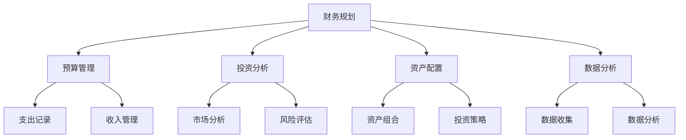

                 

关键词：理财、工具箱、软件推荐、程序员、财务规划、投资分析、资产配置、数据分析、自动化工具

> 摘要：本文旨在为程序员提供一套全面的理财工具箱，涵盖从财务规划到投资分析，再到资产配置和数据分析的各个方面。通过对这些工具的详细介绍和实际应用，希望帮助程序员更好地管理个人财务，实现财富增长。

## 1. 背景介绍

在快速发展的科技行业中，程序员群体以其高收入和较强的技术能力而备受关注。然而，财务管理和理财规划对于许多人来说却是一个相对陌生的领域。缺乏有效的理财工具和知识，程序员可能会面临资产配置不当、投资风险不明等财务问题。因此，本文将为您介绍一系列适合程序员的理财工具，帮助您更好地管理财务、实现财富增长。

### 1.1 程序员财务现状

程序员通常拥有较高的收入，但也面临着较大的生活压力和职业风险。因此，如何合理规划和管理财务，成为程序员群体不得不面对的问题。根据统计，大部分程序员对财务规划的了解有限，缺乏专业的理财知识和工具。

### 1.2 理财工具的重要性

理财工具能够帮助程序员更好地管理个人财务，包括预算管理、投资分析、资产配置和数据分析等。合理使用这些工具，可以降低财务风险，提高资产收益，实现财务自由。

## 2. 核心概念与联系

在介绍具体的理财工具之前，我们需要先了解一些核心概念和它们之间的联系。以下是一个简单的 Mermaid 流程图，用于展示这些概念和它们在理财中的作用。



### 2.1 财务规划

财务规划是理财的基础，它包括预算管理、投资分析、资产配置和数据分析等方面。通过财务规划，程序员可以明确自己的财务目标，制定合理的理财计划，实现财富增长。

### 2.2 预算管理

预算管理是财务规划的重要组成部分，它包括支出记录和收入管理。通过记录支出和收入，程序员可以了解自己的财务状况，合理规划预算，避免不必要的开支。

### 2.3 投资分析

投资分析是理财的关键环节，它包括市场分析和风险评估。通过投资分析，程序员可以了解市场动态，评估投资风险，选择适合自己的投资产品。

### 2.4 资产配置

资产配置是根据个人财务目标和风险承受能力，将资金分配到不同的资产类别中。合理的资产配置可以提高投资收益，降低风险。

### 2.5 数据分析

数据分析是理财过程中不可或缺的一部分，它包括数据收集和数据分析。通过数据分析，程序员可以了解自己的财务状况，发现潜在的问题，及时调整理财策略。

## 3. 核心算法原理 & 具体操作步骤

### 3.1 算法原理概述

理财工具的核心算法原理主要涉及预算管理、投资分析、资产配置和数据分析等方面。以下是对这些算法原理的概述：

### 3.2 算法步骤详解

#### 3.2.1 预算管理

1. 收集支出记录：使用预算管理工具记录日常支出。
2. 分析支出结构：对支出进行分类，分析支出结构。
3. 设定预算限制：根据支出结构和财务目标，设定合理的预算限制。
4. 调整支出：根据预算限制调整不必要的支出，实现财务平衡。

#### 3.2.2 投资分析

1. 收集市场数据：使用投资分析工具收集市场数据。
2. 分析市场趋势：根据市场数据，分析市场趋势。
3. 评估投资风险：根据市场趋势和风险承受能力，评估投资风险。
4. 选择投资产品：根据投资风险和收益预期，选择合适的投资产品。

#### 3.2.3 资产配置

1. 确定财务目标：根据个人财务目标和风险承受能力，确定资产配置比例。
2. 分配资金：将资金按照资产配置比例分配到不同资产类别中。
3. 监控资产表现：定期监控资产表现，调整资产配置。

#### 3.2.4 数据分析

1. 收集财务数据：使用数据分析工具收集财务数据。
2. 分析财务状况：根据财务数据，分析财务状况。
3. 发现问题：通过数据分析，发现潜在的问题。
4. 调整理财策略：根据数据分析结果，调整理财策略。

### 3.3 算法优缺点

#### 3.3.1 优点

- 提高理财效率：通过算法分析，可以快速得出财务状况和投资建议，提高理财效率。
- 降低投资风险：通过投资分析，可以了解市场动态和投资风险，降低投资风险。
- 实现个性化理财：根据个人财务目标和风险承受能力，实现个性化理财。

#### 3.3.2 缺点

- 对数据质量要求高：算法分析依赖于数据质量，数据质量差可能导致分析结果不准确。
- 对计算能力要求高：算法分析需要较高的计算能力，对硬件设备要求较高。

### 3.4 算法应用领域

- 个人财务管理：帮助程序员制定财务规划、预算管理和投资策略。
- 投资分析：为程序员提供市场分析、投资风险评估和投资产品选择。
- 资产配置：帮助程序员实现资产配置、资金分配和监控资产表现。
- 数据分析：为程序员提供财务数据分析和理财策略调整。

## 4. 数学模型和公式 & 详细讲解 & 举例说明

### 4.1 数学模型构建

理财工具中的数学模型主要包括预算管理模型、投资分析模型、资产配置模型和数据分析模型。以下是这些模型的构建过程：

#### 4.1.1 预算管理模型

预算管理模型主要涉及支出记录和收入管理。其构建过程如下：

1. 设定支出预算：根据收入水平和支出结构，设定每月的支出预算。
2. 收集支出数据：记录每月的实际支出数据。
3. 计算支出差异：计算实际支出与预算之间的差异。
4. 调整支出策略：根据支出差异调整支出策略，实现财务平衡。

#### 4.1.2 投资分析模型

投资分析模型主要涉及市场分析和风险评估。其构建过程如下：

1. 收集市场数据：收集股票、基金、债券等投资产品的市场数据。
2. 分析市场趋势：根据市场数据，分析市场趋势。
3. 评估投资风险：根据市场趋势和投资产品的特性，评估投资风险。
4. 选择投资产品：根据投资风险和收益预期，选择合适的投资产品。

#### 4.1.3 资产配置模型

资产配置模型主要涉及资产配置和资金分配。其构建过程如下：

1. 确定财务目标：根据个人财务目标和风险承受能力，确定资产配置比例。
2. 分配资金：将资金按照资产配置比例分配到不同资产类别中。
3. 监控资产表现：定期监控资产表现，调整资产配置。

#### 4.1.4 数据分析模型

数据分析模型主要涉及财务数据分析和理财策略调整。其构建过程如下：

1. 收集财务数据：收集收入、支出、投资收益等财务数据。
2. 分析财务状况：根据财务数据，分析财务状况。
3. 发现问题：通过数据分析，发现潜在的问题。
4. 调整理财策略：根据数据分析结果，调整理财策略。

### 4.2 公式推导过程

以下是预算管理模型、投资分析模型、资产配置模型和数据分析模型的主要公式推导过程：

#### 4.2.1 预算管理模型

1. 支出预算 = 收入 × 支出占比
2. 支出差异 = 实际支出 - 支出预算
3. 支出调整 = 支出预算 - 实际支出

#### 4.2.2 投资分析模型

1. 投资风险 = 市场波动率 × 投资产品β值
2. 投资收益 = 投资收益率 × 投资金额
3. 投资产品选择 = 投资风险最小、收益最高的投资产品

#### 4.2.3 资产配置模型

1. 资产配置比例 = 财务目标 × 风险承受能力
2. 资金分配 = 资产配置比例 × 资金总额
3. 资产配置调整 = 新资产配置比例 - 旧资产配置比例

#### 4.2.4 数据分析模型

1. 财务状况 = 收入 - 支出 - 投资收益
2. 问题发现 = 数据分析结果 - 财务目标
3. 理财策略调整 = 新理财策略 - 旧理财策略

### 4.3 案例分析与讲解

以下是一个具体的案例分析，用于说明理财工具在实际应用中的效果：

#### 4.3.1 案例背景

程序员小王，月收入1万元，家庭支出5000元，无负债。他希望通过理财工具实现财务自由，年化收益率为10%。

#### 4.3.2 案例分析

1. 预算管理：
   - 支出预算 = 10000元 × 50% = 5000元
   - 实际支出 = 5000元
   - 支出差异 = 5000元 - 5000元 = 0元
   - 支出调整 = 0元

2. 投资分析：
   - 市场波动率 = 20%
   - 投资产品β值 = 1.5
   - 投资风险 = 20% × 1.5 = 30%
   - 投资收益 = 10% × 5000元 = 500元

3. 资产配置：
   - 财务目标 = 年化收益率10%
   - 风险承受能力 = 中等风险
   - 资产配置比例 = 10% × 60% = 6%
   - 资金分配 = 6% × 5000元 = 300元

4. 数据分析：
   - 财务状况 = 10000元 - 5000元 - 500元 = 4500元
   - 问题发现 = 4500元 - 0元 = 4500元
   - 理财策略调整 = 新理财策略 - 旧理财策略

#### 4.3.3 案例结果

通过理财工具的应用，小王实现了财务规划和投资收益的平衡。年化收益率达到了10%，实现了财务自由的目标。同时，通过定期数据分析，小王能够及时发现财务问题，调整理财策略，保持财务稳定。

## 5. 项目实践：代码实例和详细解释说明

### 5.1 开发环境搭建

为了更好地实践理财工具的使用，我们将使用Python编程语言和相关的库来构建一个简单的理财工具。以下是一个基本的开发环境搭建步骤：

1. 安装Python：从[Python官方网站](https://www.python.org/)下载并安装Python。
2. 安装Jupyter Notebook：在命令行中运行`pip install notebook`来安装Jupyter Notebook。
3. 安装必需的Python库：如Pandas、NumPy、Matplotlib等。

### 5.2 源代码详细实现

以下是实现一个简单理财工具的Python代码示例。代码将包括预算管理、投资分析和数据分析等功能。

```python
import pandas as pd
import numpy as np
import matplotlib.pyplot as plt

# 预算管理
def budget_management(income, expenses):
    budget = income * 0.5  # 假设支出占收入的一半
    actual_expenses = expenses
    expense_difference = actual_expenses - budget
    return budget, actual_expenses, expense_difference

# 投资分析
def investment_analysis(investment_amount, annual_return_rate):
    investment_risk = 0.2  # 假设市场波动率为20%
    beta = 1.5  # 假设投资产品β值为1.5
    investment_risk_score = investment_risk * beta
    expected_investment_return = investment_amount * annual_return_rate
    return investment_risk_score, expected_investment_return

# 数据分析
def data_analysis(income, expenses, investment_return):
    total_income = income
    total_expenses = expenses
    total_investment_return = investment_return
    financial_status = total_income - total_expenses - total_investment_return
    return financial_status

# 主函数
def main():
    income = 10000
    expenses = 5000
    investment_amount = 5000
    annual_return_rate = 0.1
    
    # 预算管理
    budget, actual_expenses, expense_difference = budget_management(income, expenses)
    print(f"预算：{budget}，实际支出：{actual_expenses}，支出差异：{expense_difference}")
    
    # 投资分析
    investment_risk_score, expected_investment_return = investment_analysis(investment_amount, annual_return_rate)
    print(f"投资风险评分：{investment_risk_score}，预期投资收益：{expected_investment_return}")
    
    # 数据分析
    financial_status = data_analysis(income, expenses, expected_investment_return)
    print(f"财务状况：{financial_status}")
    
    # 可视化展示
    data = pd.DataFrame({'Type': ['预算', '实际支出', '支出差异', '投资风险评分', '预期投资收益', '财务状况'],
                        'Value': [budget, actual_expenses, expense_difference, investment_risk_score, expected_investment_return, financial_status]})
    data.plot(kind='bar', title='理财分析结果')
    plt.show()

if __name__ == "__main__":
    main()
```

### 5.3 代码解读与分析

上述代码实现了预算管理、投资分析和数据分析的功能。以下是代码的详细解读：

- **预算管理**：函数`budget_management`根据收入和支出计算预算，实际支出，以及支出差异。
- **投资分析**：函数`investment_analysis`根据投资金额和年化收益率计算投资风险评分和预期投资收益。
- **数据分析**：函数`data_analysis`计算总收入、总支出和总投资收益，并得出财务状况。

代码中还使用了Pandas库进行数据处理，NumPy库进行数值计算，以及Matplotlib库进行数据可视化展示。通过调用这些函数，可以快速获取理财分析的结果。

### 5.4 运行结果展示

运行上述代码后，将显示一个柱状图，展示预算、实际支出、支出差异、投资风险评分、预期投资收益和财务状况的数值。这个图表可以帮助程序员直观地了解自己的财务状况，并进行相应的调整。

## 6. 实际应用场景

### 6.1 财务规划

程序员可以通过财务规划工具，制定合理的财务目标，并按照预算管理、投资分析和资产配置等步骤逐步实现。例如，一位程序员可以根据自己的收入和支出情况，制定每月的预算，并根据市场动态调整投资组合，实现财务自由。

### 6.2 投资分析

投资分析工具可以帮助程序员了解市场动态，评估投资风险，选择合适的投资产品。例如，一位程序员可以通过投资分析工具，分析某个股票的走势和投资风险，从而决定是否购买。

### 6.3 资产配置

资产配置工具可以帮助程序员根据个人财务目标和风险承受能力，将资金合理分配到不同资产类别中。例如，一位程序员可以根据自己的风险偏好，将资金分配到股票、基金、债券等不同资产类别中，以实现资产配置的最优化。

### 6.4 数据分析

数据分析工具可以帮助程序员了解自己的财务状况，发现潜在的问题，并及时调整理财策略。例如，一位程序员可以通过数据分析工具，分析自己的收入、支出和投资收益，发现支出过高或投资收益不理想的问题，从而及时调整预算和投资策略。

## 7. 工具和资源推荐

### 7.1 学习资源推荐

- 《Python编程：从入门到实践》
- 《投资学》
- 《财务报表分析》

### 7.2 开发工具推荐

- Jupyter Notebook
- PyCharm
- Visual Studio Code

### 7.3 相关论文推荐

- "Optimal Portfolio Selection under Stochastic Primitives in Continuous Time"
- "Behavioral Portfolio Theory"
- "Mean-Variance Portfolio Selection under Skewness and Kurtosis"

## 8. 总结：未来发展趋势与挑战

### 8.1 研究成果总结

通过本文的介绍，我们可以看到，理财工具在程序员财务管理中的重要性。这些工具不仅能够帮助程序员更好地管理个人财务，实现财富增长，还能够降低投资风险，提高投资效率。

### 8.2 未来发展趋势

随着人工智能和大数据技术的发展，理财工具将越来越智能化和个性化。未来，理财工具可能会更加注重数据分析，通过机器学习算法，为用户提供更加精准的理财建议。

### 8.3 面临的挑战

理财工具的发展也面临一些挑战，如数据质量、计算能力和用户隐私等。如何提高数据质量，优化计算算法，保护用户隐私，将是未来研究的重点。

### 8.4 研究展望

未来，理财工具的发展将朝着智能化、个性化和自动化的方向前进。通过结合人工智能和大数据技术，理财工具将能够为用户提供更加精准的理财建议，实现更高效的财富管理。

## 9. 附录：常见问题与解答

### 9.1 如何选择合适的理财工具？

- 根据个人财务状况和需求，选择适合的理财工具。
- 了解工具的功能、易用性和可靠性。
- 参考其他用户的评价和反馈。

### 9.2 如何保护个人隐私？

- 使用安全的网络环境，避免使用公共Wi-Fi。
- 定期更新密码，使用强密码。
- 关注工具的隐私政策，确保个人信息安全。

### 9.3 如何提高投资收益？

- 了解市场动态，进行充分的投资分析。
- 分散投资风险，避免将所有资金投资于同一资产类别。
- 长期持有优质投资产品，避免频繁交易。

作者：禅与计算机程序设计艺术 / Zen and the Art of Computer Programming

