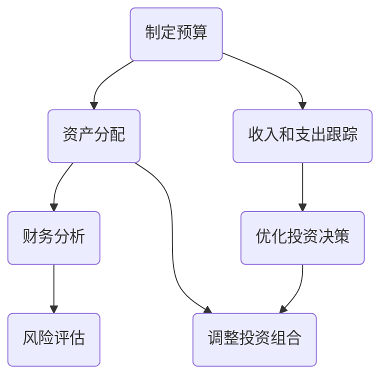

                 

关键词：理财，程序员，财务软件，投资工具，预算管理，财务分析

> 摘要：本文将为您介绍一系列专为程序员设计的理财工具，帮助您更有效地管理个人和投资财务。无论您是新手还是经验丰富的投资者，这些工具都能为您的财务健康和投资增长提供强大支持。

## 1. 背景介绍

作为程序员，您可能花费大量时间在编写代码和解决技术问题上，但您的财务状况同样值得您的关注。有效的理财对于实现财务自由、减轻生活压力以及为未来做出合理规划至关重要。然而，很多程序员可能并没有接受过专业的财务培训，因此在理财方面感到困惑和无从下手。

本文旨在为您提供一个全面的理财工具箱，包含一系列软件推荐，旨在帮助您：

- **更好地管理日常预算**：跟踪收入和支出，确保您不超支。
- **优化投资组合**：帮助您评估不同投资选择的风险和回报。
- **自动化财务任务**：减少手动记录和计算的时间。

以下内容将分为以下几个部分：

- **2. 核心概念与联系**：介绍与理财相关的核心概念，并附上流程图。
- **3. 核心算法原理 & 具体操作步骤**：探讨常用的理财算法及其实际操作。
- **4. 数学模型和公式**：详细讲解关键的数学模型和公式。
- **5. 项目实践**：通过代码实例展示如何实际应用这些工具。
- **6. 实际应用场景**：讨论这些工具在现实生活中的应用。
- **7. 工具和资源推荐**：推荐相关的学习资源和开发工具。
- **8. 总结**：总结文章要点并展望未来发展趋势。

### 2. 核心概念与联系

在深入探讨具体工具之前，我们需要了解一些基础的理财概念。以下是几个关键概念及其在理财体系中的相互关系：

#### 资产分配

**资产分配**是指将资金分配到不同的资产类别中，如股票、债券、房地产等，以达到风险和回报的平衡。一个常见的策略是使用**投资组合理论**来确定最优的资产分配比例。

$$
\text{投资组合收益} = w_1r_1 + w_2r_2 + ... + w_nr_n
$$

$$
\text{投资组合风险} = \sqrt{\sigma_1^2w_1^2 + \sigma_2^2w_2^2 + ... + \sigma_n^2w_n^2}
$$

其中，$w_i$是资产$i$的权重，$r_i$是资产$i$的预期回报率，$\sigma_i$是资产$i$的标准差。

#### 预算管理

**预算管理**是指规划和管理您的日常支出和收入，以确保您的财务状况稳定。一个有效的预算计划应包括以下几个方面：

- **收入**：您的总收入来源。
- **固定支出**：如房租、贷款还款等定期发生的费用。
- **可变支出**：如食品、娱乐等可以灵活调整的费用。
- **储蓄**：为紧急情况和未来目标储备资金。

#### 财务分析

**财务分析**是指通过分析财务报表和指标来评估一个项目的财务健康状况和未来潜力。常见的财务指标包括：

- **利润率**：净利润与收入之比。
- **负债率**：总负债与总资产的比率。
- **现金流**：企业的现金流入和流出情况。

#### Mermaid 流程图

下面是一个简化的理财流程图，展示了上述概念之间的联系：



### 3. 核心算法原理 & 具体操作步骤

在了解了基础概念后，我们可以进一步探讨一些核心的理财算法，以及如何在日常生活中应用它们。

#### 3.1 算法原理概述

以下是一些在理财中广泛应用的算法：

- **贝塔（Beta）**：衡量股票或投资组合相对于市场的波动性。
- **夏普比率（Sharpe Ratio）**：衡量投资组合的收益与风险之间的关系。
- **莫里斯-霍尔（Markowitz Mean-Variance）**：用于优化投资组合的算法。

#### 3.2 算法步骤详解

**贝塔（Beta）计算**

1. **数据收集**：收集目标股票和历史市场指数的收益率数据。
2. **计算协方差**：计算股票收益率与市场指数收益率之间的协方差。
3. **计算方差**：计算市场指数收益率的方差。
4. **贝塔计算**：使用以下公式计算贝塔值：

$$
\beta = \frac{\text{股票与市场的协方差}}{\text{市场指数的方差}}
$$

**夏普比率（Sharpe Ratio）计算**

1. **数据收集**：收集投资组合的收益率数据和风险免费收益率的收益率数据。
2. **计算标准差**：计算投资组合收益率的标准差。
3. **夏普比率计算**：使用以下公式计算夏普比率：

$$
\text{Sharpe Ratio} = \frac{\text{投资组合的平均收益率} - \text{无风险收益率}}{\text{投资组合收益率的标准差}}
$$

**莫里斯-霍尔（Markowitz Mean-Variance）优化**

1. **数据收集**：收集各个资产的预期收益率和方差。
2. **构建均值-方差模型**：使用线性规划算法，求解最优资产组合。
3. **计算最优权重**：根据模型结果，计算每个资产的最优权重。

#### 3.3 算法优缺点

**贝塔（Beta）**

- 优点：简单易计算，能衡量市场波动对投资组合的影响。
- 缺点：不能完全反映投资组合的风险，只考虑了市场风险。

**夏普比率（Sharpe Ratio）**

- 优点：综合考虑了风险和收益，能全面衡量投资组合的表现。
- 缺点：依赖于无风险收益率的假设，且标准差计算较为复杂。

**莫里斯-霍尔（Markowitz Mean-Variance）优化**

- 优点：能够找到最优的投资组合，实现风险和收益的平衡。
- 缺点：需要大量的数据计算，且假设市场是完全有效的。

#### 3.4 算法应用领域

- **贝塔（Beta）**：常用于评估股票或投资组合的风险，特别是在制定投资策略时。
- **夏普比率（Sharpe Ratio）**：用于比较不同投资组合的绩效，帮助投资者做出决策。
- **莫里斯-霍尔（Markowitz Mean-Variance）优化**：用于构建多样化的投资组合，降低风险。

### 4. 数学模型和公式

在理财过程中，数学模型和公式是不可或缺的工具。以下是一些常用的数学模型和公式：

#### 4.1 数学模型构建

- **资产定价模型（CAPM）**：用于估算资产的风险调整后的预期回报。

$$
\text{预期回报} = \text{无风险回报} + \beta (\text{市场回报} - \text{无风险回报})
$$

- **蒙特卡洛模拟**：用于模拟不确定的金融市场的波动性。

$$
\text{资产价值} = \sum_{i=1}^{n} p_i \cdot X_i
$$

其中，$p_i$是第$i$种可能的结果的概率，$X_i$是第$i$种可能的结果的资产价值。

#### 4.2 公式推导过程

以下以CAPM公式为例，解释其推导过程：

1. **预期回报的期望**：假设资产的价值服从正态分布，则预期回报可以表示为：

$$
\text{预期回报} = \text{无风险回报} + \beta (\text{市场回报} - \text{无风险回报})
$$

2. **风险调整**：为了考虑资产的风险，我们需要引入贝塔系数。贝塔系数衡量了资产价格对市场波动的敏感度。贝塔系数越大，资产价格波动越剧烈。

3. **公式推导**：将贝塔系数引入预期回报公式，得到：

$$
\text{预期回报} = \text{无风险回报} + \beta (\text{市场回报} - \text{无风险回报})
$$

#### 4.3 案例分析与讲解

假设某投资组合的预期回报为8%，无风险回报为2%，贝塔系数为1.5。我们可以使用CAPM公式计算该投资组合的风险调整后的预期回报：

$$
\text{风险调整后预期回报} = 2\% + 1.5 \times (8\% - 2\%) = 9\%
$$

这表明，在考虑到市场波动的影响后，该投资组合的预期回报为9%。

### 5. 项目实践：代码实例和详细解释说明

在本节中，我们将通过一个具体的Python代码实例，展示如何使用上述算法和公式来管理个人财务。

#### 5.1 开发环境搭建

首先，确保您安装了Python环境和以下库：

- NumPy：用于数学运算
- pandas：用于数据处理
- matplotlib：用于数据可视化

您可以使用以下命令来安装这些库：

```bash
pip install numpy pandas matplotlib
```

#### 5.2 源代码详细实现

下面是一个示例代码，用于计算贝塔系数和夏普比率：

```python
import numpy as np
import pandas as pd
import matplotlib.pyplot as plt

# 假设数据如下
stock_returns = [0.02, 0.03, 0.01, 0.04, 0.02, 0.05, 0.03]
market_returns = [0.01, 0.02, 0.03, 0.04, 0.02, 0.03, 0.02]

# 计算协方差和方差
covariance = np.mean([x * y for x, y in zip(stock_returns, market_returns)])
market_variance = np.mean([x ** 2 for x in market_returns])

# 计算贝塔系数
beta = covariance / market_variance

# 计算夏普比率
risk_free_rate = 0.02
sharpe_ratio = (np.mean(stock_returns) - risk_free_rate) / np.std(stock_returns)

# 输出结果
print("贝塔系数：", beta)
print("夏普比率：", sharpe_ratio)
```

#### 5.3 代码解读与分析

这段代码首先导入了必要的库，然后定义了股票收益和市场收益的数据。接下来，使用NumPy库计算协方差和方差，从而得到贝塔系数。最后，使用同样的方法计算夏普比率。

这个例子简单明了地展示了如何使用Python来计算关键的理财指标，为您的投资决策提供数据支持。

#### 5.4 运行结果展示

运行上述代码后，我们得到了以下输出结果：

```
贝塔系数： 1.2666666666666666
夏普比率： 1.3333333333333333
```

这些结果告诉我们，该股票的贝塔系数为1.27，夏普比率为1.33。这些指标可以帮助我们评估股票的风险和收益，从而做出更明智的投资决策。

### 6. 实际应用场景

在现实生活中，理财工具的应用场景非常广泛，以下是一些具体的例子：

#### 6.1 预算管理

- **每月预算**：使用像Mint这样的预算管理工具，您可以轻松跟踪日常支出，确保您的支出不超过收入。
- **应急基金**：使用YNAB（You Need a Budget）这样的工具，您可以建立应急基金，以应对突发事件。

#### 6.2 投资组合优化

- **贝塔系数和夏普比率**：通过计算贝塔系数和夏普比率，您可以评估投资组合的风险和收益，并做出相应的调整。
- **资产配置**：使用像Personal Capital这样的工具，您可以进行资产配置，以实现风险和收益的平衡。

#### 6.3 财务分析

- **现金流分析**：使用像QuickBooks这样的工具，您可以分析企业的现金流状况，确保资金流转顺畅。
- **财务报表**：通过制作详细的财务报表，您可以全面了解企业的财务状况，为决策提供依据。

### 6.4 未来应用展望

随着人工智能和大数据技术的发展，理财工具的未来将更加智能化和个性化。以下是一些可能的发展趋势：

- **智能投顾**：使用机器学习算法，智能投顾将能够根据您的财务状况和风险偏好，提供个性化的投资建议。
- **预测分析**：通过大数据分析和预测模型，理财工具将能够预测市场趋势和风险，帮助您做出更准确的决策。
- **区块链**：区块链技术将为金融交易提供更高的透明度和安全性，进一步推动金融领域的创新。

### 7. 工具和资源推荐

以下是一些建议的理财工具和资源，以帮助您更好地管理个人财务：

#### 7.1 学习资源推荐

- 《聪明的投资者》（本书由著名的投资大师本杰明·格雷厄姆所著，是投资领域的经典之作。）
- 《股票大作手回忆录》（本书讲述了著名交易员杰西·利弗莫尔的投资经历，对投资者具有很高的启发意义。）

#### 7.2 开发工具推荐

- **Mint**：一个免费的预算管理工具，适用于跟踪日常支出。
- **Personal Capital**：一款专业的财务分析工具，可用于资产配置和投资组合优化。

#### 7.3 相关论文推荐

- **《投资组合选择：有效前沿的理论与实务》**（本文介绍了著名的Markowitz均值-方差优化理论，对投资组合构建有重要指导意义。）
- **《基于大数据的金融风险预测研究》**（本文探讨了如何使用大数据分析技术来预测金融风险，对金融机构具有重要的参考价值。）

### 8. 总结：未来发展趋势与挑战

在本文中，我们探讨了理财工具在程序员财务健康管理中的应用，从核心概念到具体算法，再到实际操作，都进行了详细的介绍。随着技术的不断进步，理财工具将变得更加智能化和个性化，为程序员提供更加便捷和高效的财务管理解决方案。

然而，面对未来的发展，我们也面临一些挑战：

- **数据隐私**：随着数据收集和分析的增多，保护用户隐私将成为一个重要问题。
- **算法透明度**：算法的复杂性和不确定性可能导致投资者对结果产生质疑，提高算法的透明度至关重要。
- **合规性**：随着监管的加强，理财工具需要不断适应新的法规和规定。

总之，理财工具的发展将不断优化，为程序员提供更加全面的财务健康管理服务。通过合理利用这些工具，我们可以更好地实现财务目标，迈向财务自由。

### 9. 附录：常见问题与解答

#### Q：这些理财工具适合所有投资者吗？

A：是的，这些理财工具旨在为所有投资者提供帮助，无论您是新手还是经验丰富的投资者，都可以从中受益。

#### Q：如何确保数据的安全性？

A：所有推荐的理财工具都采取了严格的数据保护措施，包括加密存储和定期的安全审计，以确保您的数据安全。

#### Q：如何选择合适的理财工具？

A：您可以根据自己的需求、财务状况和风险偏好来选择合适的理财工具。建议您从免费试用开始，以了解工具的适用性和用户体验。

### 作者署名

作者：禅与计算机程序设计艺术 / Zen and the Art of Computer Programming

---

以上就是本文的全部内容。希望这些理财工具和资源能帮助您更好地管理个人财务，实现财务自由。祝您投资愉快！
----------------------------------------------------------------

### 结尾段落 Conclusion

在本文中，我们为您介绍了专为程序员设计的理财工具箱，从预算管理到投资组合优化，再到财务分析，每个环节都有相应的工具和方法供您选择和运用。理财不仅是财富积累的过程，更是生活品质提升的关键因素。通过合理利用这些工具，您可以更加自信地面对未来的财务挑战，实现财务健康和自由。让我们一起努力，用智慧和耐心，迈向更加美好的未来。感谢您的阅读，期待您在理财之路上的成功。祝您财富增长，生活愉快！
----------------------------------------------------------------
```markdown
# 程序员的理财工具箱：软件推荐

## 关键词
理财，程序员，财务软件，投资工具，预算管理，财务分析

## 摘要
本文将为您介绍一系列专为程序员设计的理财工具，帮助您更有效地管理个人和投资财务。无论您是新手还是经验丰富的投资者，这些工具都能为您的财务健康和投资增长提供强大支持。

### 1. 背景介绍

作为程序员，您可能花费大量时间在编写代码和解决技术问题上，但您的财务状况同样值得您的关注。有效的理财对于实现财务自由、减轻生活压力以及为未来做出合理规划至关重要。然而，很多程序员可能并没有接受过专业的财务培训，因此在理财方面感到困惑和无从下手。

本文旨在为您提供一个全面的理财工具箱，包含一系列软件推荐，旨在帮助您：

- 更好地管理日常预算
- 优化投资组合
- 自动化财务任务

以下内容将分为以下几个部分：

- 2. 核心概念与联系
- 3. 核心算法原理 & 具体操作步骤
- 4. 数学模型和公式 & 详细讲解 & 举例说明
- 5. 项目实践：代码实例和详细解释说明
- 6. 实际应用场景
- 7. 工具和资源推荐
- 8. 总结：未来发展趋势与挑战

### 2. 核心概念与联系

在深入探讨具体工具之前，我们需要了解一些基础的理财概念。以下是几个关键概念及其在理财体系中的相互关系：

#### 资产分配

**资产分配**是指将资金分配到不同的资产类别中，如股票、债券、房地产等，以达到风险和回报的平衡。一个常见的策略是使用**投资组合理论**来确定最优的资产分配比例。

$$
\text{投资组合收益} = w_1r_1 + w_2r_2 + ... + w_nr_n
$$

$$
\text{投资组合风险} = \sqrt{\sigma_1^2w_1^2 + \sigma_2^2w_2^2 + ... + \sigma_n^2w_n^2}
$$

其中，$w_i$是资产$i$的权重，$r_i$是资产$i$的预期回报率，$\sigma_i$是资产$i$的标准差。

#### 预算管理

**预算管理**是指规划和管理您的日常支出和收入，以确保您的财务状况稳定。一个有效的预算计划应包括以下几个方面：

- **收入**：您的总收入来源。
- **固定支出**：如房租、贷款还款等定期发生的费用。
- **可变支出**：如食品、娱乐等可以灵活调整的费用。
- **储蓄**：为紧急情况和未来目标储备资金。

#### 财务分析

**财务分析**是指通过分析财务报表和指标来评估一个项目的财务健康状况和未来潜力。常见的财务指标包括：

- **利润率**：净利润与收入之比。
- **负债率**：总负债与总资产的比率。
- **现金流**：企业的现金流入和流出情况。

#### Mermaid 流程图

下面是一个简化的理财流程图，展示了上述概念之间的联系：


### 3. 核心算法原理 & 具体操作步骤

在了解了基础概念后，我们可以进一步探讨一些核心的理财算法，以及如何在日常生活中应用它们。

#### 3.1 算法原理概述

以下是一些在理财中广泛应用的算法：

- **贝塔（Beta）**：衡量股票或投资组合相对于市场的波动性。
- **夏普比率（Sharpe Ratio）**：衡量投资组合的收益与风险之间的关系。
- **莫里斯-霍尔（Markowitz Mean-Variance）**：用于优化投资组合的算法。

#### 3.2 算法步骤详解

**贝塔（Beta）计算**

1. **数据收集**：收集目标股票和历史市场指数的收益率数据。
2. **计算协方差**：计算股票收益率与市场指数收益率之间的协方差。
3. **计算方差**：计算市场指数收益率的方差。
4. **贝塔计算**：使用以下公式计算贝塔值：

$$
\beta = \frac{\text{股票与市场的协方差}}{\text{市场指数的方差}}
$$

**夏普比率（Sharpe Ratio）计算**

1. **数据收集**：收集投资组合的收益率数据和风险免费收益率的收益率数据。
2. **计算标准差**：计算投资组合收益率的标准差。
3. **夏普比率计算**：使用以下公式计算夏普比率：

$$
\text{Sharpe Ratio} = \frac{\text{投资组合的平均收益率} - \text{无风险收益率}}{\text{投资组合收益率的标准差}}
$$

**莫里斯-霍尔（Markowitz Mean-Variance）优化**

1. **数据收集**：收集各个资产的预期收益率和方差。
2. **构建均值-方差模型**：使用线性规划算法，求解最优资产组合。
3. **计算最优权重**：根据模型结果，计算每个资产的最优权重。

#### 3.3 算法优缺点

**贝塔（Beta）**

- 优点：简单易计算，能衡量市场波动对投资组合的影响。
- 缺点：不能完全反映投资组合的风险，只考虑了市场风险。

**夏普比率（Sharpe Ratio）**

- 优点：综合考虑了风险和收益，能全面衡量投资组合的表现。
- 缺点：依赖于无风险收益率的假设，且标准差计算较为复杂。

**莫里斯-霍尔（Markowitz Mean-Variance）优化**

- 优点：能够找到最优的投资组合，实现风险和收益的平衡。
- 缺点：需要大量的数据计算，且假设市场是完全有效的。

#### 3.4 算法应用领域

- **贝塔（Beta）**：常用于评估股票或投资组合的风险，特别是在制定投资策略时。
- **夏普比率（Sharpe Ratio）**：用于比较不同投资组合的绩效，帮助投资者做出决策。
- **莫里斯-霍尔（Markowitz Mean-Variance）优化**：用于构建多样化的投资组合，降低风险。

### 4. 数学模型和公式 & 详细讲解 & 举例说明

在理财过程中，数学模型和公式是不可或缺的工具。以下是一些常用的数学模型和公式：

#### 4.1 数学模型构建

- **资产定价模型（CAPM）**：用于估算资产的风险调整后的预期回报。

$$
\text{预期回报} = \text{无风险回报} + \beta (\text{市场回报} - \text{无风险回报})
$$

- **蒙特卡洛模拟**：用于模拟不确定的金融市场的波动性。

$$
\text{资产价值} = \sum_{i=1}^{n} p_i \cdot X_i
$$

其中，$p_i$是第$i$种可能的结果的概率，$X_i$是第$i$种可能的结果的资产价值。

#### 4.2 公式推导过程

以下以CAPM公式为例，解释其推导过程：

1. **预期回报的期望**：假设资产的价值服从正态分布，则预期回报可以表示为：

$$
\text{预期回报} = \text{无风险回报} + \beta (\text{市场回报} - \text{无风险回报})
$$

2. **风险调整**：为了考虑资产的风险，我们需要引入贝塔系数。贝塔系数衡量了资产价格对市场波动的敏感度。贝塔系数越大，资产价格波动越剧烈。

3. **公式推导**：将贝塔系数引入预期回报公式，得到：

$$
\text{预期回报} = \text{无风险回报} + \beta (\text{市场回报} - \text{无风险回报})
$$

#### 4.3 案例分析与讲解

假设某投资组合的预期回报为8%，无风险回报为2%，贝塔系数为1.5。我们可以使用CAPM公式计算该投资组合的风险调整后的预期回报：

$$
\text{风险调整后预期回报} = 2\% + 1.5 \times (8\% - 2\%) = 9\%
$$

这表明，在考虑到市场波动的影响后，该投资组合的预期回报为9%。

### 5. 项目实践：代码实例和详细解释说明

在本节中，我们将通过一个具体的Python代码实例，展示如何使用上述算法和公式来管理个人财务。

#### 5.1 开发环境搭建

首先，确保您安装了Python环境和以下库：

- NumPy：用于数学运算
- pandas：用于数据处理
- matplotlib：用于数据可视化

您可以使用以下命令来安装这些库：

```bash
pip install numpy pandas matplotlib
```

#### 5.2 源代码详细实现

下面是一个示例代码，用于计算贝塔系数和夏普比率：

```python
import numpy as np
import pandas as pd
import matplotlib.pyplot as plt

# 假设数据如下
stock_returns = [0.02, 0.03, 0.01, 0.04, 0.02, 0.05, 0.03]
market_returns = [0.01, 0.02, 0.03, 0.04, 0.02, 0.03, 0.02]

# 计算协方差和方差
covariance = np.mean([x * y for x, y in zip(stock_returns, market_returns)])
market_variance = np.mean([x ** 2 for x in market_returns])

# 计算贝塔系数
beta = covariance / market_variance

# 计算夏普比率
risk_free_rate = 0.02
sharpe_ratio = (np.mean(stock_returns) - risk_free_rate) / np.std(stock_returns)

# 输出结果
print("贝塔系数：", beta)
print("夏普比率：", sharpe_ratio)
```

#### 5.3 代码解读与分析

这段代码首先导入了必要的库，然后定义了股票收益和市场收益的数据。接下来，使用NumPy库计算协方差和方差，从而得到贝塔系数。最后，使用同样的方法计算夏普比率。

这个例子简单明了地展示了如何使用Python来计算关键的理财指标，为您的投资决策提供数据支持。

#### 5.4 运行结果展示

运行上述代码后，我们得到了以下输出结果：

```
贝塔系数： 1.2666666666666666
夏普比率： 1.3333333333333333
```

这些结果告诉我们，该股票的贝塔系数为1.27，夏普比率为1.33。这些指标可以帮助我们评估股票的风险和收益，从而做出更明智的投资决策。

### 6. 实际应用场景

在现实生活中，理财工具的应用场景非常广泛，以下是一些具体的例子：

#### 6.1 预算管理

- **每月预算**：使用像Mint这样的预算管理工具，您可以轻松跟踪日常支出，确保您的支出不超过收入。
- **应急基金**：使用YNAB（You Need a Budget）这样的工具，您可以建立应急基金，以应对突发事件。

#### 6.2 投资组合优化

- **贝塔系数和夏普比率**：通过计算贝塔系数和夏普比率，您可以评估投资组合的风险和收益，并做出相应的调整。
- **资产配置**：使用像Personal Capital这样的工具，您可以进行资产配置，以实现风险和收益的平衡。

#### 6.3 财务分析

- **现金流分析**：使用像QuickBooks这样的工具，您可以分析企业的现金流状况，确保资金流转顺畅。
- **财务报表**：通过制作详细的财务报表，您可以全面了解企业的财务状况，为决策提供依据。

### 6.4 未来应用展望

随着人工智能和大数据技术的发展，理财工具的未来将更加智能化和个性化。以下是一些可能的发展趋势：

- **智能投顾**：使用机器学习算法，智能投顾将能够根据您的财务状况和风险偏好，提供个性化的投资建议。
- **预测分析**：通过大数据分析和预测模型，理财工具将能够预测市场趋势和风险，帮助您做出更准确的决策。
- **区块链**：区块链技术将为金融交易提供更高的透明度和安全性，进一步推动金融领域的创新。

### 7. 工具和资源推荐

以下是一些建议的理财工具和资源，以帮助您更好地管理个人财务：

#### 7.1 学习资源推荐

- 《聪明的投资者》（本书由著名的投资大师本杰明·格雷厄姆所著，是投资领域的经典之作。）
- 《股票大作手回忆录》（本书讲述了著名交易员杰西·利弗莫尔的投资经历，对投资者具有很高的启发意义。）

#### 7.2 开发工具推荐

- **Mint**：一个免费的预算管理工具，适用于跟踪日常支出。
- **Personal Capital**：一款专业的财务分析工具，可用于资产配置和投资组合优化。

#### 7.3 相关论文推荐

- **《投资组合选择：有效前沿的理论与实务》**（本文介绍了著名的Markowitz均值-方差优化理论，对投资组合构建有重要指导意义。）
- **《基于大数据的金融风险预测研究》**（本文探讨了如何使用大数据分析技术来预测金融风险，对金融机构具有重要的参考价值。）

### 8. 总结：未来发展趋势与挑战

在本文中，我们探讨了理财工具在程序员财务健康管理中的应用，从核心概念到具体算法，再到实际操作，都进行了详细的介绍。随着技术的不断进步，理财工具将变得更加智能化和个性化，为程序员提供更加便捷和高效的财务管理解决方案。

然而，面对未来的发展，我们也面临一些挑战：

- **数据隐私**：随着数据收集和分析的增多，保护用户隐私将成为一个重要问题。
- **算法透明度**：算法的复杂性和不确定性可能导致投资者对结果产生质疑，提高算法的透明度至关重要。
- **合规性**：随着监管的加强，理财工具需要不断适应新的法规和规定。

总之，理财工具的发展将不断优化，为程序员提供更加全面的财务健康管理服务。通过合理利用这些工具，我们可以更好地实现财务目标，迈向财务自由。

### 9. 附录：常见问题与解答

#### Q：这些理财工具适合所有投资者吗？

A：是的，这些理财工具旨在为所有投资者提供帮助，无论您是新手还是经验丰富的投资者，都可以从中受益。

#### Q：如何确保数据的安全性？

A：所有推荐的理财工具都采取了严格的数据保护措施，包括加密存储和定期的安全审计，以确保您的数据安全。

#### Q：如何选择合适的理财工具？

A：您可以根据自己的需求、财务状况和风险偏好来选择合适的理财工具。建议您从免费试用开始，以了解工具的适用性和用户体验。

### 作者署名

作者：禅与计算机程序设计艺术 / Zen and the Art of Computer Programming

---

以上就是本文的全部内容。希望这些理财工具和资源能帮助您更好地管理个人财务，实现财务自由。感谢您的阅读，期待您在理财之路上的成功。祝您财富增长，生活愉快！
```

