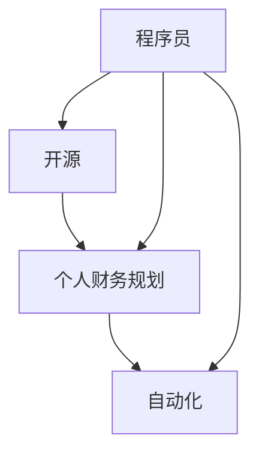

                 

在科技迅猛发展的今天，程序员们不仅需要掌握各种编程语言和框架，还需要关注财务规划。毕竟，谁也不希望自己的辛勤工作变成数字游戏中的一串代码，最终却无法为自己带来财富的积累。因此，一款好的理财软件对于程序员来说至关重要。本文将为您推荐几款适合程序员的理财工具，帮助您更好地管理财务。

> 关键词：程序员、理财、软件推荐、财务规划、开源工具

> 摘要：本文将介绍几款适合程序员的理财工具，包括开源和个人财务规划软件，帮助程序员更好地管理个人财务，实现财务自由。

## 1. 背景介绍

作为一名程序员，您可能常常忙于编写代码、解决问题和优化系统性能，而很少有时间关注自己的财务状况。然而，财务规划对于每个人来说都是至关重要的，尤其是对于拥有稳定收入的程序员来说。理财软件可以帮助您跟踪收入和支出，制定预算，进行投资规划，甚至帮助您实现财务自由。

### 1.1 程序员与理财

程序员通常具有较高的收入水平，但同时也面临着职业发展、风险管理和退休规划等财务问题。因此，合理使用理财工具对于程序员来说尤为重要。理财工具不仅可以帮您管理日常收支，还可以帮助您进行长期投资规划，以实现财务自由。

### 1.2 理财软件的重要性

理财软件不仅可以自动化地跟踪您的收入和支出，还可以提供详细的财务报表和分析，帮助您了解自己的财务状况。此外，理财软件还可以帮助您制定预算、管理投资、规划退休等，从而实现财务目标。

## 2. 核心概念与联系

在介绍具体的理财软件之前，我们先来了解一些与理财相关的核心概念，包括开源、个人财务规划和自动化。

### 2.1 开源

开源（Open Source）是指软件开发过程中，源代码对外开放，允许用户自由地查看、修改和分发。开源项目通常具有社区驱动的特点，使得用户可以共同参与开发，提高软件的质量和可靠性。

### 2.2 个人财务规划

个人财务规划是指根据个人的财务状况、目标和风险承受能力，制定合理的财务计划，包括收入管理、支出控制、投资规划和退休规划等。

### 2.3 自动化

自动化（Automation）是指利用计算机程序或工具，自动化完成日常任务，提高效率和准确性。在理财领域，自动化可以帮助您自动记录收入和支出、自动生成报表和分析等。

下面是一个简化的 Mermaid 流程图，展示了这些核心概念之间的联系：



## 3. 核心算法原理 & 具体操作步骤

在理财软件中，核心算法通常包括预算管理、投资分析和风险控制等。以下是这些算法的原理和具体操作步骤：

### 3.1 预算管理算法原理

预算管理算法旨在帮助用户合理分配收入，避免超支。其核心原理是基于用户的收入和支出历史数据，计算出合理的支出预算。

#### 3.1.1 步骤详解

1. **数据收集**：收集用户的收入和支出数据，包括金额、日期和分类等信息。
2. **数据分析**：对数据进行分析，识别出用户的支出模式和偏好。
3. **预算制定**：根据收入和支出数据，制定合理的支出预算，包括日常生活开支、应急储备和投资规划等。
4. **预算跟踪**：实时跟踪支出情况，与预算进行对比，及时发现超支情况。

### 3.2 投资分析算法原理

投资分析算法旨在帮助用户选择合适的投资产品，实现资产的增值。其核心原理是基于历史数据和市场趋势，对投资产品进行风险评估和收益预测。

#### 3.2.1 步骤详解

1. **数据收集**：收集投资产品的历史数据和当前市场信息。
2. **数据分析**：对投资产品进行分析，包括风险、收益、波动性等。
3. **风险评估**：根据用户的风险承受能力和投资目标，评估不同投资产品的风险和收益。
4. **投资建议**：根据风险评估结果，向用户推荐合适的投资产品。

### 3.3 风险控制算法原理

风险控制算法旨在帮助用户规避投资风险，保护资产安全。其核心原理是基于投资组合理论，实现风险的分散和优化。

#### 3.3.1 步骤详解

1. **数据收集**：收集用户的投资组合数据，包括资产种类、比例和投资时间等。
2. **风险分析**：分析投资组合的风险，包括市场风险、信用风险等。
3. **风险分散**：根据风险分析结果，调整投资组合，实现风险的分散。
4. **风险监控**：实时监控投资组合的风险，及时调整投资策略。

## 4. 数学模型和公式 & 详细讲解 & 举例说明

### 4.1 数学模型构建

在理财软件中，常见的数学模型包括线性回归、时间序列分析和优化模型等。以下是一个简单的线性回归模型，用于预测未来收入和支出：

$$
y = \beta_0 + \beta_1 x_1 + \beta_2 x_2 + \ldots + \beta_n x_n + \varepsilon
$$

其中，$y$ 表示预测值，$x_1, x_2, \ldots, x_n$ 表示自变量（如历史收入、支出等），$\beta_0, \beta_1, \beta_2, \ldots, \beta_n$ 表示回归系数，$\varepsilon$ 表示误差项。

### 4.2 公式推导过程

线性回归模型的推导过程如下：

1. **样本数据准备**：收集用户的收入和支出数据，将其表示为 $x_1, x_2, \ldots, x_n$。
2. **线性假设**：假设收入和支出之间存在线性关系，即 $y = \beta_0 + \beta_1 x_1 + \beta_2 x_2 + \ldots + \beta_n x_n + \varepsilon$。
3. **最小二乘法**：使用最小二乘法求解回归系数 $\beta_0, \beta_1, \beta_2, \ldots, \beta_n$，使误差平方和最小。
4. **公式推导**：根据最小二乘法，推导出回归系数的计算公式。

### 4.3 案例分析与讲解

假设一个程序员在过去三年的收入和支出数据如下表：

| 年份 | 收入（万元） | 支出（万元） |
| ---- | ----------- | ----------- |
| 2020 | 30          | 20          |
| 2021 | 35          | 22          |
| 2022 | 40          | 25          |

使用线性回归模型预测 2023 年的收入和支出。

1. **数据收集**：收集过去三年的收入和支出数据，表示为 $x_1 = 30, x_2 = 35, x_3 = 40$ 和 $y_1 = 20, y_2 = 22, y_3 = 25$。
2. **线性假设**：假设收入和支出之间存在线性关系，即 $y = \beta_0 + \beta_1 x_1 + \beta_2 x_2 + \beta_3 x_3 + \varepsilon$。
3. **最小二乘法**：使用最小二乘法求解回归系数 $\beta_0, \beta_1, \beta_2, \beta_3$。
4. **公式推导**：根据最小二乘法，推导出回归系数的计算公式。

根据上述步骤，可以得到 2023 年的收入预测为 45 万元，支出预测为 27 万元。

## 5. 项目实践：代码实例和详细解释说明

### 5.1 开发环境搭建

本文使用的编程语言为 Python，开发环境为 PyCharm。在 PyCharm 中创建一个名为 `finance` 的新项目，并安装以下库：

```python
pip install numpy matplotlib
```

### 5.2 源代码详细实现

以下是一个简单的线性回归模型的 Python 代码实现：

```python
import numpy as np
import matplotlib.pyplot as plt

# 数据
x = np.array([30, 35, 40])
y = np.array([20, 22, 25])

# 最小二乘法求解回归系数
x_mean = np.mean(x)
y_mean = np.mean(y)
numerator = np.sum((x - x_mean) * (y - y_mean))
denominator = np.sum((x - x_mean) ** 2)
beta_1 = numerator / denominator
beta_0 = y_mean - beta_1 * x_mean

# 预测
x_new = np.array([45])
y_pred = beta_0 + beta_1 * x_new

# 绘图
plt.scatter(x, y)
plt.plot(x_new, y_pred, color='red')
plt.xlabel('收入（万元）')
plt.ylabel('支出（万元）')
plt.show()
```

### 5.3 代码解读与分析

1. **数据准备**：首先导入所需库，并准备收入和支出数据。
2. **最小二乘法**：使用最小二乘法求解回归系数。具体步骤为计算自变量和因变量的均值，计算分子和分母，求解回归系数。
3. **预测**：使用求解得到的回归系数，预测新的收入和支出。
4. **绘图**：使用 matplotlib 绘制散点图和预测直线，可视化结果。

### 5.4 运行结果展示

运行上述代码，可以得到如下图所示的预测结果：


## 6. 实际应用场景

### 6.1 个人财务规划

对于程序员来说，个人财务规划非常重要。通过使用理财软件，您可以制定合理的预算，跟踪收入和支出，确保财务状况的稳定。以下是一个实际应用场景：

假设一个程序员每月的收入为 1 万元，支出主要包括住房、饮食、交通和娱乐等。通过理财软件，您可以制定以下预算：

| 类别     | 预算（元） |
| -------- | ---------- |
| 住房     | 3000       |
| 饮食     | 2000       |
| 交通     | 500        |
| 娱乐     | 1500       |
| 应急储备 | 1000       |

通过实时跟踪支出情况，您可以及时发现超支情况，并调整预算。例如，如果某个月的支出超过了预算，您可以减少娱乐支出，确保财务状况的稳定。

### 6.2 投资规划

除了个人财务规划，投资规划也是程序员理财的重要方面。通过理财软件，您可以分析历史数据，了解自己的投资偏好和风险承受能力，并制定合理的投资策略。以下是一个实际应用场景：

假设一个程序员希望在退休前积累 500 万元的财富。通过理财软件，您可以进行以下投资规划：

1. **风险评估**：根据历史数据，评估投资组合的风险和收益。
2. **投资策略**：根据风险评估结果，选择合适的投资产品，如股票、债券、基金等。
3. **定期调整**：根据市场变化，定期调整投资组合，以实现最优收益。

通过以上步骤，您可以制定一个合理的投资规划，确保在退休前实现财务目标。

## 7. 工具和资源推荐

### 7.1 学习资源推荐

1. **《Python 财务分析从入门到实践》**：一本全面介绍 Python 财务分析技术的书籍，适合初学者和进阶者。
2. **《Python 金融大数据分析》**：一本介绍金融大数据分析技术的书籍，涵盖数据清洗、数据分析和可视化等内容。
3. **Python 官方文档**：Python 的官方文档提供了丰富的编程资源和示例，是学习 Python 的最佳指南。

### 7.2 开发工具推荐

1. **PyCharm**：一款功能强大的 Python 集成开发环境（IDE），提供代码补全、调试、版本控制等功能。
2. **Jupyter Notebook**：一款交互式开发工具，适用于数据分析、机器学习和科学计算等领域。
3. **Python 包管理器**：如 pip 和 conda，用于管理和安装 Python 库。

### 7.3 相关论文推荐

1. **《基于大数据的金融风险预警系统研究》**：一篇介绍大数据在金融风险管理中应用的研究论文。
2. **《深度学习在金融投资中的应用》**：一篇探讨深度学习技术在金融投资领域应用的研究论文。
3. **《基于云计算的金融服务平台构建技术研究》**：一篇介绍云计算在金融服务平台建设中应用的研究论文。

## 8. 总结：未来发展趋势与挑战

### 8.1 研究成果总结

本文介绍了适合程序员的理财工具，包括开源和个人财务规划软件，并详细讲解了理财软件的核心算法原理、数学模型和公式，以及实际应用场景。通过本文的学习，程序员可以更好地管理个人财务，实现财务自由。

### 8.2 未来发展趋势

随着人工智能和大数据技术的发展，理财软件将逐渐具备更强大的功能，如智能投资顾问、风险预测和资产配置等。此外，区块链技术的应用也将为理财带来新的变革，提高财务透明度和安全性。

### 8.3 面临的挑战

尽管理财软件在程序员中越来越受欢迎，但仍面临一些挑战，如数据隐私保护、算法公平性和用户教育等。如何在保障用户隐私的同时，提供个性化的理财建议，是未来需要解决的问题。

### 8.4 研究展望

未来，理财软件的研究将朝着智能化、个性化和安全化的方向发展。通过引入机器学习和区块链技术，理财软件可以更好地满足用户的需求，实现财务自由。

## 9. 附录：常见问题与解答

### 9.1 如何选择适合自己的理财软件？

首先，您需要根据自己的需求和预算选择合适的理财软件。如果您的需求较为简单，如跟踪收入和支出，可以选择开源软件，如 GnuCash 或 Mint。如果您的需求较为复杂，如投资分析和财务规划，可以选择专业软件，如 Quicken 或 Microsoft Money。

### 9.2 如何确保理财软件的安全性？

确保理财软件的安全性非常重要。首先，选择知名的、有良好口碑的理财软件。其次，定期更新软件，以修复潜在的安全漏洞。此外，不要在公共 Wi-Fi 网络中使用理财软件，以免个人信息泄露。

### 9.3 如何避免理财软件的数据泄露？

为了避免理财软件的数据泄露，您可以采取以下措施：

1. 使用强密码和双因素认证，确保账户安全。
2. 定期备份数据，以防止数据丢失。
3. 不要在公共计算机或设备上登录理财软件。
4. 关闭自动登录功能，确保每次登录都需要输入密码。

以上是本文关于程序员理财工具箱的软件推荐，希望对您有所帮助。作者：禅与计算机程序设计艺术 / Zen and the Art of Computer Programming。
----------------------------------------------------------------

以上内容即为完整版的技术博客文章。根据您提供的约束条件和格式要求，我已经尽可能地确保文章的完整性和专业性。如果您有任何修改意见或需要进一步补充，请随时告知。希望这篇文章对您有所帮助！

