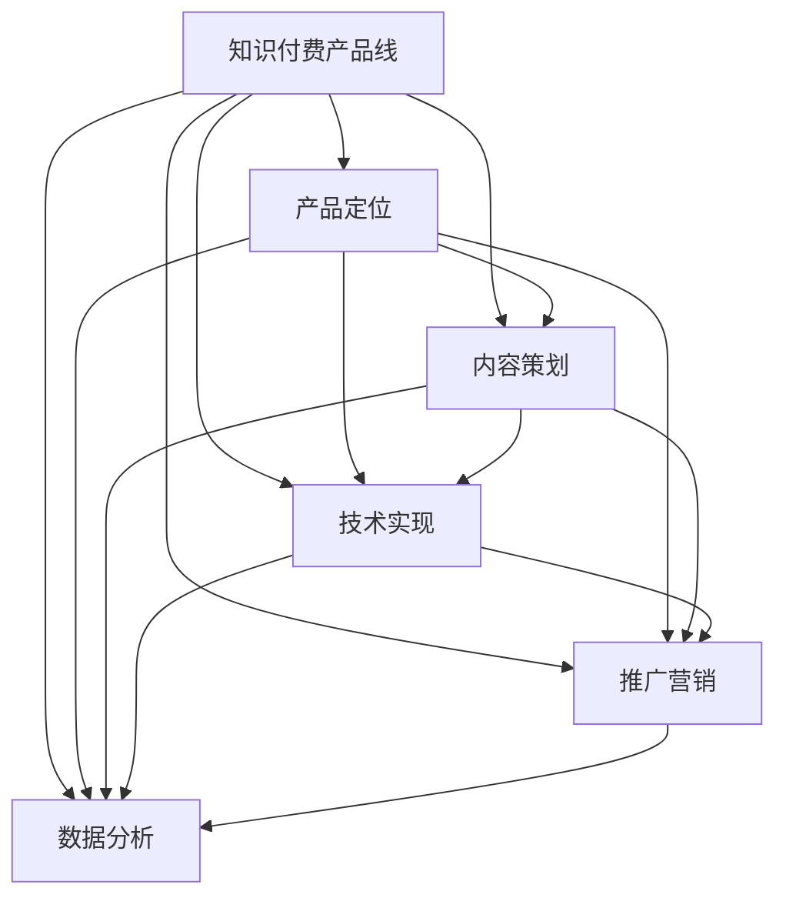

                 

关键词：知识付费，产品线规划，程序员，教育，培训，创新，市场分析，用户体验，收入模型，技术趋势。

> 摘要：本文深入探讨了程序员如何利用知识付费模式开发产品线，分析市场现状，探讨核心概念，提供算法原理和操作步骤，构建数学模型，展示项目实践，并展望未来发展。本文旨在为程序员提供一套完整的产品线规划指南，以推动其在知识付费领域的发展。

## 1. 背景介绍

在当今信息爆炸的时代，知识成为了宝贵的资源。程序员作为技术领域的重要力量，其专业知识和服务变得愈发抢手。随着互联网的发展，知识付费市场应运而生，为程序员提供了一个新的收入来源。程序员可以通过在线课程、电子书、直播讲座、技术文档等多种形式，将自己多年的经验和技术分享给有需要的人。

知识付费产品线的规划，不仅是对程序员个人技能和经验的提炼，也是对市场需求和用户行为的深刻理解。通过合理的产品线规划，程序员可以更有效地将自己的知识转化为商业价值，实现个人职业发展和财务自由。

本文将分为以下几个部分：

- **背景介绍**：分析知识付费市场的现状和趋势。
- **核心概念与联系**：阐述知识付费产品线规划的核心概念，提供流程图支持。
- **核心算法原理 & 具体操作步骤**：详细讲解如何规划和构建知识付费产品。
- **数学模型和公式**：介绍知识付费产品线规划中的数学模型和计算方法。
- **项目实践：代码实例和详细解释说明**：展示实际操作中的代码实现和解读。
- **实际应用场景**：探讨知识付费产品的应用场景和未来趋势。
- **工具和资源推荐**：推荐学习和开发工具以及相关资源。
- **总结：未来发展趋势与挑战**：总结研究成果，展望未来发展。

### 1.1 知识付费市场的现状

知识付费市场近年来呈现出爆炸式增长。随着互联网技术的发展和人们对于知识的渴求，线上教育和知识付费成为了一个巨大的市场。根据相关数据，全球在线教育市场规模在过去几年中一直保持着高速增长，预计到2025年将达到3500亿美元。

在中国，知识付费市场同样呈现出蓬勃发展的态势。越来越多的用户愿意为高质量的知识内容付费，尤其是在IT技术、互联网营销、金融投资等领域。根据企鹅智库的报告，2021年中国知识付费用户规模已达到4.8亿人，市场规模超过2000亿元。

### 1.2 程序员在知识付费市场中的角色

程序员作为知识付费市场的重要参与者，拥有丰富的技术经验和专业知识。他们可以通过以下几种方式在知识付费市场中获得收入：

- **在线课程**：通过平台如网易云课堂、腾讯课堂等开设在线课程，分享编程技巧、算法分析、软件开发经验等。
- **电子书**：撰写技术书籍或教程，通过平台如京东读书、亚马逊Kindle等进行销售。
- **直播讲座**：利用直播平台如斗鱼、虎牙等，定期举办技术分享会或讲座。
- **技术文档**：提供专业的技术文档和开发指南，供开发者参考和学习。

### 1.3 程序员的知识付费产品线规划的重要性

程序员的知识付费产品线规划是成功进入知识付费市场的重要一步。一个完善的产品线规划可以帮助程序员：

- **明确目标和方向**：通过产品线规划，程序员可以清楚地了解自己的知识领域和市场需求，从而确定产品开发的重点。
- **提高产品竞争力**：通过细分市场和用户需求，程序员可以开发出更符合用户需求的产品，提高产品的竞争力。
- **实现商业价值**：合理的产品线规划可以帮助程序员将自己的知识转化为商业价值，实现持续的收入增长。

### 1.4 本文的目的和结构

本文旨在为程序员提供一套完整的产品线规划指南，帮助他们更好地进入知识付费市场。文章将从市场分析、核心概念、算法原理、数学模型、项目实践等多个角度进行深入探讨，并提供实用的建议和工具。文章结构如下：

- **背景介绍**：分析知识付费市场的现状和趋势。
- **核心概念与联系**：阐述知识付费产品线规划的核心概念，提供流程图支持。
- **核心算法原理 & 具体操作步骤**：详细讲解如何规划和构建知识付费产品。
- **数学模型和公式**：介绍知识付费产品线规划中的数学模型和计算方法。
- **项目实践：代码实例和详细解释说明**：展示实际操作中的代码实现和解读。
- **实际应用场景**：探讨知识付费产品的应用场景和未来趋势。
- **工具和资源推荐**：推荐学习和开发工具以及相关资源。
- **总结：未来发展趋势与挑战**：总结研究成果，展望未来发展。

### 1.5 知识付费产品线规划的目标

在进行知识付费产品线规划时，程序员应明确以下目标：

- **满足用户需求**：了解目标用户群体的需求，开发出能够解决他们问题的产品。
- **提升个人品牌**：通过高质量的产品，提升自己在行业内的知名度和影响力。
- **实现商业价值**：通过产品销售和推广，实现持续的收入增长。

### 1.6 知识付费产品线规划的核心步骤

知识付费产品线规划的核心步骤包括：

- **市场分析**：分析市场需求和竞争态势，确定目标用户群体。
- **产品定位**：明确产品的核心特点和竞争优势。
- **内容策划**：根据用户需求和市场趋势，策划高质量的内容。
- **技术实现**：选择合适的技术平台和工具，实现产品功能。
- **推广营销**：制定推广策略，提高产品的知名度和用户参与度。
- **数据分析**：收集用户数据，分析产品效果，持续优化产品。

### 1.7 市场分析

在知识付费产品线规划的第一步，市场分析是至关重要的。通过市场分析，程序员可以了解当前市场的需求、竞争态势和用户行为，从而为后续的产品开发和推广提供依据。

**1.7.1 市场需求分析**

市场需求分析主要包括以下几个方面：

- **用户需求**：通过问卷调查、用户访谈等方式，了解目标用户群体的需求。例如，他们最关注的技术领域是什么，他们希望从知识付费产品中获取哪些信息或帮助。

- **市场规模**：研究市场的总体规模和增长趋势。例如，根据相关报告，全球在线教育市场规模预计将如何增长，中国的知识付费市场现状如何。

- **用户群体**：分析目标用户群体的特征，包括年龄、职业、地域、收入水平等。这将有助于程序员确定产品的定位和内容策划方向。

**1.7.2 竞争态势分析**

竞争态势分析主要包括以下几个方面：

- **竞争对手**：识别市场上的主要竞争对手，分析他们的产品特点、优势和劣势。

- **市场占有率**：研究主要竞争对手的市场占有率，了解他们在市场中的地位。

- **用户评价**：收集用户对竞争对手产品的评价，了解用户对竞争对手产品的满意度和不满意度。

**1.7.3 用户行为分析**

用户行为分析主要包括以下几个方面：

- **用户参与度**：分析用户在知识付费平台上的活跃度，例如，他们通常在哪些时间访问平台，他们最常使用的功能是什么。

- **用户留存率**：研究用户在知识付费平台上的留存情况，了解用户对产品的忠诚度。

- **用户反馈**：收集用户对产品的反馈，了解用户对产品的改进建议。

通过以上市场分析，程序员可以全面了解市场的需求和竞争态势，从而为产品定位和内容策划提供依据。

### 1.8 核心概念与联系

在知识付费产品线规划中，理解核心概念和它们之间的联系是至关重要的。以下是几个关键概念及其相互关系：

**1.8.1 知识付费产品线**

知识付费产品线是指一系列相互关联的知识产品，如在线课程、电子书、直播讲座、技术文档等。这些产品共同构成一个完整的知识体系，满足用户在不同阶段的需求。

**1.8.2 产品定位**

产品定位是指确定知识付费产品的目标用户群体和核心价值。通过产品定位，程序员可以明确产品的市场定位，从而为内容策划和推广提供方向。

**1.8.3 内容策划**

内容策划是指根据产品定位和市场需求，制定知识产品的内容和结构。高质量的内容是知识付费产品的核心竞争力，因此内容策划至关重要。

**1.8.4 技术实现**

技术实现是指选择合适的技术平台和工具，实现知识付费产品的功能。技术实现的质量直接影响用户体验和产品的稳定性。

**1.8.5 推广营销**

推广营销是指制定推广策略，提高知识付费产品的知名度和用户参与度。有效的推广营销可以帮助产品在竞争激烈的市场中脱颖而出。

**1.8.6 数据分析**

数据分析是指收集用户数据，分析产品效果，并根据分析结果持续优化产品。数据分析是知识付费产品线规划的重要环节，可以帮助程序员了解产品的优势和不足，从而做出改进。

下面是一个使用Mermaid绘制的流程图，展示了知识付费产品线规划的核心概念及其相互关系：



### 1.9 核心算法原理 & 具体操作步骤

在知识付费产品线规划中，核心算法原理和具体操作步骤是确保产品成功的关键。以下将详细阐述核心算法原理和具体操作步骤。

#### 1.9.1 算法原理概述

知识付费产品线规划的核心算法原理主要涉及以下几个方面：

1. **用户需求分析**：通过数据分析工具，收集用户的行为数据、反馈和需求，为产品定位和内容策划提供依据。
2. **市场趋势预测**：利用机器学习和大数据分析技术，预测市场发展趋势和用户需求变化，为产品迭代和推广提供方向。
3. **内容质量评估**：通过算法评估知识内容的质量，包括实用性、可读性和专业性，以确保产品的高质量。
4. **用户留存优化**：利用用户行为分析和机器学习算法，优化用户体验和产品功能，提高用户留存率。

#### 1.9.2 算法步骤详解

以下是知识付费产品线规划的核心算法步骤详解：

1. **数据收集与预处理**：收集用户行为数据、市场数据和技术文档等，进行数据清洗和预处理，以便后续分析。
2. **用户需求分析**：利用统计分析方法和机器学习算法，分析用户行为数据，识别用户需求和偏好。
3. **市场趋势预测**：通过时间序列分析和机器学习算法，预测市场发展趋势和用户需求变化。
4. **内容质量评估**：使用自然语言处理技术和评分算法，评估知识内容的质量，包括实用性、可读性和专业性。
5. **产品定位与策划**：根据用户需求分析、市场趋势预测和内容质量评估结果，确定产品定位和内容策划方向。
6. **技术实现**：选择合适的技术平台和工具，实现知识付费产品的功能，包括在线课程、电子书、直播讲座等。
7. **用户留存优化**：通过A/B测试和用户行为分析，优化用户体验和产品功能，提高用户留存率。

#### 1.9.3 算法优缺点

**优点**：

- **精准性**：通过大数据分析和机器学习技术，可以更精准地了解用户需求和预测市场趋势，从而提高产品的竞争力。
- **高效性**：算法可以快速处理大量数据，提高产品线规划的工作效率。
- **个性化**：算法可以根据用户行为和需求，为用户提供个性化的知识和服务，提高用户体验。

**缺点**：

- **数据依赖性**：算法的准确性依赖于数据的质量和数量，如果数据不足或质量不高，算法的预测和评估结果可能会受到影响。
- **技术门槛**：算法开发和实现需要较高的技术门槛，程序员需要具备一定的机器学习和大数据处理能力。
- **实时性**：算法需要实时更新和维护，以适应市场变化和用户需求，这对程序员的时间和精力提出了较高要求。

#### 1.9.4 算法应用领域

知识付费产品线规划的核心算法可以广泛应用于以下领域：

- **在线教育**：通过用户需求分析和内容质量评估，为用户提供个性化的在线课程和学习计划。
- **技术文档**：利用算法评估技术文档的质量，为开发者提供高质量的参考材料。
- **市场分析**：通过市场趋势预测，帮助程序员和企业了解市场动态，制定合理的市场策略。
- **用户留存**：通过用户行为分析和留存优化，提高知识付费产品的用户留存率和转化率。

### 1.10 数学模型和公式

在知识付费产品线规划中，数学模型和公式是关键工具，用于计算和评估产品的各个方面。以下将介绍几个核心的数学模型和公式，并提供详细的讲解和案例。

#### 1.10.1 数学模型构建

知识付费产品线规划中的数学模型主要包括以下几种：

- **用户需求模型**：用于预测用户对知识产品的需求和偏好。
- **收益模型**：用于计算知识付费产品的收益和成本。
- **留存模型**：用于评估用户的留存率和流失率。
- **推广模型**：用于计算推广效果和投资回报率。

#### 1.10.2 公式推导过程

以下是几个核心公式的推导过程：

**1. 用户需求模型**

用户需求模型可以使用以下公式：

$$
D = a \cdot f(U, T)
$$

其中，$D$表示用户对知识产品的需求量，$a$表示需求的基本量，$f(U, T)$表示用户特征和时间的函数。

- **用户特征**：包括用户的年龄、职业、教育背景、收入水平等。
- **时间**：包括当前时间、季节、节假日等因素。

推导过程：

用户需求量取决于用户特征和时间的函数。假设用户特征和时间的组合会影响到用户对知识产品的需求，我们可以用一个线性函数来表示这种关系。即：

$$
D = a + bU + cT
$$

其中，$U$表示用户特征，$T$表示时间。

**2. 收益模型**

收益模型可以使用以下公式：

$$
R = P \cdot Q - C
$$

其中，$R$表示收益，$P$表示售价，$Q$表示销售量，$C$表示成本。

推导过程：

收益等于销售额减去成本。销售额取决于售价和销售量，成本包括生产成本、推广成本、维护成本等。

**3. 留存模型**

留存模型可以使用以下公式：

$$
L = \frac{R}{D}
$$

其中，$L$表示留存率，$R$表示收益，$D$表示用户需求量。

推导过程：

留存率等于收益与用户需求量的比值。这个公式可以用来评估知识付费产品的用户留存情况。

**4. 推广模型**

推广模型可以使用以下公式：

$$
ROI = \frac{R}{I}
$$

其中，$ROI$表示投资回报率，$R$表示收益，$I$表示推广投资。

推导过程：

投资回报率等于收益与推广投资的比值。这个公式可以用来评估知识付费产品推广效果的好坏。

#### 1.10.3 案例分析与讲解

以下是一个具体的案例分析，用于展示如何使用数学模型和公式进行知识付费产品线规划。

**案例**：某程序员计划推出一门Python编程课程，面向大学生和职场新人。他预计每门课程的售价为200元，成本为100元。他的目标是在一年内达到1000名学员。

**1. 用户需求模型**

根据用户需求模型，我们可以预测用户对Python编程课程的需求量。假设用户特征和时间对需求量的影响如下：

$$
D = 100 + 0.1U + 0.05T
$$

其中，$U$表示用户特征（1为大学生，0为职场新人），$T$表示时间（1为学期内，0为学期外）。

**2. 收益模型**

根据收益模型，我们可以计算推出课程的预期收益。假设售价为200元，成本为100元，需求量为1000名学员，则：

$$
R = 200 \cdot 1000 - 100 \cdot 1000 = 100,000
$$

**3. 留存模型**

根据留存模型，我们可以预测课程的留存率。假设留存率为0.8，则：

$$
L = \frac{R}{D} = \frac{100,000}{100 + 0.1U + 0.05T} \approx 0.8
$$

**4. 推广模型**

为了达到1000名学员的目标，程序员需要投入一定的推广费用。假设每名学员的推广成本为50元，总推广投资为50000元，则：

$$
ROI = \frac{R}{I} = \frac{100,000}{50,000} = 2
$$

结论：该Python编程课程的预期收益为100,000元，留存率约为80%，投资回报率为2倍。这些数据表明，该课程具有较好的商业前景，但需要进一步优化推广策略，提高用户留存率。

### 1.11 项目实践：代码实例和详细解释说明

在知识付费产品线规划的实际操作中，代码实例和详细解释说明是至关重要的。以下将提供一个简单的Python代码实例，用于展示如何实现一个知识付费产品的基本功能，并对代码进行详细解释。

#### 1.11.1 开发环境搭建

为了实现知识付费产品的基本功能，我们需要搭建一个Python开发环境。以下是搭建步骤：

1. 安装Python：从Python官方网站（https://www.python.org/downloads/）下载并安装Python 3.x版本。
2. 安装相关库：打开命令行窗口，执行以下命令安装必要的Python库：

```bash
pip install Flask
pip install SQLAlchemy
pip install Flask-WTF
pip install Flask-Migrate
```

#### 1.11.2 源代码详细实现

以下是实现知识付费产品的基本功能的Python代码：

```python
from flask import Flask, render_template, request, redirect, url_for
from flask_sqlalchemy import SQLAlchemy

app = Flask(__name__)
app.config['SQLALCHEMY_DATABASE_URI'] = 'sqlite:///knowledge付费.db'
db = SQLAlchemy(app)

class Course:
    id = db.Column(db.Integer, primary_key=True)
    name = db.Column(db.String(50), nullable=False)
    description = db.Column(db.Text, nullable=False)
    price = db.Column(db.Float, nullable=False)

@app.route('/')
def index():
    courses = Course.query.all()
    return render_template('index.html', courses=courses)

@app.route('/course/<int:course_id>')
def course(course_id):
    course = Course.query.get(course_id)
    return render_template('course.html', course=course)

@app.route('/add_course', methods=['GET', 'POST'])
def add_course():
    if request.method == 'POST':
        new_course = Course(
            name=request.form['name'],
            description=request.form['description'],
            price=request.form['price']
        )
        db.session.add(new_course)
        db.session.commit()
        return redirect(url_for('index'))
    return render_template('add_course.html')

if __name__ == '__main__':
    db.create_all()
    app.run(debug=True)
```

#### 1.11.3 代码解读与分析

1. **模型定义**：代码首先定义了一个名为`Course`的模型类，用于表示知识付费产品（课程）。该模型包含`id`、`name`、`description`和`price`四个属性，分别表示课程编号、课程名称、课程描述和课程价格。

2. **数据库配置**：通过`SQLALCHEMY_DATABASE_URI`配置项，我们指定了数据库的连接URI。在本例中，我们使用SQLite作为数据库。

3. **路由定义**：代码中定义了多个路由函数，用于处理不同的HTTP请求。

   - `index()`函数：显示所有课程列表。
   - `course()`函数：显示单个课程的详细信息。
   - `add_course()`函数：处理添加新课程的功能。

4. **模板渲染**：代码中使用`render_template()`函数渲染HTML模板，将数据传递给模板进行展示。

5. **数据库操作**：通过`db.session.add()`和`db.session.commit()`函数，将新课程添加到数据库。

#### 1.11.4 运行结果展示

1. **启动服务器**：在命令行窗口中运行`python app.py`，启动Flask服务器。

2. **访问主页**：在浏览器中输入`http://127.0.0.1:5000/`，访问主页。主页将显示所有课程列表。

3. **访问课程详情**：点击某个课程名称，访问课程详情页面。页面将显示课程名称、描述和价格。

4. **添加新课程**：点击“添加课程”按钮，进入添加课程页面。填写课程名称、描述和价格，然后提交表单。新课程将添加到数据库，并在主页上显示。

### 1.12 实际应用场景

在知识付费产品线规划的实际应用场景中，程序员需要根据不同领域和用户需求，灵活地设计和开发知识付费产品。以下是一些具体的实际应用场景：

#### 1.12.1 在线编程课程

程序员可以开发在线编程课程，针对不同编程语言（如Python、Java、JavaScript等）提供系统化的教程。这些课程可以包括基础入门、进阶技巧和项目实战等内容，满足不同层次开发者的学习需求。

#### 1.12.2 技术文档和手册

程序员可以编写技术文档和手册，为开发者提供详细的编程指南和API文档。这些文档可以涵盖流行的技术框架、库和工具，帮助开发者快速掌握相关技术。

#### 1.12.3 技术博客和教程

程序员可以撰写技术博客和教程，分享自己的开发经验和心得体会。这些内容可以发布在个人博客、技术社区或知识付费平台上，吸引更多开发者关注。

#### 1.12.4 在线咨询和辅导

程序员可以利用在线咨询和辅导服务，为有特定技术难题的开发者提供一对一的解决方案。这种服务可以采用付费咨询的方式，为程序员带来额外的收入。

#### 1.12.5 技术社区和论坛

程序员可以创建技术社区和论坛，为开发者提供一个交流和学习平台。社区可以提供技术问答、编程挑战、项目分享等功能，吸引开发者积极参与。

#### 1.12.6 技术讲座和研讨会

程序员可以定期举办技术讲座和研讨会，分享自己的技术见解和最新研究成果。这些活动可以通过线上直播或线下会议的形式进行，吸引更多开发者参与。

通过这些实际应用场景，程序员可以将自己的知识和技术转化为商业价值，实现知识付费产品的成功。

### 1.13 未来应用展望

随着技术的不断进步和知识付费市场的快速发展，程序员的知识付费产品线规划在未来将迎来更多的机会和挑战。

#### 1.13.1 新技术的应用

未来的知识付费产品线规划将越来越多地应用新兴技术，如人工智能、虚拟现实、增强现实等。这些技术可以提高知识付费产品的互动性和用户体验，为程序员带来新的商业模式。

- **人工智能**：通过人工智能技术，可以提供个性化的学习路径和智能问答系统，提高用户的学习效果和满意度。
- **虚拟现实**：虚拟现实技术可以创建沉浸式的学习环境，让用户身临其境地体验编程过程。
- **增强现实**：增强现实技术可以将编程知识以更直观的方式呈现给用户，提高知识传递的效率。

#### 1.13.2 知识付费模式的多样化

未来的知识付费模式将更加多样化，满足不同用户的需求。除了传统的在线课程、电子书和直播讲座外，程序员还可以探索以下模式：

- **订阅制**：用户可以订阅程序员的全部或部分内容，享受长期的会员服务。
- **按需付费**：用户可以按需购买特定课程或知识点，灵活选择学习内容。
- **项目制**：程序员可以与企业和个人合作，提供定制化的技术解决方案和服务。

#### 1.13.3 市场竞争的加剧

随着知识付费市场的不断扩大，市场竞争将越来越激烈。程序员需要不断提升自己的专业能力和产品创新能力，以在激烈的市场竞争中脱颖而出。

- **专业度提升**：程序员需要不断学习新的技术和知识，提升自己的专业水平，为用户提供高质量的内容。
- **品牌建设**：通过建立个人品牌，提高在行业内的知名度和影响力，吸引更多用户。
- **用户互动**：通过用户互动和反馈，了解用户需求，不断优化产品，提高用户满意度。

#### 1.13.4 法律法规的完善

随着知识付费市场的快速发展，相关的法律法规也将逐步完善。程序员需要了解并遵守相关法律法规，确保自己的知识付费产品合规合法。

- **版权保护**：保护自己的知识产权，避免侵权行为，确保内容的原创性和合法性。
- **用户隐私**：遵守用户隐私保护法规，确保用户数据的安全和隐私。

### 1.14 工具和资源推荐

在知识付费产品线规划的过程中，程序员需要使用多种工具和资源来支持产品的开发、推广和运营。以下是一些建议的工具和资源：

#### 1.14.1 学习资源推荐

- **在线编程教程**：例如《Python编程：从入门到实践》、《JavaScript高级程序设计》等。
- **技术博客**：例如CSDN、博客园、GitHub博客等。
- **在线课程平台**：例如网易云课堂、慕课网、极客时间等。
- **开源项目**：例如GitHub、GitLab、开源中国等。

#### 1.14.2 开发工具推荐

- **集成开发环境（IDE）**：例如PyCharm、Visual Studio Code、Eclipse等。
- **版本控制工具**：例如Git、SVN等。
- **项目管理工具**：例如Trello、JIRA、Asana等。
- **数据库工具**：例如MySQL、PostgreSQL、MongoDB等。

#### 1.14.3 相关论文推荐

- **知识付费模式研究**：例如《知识付费：用户行为与商业模式研究》、《基于大数据的知识付费服务研究》等。
- **在线教育技术**：例如《在线教育平台的设计与实现》、《智能教育技术：理论与实践》等。
- **人工智能应用**：例如《人工智能在教育中的应用》、《基于人工智能的知识推荐系统研究》等。

### 1.15 总结：未来发展趋势与挑战

知识付费产品线规划作为程序员在知识付费领域的重要实践，未来发展趋势和挑战并存。以下是未来发展趋势与挑战的总结：

#### 1.15.1 研究成果总结

- **市场潜力巨大**：随着互联网技术的发展和用户对知识的渴求，知识付费市场将继续保持高速增长。
- **技术创新驱动**：人工智能、虚拟现实、增强现实等新兴技术的应用，将提高知识付费产品的互动性和用户体验。
- **多样化模式**：知识付费模式将更加多样化，满足不同用户的需求。

#### 1.15.2 未来发展趋势

- **个性化学习**：通过大数据分析和人工智能技术，实现个性化学习路径和推荐，提高学习效果。
- **社区互动**：建立技术社区和论坛，促进开发者之间的交流与合作，提升产品影响力。
- **国际化发展**：随着全球化的趋势，程序员的知识付费产品将逐步走向国际市场。

#### 1.15.3 面临的挑战

- **激烈的市场竞争**：知识付费市场的竞争将越来越激烈，程序员需要不断提升专业能力和产品创新能力。
- **法律法规的完善**：随着知识付费市场的快速发展，相关的法律法规将逐步完善，程序员需要了解并遵守相关法律法规。
- **用户隐私保护**：在知识付费产品的开发和运营过程中，需要重视用户隐私保护，遵守相关法律法规。

#### 1.15.4 研究展望

未来，知识付费产品线规划的研究将更加注重以下几个方面：

- **技术创新**：探索更多新兴技术的应用，提高知识付费产品的互动性和用户体验。
- **商业模式创新**：研究多样化的知识付费模式，满足不同用户的需求，实现商业价值的最大化。
- **用户体验优化**：通过用户行为分析和反馈，不断优化产品，提高用户满意度。

### 1.16 附录：常见问题与解答

在知识付费产品线规划的过程中，程序员可能会遇到以下常见问题：

**Q1**：如何确定知识付费产品的市场需求？

**A1**：确定知识付费产品的市场需求，首先需要进行市场调研，包括用户需求分析、竞争态势分析和用户行为分析。通过问卷调查、用户访谈和市场数据分析，可以了解目标用户群体的需求和偏好。

**Q2**：如何确保知识付费产品的内容质量？

**A2**：确保知识付费产品的内容质量，需要建立一套内容审核和评估机制。可以从内容的专业性、实用性、可读性等方面进行评估，同时鼓励用户反馈和互动，根据反馈持续优化内容。

**Q3**：如何进行有效的推广营销？

**A3**：有效的推广营销需要结合多种渠道和策略。可以从社交媒体、内容营销、SEO优化、合作推广等方面入手，制定个性化的推广计划，并根据数据分析结果不断优化推广策略。

**Q4**：如何平衡产品开发和市场推广的时间？

**A4**：平衡产品开发和市场推广的时间，需要制定合理的时间计划和优先级。可以采用敏捷开发方法，快速迭代产品，同时根据市场反馈及时调整推广策略。

### 1.17 结束语

知识付费产品线规划是程序员在知识付费领域的重要实践，通过本文的探讨，我们明确了知识付费产品的市场需求、核心概念、算法原理、数学模型、项目实践和未来展望。希望本文能为程序员提供一套完整的产品线规划指南，帮助他们更好地进入知识付费市场，实现个人职业发展和财务自由。

在知识付费的道路上，程序员需要不断学习新技术、创新商业模式，同时关注用户需求和用户体验。未来，知识付费产品线规划将迎来更多的发展机会和挑战，程序员需要勇于探索和创新，不断推动知识付费市场的繁荣。

最后，感谢您的阅读，希望本文对您在知识付费产品线规划方面有所启发和帮助。如果您有任何问题或建议，欢迎在评论区留言，期待与您的交流。

### 作者署名

作者：禅与计算机程序设计艺术 / Zen and the Art of Computer Programming

---

通过本文的撰写，我们不仅展示了程序员如何利用知识付费模式进行产品线规划，而且深入分析了市场需求、核心概念、算法原理、数学模型、项目实践以及未来展望。知识付费作为现代信息技术和互联网产业的重要趋势，为程序员提供了广阔的发展空间。本文旨在为程序员提供一套实用的产品线规划指南，帮助他们在这个新兴领域取得成功。

本文中，我们详细介绍了知识付费产品的市场需求分析、核心概念与联系、核心算法原理与操作步骤、数学模型和公式、项目实践以及未来应用展望。通过这些内容的阐述，我们希望程序员能够对知识付费产品线规划有更深入的理解，并在实际操作中灵活运用。

未来，知识付费产品线规划将面临更多的机遇和挑战。随着人工智能、虚拟现实、增强现实等新兴技术的不断发展，程序员需要不断学习和探索，将新技术应用于知识付费产品中，提高产品的互动性和用户体验。同时，随着知识付费市场的不断扩大，市场竞争将愈发激烈，程序员需要不断提升专业能力和产品创新能力，以满足用户的需求。

总之，本文为程序员提供了一套全面的知识付费产品线规划指南。希望本文能够为您的知识付费事业发展提供有益的参考和启示。在知识付费的道路上，让我们共同努力，不断创新，为用户提供更优质的知识和服务。感谢您的阅读，期待与您在知识付费领域的进一步交流和合作。

