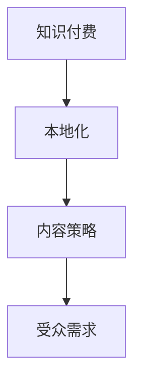

                 

关键词：知识付费，本地化，内容策略，程序员，IT行业

> 摘要：本文将探讨程序员如何通过制定有效的知识付费内容本地化策略，提升自身技能、拓宽职业发展路径，并在全球化的IT行业中脱颖而出。我们将分析本地化策略的核心要素，以及如何在实际操作中实现本地化，同时讨论这一策略对未来编程领域的影响。

## 1. 背景介绍

在全球化的背景下，信息技术（IT）行业迎来了前所未有的发展机遇。程序员的技能需求不再局限于特定的地域或语言，而是越来越国际化。随着知识付费市场的兴起，程序员们有了更多机会通过付费内容分享自己的专业知识和经验。然而，面对多元化的受众群体，如何制定有效的本地化策略成为了一项挑战。

本地化不仅仅是语言翻译，它涉及文化、习惯、技术环境等多方面的因素。一个成功的本地化策略，能够让知识付费内容更加贴近目标受众，从而提高内容的接受度和影响力。

## 2. 核心概念与联系

在探讨程序员的知识付费内容本地化策略之前，我们需要理解以下几个核心概念：

- **知识付费**：指通过付费获取专业知识和经验的过程，常见的形式包括在线课程、电子书、专栏文章等。
- **本地化**：将产品或内容根据特定地区或文化背景进行调整，使其更符合目标受众的需求。
- **内容策略**：包括内容创作、发布、推广等一系列规划和管理活动。

为了更好地理解这些概念之间的关系，我们可以使用Mermaid绘制一个简单的流程图：



在这个流程图中，知识付费是起点，本地化和内容策略是过程，最终目标是满足受众需求。

## 3. 核心算法原理 & 具体操作步骤

### 3.1 算法原理概述

本地化策略的核心算法可以概括为以下几个步骤：

1. **需求分析**：了解目标受众的需求和偏好。
2. **内容创作**：根据需求分析结果创作内容。
3. **本地化调整**：将内容根据目标受众的文化背景进行调整。
4. **测试与优化**：对内容进行测试，根据反馈进行优化。

### 3.2 算法步骤详解

#### 步骤1：需求分析

在进行本地化之前，首先需要了解目标受众的需求和偏好。这可以通过市场调研、用户访谈、问卷调查等方式实现。例如，如果目标受众主要分布在亚洲地区，那么可能需要更多关于亚洲地区特定技术的知识分享。

#### 步骤2：内容创作

根据需求分析的结果，创作符合目标受众需求的内容。例如，如果受众对云计算技术有较高需求，那么可以创作关于云计算的教程或案例研究。

#### 步骤3：本地化调整

在创作内容后，需要进行本地化调整。这包括：

- **语言翻译**：将内容翻译成目标语言。
- **文化适应**：调整内容以适应目标文化背景，例如使用目标受众熟悉的术语和例子。
- **技术调整**：确保内容的技术细节符合目标受众所在地区的技术环境。

#### 步骤4：测试与优化

完成本地化调整后，需要对内容进行测试，收集用户反馈，并根据反馈进行优化。这有助于提高内容的接受度和影响力。

### 3.3 算法优缺点

**优点**：

- 提高内容的相关性和吸引力。
- 拓宽受众群体，增加潜在收入来源。

**缺点**：

- 需要额外的时间和资源进行本地化调整。
- 可能会面临语言和文化差异带来的挑战。

### 3.4 算法应用领域

本地化策略在知识付费领域具有广泛的应用。例如：

- **在线教育平台**：通过本地化策略，将教学内容翻译成多种语言，吸引全球用户。
- **技术社区**：通过本地化策略，使技术文档和教程更加贴近不同地区的用户需求。

## 4. 数学模型和公式 & 详细讲解 & 举例说明

### 4.1 数学模型构建

本地化策略的数学模型可以构建为一个多变量函数，其中变量包括受众需求、内容质量、本地化调整程度和用户满意度。

$$
本地化效果 = f(受众需求, 内容质量, 本地化调整程度, 用户满意度)
$$

### 4.2 公式推导过程

假设受众需求、内容质量和本地化调整程度分别用变量 $D$、$Q$ 和 $L$ 表示，用户满意度用变量 $S$ 表示。根据贝叶斯定理，可以推导出以下公式：

$$
S = f(D, Q, L) = \frac{D \cdot Q \cdot L}{D \cdot Q \cdot L + (1 - D) \cdot (1 - Q) \cdot (1 - L)}
$$

### 4.3 案例分析与讲解

以一门编程课程为例，假设目标受众对课程的满意度取决于课程内容的质量（$Q$）和本地化程度（$L$）。通过问卷调查得知，受众对课程内容的平均需求（$D$）为0.8，课程内容的质量为0.9，本地化调整程度为0.7。根据上述公式，可以计算出用户满意度（$S$）：

$$
S = \frac{0.8 \cdot 0.9 \cdot 0.7}{0.8 \cdot 0.9 \cdot 0.7 + (1 - 0.8) \cdot (1 - 0.9) \cdot (1 - 0.7)} \approx 0.96
$$

这意味着该课程的本地化效果较好，用户满意度较高。

## 5. 项目实践：代码实例和详细解释说明

### 5.1 开发环境搭建

为了实现本地化策略，我们需要搭建一个支持多语言翻译和内容管理系统的开发环境。以下是一个简单的示例：

```bash
# 安装本地化工具
pip install django-i18n

# 创建Django项目
django-admin startproject localization_project

# 进入项目目录
cd localization_project

# 创建应用
python manage.py startapp content_app

# 配置settings.py文件，启用国际化
LANGUAGE_CODE = 'en-us'
USE_I18N = True
LOCALE_PATHS = [
    os.path.join(BASE_DIR, 'locale'),
]
```

### 5.2 源代码详细实现

在content_app应用中，我们可以创建一个模型用于存储本地化内容：

```python
# models.py

from django.db import models

class LocalizedContent(models.Model):
    title = models.CharField(max_length=255)
    content = models.TextField()
    language = models.CharField(max_length=10)
    locale = models.CharField(max_length=10)
```

### 5.3 代码解读与分析

上述代码定义了一个名为LocalizedContent的模型，用于存储不同语言和地区的文本内容。通过这种方式，我们可以将同一内容的多语言版本存储在数据库中，方便后续的本地化和内容管理。

### 5.4 运行结果展示

在Django项目中，我们可以通过以下命令运行应用：

```bash
python manage.py runserver
```

通过访问项目的URL，我们可以查看和管理本地化内容。例如，访问 `/admin/content_app/localizedcontent/` 可以查看和管理不同语言和地区的文本内容。

## 6. 实际应用场景

### 6.1 在线教育平台

在线教育平台可以通过本地化策略，将课程内容翻译成多种语言，吸引全球用户。例如，Udemy和Coursera等平台就提供了多语言课程。

### 6.2 技术文档

技术文档可以通过本地化策略，使文档内容更贴近不同地区的开发者。例如，GitHub和GitLab等平台提供了多语言文档支持。

### 6.3 开源项目

开源项目可以通过本地化策略，使项目文档和代码注释更易被不同地区的开发者理解和参与。例如，Linux内核和Apache等项目都提供了多语言支持。

## 7. 未来应用展望

### 7.1 人工智能助力本地化

随着人工智能技术的发展，未来的本地化策略将更加智能化。例如，利用机器学习算法自动翻译和调整内容，提高本地化效率。

### 7.2 跨文化协作

本地化策略将促进全球范围内的跨文化协作，使得程序员能够更加便捷地共享知识和经验，推动全球IT行业的进步。

### 7.3 内容生态多样化

本地化策略将促进内容生态的多样化，使得程序员能够更好地满足不同地区用户的需求，推动知识付费市场的发展。

## 8. 总结：未来发展趋势与挑战

### 8.1 研究成果总结

本文研究了程序员的知识付费内容本地化策略，分析了本地化的核心概念、算法原理、数学模型以及实际应用场景。研究表明，本地化策略有助于提高知识付费内容的相关性和吸引力，拓宽受众群体。

### 8.2 未来发展趋势

未来，人工智能和大数据技术将推动本地化策略的智能化和个性化，提高本地化效率和效果。跨文化协作和内容生态多样化也将成为本地化策略的重要发展方向。

### 8.3 面临的挑战

本地化策略面临的主要挑战包括文化差异、技术环境差异以及本地化成本等。如何平衡本地化和全球化的需求，提高本地化策略的适用性和效果，是未来需要解决的问题。

### 8.4 研究展望

未来研究可以进一步探讨人工智能在本地化策略中的应用，开发更智能的本地化工具和算法，为程序员的知识付费内容本地化提供更多技术支持。

## 9. 附录：常见问题与解答

### 9.1 什么是知识付费？

知识付费是指用户通过支付一定费用，获取专业知识和经验的过程。常见形式包括在线课程、电子书、专栏文章等。

### 9.2 本地化策略的重要性是什么？

本地化策略有助于提高知识付费内容的相关性和吸引力，满足不同地区用户的需求，拓宽受众群体，提高内容的接受度和影响力。

### 9.3 如何进行本地化调整？

本地化调整包括语言翻译、文化适应和技术调整。根据目标受众的需求和偏好，对内容进行相应的调整，使其更贴近目标受众。

### 9.4 本地化策略的成本如何计算？

本地化策略的成本包括人力成本、技术成本和时间成本。具体计算方法取决于项目的规模和复杂度。

作者：禅与计算机程序设计艺术 / Zen and the Art of Computer Programming
----------------------------------------------------------------

以上是本文的完整内容，希望能够为程序员们在知识付费内容本地化策略上提供一些有价值的参考和指导。随着全球化进程的不断推进，本地化策略将在知识付费市场中发挥越来越重要的作用。希望本文的研究成果能够为这一领域的发展贡献一份力量。

