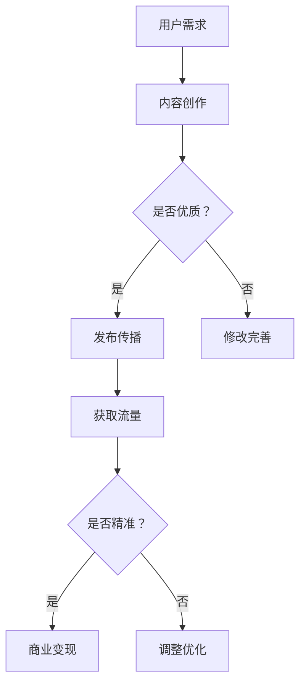

                 

关键词：知识付费、内容营销、程序员、策略、营销传播

摘要：本文将探讨程序员如何通过知识付费内容营销策略，提高个人品牌价值，实现职业发展。文章首先介绍了知识付费和内容营销的概念，然后分析了程序员在这一领域的优势，最后提出了具体的内容营销策略和实践案例。

## 1. 背景介绍

随着互联网和信息技术的发展，知识付费和内容营销逐渐成为热门话题。知识付费是指用户为获取有价值的信息或知识而支付费用，如在线课程、专业咨询、电子书等。内容营销则是指通过创造和传播有价值的内容，吸引潜在用户，提高品牌知名度和影响力。

程序员作为IT行业的核心力量，凭借其专业知识和技术技能，在知识付费和内容营销领域拥有巨大的潜力。然而，如何有效地利用这一潜力，实现个人和职业的突破，成为程序员们共同面临的问题。

## 2. 核心概念与联系

### 2.1 知识付费

知识付费是指用户为获取有价值的信息或知识而支付费用。在知识付费领域，程序员可以通过以下几种方式实现收入：

1. **在线课程**：利用个人专业知识和经验，开发并销售在线课程。
2. **专业咨询**：为企业或个人提供技术解决方案，以咨询费为主要收入来源。
3. **电子书**：撰写并销售专业书籍，分享技术心得和实战经验。

### 2.2 内容营销

内容营销是指通过创造和传播有价值的内容，吸引潜在用户，提高品牌知名度和影响力。对于程序员来说，内容营销的优势在于：

1. **知识传播**：通过撰写博客、发表技术文章、录制视频等形式，分享技术心得和经验，帮助他人解决问题。
2. **品牌塑造**：通过高质量的内容，建立个人专业形象，提升个人品牌价值。
3. **流量获取**：通过内容引流，提高网站或社交媒体的关注度，为后续的商业变现奠定基础。

### 2.3 Mermaid 流程图

下面是一个简化的知识付费内容营销流程图，展示了程序员如何通过内容营销实现知识付费。



## 3. 核心算法原理 & 具体操作步骤

### 3.1 算法原理概述

知识付费内容营销的核心算法可以概括为以下三个步骤：

1. **内容创作**：根据用户需求，创作有价值、有深度的内容。
2. **发布传播**：通过多种渠道，将内容传播给潜在用户。
3. **商业变现**：利用内容的影响力，实现商业价值。

### 3.2 算法步骤详解

1. **内容创作**

   内容创作是知识付费内容营销的核心环节。程序员应结合自身专业知识和经验，创作有针对性、有深度、有实用性的内容。具体步骤如下：

   - **选题**：根据用户需求和市场热点，确定内容主题。
   - **调研**：收集相关资料，深入了解主题，确保内容的准确性。
   - **撰写**：按照逻辑清晰、结构严谨、语言简洁的原则，撰写内容。
   - **审核**：对内容进行多轮审核，确保内容的准确性和可读性。

2. **发布传播**

   发布传播是内容营销的关键步骤。程序员应利用多种渠道，将内容传播给潜在用户。具体步骤如下：

   - **选择平台**：根据内容类型和目标用户，选择合适的发布平台。
   - **优化标题**：为内容起一个吸引人的标题，提高点击率。
   - **发布内容**：将内容发布到所选平台，并保持更新。
   - **推广传播**：利用社交媒体、微信群、QQ群等渠道，推广内容。

3. **商业变现**

   商业变现是知识付费内容营销的目标。程序员可以利用以下几种方式实现商业变现：

   - **在线课程**：将内容转化为在线课程，销售课程。
   - **专业咨询**：为企业或个人提供咨询服务，收取咨询费。
   - **电子书**：将内容整理成书籍，销售书籍。

### 3.3 算法优缺点

1. **优点**

   - **高回报**：通过知识付费，程序员可以实现较高的回报。
   - **灵活性**：程序员可以根据市场需求，随时调整内容和推广策略。
   - **品牌塑造**：高质量的内容有助于提升个人品牌价值。

2. **缺点**

   - **创作难度**：内容创作需要具备较高的专业素养和写作能力。
   - **市场竞争**：知识付费领域竞争激烈，需要不断更新和优化内容。

### 3.4 算法应用领域

知识付费内容营销算法在程序员领域具有广泛的应用。以下是一些具体的应用领域：

- **在线教育**：程序员可以通过在线课程，传授技术知识和经验。
- **技术分享**：程序员可以通过博客、技术文章、视频等形式，分享技术心得和经验。
- **专业咨询**：程序员可以为企业或个人提供技术解决方案，收取咨询费。
- **电子书**：程序员可以撰写专业书籍，分享技术心得和实战经验。

## 4. 数学模型和公式 & 详细讲解 & 举例说明

### 4.1 数学模型构建

知识付费内容营销的数学模型可以简化为以下公式：

\[ 收入 = 内容质量 \times 流量 \times 转化率 \]

其中，内容质量、流量和转化率是三个关键因素。

### 4.2 公式推导过程

1. **内容质量**：高质量的内容能够吸引更多用户，提高用户满意度，从而提高转化率。

\[ 转化率 = 质量系数 \times (1 - 满足度差距) \]

其中，质量系数表示内容质量对转化率的影响，满足度差距表示用户对内容的满意度。

2. **流量**：流量是知识付费内容营销的重要基础。流量越高，潜在用户越多。

\[ 流量 = 用户基数 \times 关注度 \]

其中，用户基数表示潜在用户的数量，关注度表示用户对内容的兴趣。

3. **转化率**：转化率是知识付费内容营销的核心目标。转化率越高，收入越高。

\[ 收入 = 流量 \times 转化率 \]

### 4.3 案例分析与讲解

假设一名程序员打算通过撰写技术博客实现知识付费。我们可以根据上述数学模型，对其收入进行预测。

1. **内容质量**：该程序员的博客内容以深入浅出、实用性高著称，质量系数为1.5。

2. **流量**：该程序员的博客已积累了一定数量的忠实粉丝，用户基数约为1000人，关注度系数为1.2。

3. **转化率**：该程序员的博客文章平均阅读量为5000次，转化率为10%。

根据上述数据，我们可以计算出该程序员的收入预测：

\[ 收入 = 1.5 \times 1000 \times 1.2 \times 5000 \times 0.1 = 9000 \]

因此，该程序员的预计收入为9000元。

## 5. 项目实践：代码实例和详细解释说明

### 5.1 开发环境搭建

在本案例中，我们将使用Markdown编写技术博客，并在GitHub Pages上部署。以下是开发环境搭建的步骤：

1. **安装Markdown编辑器**：如Typora、MarkdownPad等。
2. **安装Git**：从[Git官网](https://git-scm.com/)下载并安装。
3. **注册GitHub账号**：在[GitHub官网](https://github.com/)注册账号。
4. **创建GitHub仓库**：在GitHub上创建一个名为“tech_blog”的仓库。

### 5.2 源代码详细实现

以下是一个简单的Markdown博客文章示例：

```markdown
# 程序员的知识付费内容营销策略

> 关键词：知识付费、内容营销、程序员、策略、营销传播

摘要：本文将探讨程序员如何通过知识付费内容营销策略，提高个人品牌价值，实现职业发展。

## 1. 背景介绍

随着互联网和信息技术的发展，知识付费和内容营销逐渐成为热门话题。

## 2. 核心概念与联系

### 2.1 知识付费

知识付费是指用户为获取有价值的信息或知识而支付费用。

### 2.2 内容营销

内容营销是指通过创造和传播有价值的内容，吸引潜在用户，提高品牌知名度和影响力。

## 3. 核心算法原理 & 具体操作步骤

### 3.1 算法原理概述

知识付费内容营销的核心算法可以概括为以下三个步骤：

1. 内容创作
2. 发布传播
3. 商业变现

### 3.2 算法步骤详解

1. 内容创作

   内容创作是知识付费内容营销的核心环节。

2. 发布传播

   发布传播是内容营销的关键步骤。

3. 商业变现

   商业变现是知识付费内容营销的目标。

## 4. 数学模型和公式 & 详细讲解 & 举例说明

### 4.1 数学模型构建

知识付费内容营销的数学模型可以简化为以下公式：

\[ 收入 = 内容质量 \times 流量 \times 转化率 \]

## 5. 项目实践：代码实例和详细解释说明

### 5.1 开发环境搭建

在本案例中，我们将使用Markdown编写技术博客，并在GitHub Pages上部署。

### 5.2 源代码详细实现

以下是一个简单的Markdown博客文章示例：

```
```

### 5.3 代码解读与分析

上述代码是一个简单的Markdown博客文章示例，其中包含了文章标题、摘要、章节标题和段落内容。Markdown语法简单易学，可以方便地编写和格式化文章。

### 5.4 运行结果展示

将上述Markdown代码保存为`.md`文件，使用Markdown编辑器打开，即可看到格式化的文章。将文章上传到GitHub仓库，并设置GitHub Pages访问，即可在互联网上展示文章。

## 6. 实际应用场景

知识付费内容营销策略在程序员领域具有广泛的应用场景。以下是一些实际应用场景：

1. **技术博客**：程序员可以通过撰写技术博客，分享技术心得和经验，吸引潜在用户，提高个人品牌价值。
2. **在线课程**：程序员可以开发并销售在线课程，传授技术知识和经验，实现商业变现。
3. **专业咨询**：程序员可以为企业或个人提供技术解决方案，收取咨询费。
4. **电子书**：程序员可以撰写专业书籍，分享技术心得和实战经验，扩大影响力。

### 6.4 未来应用展望

随着互联网和信息技术的发展，知识付费内容营销策略在程序员领域的应用前景广阔。未来，我们可以预见以下趋势：

1. **个性化内容**：根据用户需求，提供个性化的内容和解决方案。
2. **跨界合作**：与其他领域专业人士合作，拓展知识付费内容领域。
3. **AI技术应用**：利用人工智能技术，优化内容创作、传播和商业变现过程。
4. **社交化营销**：通过社交媒体，扩大内容传播范围，提高用户参与度。

## 7. 工具和资源推荐

### 7.1 学习资源推荐

1. **《内容营销实战手册》**：一本全面介绍内容营销策略和实践的书籍。
2. **《GitHub Pages 指南》**：介绍如何使用GitHub Pages部署个人博客的教程。

### 7.2 开发工具推荐

1. **Markdown编辑器**：如Typora、MarkPad等。
2. **Git客户端**：如GitHub Desktop、SourceTree等。

### 7.3 相关论文推荐

1. **《知识付费：现状、挑战与未来趋势》**
2. **《内容营销：策略、实践与案例分析》**

## 8. 总结：未来发展趋势与挑战

### 8.1 研究成果总结

本文通过分析知识付费和内容营销的概念，探讨了程序员如何通过知识付费内容营销策略，提高个人品牌价值，实现职业发展。

### 8.2 未来发展趋势

未来，知识付费内容营销策略在程序员领域的应用将更加广泛，个性化内容、跨界合作、AI技术应用和社交化营销将成为主要趋势。

### 8.3 面临的挑战

1. **内容创作难度**：程序员需要不断提升专业素养和写作能力，创作高质量的内容。
2. **市场竞争激烈**：知识付费领域竞争激烈，程序员需要不断优化内容和营销策略。
3. **用户信任问题**：建立用户信任是知识付费内容营销的关键，程序员需要注重用户体验。

### 8.4 研究展望

未来，我们可以从以下几个方面展开研究：

1. **内容创作方法**：探索更高效的内容创作方法，提高内容质量和创作效率。
2. **营销策略优化**：研究更有效的营销策略，提高内容传播效果和用户转化率。
3. **案例分析**：对成功案例进行深入分析，总结经验教训，为其他程序员提供借鉴。

## 9. 附录：常见问题与解答

### 9.1 问题1：如何提高内容创作效率？

**解答**：可以采用以下方法提高内容创作效率：

1. **制定写作计划**：合理安排时间，确保每天都有内容产出。
2. **利用模板**：使用模板和框架，快速搭建文章结构。
3. **多人协作**：组建写作团队，分工合作，提高创作效率。

### 9.2 问题2：如何提高内容传播效果？

**解答**：可以采用以下方法提高内容传播效果：

1. **优化标题**：为内容起一个吸引人的标题，提高点击率。
2. **利用社交媒体**：通过社交媒体平台，扩大内容传播范围。
3. **与行业KOL合作**：与知名博主、专家合作，提高内容影响力。

### 9.3 问题3：如何建立用户信任？

**解答**：可以采用以下方法建立用户信任：

1. **保证内容质量**：提供高质量、有价值的内容，满足用户需求。
2. **积极互动**：与用户互动，及时回复问题和建议。
3. **展示专业背景**：展示自己的专业背景和成就，增强用户信任。

