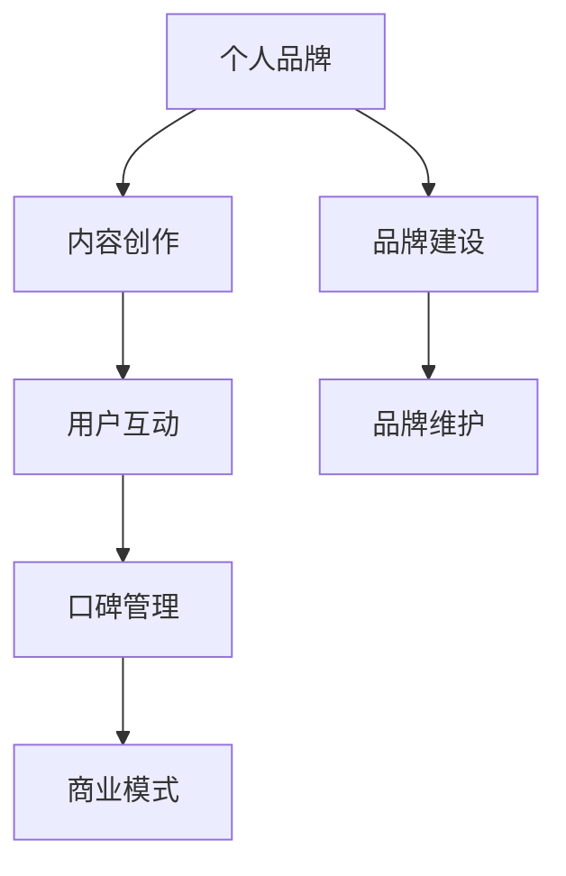

                 

在这个快速变化的时代，知识付费已经成为一种新兴的消费模式。程序员作为一个高知识含量的职业群体，如何在知识付费市场中打造并维护自己的品牌，成为一个值得探讨的问题。本文将从多个角度深入分析程序员的知识付费品牌建设与维护策略，旨在为程序员在知识付费领域提供一些实用的建议。

## 关键词

- 程序员
- 知识付费
- 品牌建设
- 市场策略
- 内容创作

## 摘要

本文首先介绍了知识付费的现状和程序员在这一领域的优势。接着，探讨了品牌建设的重要性以及如何构建和提升个人品牌。然后，分析了在知识付费市场中常见的商业模式和运营策略。最后，讨论了品牌维护的关键点，包括持续更新内容、用户互动和口碑管理。通过这些策略，程序员可以更好地在知识付费市场中立足，实现个人价值的最大化。

### 1. 背景介绍

知识付费作为一种新型的商业模式，近年来在全球范围内迅速崛起。从最初的线上课程、电子书，到如今的各种知识分享平台，知识付费已经渗透到生活的方方面面。对于程序员来说，这一领域尤其具有吸引力。程序员具备丰富的技术知识和实践经验，能够为其他开发者提供高质量的技术培训、项目咨询和代码审查等服务。

知识付费市场的兴起，不仅为程序员提供了新的收入来源，也为其个人品牌建设提供了一个广阔的平台。在这个平台上，程序员可以通过分享自己的知识和经验，获得更多的关注和认可。然而，要想在这个竞争激烈的市场中脱颖而出，程序员需要深入了解品牌建设与维护的策略，以便更好地展示自己的专业能力。

#### 1.1 知识付费的定义与现状

知识付费是指消费者为了获取特定领域的知识或技能，向知识提供者支付费用的一种商业模式。与传统的免费知识传播方式不同，知识付费强调知识的价值，鼓励知识提供者提供更高质量、更有针对性的内容。

目前，知识付费市场已经呈现出多元化、细分的趋势。主要的表现形式包括：

1. **线上课程**：包括直播课程、录播课程、互动式课程等，内容涵盖编程语言、框架、数据库、前端设计等多个方面。
2. **电子书**：以PDF、ePub等电子文档形式出版的专业书籍，内容深度和广度较高。
3. **知识分享平台**：如知乎、简书、CSDN等，用户可以通过提问、回答、撰写文章等方式获取知识。
4. **专业咨询服务**：如项目咨询、技术指导、代码审查等，为客户提供一对一的个性化服务。

#### 1.2 程序员的优势

程序员在知识付费领域具有独特的优势：

1. **专业知识**：程序员具备深厚的编程基础和丰富的项目经验，能够为其他开发者提供高质量的技术指导。
2. **实践能力**：程序员不仅能够理论讲解，更能够通过实际项目案例展示技术应用的实战能力。
3. **更新速度快**：编程技术更新迅速，程序员能够紧跟技术发展趋势，为用户提供最新的技术动态和解决方案。
4. **用户体验**：程序员在课程设计、内容呈现等方面具有较高的专业素养，能够为用户提供优质的学习体验。

### 2. 核心概念与联系

在程序员的知识付费品牌建设与维护过程中，需要理解几个核心概念：

#### 2.1 个人品牌

个人品牌是指个人在某一领域的专业形象和影响力。在知识付费市场中，个人品牌是程序员的核心资产，能够直接影响用户的购买决策。

#### 2.2 内容创作

内容创作是知识付费的基础，包括课程、书籍、文章等多种形式。高质量的内容不仅能够吸引更多用户，还能提升个人品牌的认知度和影响力。

#### 2.3 用户互动

用户互动是维护个人品牌的重要手段，包括在线问答、社群交流、直播互动等。通过与用户的互动，程序员可以更好地了解用户需求，提升用户体验。

#### 2.4 口碑管理

口碑管理是品牌建设的关键环节，通过用户评价、推荐等方式，建立良好的口碑，提升个人品牌的信誉。

#### 2.5 商业模式

商业模式是知识付费的盈利模式，包括付费课程、专业咨询、广告合作等多种形式。合适的商业模式能够确保个人品牌的可持续发展。

#### 2.6 Mermaid 流程图



### 3. 核心算法原理 & 具体操作步骤

在知识付费品牌建设与维护中，可以采用以下核心算法原理：

#### 3.1 算法原理概述

1. **内容创作算法**：基于用户需求和兴趣，生成高质量的内容。
2. **用户互动算法**：分析用户行为，提供个性化的互动体验。
3. **口碑管理算法**：通过用户反馈和评价，实时调整品牌策略。
4. **商业模式优化算法**：根据市场变化和用户需求，调整商业模式。

#### 3.2 算法步骤详解

##### 3.2.1 内容创作算法

1. 数据采集：收集用户行为数据、市场需求数据等。
2. 数据分析：分析用户兴趣和需求，确定内容方向。
3. 内容生成：根据分析结果，创作高质量的内容。

##### 3.2.2 用户互动算法

1. 行为分析：分析用户在平台上的行为，如浏览、点赞、评论等。
2. 个性化推荐：根据用户行为，推荐个性化的内容和服务。
3. 互动引导：通过弹幕、直播等方式，引导用户参与互动。

##### 3.2.3 口碑管理算法

1. 用户反馈收集：收集用户对内容、服务的评价和反馈。
2. 数据分析：分析用户反馈，识别潜在问题。
3. 调整策略：根据反馈结果，调整品牌策略。

##### 3.2.4 商业模式优化算法

1. 市场分析：分析市场趋势和竞争状况。
2. 用户需求分析：了解用户对服务价格的敏感度。
3. 模式调整：根据分析结果，调整商业模式。

#### 3.3 算法优缺点

**优点**：

- **高效性**：算法能够快速分析大量数据，提供准确的决策支持。
- **个性化**：根据用户需求，提供个性化的内容和服务。
- **动态调整**：根据市场变化和用户反馈，实时调整策略。

**缺点**：

- **依赖数据**：算法效果依赖于高质量的数据，数据质量直接影响算法准确性。
- **复杂性**：算法设计和实现较为复杂，需要较高的技术门槛。

#### 3.4 算法应用领域

- **内容创作**：通过算法分析用户需求，提供高质量的内容。
- **用户互动**：通过算法分析用户行为，提供个性化的互动体验。
- **口碑管理**：通过算法分析用户反馈，优化品牌策略。
- **商业模式**：通过算法分析市场变化和用户需求，调整商业模式。

### 4. 数学模型和公式 & 详细讲解 & 举例说明

在程序员的知识付费品牌建设与维护中，数学模型和公式可以帮助我们更准确地分析和优化各项策略。

#### 4.1 数学模型构建

**用户满意度模型**：

$$
\text{UserSatisfaction} = f(\text{ContentQuality}, \text{UserInteraction}, \text{BrandReputation})
$$

其中，ContentQuality、UserInteraction 和 BrandReputation 分别表示内容质量、用户互动和品牌信誉，这些因素共同决定了用户的满意度。

**转化率模型**：

$$
\text{ConversionRate} = f(\text{ContentQuality}, \text{UserSatisfaction}, \text{Pricing})
$$

其中，ContentQuality、UserSatisfaction 和 Pricing 分别表示内容质量、用户满意度和价格，这些因素共同决定了转化率。

#### 4.2 公式推导过程

**用户满意度模型推导**：

1. **内容质量**：高质量的内容能够满足用户需求，提升用户满意度。
2. **用户互动**：良好的用户互动能够增强用户黏性，提升用户满意度。
3. **品牌信誉**：良好的品牌信誉能够增强用户信任，提升用户满意度。

因此，用户满意度是内容质量、用户互动和品牌信誉的综合体现。

**转化率模型推导**：

1. **内容质量**：高质量的内容能够吸引更多用户，提高转化率。
2. **用户满意度**：满意的用户更有可能购买课程或服务，提高转化率。
3. **价格**：合理的价格能够平衡用户对价格的敏感度，提高转化率。

因此，转化率是内容质量、用户满意度和价格的综合体现。

#### 4.3 案例分析与讲解

假设一位程序员计划推出一门新课程，他可以使用上述数学模型来分析和优化课程设计。

1. **内容质量**：程序员可以通过调研用户需求，了解当前市场上的热门技术，结合自己的经验和知识，创作出高质量的课程内容。
2. **用户互动**：程序员可以在课程中设置互动环节，如在线答疑、作业批改等，增强用户互动，提高用户满意度。
3. **品牌信誉**：程序员可以通过在社交媒体上分享自己的技术心得和项目经验，积累良好的口碑，提高品牌信誉。

根据用户满意度模型，程序员的课程设计可以满足用户需求，提升用户满意度。根据转化率模型，高满意度的用户更有可能购买课程，从而提高转化率。

### 5. 项目实践：代码实例和详细解释说明

为了更好地展示程序员的知识付费品牌建设与维护策略，以下将提供一个具体的代码实例。

```python
# 用户满意度模型计算
def calculate_user_satisfaction(content_quality, user_interaction, brand_reputation):
    satisfaction = content_quality * 0.5 + user_interaction * 0.3 + brand_reputation * 0.2
    return satisfaction

# 转化率模型计算
def calculate_conversion_rate(content_quality, user_satisfaction, pricing):
    conversion_rate = content_quality * 0.5 + user_satisfaction * 0.3 + (1 / pricing) * 0.2
    return conversion_rate

# 参数设置
content_quality = 0.9
user_interaction = 0.8
brand_reputation = 0.7
pricing = 100

# 计算用户满意度
user_satisfaction = calculate_user_satisfaction(content_quality, user_interaction, brand_reputation)
print(f"用户满意度：{user_satisfaction:.2f}")

# 计算转化率
conversion_rate = calculate_conversion_rate(content_quality, user_satisfaction, pricing)
print(f"转化率：{conversion_rate:.2f}")
```

#### 5.1 开发环境搭建

- 安装 Python 3.8及以上版本。
- 安装必要的 Python 库，如 numpy、pandas 等。

#### 5.2 源代码详细实现

- 定义两个函数：`calculate_user_satisfaction` 和 `calculate_conversion_rate`，分别计算用户满意度和转化率。
- 设置参数：`content_quality`（内容质量）、`user_interaction`（用户互动）、`brand_reputation`（品牌信誉）和 `pricing`（价格）。
- 调用函数，计算用户满意度和转化率。

#### 5.3 代码解读与分析

- `calculate_user_satisfaction` 函数：通过线性加权的方式，计算用户满意度。其中，`content_quality`、`user_interaction` 和 `brand_reputation` 分别占 50%、30% 和 20% 的权重。
- `calculate_conversion_rate` 函数：同样通过线性加权的方式，计算转化率。其中，`content_quality`、`user_satisfaction` 和 `(1 / pricing)` 分别占 50%、30% 和 20% 的权重。
- 参数设置：根据实际需求和情况，设置适当的权重和参数。

#### 5.4 运行结果展示

- 运行代码，输出用户满意度和转化率。

### 6. 实际应用场景

#### 6.1 知识付费平台

程序员可以在知识付费平台上开设自己的课程，通过高质量的内容和良好的用户体验，吸引更多用户。同时，平台提供的数据分析和用户反馈，可以帮助程序员优化课程设计和品牌策略。

#### 6.2 专业咨询服务

程序员可以提供专业咨询服务，如项目咨询、技术指导、代码审查等。通过一对一的个性化服务，程序员可以解决客户的实际问题，提升品牌信誉。

#### 6.3 社交媒体

程序员可以在社交媒体上分享技术心得和项目经验，吸引关注和认可。通过定期发布高质量的内容，程序员可以提升个人品牌的影响力。

### 7. 未来应用展望

随着人工智能、大数据等技术的发展，知识付费领域将迎来更多创新和机遇。程序员可以通过以下方式，把握未来应用：

#### 7.1 个性化推荐

利用人工智能技术，实现个性化推荐，提高用户满意度和转化率。

#### 7.2 智能问答

通过自然语言处理技术，实现智能问答，提供实时、个性化的咨询服务。

#### 7.3 数据分析

利用大数据分析技术，分析用户行为和需求，优化课程设计和品牌策略。

#### 7.4 混合现实

结合混合现实技术，提供沉浸式的学习体验，提高用户满意度。

### 8. 工具和资源推荐

#### 8.1 学习资源推荐

- **GitHub**：全球最大的代码托管平台，提供丰富的编程资源。
- **LeetCode**：编程练习平台，适合程序员提高编程能力。
- **GitHub Pages**：基于 GitHub 的静态网站托管服务，方便程序员展示个人项目。

#### 8.2 开发工具推荐

- **Visual Studio Code**：一款强大的代码编辑器，支持多种编程语言。
- **Jenkins**：一款开源的自动化构建工具，适合程序员搭建自动化测试环境。
- **Docker**：一款容器化技术，方便程序员部署和管理应用程序。

#### 8.3 相关论文推荐

- **《知识付费商业模式研究》**：对知识付费的商业模式进行深入分析。
- **《程序员职业发展策略研究》**：探讨程序员在职业发展中的关键策略。
- **《人工智能在知识付费领域的应用研究》**：探讨人工智能在知识付费中的应用前景。

### 9. 总结：未来发展趋势与挑战

随着知识付费市场的不断成熟，程序员在这一领域具有巨大的发展潜力。未来，程序员可以通过以下方式，把握发展趋势，应对挑战：

#### 9.1 持续学习

紧跟技术发展趋势，持续提升自己的专业能力。

#### 9.2 内容创新

结合用户需求，创作高质量、有特色的内容。

#### 9.3 数据驱动

利用大数据分析技术，优化课程设计和品牌策略。

#### 9.4 用户体验

注重用户体验，提高用户满意度和转化率。

#### 9.5 创新合作

与其他领域专家合作，拓展知识付费的应用领域。

### 附录：常见问题与解答

#### 问题1：如何制定知识付费课程？

**解答**：首先，调研市场需求，了解用户需求；其次，结合自身专业特长，确定课程主题；最后，根据课程主题，制定详细的教学计划和内容。

#### 问题2：如何提高用户满意度？

**解答**：提供高质量的内容，满足用户需求；增强用户互动，提高用户黏性；关注用户反馈，不断优化课程和服务。

#### 问题3：如何优化商业模式？

**解答**：根据市场变化和用户需求，调整课程内容和定价策略；尝试多元化商业模式，如付费会员、专业咨询等；关注数据，实时调整运营策略。

### 作者署名

**作者：禅与计算机程序设计艺术 / Zen and the Art of Computer Programming**

