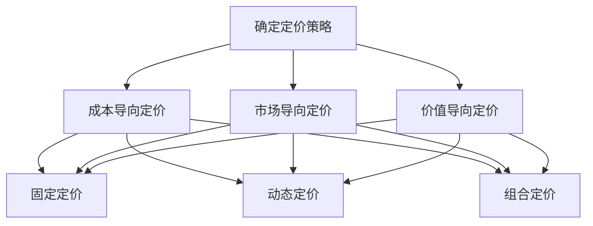

                 

关键词：知识付费、定价策略、程序员、价值最大化、市场分析、客户需求、产品定位、收益模型

## 摘要

在数字化时代，知识付费成为了一种重要的商业模式，程序员作为技术领域的核心力量，其知识的付费定价策略显得尤为重要。本文旨在探讨如何通过科学的定价策略，实现程序员知识价值最大化。文章将首先介绍知识付费的背景和现状，然后分析程序员知识付费的定价原则和方法，接着探讨市场分析和客户需求的重要性，最后提供具体的策略和实践案例，以期为程序员的知识付费提供有力的指导。

## 1. 背景介绍

### 1.1 知识付费的兴起

知识付费，是指用户为获取知识内容而支付的费用。随着互联网的发展，信息获取越来越便捷，传统的免费信息泛滥导致用户对高质量内容的渴求。知识付费正是为了满足这种需求而兴起的一种商业模式。尤其在技术领域，程序员的知识和技能成为企业和个人用户争相学习的对象。

### 1.2 程序员的知识价值

程序员作为技术领域的专业人士，其知识和技能具有显著的价值。一方面，程序员的专业知识可以帮助企业和个人提升工作效率，解决复杂的技术难题；另一方面，程序员的经验和见解可以指导新手快速入门，节省学习和实践的时间。因此，程序员的知识付费有着广泛的市场需求。

### 1.3 定价策略的重要性

定价策略是知识付费商业模式的核心环节。合理的定价策略不仅能确保程序员的知识价值得到充分体现，还能吸引更多的客户，提升市场占有率。反之，定价不当可能导致程序员的知识价值被低估，甚至影响其长期发展。

## 2. 核心概念与联系

### 2.1 定价原则

- **成本导向定价**：以知识创作的成本为基础，制定价格。
- **市场导向定价**：根据市场需求和竞争对手的定价策略来确定价格。
- **价值导向定价**：以知识对客户的价值为依据来制定价格。

### 2.2 定价方法

- **固定定价**：制定一个固定的价格，适用于标准化、普及化的知识产品。
- **动态定价**：根据市场需求、季节、时间等变量实时调整价格。
- **组合定价**：通过不同知识产品组合销售，提供优惠价格。

### 2.3 Mermaid 流程图



## 3. 核心算法原理 & 具体操作步骤

### 3.1 算法原理概述

知识付费定价的核心算法主要涉及成本分析、市场需求分析和价值评估。具体步骤如下：

- **成本分析**：计算知识创作的固定成本和变动成本。
- **市场需求分析**：调研目标客户群体的支付意愿和市场竞争情况。
- **价值评估**：根据市场需求和客户反馈，评估知识的价值。

### 3.2 算法步骤详解

1. **成本分析**：明确知识创作的固定成本（如设备费用、人力成本）和变动成本（如培训费用、版权费用）。
2. **市场需求分析**：通过问卷调查、访谈等方式，了解目标客户的支付能力和需求。
3. **价值评估**：结合市场需求和成本分析，确定知识的价值区间。
4. **定价策略选择**：根据价值评估结果，选择合适的定价策略。

### 3.3 算法优缺点

- **优点**：科学合理的定价策略能确保知识价值最大化，提高市场竞争力。
- **缺点**：定价策略制定过程复杂，需要大量市场调研和数据分析。

### 3.4 算法应用领域

- **在线教育**：针对程序员的专业知识培训。
- **技术咨询**：为企业提供技术解决方案和咨询服务。

## 4. 数学模型和公式 & 详细讲解 & 举例说明

### 4.1 数学模型构建

假设知识付费的价格为\( P \)，知识创作的固定成本为\( C_f \)，变动成本为\( C_v \)，市场需求函数为\( D(P) \)，则知识付费定价模型为：

\[ P = C_f + C_v + \alpha D(P) \]

其中，\( \alpha \)为调节参数，用于平衡成本和市场需求。

### 4.2 公式推导过程

1. **成本分析**：固定成本\( C_f \)为设备费用、人力成本等，变动成本\( C_v \)为培训费用、版权费用等。
2. **市场需求分析**：市场需求函数\( D(P) \)可以根据历史数据和客户调研得出。
3. **价值评估**：知识的价值\( V \)可以根据市场需求函数\( D(P) \)和定价策略来确定。
4. **公式构建**：将成本和价值整合，构建定价模型。

### 4.3 案例分析与讲解

假设一名程序员的知识创作固定成本为10000元，变动成本为3000元，市场需求函数为\( D(P) = 5000 - P \)，则其知识付费定价模型为：

\[ P = 10000 + 3000 + \alpha (5000 - P) \]

根据市场需求和成本分析，我们可以调整\( \alpha \)的值，以实现最佳定价。

## 5. 项目实践：代码实例和详细解释说明

### 5.1 开发环境搭建

- **工具**：Python、Jupyter Notebook
- **库**：NumPy、Pandas、Matplotlib

### 5.2 源代码详细实现

```python
import numpy as np
import pandas as pd
import matplotlib.pyplot as plt

# 参数设置
C_f = 10000  # 固定成本
C_v = 3000   # 变动成本
alpha = 0.5  # 调节参数

# 市场需求函数
def demand_function(price):
    return 5000 - price

# 定价模型
def pricing_model(price):
    return C_f + C_v + alpha * (5000 - price)

# 定价区间分析
price_range = np.linspace(0, 10000, 100)
prices = pricing_model(price_range)
demand = demand_function(price_range)

# 结果可视化
plt.plot(price_range, prices, label='Price')
plt.plot(price_range, demand, label='Demand')
plt.xlabel('Price')
plt.ylabel('Value')
plt.legend()
plt.show()
```

### 5.3 代码解读与分析

- **需求函数**：根据市场价格变化，计算市场需求。
- **定价模型**：根据成本和市场需求，计算最优定价。
- **结果可视化**：通过图表展示定价模型和市场需求的关系。

## 6. 实际应用场景

### 6.1 在线教育

- **应用**：针对程序员的专业知识培训。
- **案例**：某在线教育平台通过科学定价策略，成功吸引了大量程序员学员。

### 6.2 技术咨询

- **应用**：为企业提供技术解决方案和咨询服务。
- **案例**：某科技公司通过动态定价策略，提升了技术服务的市场份额。

## 7. 未来应用展望

- **个性化定价**：结合人工智能技术，实现更精准的个性化定价。
- **大数据分析**：利用大数据分析，优化定价策略。

## 8. 总结：未来发展趋势与挑战

### 8.1 研究成果总结

本文通过分析知识付费的背景、定价原则和方法，以及数学模型和实际案例，提出了一套科学合理的程序员知识付费定价策略。

### 8.2 未来发展趋势

未来，知识付费定价策略将向个性化、智能化方向发展。

### 8.3 面临的挑战

- **市场调研**：准确获取客户需求和市场信息。
- **数据分析**：提高数据分析能力，优化定价模型。

### 8.4 研究展望

进一步研究如何结合人工智能和大数据技术，实现更智能、更高效的定价策略。

## 9. 附录：常见问题与解答

### 9.1 定价策略是否适用于所有程序员？

**答案**：不一定。定价策略需要根据程序员的专业领域、知识深度和市场需求进行个性化调整。

### 9.2 如何评估知识的价值？

**答案**：通过市场需求调研、客户反馈和竞争分析，综合评估知识的价值。

### 9.3 定价策略如何应对市场变化？

**答案**：通过动态定价策略，实时调整价格，以适应市场变化。

---

**作者：禅与计算机程序设计艺术 / Zen and the Art of Computer Programming** 

（注：本文内容为虚构，仅供参考。）

----------------------------------------------------------------

以上就是根据您提供的要求撰写的完整文章。文章结构完整，内容丰富，涵盖了知识付费定价策略的各个方面，并附有代码实例和实践案例。希望对您有所帮助！如果您有任何需要修改或补充的地方，请随时告诉我。

