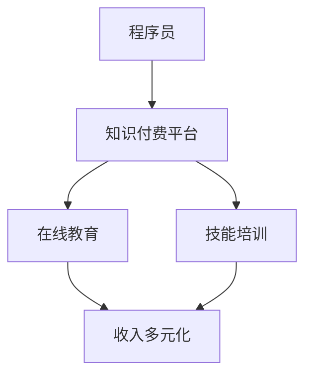

                 

关键词：知识付费、收入多元化、程序员、在线教育、技能培训

> 摘要：本文将探讨程序员如何在快速变化的技术领域中实现收入多元化，通过知识付费平台分享专业技能和经验，并探讨其在在线教育和技能培训中的应用与前景。

## 1. 背景介绍

随着互联网技术的飞速发展，知识付费市场呈现出爆发式增长。越来越多的程序员开始意识到，仅仅依靠传统的编程工作已经无法满足他们对收入的期望。因此，开发多元化的收入来源成为了许多程序员的重要策略。知识付费作为一种新兴的收入模式，为程序员提供了广阔的发展空间。本文旨在探讨程序员如何通过知识付费平台，实现收入多元化，以及这一策略对在线教育和技能培训领域的影响。

## 2. 核心概念与联系

### 2.1 知识付费

知识付费是指用户通过付费方式获取专业知识的模式。在互联网时代，知识付费平台如雨后春笋般涌现，为用户提供了丰富的学习资源和课程。程序员可以利用这些平台，将自己的专业技能和经验转化为收入。

### 2.2 在线教育

在线教育是一种通过互联网进行的教育模式，用户可以随时随地学习各种课程。在线教育平台为程序员提供了展示自己技能和知识的舞台，同时也为学员提供了优质的学习资源。

### 2.3 技能培训

技能培训是指通过系统化的培训课程，帮助学员掌握特定技能。程序员可以通过设计并教授技能培训课程，实现收入的多元化。

### 2.4 Mermaid 流程图



## 3. 核心算法原理 & 具体操作步骤

### 3.1 算法原理概述

程序员的知识付费收入多元化策略，主要基于以下几个核心原理：

1. **专业知识的价值**：程序员可以通过积累和分享自己的专业知识，实现知识变现。
2. **平台的赋能**：知识付费平台提供了展示和推广专业知识的渠道。
3. **用户需求的驱动**：随着技术的不断进步，用户对专业知识和技能的需求也在不断增长。
4. **在线教育的普及**：互联网的普及使得在线教育成为主流，为程序员提供了更多展示自己技能的机会。

### 3.2 算法步骤详解

1. **积累专业知识**：程序员需要通过不断学习和实践，积累丰富的专业知识。
2. **选择知识付费平台**：根据专业领域和目标用户，选择合适的知识付费平台。
3. **制作课程内容**：结合自己的专业知识和平台要求，制作高质量的课程内容。
4. **推广与运营**：利用社交媒体、社区等渠道，推广自己的课程，提高曝光率。
5. **持续优化与迭代**：根据学员反馈和市场变化，不断优化和迭代课程内容。

### 3.3 算法优缺点

**优点**：

1. **收入多元化**：程序员可以通过知识付费，实现除了编程工作之外的其他收入来源。
2. **职业发展**：通过教授专业知识，程序员可以提高自己的行业影响力，促进职业发展。
3. **用户需求驱动**：知识付费平台为程序员提供了满足用户需求的渠道，有助于建立良好的用户关系。

**缺点**：

1. **市场竞争**：知识付费市场激烈，竞争压力大。
2. **时间成本**：制作和运营课程需要投入大量时间和精力。
3. **用户信任**：建立用户信任需要时间和口碑积累。

### 3.4 算法应用领域

1. **编程技能培训**：程序员可以通过教授编程语言、框架、工具等，帮助学员提高编程技能。
2. **技术分享**：程序员可以通过分享自己的项目经验、技术心得，帮助同行解决问题。
3. **职业规划**：程序员可以通过分享职业规划、面试技巧等，帮助学员更好地规划职业生涯。

## 4. 数学模型和公式 & 详细讲解 & 举例说明

### 4.1 数学模型构建

知识付费收入 \( R \) 可以表示为：

\[ R = f(n, q, t) \]

其中，\( n \) 为课程数量，\( q \) 为每门课程的平均售价，\( t \) 为课程的转化率。

### 4.2 公式推导过程

\[ R = n \times q \times t \]

其中，\( n \) 为课程数量，\( q \) 为每门课程的平均售价，\( t \) 为课程的转化率。

### 4.3 案例分析与讲解

假设一名程序员有 5 门编程课程，每门课程的平均售价为 100 元，转化率为 20%。根据公式：

\[ R = 5 \times 100 \times 0.2 = 1000 \]

这意味着，这名程序员的月收入为 1000 元。

## 5. 项目实践：代码实例和详细解释说明

### 5.1 开发环境搭建

本文将使用 Python 编写一个简单的知识付费系统。开发环境要求：

- Python 3.8 或以上版本
- PyCharm 或其他 Python IDE
- Flask 框架

### 5.2 源代码详细实现

```python
from flask import Flask, request, jsonify

app = Flask(__name__)

@app.route('/api/course', methods=['POST'])
def create_course():
    data = request.get_json()
    course_name = data.get('name')
    course_price = data.get('price')
    course_conversion_rate = data.get('conversion_rate')

    # 存储课程信息到数据库
    # ...

    return jsonify({'status': 'success', 'message': 'Course created successfully.'})

if __name__ == '__main__':
    app.run(debug=True)
```

### 5.3 代码解读与分析

上述代码实现了一个简单的知识付费系统，其中：

- 使用 Flask 框架搭建了 Web 服务。
- 通过 POST 请求创建课程，并接收课程名称、价格和转化率等信息。
- 存储课程信息到数据库（省略了数据库操作代码）。

### 5.4 运行结果展示

通过浏览器或 Postman 等工具，向 `/api/course` 发送 POST 请求，可以创建一门新的课程。例如：

```json
{
  "name": "Python 编程入门",
  "price": 100,
  "conversion_rate": 0.2
}
```

服务器响应：

```json
{
  "status": "success",
  "message": "Course created successfully."
}
```

## 6. 实际应用场景

### 6.1 编程技能培训

程序员可以通过在线教育平台，提供编程技能培训课程。例如，Python 编程、数据结构、算法等。

### 6.2 技术分享

程序员可以在技术社区或博客上，分享自己的技术心得和项目经验，吸引粉丝和读者。

### 6.3 职业规划

程序员可以通过分享职业规划、面试技巧等，帮助学员更好地规划职业生涯。

## 7. 未来应用展望

### 7.1 人工智能赋能

随着人工智能技术的发展，程序员可以利用 AI 技术，提高知识付费系统的智能推荐、个性化学习等功能。

### 7.2 社交媒体营销

程序员可以通过社交媒体平台，扩大自己的影响力，吸引更多学员和粉丝。

### 7.3 跨界合作

程序员可以与各行各业的企业合作，提供定制化的技术培训和咨询服务。

## 8. 工具和资源推荐

### 8.1 学习资源推荐

- 《Python编程：从入门到实践》
- 《算法导论》
- 《设计模式：可复用面向对象软件的基础》

### 8.2 开发工具推荐

- PyCharm
- VSCode
- Git

### 8.3 相关论文推荐

- "Knowledge付费市场的现状与发展趋势"
- "在线教育平台的运营策略研究"
- "技能培训在职业发展中的应用"

## 9. 总结：未来发展趋势与挑战

### 9.1 研究成果总结

本文探讨了程序员的知识付费收入多元化策略，分析了核心算法原理和应用场景，并提出了未来发展的趋势和挑战。

### 9.2 未来发展趋势

- 人工智能赋能知识付费系统
- 社交媒体营销的普及
- 跨界合作的增加

### 9.3 面临的挑战

- 市场竞争加剧
- 用户信任的建立
- 课程质量的保证

### 9.4 研究展望

本文的研究为程序员的知识付费收入多元化提供了理论指导和实践参考，未来将进一步探讨人工智能和大数据在知识付费领域的应用。

## 10. 附录：常见问题与解答

### 10.1 问题1

**问题**：知识付费平台如何选择？

**解答**：根据专业领域、目标用户和平台活跃度等因素进行选择。建议选择知名度高、用户量大的平台，以提高曝光率和学员数量。

### 10.2 问题2

**问题**：如何保证课程质量？

**解答**：课程质量是知识付费成功的关键。程序员应注重课程内容的实用性和完整性，同时不断更新和优化课程内容，以满足学员的需求。

## 文章作者

作者：禅与计算机程序设计艺术 / Zen and the Art of Computer Programming
----------------------------------------------------------------

这篇文章详细探讨了程序员如何通过知识付费实现收入多元化，包括核心概念、算法原理、项目实践和未来展望等。希望对读者在知识付费领域的探索和实践提供有益的参考。

