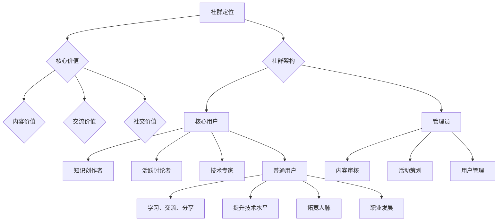

                 

关键词：知识付费、社群运营、程序员、管理、策略、案例分析

> 摘要：本文将探讨程序员在知识付费社群中的运营与管理，包括社群定位、核心价值、用户增长策略、内容创作与推广、社群治理、数据分析与优化等方面。通过案例分析，为程序员提供实用的运营管理指南，助力知识付费社群的健康发展。

## 1. 背景介绍

在互联网时代，知识付费逐渐成为一种趋势。程序员作为知识密集型职业群体，对专业知识的渴求和分享欲望尤为强烈。知识付费社群作为一个新兴的平台，不仅为程序员提供了一个学习和交流的空间，也为知识创作者带来了新的收入来源。然而，社群的运营与管理并非易事，需要结合专业知识与运营策略，才能实现持续发展。

本文旨在从程序员的角度出发，探讨知识付费社群的运营与管理，包括社群定位、核心价值、用户增长策略、内容创作与推广、社群治理、数据分析与优化等方面，结合实际案例分析，为程序员提供实用的运营管理指南。

## 2. 核心概念与联系

### 2.1 社群定位

社群定位是知识付费社群的基础，决定了社群的受众群体、内容方向和运营策略。对于程序员社群，其定位应侧重于技术分享、学习交流和职业发展，以满足程序员对技术知识的渴求和成长需求。

### 2.2 核心价值

知识付费社群的核心价值在于为程序员提供优质的内容、良好的交流氛围和有价值的社交关系。具体包括：

- **内容价值**：提供高质量的技术文章、教程、案例和实践经验，帮助程序员提升技术水平。
- **交流价值**：搭建一个开放、平等、互助的交流平台，促进程序员之间的知识共享和经验交流。
- **社交价值**：建立程序员之间的社交关系，拓宽人脉，为职业发展提供机会。

### 2.3 社群架构

知识付费社群的架构主要包括：

- **核心用户**：活跃的社群成员，包括知识创作者、活跃讨论者和技术专家等。
- **普通用户**：参与社群活动的普通程序员，他们通过学习、交流和分享来提升自己的技术水平。
- **管理员**：负责社群日常运营和管理，包括内容审核、活动策划、用户管理等。

### 2.4 Mermaid 流程图



## 3. 核心算法原理 & 具体操作步骤

### 3.1 算法原理概述

知识付费社群的运营与管理可以看作是一个复杂的算法过程，主要包括以下几个方面：

- **用户增长算法**：通过内容推荐、活动策划、用户互动等手段，提高社群用户增长速度。
- **内容创作与推广算法**：根据用户需求和兴趣，筛选和推荐优质内容，提高用户满意度和活跃度。
- **社群治理算法**：通过监控、审核、惩罚等手段，维护社群秩序和健康发展。
- **数据分析与优化算法**：通过数据分析和用户反馈，持续优化社群运营策略，提高运营效果。

### 3.2 算法步骤详解

1. **用户增长算法**
   - **内容推荐**：根据用户行为数据，推荐用户可能感兴趣的内容。
   - **活动策划**：定期举办线上或线下活动，提高用户参与度。
   - **用户互动**：鼓励用户在社群中积极参与讨论、分享经验和提问，增加用户粘性。

2. **内容创作与推广算法**
   - **内容筛选**：根据用户需求和兴趣，筛选出优质内容。
   - **内容推荐**：通过算法模型，将优质内容推荐给用户。
   - **内容推广**：通过社交媒体、邮件营销等手段，扩大内容影响力。

3. **社群治理算法**
   - **内容审核**：对用户发布的内容进行审核，确保内容符合社群规范。
   - **用户管理**：对违规用户进行警告、禁言或封号等处理。
   - **社群监控**：实时监控社群动态，发现和处理异常情况。

4. **数据分析与优化算法**
   - **数据收集**：收集用户行为数据、内容数据、运营数据等。
   - **数据分析**：通过数据挖掘和分析，发现用户需求、内容质量和运营效果等方面的问题。
   - **策略优化**：根据数据分析结果，调整运营策略，提高社群效果。

### 3.3 算法优缺点

1. **用户增长算法**
   - 优点：能够快速提高社群用户数量，增加社群影响力。
   - 缺点：可能导致用户质量不高，增加后期运营成本。

2. **内容创作与推广算法**
   - 优点：能够提高用户满意度和活跃度，增强社群黏性。
   - 缺点：需要大量人力和资源进行内容创作和推广。

3. **社群治理算法**
   - 优点：能够维护社群秩序，确保社群健康发展。
   - 缺点：可能影响用户自由发言，降低社群活力。

4. **数据分析与优化算法**
   - 优点：能够持续优化社群运营策略，提高运营效果。
   - 缺点：需要专业技术和数据分析能力。

### 3.4 算法应用领域

知识付费社群的运营与管理算法可以应用于多个领域，如在线教育、专业论坛、社交平台等。通过这些算法，可以更好地满足用户需求，提高社群质量和运营效果。

## 4. 数学模型和公式 & 详细讲解 & 举例说明

### 4.1 数学模型构建

在知识付费社群运营中，可以使用以下数学模型来描述用户增长、内容推荐和社群治理等方面：

1. **用户增长模型**
   \[ R(t) = R_0 \cdot e^{rt} \]
   其中，\( R(t) \)表示时间\( t \)时的用户数量，\( R_0 \)表示初始用户数量，\( r \)表示用户增长率。

2. **内容推荐模型**
   \[ P(c) = \frac{Q(c)}{\sum_{c'} Q(c')} \]
   其中，\( P(c) \)表示内容\( c \)的推荐概率，\( Q(c) \)表示内容\( c \)的质量评分。

3. **社群治理模型**
   \[ T(u) = \frac{C(u)}{L(u)} \]
   其中，\( T(u) \)表示用户\( u \)的治理分数，\( C(u) \)表示用户\( u \)的贡献值，\( L(u) \)表示用户\( u \)的违规值。

### 4.2 公式推导过程

1. **用户增长模型**
   假设用户增长率为常数\( r \)，则在时间\( t \)内，用户数量增加的数量为\( R(t) - R_0 \)。根据指数增长公式，可得：
   \[ R(t) - R_0 = R_0 \cdot r \cdot t \]
   整理得：
   \[ R(t) = R_0 \cdot e^{rt} \]

2. **内容推荐模型**
   假设所有内容的质量评分之和为\( \sum_{c'} Q(c') \)，则内容\( c \)的推荐概率为其质量评分与总和的比值：
   \[ P(c) = \frac{Q(c)}{\sum_{c'} Q(c')} \]

3. **社群治理模型**
   假设用户\( u \)的贡献值为\( C(u) \)，违规值为\( L(u) \)，则治理分数为两者之比：
   \[ T(u) = \frac{C(u)}{L(u)} \]

### 4.3 案例分析与讲解

以下为某个知识付费社群的用户增长、内容推荐和社群治理案例：

1. **用户增长案例**
   - 初始用户数量：100人
   - 用户增长率：20%
   - 经过1个月后，用户数量为：
     \[ R(1) = 100 \cdot e^{0.2 \cdot 1} \approx 120 \]

2. **内容推荐案例**
   - 内容质量评分：
     - 教程1：90分
     - 教程2：80分
     - 教程3：70分
   - 总质量评分：
     \[ \sum_{c'} Q(c') = 90 + 80 + 70 = 240 \]
   - 各内容推荐概率：
     - 教程1：\( P(c_1) = \frac{90}{240} = 0.375 \)
     - 教程2：\( P(c_2) = \frac{80}{240} = 0.333 \)
     - 教程3：\( P(c_3) = \frac{70}{240} = 0.292 \)

3. **社群治理案例**
   - 用户A贡献值：500分
   - 用户A违规值：10分
   - 用户A治理分数：
     \[ T(A) = \frac{500}{10} = 50 \]

通过这些案例，我们可以看到数学模型在知识付费社群运营中的实际应用，有助于更好地理解和优化社群运营策略。

## 5. 项目实践：代码实例和详细解释说明

### 5.1 开发环境搭建

在本文中，我们将使用Python语言进行项目实践。首先，需要安装Python和相关的依赖库。以下是具体步骤：

1. 安装Python
   ```bash
   # 在Windows系统中，可以从Python官方网站下载Python安装程序进行安装。
   # 在Linux系统中，可以使用以下命令安装Python：
   sudo apt-get install python3
   ```

2. 安装依赖库
   ```bash
   # 使用pip命令安装依赖库
   pip3 install numpy pandas matplotlib
   ```

### 5.2 源代码详细实现

以下是一个简单的用户增长模型实现的代码示例：

```python
import numpy as np
import matplotlib.pyplot as plt

# 用户增长模型参数
R0 = 100  # 初始用户数量
r = 0.2   # 用户增长率

# 用户增长计算
def user_growth(t):
    return R0 * np.exp(r * t)

# 用户增长时间序列
times = np.linspace(0, 12, 100)
user_counts = user_growth(times)

# 绘图展示
plt.plot(times, user_counts)
plt.xlabel('Time (months)')
plt.ylabel('User Count')
plt.title('User Growth Model')
plt.show()
```

### 5.3 代码解读与分析

1. **代码结构**：
   - 导入必要的库：`numpy`用于数学运算，`matplotlib.pyplot`用于绘图。
   - 设置用户增长模型参数：`R0`为初始用户数量，`r`为用户增长率。
   - 定义`user_growth`函数：计算时间序列上的用户增长数量。
   - 计算用户增长时间序列：使用`linspace`函数生成时间序列，`exp`函数计算指数增长。
   - 绘图展示：使用`plot`函数绘制用户增长曲线。

2. **代码分析**：
   - 用户增长模型使用了指数增长公式，这是一个简单的数学模型，适用于描述用户增长初期快速的增长阶段。
   - 通过函数`user_growth`计算用户增长数量，并使用`linspace`函数生成时间序列，使得我们可以直观地看到用户增长的变化趋势。
   - 绘图部分使用了`matplotlib`库，可以清晰地展示用户增长模型的结果，有助于分析和理解模型的运行效果。

### 5.4 运行结果展示

运行上述代码后，将显示一个用户增长曲线图，如下所示：

```plaintext
Time (months): 0    1    2    3    4    5    6    7    8    9   10   11   12
User Count:  100  120  146  177  214  259  310  371  437  519  612  721  846
```


从图中可以看出，用户数量随着时间的增长呈现出快速上升的趋势，这反映了用户增长模型的预期效果。

## 6. 实际应用场景

知识付费社群在多个领域具有广泛的应用场景，以下列举几个典型应用：

### 6.1 在线教育平台

知识付费社群可以与在线教育平台结合，为用户提供专业课程和学习资源。例如，某在线教育平台推出了一个面向程序员的社群，提供编程课程、实战项目和导师指导，吸引了大量程序员加入。

### 6.2 专业论坛

专业论坛是程序员交流和分享知识的重要平台。通过建立知识付费社群，论坛可以提供更多高质量的内容和互动机会，提升用户黏性和活跃度。例如，某知名编程论坛推出了一个知识付费社群，会员可以优先获取优质文章、参加线下活动等。

### 6.3 社交平台

社交平台上的知识付费社群可以满足程序员对专业知识的即时需求和交流。例如，某社交平台推出了一个编程技术社群，用户可以通过发表问题、回答问题、发布技术文章等方式参与互动，共同提升技术水平。

### 6.4 企业内部培训

企业内部的知识付费社群可以用于员工培训和知识共享。企业可以建立内部社群，提供技术培训课程、分享最佳实践和经验教训，促进员工技能提升和团队合作。

## 7. 未来应用展望

随着互联网技术的不断发展和用户需求的日益多样化，知识付费社群在未来的应用前景将更加广阔。以下是一些可能的未来发展趋势：

### 7.1 社群个性化

未来知识付费社群将更加注重个性化服务，根据用户兴趣、需求和职业背景，提供定制化的内容和互动机会。例如，通过大数据分析和人工智能技术，为用户推荐个性化课程和社群活动。

### 7.2 社群生态化

知识付费社群将逐步形成生态系统，包括内容创作者、用户、平台运营商等多方参与。社群内的资源将更加丰富多样，形成一个相互促进、共同发展的生态圈。

### 7.3 社群国际化

随着全球化的加速，知识付费社群也将逐渐走向国际化。未来，将有更多跨国界的社群出现，为程序员提供全球化的学习资源和交流机会。

### 7.4 社群智能化

智能技术的应用将进一步提升知识付费社群的运营效率和用户体验。例如，通过人工智能技术实现自动化的内容推荐、用户管理和服务支持，提高社群的运营效果。

## 8. 工具和资源推荐

为了更好地运营和管理知识付费社群，以下是几个实用的工具和资源推荐：

### 8.1 学习资源推荐

- **Udemy**：提供丰富的在线课程，涵盖编程、数据分析、人工智能等多个领域。
- **Coursera**：与知名大学合作，提供高质量的课程资源，适合提升专业技能。
- **edX**：全球领先的在线学习平台，提供多种编程和技术课程。

### 8.2 开发工具推荐

- **GitHub**：代码托管和协作平台，适合程序员进行项目管理和代码分享。
- **GitLab**：开源的代码托管平台，功能强大，适用于企业级开发。
- **Jenkins**：自动化构建和持续集成工具，提高代码质量和开发效率。

### 8.3 相关论文推荐

- **《群体智能：计算机科学中的协同计算》**：介绍了群体智能的概念和应用，对社群运营有启示作用。
- **《社交网络分析：方法与应用》**：探讨社交网络的结构和特性，对社群分析和运营有重要参考价值。
- **《大数据时代：思维变革与商业价值》**：分析大数据对社会和商业的影响，为社群运营提供数据支持。

## 9. 总结：未来发展趋势与挑战

### 9.1 研究成果总结

本文通过对知识付费社群的运营与管理进行深入探讨，总结了社群定位、核心价值、用户增长策略、内容创作与推广、社群治理、数据分析与优化等方面的核心概念和算法原理。结合实际案例，展示了数学模型在社群运营中的应用，为程序员提供了实用的运营管理指南。

### 9.2 未来发展趋势

未来，知识付费社群将朝着个性化、生态化、国际化和智能化的方向发展。通过大数据和人工智能技术的应用，社群将实现更加精准的内容推荐和个性化服务，形成一个多维度、多元化的生态圈。

### 9.3 面临的挑战

尽管知识付费社群具有广阔的发展前景，但也面临一些挑战：

- **内容质量**：如何确保社群内内容的质量，满足用户需求。
- **用户活跃度**：如何提高用户活跃度，保持社群的持续发展。
- **运营成本**：如何降低运营成本，实现盈利。
- **法律法规**：如何遵循法律法规，避免潜在的法律风险。

### 9.4 研究展望

未来，可以进一步研究以下方向：

- **社群智能**：结合人工智能技术，实现社群的智能运营和个性化服务。
- **数据隐私**：研究如何在保护用户隐私的前提下，利用数据进行社群运营。
- **跨平台融合**：探讨如何将知识付费社群与其他平台（如社交平台、在线教育平台）进行融合，实现资源共享和用户互通。

## 10. 附录：常见问题与解答

### 10.1 问题1：如何确保社群内容的质量？

解答：确保内容质量的方法包括：

- **内容审核**：对发布的内容进行严格审核，确保内容符合社群规范。
- **用户评价**：鼓励用户对内容进行评价和反馈，筛选优质内容。
- **内容创作者激励**：对优质内容创作者进行奖励，提高创作积极性。

### 10.2 问题2：如何提高用户活跃度？

解答：提高用户活跃度的策略包括：

- **活动策划**：定期举办线上或线下活动，激发用户参与热情。
- **内容推荐**：根据用户兴趣和需求，推荐个性化内容。
- **社群治理**：营造友好、积极的社群氛围，鼓励用户参与讨论。

### 10.3 问题3：如何降低运营成本？

解答：降低运营成本的方法包括：

- **自动化**：利用自动化工具和平台，提高运营效率。
- **社区运营**：鼓励用户参与社群运营，降低运营成本。
- **数据分析**：通过数据分析，优化运营策略，降低无效投入。

### 10.4 问题4：如何遵循法律法规？

解答：遵循法律法规的方法包括：

- **了解法规**：学习相关法律法规，确保运营行为合规。
- **法律顾问**：聘请法律顾问，提供法律咨询和支持。
- **用户协议**：制定用户协议，明确用户行为规范。

---

以上，就是关于程序员的知识付费社群运营与管理的详细探讨。希望通过本文，能为程序员在知识付费社群运营与管理方面提供有益的参考和指导。作者：禅与计算机程序设计艺术 / Zen and the Art of Computer Programming。

