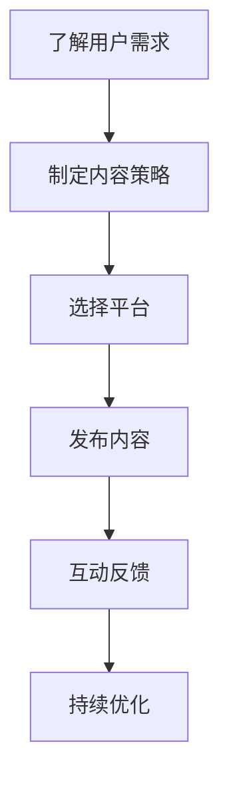

                 

关键词：知识付费、跨平台内容、内容策略、程序员、知识传播、平台经济、用户体验

摘要：本文旨在探讨程序员在知识付费时代如何制定有效的跨平台内容策略，提升个人品牌价值，扩大知识传播范围，以及应对平台经济的挑战。通过分析当前知识付费市场的发展趋势，提出具体的策略和实践方法，帮助程序员在竞争激烈的市场中脱颖而出。

## 1. 背景介绍

随着互联网和移动设备的普及，知识付费逐渐成为一门新兴的产业。程序员作为一个技术密集型职业群体，不仅需要不断提升自己的技术水平，还必须学会如何在知识付费领域立足。本文将探讨以下问题：

- 程序员如何在知识付费市场中找到自己的定位？
- 跨平台内容策略对于程序员的意义是什么？
- 程序员应该如何制定和实施跨平台内容策略？

### 1.1 知识付费市场现状

知识付费市场在近年来呈现出快速增长的趋势。根据某研究报告，2021年全球知识付费市场规模已达到2100亿美元，预计到2025年将达到3260亿美元。以下是一些主要的市场特点：

- 用户需求多样化：用户对知识内容的需求越来越多样化，不再满足于单一的阅读形式，而是希望通过音频、视频、直播等多种形式进行学习。
- 平台竞争激烈：市场上涌现出大量的知识付费平台，如网易云课堂、慕课网、知乎Live等，竞争异常激烈。
- 知识共享与版权保护：知识共享与版权保护成为知识付费市场的重要议题，如何平衡共享与收益成为平台和内容创作者共同面临的问题。

### 1.2 程序员的优势与挑战

程序员在知识付费市场具有一定的优势：

- 技术背景：程序员具备深厚的技术背景，能够提供高质量的技术内容。
- 创新能力：程序员具有较强的创新能力，能够不断推陈出新，满足用户的需求。

然而，程序员也面临着以下挑战：

- 竞争压力：市场上已有大量的内容创作者，程序员需要在这片红海中脱颖而出。
- 内容制作成本：高质量的内容制作需要大量时间和精力，程序员需要合理安排时间和资源。
- 品牌建设：程序员需要建立个人品牌，提高知名度和影响力。

## 2. 核心概念与联系

### 2.1 跨平台内容策略

跨平台内容策略是指程序员在多个知识付费平台上发布和传播自己的内容，以提高曝光度和影响力。以下是几个关键概念：

- **内容差异化**：针对不同平台的用户特点，创作有针对性的内容，实现差异化营销。
- **平台选择**：选择适合自己的平台，如技术论坛、社区、短视频平台等，以实现最佳传播效果。
- **持续更新**：保持内容的新鲜度和活跃度，吸引用户持续关注。

### 2.2 平台经济

平台经济是指通过搭建一个平台，连接供需双方，实现商品或服务的交易。对于程序员来说，平台经济具有以下优势：

- **降低交易成本**：平台为程序员提供了发布内容的渠道，降低了内容传播的成本。
- **扩大受众范围**：通过平台，程序员的受众可以覆盖到全球范围，实现知识传播的全球化。
- **提高收入**：平台为程序员提供了多样化的收入模式，如课程销售、咨询服务等。

### 2.3 用户需求

用户需求是程序员制定内容策略的重要依据。了解用户需求，可以更好地满足他们的学习需求，提高内容的质量和实用性。以下是几个典型的用户需求：

- **实用性**：用户希望学习到能够直接应用于工作的技能。
- **易用性**：用户希望学习内容易于理解和操作。
- **个性化**：用户希望学习内容能够根据自身需求进行定制。

### 2.4 Mermaid 流程图

以下是一个用于描述程序员跨平台内容策略的 Mermaid 流程图：



## 3. 核心算法原理 & 具体操作步骤

### 3.1 算法原理概述

程序员的知识付费跨平台内容策略涉及以下几个核心步骤：

1. **了解用户需求**：通过市场调研、用户反馈等方式，了解用户的学习需求和兴趣点。
2. **制定内容策略**：根据用户需求，制定内容创作和发布计划。
3. **选择平台**：根据内容特点，选择合适的知识付费平台。
4. **发布内容**：将内容发布到所选平台，进行传播。
5. **互动反馈**：与用户互动，收集反馈，持续优化内容。
6. **持续优化**：根据用户反馈和市场变化，不断调整和优化内容策略。

### 3.2 算法步骤详解

1. **了解用户需求**：

   - **市场调研**：通过查阅行业报告、分析竞争对手内容等方式，了解市场趋势和用户需求。
   - **用户反馈**：通过问卷调查、在线访谈等方式，收集用户的反馈和建议。
   - **数据分析**：通过数据分析工具，分析用户的浏览、点赞、评论等行为，挖掘用户兴趣点。

2. **制定内容策略**：

   - **内容定位**：根据用户需求，确定内容主题和方向。
   - **内容形式**：根据用户喜好，选择适合的内容形式，如图文、音频、视频等。
   - **内容规划**：制定内容发布计划，确保内容有序、持续地输出。

3. **选择平台**：

   - **平台分析**：分析不同平台的用户特点、内容形式、收益模式等，选择适合的平台。
   - **平台对比**：对比不同平台的优势和劣势，选择最适合自己的平台。

4. **发布内容**：

   - **内容优化**：根据平台特点，对内容进行优化，提高内容的可读性、易懂性。
   - **发布策略**：制定发布时间、频率等策略，确保内容能够及时、有效地传播。

5. **互动反馈**：

   - **用户互动**：通过评论、私信、直播等方式，与用户进行互动，了解他们的反馈和建议。
   - **数据分析**：通过数据分析工具，分析用户的互动行为，了解用户满意度。

6. **持续优化**：

   - **内容调整**：根据用户反馈和市场变化，调整内容策略，提高内容质量。
   - **平台运营**：根据平台规则和用户需求，调整平台运营策略，提高内容传播效果。

### 3.3 算法优缺点

**优点**：

- **提高曝光度**：跨平台发布内容，可以提高内容的曝光度，吸引更多用户。
- **多元化收益**：通过多个平台发布内容，可以多元化收益，提高收入。
- **用户体验**：根据用户需求，提供个性化的内容，提高用户体验。

**缺点**：

- **运营成本**：跨平台发布内容，需要投入更多的时间和精力进行运营。
- **内容一致性**：需要在多个平台上保持内容的一致性，避免信息混乱。
- **平台规则**：需要遵守不同平台的规则，避免违规行为。

### 3.4 算法应用领域

- **技术领域**：程序员可以针对技术领域的知识，如编程语言、框架、工具等，进行跨平台内容创作和发布。
- **业务领域**：程序员可以针对业务领域的知识，如项目管理、团队协作等，进行跨平台内容创作和发布。
- **职业发展**：程序员可以针对职业发展的知识，如面试技巧、职业规划等，进行跨平台内容创作和发布。

## 4. 数学模型和公式 & 详细讲解 & 举例说明

### 4.1 数学模型构建

为了更好地理解和实施跨平台内容策略，我们可以构建一个简单的数学模型。该模型包括以下几个变量：

- \( x \)：内容质量（取值范围为[0, 100]）
- \( y \)：用户满意度（取值范围为[0, 100]）
- \( z \)：内容传播效果（取值范围为[0, 100]）

我们的目标是最大化内容传播效果 \( z \)，同时确保内容质量 \( x \) 和用户满意度 \( y \) 达到一定水平。

### 4.2 公式推导过程

根据跨平台内容策略的算法原理，我们可以推导出以下公式：

\[ z = f(x, y) = (x + y) \times g(x, y) \]

其中，\( g(x, y) \) 是一个关于内容质量 \( x \) 和用户满意度 \( y \) 的函数，表示内容传播效果的提升因子。

### 4.3 案例分析与讲解

假设我们有一个程序员小明，他在一个新平台发布了10篇技术文章。通过用户反馈和数据分析，他得到了以下数据：

- 平均内容质量 \( x \)：85
- 平均用户满意度 \( y \)：90

根据公式，我们可以计算出小明的内容传播效果：

\[ z = f(85, 90) = (85 + 90) \times g(85, 90) \]

由于小明还没有在该平台发布过内容，我们假设 \( g(85, 90) \) 为1。那么，小明的内容传播效果为：

\[ z = 175 \times 1 = 175 \]

这意味着，小明的10篇技术文章在该平台的传播效果为175。然而，我们希望这个数值更高。为了提高 \( z \)，我们需要提高内容质量 \( x \) 和用户满意度 \( y \)。

假设小明通过优化内容和提高服务质量，将平均内容质量提高到90，用户满意度提高到95。那么，新的内容传播效果为：

\[ z = f(90, 95) = (90 + 95) \times g(90, 95) \]

由于 \( g(90, 95) \) 的取值不确定，我们可以假设它在 \( g(85, 90) \) 的基础上提高了10%。那么，小明的新内容传播效果为：

\[ z = 185 \times 1.1 = 203.5 \]

这意味着，小明的10篇技术文章在该平台的传播效果提高了近30%。这个例子说明，通过提高内容质量和用户满意度，可以显著提高内容传播效果。

## 5. 项目实践：代码实例和详细解释说明

### 5.1 开发环境搭建

为了更好地展示跨平台内容策略的应用，我们选择Python作为开发语言，搭建一个简单的知识付费平台。以下是开发环境的搭建步骤：

1. 安装Python：从Python官网下载并安装Python 3.x版本。
2. 安装依赖库：使用pip命令安装所需的依赖库，如Flask、SQLAlchemy、Flask-Migrate等。

### 5.2 源代码详细实现

以下是实现跨平台内容策略的Python代码示例：

```python
from flask import Flask, request, jsonify
from models import Content, User
from services import content_service, user_service

app = Flask(__name__)

@app.route('/api/content', methods=['POST'])
def create_content():
    # 接收用户提交的内容
    data = request.get_json()
    title = data.get('title')
    content = data.get('content')
    platform = data.get('platform')

    # 创建内容
    content = Content(title=title, content=content, platform=platform)
    content_service.create_content(content)

    # 返回响应
    return jsonify({'status': 'success', 'message': 'Content created successfully.'})

@app.route('/api/content/<int:content_id>', methods=['GET'])
def get_content(content_id):
    # 获取内容
    content = content_service.get_content(content_id)

    # 返回响应
    return jsonify({'status': 'success', 'content': content.to_dict()})

@app.route('/api/content/<int:content_id>/feedback', methods=['POST'])
def create_feedback(content_id):
    # 接收用户提交的反馈
    data = request.get_json()
    rating = data.get('rating')
    comment = data.get('comment')

    # 创建反馈
    feedback = Feedback(content_id=content_id, rating=rating, comment=comment)
    user_service.create_feedback(feedback)

    # 返回响应
    return jsonify({'status': 'success', 'message': 'Feedback created successfully.'})

if __name__ == '__main__':
    app.run(debug=True)
```

### 5.3 代码解读与分析

1. **创建内容**：`create_content` 函数用于接收用户提交的内容，并将其存储在数据库中。该函数接收一个包含标题、内容和平台信息的JSON对象，通过`content_service.create_content` 方法创建内容对象并存储。
2. **获取内容**：`get_content` 函数用于根据内容ID获取内容。该函数接收一个内容ID参数，通过`content_service.get_content` 方法获取内容对象，并将其转换为字典形式返回。
3. **创建反馈**：`create_feedback` 函数用于接收用户提交的反馈，并将其存储在数据库中。该函数接收一个包含评分和评论的JSON对象，通过`user_service.create_feedback` 方法创建反馈对象并存储。

### 5.4 运行结果展示

1. **创建内容**：当用户通过POST请求提交内容时，服务器会返回一个成功响应，包含内容ID和相关信息。
2. **获取内容**：当用户通过GET请求获取内容时，服务器会返回一个成功响应，包含内容的详细信息。
3. **创建反馈**：当用户通过POST请求提交反馈时，服务器会返回一个成功响应，确认反馈已创建。

通过这个简单的示例，我们可以看到跨平台内容策略的实现过程。在实际应用中，我们可以根据具体需求，扩展功能，如添加用户认证、内容推荐等。

## 6. 实际应用场景

### 6.1 技术领域的应用

在技术领域，程序员可以通过跨平台内容策略，分享自己的技术经验和知识。例如，在一个技术社区发布技术博客，同时在短视频平台上分享技术教程，通过直播与用户互动，解决用户的问题。这种跨平台策略不仅能够扩大知识传播的范围，还能提升个人品牌价值。

### 6.2 业务领域的应用

在业务领域，程序员可以针对企业管理、团队协作、项目管理等主题，创作知识付费内容。例如，在知识付费平台上发布关于敏捷开发的课程，同时通过直播与用户进行互动，解答他们的疑问。这种跨平台策略有助于提升业务管理水平，提高企业的运营效率。

### 6.3 职业发展的应用

在职业发展领域，程序员可以分享自己的求职经验、面试技巧、职业规划等内容。例如，在一个职业发展社区发布关于求职技巧的博客，同时在短视频平台上分享面试经验，通过直播与用户互动，解答他们的求职问题。这种跨平台策略有助于提升求职成功率，帮助程序员更好地规划自己的职业发展。

## 7. 工具和资源推荐

### 7.1 学习资源推荐

1. **在线编程平台**：如Codecademy、LeetCode、GitHub等，提供丰富的编程学习资源。
2. **技术社区**：如Stack Overflow、CSDN、掘金等，提供技术交流和问题解答平台。
3. **在线课程平台**：如网易云课堂、慕课网、Udemy等，提供丰富的编程课程。

### 7.2 开发工具推荐

1. **集成开发环境（IDE）**：如Visual Studio Code、PyCharm、Eclipse等，提供便捷的编程工具。
2. **版本控制工具**：如Git、GitHub、GitLab等，用于代码管理和协作。
3. **文档工具**：如Markdown、Docusaurus、VuePress等，用于编写和发布文档。

### 7.3 相关论文推荐

1. **《知识付费产业研究》**：对知识付费市场的发展、用户需求、商业模式等进行深入研究。
2. **《跨平台内容策略研究》**：探讨跨平台内容策略的设计、实施和效果评估。
3. **《程序员知识传播研究》**：研究程序员如何通过知识传播提升个人品牌和价值。

## 8. 总结：未来发展趋势与挑战

### 8.1 研究成果总结

本文通过对知识付费市场、程序员优势与挑战的分析，提出了跨平台内容策略的概念和具体实施方法。研究发现，跨平台内容策略有助于提升程序员的内容传播效果、扩大知识传播范围、提高个人品牌价值。

### 8.2 未来发展趋势

1. **知识付费市场将继续扩大**：随着互联网的普及和用户需求的多样化，知识付费市场将继续保持增长态势。
2. **内容形式将更加丰富**：短视频、直播、互动式教学等新兴内容形式将在知识付费领域得到广泛应用。
3. **跨平台策略将更加成熟**：程序员将更加注重跨平台内容的创作和发布，实现资源的最大化利用。

### 8.3 面临的挑战

1. **内容质量**：程序员需要不断提升自己的内容质量，满足用户的需求。
2. **市场竞争**：知识付费市场竞争激烈，程序员需要不断创新，提高自己的竞争力。
3. **版权保护**：知识付费领域存在版权问题，程序员需要遵守相关法律法规，确保自己的内容不被侵权。

### 8.4 研究展望

未来，我们可以从以下几个方面对跨平台内容策略进行深入研究：

1. **内容创作与用户需求的匹配度**：研究如何更好地匹配内容创作和用户需求，提高内容质量。
2. **跨平台内容策略的优化**：研究如何通过算法优化，提高内容传播效果。
3. **知识付费市场的监管**：研究如何规范知识付费市场，保护用户和内容创作者的权益。

## 9. 附录：常见问题与解答

### 9.1 如何选择合适的平台？

选择合适的平台应考虑以下几个因素：

- **用户定位**：根据内容特点，选择适合用户定位的平台。
- **内容形式**：根据内容形式，选择支持相应内容形式的平台。
- **收益模式**：根据收益模式，选择有利于自己发展的平台。

### 9.2 如何提高内容质量？

提高内容质量可以从以下几个方面入手：

- **深入理解用户需求**：通过调研、反馈等途径，了解用户需求，提供更贴近用户的内容。
- **不断学习**：关注行业动态，学习新知识、新技术，提高自己的专业素养。
- **优化表达方式**：通过练习、模仿等途径，提高自己的表达能力，使内容更具吸引力。

### 9.3 如何应对市场竞争？

应对市场竞争，可以从以下几个方面入手：

- **差异化定位**：根据自身优势，明确内容定位，避免与竞争对手的同质化竞争。
- **持续创新**：不断推陈出新，提供新颖、有价值的内容，吸引和留住用户。
- **合作与联盟**：与其他内容创作者或平台建立合作关系，实现资源共享，共同应对市场竞争。

### 9.4 如何保护自己的版权？

保护自己的版权，可以从以下几个方面入手：

- **了解相关法律法规**：学习了解版权相关法律法规，明确自己的权益和义务。
- **注册版权**：通过版权登记等方式，注册自己的作品，确保自己的版权得到法律保护。
- **维权意识**：发现侵权行为，及时采取法律手段进行维权。

----------------------------------------------------------------

**作者：禅与计算机程序设计艺术 / Zen and the Art of Computer Programming**

