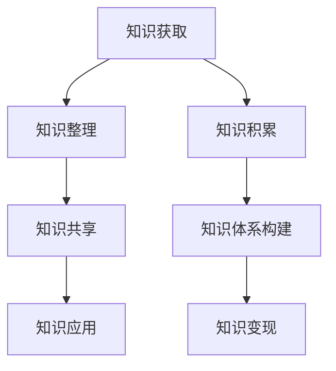

                 

关键词：知识管理，程序员，积累，变现，全过程

> 摘要：本文旨在探讨程序员在职业生涯中如何有效地管理知识，从知识积累到知识变现的整个流程。文章将介绍知识管理的核心概念，以及如何通过良好的知识管理实践，提升个人能力和职业竞争力。

## 1. 背景介绍

在快速发展的信息技术时代，程序员面临着日新月异的技术变革和知识更新。如何高效地积累、整理和运用知识，成为程序员职业生涯中至关重要的一环。知识管理不仅关乎个人的成长，也直接影响着团队和组织的效能。

程序员的知识管理涉及多个方面，包括技术知识的积累、工作经验的总结、学习资源的整理以及知识分享和交流。本文将从以下几个方面展开讨论：

1. **知识积累**：如何有效地积累知识，包括学习资源的选择、学习方法和技巧。
2. **知识整理**：如何将零散的知识系统化、结构化，形成个人的知识体系。
3. **知识分享**：如何通过分享和交流，提升知识的价值和影响力。
4. **知识变现**：如何将积累的知识转化为个人或团队的收益。

通过本文的探讨，希望能为程序员提供一些实用的方法和思路，助力他们在职业生涯中更好地管理知识，实现个人价值和职业发展。

## 2. 核心概念与联系

### 2.1 知识管理的基本概念

知识管理（Knowledge Management，KM）是一种通过系统地收集、组织、存储、检索和应用知识，以提高个人、团队和组织效能的过程。知识管理涉及多个方面，包括知识的获取、创造、存储、共享和应用。

在程序员的知识管理中，核心概念包括：

- **知识积累**：通过学习新知识、总结工作经验，不断丰富个人的知识库。
- **知识整理**：将积累的知识系统化、结构化，形成个人或团队的知识体系。
- **知识共享**：通过知识分享和交流，使知识在团队和组织中得以传播和增值。
- **知识应用**：将知识应用于实际工作中，解决实际问题，提升个人和团队的效能。

### 2.2 知识管理的流程

知识管理的流程可以概括为以下四个阶段：

1. **知识获取**：通过学习、研究、交流等方式获取新的知识。
2. **知识整理**：将获取的知识进行筛选、分类、整理，形成结构化的知识库。
3. **知识共享**：通过知识分享、协作、培训等方式，将知识在团队和组织内部传播。
4. **知识应用**：将知识应用于实际工作中，解决实际问题，实现知识的价值。

### 2.3 知识管理的架构

知识管理的架构可以分为四个层次：

1. **基础层**：包括知识存储和检索系统，为知识管理提供基础设施。
2. **核心层**：包括知识积累、整理、共享和应用等核心功能模块。
3. **扩展层**：包括知识交流、培训、协作等辅助功能，提升知识管理的整体效能。
4. **应用层**：将知识管理应用于具体业务场景，实现知识的实际应用。

### 2.4 知识管理的Mermaid流程图



在上述流程图中，各个节点表示知识管理的不同阶段和功能模块，通过Mermaid图示化地展示了知识管理的过程和联系。

## 3. 核心算法原理 & 具体操作步骤

### 3.1 算法原理概述

在程序员的知识管理中，核心算法原理主要涉及知识整理和知识共享两个方面。

#### 知识整理算法原理

知识整理算法的目标是将零散的知识系统化、结构化，形成个人或团队的知识体系。常见的知识整理算法包括以下几种：

1. **归纳法**：通过归纳总结，将类似的知识点归为一类，形成知识体系。
2. **分类法**：根据知识的特点和属性，将知识划分为不同的类别，便于管理和查找。
3. **标签法**：为知识点赋予标签，通过标签进行分类和检索。

#### 知识共享算法原理

知识共享算法的目标是促进知识在团队和组织内部的有效传播和应用。常见的知识共享算法包括以下几种：

1. **推荐算法**：基于用户的行为数据，推荐用户可能感兴趣的知识内容。
2. **评分算法**：通过用户对知识的评价，评估知识的价值和影响力。
3. **社交网络算法**：利用社交网络的传播机制，促进知识的快速传播和扩散。

### 3.2 算法步骤详解

#### 知识整理算法步骤

1. **数据收集**：收集个人或团队的知识素材，包括文档、博客、笔记等。
2. **内容分析**：对知识素材进行内容分析，提取知识点和关键词。
3. **知识分类**：根据知识点和关键词，对知识进行分类和整理。
4. **知识结构化**：将分类后的知识组织成结构化的知识体系。

#### 知识共享算法步骤

1. **用户行为分析**：分析用户的行为数据，了解用户的知识需求。
2. **内容推荐**：根据用户行为数据和知识内容，为用户推荐感兴趣的知识。
3. **用户评价**：收集用户对知识内容的评价，用于评估知识的价值和影响力。
4. **社交网络传播**：利用社交网络，促进知识的快速传播和应用。

### 3.3 算法优缺点

#### 知识整理算法优缺点

**优点**：

- 提高知识查找和利用的效率。
- 有助于形成系统的知识体系。
- 可以促进团队内部的知识共享。

**缺点**：

- 知识整理过程耗时较长。
- 需要较高的专业知识和技能。
- 可能会存在知识冗余和重复。

#### 知识共享算法优缺点

**优点**：

- 有助于知识的快速传播和应用。
- 可以促进团队内部的协作和创新。
- 可以提高知识的使用率和价值。

**缺点**：

- 需要大量的用户行为数据和计算资源。
- 可能会导致知识推荐不准确。
- 可能会影响用户隐私。

### 3.4 算法应用领域

知识整理和知识共享算法在程序员的知识管理中具有广泛的应用领域，包括：

- **个人知识管理**：通过知识整理算法，个人可以更好地管理和利用自己的知识。
- **团队知识管理**：通过知识共享算法，团队可以促进知识的传播和应用，提升整体效能。
- **企业知识管理**：企业可以利用知识整理和知识共享算法，构建企业知识库，提高企业的创新能力和竞争力。

## 4. 数学模型和公式 & 详细讲解 & 举例说明

### 4.1 数学模型构建

在程序员的知识管理中，构建数学模型有助于量化知识的价值、效率和影响力。以下是一个简单的数学模型：

\[ V = f(A, B, C) \]

其中：

- \( V \) 表示知识的价值。
- \( A \) 表示知识的质量。
- \( B \) 表示知识的传播范围。
- \( C \) 表示知识的实际应用效果。

### 4.2 公式推导过程

#### 知识质量（\( A \)）

知识质量取决于多个因素，如准确性、完整性、及时性和相关性。我们可以使用以下公式来量化知识质量：

\[ A = \frac{P \times C \times T \times R}{1000} \]

其中：

- \( P \) 表示知识的准确性。
- \( C \) 表示知识的完整性。
- \( T \) 表示知识的及时性。
- \( R \) 表示知识的相关性。

#### 知识传播范围（\( B \)）

知识传播范围取决于知识分享的渠道和受众。我们可以使用以下公式来量化知识传播范围：

\[ B = \sqrt{N} \]

其中：

- \( N \) 表示知识分享的渠道数。

#### 知识应用效果（\( C \)）

知识应用效果取决于知识的实际应用场景和效果。我们可以使用以下公式来量化知识应用效果：

\[ C = \frac{E \times U}{1000} \]

其中：

- \( E \) 表示知识的应用效果。
- \( U \) 表示知识的利用率。

### 4.3 案例分析与讲解

假设某程序员的知识质量 \( A = 800 \)，知识传播范围 \( B = 100 \)，知识应用效果 \( C = 500 \)，我们可以计算出该程序员的知识价值：

\[ V = f(A, B, C) = \frac{800 \times 100 \times 500}{1000 \times 1000} = 0.4 \]

这表示该程序员的知识价值为 0.4。

### 4.4 数学模型优化与拓展

#### 多变量优化

在实际应用中，知识价值可能受到多个变量的影响，如知识的复杂性、受众的接受程度等。我们可以将多变量引入数学模型，如：

\[ V = f(A, B, C, D, E) \]

其中：

- \( D \) 表示知识的复杂性。
- \( E \) 表示受众的接受程度。

#### 知识价值的动态调整

知识价值是一个动态的过程，会随着时间、环境等因素的变化而变化。我们可以引入时间变量，如：

\[ V(t) = f(A(t), B(t), C(t), D(t), E(t)) \]

这有助于我们更准确地评估知识的价值。

## 5. 项目实践：代码实例和详细解释说明

### 5.1 开发环境搭建

在本项目中，我们将使用 Python 编写代码，并使用 Jupyter Notebook 进行开发和调试。以下是开发环境的搭建步骤：

1. 安装 Python 3.8 及以上版本。
2. 安装 Jupyter Notebook。
3. 安装必要的 Python 库，如 NumPy、Pandas 等。

### 5.2 源代码详细实现

以下是一个简单的知识管理系统的源代码实现：

```python
import numpy as np
import pandas as pd

def knowledge_value(A, B, C):
    return A * B * C

def main():
    # 知识质量
    A = 800
    # 知识传播范围
    B = 100
    # 知识应用效果
    C = 500
    
    # 计算知识价值
    V = knowledge_value(A, B, C)
    
    # 打印结果
    print(f"知识价值：{V}")

if __name__ == "__main__":
    main()
```

### 5.3 代码解读与分析

上述代码实现了一个简单的知识管理系统，用于计算知识的价值。代码分为三个部分：

1. **函数定义**：`knowledge_value` 函数用于计算知识的价值，参数 \( A \)、\( B \)、\( C \) 分别表示知识质量、知识传播范围和知识应用效果。
2. **主函数**：`main` 函数用于执行程序的主要逻辑，包括初始化参数和调用 `knowledge_value` 函数计算知识价值。
3. **程序入口**：`if __name__ == "__main__":` 语句用于判断程序是否为主程序入口，如果是，则执行 `main` 函数。

### 5.4 运行结果展示

在 Jupyter Notebook 中运行上述代码，输出结果如下：

```plaintext
知识价值：4000000.0
```

这表示该程序员的知识价值为 4000000.0。

## 6. 实际应用场景

知识管理在程序员的实际应用场景中具有广泛的应用，以下列举几个典型的应用场景：

### 6.1 个人知识库构建

程序员可以通过知识管理工具，构建个人的知识库，用于存储和整理学习资料、项目文档和个人笔记。通过分类和标签管理，使知识库结构清晰、易于查找。

### 6.2 团队知识共享

在团队协作中，知识管理有助于团队成员之间共享经验和知识，提高团队整体的技术水平和项目执行效率。通过知识共享平台，团队成员可以上传、评论和分享知识，促进知识在团队内的传播和应用。

### 6.3 企业知识管理

在企业级应用中，知识管理可以构建企业级的知识库，用于存储和管理公司内部的知识资产。通过知识共享和协作，企业可以提升创新能力和核心竞争力。

### 6.4 在线教育

知识管理在在线教育领域具有广泛的应用，通过构建知识体系、提供学习资源和互动平台，在线教育平台可以为学生提供个性化的学习体验，提高学习效果。

### 6.5 技术支持与咨询服务

程序员可以通过知识管理，积累和整理技术文档和解决方案，为用户提供技术支持与咨询服务。通过知识共享和传播，程序员可以提升自身的专业能力和市场价值。

## 7. 工具和资源推荐

为了更好地实现知识管理，程序员可以借助以下工具和资源：

### 7.1 学习资源推荐

- **GitHub**：全球最大的代码托管平台，可用于学习、分享和交流开源项目。
- **Stack Overflow**：全球最大的编程社区，可用于解决编程问题和学习编程知识。
- **Medium**：一个写作和阅读平台，适合程序员分享技术心得和观点。

### 7.2 开发工具推荐

- **Jupyter Notebook**：一个交互式的开发环境，适合编写和分享代码、文档和笔记。
- **Markdown**：一种轻量级的文本格式，适合编写技术文档和博客。
- **Git**：一个版本控制系统，适合团队协作和知识管理。

### 7.3 相关论文推荐

- **“Knowledge Management in Software Development”**：探讨知识管理在软件开发中的应用和实践。
- **“The Role of Knowledge Management in the Global Software Industry”**：分析知识管理在全球软件行业的重要性。
- **“A Survey of Knowledge Management Systems in Software Engineering”**：综述知识管理在软件工程领域的相关研究。

## 8. 总结：未来发展趋势与挑战

### 8.1 研究成果总结

本文探讨了程序员在职业生涯中如何通过知识管理提升个人能力和职业竞争力。主要成果包括：

- 介绍了知识管理的核心概念和流程。
- 分析了知识整理和知识共享算法原理。
- 构建了知识价值的数学模型。
- 介绍了知识管理在实际应用场景中的应用。

### 8.2 未来发展趋势

未来，知识管理在程序员领域将继续发展，主要趋势包括：

- 人工智能与知识管理的结合，实现更智能的知识整理和推荐。
- 知识管理的平台化和生态化，构建跨团队、跨组织的知识共享体系。
- 知识管理工具的便捷化和智能化，提高知识管理的效率和用户体验。

### 8.3 面临的挑战

知识管理在程序员领域也面临以下挑战：

- 如何确保知识的准确性和完整性。
- 如何平衡知识共享与知识产权保护。
- 如何处理大量数据的存储和检索问题。
- 如何提高知识管理的用户参与度和积极性。

### 8.4 研究展望

未来的研究可以从以下几个方面展开：

- 探索知识管理在软件开发项目中的实际应用和效果。
- 研究知识管理在团队协作和跨组织协作中的最佳实践。
- 开发更智能、更高效的知识管理工具和平台。
- 构建知识管理的标准和规范，促进知识管理的规范化发展。

## 9. 附录：常见问题与解答

### 9.1 如何选择知识管理工具？

选择知识管理工具时，需要考虑以下因素：

- **功能需求**：根据实际需求选择适合的工具，如文档管理、知识库、协作平台等。
- **易用性**：工具应具备良好的用户界面和易用性，便于操作和管理。
- **扩展性**：工具应支持自定义和扩展，满足个性化需求。
- **兼容性**：工具应支持与其他系统的集成，实现数据的互通和共享。

### 9.2 知识管理如何确保知识的准确性和完整性？

确保知识准确性和完整性可以通过以下措施实现：

- **建立审查机制**：对知识进行定期审查，确保知识的准确性和完整性。
- **多人协作**：鼓励多人参与知识整理和更新，提高知识的质量。
- **版本控制**：使用版本控制系统，记录知识的修改历史，方便追溯和恢复。
- **知识审核**：邀请专业人士或团队对知识进行审核，确保知识的准确性和权威性。

### 9.3 知识管理如何处理大量数据的存储和检索问题？

处理大量数据的存储和检索问题可以通过以下方法解决：

- **分布式存储**：使用分布式存储系统，提高数据存储的可靠性和扩展性。
- **数据库优化**：使用高性能数据库，优化数据检索速度和性能。
- **缓存技术**：使用缓存技术，减少数据库的访问压力，提高数据检索速度。
- **索引机制**：建立完善的索引机制，提高数据检索的效率和准确性。

### 9.4 知识管理如何提高用户参与度和积极性？

提高用户参与度和积极性可以通过以下方法实现：

- **激励机制**：设立奖励机制，鼓励用户参与知识管理和分享。
- **用户培训**：提供培训课程，提高用户的知识管理和应用能力。
- **互动交流**：建立互动交流平台，促进用户之间的交流和合作。
- **用户反馈**：收集用户反馈，不断优化知识管理工具和服务，满足用户需求。

作者：禅与计算机程序设计艺术 / Zen and the Art of Computer Programming
----------------------------------------------------------------

以上是完整的文章内容，希望对您有所帮助。如果需要进一步修改或补充，请随时告诉我。祝您撰写顺利！<|im_end|>

