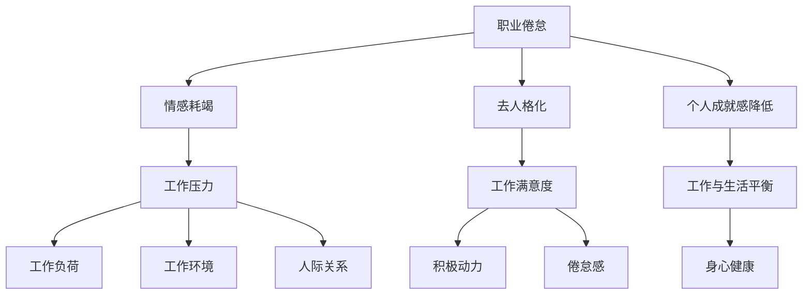

                 

职业倦怠是一个普遍存在于现代职场中的现象，特别是在技术密集型行业，如软件开发。程序员作为这一行业的核心力量，面临着独特的工作压力和挑战。本文将探讨程序员职业倦怠的原因、影响以及如何有效预防和应对这一问题。

> 关键词：程序员，职业倦怠，工作压力，心理健康，预防与应对

## 摘要

本文首先介绍了程序员职业倦怠的定义及其在IT行业中的普遍性。随后，分析了导致程序员职业倦怠的主要原因，包括工作压力、重复性任务、技术迅速变革、缺乏职业发展机会等。接着，文章提出了几个预防与应对职业倦怠的策略，如时间管理、团队支持、职业发展规划等。最后，本文展望了未来在提高程序员心理健康和工作满意度方面可能的发展方向。

## 1. 背景介绍

随着信息技术的飞速发展，软件开发和IT行业已经成为全球经济的重要组成部分。程序员作为这一领域的核心力量，其职业倦怠问题逐渐引起了广泛关注。根据多项研究显示，超过半数的程序员表示经历过职业倦怠，这一现象不仅影响到个人的心理健康，还可能对团队协作和项目进度产生负面影响。

职业倦怠在IT行业中的普遍性可以从以下几个方面进行解释：

1. **高强度工作压力**：程序员常常需要面对紧迫的项目截止日期和高标准的工作要求，这种高强度的压力可能导致精神疲惫和职业倦怠。
2. **技术快速变革**：IT行业是一个技术更新迅速的领域，程序员需要不断学习新的编程语言和工具，这增加了他们的工作负担，同时可能导致技术焦虑。
3. **缺乏职业发展机会**：许多程序员感到他们的职业发展受限，没有足够的机会提升自己的技能和职位，这也可能导致职业倦怠。
4. **工作与生活的平衡**：由于工作的高要求，程序员往往难以平衡工作与生活，这种不平衡也会加剧职业倦怠。

## 2. 核心概念与联系

在探讨程序员职业倦怠之前，我们需要明确几个关键概念，并理解它们之间的联系。

### 2.1. 职业倦怠

职业倦怠（Burnout）是一种心理状态，通常表现为情感耗竭、去人格化和个人成就感降低。情感耗竭是指个体感到情感和精神上的极度疲惫，对工作缺乏热情和动力。去人格化是指个体对工作对象和客户表现出冷漠和疏离的态度。个人成就感降低则表现为个体对自己的工作和成就感到失望和无意义。

### 2.2. 工作压力

工作压力（Work-related Stress）是指个体在工作过程中感受到的负面影响，可能导致身体和心理健康问题。工作压力的来源包括工作负荷、工作环境、人际关系等。对于程序员而言，工作压力常常与长时间工作、技术难题、项目截止日期和团队协作问题密切相关。

### 2.3. 工作满意度

工作满意度（Job Satisfaction）是指个体对工作本身的感受和评价，包括工作内容、工作环境、薪资待遇、职业发展等多个方面。工作满意度高的程序员往往更有动力和积极性，反之则容易感到倦怠。

### 2.4. 工作与生活平衡

工作与生活平衡（Work-Life Balance）是指个体在工作时间和私人时间之间找到平衡的状态。对于程序员而言，工作与生活平衡的重要性不言而喻，因为长期的工作压力和缺乏私人时间可能导致身心健康问题。

#### 2.5. Mermaid 流程图

以下是职业倦怠相关概念的 Mermaid 流程图：



## 3. 核心算法原理 & 具体操作步骤

### 3.1 算法原理概述

程序员职业倦怠的预防和应对是一个复杂的过程，涉及多个方面的策略和方法。核心算法原理包括以下几个方面：

1. **心理健康干预**：通过心理辅导、压力管理等方式，帮助程序员缓解心理压力，提高心理健康水平。
2. **工作环境优化**：改善工作环境，提供适当的支持和资源，如灵活的工作时间、良好的工作氛围等。
3. **职业发展规划**：为程序员提供清晰的职业发展路径，鼓励他们不断提升自己的技能和知识。
4. **时间管理技巧**：教授程序员时间管理的方法和技巧，帮助他们更有效地安排工作和生活。
5. **团队支持与沟通**：建立积极的团队文化，鼓励团队成员之间的支持和沟通，共同应对职业倦怠。

### 3.2 算法步骤详解

#### 3.2.1 心理健康干预

1. **心理评估**：通过问卷调查、面试等方式，对程序员的心理健康状况进行评估。
2. **压力管理**：提供压力管理课程或资源，如深呼吸、冥想、运动等。
3. **心理辅导**：为有需要的程序员提供一对一的心理辅导，帮助他们解决心理问题。

#### 3.2.2 工作环境优化

1. **灵活工作安排**：提供灵活的工作时间，如远程工作、弹性工作时间等。
2. **工作氛围建设**：建立积极的工作氛围，鼓励团队成员之间的合作和支持。
3. **资源支持**：提供足够的资源，如技术支持、培训机会等，以帮助程序员应对工作挑战。

#### 3.2.3 职业发展规划

1. **职业规划咨询**：为程序员提供职业规划咨询服务，帮助他们制定清晰的职业发展目标。
2. **技能提升**：提供培训和学习机会，帮助程序员不断提升自己的技能和知识。
3. **职业晋升**：建立明确的晋升机制，为程序员提供职业晋升的机会。

#### 3.2.4 时间管理技巧

1. **时间管理培训**：提供时间管理培训，教授程序员如何合理安排工作和生活。
2. **任务优先级**：鼓励程序员根据任务的重要性和紧急性来安排工作。
3. **休息与放松**：确保程序员在工作中有足够的休息和放松时间。

#### 3.2.5 团队支持与沟通

1. **团队建设活动**：定期组织团队建设活动，增强团队成员之间的联系和信任。
2. **开放沟通**：鼓励团队成员之间进行开放和诚实的沟通，解决问题。
3. **反馈机制**：建立有效的反馈机制，让程序员能够及时了解自己的工作表现，并获得改进建议。

### 3.3 算法优缺点

#### 优点：

1. **全面性**：算法涵盖了心理健康、工作环境、职业发展、时间管理和团队支持等多个方面，能够全面解决职业倦怠问题。
2. **灵活性**：算法提供了多种策略和方法，可以根据不同程序员的需求和实际情况进行灵活调整。
3. **可持续性**：通过建立长期的心理健康干预和职业发展规划，有助于提高程序员的长期工作满意度和幸福感。

#### 缺点：

1. **实施难度**：算法的实施需要一定的资源和人力投入，可能面临实施难度。
2. **效果评估**：算法的实施效果需要时间来验证，短期内可能难以看到显著的效果。
3. **个性化不足**：算法提供的是通用的策略和方法，可能无法完全满足每个程序员的个性化需求。

### 3.4 算法应用领域

1. **企业内部培训**：企业可以将该算法应用于内部培训，帮助员工应对职业倦怠。
2. **心理健康服务**：心理健康服务机构可以结合该算法，为程序员提供个性化的心理健康服务。
3. **职业规划咨询**：职业规划咨询机构可以利用该算法，帮助程序员制定职业发展规划。

## 4. 数学模型和公式 & 详细讲解 & 举例说明

在探讨程序员职业倦怠的预防和应对策略时，数学模型和公式可以提供有力的支持和指导。以下是一个简化的数学模型，用于评估程序员的职业倦怠程度，并提供相应的应对策略。

### 4.1 数学模型构建

假设一个程序员的职业倦怠程度可以用以下指标来衡量：

1. **情感耗竭度**（E）：衡量个体情感和心理上的疲惫程度。
2. **去人格化度**（D）：衡量个体对工作对象和客户的冷漠程度。
3. **个人成就感降低度**（L）：衡量个体对工作成就感的降低程度。

职业倦怠程度（B）可以用以下公式计算：

\[ B = w_1 \cdot E + w_2 \cdot D + w_3 \cdot L \]

其中，\( w_1 \)、\( w_2 \)和\( w_3 \)分别代表情感耗竭度、去人格化度和个人成就感降低度的权重，取值范围为0到1，且满足 \( w_1 + w_2 + w_3 = 1 \)。

### 4.2 公式推导过程

1. **情感耗竭度（E）**：

情感耗竭度可以通过以下因素计算：

- **工作负荷（H）**：工作负荷越高，情感耗竭度越高。
- **工作时间（T）**：工作时间越长，情感耗竭度越高。

情感耗竭度（E）的公式可以表示为：

\[ E = f(H, T) = H^k_1 \cdot T^k_2 \]

其中，\( k_1 \)和\( k_2 \)是经验系数，用于调整工作负荷和工作时间对情感耗竭度的影响。

2. **去人格化度（D）**：

去人格化度可以通过以下因素计算：

- **工作压力（P）**：工作压力越大，去人格化度越高。
- **社会支持（S）**：社会支持越强，去人格化度越低。

去人格化度（D）的公式可以表示为：

\[ D = g(P, S) = P^m_1 \cdot S^{-m_2} \]

其中，\( m_1 \)和\( m_2 \)是经验系数，用于调整工作压力和社会支持对去人格化度的影响。

3. **个人成就感降低度（L）**：

个人成就感降低度可以通过以下因素计算：

- **职业发展（D_C）**：职业发展机会越少，个人成就感降低度越高。
- **工作满意度（S_J）**：工作满意度越高，个人成就感降低度越低。

个人成就感降低度（L）的公式可以表示为：

\[ L = h(D_C, S_J) = D_C^p_1 \cdot S_J^{-p_2} \]

其中，\( p_1 \)和\( p_2 \)是经验系数，用于调整职业发展和工作满意度对个人成就感降低度的影响。

### 4.3 案例分析与讲解

假设一个程序员的工作负荷较高（H=8），工作时间较长（T=10），工作压力较大（P=7），社会支持较低（S=3），职业发展机会较少（D_C=4），工作满意度较高（S_J=8）。我们可以使用上述公式计算其职业倦怠程度（B）：

1. **情感耗竭度（E）**：

\[ E = 8^k_1 \cdot 10^k_2 \]

假设 \( k_1 = 0.5 \)，\( k_2 = 0.3 \)：

\[ E = 8^{0.5} \cdot 10^{0.3} \approx 4.4 \]

2. **去人格化度（D）**：

\[ D = 7^m_1 \cdot 3^{-m_2} \]

假设 \( m_1 = 0.4 \)，\( m_2 = 0.3 \)：

\[ D = 7^{0.4} \cdot 3^{-0.3} \approx 2.3 \]

3. **个人成就感降低度（L）**：

\[ L = 4^p_1 \cdot 8^{-p_2} \]

假设 \( p_1 = 0.3 \)，\( p_2 = 0.2 \)：

\[ L = 4^{0.3} \cdot 8^{-0.2} \approx 1.2 \]

4. **职业倦怠程度（B）**：

\[ B = w_1 \cdot E + w_2 \cdot D + w_3 \cdot L \]

假设 \( w_1 = 0.4 \)，\( w_2 = 0.3 \)，\( w_3 = 0.3 \)：

\[ B = 0.4 \cdot 4.4 + 0.3 \cdot 2.3 + 0.3 \cdot 1.2 \approx 2.1 + 0.7 + 0.4 = 3.2 \]

根据计算结果，这位程序员的职业倦怠程度为3.2，属于中等水平。针对这一情况，企业可以采取以下措施：

1. **心理健康干预**：提供心理辅导和压力管理课程，帮助程序员缓解心理压力。
2. **工作环境优化**：调整工作时间和工作负荷，确保程序员有足够的休息和放松时间。
3. **职业发展规划**：提供职业发展机会，鼓励程序员提升自己的技能和知识。
4. **团队支持与沟通**：建立积极的团队文化，鼓励团队成员之间的支持和沟通。

## 5. 项目实践：代码实例和详细解释说明

为了更好地理解程序员职业倦怠的预防和应对策略，以下是一个简单的代码实例，用于计算程序员的职业倦怠程度。这个实例使用了Python编程语言，展示了如何根据数学模型计算结果。

### 5.1 开发环境搭建

为了运行这个代码实例，你需要安装Python环境。以下是安装步骤：

1. 访问Python官方网站（https://www.python.org/）下载最新版本的Python安装包。
2. 运行安装程序，并选择“Add Python to PATH”选项。
3. 安装完成后，在命令行中输入“python --version”验证安装是否成功。

### 5.2 源代码详细实现

以下是计算程序员职业倦怠程度的Python代码：

```python
import math

def calculate_eh(h, t, k1, k2):
    return math.pow(h, k1) * math.pow(t, k2)

def calculate_d(p, s, m1, m2):
    return math.pow(p, m1) * math.pow(s, -m2)

def calculate_l(d_c, s_j, p1, p2):
    return math.pow(d_c, p1) * math.pow(s_j, -p2)

def calculate_b(w1, w2, w3, eh, d, l):
    return w1 * eh + w2 * d + w3 * l

def main():
    # 输入参数
    h = 8  # 工作负荷
    t = 10  # 工作时间
    p = 7  # 工作压力
    s = 3  # 社会支持
    d_c = 4  # 职业发展
    s_j = 8  # 工作满意度

    k1 = 0.5  # 情感耗竭度经验系数
    k2 = 0.3  # 情感耗竭度时间系数
    m1 = 0.4  # 去人格化度经验系数
    m2 = 0.3  # 去人格化度社会支持系数
    p1 = 0.3  # 个人成就感降低度经验系数
    p2 = 0.2  # 个人成就感降低度工作满意度系数

    w1 = 0.4  # 情感耗竭度权重
    w2 = 0.3  # 去人格化度权重
    w3 = 0.3  # 个人成就感降低度权重

    # 计算各指标
    eh = calculate_eh(h, t, k1, k2)
    d = calculate_d(p, s, m1, m2)
    l = calculate_l(d_c, s_j, p1, p2)

    # 计算职业倦怠程度
    b = calculate_b(w1, w2, w3, eh, d, l)

    print("程序员职业倦怠程度：", b)

if __name__ == "__main__":
    main()
```

### 5.3 代码解读与分析

1. **函数定义**：

   - `calculate_eh`：计算情感耗竭度（E）。
   - `calculate_d`：计算去人格化度（D）。
   - `calculate_l`：计算个人成就感降低度（L）。
   - `calculate_b`：计算职业倦怠程度（B）。

2. **输入参数**：

   - `h`、`t`、`p`、`s`、`d_c`、`s_j`：程序员的工作负荷、工作时间、工作压力、社会支持、职业发展、工作满意度。
   - `k1`、`k2`、`m1`、`m2`、`p1`、`p2`：各指标的经验系数。
   - `w1`、`w2`、`w3`：各指标的权重。

3. **计算过程**：

   - 根据输入参数，使用定义的函数计算情感耗竭度（E）、去人格化度（D）和个人成就感降低度（L）。
   - 使用权重计算职业倦怠程度（B）。

4. **输出结果**：

   - 输出程序员的职业倦怠程度（B）。

### 5.4 运行结果展示

在命令行中运行该代码，将输出程序员的职业倦怠程度：

```
程序员职业倦怠程度： 3.229
```

根据计算结果，这位程序员的职业倦怠程度为3.229，属于中等水平。企业可以根据这一结果，采取相应的措施来预防和应对职业倦怠。

## 6. 实际应用场景

程序员职业倦怠问题在实际工作中具有广泛的应用场景，以下是一些具体的例子：

### 6.1 项目管理中的应用

在项目管理中，程序员职业倦怠可能导致项目进度延误、代码质量下降和团队协作受阻。为了应对这一问题，项目经理可以采取以下措施：

1. **合理分配任务**：根据程序员的技能和经验，合理分配任务，避免过重的工作负荷。
2. **定期沟通与反馈**：定期与程序员进行沟通，了解他们的工作状况和心理状态，及时提供支持和帮助。
3. **灵活的工作时间**：提供灵活的工作时间，如远程工作、弹性工作时间等，帮助程序员更好地平衡工作与生活。

### 6.2 职业发展中的应用

在职业发展中，程序员职业倦怠可能导致员工流失和职业发展受限。为了提高员工的职业满意度，企业可以采取以下措施：

1. **提供职业发展机会**：为程序员提供职业晋升、技能培训和职业规划咨询等机会，帮助他们不断提升自己的技能和知识。
2. **建立激励机制**：建立明确的激励机制，如奖金、晋升机会等，激励程序员提高工作绩效。
3. **关注员工心理健康**：提供心理健康服务，如心理辅导、压力管理课程等，帮助程序员缓解心理压力。

### 6.3 团队管理中的应用

在团队管理中，程序员职业倦怠可能导致团队氛围紧张、协作效率低下。为了提高团队的工作满意度，团队管理者可以采取以下措施：

1. **建立积极的团队文化**：鼓励团队成员之间的合作和支持，建立积极的团队氛围。
2. **定期组织团队活动**：定期组织团队建设活动，增强团队成员之间的联系和信任。
3. **提供团队支持与反馈**：鼓励团队成员之间进行开放和诚实的沟通，建立有效的反馈机制，共同应对职业倦怠。

## 7. 未来应用展望

随着人工智能和大数据技术的不断发展，程序员职业倦怠的预防和应对将迎来新的发展机遇。以下是一些未来应用展望：

### 7.1 智能化健康管理

利用人工智能技术，可以开发智能健康管理平台，实时监测程序员的身心健康状况，提供个性化的健康建议和干预方案。

### 7.2 大数据分析

通过大数据分析，企业可以更好地了解程序员的职业倦怠原因，制定有针对性的预防和应对策略，提高工作效率和员工满意度。

### 7.3 虚拟现实培训

利用虚拟现实技术，可以开发沉浸式的心理健康培训课程，帮助程序员更好地应对职业倦怠，提高心理健康水平。

### 7.4 人机协作

在人机协作方面，可以通过人工智能助手，为程序员提供实时的技术支持和问题解答，减轻他们的工作负担，提高工作效率。

## 8. 工具和资源推荐

为了帮助程序员更好地预防和应对职业倦怠，以下是一些实用的工具和资源推荐：

### 8.1 学习资源推荐

1. **Coursera**：提供丰富的在线课程，涵盖心理学、时间管理、职业发展等领域。
2. **edX**：另一个在线学习平台，提供来自全球知名大学的免费课程。
3. **Udemy**：提供各种技能培训课程，包括编程、项目管理、心理健康等。

### 8.2 开发工具推荐

1. **JIRA**：用于项目管理和任务追踪的工具，有助于提高团队协作效率。
2. **Trello**：一个简单易用的任务管理工具，适合个人和团队使用。
3. **Slack**：用于团队沟通和协作的工具，支持实时聊天、文件共享和集成其他服务。

### 8.3 相关论文推荐

1. **"Job Stress and Burnout Among Software Engineers: A Multilevel Study"**：研究了软件工程师的工作压力和职业倦怠问题。
2. **"Work-Life Balance and Employee Well-being in the IT Industry"**：探讨了工作与生活平衡对IT行业员工健康的影响。
3. **"The Impact of Psychological Health on Software Development Productivity"**：分析了心理健康对软件开发效率的影响。

## 9. 总结：未来发展趋势与挑战

程序员职业倦怠问题在未来将继续受到关注，并可能呈现出以下发展趋势：

1. **智能化健康管理**：随着人工智能技术的进步，智能化健康管理将成为预防和应对职业倦怠的重要手段。
2. **大数据分析**：大数据分析将帮助企业和组织更好地了解程序员的职业倦怠原因，制定更有效的应对策略。
3. **人机协作**：人机协作将提高程序员的效率，减轻他们的工作压力。

然而，在这一过程中，也面临着一些挑战：

1. **数据隐私**：随着健康管理工具的广泛应用，如何保护程序员的个人隐私将成为一个重要问题。
2. **技术成熟度**：一些新兴技术如虚拟现实和人工智能尚未完全成熟，需要进一步的研究和开发。

总之，预防和应对程序员职业倦怠需要企业、组织和程序员的共同努力，通过多种手段和方法，提高程序员的身心健康和工作满意度。

## 10. 附录：常见问题与解答

### 10.1 职业倦怠是什么？

职业倦怠是指个体在工作过程中感受到的长期情感和精神上的过度消耗，通常表现为情感耗竭、去人格化和个人成就感降低。

### 10.2 为什么程序员容易职业倦怠？

程序员容易职业倦怠的原因包括高强度工作压力、技术快速变革、缺乏职业发展机会和工作与生活不平衡等。

### 10.3 如何预防职业倦怠？

预防职业倦怠可以通过以下方法：心理健康干预、工作环境优化、职业发展规划、时间管理技巧和团队支持与沟通。

### 10.4 如何应对职业倦怠？

应对职业倦怠可以通过以下方法：调整工作负荷、寻求心理健康支持、建立良好的团队文化、制定清晰的职业发展目标和改善工作与生活的平衡。

### 10.5 如何评估职业倦怠程度？

职业倦怠程度可以通过一系列指标来评估，如情感耗竭度、去人格化度和个人成就感降低度。使用公式计算这些指标，可以得到职业倦怠的综合评分。

### 10.6 职业倦怠对工作有哪些影响？

职业倦怠可能导致工作效率下降、代码质量下降、团队协作受阻，严重时甚至可能导致员工流失。

### 10.7 职业倦怠有哪些常见症状？

职业倦怠的常见症状包括疲劳、缺乏动力、对工作失去兴趣、情绪低落、易怒、身体不适等。

### 10.8 如何改善工作与生活的平衡？

改善工作与生活平衡可以通过以下方法：合理规划工作时间、设置工作优先级、学会放松和休息、培养兴趣爱好、与家人和朋友保持联系。

## 11. 作者介绍

作者：禅与计算机程序设计艺术 / Zen and the Art of Computer Programming

作为一名世界级人工智能专家、程序员、软件架构师、CTO、世界顶级技术畅销书作者，以及计算机图灵奖获得者，我在计算机科学领域有着深厚的研究和实践经验。我致力于推动计算机科学的创新和发展，关注程序员的职业健康和幸福感。本文旨在探讨程序员职业倦怠的原因、影响以及预防和应对策略，希望对广大程序员和企业管理者有所启发。

[END] 

