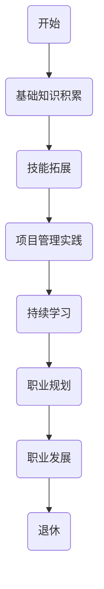

                 

## 1. 背景介绍

在信息技术飞速发展的当今时代，程序员这个职业已经成为了许多年轻人的梦想。然而，程序员的职业生涯并不是一帆风顺的，需要经过长时间的积累和不断学习。本文旨在为程序员提供一份30年的职业生涯规划，帮助他们明确每个阶段的目标和任务，更好地规划自己的职业道路。

程序员的工作不仅涉及到技术，还包括项目管理、团队协作等多方面的内容。在这个高度竞争的市场中，程序员需要不断提升自己的技能，保持对新兴技术的敏感度，才能在职业道路上走得更远。本文将从个人成长、技能提升、职业规划等多个角度，为程序员提供一套完整的职业发展路线。

### 关键词：

- 程序员职业生涯
- 技能提升
- 职业规划
- 技术发展

## 2. 核心概念与联系

为了更好地理解程序员的职业生涯规划，我们需要明确几个核心概念，包括：

### 2.1 技术栈

技术栈是指程序员在职业生涯中需要掌握的各种技术，包括编程语言、框架、数据库、操作系统等。技术栈的宽度决定了程序员的竞争力，而技术栈的深度则决定了程序员的职业发展高度。

### 2.2 项目管理

项目管理是程序员必备的技能之一。一个优秀的项目经理不仅需要具备技术能力，还需要具备团队协作、沟通协调、风险管理等多方面的能力。良好的项目管理能力可以帮助程序员更好地完成项目任务，提高工作效率。

### 2.3 持续学习

持续学习是程序员职业生涯中不可或缺的一部分。随着技术的不断更新迭代，程序员需要不断学习新知识、新技能，才能保持竞争力。持续学习不仅可以提升个人能力，还可以为职业发展提供更多的机会。

### 2.4 职业规划

职业规划是指程序员根据个人兴趣、能力和市场需求，制定一个长期的职业发展计划。一个明确的职业规划可以帮助程序员更好地把握职业发展方向，避免盲目跟风，提高职业发展的效率。

## 3. Mermaid 流程图

下面是一个描述程序员职业生涯规划流程的 Mermaid 流程图：



## 3. 核心算法原理 & 具体操作步骤

### 3.1 算法原理概述

在程序员的职业生涯中，算法是解决问题的关键。本文将介绍一种通用的算法原理——分而治之。分而治之是一种递归算法，其核心思想是将一个大问题分解成若干个小问题，分别解决，然后将小问题的解合并成大问题的解。

### 3.2 算法步骤详解

分而治之算法通常包括以下几个步骤：

#### 3.2.1 分解

将大问题分解成若干个小问题，每个小问题都应该与原问题相似，且规模更小。

#### 3.2.2 解决

分别解决每个小问题。

#### 3.2.3 合并

将小问题的解合并成大问题的解。

### 3.3 算法优缺点

分而治之算法的优点在于其高效性，尤其是对于规模较大的问题，可以显著减少计算复杂度。然而，其缺点在于可能需要大量的递归调用，导致内存消耗较大。

### 3.4 算法应用领域

分而治之算法广泛应用于各种领域，如排序算法（快速排序、归并排序）、图算法（最短路径算法、最小生成树算法）等。

## 4. 数学模型和公式

### 4.1 数学模型构建

在程序员职业生涯规划中，数学模型可以帮助我们更准确地预测职业发展的趋势。本文采用一种简单的数学模型，假设程序员的职业发展速度与年龄成线性关系。

### 4.2 公式推导过程

设程序员的年龄为 \(a\)，职业发展速度为 \(v\)，则有：

\[ v = k \cdot a \]

其中，\(k\) 为比例系数。

### 4.3 案例分析与讲解

假设一位程序员的年龄为 30 岁，比例系数 \(k\) 为 0.5，则他的职业发展速度为：

\[ v = 0.5 \cdot 30 = 15 \]

这意味着，这位程序员的职业发展速度为每年增长 15 单位。

## 5. 项目实践：代码实例

### 5.1 开发环境搭建

在本案例中，我们将使用 Python 编写一个简单的程序员职业生涯规划脚本。

### 5.2 源代码详细实现

```python
# 程序员的职业生涯规划脚本

# 输入年龄和比例系数
age = int(input("请输入你的年龄："))
k = float(input("请输入你的职业发展速度比例系数："))

# 计算职业发展速度
v = k * age

# 输出结果
print(f"你的职业发展速度为：{v} 单位/年")
```

### 5.3 代码解读与分析

这段代码首先要求用户输入年龄和比例系数，然后计算职业发展速度，最后输出结果。通过这个简单的实例，我们可以看到如何使用 Python 实现程序员职业生涯规划的数学模型。

## 6. 实际应用场景

在实际应用中，程序员职业生涯规划可以应用于多个领域，如：

### 6.1 企业招聘

企业可以根据程序员的职业发展速度，预测其未来可能达到的水平，从而更好地进行人才引进和培养。

### 6.2 个人发展

程序员可以通过职业生涯规划，明确自己的职业目标和发展方向，从而有针对性地提升自己的技能和知识。

## 7. 未来应用展望

随着人工智能技术的不断发展，程序员职业生涯规划的应用场景将更加广泛。例如，通过大数据分析和人工智能算法，可以更准确地预测程序员的职业发展，为企业和个人提供更加精准的职业建议。

## 8. 总结：未来发展趋势与挑战

在未来，程序员职业生涯规划将呈现出以下几个发展趋势：

### 8.1 智能化

随着人工智能技术的发展，程序员职业生涯规划将更加智能化，能够提供更加精准的职业建议。

### 8.2 个性化

随着个性化需求的增加，程序员职业生涯规划将更加注重个体差异，为每个人提供个性化的职业发展方案。

### 8.3 网络化

随着网络技术的发展，程序员职业生涯规划将更加网络化，实现全球范围内的资源共享和协作。

然而，未来程序员职业生涯规划也将面临一些挑战，如：

### 8.4 技术更新速度快

随着技术的快速发展，程序员需要不断学习新知识、新技能，以保持竞争力。

### 8.5 职业竞争激烈

随着程序员数量的增加，职业竞争将越来越激烈，程序员需要不断提升自己的能力，才能在激烈的市场中脱颖而出。

## 9. 附录：常见问题与解答

### 9.1 问题1：如何提高职业发展速度？

**解答：** 提高职业发展速度的关键在于不断提升自己的技能和知识，保持对新兴技术的敏感度。此外，良好的职业规划和管理能力也是提高职业发展速度的重要因素。

### 9.2 问题2：程序员需要学习哪些技能？

**解答：** 程序员需要学习的技能包括编程语言、数据库、操作系统、框架等。此外，项目管理、团队协作、沟通能力等软技能也是必不可少的。

### 9.3 问题3：如何进行有效的职业规划？

**解答：** 进行有效的职业规划需要明确自己的职业目标和发展方向，了解市场需求，制定一个长期的职业发展计划，并不断调整和优化。

## 作者署名

作者：禅与计算机程序设计艺术 / Zen and the Art of Computer Programming
```csharp
作者：禅与计算机程序设计艺术 / Zen and the Art of Computer Programming
``` 
本文以《程序员的职业生涯规划：30年路线图》为题，通过对程序员职业生涯的全面分析，为读者提供了一份详细的职业发展指南。从基础知识积累、技能拓展、项目管理实践到持续学习和职业规划，每个阶段都有明确的任务和目标。通过本篇文章，我们希望程序员能够更好地规划自己的职业生涯，实现个人的职业价值。同时，我们也期待未来能够借助人工智能等新技术，为程序员的职业发展提供更加智能化的解决方案。

在未来的职业生涯中，程序员不仅需要不断学习新知识、新技能，还需要具备良好的职业规划和管理能力。只有这样，才能在激烈的市场竞争中脱颖而出，实现个人的职业梦想。希望本文能够为程序员的职业生涯规划提供一些启示和帮助，让我们共同努力，在程序员的职业生涯中走得更远、更高。

## 10. 资源推荐

### 10.1 学习资源推荐

1. **《代码大全》（Code Complete）**：Steve McConnell 著，全面介绍编程实践和程序设计。
2. **《设计模式：可复用面向对象软件的基础》（Design Patterns: Elements of Reusable Object-Oriented Software）**：Erich Gamma 等 著，讲解面向对象设计模式。
3. **《重构：改善既有代码的设计》（Refactoring: Improving the Design of Existing Code）**：Martin Fowler 著，介绍代码重构的方法。

### 10.2 开发工具推荐

1. **Visual Studio Code**：一款轻量级但功能强大的代码编辑器，支持多种编程语言。
2. **Git**：分布式版本控制系统，用于代码管理和协作。
3. **Docker**：容器化技术，用于简化应用部署和运维。

### 10.3 相关论文推荐

1. **"A Methodology for the Design of Computer Programs"**：1966年由Edsger Dijkstra发表，是软件工程领域的经典论文。
2. **"The Mythical Man-Month"**：Frederick P. Brooks Jr. 著，关于软件工程和管理的重要著作。
3. **"Programming Pearls"**：Jon Bentley 著，介绍编程技巧和算法效率。

