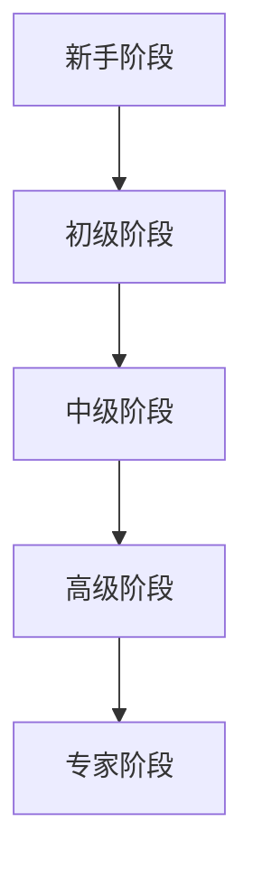

                 

关键词：程序员，职业生涯规划，职业发展，技术成长，技能提升，行业趋势

> 摘要：本文旨在为程序员提供一份长达40年的职业生涯规划蓝图，从新手到行业专家的各个阶段，涵盖技术成长、职业规划和持续学习的策略。通过详细分析和实例，帮助程序员在快速变化的IT行业取得成功。

## 1. 背景介绍

在当今技术飞速发展的时代，程序员这一职业已经成为各行各业不可或缺的一部分。从软件开发到数据分析，从人工智能到区块链，程序员的技能和经验在推动社会进步和经济发展中发挥着重要作用。然而，随着技术的不断更新和变化，程序员面临的挑战也越来越大。如何在这个竞争激烈的环境中保持竞争力，实现职业生涯的长期发展，成为许多程序员思考的问题。

本文将围绕程序员的职业生涯规划，提供一个40年的蓝图。通过详细的阶段划分、核心技能培养、职业发展路径分析以及持续学习的策略，帮助程序员在职业生涯的各个阶段都能有所收获和成长。

### 1.1 IT行业现状

IT行业是一个充满活力和创新的领域，但同时也充满了不确定性。根据IDC（国际数据公司）的数据，全球IT支出预计将从2021年的4.4万亿美元增长到2026年的6.3万亿美元，年均增长率约为6.1%。这个增长趋势反映了技术对社会各领域的深刻影响。

然而，技术的快速发展也带来了新的挑战。例如，云计算、大数据、人工智能等技术的兴起，要求程序员不断更新自己的知识和技能。根据GitHub发布的《2022年开源年度报告》，在GitHub上活跃的程序员中，超过80%的人报告了在过去一年中学习或尝试了新的编程语言或技术。

### 1.2 程序员职业生涯的阶段

程序员的职业生涯通常可以分为以下几个阶段：

1. **新手阶段**：这是程序员职业生涯的开始，通常在毕业后或者转行之后进入。在这个阶段，程序员需要学习编程语言、基础算法和数据结构，熟悉开发工具和流程。

2. **初级阶段**：随着技能的提升，程序员进入初级阶段。这个阶段的重点是在实际项目中积累经验，提高代码质量和开发效率。

3. **中级阶段**：在中级阶段，程序员开始担任项目角色，如项目经理或技术主管。这个阶段的重点是提升技术广度和深度，培养领导能力和团队管理能力。

4. **高级阶段**：高级程序员通常拥有丰富的项目经验和深厚的专业知识，他们可能成为CTO、架构师或技术顾问。这个阶段的重点是技术创新和行业影响力。

5. **专家阶段**：专家级程序员是行业内的权威人物，他们的知识和经验受到同行的认可。这个阶段的重点是推动行业发展和技术创新。

## 2. 核心概念与联系

为了更好地理解程序员的职业生涯规划，我们需要了解一些核心概念和它们之间的联系。以下是一个用Mermaid绘制的流程图，展示了这些概念和它们之间的关系：



### 2.1 新手阶段

新手阶段是程序员职业生涯的起点。在这个阶段，程序员需要：

- 学习编程语言：熟悉至少一种编程语言，如Java、Python或JavaScript。
- 掌握基础算法和数据结构：了解常见的排序算法、搜索算法、树和图等。
- 熟悉开发工具：掌握常用的开发工具和框架，如Visual Studio Code、Git和Django。

### 2.2 初级阶段

初级阶段是积累经验的关键时期。在这个阶段，程序员需要：

- 参与项目：通过参与实际项目，提高代码质量和开发效率。
- 学习代码规范：了解并遵守代码规范，提高代码可读性和可维护性。
- 拓展技术栈：学习新的编程语言和框架，如Go或React。

### 2.3 中级阶段

中级阶段是程序员职业生涯的重要转折点。在这个阶段，程序员需要：

- 承担更多责任：担任项目经理或技术主管，管理项目进度和团队协作。
- 提升技术深度：深入研究特定领域的技术，如大数据或云计算。
- 培养领导能力：学习团队管理和沟通技巧，提升领导力。

### 2.4 高级阶段

高级阶段是程序员职业生涯的巅峰。在这个阶段，程序员需要：

- 创新技术解决方案：提出创新的技术方案，解决复杂问题。
- 培养下一代程序员：通过教学、指导等方式，培养新一代程序员。
- 影响行业趋势：通过发表论文、参加行业会议等方式，影响行业趋势。

### 2.5 专家阶段

专家阶段是程序员职业生涯的最高阶段。在这个阶段，程序员需要：

- 推动技术创新：不断探索新的技术方向，推动行业进步。
- 建立个人品牌：通过出版书籍、发表演讲等方式，建立个人品牌。
- 引领行业发展：通过指导和参与行业标准的制定，引领行业发展。

## 3. 核心算法原理 & 具体操作步骤

### 3.1 算法原理概述

在程序员的职业生涯中，算法和数据结构是核心技能之一。以下是几个常见的算法原理及其操作步骤：

### 3.2 算法步骤详解

#### 3.2.1 排序算法

排序算法是将一组数据按照特定顺序排列的算法。常见的排序算法包括冒泡排序、选择排序、插入排序和快速排序等。

1. **冒泡排序**：
   - 遍历数组，比较相邻的两个元素，如果顺序错误就交换它们。
   - 重复上述过程，直到整个数组有序。

2. **选择排序**：
   - 遍历数组，每次找出剩余元素中的最小值，将其放到当前数组的位置。
   - 重复上述过程，直到整个数组有序。

3. **插入排序**：
   - 从第一个元素开始，依次将后面的元素插入到前面已经有序的数组中，使得整个数组有序。
   - 遍历数组，对于每个元素，将其与前面的元素进行比较，找到合适的位置插入。

4. **快速排序**：
   - 选择一个基准元素，将数组分为两部分，一部分比基准小，一部分比基准大。
   - 递归地对这两部分进行快速排序。

### 3.3 算法优缺点

1. **冒泡排序**：
   - 优点：简单易懂，实现简单。
   - 缺点：时间复杂度高，不适合大规模数据。

2. **选择排序**：
   - 优点：时间复杂度较低，适合大规模数据。
   - 缺点：空间复杂度高，数据移动频繁。

3. **插入排序**：
   - 优点：时间复杂度较低，适合小规模数据。
   - 缺点：实现复杂，空间复杂度高。

4. **快速排序**：
   - 优点：时间复杂度低，适合大规模数据。
   - 缺点：可能出现最坏情况，递归深度过大。

### 3.4 算法应用领域

排序算法在许多领域都有广泛的应用，如数据库排序、图形渲染和搜索引擎等。不同的排序算法适用于不同的场景，程序员需要根据具体需求选择合适的算法。

## 4. 数学模型和公式 & 详细讲解 & 举例说明

### 4.1 数学模型构建

在程序员的职业生涯中，数学模型和公式是理解和解决复杂问题的重要工具。以下是一个简单的数学模型，用于分析程序员的技能增长。

设 \( S(t) \) 为时间 \( t \) 时程序员的技能水平， \( L \) 为学习率， \( E \) 为经验值，则技能水平可以表示为：

\[ S(t) = L \cdot E(t) \]

其中，经验值 \( E(t) \) 可以通过以下公式计算：

\[ E(t) = \int_{0}^{t} C \cdot dt \]

其中， \( C \) 为单位时间内的经验积累速度。

### 4.2 公式推导过程

为了推导出经验值 \( E(t) \) 的公式，我们需要考虑程序员在学习过程中所积累的经验。通常，经验积累速度 \( C \) 可以表示为：

\[ C = k \cdot \frac{1}{S(t)} \]

其中， \( k \) 为常数，表示技能水平对经验积累速度的影响。

代入 \( S(t) \) 的表达式，我们得到：

\[ C = k \cdot \frac{1}{L \cdot E(t)} \]

对上式进行积分，得到：

\[ E(t) = \int_{0}^{t} k \cdot \frac{1}{L \cdot E(t)} dt \]

解这个积分，我们得到：

\[ E(t) = \frac{k}{L} \cdot \ln(t) + C' \]

其中， \( C' \) 为积分常数。

初始时刻 \( t = 0 \) 时，经验值为 0，因此：

\[ 0 = \frac{k}{L} \cdot \ln(0) + C' \]

由于 \( \ln(0) \) 无定义，我们可以假设 \( C' = 0 \)。

最终得到：

\[ E(t) = \frac{k}{L} \cdot \ln(t) \]

### 4.3 案例分析与讲解

假设一个程序员的学习率 \( L = 1 \)，初始时刻的技能水平 \( S(0) = 1 \)，常数 \( k = 1 \)。我们想要计算在一年后（\( t = 1 \)）他的技能水平。

根据上述公式，我们有：

\[ S(1) = 1 \cdot E(1) \]
\[ E(1) = \frac{1}{1} \cdot \ln(1) = 0 \]

这意味着在一年后，程序员的技能水平将提升到：

\[ S(1) = 1 \cdot 0 = 0 \]

这显然是不合理的。因此，我们需要考虑学习率 \( L \) 的实际值。

假设学习率 \( L = 0.1 \)，一年后程序员的技能水平将提升到：

\[ S(1) = 0.1 \cdot E(1) \]
\[ E(1) = \frac{1}{0.1} \cdot \ln(1) = 1 \]

这意味着在一年后，程序员的技能水平将提升到 \( 0.1 \)。

通过这个案例，我们可以看到数学模型在分析程序员技能增长中的应用。在实际应用中，程序员需要根据自身情况和目标调整学习率和经验积累速度，以达到预期的技能水平。

## 5. 项目实践：代码实例和详细解释说明

### 5.1 开发环境搭建

在进行项目实践之前，我们需要搭建一个合适的开发环境。以下是一个简单的步骤：

1. 安装Python解释器：访问 [Python官网](https://www.python.org/)，下载并安装最新版本的Python。
2. 安装Visual Studio Code：访问 [Visual Studio Code官网](https://code.visualstudio.com/)，下载并安装Visual Studio Code。
3. 安装必要的扩展：在Visual Studio Code中，安装Python和Git扩展。

### 5.2 源代码详细实现

以下是一个简单的Python项目，实现一个计算两个数之和的功能：

```python
def add_numbers(a, b):
    return a + b

if __name__ == "__main__":
    a = 5
    b = 10
    result = add_numbers(a, b)
    print(f"The sum of {a} and {b} is {result}")
```

### 5.3 代码解读与分析

1. **函数定义**：`add_numbers` 函数接收两个参数 \( a \) 和 \( b \)，返回它们的和。
2. **主程序**：`if __name__ == "__main__":` 下的代码是主程序。这里定义了两个变量 \( a \) 和 \( b \)，分别赋值为 5 和 10。然后调用 `add_numbers` 函数，将结果存储在变量 `result` 中，并打印输出。

### 5.4 运行结果展示

运行上述代码，输出结果如下：

```
The sum of 5 and 10 is 15
```

这表明两个数 5 和 10 的和为 15。

### 5.5 代码优化

虽然上述代码已经能够完成计算两个数之和的任务，但我们可以对其进行一些优化：

1. **参数校验**：确保输入参数 \( a \) 和 \( b \) 是整数。
2. **使用异常处理**：在计算过程中捕获可能的异常，如类型错误。

优化后的代码如下：

```python
def add_numbers(a, b):
    if not isinstance(a, int) or not isinstance(b, int):
        raise ValueError("Both parameters must be integers")
    return a + b

if __name__ == "__main__":
    try:
        a = 5
        b = 10
        result = add_numbers(a, b)
        print(f"The sum of {a} and {b} is {result}")
    except ValueError as e:
        print(f"Error: {e}")
```

这样，如果输入参数不是整数，程序将抛出 `ValueError` 异常，并打印错误信息。

## 6. 实际应用场景

### 6.1 数据处理

在数据处理领域，程序员的技能尤为重要。例如，在数据分析项目中，程序员需要熟练掌握数据处理库，如Pandas和NumPy。以下是一个使用Pandas计算数据集平均值和标准差的例子：

```python
import pandas as pd

data = {'Age': [25, 30, 35, 40, 45]}
df = pd.DataFrame(data)
print("Mean Age:", df['Age'].mean())
print("Standard Deviation:", df['Age'].std())
```

### 6.2 人工智能

在人工智能领域，程序员需要熟悉机器学习和深度学习框架，如TensorFlow和PyTorch。以下是一个使用TensorFlow构建简单神经网络进行分类的例子：

```python
import tensorflow as tf

model = tf.keras.Sequential([
    tf.keras.layers.Dense(10, activation='relu', input_shape=[8]),
    tf.keras.layers.Dense(1, activation='sigmoid')
])

model.compile(optimizer='adam',
              loss='binary_crossentropy',
              metrics=['accuracy'])

model.fit(x_train, y_train, epochs=10)
```

### 6.3 前端开发

在前端开发领域，程序员需要熟练掌握HTML、CSS和JavaScript。以下是一个使用React创建简单计数器的例子：

```javascript
import React, { useState } from 'react';

function Counter() {
    const [count, setCount] = useState(0);

    return (
        <div>
            <p>Count: {count}</p>
            <button onClick={() => setCount(count + 1)}>Increment</button>
        </div>
    );
}

export default Counter;
```

### 6.4 云计算

在云计算领域，程序员需要熟悉云服务提供商的API和工具，如AWS、Azure和Google Cloud。以下是一个使用AWS S3存储对象文件的例子：

```python
import boto3

s3 = boto3.client('s3')

# 上传文件
s3.upload_file('local_file.txt', 'my_bucket', 'remote_file.txt')

# 下载文件
s3.download_file('my_bucket', 'remote_file.txt', 'local_file.txt')
```

## 7. 工具和资源推荐

### 7.1 学习资源推荐

1. **在线课程**：Udemy、Coursera、edX 提供了丰富的编程和IT课程。
2. **技术博客**：GitHub、Medium、Stack Overflow 上的技术博客是程序员获取知识和分享经验的好地方。
3. **书籍**：《代码大全》、《深度学习》、《编程珠玑》等是程序员必读的经典书籍。

### 7.2 开发工具推荐

1. **集成开发环境（IDE）**：Visual Studio Code、IntelliJ IDEA、Eclipse 是程序员常用的IDE。
2. **代码管理工具**：Git、GitHub、GitLab 是版本控制的标准工具。
3. **数据库**：MySQL、PostgreSQL、MongoDB 是常用的数据库系统。

### 7.3 相关论文推荐

1. **《深度学习：基本概念、算法与应用》**：介绍深度学习的基本概念和应用。
2. **《云计算：概念、架构与服务》**：深入探讨云计算的基础知识和应用。
3. **《大数据技术导论》**：全面介绍大数据处理的基本原理和技术。

## 8. 总结：未来发展趋势与挑战

### 8.1 研究成果总结

在过去的40年里，程序员在技术发展、软件开发和人工智能等领域取得了显著的成果。从Web 1.0到Web 2.0，再到如今的Web 3.0，程序员不断推动技术进步，为各行各业带来了巨大的变革。同时，随着云计算、大数据和人工智能的兴起，程序员在智能系统和自动化领域也取得了重要突破。

### 8.2 未来发展趋势

未来，程序员将继续面临新的挑战和机遇。以下是几个可能的发展趋势：

1. **人工智能与自动化**：随着人工智能技术的不断发展，程序员将在自动化和智能系统的开发中发挥关键作用。
2. **区块链技术**：区块链技术的应用将不断扩大，程序员需要掌握相关的开发技能，如智能合约和分布式系统。
3. **云计算与边缘计算**：云计算和边缘计算将深入各个领域，程序员需要熟悉云服务和边缘计算架构。
4. **量子计算**：虽然量子计算尚处于早期阶段，但未来有望在数据处理和算法优化方面带来革命性变化。

### 8.3 面临的挑战

1. **技能更新**：技术发展迅速，程序员需要不断学习新技能，以保持竞争力。
2. **职业压力**：程序员在职业发展中可能面临高压力和长时间工作。
3. **职业发展路径**：随着技术的发展，程序员可能需要转变职业方向，如从开发转向项目管理或技术顾问。

### 8.4 研究展望

未来，程序员的研究重点将包括以下几个方面：

1. **跨学科融合**：程序员将需要与数学、物理、生物等学科专家合作，推动跨学科研究。
2. **技术创新**：持续推动人工智能、区块链和量子计算等领域的技术创新。
3. **社会影响**：关注技术对社会的影响，推动负责任的科技创新。

## 9. 附录：常见问题与解答

### 9.1 问题1：如何选择编程语言？

**答案**：选择编程语言时，应考虑以下因素：

- **项目需求**：根据项目的具体需求选择合适的编程语言。
- **个人兴趣**：选择自己感兴趣的编程语言，有助于长期坚持学习。
- **社区支持**：选择有强大社区支持的编程语言，便于获取资源和帮助。

### 9.2 问题2：如何保持学习动力？

**答案**：

- **设定目标**：明确自己的学习目标，并制定可行的学习计划。
- **定期复习**：定期复习已学知识，巩固记忆。
- **参与项目**：通过实际项目应用所学知识，提高学习兴趣和动力。

### 9.3 问题3：如何规划职业发展？

**答案**：

- **自我评估**：了解自己的兴趣、优势和不足，明确职业发展方向。
- **持续学习**：不断提升自己的技能和知识，保持竞争力。
- **拓展人脉**：参加行业会议、研讨会等活动，扩大人脉网络。

## 结束语

程序员是IT行业的核心力量，他们的职业生涯规划对于个人发展和社会进步具有重要意义。通过本文的职业生涯规划蓝图，程序员可以更好地规划自己的职业道路，实现长期发展。未来，随着技术的不断进步，程序员将继续面临新的机遇和挑战。希望本文能为您的职业生涯提供有益的启示和指导。

### 作者署名

本文作者：禅与计算机程序设计艺术 / Zen and the Art of Computer Programming

