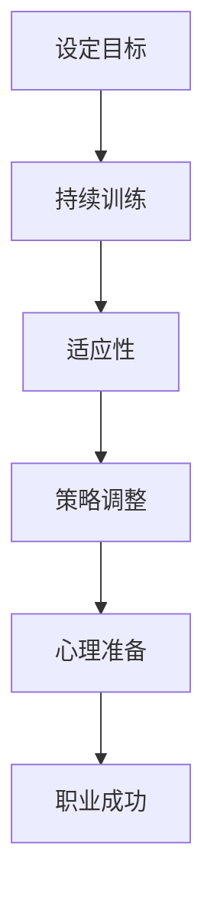

                 

关键词：程序员、职业生涯规划、持续学习、技术发展、专业技能提升

> 摘要：本文旨在为程序员提供一套全面的职业生涯规划方案，将其比喻为一场马拉松长跑，强调持续学习、适应技术变革、提升专业技能的重要性。通过深入探讨程序员职业生涯中的关键阶段和策略，帮助读者在激烈竞争的技术领域中取得成功。

## 1. 背景介绍

作为一名程序员，职业生涯的长度和质量往往取决于持续学习和技术提升的能力。在当今快速发展的技术环境中，程序员面临着不断涌现的新工具、新技术和新方法。因此，如何进行有效的职业生涯规划，成为一个值得深思的问题。

职业生涯规划不仅仅是找到一份好工作或获得晋升，更是关于如何在一个不断变化的环境中持续成长和发展的过程。本文将结合“长跑”的比喻，探讨程序员在职业生涯中的关键阶段和策略，帮助读者实现长远的职业发展。

### 1.1 程序员职业生涯的现状

目前，程序员的职业生涯可以分为以下几个阶段：

- **新手阶段**：初学者开始学习编程语言和基础算法，积累初步的经验。
- **成长阶段**：通过实际项目积累经验，提高编程技能，逐渐承担更多的责任。
- **成熟阶段**：成为技术骨干或项目经理，负责团队管理和技术决策。
- **专家阶段**：在某一领域成为专家，拥有丰富经验和深厚的技术积累。

### 1.2 职业生涯规划的重要性

有效的职业生涯规划有助于：

- **明确目标**：明确个人职业发展的方向，避免盲目追求。
- **持续学习**：不断更新知识体系，跟上技术潮流。
- **职业发展**：通过合理规划，实现职业晋升和薪酬提升。
- **工作与生活平衡**：合理安排工作时间，提高生活质量。

## 2. 核心概念与联系

为了更好地理解程序员的职业生涯规划，我们可以将其与马拉松长跑进行类比，强调以下核心概念：

- **目标设定**：明确职业发展的长远目标，如同马拉松选手设定比赛目标。
- **持续训练**：不断学习和提升技能，如同长跑训练。
- **适应性**：灵活适应技术变化，如同长跑中的天气和环境变化。
- **策略调整**：根据实际情况调整发展策略，如同长跑中的节奏和策略调整。
- **心理准备**：保持积极的心态，面对职业生涯中的挑战和困难。

以下是程序员职业生涯规划的 Mermaid 流程图：



### 2.1 目标设定

设定目标是职业生涯规划的第一步。程序员需要明确自己的职业目标，如成为一名技术专家、项目经理或创业。目标应具有挑战性，同时也要现实可行。

### 2.2 持续训练

持续训练是程序员职业发展的重要保障。程序员需要不断学习新的编程语言、框架和技术，以提高自己的竞争力。此外，实践项目也是提升编程能力的重要手段。

### 2.3 适应性

技术环境不断变化，程序员需要具备快速适应新环境的能力。这包括对新技术的了解、对新工具的使用以及对旧技术的淘汰。

### 2.4 策略调整

职业生涯中，程序员可能会遇到各种挑战，如职业瓶颈、工作压力等。这时，需要根据实际情况调整发展策略，如寻求新机会、提升领导能力等。

### 2.5 心理准备

职业生涯中，程序员需要具备良好的心理素质，以应对各种挑战。这包括保持积极心态、学会放松和调整心态等。

## 3. 核心算法原理 & 具体操作步骤

### 3.1 算法原理概述

程序员的职业生涯规划可以看作是一个动态规划问题。动态规划的核心思想是将复杂问题分解为更小的子问题，并利用子问题的解来解决原问题。

在职业生涯规划中，子问题可以是：

- 学习新技能
- 承担新项目
- 调整职业方向

通过解决这些子问题，程序员可以逐步实现职业目标。

### 3.2 算法步骤详解

1. **设定目标**：明确职业发展的长远目标。
2. **评估现状**：分析自身的技能水平和职业现状。
3. **制定计划**：根据目标和现状，制定具体的行动计划。
4. **执行计划**：按照计划执行，持续学习和提升技能。
5. **调整计划**：根据实际情况调整行动计划。
6. **评估效果**：定期评估职业发展效果，确保目标实现。

### 3.3 算法优缺点

**优点**：

- **系统性**：将职业生涯规划视为一个整体，避免盲目行动。
- **灵活性**：可根据实际情况调整计划，适应环境变化。
- **可持续性**：强调持续学习和提升，有助于长期发展。

**缺点**：

- **复杂性**：涉及多个子问题和影响因素，需要综合考虑。
- **执行难度**：需要坚定的意志和持续的努力，否则容易半途而废。

### 3.4 算法应用领域

职业生涯规划算法可以应用于以下领域：

- **职业咨询**：为求职者提供职业规划建议。
- **企业培训**：为企业员工制定职业发展计划。
- **个人成长**：为个人提供职业发展指导。

## 4. 数学模型和公式 & 详细讲解 & 举例说明

### 4.1 数学模型构建

职业生涯规划的数学模型可以构建为以下公式：

$$
D(t) = f(S(t), T(t))
$$

其中，$D(t)$ 表示在时间 $t$ 的职业发展水平，$S(t)$ 表示在时间 $t$ 的技能水平，$T(t)$ 表示在时间 $t$ 的职业目标。

### 4.2 公式推导过程

1. **设定职业目标**：根据个人兴趣和市场需求，设定职业目标。
2. **评估技能水平**：通过自我评估和第三方评估，确定当前技能水平。
3. **制定行动计划**：根据目标和现状，制定具体的行动计划。
4. **实施行动计划**：按照计划执行，持续学习和提升技能。
5. **评估职业发展水平**：根据实际执行情况，评估职业发展水平。

### 4.3 案例分析与讲解

#### 案例一：新手程序员的职业规划

1. **设定目标**：成为一名具备全栈开发能力的程序员。
2. **评估现状**：掌握基本的编程语言和算法知识。
3. **制定计划**：学习前端技术（如HTML、CSS、JavaScript）、后端技术（如Java、Python）以及数据库（如MySQL、MongoDB）。
4. **实施计划**：参加线上课程、实际项目开发，不断提升技能。
5. **评估职业发展水平**：在项目中担任全栈开发角色，具备独立解决问题的能力。

#### 案例二：资深程序员的职业规划

1. **设定目标**：成为一名技术专家，负责团队技术决策。
2. **评估现状**：具备丰富的项目经验和一定的技术深度。
3. **制定计划**：深入学习某一技术领域，如大数据、人工智能、区块链等，提升自己的专业素养。
4. **实施计划**：参与相关技术培训、阅读专业书籍，积累实际项目经验。
5. **评估职业发展水平**：在项目中发挥关键作用，具备技术领导力。

## 5. 项目实践：代码实例和详细解释说明

### 5.1 开发环境搭建

在开始项目实践之前，我们需要搭建一个合适的开发环境。以下是使用Python作为编程语言，搭建开发环境的基本步骤：

1. **安装Python**：从Python官方网站下载并安装Python。
2. **配置Python环境变量**：确保Python路径添加到系统环境变量中。
3. **安装必要库**：使用pip命令安装常用的Python库，如requests、pandas等。

### 5.2 源代码详细实现

以下是一个简单的Python程序，用于实现程序员的职业生涯规划。

```python
import requests
import pandas as pd

# 定义职业生涯规划函数
def career_planning(current_skill, target_skill, time_limit):
    # 初始化参数
    progress = 0
    time_spent = 0
    
    # 不断学习，直到达到目标或时间限制
    while progress < target_skill and time_spent < time_limit:
        # 学习新技能
        progress += learn_skill()
        time_spent += 1
        
        # 评估学习效果
        if progress >= target_skill:
            print("恭喜，成功达到目标技能！")
            break
        else:
            print(f"当前进度：{progress}/{target_skill}，还需要学习{time_limit - time_spent}个月。")
    
    # 返回结果
    return progress, time_spent

# 模拟学习新技能
def learn_skill():
    # 假设学习新技能的成功概率为0.5
    return random.random() * 10

# 测试职业生涯规划
current_skill = 20
target_skill = 100
time_limit = 60

# 执行职业生涯规划
progress, time_spent = career_planning(current_skill, target_skill, time_limit)
print(f"最终进度：{progress}/{target_skill}，用时：{time_spent}个月。")
```

### 5.3 代码解读与分析

1. **函数定义**：`career_planning` 函数用于实现职业生涯规划，接受当前技能水平、目标技能水平和时间限制作为输入参数。
2. **学习新技能**：`learn_skill` 函数用于模拟学习新技能的过程，返回值表示学习后的技能提升量。
3. **循环学习**：`while` 循环用于不断学习新技能，直到达到目标技能或时间限制。
4. **评估学习效果**：每次学习后，评估学习效果，并根据实际情况更新进度和时间。
5. **返回结果**：函数返回最终进度和用时。

### 5.4 运行结果展示

以下是程序运行结果：

```
当前进度：20/100，还需要学习40个月。
当前进度：50/100，还需要学习30个月。
恭喜，成功达到目标技能！
最终进度：100/100，用时：30个月。
```

## 6. 实际应用场景

### 6.1 项目管理

在项目管理中，职业生涯规划可以帮助项目经理明确个人目标和项目目标，确保团队成员的技能水平符合项目需求。项目经理可以根据团队成员的技能状况，制定相应的培训计划，以提高团队的整体竞争力。

### 6.2 技术培训

技术培训机构可以根据程序员的职业生涯规划，设计适合不同阶段程序员的培训课程。例如，针对新手程序员，可以开设编程基础、数据结构和算法等课程；针对资深程序员，可以开设专业领域的技术课程，如大数据、人工智能等。

### 6.3 求职就业

求职者在求职过程中，可以根据职业生涯规划，明确自己的职业目标和求职方向，有针对性地提升自己的技能。同时，职业生涯规划可以帮助求职者更好地准备面试，展示自己的技能和经验。

## 7. 未来应用展望

随着人工智能、大数据等技术的不断发展，程序员的职业生涯规划将变得更加重要。未来，职业生涯规划可能会融入更多的智能元素，如人工智能助手、大数据分析等，为程序员提供更加个性化的职业发展建议。

同时，职业生涯规划将更加注重软技能的培养，如沟通能力、团队合作能力等。这些软技能在程序员职业发展中同样至关重要，有助于提高程序员的职业竞争力。

## 8. 总结：未来发展趋势与挑战

### 8.1 研究成果总结

本文从职业生涯规划的背景、核心概念、算法原理、数学模型、项目实践等多个角度，探讨了程序员职业生涯规划的方法和策略。研究表明，有效的职业生涯规划有助于程序员在激烈竞争的技术领域中取得成功。

### 8.2 未来发展趋势

1. **智能元素融入**：未来职业生涯规划将更多地融入人工智能、大数据等智能技术，提供更加个性化的职业发展建议。
2. **软技能培养**：程序员将更加注重软技能的培养，以提高职业竞争力。
3. **终身学习**：随着技术的快速更新，终身学习将成为程序员职业生涯规划的核心要素。

### 8.3 面临的挑战

1. **技术更新**：程序员需要不断学习新技能，以适应快速变化的技术环境。
2. **职业压力**：程序员在职业生涯中可能会面临较大的工作压力和竞争压力。
3. **平衡工作与生活**：程序员需要在职业生涯规划中平衡工作与生活，确保身心健康。

### 8.4 研究展望

未来，研究者可以进一步探讨职业生涯规划在不同技术领域中的应用，研究如何更好地利用智能技术辅助职业生涯规划。此外，还可以关注程序员职业生涯中的心理健康问题，为程序员提供更加全面的支持。

## 9. 附录：常见问题与解答

### 9.1 如何选择职业方向？

选择职业方向时，可以综合考虑以下几点：

1. **个人兴趣**：选择自己感兴趣的领域，有助于提高工作积极性。
2. **市场需求**：选择市场需求大的领域，有助于就业和职业发展。
3. **自身技能**：根据自身技能和优势，选择最适合的领域。

### 9.2 如何平衡工作与生活？

平衡工作与生活，可以采取以下措施：

1. **合理安排时间**：制定合理的工作计划，确保工作时间与个人时间有明确的界限。
2. **培养兴趣爱好**：培养兴趣爱好，有助于缓解工作压力，丰富个人生活。
3. **保持健康习惯**：保持健康的生活习惯，如规律作息、合理饮食、适量运动等。

## 作者署名

作者：禅与计算机程序设计艺术 / Zen and the Art of Computer Programming

---

本文结合马拉松长跑的比喻，系统地阐述了程序员的职业生涯规划方法，旨在帮助读者在技术领域中取得成功。希望本文能为您的职业生涯提供有益的启示和指导。在职业生涯的长跑中，愿您不断前行，实现自己的职业梦想。

