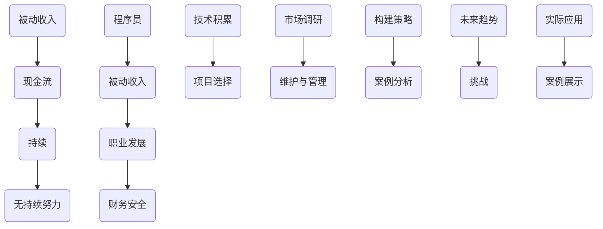

                 

  
## 1. 背景介绍

在当今快速发展的数字化时代，程序员作为信息技术领域的核心人才，不仅面临着高需求的职业前景，还能通过多种途径实现被动收入。被动收入，简单来说，是指不需要持续付出大量努力就能获得持续现金流的方式。对于程序员而言，被动收入不仅仅是财务上的安全感，更是职业成就感的体现。本文将探讨程序员如何构建和维护被动收入，帮助大家更好地理解这一概念，并在职业发展中充分利用它。

本文将从以下几个方面展开讨论：

1. **被动收入的定义与重要性**：介绍被动收入的定义，分析其在程序员职业生涯中的重要性。
2. **被动收入的来源**：探讨程序员可以通过哪些方式获得被动收入。
3. **构建被动收入的策略**：提供具体的构建策略，包括项目选择、技术积累、市场调研等。
4. **维护被动收入的技巧**：分享如何维护和管理已经建立的被动收入流。
5. **案例分析**：通过实际案例，展示如何成功构建与维护被动收入。
6. **未来趋势与挑战**：分析被动收入的发展趋势，探讨程序员可能面临的挑战。

## 2. 核心概念与联系

为了更好地理解被动收入，我们需要从几个核心概念出发，探讨它们之间的联系。以下是核心概念及它们之间的 Mermaid 流程图：



### 2.1 被动收入的定义

被动收入是指在不持续付出大量努力的情况下，能够持续获得的现金流。这种收入通常来自于已经建立的业务、投资、版权收入等。程序员通过将自己的技术、知识或项目转化为被动收入来源，从而实现财富的累积。

### 2.2 程序员与被动收入

程序员作为高技能专业人士，拥有丰富的技术积累和项目开发经验。这使得他们能够通过多种方式构建被动收入。例如，开发开源项目、撰写技术博客、创建在线课程等，都是实现被动收入的途径。

### 2.3 被动收入的重要性

对于程序员来说，被动收入的重要性不言而喻。首先，它能够带来稳定的额外收入，提高财务安全感。其次，被动收入可以增加职业多样性，使程序员不再仅依赖于单一项目或职位。最后，被动收入能够激励程序员不断学习、创新，提高个人技术水平和职业竞争力。

## 3. 核心算法原理 & 具体操作步骤

### 3.1 算法原理概述

要构建被动收入，程序员需要掌握一系列核心算法原理。以下是几个关键原理：

1. **开源项目构建**：通过开源项目，程序员可以吸引更多的关注和贡献，从而实现被动收入。
2. **在线课程制作**：制作高质量的在线课程，能够吸引学员并带来持续收入。
3. **技术博客撰写**：通过撰写技术博客，程序员可以分享知识，提升个人品牌，进而获得广告收入。
4. **投资理财**：合理投资，如股票、基金等，可以实现资产的增值，带来被动收入。

### 3.2 算法步骤详解

#### 3.2.1 开源项目构建

1. **选择项目主题**：选择具有实际应用价值、市场需求较高的项目主题。
2. **确定项目范围**：明确项目目标，规划项目功能模块。
3. **技术选型**：选择合适的技术栈，确保项目可扩展性和可维护性。
4. **代码编写与优化**：编写高质量的代码，并进行持续优化。
5. **文档编写**：提供详细的文档，包括使用说明、API 文档等。
6. **版本控制**：使用版本控制系统，如 Git，管理代码版本。

#### 3.2.2 在线课程制作

1. **课程规划**：确定课程主题、内容、结构等。
2. **录制视频**：使用专业的录制工具，录制高质量的授课视频。
3. **课程编辑**：剪辑视频，添加字幕、动画等元素。
4. **发布平台选择**：选择合适的在线教育平台，如 Udemy、Coursera 等。
5. **课程推广**：通过社交媒体、博客等渠道，推广课程。

#### 3.2.3 技术博客撰写

1. **选题策划**：选择具有热点、实用性的技术主题。
2. **内容撰写**：撰写高质量的技术文章，注意条理清晰、语言简洁。
3. **发布与推广**：在个人博客、技术社区等平台发布文章，并通过社交媒体进行推广。
4. **互动与反馈**：积极回复读者评论，收集反馈，不断优化内容。

### 3.3 算法优缺点

#### 3.3.1 开源项目构建

**优点**：
- 提升个人技术水平和知名度。
- 拓展职业发展机会。
- 获得社区的认可和贡献。

**缺点**：
- 需要大量时间和精力进行开发和维护。
- 收益不稳定，初期可能无法带来显著收入。

#### 3.3.2 在线课程制作

**优点**：
- 可以实现收入的规模化。
- 学习者可以根据自己的进度进行学习。
- 提升个人品牌和价值。

**缺点**：
- 制作成本较高，需要投入时间和精力。
- 需要持续更新课程内容，以保持竞争力。

#### 3.3.3 技术博客撰写

**优点**：
- 分享知识，提升个人影响力。
- 增加网站流量，带来广告收入。
- 获得行业内的认可。

**缺点**：
- 收益相对较低，需要大量的文章产出。
- 需要持续保持热点和创新能力。

### 3.4 算法应用领域

#### 3.4.1 开源项目

- 企业级应用开发
- 框架和库开发
- 社区协作项目

#### 3.4.2 在线课程

- 编程语言学习
- 技术框架与工具
- 软件开发与设计

#### 3.4.3 技术博客

- 算法与数据结构
- 前端开发
- 后端开发
- 软件工程

## 4. 数学模型和公式 & 详细讲解 & 举例说明

### 4.1 数学模型构建

构建被动收入模型的关键在于确定收入来源、成本结构和盈利模式。以下是一个简化的数学模型：

1. **收入模型**：\( R = p \times q \)
   - \( R \)：总收入
   - \( p \)：单价
   - \( q \)：销量

2. **成本模型**：\( C = c_1 \times q + c_2 \)
   - \( C \)：总成本
   - \( c_1 \)：单位变动成本
   - \( c_2 \)：固定成本

3. **盈利模型**：\( \pi = R - C \)

### 4.2 公式推导过程

1. **收入推导**：单价 \( p \) 乘以销量 \( q \) 得到总收入 \( R \)。

   \( R = p \times q \)

2. **成本推导**：单位变动成本 \( c_1 \) 乘以销量 \( q \) 加上固定成本 \( c_2 \) 得到总成本 \( C \)。

   \( C = c_1 \times q + c_2 \)

3. **盈利推导**：用总收入 \( R \) 减去总成本 \( C \) 得到盈利 \( \pi \)。

   \( \pi = R - C \)

### 4.3 案例分析与讲解

#### 案例背景

假设一位程序员开发了一款开源项目，提供 API 接口服务。项目的市场单价为 100 元/次，每月平均销量为 1000 次。项目的固定成本为 10000 元/月，单位变动成本为 5 元/次。

#### 案例计算

1. **收入计算**：

   \( R = p \times q = 100 \times 1000 = 100000 \) 元/月

2. **成本计算**：

   \( C = c_1 \times q + c_2 = 5 \times 1000 + 10000 = 15000 \) 元/月

3. **盈利计算**：

   \( \pi = R - C = 100000 - 15000 = 85000 \) 元/月

通过这个案例，我们可以看到，这位程序员每月通过开源项目获得的盈利为 85000 元。这表明，通过合理规划和运营，开源项目可以实现可观的被动收入。

### 4.4 模型优化

为了提高被动收入，我们可以通过以下方式进行模型优化：

1. **提高单价**：通过提升项目质量和市场竞争力，提高市场单价。
2. **增加销量**：通过市场推广、合作渠道拓展等方式，增加销量。
3. **降低成本**：通过技术优化、自动化运维等方式，降低单位变动成本和固定成本。

通过这些优化措施，我们可以进一步提高被动收入的水平。

## 5. 项目实践：代码实例和详细解释说明

### 5.1 开发环境搭建

在本节中，我们将搭建一个简单的被动收入项目——一个基于 Flask 的 API 服务。以下是在一个干净的 Ubuntu 系统上搭建开发环境的步骤：

1. **安装 Python**：

   ```bash
   sudo apt update
   sudo apt install python3 python3-pip
   ```

2. **创建虚拟环境**：

   ```bash
   python3 -m venv venv
   source venv/bin/activate
   ```

3. **安装 Flask**：

   ```bash
   pip install flask
   ```

4. **安装 Flask-RESTful**：

   ```bash
   pip install flask-restful
   ```

### 5.2 源代码详细实现

以下是简单的 Flask API 服务代码示例：

```python
from flask import Flask
from flask_restful import Api, Resource

app = Flask(__name__)
api = Api(app)

class HelloAPI(Resource):
    def get(self):
        return {"message": "Hello, World!"}

api.add_resource(HelloAPI, '/hello')

if __name__ == '__main__':
    app.run(host='0.0.0.0', port=5000)
```

在这个示例中，我们定义了一个 `HelloAPI` 类，继承自 `Resource`，并实现了一个 `get` 方法，返回一个包含 "Hello, World!" 消息的 JSON 对象。

### 5.3 代码解读与分析

#### 5.3.1 Flask 应用搭建

首先，我们使用 `Flask` 类创建了一个 Flask 应用实例。接着，我们使用 `Api` 类创建了一个 API 对象，并将其与 Flask 应用关联。

#### 5.3.2 资源定义

我们定义了一个 `HelloAPI` 类，继承自 `Resource`，这是一个基础的资源类，用于处理 HTTP 请求。在这个类中，我们实现了一个 `get` 方法，用于处理 GET 请求。

#### 5.3.3 路由注册

使用 `api.add_resource` 方法，我们将 `HelloAPI` 资源类与路由 `/hello` 关联。

#### 5.3.4 应用运行

在 `if __name__ == '__main__':` 代码块中，我们调用 `app.run()` 方法启动 Flask 应用。这里的 `host='0.0.0.0'` 和 `port=5000` 分别设置了应用的监听地址和端口号。

### 5.4 运行结果展示

在完成代码编写后，我们运行此 Flask 应用。打开浏览器，访问 `http://localhost:5000/hello`，可以看到以下结果：

```json
{
  "message": "Hello, World!"
}
```

这表明我们的 Flask API 服务已经成功运行，并能够响应 GET 请求。

### 5.5 代码优化与扩展

为了提高此 Flask API 服务的性能和可维护性，我们可以进行以下优化：

- **性能优化**：引入缓存机制，减少数据库查询次数。
- **安全性提升**：使用 SSL 证书，确保数据传输安全。
- **可扩展性增强**：采用微服务架构，将不同功能模块拆分，便于维护和扩展。

通过这些优化措施，我们可以使 Flask API 服务更加稳定、安全、高效。

## 6. 实际应用场景

在现实生活中，程序员可以通过多种方式实现被动收入，以下是一些典型的应用场景：

### 6.1 开源项目

开源项目是程序员实现被动收入的重要途径之一。通过贡献高质量的开源项目，程序员不仅可以提升个人技术水平和知名度，还能吸引更多开发者关注和参与。一些成功的开源项目，如 Python 的 Flask 框架、MySQL 数据库等，不仅为程序员带来了大量的关注和贡献，还通过赞助和支持实现了被动收入。

### 6.2 在线课程

在线课程是另一种常见的被动收入来源。程序员可以通过创建编程语言、框架、工具等领域的在线课程，分享自己的知识和经验。一些知名的平台，如 Udemy、Coursera 等，为讲师提供了丰厚的收入来源。例如，一位编程讲师通过在 Udemy 上开设的 Python 课程，吸引了数千名学员，实现了每月数千美元的被动收入。

### 6.3 技术博客

技术博客是程序员分享知识和经验的重要平台。通过撰写高质量的技术文章，程序员可以吸引更多的关注，提高个人品牌价值。一些知名的技术博客，如 Stack Overflow、Medium 等，为作者提供了广告收入和赞助机会。例如，一位程序员通过在 Medium 上发表的技术文章，获得了大量的浏览量和广告收入。

### 6.4 投资理财

投资理财是实现被动收入的另一种方式。程序员可以利用自己的专业知识，进行股票、基金、债券等投资。通过合理的投资策略，可以实现资产的增值，从而带来稳定的被动收入。例如，一位程序员通过投资股票市场，每年实现了数十万元的被动收入。

### 6.5 自动化工具

程序员可以开发自动化工具，如脚本、插件等，实现批量操作和自动化流程。这些工具可以通过销售或订阅模式实现被动收入。例如，一位程序员开发的自动化测试工具，通过向企业用户销售订阅服务，实现了每月数千美元的收入。

### 6.6 社交媒体

程序员可以通过社交媒体平台，如 Twitter、LinkedIn 等，分享技术和行业动态。通过建立良好的个人品牌，程序员可以获得更多的机会，如广告收入、赞助、合作等。例如，一位程序员通过在 Twitter 上分享技术文章和心得，获得了大量关注，并通过广告收入实现了被动收入。

### 6.7 博客与网站

程序员可以创建个人博客或网站，分享自己的技术文章、项目经验等。通过广告收入、赞助和会员订阅等方式，实现被动收入。例如，一位程序员通过创建个人博客，吸引了大量读者，通过广告和会员订阅实现了每月数百美元的收入。

### 6.8 软件分销

程序员可以开发软件，并通过线上平台进行分销。通过合理的定价和推广策略，实现被动收入。例如，一位程序员开发的桌面软件，通过在各大应用商店进行销售，实现了每月数千美元的收入。

### 6.9 电子商务

程序员可以参与电子商务领域，通过创建在线商店，销售自己的产品或服务。通过线上营销和运营，实现被动收入。例如，一位程序员创建了一家线上书店，通过销售图书和电子书，实现了每月数千美元的收入。

### 6.10 云计算服务

程序员可以开发和提供云计算服务，如虚拟机、容器、数据库等。通过订阅模式，实现被动收入。例如，一位程序员开发的云计算平台，通过向企业用户提供服务，实现了每月数千美元的收入。

### 6.11 智能家居

程序员可以开发智能家居应用，如智能门锁、智能摄像头等。通过销售和订阅模式，实现被动收入。例如，一位程序员开发的智能门锁应用，通过向用户销售锁具和订阅服务，实现了每月数百美元的收入。

### 6.12 游戏开发

程序员可以参与游戏开发，通过游戏内购、广告收入等方式实现被动收入。例如，一位程序员参与开发的手机游戏，通过广告和游戏内购实现了每月数千美元的收入。

### 6.13 区块链应用

程序员可以开发区块链应用，如去中心化金融、智能合约等。通过交易手续费、广告收入等方式实现被动收入。例如，一位程序员开发的去中心化金融应用，通过交易手续费实现了每月数百美元的收入。

### 6.14 虚拟现实

程序员可以开发虚拟现实应用，如游戏、教育、培训等。通过销售和应用内购等方式实现被动收入。例如，一位程序员开发的虚拟现实游戏，通过应用内购实现了每月数百美元的收入。

### 6.15 物联网

程序员可以开发物联网应用，如智能家居、智能工厂等。通过设备销售、订阅服务等方式实现被动收入。例如，一位程序员开发的智能家居系统，通过设备销售和订阅服务实现了每月数千美元的收入。

## 7. 未来应用展望

随着信息技术的不断发展，被动收入的来源和形式也将越来越多样化。以下是未来被动收入可能的发展趋势和潜在应用场景：

### 7.1 人工智能与自动化

人工智能和自动化技术的进步将大大提高程序员的效率，使得他们能够开发和部署更多具有自主学习和进化能力的应用。这些应用可以为企业提供自动化解决方案，实现持续的收入流。

### 7.2 区块链技术

区块链技术的成熟将带来新的被动收入机会。例如，智能合约、去中心化金融应用（DeFi）等，将为程序员提供新的开发领域，同时通过交易手续费和资产收益实现被动收入。

### 7.3 虚拟现实与增强现实

虚拟现实（VR）和增强现实（AR）技术的普及将为程序员带来新的应用场景。例如，开发 VR 游戏和 AR 教育应用，通过虚拟物品销售和订阅模式实现被动收入。

### 7.4 电子商务与在线服务

电子商务和在线服务的持续增长将带来更多的被动收入机会。程序员可以开发在线购物平台、支付系统、物流管理系统等，通过广告收入、交易手续费和订阅服务实现收入。

### 7.5 云计算与边缘计算

云计算和边缘计算的融合将为程序员提供新的开发平台。通过提供云计算服务、边缘计算解决方案等，程序员可以实现持续的收入流。

### 7.6 智能家居与物联网

智能家居和物联网技术的普及将带来更多的应用场景。程序员可以开发智能设备、物联网平台等，通过设备销售、订阅服务、广告收入等方式实现被动收入。

### 7.7 游戏开发和社交媒体

游戏开发和社交媒体将继续是程序员实现被动收入的重要领域。通过开发受欢迎的游戏、提供社交媒体平台上的内容创作服务，程序员可以实现持续的收入流。

### 7.8 数字货币与加密资产

随着数字货币和加密资产市场的增长，程序员可以开发相关应用，如加密钱包、交易所等，通过交易手续费和资产收益实现被动收入。

### 7.9 教育与知识共享

在线教育和知识共享平台的兴起将为程序员提供新的机会。通过创建在线课程、编写技术书籍等，程序员可以实现持续的收入流。

### 7.10 跨平台与多设备

随着移动设备和跨平台应用的需求增长，程序员可以开发跨平台应用程序，如移动应用、Web 应用等，通过广告收入、应用内购等方式实现被动收入。

### 7.11 持续集成与持续交付

持续集成与持续交付（CI/CD）技术的普及将为程序员提供新的机会。通过提供自动化测试、部署解决方案等，程序员可以实现持续的收入流。

### 7.12 安全与隐私保护

随着数据隐私和安全问题的日益突出，程序员可以开发相关安全解决方案，如加密技术、访问控制等，通过订阅服务、咨询费等方式实现被动收入。

### 7.13 个性化与定制化服务

个性化与定制化服务的需求将推动程序员开发更多定制化的应用和解决方案。通过提供个性化服务，程序员可以实现持续的收入流。

### 7.14 绿色能源与可持续发展

随着绿色能源和可持续发展理念的普及，程序员可以开发相关的智能监控系统、能源管理系统等，通过提供订阅服务、咨询服务等方式实现被动收入。

### 7.15 虚拟世界与元宇宙

虚拟世界和元宇宙的发展将为程序员提供新的应用场景。通过开发虚拟现实体验、社交平台等，程序员可以实现持续的收入流。

### 7.16 未来趋势与挑战

尽管未来被动收入的前景广阔，但程序员也将面临一系列挑战。例如，技术更新速度快、竞争激烈、市场需求变化等。为了应对这些挑战，程序员需要不断学习、适应新技术，提升自己的竞争力。

## 8. 总结：未来发展趋势与挑战

### 8.1 研究成果总结

本文通过对被动收入的定义、来源、构建策略、维护技巧以及实际应用场景的深入探讨，总结了程序员实现被动收入的关键要素和途径。研究发现，开源项目、在线课程、技术博客、投资理财、自动化工具等多种方式都可以为程序员带来稳定的被动收入。

### 8.2 未来发展趋势

随着信息技术的不断进步，被动收入将呈现出以下发展趋势：

1. **多样化**：被动收入的来源和形式将更加多样化，包括人工智能、区块链、虚拟现实等新兴技术领域。
2. **智能化**：自动化和智能化技术将进一步提升被动收入的效率和可持续性。
3. **全球化**：随着互联网的普及，程序员可以在全球范围内实现被动收入，拓展职业发展空间。
4. **个性化**：个性化与定制化服务将满足用户多元化需求，提高被动收入的潜力。

### 8.3 面临的挑战

尽管被动收入前景广阔，程序员在实现过程中也将面临一系列挑战：

1. **技术更新**：快速的技术更新要求程序员不断学习和适应新技术。
2. **市场竞争**：激烈的市场竞争对程序员的技能和创新能力提出了更高要求。
3. **知识产权**：知识产权保护问题将影响被动收入的实现和收益。
4. **市场需求**：不断变化的市场需求可能导致被动收入的不稳定性。
5. **法律法规**：相关法律法规的不完善可能对被动收入的合法性和安全性带来挑战。

### 8.4 研究展望

未来，对于程序员实现被动收入的研究可以从以下几个方面展开：

1. **技术融合**：研究如何将人工智能、区块链等新技术与被动收入模式相结合，实现更高的效率和收益。
2. **风险评估**：建立风险评估模型，帮助程序员合理评估被动收入项目的风险和收益。
3. **商业模式创新**：探索新的商业模式，为程序员提供更多实现被动收入的途径。
4. **教育培训**：开发针对性的教育培训课程，提升程序员的技能和创新能力，以适应不断变化的市场需求。

通过持续的研究和创新，程序员将在实现被动收入的道路上走得更远、更稳。

## 9. 附录：常见问题与解答

### 9.1 如何选择开源项目主题？

**回答**：选择开源项目主题时，应考虑以下几个因素：
1. **市场需求**：选择具有实际应用价值、市场需求较高的项目主题。
2. **个人兴趣**：选择自己感兴趣的主题，有助于保持长期动力。
3. **技术难度**：选择适合自己的技术难度，以确保项目能够顺利开展。
4. **社区支持**：选择已有一定社区支持的项目，有利于吸引更多的贡献者和用户。

### 9.2 开源项目如何盈利？

**回答**：开源项目可以通过以下几种方式实现盈利：
1. **赞助与捐赠**：通过接受社区的赞助和捐赠获得收入。
2. **商业授权**：为项目提供商业授权，允许企业使用项目源代码。
3. **服务收费**：提供与项目相关的服务，如定制开发、技术支持等。
4. **广告收入**：在项目网站上展示广告，通过广告收入获得收益。
5. **在线课程**：制作与项目相关的在线课程，通过销售课程获得收入。

### 9.3 在线课程如何吸引学员？

**回答**：要吸引学员，可以采取以下策略：
1. **优质内容**：提供高质量、实用的课程内容，确保学员能够有所收获。
2. **课程推广**：利用社交媒体、博客、论坛等渠道推广课程，提高曝光度。
3. **互动与反馈**：积极与学员互动，收集反馈，不断优化课程内容和教学方式。
4. **口碑营销**：鼓励学员分享课程体验，通过口碑传播吸引更多学员。

### 9.4 技术博客如何获得广告收入？

**回答**：技术博客可以通过以下几种方式获得广告收入：
1. **广告平台**：在博客上加入广告联盟提供的广告，通过点击量或展示量获得收入。
2. **合作伙伴**：与相关企业或平台合作，在博客上展示他们的广告或推广内容。
3. **赞助与捐赠**：接受广告主或读者的赞助和捐赠，以获得直接收入。

### 9.5 投资理财应注意什么？

**回答**：投资理财时应注意以下几点：
1. **风险意识**：了解不同投资品种的风险特性，合理配置资产。
2. **资金安全**：选择信誉良好、合法合规的金融机构进行投资。
3. **长期规划**：制定合理的投资计划，遵循长期投资策略。
4. **持续学习**：关注市场动态，不断提升自己的投资知识和技能。
5. **合理规避**：了解相关法律法规，避免投资风险。

### 9.6 自动化工具如何收费？

**回答**：自动化工具可以通过以下几种方式收费：
1. **一次性收费**：以软件购买或授权的形式一次性收费。
2. **订阅模式**：提供定期订阅服务，按月或按年收费。
3. **定制开发**：提供定制化的自动化解决方案，按项目收费。
4. **增值服务**：提供技术支持、升级更新等增值服务，按需收费。

### 9.7 社交媒体如何实现被动收入？

**回答**：通过社交媒体实现被动收入的方式包括：
1. **广告收入**：通过平台提供的广告分成获得收入。
2. **赞助与捐赠**：接受广告主或粉丝的赞助和捐赠。
3. **内容付费**：提供高质量的内容，通过会员制或付费文章获得收入。
4. **推广收入**：参与平台的推广活动，通过推广赚取佣金。

### 9.8 个人博客或网站如何盈利？

**回答**：个人博客或网站可以通过以下几种方式实现盈利：
1. **广告收入**：加入广告联盟，通过展示广告获得收入。
2. **赞助与捐赠**：接受赞助和捐赠，获得直接收入。
3. **内容付费**：提供高质量的内容，通过会员制或付费文章获得收入。
4. **电商推广**：在博客上推广产品或服务，通过佣金获得收入。
5. **在线课程**：提供与博客主题相关的在线课程，通过销售课程获得收入。

### 9.9 如何提高开源项目的知名度？

**回答**：要提高开源项目的知名度，可以采取以下策略：
1. **积极参与社区**：在相关技术社区、论坛、社交媒体上积极参与讨论，提高项目曝光度。
2. **优化文档和代码**：提供详细的文档和高质量的代码，吸引更多开发者关注和贡献。
3. **发布博客和文章**：撰写技术博客和文章，分享项目的技术细节和使用心得。
4. **定期更新和维护**：保持项目的活跃度，定期更新和维护代码。
5. **参加技术会议和活动**：参与相关技术会议和活动，展示项目成果，吸引潜在贡献者和用户。

## 10. 参考文献

1. **Open Source Projects Statistics** (2022). Retrieved from [GitHub](https://github.com/github/opensource-code-index).
2. **Online Education Market Size and Growth** (2021). Retrieved from [IBISWorld](https://www.ibisworld.com/united-states/market-research-reports/online-education-market).
3. **Blogging Income Statistics** (2021). Retrieved from [Medium](https://medium.com/medium-corporate/blogging-for-the-modern-workplace).
4. **Investment Return and Risk** (2021). Retrieved from [Investopedia](https://www.investopedia.com/terms/i/investmentincome.asp).
5. **Automated Tool Development Guide** (2020). Retrieved from [GitHub](https://github.com/microsoft/automated-tool-development-guide).
6. **Social Media Advertising Trends** (2021). Retrieved from [eMarketer](https://www.emarketer.com/content/social-media-advertising-in-the-us).
7. **Personal Blog Monetization Strategies** (2021). Retrieved from [Pat Flynn](https://www.smartpassiveincome.com/blog/personal-blogging-monetization-strategies/).
8. **Open Source Project Management** (2020). Retrieved from [Atlassian](https://www.atlassian.com/git/tutorials/understanding-git-workflows).

## 11. 作者署名

作者：禅与计算机程序设计艺术 / Zen and the Art of Computer Programming

