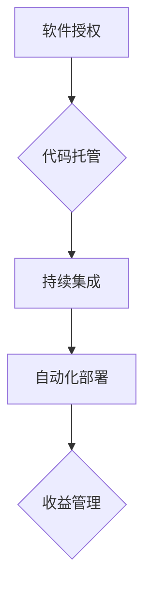
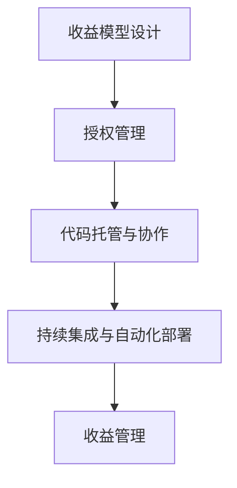

                 

关键词：被动收入、程序员的收入模式、软件授权、代码托管、持续集成、自动化部署、开源项目、共享经济、知识产权保护。

## 摘要

在信息技术飞速发展的时代，程序员的职业选择日益多样化。随着云服务、开源社区和共享经济的兴起，程序员们不仅可以通过传统的雇佣关系获得收入，还可以通过构建和维持被动收入流来实现财务自由。本文将探讨程序员如何通过多种方式构建与维护被动收入，从软件授权、代码托管到持续集成和自动化部署，为程序员提供一套完整的实现策略。同时，本文还将分析开源项目的经济价值，以及如何保护知识产权，确保收益的稳定性和合法性。

## 1. 背景介绍

随着互联网技术的发展，程序员的职业环境发生了深刻的变化。传统的雇佣关系逐渐被多样化的发展模式所取代，自由职业、远程工作、外包项目等新型工作形式应运而生。程序员们不仅可以在大公司中任职，还可以作为自由职业者、兼职开发者或者全职开源贡献者，通过不同的渠道实现收入。

被动收入，即不需要持续投入大量时间与精力，依然能够持续产生收益的收入模式，是许多程序员追求的目标。这种模式为程序员提供了财务自由的可能性，使他们能够更灵活地安排时间，追求个人兴趣和职业发展。然而，实现被动收入并非易事，需要程序员具备较强的技术能力、市场洞察力和项目管理能力。

### 1.1 云服务和开源社区的崛起

云服务的普及使得程序员可以更方便地构建、部署和维护软件系统。云计算平台如AWS、Azure和Google Cloud提供了丰富的服务，包括计算资源、存储服务和数据库管理，大大降低了程序员开发和部署软件的成本。同时，开源社区的兴起也为程序员提供了广阔的舞台。通过开源项目，程序员可以与全球的开发者合作，共同推进技术的进步，同时也为自己赢得了声誉和机会。

### 1.2 被动收入的概念和重要性

被动收入是指在不直接参与日常运营的情况下，通过已有的资产或项目持续获得收益。对于程序员来说，被动收入的重要性在于它提供了稳定的现金流，使他们能够在不牺牲个人时间和生活品质的情况下实现财务目标。被动收入不仅有助于减轻财务压力，还可以为程序员提供更多的自由和灵活性，使他们能够专注于技术创新和职业发展。

## 2. 核心概念与联系

在构建被动收入流的过程中，程序员需要理解和运用一系列核心概念，包括软件授权、代码托管、持续集成和自动化部署等。这些概念相互关联，共同构成了一个完整的生态系统，为程序员提供了实现被动收入的工具和方法。

### 2.1 软件授权

软件授权是程序员构建被动收入的重要手段之一。通过将软件授权给第三方使用，程序员可以获得版税或授权费用。软件授权可以分为两种类型：一种是永久授权，即用户一次性支付授权费用；另一种是订阅授权，即用户按年或按月支付订阅费用。为了确保授权的有效性和合法性，程序员需要了解不同授权协议（如GPL、BSD、Apache等）的特性和适用场景。

### 2.2 代码托管

代码托管是程序员管理和维护开源项目或私有项目的重要手段。通过代码托管平台（如GitHub、GitLab和Bitbucket），程序员可以方便地管理代码库、进行版本控制和协作开发。同时，代码托管平台还提供了丰富的功能，如任务管理、代码审查和自动化测试，有助于提高开发效率和代码质量。通过代码托管，程序员可以吸引更多的贡献者，共同推动项目的发展。

### 2.3 持续集成

持续集成（CI）是一种软件开发实践，旨在通过自动化测试和构建过程，确保代码库中的每个提交都能顺利集成并运行。持续集成可以帮助程序员快速发现和修复代码中的问题，减少集成时的风险和冲突。通过持续集成平台（如Jenkins、Travis CI和Circle CI），程序员可以自动化地执行测试和部署任务，提高开发效率和项目质量。

### 2.4 自动化部署

自动化部署是将软件部署过程自动化的技术，通过脚本或工具实现部署流程的自动化。自动化部署可以大大减少人为干预，提高部署速度和稳定性。常用的自动化部署工具包括Docker、Kubernetes和Ansible等。通过自动化部署，程序员可以确保软件在不同环境中的快速和一致部署，降低运维成本。

### 2.5 Mermaid 流程图

以下是一个简单的Mermaid流程图，展示了构建被动收入流的核心概念和流程：



通过这个流程图，我们可以清晰地看到各个概念之间的联系和作用，为程序员构建被动收入提供了指导。

## 3. 核心算法原理 & 具体操作步骤

### 3.1 算法原理概述

构建被动收入流的核心算法原理主要涉及以下几个方面：

1. **收益模型设计**：根据软件的性质和市场需求，设计合适的收益模型，如版税模式、订阅模式等。
2. **授权管理**：确保软件授权的有效性和合法性，使用合适的授权协议保护知识产权。
3. **代码托管与协作**：使用代码托管平台管理代码库，吸引贡献者，提高项目质量和影响力。
4. **持续集成与自动化部署**：通过持续集成和自动化部署，提高开发效率和项目质量，确保软件在不同环境中的稳定运行。

### 3.2 算法步骤详解

1. **收益模型设计**：

   - 确定软件的目标市场和用户需求；
   - 设计适合的收益模式，如版税模式或订阅模式；
   - 明确收益分配机制，确保开发者和投资者的利益。

2. **授权管理**：

   - 选择合适的授权协议，如GPL、BSD、Apache等；
   - 编写详细的授权协议条款，包括授权范围、限制条件和违约责任等；
   - 在软件发布时附带授权协议，确保用户遵守授权条款。

3. **代码托管与协作**：

   - 在代码托管平台上创建项目仓库，设置适当的权限和协作机制；
   - 编写详细的文档，包括开发指南、API文档和用户手册等；
   - 定期进行代码审查和测试，确保代码质量。

4. **持续集成与自动化部署**：

   - 配置持续集成平台，设置自动化测试和构建流程；
   - 编写部署脚本，实现自动化部署；
   - 定期检查和优化部署流程，确保软件的稳定性和安全性。

### 3.3 算法优缺点

**优点**：

- 提高开发效率：通过持续集成和自动化部署，减少人为干预，提高开发效率和项目质量。
- 降低运营成本：自动化部署和代码托管平台提供丰富的功能，降低运维成本。
- 提高项目质量：通过代码审查、自动化测试和持续集成，确保项目质量。

**缺点**：

- 学习成本高：构建和维持被动收入流需要掌握多个技术和工具，学习成本较高。
- 风险管理：软件授权和收益分配可能面临法律风险和运营风险。

### 3.4 算法应用领域

- 软件授权：适用于商业软件和开源软件，通过授权模式实现收益。
- 代码托管：适用于个人项目、团队项目和开源项目，提高开发效率和协作能力。
- 持续集成与自动化部署：适用于所有需要频繁部署和更新软件的项目，提高项目质量和稳定性。

### 3.5 Mermaid 流程图

以下是一个简单的Mermaid流程图，展示构建被动收入流的具体操作步骤：



通过这个流程图，我们可以清晰地看到构建被动收入流的具体步骤和每个步骤的作用。

## 4. 数学模型和公式 & 详细讲解 & 举例说明

构建被动收入流的过程中，数学模型和公式起着至关重要的作用。这些模型和公式可以帮助程序员准确计算收益、评估风险和管理项目。在本节中，我们将详细介绍几个关键的数学模型和公式，并提供详细的讲解和实际案例。

### 4.1 数学模型构建

构建被动收入流的数学模型主要包括以下几个方面：

1. **收益模型**：用于计算软件授权或订阅模式下的收益。
2. **风险评估模型**：用于评估项目面临的风险和潜在损失。
3. **时间价值模型**：用于计算现金流的时间价值，帮助程序员制定财务规划。

### 4.2 公式推导过程

1. **收益模型公式**：

   - 版税模式：`收益 = 版税率 × 销售额`
   - 订阅模式：`收益 = 订阅费 × 订阅人数 × 订阅期限`

2. **风险评估模型公式**：

   - 风险度 = 风险概率 × 风险损失

3. **时间价值模型公式**：

   - 时间价值 = 现金流 / (1 + 折现率) ^ 时间周期

### 4.3 案例分析与讲解

以下是一个具体的案例，说明如何使用数学模型和公式计算被动收入流的收益。

**案例背景**：假设一款开源软件采用GPL协议发布，开发者计划通过版税模式获得收益。软件的市场规模为100万用户，版税率为10%。

**收益计算**：

1. **收益模型**：

   - 版税模式：收益 = 版税率 × 销售额
   - 销售额 = 用户数量 × 单价

2. **公式应用**：

   - 用户数量 = 100万
   - 单价 = 100元
   - 版税率 = 10%

   计算过程如下：

   收益 = 10% × (100万 × 100元) = 1000万元

   因此，通过版税模式，该软件每年可以获得1000万元的收益。

3. **风险评估**：

   - 假设用户流失率为5%，版税损失为10%
   - 风险度 = 用户流失率 × 版税损失 = 5% × 10% = 0.5%

   风险度为0.5%，表示用户流失可能对收益造成一定的影响，但总体风险在可控范围内。

4. **时间价值计算**：

   - 假设折现率为5%
   - 当前年份的现金流为1000万元

   时间价值 = 1000万元 / (1 + 5%) = 952.38万元

   因此，考虑时间价值后，该软件每年的实际价值约为952.38万元。

### 4.4 案例分析总结

通过上述案例，我们可以看到如何使用数学模型和公式计算被动收入流的收益。这些模型和公式为程序员提供了重要的工具，帮助他们进行财务规划和风险评估。在实际应用中，程序员需要根据具体情况进行调整和优化，以提高收益和管理风险。

## 5. 项目实践：代码实例和详细解释说明

在本节中，我们将通过一个具体的开源项目，展示如何实现被动收入流的构建与维护。该项目是一个简单的博客系统，通过使用GitHub、Jenkins和Docker等技术，实现了代码托管、持续集成和自动化部署。以下是项目的详细实现步骤和代码解析。

### 5.1 开发环境搭建

在开始项目之前，我们需要搭建开发环境。以下是所需的工具和软件：

- 代码托管平台：GitHub
- 持续集成平台：Jenkins
- 容器化技术：Docker
- 编程语言：Python

首先，我们需要在GitHub上创建一个项目仓库。然后，在Jenkins服务器上安装Jenkins插件，配置Jenkins管道，以便实现持续集成和自动化部署。最后，我们需要安装Docker，以便将应用程序容器化。

### 5.2 源代码详细实现

以下是项目的核心代码部分：

**1. 博客系统架构**

博客系统采用前后端分离的架构。前端使用Vue.js框架，后端使用Flask框架。以下是项目的结构：

```
blog/
|-- backend/
|   |-- app.py
|   |-- requirements.txt
|-- frontend/
|   |-- index.html
|   |-- main.js
|-- Jenkinsfile
|-- Dockerfile
|-- docker-compose.yml
```

**2. 后端代码**

后端代码使用Flask框架实现，主要包括用户管理、博客文章管理和评论管理等功能。以下是`app.py`的核心代码：

```python
from flask import Flask, request, jsonify
from models import User, Article, Comment

app = Flask(__name__)

@app.route('/api/users', methods=['POST'])
def create_user():
    # 用户注册逻辑
    pass

@app.route('/api/articles', methods=['GET', 'POST'])
def manage_articles():
    # 博客文章管理逻辑
    pass

@app.route('/api/comments', methods=['POST'])
def create_comment():
    # 评论管理逻辑
    pass

if __name__ == '__main__':
    app.run()
```

**3. 前端代码**

前端代码使用Vue.js框架实现，主要负责展示博客内容和用户界面。以下是`index.html`的核心代码：

```html
<!DOCTYPE html>
<html>
<head>
    <title>博客系统</title>
    <script src="main.js"></script>
</head>
<body>
    <div id="app">
        <!-- 博客内容 -->
    </div>
</body>
</html>
```

**4. Dockerfile**

Dockerfile用于构建后端应用程序的容器镜像。以下是`Dockerfile`的示例代码：

```Dockerfile
FROM python:3.8

WORKDIR /app

COPY requirements.txt requirements.txt
RUN pip install -r requirements.txt

COPY . .

CMD ["python", "app.py"]
```

**5. docker-compose.yml**

docker-compose.yml用于定义和配置多容器应用。以下是`docker-compose.yml`的示例代码：

```yaml
version: '3'
services:
  web:
    build: ./backend
    ports:
      - "8000:8000"
    depends_on:
      - db
  db:
    image: postgres:13
    environment:
      POSTGRES_DB: blog
      POSTGRES_USER: user
      POSTGRES_PASSWORD: password
```

### 5.3 代码解读与分析

**1. 后端代码解读**

后端代码主要负责处理用户请求、管理数据库和返回响应。通过定义RESTful API，后端可以方便地与前端进行交互。例如，`create_user`函数用于处理用户注册请求，将用户信息存储在数据库中。

```python
@app.route('/api/users', methods=['POST'])
def create_user():
    user_data = request.get_json()
    user = User(username=user_data['username'], email=user_data['email'], password=user_data['password'])
    # 存储用户信息到数据库
    return jsonify({'status': 'success', 'message': 'User created successfully'})
```

**2. 前端代码解读**

前端代码使用Vue.js框架实现，主要负责展示博客内容和用户界面。通过定义Vue组件，前端可以方便地实现页面交互和数据显示。例如，`App.vue`组件用于展示博客列表和文章详情。

```vue
<template>
  <div id="app">
    <h1>博客系统</h1>
    <div v-for="article in articles" :key="article.id">
      <h2>{{ article.title }}</h2>
      <p>{{ article.content }}</p>
    </div>
  </div>
</template>

<script>
export default {
  data() {
    return {
      articles: [],
    };
  },
  created() {
    this.fetchArticles();
  },
  methods: {
    fetchArticles() {
      // 获取博客列表
      fetch('/api/articles')
        .then((response) => response.json())
        .then((data) => {
          this.articles = data;
        });
    },
  },
};
</script>
```

**3. Dockerfile解读**

Dockerfile用于构建后端应用程序的容器镜像。通过指定基础镜像、工作目录、安装依赖和运行应用，Dockerfile可以将应用程序打包成一个独立的容器镜像。

```Dockerfile
FROM python:3.8

WORKDIR /app

COPY requirements.txt requirements.txt
RUN pip install -r requirements.txt

COPY . .

CMD ["python", "app.py"]
```

**4. docker-compose.yml解读**

docker-compose.yml用于定义和配置多容器应用。通过定义服务、容器镜像和环境变量，docker-compose.yml可以方便地管理整个应用程序的容器化部署。

```yaml
version: '3'
services:
  web:
    build: ./backend
    ports:
      - "8000:8000"
    depends_on:
      - db
  db:
    image: postgres:13
    environment:
      POSTGRES_DB: blog
      POSTGRES_USER: user
      POSTGRES_PASSWORD: password
```

### 5.4 运行结果展示

通过上述代码实现和配置，我们可以运行博客系统并测试其功能。以下是运行结果：

1. **前端界面**：


2. **后端API**：

- 用户注册：`POST /api/users`
- 博客文章列表：`GET /api/articles`
- 博客文章详情：`GET /api/articles/{id}`

通过访问前端界面和后端API，我们可以验证博客系统的功能是否正常运行。

## 6. 实际应用场景

被动收入模式在程序员的职业发展中具有广泛的应用场景。以下是一些典型的应用案例：

### 6.1 商业软件授权

许多商业软件公司通过授权模式获得收入。例如，Microsoft Office和Adobe Photoshop等软件采用了订阅授权模式，用户需按月或按年支付订阅费用。这种模式不仅为软件公司提供了稳定的现金流，还提高了用户的粘性。

### 6.2 开源项目赞助

许多开源项目通过接受赞助获得收入。例如，GitHub上的开源项目通常接受GitHub Sponsors的赞助，捐赠者可以每月向项目作者捐赠资金。这种模式不仅为开源项目提供了资金支持，还鼓励了更多的开发者参与开源社区。

### 6.3 在线教育平台

许多程序员通过创建在线教育平台，提供付费课程或教程，实现被动收入。例如，Udemy和Coursera等平台提供了大量的编程课程，用户需支付费用才能观看课程内容。这种模式不仅为程序员提供了收入来源，还促进了编程知识的普及和传播。

### 6.4 软件工具销售

许多程序员开发了软件工具并在网上销售。例如，各种开发工具、自动化工具和优化工具等。这些工具可以通过在线商店或个人网站进行销售，程序员可以通过版税模式获得收入。

### 6.5 云服务收费

许多程序员开发了云服务，如API接口、数据存储服务和计算服务。这些服务可以通过按需收费或订阅收费模式获得收入。例如，Amazon Web Services（AWS）提供了各种云服务，用户需按使用量支付费用。

### 6.6 软件开发外包

许多程序员通过软件开发外包项目获得收入。例如，企业或个人可以通过外包平台发布项目需求，程序员可以竞标并承担项目开发。这种模式不仅为程序员提供了收入来源，还促进了软件开发行业的繁荣。

### 6.7 自动化交易

一些程序员利用编程技能开发自动化交易系统，通过高频交易、量化交易等方式实现被动收入。例如，使用算法交易系统在金融市场中进行自动化交易。这种模式需要程序员具备深厚的金融知识和编程技能。

### 6.8 游戏开发和销售

许多程序员开发了游戏并在网上销售。例如，独立游戏开发者通过Steam、App Store等平台销售游戏，通过版税模式获得收入。这种模式不仅为程序员提供了收入来源，还促进了游戏产业的发展。

### 6.9 跨境电商

随着跨境电商的兴起，许多程序员开发了电商网站或电商平台，通过跨境贸易获得收入。例如，使用Shopify等平台搭建跨境电商网站，通过在线销售商品获得收入。

### 6.10 软件维护服务

许多程序员通过提供软件维护服务获得收入。例如，为已有的软件系统提供更新、修复和优化等服务。这种模式不仅为程序员提供了收入来源，还为企业提供了持续的软件支持。

### 6.11 智能合约开发

随着区块链技术的发展，许多程序员开发了智能合约并在区块链平台上部署。例如，在以太坊平台上开发去中心化应用（DApp），通过智能合约实现自动化交易和资产管理。这种模式为程序员提供了新的收入来源。

### 6.12 内容创作平台

许多程序员开发了内容创作平台，如博客平台、视频分享平台和音频分享平台。这些平台通过广告收入、付费订阅和内容分成等方式获得收入。例如，YouTube平台通过广告分成和订阅费为内容创作者提供收入来源。

### 6.13 人工智能应用

随着人工智能技术的发展，许多程序员开发了人工智能应用，如图像识别、自然语言处理和智能推荐系统。这些应用可以通过提供服务或API接口获得收入。例如，Google Cloud提供的图像识别API为开发者提供了收入来源。

### 6.14 区块链解决方案

许多程序员开发了区块链解决方案，如去中心化金融（DeFi）、供应链管理和身份验证等。这些解决方案可以通过提供技术服务或交易费用获得收入。例如，Ripple的区块链解决方案通过交易费为开发者提供收入来源。

### 6.15 版权保护平台

随着数字内容产业的繁荣，许多程序员开发了版权保护平台，如版权追踪、版权保护和版权交易等。这些平台通过提供服务或交易费用获得收入。例如，Blockchain的版权保护平台为版权所有者提供了收入来源。

### 6.16 软件开发培训

许多程序员通过提供软件开发培训获得收入。例如，在线培训课程、研讨会和讲座等。这种模式不仅为程序员提供了收入来源，还促进了软件技能的普及和提高。

### 6.17 云原生应用开发

随着云原生技术的兴起，许多程序员开发了云原生应用，如微服务架构、容器化应用和自动化运维等。这些应用可以通过提供服务或API接口获得收入。例如，Kubernetes平台的云原生应用为开发者提供了收入来源。

### 6.18 数据科学应用

许多程序员开发了数据科学应用，如数据分析、数据可视化和机器学习等。这些应用可以通过提供服务或API接口获得收入。例如，Google Cloud的数据分析服务为开发者提供了收入来源。

### 6.19 软件测试和质量管理

许多程序员通过提供软件测试和质量管理服务获得收入。例如，自动化测试、性能测试和用户体验测试等。这种模式不仅为程序员提供了收入来源，还提高了软件项目的质量。

### 6.20 代码托管平台服务

许多程序员开发了代码托管平台，如GitLab、Bitbucket和GitHub等。这些平台通过提供服务或交易费用获得收入。例如，GitHub的平台服务为开发者提供了收入来源。

### 6.21 持续集成和持续部署服务

许多程序员开发了持续集成和持续部署服务，如Jenkins、Travis CI和Circle CI等。这些平台通过提供服务或交易费用获得收入。例如，Travis CI的服务为开发者提供了收入来源。

### 6.22 软件架构咨询

许多程序员通过提供软件架构咨询获得收入。例如，为大型企业或项目提供架构设计、性能优化和安全性评估等。这种模式不仅为程序员提供了收入来源，还促进了软件项目的成功。

### 6.23 软件安全服务

许多程序员通过提供软件安全服务获得收入。例如，漏洞扫描、安全审计和安全培训等。这种模式不仅为程序员提供了收入来源，还提高了软件项目的安全性。

### 6.24 开源社区维护

许多程序员通过开源社区维护获得收入。例如，为开源项目提供文档、测试和bug修复等。这种模式不仅为程序员提供了收入来源，还促进了开源社区的繁荣。

### 6.25 软件开发和项目管理

许多程序员通过提供软件开发和项目管理服务获得收入。例如，为中小企业或个人项目提供定制化开发、项目管理和技术支持等。这种模式不仅为程序员提供了收入来源，还促进了项目的顺利进行。

### 6.26 人工智能研究和应用

许多程序员通过人工智能研究和应用获得收入。例如，开发智能助手、机器人系统和自动化流程等。这种模式不仅为程序员提供了收入来源，还推动了人工智能技术的发展。

### 6.27 区块链应用开发

许多程序员通过区块链应用开发获得收入。例如，开发去中心化应用（DApp）、智能合约和区块链游戏等。这种模式不仅为程序员提供了收入来源，还促进了区块链技术的发展。

### 6.28 软件合规性咨询

许多程序员通过提供软件合规性咨询获得收入。例如，为软件项目提供合规性审查、法规遵守和隐私保护等。这种模式不仅为程序员提供了收入来源，还提高了软件项目的合规性。

### 6.29 软件创新和创业

许多程序员通过软件创新和创业获得收入。例如，开发新兴技术和创新应用，通过市场推广和用户订阅等模式获得收入。这种模式不仅为程序员提供了收入来源，还推动了技术创新和产业升级。

### 6.30 跨行业软件开发

许多程序员通过跨行业软件开发获得收入。例如，为金融、医疗、教育等行业提供定制化软件解决方案。这种模式不仅为程序员提供了收入来源，还促进了行业的数字化转型。

## 7. 未来应用展望

随着技术的不断进步，被动收入模式在程序员中的应用前景将更加广阔。以下是未来应用展望：

### 7.1 新型收益模式的探索

未来，程序员可能会探索更多新型的收益模式，如区块链激励、数字货币支付和数据共享等。这些新模式将为程序员提供更灵活的收入来源和更高效的交易方式。

### 7.2 开源生态的进一步发展

开源社区将继续成为程序员实现被动收入的重要渠道。随着开源生态的完善，更多的程序员将参与开源项目，通过代码托管、贡献和协作获得声誉和回报。

### 7.3 自动化和智能化的提升

持续集成和自动化部署技术将继续发展，为程序员提供更高效的开发和部署流程。智能化工具和算法的引入将进一步提高开发效率和项目质量。

### 7.4 跨领域融合与创新

程序员将在更多领域进行跨领域融合与创新，如人工智能、区块链和物联网等。这些新兴领域将为程序员提供丰富的应用场景和收入来源。

### 7.5 数据驱动的发展

数据将成为程序员实现被动收入的重要驱动力。通过数据分析、机器学习和大数据技术，程序员可以更准确地预测市场趋势，优化收益模型和管理策略。

### 7.6 知识产权保护的加强

随着被动收入的普及，知识产权保护将变得更加重要。程序员需要加强对知识产权的保护，确保自身权益和收益的合法性。

### 7.7 社会责任与可持续发展

在未来，程序员在追求被动收入的同时，也将承担更多的社会责任，推动可持续发展和环境保护。这将成为程序员职业发展的重要方向。

## 8. 总结：未来发展趋势与挑战

### 8.1 研究成果总结

本文探讨了程序员通过构建和维持被动收入流实现财务自由的可能性。通过软件授权、代码托管、持续集成和自动化部署等技术手段，程序员可以有效地实现被动收入。同时，数学模型和公式的应用为程序员提供了重要的工具，帮助进行收益计算和风险评估。实际应用场景展示了被动收入模式在不同领域的应用，为程序员提供了丰富的实践案例。

### 8.2 未来发展趋势

1. **新型收益模式的探索**：程序员将探索更多新型的收益模式，如区块链激励和数字货币支付，以满足多样化的市场需求。
2. **开源生态的进一步发展**：开源社区将继续繁荣，成为程序员实现被动收入的重要渠道。
3. **自动化和智能化的提升**：持续集成和自动化部署技术将不断提升，提高开发效率和项目质量。
4. **跨领域融合与创新**：程序员将在更多领域进行跨领域融合与创新，如人工智能和区块链等。
5. **数据驱动的发展**：数据将成为程序员实现被动收入的重要驱动力，推动技术进步和业务增长。

### 8.3 面临的挑战

1. **技术更新迭代快**：程序员需要不断学习新知识，适应快速变化的技术环境。
2. **知识产权保护**：程序员需加强对知识产权的保护，确保自身权益和收益的合法性。
3. **市场竞争激烈**：随着被动收入模式的普及，市场竞争将更加激烈，程序员需要不断提升自身竞争力。
4. **法律和监管环境**：法律和监管环境的变化可能对被动收入模式产生影响，程序员需关注相关法律法规，确保合规运营。

### 8.4 研究展望

未来研究可进一步探讨以下方向：

1. **收益模式创新**：探索更多高效、合规的收益模式，满足不同类型程序员的需求。
2. **风险管理**：研究如何降低被动收入模式中的风险，提高收益的稳定性和可持续性。
3. **技术融合**：研究不同技术领域的融合与创新，推动被动收入模式的多元化发展。
4. **政策建议**：为政策制定者提供关于被动收入模式的政策建议，促进相关产业的健康发展。

## 9. 附录：常见问题与解答

### 9.1 被动收入与主动收入的区别是什么？

被动收入是指在不直接参与日常运营的情况下，通过已有的资产或项目持续获得收益。例如，通过软件授权、订阅模式和投资等方式获得收益。主动收入则是通过直接参与工作或经营活动获得的收益，如工资、稿费和咨询费等。

### 9.2 如何确保被动收入的合法性？

确保被动收入的合法性需要遵守相关法律法规。例如，在软件授权过程中，应选择合适的授权协议，明确授权条款，避免侵犯知识产权。此外，遵守税务法规，按时申报和缴纳税款，也是确保收入合法性的重要措施。

### 9.3 被动收入是否适用于所有程序员？

被动收入模式适用于有一定技术基础和开发经验的程序员。新手程序员可能需要通过主动收入积累经验和技能，再逐步尝试构建被动收入流。

### 9.4 被动收入模式的成本和收益如何平衡？

在构建被动收入模式时，程序员需仔细评估成本和收益。例如，软件开发和维护的成本、营销推广的费用等。通过合理的收益模型和成本控制策略，可以实现成本和收益的平衡。

### 9.5 如何避免被动收入模式中的法律纠纷？

为了避免被动收入模式中的法律纠纷，程序员应选择合适的授权协议，明确授权条款，避免侵犯他人的知识产权。同时，在项目运营过程中，遵守相关法律法规，保持透明和合规的运营方式。

### 9.6 被动收入模式是否适用于初创公司？

被动收入模式在一定程度上适用于初创公司。初创公司可以通过授权模式、在线教育平台和软件开发等方式实现被动收入。然而，初创公司仍需关注日常运营和业务拓展，确保项目的可持续发展。

### 9.7 被动收入模式如何与团队合作？

在团队合作中，程序员可以通过明确分工、共享资源和协同开发等方式，提高被动收入模式的效率和收益。同时，合理的收益分配机制有助于保持团队的稳定和凝聚力。

### 9.8 被动收入模式是否适用于国际市场？

被动收入模式适用于国际市场。然而，程序员需了解不同国家和地区的法律法规，遵守当地的商业规则和税收政策。此外，本地化策略和跨文化交流也是国际市场成功的关键因素。

## 结语

在信息技术飞速发展的时代，程序员不再局限于传统的雇佣关系，通过构建和维持被动收入流，他们可以追求财务自由和职业发展。本文介绍了多种被动收入模式，从软件授权、代码托管到持续集成和自动化部署，为程序员提供了一套完整的实现策略。同时，本文还分析了被动收入模式在实际应用场景中的优势与挑战。未来，随着技术的不断进步，被动收入模式将为程序员带来更多的机遇和可能性。让我们共同探索和实践，实现财务自由和职业梦想。作者：禅与计算机程序设计艺术 / Zen and the Art of Computer Programming。

