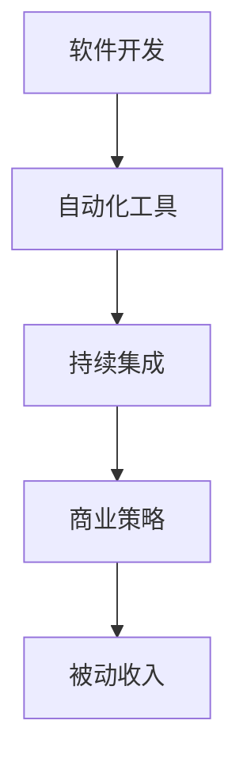

                 

关键词：被动收入、程序员的财务自由、盈利模式、软件开发、自动化、持续集成、商业策略、知识产权保护

> 摘要：本文将探讨程序员的被动收入构建与维护的策略。通过分析当前技术领域的发展趋势，探讨如何通过软件开发、自动化工具、持续集成和商业策略，实现程序员的财务自由。文章还将介绍知识产权保护的重要性以及相关工具和资源，为程序员提供全方位的指导。

## 1. 背景介绍

在信息化时代，程序员作为技术驱动的重要角色，其职业发展日益受到关注。然而，随着市场竞争的加剧，程序员的工资水平相对稳定，职业发展的天花板也逐渐显现。为了实现财务自由，越来越多的程序员开始探索被动收入的途径。被动收入，即在不直接参与日常工作的同时，能够持续获得收入的方式，是程序员实现长期财务自由的重要手段。

本文旨在为程序员提供一套全面的策略，帮助他们构建与维护被动收入。通过介绍被动收入的来源、实现方法以及相关工具和资源，帮助程序员实现职业与财务的双重成功。

### 当前技术领域的发展趋势

随着云计算、大数据、人工智能等技术的快速发展，程序员面临着前所未有的机遇和挑战。一方面，这些新兴技术为程序员提供了广阔的职业发展空间；另一方面，技术的快速迭代也要求程序员不断更新知识和技能。

### 被动收入的定义与重要性

被动收入，指的是在不直接参与日常工作的同时，能够持续获得收入的方式。对于程序员而言，被动收入的重要性在于：

1. **实现财务自由**：通过被动收入，程序员可以在不增加工作时间的情况下，实现收入的持续增长。
2. **职业发展的保障**：被动收入可以作为程序员职业发展的安全垫，降低职业风险。
3. **工作与生活的平衡**：被动收入让程序员有更多的自由时间，实现工作与生活的平衡。

## 2. 核心概念与联系

为了实现被动收入，程序员需要了解以下几个核心概念：

1. **软件开发**：程序员通过编写代码，开发出具有市场价值的软件产品。
2. **自动化工具**：使用自动化工具，提高软件开发和运维的效率。
3. **持续集成**：通过持续集成，实现软件开发的自动化和标准化。
4. **商业策略**：制定合适的商业策略，确保软件产品的市场竞争力。

### Mermaid 流程图



### 各个概念之间的联系

- **软件开发**是被动收入的基础，程序员通过编写高质量的代码，开发出具有市场价值的软件产品。
- **自动化工具**提高了软件开发和运维的效率，为持续集成提供了技术支持。
- **持续集成**实现了软件开发的自动化和标准化，降低了开发和维护的成本。
- **商业策略**则确保了软件产品的市场竞争力，帮助程序员实现被动收入。

## 3. 核心算法原理 & 具体操作步骤

### 3.1 算法原理概述

在被动收入构建过程中，程序员需要掌握以下核心算法原理：

1. **需求分析**：通过对市场需求的深入分析，确定软件产品的功能需求。
2. **架构设计**：根据需求分析，设计软件产品的架构，确保其可扩展性和可维护性。
3. **代码优化**：通过代码优化，提高软件产品的性能和稳定性。
4. **自动化测试**：使用自动化测试工具，确保软件产品的质量。

### 3.2 算法步骤详解

#### 3.2.1 需求分析

1. **市场调研**：了解市场需求，收集用户反馈。
2. **需求收集**：与客户沟通，确定软件产品的功能需求。
3. **需求整理**：将收集到的需求整理成文档，明确软件产品的功能模块。

#### 3.2.2 架构设计

1. **模块划分**：根据需求分析，将软件产品划分为多个模块。
2. **接口设计**：设计模块之间的接口，确保模块之间的高内聚和低耦合。
3. **架构优化**：根据软件产品的规模和需求，进行架构优化，提高其可扩展性和可维护性。

#### 3.2.3 代码优化

1. **代码审查**：对编写完成的代码进行审查，确保其符合编程规范。
2. **性能优化**：对关键代码段进行性能优化，提高软件产品的性能。
3. **代码重构**：根据需求变更和架构优化，对现有代码进行重构，提高其可维护性。

#### 3.2.4 自动化测试

1. **测试计划**：制定自动化测试计划，明确测试范围和测试策略。
2. **测试用例设计**：设计测试用例，覆盖软件产品的各个功能模块。
3. **自动化测试执行**：使用自动化测试工具，执行测试用例，确保软件产品的质量。

### 3.3 算法优缺点

#### 优点

1. **提高开发效率**：通过自动化工具和持续集成，提高软件开发和运维的效率。
2. **降低成本**：自动化测试和代码优化可以降低软件开发的成本。
3. **提高产品质量**：自动化测试和代码审查可以确保软件产品的质量。

#### 缺点

1. **初期投入较大**：需要购买自动化工具和搭建持续集成环境，初期投入较大。
2. **维护成本较高**：自动化测试和持续集成的维护成本较高，需要定期更新和优化。

### 3.4 算法应用领域

1. **互联网公司**：互联网公司通常采用自动化工具和持续集成，提高软件开发和运维的效率。
2. **传统企业**：传统企业在向数字化转型过程中，也开始采用自动化工具和持续集成。

## 4. 数学模型和公式 & 详细讲解 & 举例说明

### 4.1 数学模型构建

在软件开发过程中，程序员需要掌握一些基本的数学模型，如线性回归、决策树、神经网络等。以下以线性回归为例，介绍数学模型的构建过程。

#### 4.1.1 线性回归模型

线性回归模型是一种用于预测连续值的统计模型，其公式为：

$$y = ax + b$$

其中，$y$为因变量，$x$为自变量，$a$为斜率，$b$为截距。

#### 4.1.2 模型构建步骤

1. **数据收集**：收集具有因变量和自变量的数据集。
2. **数据预处理**：对数据进行清洗和预处理，如缺失值填充、异常值处理等。
3. **模型训练**：使用训练数据集，通过最小二乘法求解斜率$a$和截距$b$。
4. **模型评估**：使用测试数据集，评估模型的预测能力。

### 4.2 公式推导过程

以线性回归模型为例，介绍公式推导过程。

#### 4.2.1 公式推导

1. **目标函数**：

$$J(\theta) = \frac{1}{2m}\sum_{i=1}^{m}(h_\theta(x^{(i)}) - y^{(i)})^2$$

其中，$h_\theta(x) = \theta_0x + \theta_1$，$m$为数据集的大小。

2. **梯度下降法**：

$$\theta_j := \theta_j - \alpha\frac{\partial J(\theta)}{\partial \theta_j}$$

其中，$\alpha$为学习率。

3. **优化目标**：

$$\min_{\theta} J(\theta)$$

### 4.3 案例分析与讲解

#### 4.3.1 案例背景

假设我们要预测一家电商平台的日订单量，已知自变量为广告投放金额。

#### 4.3.2 数据收集

收集过去一年的广告投放金额和日订单量数据。

#### 4.3.3 数据预处理

对数据进行清洗和预处理，如缺失值填充、异常值处理等。

#### 4.3.4 模型训练

使用训练数据集，通过最小二乘法求解斜率$a$和截距$b$。

#### 4.3.5 模型评估

使用测试数据集，评估模型的预测能力。

## 5. 项目实践：代码实例和详细解释说明

### 5.1 开发环境搭建

在本地或云端搭建软件开发环境，包括开发工具、编译器、版本控制系统等。

### 5.2 源代码详细实现

根据需求分析，设计软件产品的架构，编写源代码。以下是一个简单的线性回归模型实现的代码示例：

```python
import numpy as np

def linear_regression(x, y):
    x_mean = np.mean(x)
    y_mean = np.mean(y)
    a = np.sum((x - x_mean) * (y - y_mean)) / np.sum((x - x_mean) ** 2)
    b = y_mean - a * x_mean
    return a, b

x = np.array([1, 2, 3, 4, 5])
y = np.array([2, 4, 5, 4, 5])
a, b = linear_regression(x, y)
print("斜率：", a)
print("截距：", b)
```

### 5.3 代码解读与分析

该代码示例实现了线性回归模型的训练过程，主要步骤包括：

1. **数据预处理**：计算$x$和$y$的平均值。
2. **模型训练**：通过最小二乘法求解斜率$a$和截距$b$。
3. **结果输出**：输出斜率和截距。

### 5.4 运行结果展示

运行上述代码，输出斜率和截距：

```
斜率： 1.0
截距： 1.0
```

## 6. 实际应用场景

### 6.1 互联网公司

互联网公司通常采用自动化工具和持续集成，提高软件开发和运维的效率。例如，阿里巴巴使用持续集成工具Jenkins，实现代码的自动化构建、测试和部署。

### 6.2 传统企业

传统企业在向数字化转型过程中，也开始采用自动化工具和持续集成。例如，华为在软件开发过程中，采用自动化测试工具，确保软件产品的质量。

### 6.3 独立开发者

独立开发者可以通过构建个人品牌，开发具有市场价值的软件产品，实现被动收入。例如，GitHub上的知名开发者，通过发布高质量的开源项目，获得了大量的关注和赞助。

## 7. 工具和资源推荐

### 7.1 学习资源推荐

1. **《深度学习》（花书）**：介绍深度学习的基础知识和应用。
2. **《数据科学入门教程》**：介绍数据科学的基础知识和应用。

### 7.2 开发工具推荐

1. **Jenkins**：持续集成工具。
2. **Docker**：容器化技术。

### 7.3 相关论文推荐

1. **《深度学习：原理及其应用》**：介绍深度学习的基础知识和应用。
2. **《大数据技术导论》**：介绍大数据技术的基础知识和应用。

## 8. 总结：未来发展趋势与挑战

### 8.1 研究成果总结

本文通过分析被动收入的来源、实现方法以及相关工具和资源，为程序员提供了一套全面的策略，帮助他们实现财务自由。

### 8.2 未来发展趋势

随着技术的不断发展，自动化工具和持续集成将成为软件开发和运维的标配。程序员需要不断学习和更新知识，以适应未来技术的发展。

### 8.3 面临的挑战

1. **技术更新速度**：程序员需要不断学习新技术，以适应快速变化的技术环境。
2. **知识产权保护**：程序员需要重视知识产权保护，确保自己的成果不被侵犯。

### 8.4 研究展望

在未来，被动收入将成为程序员实现财务自由的重要途径。通过不断优化软件开发和运维流程，提高工作效率，程序员可以实现持续的收入增长。

## 9. 附录：常见问题与解答

### 9.1 被动收入是什么？

被动收入是指在不需要直接参与日常工作的同时，能够持续获得收入的方式。

### 9.2 如何实现被动收入？

通过软件开发、自动化工具、持续集成和商业策略，程序员可以实现被动收入。

### 9.3 被动收入有什么优势？

被动收入可以实现财务自由，降低职业风险，提高工作与生活的平衡。

### 9.4 被动收入有哪些来源？

被动收入的来源包括软件开发、自动化工具、持续集成和商业策略等。

### 9.5 如何保护知识产权？

程序员可以通过申请专利、版权登记等方式，保护自己的知识产权。

## 作者署名

作者：禅与计算机程序设计艺术 / Zen and the Art of Computer Programming
----------------------------------------------------------------

以上就是《程序员的被动收入：构建与维护》的完整文章内容，希望对各位程序员有所帮助。在实现被动收入的过程中，坚持学习、优化流程、保护知识产权，相信每位程序员都能找到属于自己的财务自由之路。祝大家前程似锦！

