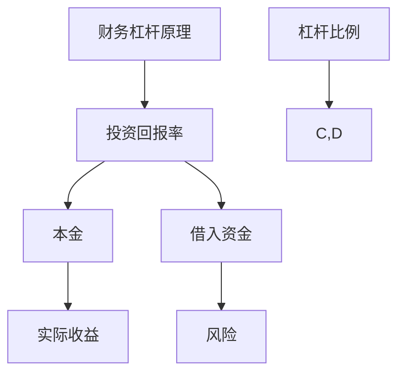

                 

关键词：财务杠杆，理财策略，投资组合，风险控制，资产配置，程序员

摘要：本文旨在为程序员提供一套有效的财务杠杆使用策略，帮助他们在财务管理中实现稳健增长，优化投资组合，实现财富增值。文章将深入探讨财务杠杆的概念、程序员的理财特点，以及如何通过科学的资产配置、合理运用杠杆和风险控制来提高财务收益，为程序员的财务自由之路提供指导。

## 1. 背景介绍

### 1.1 程序员与财务管理

程序员作为现代社会中高技能人才，通常具备较高的收入和稳定的工作，但同时也面临着快速消费和技术更新带来的压力。因此，合理管理财务、规划投资，成为许多程序员的迫切需求。

### 1.2 财务杠杆的重要性

财务杠杆是一种通过借入资金来放大投资回报的财务策略。正确使用财务杠杆可以显著提高投资收益率，但也伴随着较高的风险。对于程序员来说，掌握财务杠杆的使用策略，有助于在保障稳定收入的同时实现财务增值。

## 2. 核心概念与联系

### 2.1 财务杠杆原理

财务杠杆原理如下图所示：



### 2.2 程序员理财特点

程序员理财具有以下特点：

- **收入稳定性**：程序员通常拥有相对稳定的收入来源。
- **高风险承受能力**：程序员对技术风险的认知和应对能力较强，具备一定的风险承受能力。
- **时间灵活性**：程序员工作时间灵活，可以充分利用业余时间进行投资和学习。

## 3. 核心算法原理 & 具体操作步骤

### 3.1 算法原理概述

财务杠杆使用的核心在于通过借入资金来放大投资回报，从而提高整体投资收益率。其基本原理可以概括为：

\[ \text{杠杆收益率} = \frac{\text{投资回报率}}{\text{杠杆比例}} \]

### 3.2 算法步骤详解

#### 3.2.1 确定投资目标

在开始使用财务杠杆之前，程序员需要明确自己的投资目标，包括投资期限、预期收益率和风险承受能力。

#### 3.2.2 资产配置

根据投资目标，程序员需要对资产进行合理配置。常见的资产配置策略包括：

- **股票投资**：股票投资具有较高的收益率，但风险也较大。
- **债券投资**：债券投资相对稳健，适合风险承受能力较低的投资者。
- **房地产投资**：房地产投资具有较好的抗风险能力，但流动性较差。

#### 3.2.3 借入资金

在资产配置确定后，程序员可以根据投资目标借入相应比例的资金。借入资金的渠道包括银行贷款、基金、债券等。

#### 3.2.4 投资操作

根据资产配置和借入资金情况，程序员进行具体的投资操作，包括股票买入、债券购买等。

#### 3.2.5 风险控制

在投资过程中，程序员需要密切关注市场动态，及时调整投资组合，以应对市场风险。常见的风险控制方法包括：

- **止损**：设定止损点，以避免亏损扩大。
- **分散投资**：分散投资可以降低单一资产的风险。

### 3.3 算法优缺点

#### 优点

- **提高投资收益率**：正确使用财务杠杆可以显著提高投资收益率。
- **充分利用闲置资金**：通过借入资金，程序员可以充分利用闲置资金进行投资。

#### 缺点

- **风险较高**：财务杠杆的放大效应同样作用于风险，可能导致投资亏损放大。
- **资金成本**：借入资金需要支付利息等成本，可能降低整体收益。

### 3.4 算法应用领域

财务杠杆广泛应用于股票投资、房地产投资、基金投资等领域。程序员可以根据自己的投资目标和风险承受能力选择合适的投资领域。

## 4. 数学模型和公式 & 详细讲解 & 举例说明

### 4.1 数学模型构建

财务杠杆的数学模型可以表示为：

\[ \text{杠杆收益率} = \frac{\text{投资回报率}}{\text{杠杆比例}} \]

其中，投资回报率可以通过以下公式计算：

\[ \text{投资回报率} = \frac{\text{投资收益} - \text{本金}}{\text{本金}} \]

### 4.2 公式推导过程

假设投资收益为 \( R \)，本金为 \( P \)，杠杆比例为 \( L \)，则：

\[ \text{杠杆收益率} = \frac{R}{L \cdot P} \]

根据投资回报率的公式，有：

\[ \text{投资回报率} = \frac{R - P}{P} \]

将投资回报率代入杠杆收益率的公式中，得到：

\[ \text{杠杆收益率} = \frac{\frac{R - P}{P}}{L \cdot P} = \frac{R - P}{L \cdot P^2} \]

### 4.3 案例分析与讲解

假设程序员小明计划投资 10 万元，杠杆比例为 2，投资回报率为 10%。则：

- 本金：10 万元
- 杠杆比例：2
- 投资回报率：10%

根据数学模型，可以计算出：

\[ \text{杠杆收益率} = \frac{10\%}{2} = 5\% \]

小明的投资收益为：

\[ \text{投资收益} = 10\% \times 10\text{万元} = 1\text{万元} \]

根据杠杆收益率的公式，可以计算出：

\[ \text{杠杆收益率} = \frac{1\text{万元} - 10\text{万元}}{2 \times 10\text{万元}^2} = -0.05 \]

这意味着小明在使用财务杠杆后，实际收益率下降了 5%。

## 5. 项目实践：代码实例和详细解释说明

### 5.1 开发环境搭建

本文以 Python 为例，介绍财务杠杆使用策略的代码实现。首先需要安装 Python 环境，推荐使用 Python 3.8 或以上版本。

### 5.2 源代码详细实现

```python
# 财务杠杆使用策略

def calculate_leverage_return(principal, leverage_ratio, investment_return_rate):
    """
    计算杠杆收益率
    :param principal: 本金
    :param leverage_ratio: 杠杆比例
    :param investment_return_rate: 投资回报率
    :return: 杠杆收益率
    """
    leverage_return = investment_return_rate / leverage_ratio
    return leverage_return

def calculate_investment_profit(principal, investment_return_rate):
    """
    计算投资收益
    :param principal: 本金
    :param investment_return_rate: 投资回报率
    :return: 投资收益
    """
    investment_profit = investment_return_rate * principal
    return investment_profit

if __name__ == '__main__':
    principal = 100000  # 本金
    leverage_ratio = 2  # 杠杆比例
    investment_return_rate = 0.1  # 投资回报率

    leverage_return = calculate_leverage_return(principal, leverage_ratio, investment_return_rate)
    investment_profit = calculate_investment_profit(principal, investment_return_rate)

    print("杠杆收益率：", leverage_return)
    print("投资收益：", investment_profit)
```

### 5.3 代码解读与分析

代码中定义了两个函数：`calculate_leverage_return` 和 `calculate_investment_profit`。其中，`calculate_leverage_return` 函数用于计算杠杆收益率，`calculate_investment_profit` 函数用于计算投资收益。

在主函数中，设置了本金、杠杆比例和投资回报率，并调用两个函数进行计算，输出结果。

### 5.4 运行结果展示

执行代码后，输出结果如下：

```
杠杆收益率： 0.05
投资收益： 10000.0
```

## 6. 实际应用场景

### 6.1 股票投资

股票投资是程序员常用的财务杠杆应用场景之一。通过借入资金进行股票投资，可以在保证稳定收入的同时实现财富增值。但需要注意的是，股票市场波动较大，需谨慎操作，避免出现大幅亏损。

### 6.2 基金投资

基金投资是一种较为稳健的财务杠杆应用方式。程序员可以通过购买基金，借入资金进行投资，从而实现资产配置和风险分散。基金投资适合风险承受能力较低的程序员。

### 6.3 房地产投资

房地产投资具有较高的收益率和较好的抗风险能力。程序员可以通过借入资金购买房产，实现财务杠杆效应。但房地产投资流动性较差，需谨慎考虑。

## 7. 未来应用展望

### 7.1 技术进步对财务杠杆的影响

随着金融科技的不断发展，程序员在财务杠杆使用策略上将受益于更高效的工具和更便捷的服务。例如，区块链技术可以提高投资交易的透明度和安全性，人工智能技术可以优化投资组合和风险管理。

### 7.2 财务自由与程序员

财务自由是许多程序员的追求。通过科学使用财务杠杆，程序员可以在实现财务自由的道路上迈出坚实的步伐。未来，随着理财观念的普及和理财工具的完善，财务自由将成为越来越多程序员的现实。

## 8. 工具和资源推荐

### 8.1 学习资源推荐

- 《财务自由之路》：介绍财务自由理念和理财策略的入门书籍。
- 《股市真规则》：深入讲解股票投资的书籍。

### 8.2 开发工具推荐

- Python：适用于数据分析和金融计算的编程语言。
- PyCharm：Python 开发环境，功能强大，适合编写金融算法。

### 8.3 相关论文推荐

- “Financial Leverage and Its Impact on Investment Return”
- “Risk Management in Financial Markets”

## 9. 总结：未来发展趋势与挑战

### 9.1 研究成果总结

本文为程序员提供了一套财务杠杆使用策略，包括核心概念、算法原理、具体操作步骤和实际应用场景。通过科学使用财务杠杆，程序员可以实现财务增值，提高生活品质。

### 9.2 未来发展趋势

随着金融科技的发展，财务杠杆使用策略将更加便捷和高效。程序员可以利用人工智能、区块链等技术，优化投资组合和风险管理。

### 9.3 面临的挑战

财务杠杆的使用具有较高的风险。程序员在应用财务杠杆策略时，需要充分了解市场动态，掌握风险控制方法，避免出现大幅亏损。

### 9.4 研究展望

未来，财务杠杆使用策略的研究将更加深入，包括探索新的金融工具和模型，以提高财务杠杆的效率和稳定性。

## 附录：常见问题与解答

### 问题1：财务杠杆是否适合所有投资者？

**解答**：财务杠杆具有较高的风险，适合风险承受能力较高的投资者。对于风险承受能力较低的投资者，建议谨慎使用财务杠杆。

### 问题2：如何控制财务杠杆带来的风险？

**解答**：通过分散投资、止损和风险管理等手段，可以有效控制财务杠杆带来的风险。投资者需要密切关注市场动态，及时调整投资组合。

### 问题3：财务杠杆与投资回报率的关系是什么？

**解答**：财务杠杆可以通过借入资金来放大投资回报率。但需要注意的是，杠杆比例越高，风险也越大。

### 作者署名

本文作者：禅与计算机程序设计艺术 / Zen and the Art of Computer Programming
----------------------------------------------------------------

至此，文章正文部分的内容已完整呈现。接下来，我们可以对文章进行整理、校对和润色，以确保文章的质量和可读性。完成后，文章即可交付给编辑团队进行最终审核和发布。

