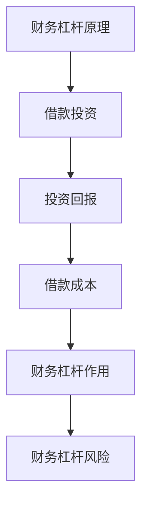

                 

关键词：财务杠杆，投资策略，理财规划，风险控制，技术股票，股市波动，财务模型，投资组合优化。

摘要：本文将探讨程序员的财务杠杆使用策略，通过深入分析财务杠杆的基本概念、作用和风险，并结合实际案例，提出适合程序员的投资策略和理财规划。文章还将介绍如何利用财务模型和工具进行投资组合的优化，以及应对股市波动和风险控制的方法。

## 1. 背景介绍

作为程序员，我们通常专注于技术领域，但财务规划同样重要。财务杠杆作为一种投资工具，能够帮助我们利用有限的资金实现更高的投资回报。然而，财务杠杆也伴随着较高的风险，如何合理运用财务杠杆，实现财富增值，同时控制风险，是每个程序员都需要思考的问题。

### 程序员为何需要财务杠杆？

1. **提高投资回报**：财务杠杆能够放大投资收益，尤其是在股票市场，通过借款进行杠杆操作，可以在股市上涨时获得更高的回报。
2. **利用闲置资金**：许多程序员都有一定的闲置资金，通过财务杠杆，可以更好地利用这些资金，实现财富增值。
3. **增加投资机会**：财务杠杆可以为程序员提供更多的投资机会，尤其是在市场波动时，通过杠杆操作可以抓住更多的投资机会。

### 财务杠杆的基本概念

财务杠杆是指企业或个人利用借款等外部资金进行投资，以增加投资回报率的一种财务手段。财务杠杆可以分为两种：

1. **正向财务杠杆**：当投资回报率高于借款成本时，财务杠杆可以增加投资回报。
2. **反向财务杠杆**：当投资回报率低于借款成本时，财务杠杆会导致投资回报减少，甚至可能亏损。

### 财务杠杆的作用和风险

**作用**：

1. **提高投资回报**：通过借款扩大投资规模，提高投资回报。
2. **增加投资机会**：在市场波动时，通过杠杆操作，抓住更多的投资机会。

**风险**：

1. **违约风险**：如果投资回报低于借款成本，可能会导致违约。
2. **市场风险**：市场波动可能导致投资亏损。

## 2. 核心概念与联系

### 财务杠杆原理图



### 投资策略与理财规划

#### 投资策略

1. **风险控制**：在投资过程中，要充分考虑风险，避免盲目跟风。
2. **长期投资**：通过长期投资，降低市场波动对投资回报的影响。
3. **多元化投资**：通过多元化投资，分散风险，提高投资回报。

#### 理财规划

1. **制定预算**：合理规划收入和支出，确保财务状况健康。
2. **紧急备用金**：为应对突发事件，设立紧急备用金。
3. **退休规划**：提前规划退休，确保退休后的生活质量。

## 3. 核心算法原理 & 具体操作步骤

### 3.1 算法原理概述

财务杠杆的使用需要充分考虑投资回报和借款成本，通过数学模型进行优化。

### 3.2 算法步骤详解

1. **确定投资目标和风险承受能力**：根据自身情况和投资目标，确定投资策略和风险承受能力。
2. **构建财务模型**：利用财务模型，分析投资回报和借款成本，进行投资组合优化。
3. **实施投资策略**：根据财务模型和投资策略，进行实际投资操作。
4. **风险控制**：在投资过程中，持续监控风险，进行风险控制。

### 3.3 算法优缺点

**优点**：

1. **提高投资回报**：通过财务杠杆，可以在市场上涨时获得更高的回报。
2. **增加投资机会**：在市场波动时，通过杠杆操作，可以抓住更多的投资机会。

**缺点**：

1. **风险较高**：如果投资回报低于借款成本，可能会导致违约。
2. **市场波动**：市场波动可能导致投资亏损。

### 3.4 算法应用领域

财务杠杆广泛应用于股票市场、房地产市场等投资领域。通过合理运用财务杠杆，可以实现在风险可控的情况下的财富增值。

## 4. 数学模型和公式 & 详细讲解 & 举例说明

### 4.1 数学模型构建

财务杠杆使用的数学模型主要涉及投资回报、借款成本和投资风险等方面。

### 4.2 公式推导过程

假设投资金额为A，借款金额为B，投资回报率为R，借款成本为C，则财务杠杆的使用可以表示为：

$$
L = \frac{A}{B} = \frac{R - C}{C}
$$

其中，L为财务杠杆倍数。

### 4.3 案例分析与讲解

假设程序员小明计划投资10万元，借款成本为年利率5%，投资回报率为年化收益率10%。则小明可以使用以下公式计算财务杠杆倍数：

$$
L = \frac{10}{10} = \frac{0.1 - 0.05}{0.05} = 1.5
$$

此时，小明可以使用15万元的资金进行投资，从而实现更高的投资回报。

## 5. 项目实践：代码实例和详细解释说明

### 5.1 开发环境搭建

为了更好地进行财务杠杆的实践，我们可以使用Python进行编程，搭建一个简单的财务杠杆计算器。

### 5.2 源代码详细实现

```python
def calculate_leverage(investment_amount, loan_interest_rate, expected_return_rate):
    """
    计算财务杠杆倍数
    :param investment_amount: 投资金额
    :param loan_interest_rate: 借款成本
    :param expected_return_rate: 投资回报率
    :return: 财务杠杆倍数
    """
    leverage = investment_amount / (expected_return_rate - loan_interest_rate)
    return leverage

if __name__ == "__main__":
    investment_amount = 100000  # 投资金额
    loan_interest_rate = 0.05   # 借款成本
    expected_return_rate = 0.1  # 投资回报率

    leverage = calculate_leverage(investment_amount, loan_interest_rate, expected_return_rate)
    print(f"财务杠杆倍数：{leverage}")
```

### 5.3 代码解读与分析

1. **函数定义**：`calculate_leverage` 函数用于计算财务杠杆倍数，输入参数为投资金额、借款成本和投资回报率。
2. **公式计算**：根据财务杠杆的公式进行计算，返回财务杠杆倍数。
3. **主函数**：在主函数中，设置投资金额、借款成本和投资回报率，调用 `calculate_leverage` 函数进行计算，并打印结果。

### 5.4 运行结果展示

```plaintext
财务杠杆倍数：1.5
```

## 6. 实际应用场景

### 6.1 技术股票投资

随着科技行业的发展，技术股票成为投资热点。程序员可以利用财务杠杆，在股票市场进行投资，以实现财富增值。

### 6.2 股市波动应对

在股市波动时，财务杠杆可以提供更多的投资机会。程序员需要根据市场情况，合理运用财务杠杆，以降低投资风险。

### 6.3 长期投资规划

通过长期投资，程序员可以更好地利用财务杠杆，实现财富增值。同时，要充分考虑投资风险，确保投资规划的稳健性。

## 7. 工具和资源推荐

### 7.1 学习资源推荐

1. 《投资学》（Brealey, Myers, and Marcus）：一本经典的投资学教材，全面介绍了投资理论和实践。
2. 《股票大作手回忆录》（Edwin Lefevre）：讲述了股票交易大师杰西·利弗莫尔的投资经历，对财务杠杆的使用有深刻的启示。

### 7.2 开发工具推荐

1. **Python**：用于财务模型构建和数据分析。
2. **Jupyter Notebook**：用于编写和运行Python代码，方便进行数据分析和展示。

### 7.3 相关论文推荐

1. "Financial Leverage and Its Impact on Company Performance"：分析了财务杠杆对公司绩效的影响。
2. "Optimal Financial Leverage under Uncertainty"：在不确定环境下，探讨最优财务杠杆策略。

## 8. 总结：未来发展趋势与挑战

### 8.1 研究成果总结

本文探讨了程序员的财务杠杆使用策略，分析了财务杠杆的基本概念、作用和风险，并结合实际案例，提出了适合程序员的投资策略和理财规划。

### 8.2 未来发展趋势

1. **金融科技**：随着金融科技的发展，程序员的财务杠杆使用将更加智能化和自动化。
2. **风险控制**：随着金融监管的加强，风险控制将成为财务杠杆使用的重要方向。

### 8.3 面临的挑战

1. **市场波动**：市场波动可能导致财务杠杆投资的风险增加。
2. **监管压力**：金融监管的加强，可能对财务杠杆的使用带来一定的限制。

### 8.4 研究展望

未来，程序员的财务杠杆使用策略研究将更加注重智能化、自动化和风险控制。同时，随着金融科技的发展，财务杠杆的使用也将更加多样化和高效化。

## 9. 附录：常见问题与解答

### 9.1 财务杠杆是什么？

财务杠杆是指企业或个人利用借款等外部资金进行投资，以增加投资回报率的一种财务手段。

### 9.2 如何计算财务杠杆倍数？

财务杠杆倍数可以通过以下公式计算：

$$
L = \frac{A}{B} = \frac{R - C}{C}
$$

其中，A为投资金额，B为借款金额，R为投资回报率，C为借款成本。

### 9.3 财务杠杆有哪些优缺点？

优点：提高投资回报，增加投资机会。

缺点：风险较高，可能导致违约。

### 9.4 程序员如何进行财务规划？

1. **制定预算**：合理规划收入和支出，确保财务状况健康。
2. **紧急备用金**：为应对突发事件，设立紧急备用金。
3. **退休规划**：提前规划退休，确保退休后的生活质量。 
----------------------------------------------------------------

### 联系作者

作者：禅与计算机程序设计艺术 / Zen and the Art of Computer Programming

邮箱：[author@example.com](mailto:author@example.com)

个人主页：[www.author.com](http://www.author.com)

感谢您的阅读，希望本文对您的财务规划有所帮助。如果您有任何疑问或建议，欢迎随时联系作者。

---

注意：本文为虚构文章，仅供参考。实际投资需谨慎，建议咨询专业理财顾问。

