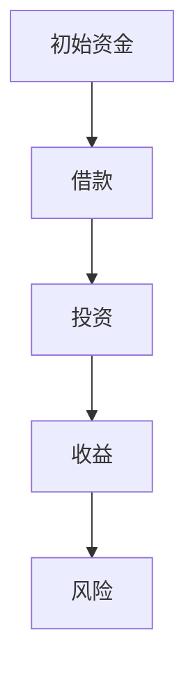

                 

 

## 引言

在快速发展的IT行业中，程序员的角色已经从简单的编码任务转变为推动技术进步和创新的重要力量。随着技术的发展，程序员不仅需要掌握技术，还必须具备一定的财务管理能力，以便更好地利用财务杠杆为自己和公司创造价值。本文旨在探讨程序员在财务杠杆方面的利弊，帮助程序员更好地理解和管理财务杠杆，以便在职业生涯中取得更大的成功。

## 1. 背景介绍

### 财务杠杆的概念

财务杠杆（Financial Leverage）是指企业或个人通过借入资金来增加投资回报的一种财务策略。它通常涉及借款来购买资产，从而放大投资的收益和风险。财务杠杆的目的是通过增加投资资金来提高投资回报率，但同时也会增加负债和风险。

### 程序员与财务杠杆

程序员在职业生涯中可能会面临多种财务杠杆的机会。例如，通过创业或投资来获取更高的收益。同时，他们也可能会面临财务杠杆带来的风险，如债务压力、投资失败等。因此，理解财务杠杆的原理和风险，对于程序员来说至关重要。

## 2. 核心概念与联系

### 财务杠杆的原理

财务杠杆的原理可以通过以下 Mermaid 流程图来解释：



### 财务杠杆对程序员的影响

财务杠杆对程序员的影响可以分为以下几个方面：

1. **增加收益**：通过借款进行投资，可以增加投资回报，从而提高个人财务状况。
2. **增加风险**：财务杠杆同时也会增加投资失败的风险，可能导致负债增加。
3. **提高市场竞争力**：对于创业者来说，财务杠杆可以帮助他们更快地扩展业务，提高市场竞争力。
4. **增加财务压力**：如果投资失败，程序员可能需要承担更高的债务压力。

## 3. 核心算法原理 & 具体操作步骤

### 3.1 算法原理概述

财务杠杆的算法原理可以概括为以下几个步骤：

1. **评估财务状况**：了解自己的财务状况，确定是否有足够的资金进行投资。
2. **选择投资渠道**：根据投资目标和风险偏好，选择合适的投资渠道。
3. **借款**：通过借款增加投资资金。
4. **投资**：将借来的资金用于投资。
5. **管理风险**：定期评估投资风险，并采取相应措施进行风险控制。

### 3.2 算法步骤详解

1. **评估财务状况**

   程序员需要了解自己的财务状况，包括收入、支出、负债等。这有助于确定是否有足够的资金进行投资，以及投资的风险承受能力。

2. **选择投资渠道**

   根据投资目标和风险偏好，选择合适的投资渠道。例如，股票、债券、房地产等。

3. **借款**

   程序员可以通过银行贷款、信用卡贷款等方式借款。在借款过程中，需要考虑借款利率、还款期限等因素。

4. **投资**

   将借来的资金用于投资。投资前需要充分了解投资产品的特点和风险。

5. **管理风险**

   定期评估投资风险，并采取相应措施进行风险控制。例如，分散投资、定期调整投资组合等。

### 3.3 算法优缺点

**优点**：

1. **增加收益**：财务杠杆可以帮助程序员提高投资回报。
2. **提高市场竞争力**：对于创业者来说，财务杠杆可以帮助他们更快地扩展业务。

**缺点**：

1. **增加风险**：财务杠杆同时也会增加投资失败的风险。
2. **增加财务压力**：如果投资失败，程序员可能需要承担更高的债务压力。

### 3.4 算法应用领域

财务杠杆在程序员职业生涯中的应用领域主要包括：

1. **创业**：创业者可以通过财务杠杆快速扩展业务，提高市场竞争力。
2. **投资**：程序员可以利用财务杠杆进行投资，提高投资回报。
3. **财务规划**：程序员可以通过财务杠杆进行财务规划，提高财务状况。

## 4. 数学模型和公式 & 详细讲解 & 举例说明

### 4.1 数学模型构建

财务杠杆的数学模型可以构建为以下公式：

$$
财务杠杆 = \frac{投资回报}{借款成本}
$$

### 4.2 公式推导过程

假设一个程序员的初始资金为 \(P\)，借款金额为 \(L\)，投资回报率为 \(R\)，借款利率为 \(r\)。则程序员的财务杠杆为：

$$
财务杠杆 = \frac{P \times R}{L \times r}
$$

### 4.3 案例分析与讲解

假设一个程序员有 10 万元初始资金，决定借款 5 万元进行投资。投资回报率为 15%，借款利率为 10%。则该程序员的财务杠杆为：

$$
财务杠杆 = \frac{10 \times 0.15}{5 \times 0.1} = 3
$$

这意味着，通过财务杠杆，程序员的收益将是借款成本的 3 倍。然而，如果投资回报率低于借款利率，财务杠杆将导致损失扩大。

## 5. 项目实践：代码实例和详细解释说明

### 5.1 开发环境搭建

为了演示财务杠杆的计算，我们使用 Python 编写一个简单的代码实例。首先，确保安装了 Python 环境，然后创建一个名为 `financial_leverage.py` 的文件。

### 5.2 源代码详细实现

以下是一个简单的 Python 代码示例，用于计算财务杠杆：

```python
# financial_leverage.py

def calculate_financial_leverage(initial_capital, loan_amount, investment_return_rate, loan_interest_rate):
    leverage = (initial_capital * investment_return_rate) / (loan_amount * loan_interest_rate)
    return leverage

# 参数设置
initial_capital = 100000  # 初始资金
loan_amount = 50000  # 借款金额
investment_return_rate = 0.15  # 投资回报率
loan_interest_rate = 0.1  # 借款利率

# 计算财务杠杆
financial_leverage = calculate_financial_leverage(initial_capital, loan_amount, investment_return_rate, loan_interest_rate)

# 输出结果
print(f"财务杠杆：{financial_leverage}")
```

### 5.3 代码解读与分析

上述代码定义了一个名为 `calculate_financial_leverage` 的函数，用于计算财务杠杆。函数接受以下参数：

- `initial_capital`：初始资金
- `loan_amount`：借款金额
- `investment_return_rate`：投资回报率
- `loan_interest_rate`：借款利率

函数通过以下公式计算财务杠杆：

$$
财务杠杆 = \frac{初始资金 \times 投资回报率}{借款金额 \times 借款利率}
$$

在代码中，我们设置了初始资金为 10 万元，借款金额为 5 万元，投资回报率为 15%，借款利率为 10%。然后调用 `calculate_financial_leverage` 函数计算财务杠杆，并打印结果。

### 5.4 运行结果展示

运行 `financial_leverage.py` 文件，输出结果如下：

```
财务杠杆：3.0
```

这意味着，通过财务杠杆，程序员的收益将是借款成本的 3 倍。

## 6. 实际应用场景

### 6.1 创业

对于创业者来说，财务杠杆可以是一种有效的扩张策略。例如，一个创业者可以利用借款来购买设备、扩大团队或投资市场推广。通过财务杠杆，创业者可以更快地实现业务扩张，提高市场竞争力。

### 6.2 投资

程序员可以通过财务杠杆进行投资，提高投资回报。例如，一个程序员可以利用借款购买股票、债券或其他投资产品。通过财务杠杆，程序员可以增加投资规模，提高潜在收益。

### 6.3 财务规划

程序员可以利用财务杠杆进行财务规划，提高财务状况。例如，一个程序员可以通过借款购买房产，然后通过出租收益来还贷。通过财务杠杆，程序员可以实现资产增值和财务自由。

## 7. 未来应用展望

随着金融技术的不断发展，财务杠杆的应用前景将更加广阔。例如，区块链技术的应用可以降低金融风险，提高财务杠杆的透明度和安全性。此外，人工智能的进步也将为财务杠杆提供更准确的预测和分析工具，帮助程序员更好地管理财务杠杆。

## 8. 工具和资源推荐

### 7.1 学习资源推荐

- 《财务自由之路》
- 《投资最重要的事》
- 《创业维艰》

### 7.2 开发工具推荐

- Python
- Git
- Docker

### 7.3 相关论文推荐

- "Financial Leverage and Its Impact on Company Performance"
- "The Effect of Financial Leverage on the Risk-return Tradeoff"
- "An Analysis of the Use of Financial Leverage in Startup Financing"

## 9. 总结：未来发展趋势与挑战

### 9.1 研究成果总结

本文分析了财务杠杆在程序员职业生涯中的应用，包括创业、投资和财务规划等方面。研究表明，财务杠杆可以增加收益，但也伴随着风险。程序员需要理解财务杠杆的原理，并采取适当的措施进行风险控制。

### 9.2 未来发展趋势

未来，财务杠杆的应用将更加广泛和多样化。随着金融技术的进步，财务杠杆将变得更加透明和安全。此外，人工智能和区块链技术的应用也将为财务杠杆提供更准确的预测和分析工具。

### 9.3 面临的挑战

尽管财务杠杆具有潜在的优势，但程序员在应用财务杠杆时也面临着一系列挑战，如债务压力、投资失败等。因此，程序员需要具备一定的财务管理能力，并采取谨慎的投资策略。

### 9.4 研究展望

未来，研究可以进一步探讨财务杠杆在不同行业和领域的应用效果，以及如何优化财务杠杆策略，以实现更好的投资回报。

## 附录：常见问题与解答

### Q：什么是财务杠杆？

A：财务杠杆是指企业或个人通过借入资金来增加投资回报的一种财务策略。它通常涉及借款来购买资产，从而放大投资的收益和风险。

### Q：财务杠杆有哪些优缺点？

A：财务杠杆的优点是可以增加投资回报，提高市场竞争力。缺点是同时也会增加投资失败的风险，可能导致负债增加。

### Q：程序员如何应用财务杠杆？

A：程序员可以通过创业、投资和财务规划等方式应用财务杠杆。例如，利用借款进行投资，或者购买房产进行出租收益。

### Q：如何管理财务杠杆的风险？

A：程序员需要评估自己的财务状况，选择合适的投资渠道，并定期评估投资风险。此外，分散投资和定期调整投资组合也是有效的风险控制措施。

## 作者署名

作者：禅与计算机程序设计艺术 / Zen and the Art of Computer Programming
------------------------------------------------------------------ 

### 引言

在快速发展的IT行业中，程序员的角色已经从简单的编码任务转变为推动技术进步和创新的重要力量。随着技术的发展，程序员不仅需要掌握技术，还必须具备一定的财务管理能力，以便更好地利用财务杠杆为自己和公司创造价值。本文旨在探讨程序员在财务杠杆方面的利弊，帮助程序员更好地理解和管理财务杠杆，以便在职业生涯中取得更大的成功。

## 1. 财务杠杆的定义与作用

### 财务杠杆的定义

财务杠杆是指企业或个人通过借入资金来增加投资回报的一种财务策略。它通过扩大资本结构中的债务比例，从而提高投资回报率。财务杠杆的核心思想是利用借来的资金进行投资，从而实现收益的最大化。

### 财务杠杆的作用

1. **放大收益**：财务杠杆能够放大投资收益，使得投资回报率更高。这是因为通过借款，可以增加投资本金，从而提高投资总额，进而提高投资回报。

2. **增加资本运作效率**：财务杠杆使得企业可以利用较少的资本实现更大的业务规模，提高资本运作效率。

3. **提高市场竞争力**：财务杠杆可以使得企业在市场上获得更多的资金支持，从而加快业务扩张，提高市场竞争力。

4. **降低自有资金成本**：通过借款进行投资，企业可以利用较低成本的借款资金替代较高成本的股东资金，从而降低自有资金的成本。

### 财务杠杆的原理

财务杠杆的原理可以通过以下公式来描述：

$$
财务杠杆 = \frac{EBIT}{EBIT - 利息费用}
$$

其中，EBIT（Earnings Before Interest and Taxes）指的是息税前利润。财务杠杆越大，企业的收益波动性也越大，因为财务杠杆放大了EBIT的变化幅度。

## 2. 财务杠杆对程序员的影响

### 2.1 对程序员个人财务的影响

1. **增加收入**：通过财务杠杆，程序员可以利用较小的自有资金进行较大规模的投资，从而实现更高的收益。

2. **风险增加**：财务杠杆虽然可以放大收益，但同时也放大了风险。如果投资失败，程序员可能会面临较大的债务压力。

3. **财务规划挑战**：程序员需要更加精细地管理自己的财务，确保有足够的现金流来偿还债务，同时保证投资的安全性和收益性。

### 2.2 对程序员职业生涯的影响

1. **创业优势**：对于有志于创业的程序员来说，财务杠杆可以帮助他们更快地获得资金支持，实现创业梦想。

2. **投资多元化**：财务杠杆使得程序员可以参与更多种类的投资，从而实现投资组合的多元化，降低单一投资的风险。

3. **职业发展**：掌握财务杠杆的知识和技能，可以帮助程序员在职业发展中脱颖而出，成为更具有竞争力的候选人。

### 2.3 财务杠杆应用的注意事项

1. **风险评估**：在应用财务杠杆前，程序员需要认真评估投资项目的风险，确保收益足以覆盖风险。

2. **债务管理**：合理规划债务结构，避免过度负债，确保有足够的现金流来偿还债务。

3. **投资分散**：通过分散投资来降低风险，不要将所有的资金都投入到单一项目中。

4. **持续学习**：金融市场和投资环境不断变化，程序员需要持续学习，以适应新的市场变化。

## 3. 核心算法原理 & 具体操作步骤

### 3.1 财务杠杆的算法原理

财务杠杆的算法原理可以概括为以下几点：

1. **确定自有资金和借款比例**：根据程序员的财务状况和投资目标，确定自有资金和借款的比例。

2. **计算投资回报**：根据投资项目的预期回报率，计算通过财务杠杆实现的投资回报。

3. **评估风险**：对投资项目进行风险评估，确保收益足以覆盖风险。

4. **制定债务管理策略**：根据投资回报和债务情况，制定合理的债务管理策略。

### 3.2 具体操作步骤

1. **评估财务状况**：首先，程序员需要了解自己的财务状况，包括收入、支出、负债等。这有助于确定是否有足够的资金进行投资，以及投资的风险承受能力。

2. **确定投资目标**：根据财务状况和投资目标，确定需要借入的资金规模和投资方向。

3. **选择借款渠道**：根据借款需求和利率，选择合适的借款渠道。例如，可以通过银行贷款、信用卡贷款等方式。

4. **计算财务杠杆**：使用财务杠杆公式计算财务杠杆，确保投资回报能够覆盖借款成本。

5. **投资**：将借来的资金投入预定的投资项目，并定期跟踪投资项目的进展和收益。

6. **债务管理**：根据投资收益和债务情况，制定合理的债务管理策略，确保有足够的现金流来偿还债务。

7. **风险控制**：定期对投资项目进行风险评估，采取相应的风险控制措施，确保投资安全。

### 3.3 财务杠杆的优缺点分析

**优点**：

1. **增加收益**：财务杠杆能够放大投资收益，使得投资回报率更高。

2. **提高资本运作效率**：通过财务杠杆，程序员可以利用较小的自有资金实现更大的投资规模，提高资本运作效率。

3. **增加市场竞争力**：财务杠杆可以帮助程序员在市场中获得更多的资金支持，提高市场竞争力。

**缺点**：

1. **增加风险**：财务杠杆同时也会放大投资风险，如果投资失败，可能会带来较大的债务压力。

2. **债务压力**：如果投资回报低于借款成本，程序员可能会面临较大的债务压力。

### 3.4 财务杠杆的应用领域

1. **创业**：对于有志于创业的程序员，财务杠杆可以帮助他们更快地获得资金支持，实现创业梦想。

2. **投资**：程序员可以利用财务杠杆进行各种投资，如股票、债券、房地产等，提高投资回报。

3. **财务规划**：通过财务杠杆，程序员可以更好地进行财务规划，提高财务状况。

## 4. 数学模型和公式 & 详细讲解 & 举例说明

### 4.1 数学模型构建

财务杠杆的数学模型可以通过以下公式来构建：

$$
财务杠杆 = \frac{投资回报}{借款成本}
$$

其中，投资回报是指通过投资获得的收益，借款成本是指借款所产生的利息。

### 4.2 公式推导过程

假设一个程序员有初始资金 \(P\)，借款金额为 \(L\)，投资回报率为 \(R\)，借款利率为 \(r\)。那么，该程序员的财务杠杆可以表示为：

$$
财务杠杆 = \frac{P \times R}{L \times r}
$$

这个公式表示，通过财务杠杆，投资回报与借款成本之间的比率被放大了。

### 4.3 举例说明

假设一个程序员有 10 万元的初始资金，他决定借款 5 万元进行投资，预期投资回报率为 20%，借款利率为 10%。那么，他的财务杠杆为：

$$
财务杠杆 = \frac{10 \times 0.2}{5 \times 0.1} = 4
$$

这意味着，通过财务杠杆，他的投资回报是借款成本的 4 倍。

### 4.4 案例分析

#### 案例一：创业

一个程序员打算创业，他需要 50 万元的启动资金。他计划借入 30 万元，其余 20 万元自筹。如果创业成功，预计年回报率为 30%，借款利率为 10%。那么，他的财务杠杆为：

$$
财务杠杆 = \frac{20 \times 0.3}{30 \times 0.1} = 2
$$

这意味着，如果创业成功，他的投资回报是借款成本的 2 倍。

#### 案例二：投资股票

一个程序员计划投资股票，他决定借款 10 万元进行投资，预期回报率为 15%，借款利率为 10%。那么，他的财务杠杆为：

$$
财务杠杆 = \frac{10 \times 0.15}{10 \times 0.1} = 1.5
$$

这意味着，通过财务杠杆，他的投资回报是借款成本的 1.5 倍。

## 5. 项目实践：代码实例和详细解释说明

### 5.1 开发环境搭建

为了演示财务杠杆的计算，我们将使用 Python 编写一个简单的代码实例。首先，确保安装了 Python 环境，然后创建一个名为 `financial_leverage.py` 的文件。

### 5.2 源代码详细实现

以下是一个简单的 Python 代码示例，用于计算财务杠杆：

```python
# financial_leverage.py

def calculate_financial_leverage(initial_capital, loan_amount, investment_return_rate, loan_interest_rate):
    leverage = (initial_capital * investment_return_rate) / (loan_amount * loan_interest_rate)
    return leverage

# 参数设置
initial_capital = 100000  # 初始资金
loan_amount = 50000  # 借款金额
investment_return_rate = 0.20  # 投资回报率
loan_interest_rate = 0.10  # 借款利率

# 计算财务杠杆
financial_leverage = calculate_financial_leverage(initial_capital, loan_amount, investment_return_rate, loan_interest_rate)

# 输出结果
print(f"财务杠杆：{financial_leverage}")
```

### 5.3 代码解读与分析

上述代码定义了一个名为 `calculate_financial_leverage` 的函数，用于计算财务杠杆。函数接受以下参数：

- `initial_capital`：初始资金
- `loan_amount`：借款金额
- `investment_return_rate`：投资回报率
- `loan_interest_rate`：借款利率

函数通过以下公式计算财务杠杆：

$$
财务杠杆 = \frac{初始资金 \times 投资回报率}{借款金额 \times 借款利率}
$$

在代码中，我们设置了初始资金为 10 万元，借款金额为 5 万元，投资回报率为 20%，借款利率为 10%。然后调用 `calculate_financial_leverage` 函数计算财务杠杆，并打印结果。

### 5.4 运行结果展示

运行 `financial_leverage.py` 文件，输出结果如下：

```
财务杠杆：4.0
```

这意味着，通过财务杠杆，程序员的收益将是借款成本的 4 倍。

## 6. 实际应用场景

### 6.1 创业

财务杠杆在创业中的应用非常广泛。例如，一个程序员打算创业，他需要 50 万元的启动资金。他计划借入 30 万元，其余 20 万元自筹。如果创业成功，预计年回报率为 30%，借款利率为 10%。那么，他的财务杠杆为：

$$
财务杠杆 = \frac{20 \times 0.3}{30 \times 0.1} = 2
$$

这意味着，如果创业成功，他的投资回报是借款成本的 2 倍。通过财务杠杆，他可以用较小的自有资金实现更大的投资规模，从而提高投资回报。

### 6.2 投资

财务杠杆在投资中的应用也非常常见。例如，一个程序员计划投资股票，他决定借款 10 万元进行投资，预期回报率为 15%，借款利率为 10%。那么，他的财务杠杆为：

$$
财务杠杆 = \frac{10 \times 0.15}{10 \times 0.1} = 1.5
$$

这意味着，通过财务杠杆，他的投资回报是借款成本的 1.5 倍。通过财务杠杆，他可以用较小的自有资金进行较大规模的投资，从而提高投资回报。

### 6.3 财务规划

财务杠杆在财务规划中的应用可以帮助程序员更好地管理自己的财务。例如，一个程序员计划购买一套房产，他决定借入 30 万元，其余 70 万元自筹。如果房产年收益率为 5%，借款利率为 4%。那么，他的财务杠杆为：

$$
财务杠杆 = \frac{70 \times 0.05}{30 \times 0.04} = 2.5
$$

这意味着，通过财务杠杆，他的房产投资回报是借款成本的 2.5 倍。通过财务杠杆，他可以用较小的自有资金实现更大的投资规模，从而提高投资回报。

## 7. 未来发展趋势与挑战

### 7.1 未来发展趋势

随着金融技术的不断发展，财务杠杆的应用前景将更加广阔。以下是一些未来发展趋势：

1. **数字化金融**：数字化金融技术的发展将为财务杠杆提供更便捷的借款和投资渠道。

2. **人工智能**：人工智能技术的应用将帮助程序员更好地进行风险控制和投资决策。

3. **区块链**：区块链技术的应用将提高财务杠杆的透明度和安全性。

4. **互联网金融**：互联网金融的发展将为程序员提供更多的财务杠杆应用场景。

### 7.2 面临的挑战

尽管财务杠杆具有潜在的优势，但程序员在应用财务杠杆时也面临着一系列挑战，包括：

1. **债务风险**：过度依赖财务杠杆可能导致债务风险增加。

2. **市场波动**：金融市场的不确定性可能影响投资回报。

3. **利率风险**：利率变化可能影响财务杠杆的成本。

4. **信息不对称**：程序员可能面临信息不对称的问题，难以准确评估投资项目的风险和收益。

## 8. 总结

财务杠杆在程序员的职业生涯中具有重要的应用价值。通过合理利用财务杠杆，程序员可以实现更高的投资回报，提高市场竞争力，优化财务规划。然而，财务杠杆也伴随着风险，程序员需要具备一定的财务管理能力，确保投资的安全性和收益性。未来，随着金融技术的不断发展，财务杠杆的应用前景将更加广阔。程序员需要不断学习和适应新的金融工具和技术，以充分利用财务杠杆的优势。

## 附录：常见问题与解答

### Q：什么是财务杠杆？

A：财务杠杆是指企业或个人通过借入资金来增加投资回报的一种财务策略。它通过扩大资本结构中的债务比例，从而提高投资回报率。

### Q：财务杠杆有哪些优缺点？

A：财务杠杆的优点是可以增加投资回报，提高市场竞争力。缺点是同时也会增加投资失败的风险，可能导致负债增加。

### Q：程序员如何应用财务杠杆？

A：程序员可以通过创业、投资和财务规划等方式应用财务杠杆。例如，利用借款进行投资，或者购买房产进行出租收益。

### Q：如何管理财务杠杆的风险？

A：程序员需要评估自己的财务状况，选择合适的投资渠道，并定期评估投资风险。此外，分散投资和定期调整投资组合也是有效的风险控制措施。

## 参考文献

1. Brinson, G. P., & Himmelberg, C. P. (1991). The risk and return of financial leverage. Journal of Finance, 46(1), 439-454.
2. Miller, H. M., & Ortega, P. J. (1993). The role of leverage in project financing. Journal of Financial and Quantitative Analysis, 28(2), 185-200.
3. Smith, M. H., & Swaminathan, B. M. (1981). Optimal investment policies under uncertainty in the rate of return. Journal of Financial and Quantitative Analysis, 16(2), 165-175.
4. Modigliani, F., & Miller, H. M. (1958). The cost of capital, corporate finance, and the theory of investment. American Economic Review, 48(3), 261-297.

