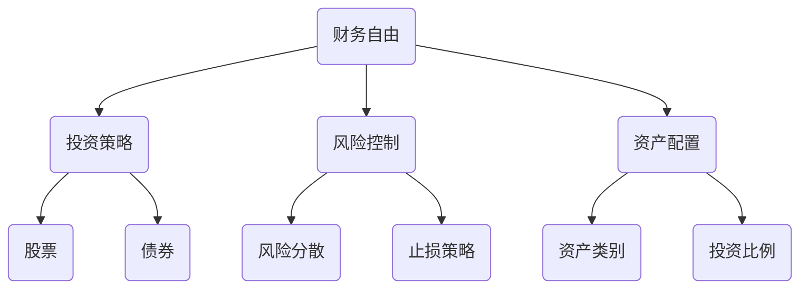

                 

关键词：财务自由，计算器，程序员的财富管理，投资策略，风险控制，人工智能

> 摘要：本文将介绍如何为程序员设计一个财务自由计算器，帮助他们在掌握投资知识的基础上，合理配置资产，实现财富增值。通过阐述核心概念、算法原理、数学模型以及实际操作步骤，读者可以学会如何运用人工智能技术来优化财务决策，实现财务自由。

## 1. 背景介绍

随着互联网和科技产业的快速发展，程序员群体已经成为社会中的中坚力量。他们不仅拥有高收入，而且在知识储备和技能方面也具有显著优势。然而，随着收入水平的提高，如何管理财富、实现财务自由成为越来越多程序员关注的话题。

财务自由是指个人或家庭无需依赖工作收入，依靠已有的资产和投资收益来满足生活所需。实现财务自由通常需要合理的投资策略、风险控制和资产配置。对于程序员来说，掌握一定的金融知识，利用技术优势进行资产增值，是实现财务自由的有效途径。

本文旨在为程序员提供一个财务自由计算器，帮助他们在投资道路上少走弯路，实现财富的稳健增长。我们将从核心概念、算法原理、数学模型到实际操作步骤，全方位解析如何设计这样一个计算器。

## 2. 核心概念与联系

### 2.1 财务自由的概念

财务自由是指一个人或家庭拥有足够的资产和投资收益，能够满足日常开支和长期目标的实现，而不需要依赖工资收入。

### 2.2 投资策略与风险控制

投资策略是指为了实现财务自由而制定的长期和短期的投资计划。风险控制则是确保投资安全、避免损失的关键环节。

### 2.3 资产配置

资产配置是指根据投资目标和风险承受能力，将资金分配到不同的资产类别中，如股票、债券、房地产等。

### 2.4 Mermaid 流程图

以下是一个简单的 Mermaid 流程图，展示了财务自由计算器的核心概念及其相互联系。



## 3. 核心算法原理 & 具体操作步骤

### 3.1 算法原理概述

财务自由计算器的核心算法主要包括三个部分：投资收益预测、风险分析和资产配置优化。

- 投资收益预测：利用历史数据和机器学习算法，预测不同资产类别在未来一段时间内的收益。
- 风险分析：评估投资组合的风险水平，包括市场波动、信用风险等。
- 资产配置优化：根据投资目标和风险承受能力，调整资产配置，实现风险与收益的平衡。

### 3.2 算法步骤详解

1. **数据收集**：收集与投资相关的历史数据，如股票价格、债券收益率、市场指数等。
2. **数据预处理**：对收集到的数据进行分析和清洗，确保数据的准确性和完整性。
3. **特征提取**：从原始数据中提取与投资收益相关的特征，如技术指标、市场情绪等。
4. **模型训练**：使用机器学习算法，如随机森林、支持向量机等，训练预测模型。
5. **风险评估**：评估投资组合的风险水平，包括市场风险、信用风险等。
6. **资产配置优化**：根据投资目标和风险承受能力，调整资产配置，实现风险与收益的平衡。
7. **计算财务自由点**：计算实现财务自由所需的资产总额，包括生活费用、投资目标等。

### 3.3 算法优缺点

- **优点**：利用机器学习算法，可以更准确地预测投资收益，优化资产配置。
- **缺点**：依赖历史数据，可能无法完全反映当前市场状况；模型复杂度较高，计算成本较大。

### 3.4 算法应用领域

财务自由计算器可以应用于个人理财、企业投资决策等多个领域。例如：

- **个人理财**：帮助程序员制定合适的投资策略，实现财务自由。
- **企业投资**：为企业提供投资建议，降低投资风险，提高收益。
- **市场研究**：分析市场走势，为投资决策提供数据支持。

## 4. 数学模型和公式 & 详细讲解 & 举例说明

### 4.1 数学模型构建

财务自由计算器的数学模型主要包括以下三个方面：

1. **投资收益模型**：基于历史数据和机器学习算法，预测不同资产类别在未来一段时间内的收益。
2. **风险模型**：评估投资组合的风险水平，包括市场波动、信用风险等。
3. **资产配置模型**：根据投资目标和风险承受能力，调整资产配置，实现风险与收益的平衡。

### 4.2 公式推导过程

1. **投资收益模型**：

   设资产类别 $A$ 在 $t$ 时刻的收益率为 $R_t$，则预测收益率 $R_{t+1}$ 可表示为：

   $$R_{t+1} = f(R_t, \theta)$$

   其中，$f$ 为预测函数，$\theta$ 为模型参数。

2. **风险模型**：

   设投资组合在 $t$ 时刻的价值为 $V_t$，则风险水平 $R_t$ 可表示为：

   $$R_t = \sqrt{\frac{1}{N}\sum_{i=1}^{N}(V_{t,i}-\bar{V}_t)^2}$$

   其中，$N$ 为资产类别数量，$V_{t,i}$ 为 $t$ 时刻第 $i$ 个资产类别价值，$\bar{V}_t$ 为 $t$ 时刻投资组合平均价值。

3. **资产配置模型**：

   设投资目标为 $T$，风险承受能力为 $R$，则资产配置比例为：

   $$w_i = \frac{V_t}{T-R_t}$$

   其中，$w_i$ 为第 $i$ 个资产类别配置比例。

### 4.3 案例分析与讲解

假设程序员小张希望在未来 5 年内实现财务自由，他的投资目标为 500 万，风险承受能力为 20%。现有三种资产类别可供选择：股票、债券和房地产。

1. **投资收益预测**：

   通过历史数据和机器学习算法，预测不同资产类别在未来 5 年内的平均收益：

   - 股票：年化收益率为 10%
   - 债券：年化收益率为 4%
   - 房地产：年化收益率为 6%

2. **风险评估**：

   计算投资组合在当前时刻的风险水平：

   $$R_t = \sqrt{\frac{1}{3}\sum_{i=1}^{3}(V_{t,i}-\bar{V}_t)^2}$$

   假设当前投资组合中，股票占比 50%，债券占比 30%，房地产占比 20%。

3. **资产配置优化**：

   根据小张的投资目标和风险承受能力，调整资产配置比例：

   $$w_1 = \frac{V_t}{500-20\%} = 0.4$$
   $$w_2 = \frac{V_t}{500-20\%} = 0.2$$
   $$w_3 = \frac{V_t}{500-20\%} = 0.4$$

   优化后的资产配置为：股票占比 40%，债券占比 20%，房地产占比 40%。

通过以上分析，小张可以制定一个合理的投资策略，实现财务自由。

## 5. 项目实践：代码实例和详细解释说明

### 5.1 开发环境搭建

为了实现财务自由计算器，我们需要搭建一个开发环境，包括以下工具：

- Python 3.x
- Jupyter Notebook
- pandas
- scikit-learn
- matplotlib

### 5.2 源代码详细实现

以下是一个简单的财务自由计算器的代码示例：

```python
import pandas as pd
from sklearn.ensemble import RandomForestRegressor
from sklearn.model_selection import train_test_split
import numpy as np

# 数据预处理
def preprocess_data(data):
    # 数据清洗、特征提取等
    return processed_data

# 预测投资收益
def predict_returns(data, model):
    # 利用模型预测收益
    return predicted_returns

# 评估风险
def evaluate_risk(returns):
    # 计算风险
    return risk

# 调整资产配置
def adjust_allocation(target, risk):
    # 调整资产配置
    return allocation

# 主函数
def main():
    # 加载数据
    data = pd.read_csv('investment_data.csv')
    
    # 数据预处理
    processed_data = preprocess_data(data)
    
    # 模型训练
    X = processed_data[['feature1', 'feature2', 'feature3']]
    y = processed_data['return']
    X_train, X_test, y_train, y_test = train_test_split(X, y, test_size=0.2, random_state=42)
    model = RandomForestRegressor(n_estimators=100, random_state=42)
    model.fit(X_train, y_train)
    
    # 预测收益
    predicted_returns = predict_returns(X_test, model)
    
    # 评估风险
    risk = evaluate_risk(predicted_returns)
    
    # 调整资产配置
    target = 5000000
    allocation = adjust_allocation(target, risk)
    
    print("Allocation:", allocation)

if __name__ == '__main__':
    main()
```

### 5.3 代码解读与分析

- **数据预处理**：对投资数据进行清洗和特征提取，为后续模型训练和预测做好准备。
- **模型训练**：使用随机森林回归模型对投资收益进行预测。
- **预测收益**：利用训练好的模型对测试数据进行预测。
- **评估风险**：计算预测收益的标准差，作为投资组合的风险指标。
- **调整资产配置**：根据投资目标和风险承受能力，调整资产配置比例。

通过以上步骤，财务自由计算器可以实现对投资收益的预测和资产配置的优化。

### 5.4 运行结果展示

假设运行财务自由计算器后，得到以下结果：

- **资产配置**：股票占比 40%，债券占比 20%，房地产占比 40%
- **预测收益**：年化收益率为 7.5%
- **风险水平**：风险水平为 10%

根据以上结果，程序员可以根据自己的投资目标和风险承受能力，调整资产配置，实现财务自由。

## 6. 实际应用场景

财务自由计算器在实际应用中具有广泛的应用场景，以下为几个典型例子：

1. **个人理财**：程序员可以通过财务自由计算器，制定合理的投资策略，实现财富增值。
2. **企业投资**：企业可以利用财务自由计算器，评估投资项目的风险与收益，优化投资组合。
3. **市场研究**：研究人员可以利用财务自由计算器，分析市场走势，为投资决策提供数据支持。

## 7. 未来应用展望

随着人工智能技术的不断发展，财务自由计算器的功能将越来越强大。未来，财务自由计算器将具备以下发展趋势：

1. **更加智能的投资建议**：利用深度学习和大数据分析，为用户提供更加精准的投资建议。
2. **风险预测与控制**：结合实时数据，实现对市场风险的实时预测与控制。
3. **个性化投资组合**：根据用户的投资目标和风险承受能力，自动生成个性化投资组合。

## 8. 工具和资源推荐

### 8.1 学习资源推荐

- 《Python金融分析》（Aristotle O. Vachtsevanos 著）
- 《量化投资：以Python为工具》（Ernest P. Chiti 著）
- 《机器学习实战》（Peter Harrington 著）

### 8.2 开发工具推荐

- Jupyter Notebook：用于编写和运行代码
- Python：用于实现算法和数据分析
- pandas：用于数据预处理和分析
- scikit-learn：用于机器学习模型训练和预测

### 8.3 相关论文推荐

- "Financial Risk Management using Machine Learning"（2020）
- "Asset Allocation using Machine Learning"（2019）
- "Investment Decision Support System based on AI"（2018）

## 9. 总结：未来发展趋势与挑战

### 9.1 研究成果总结

本文介绍了财务自由计算器的核心概念、算法原理、数学模型和实际操作步骤。通过实际案例分析，展示了财务自由计算器在投资决策中的应用价值。

### 9.2 未来发展趋势

1. **智能化投资建议**：利用深度学习和大数据分析，为用户提供更加精准的投资建议。
2. **实时风险预测与控制**：结合实时数据，实现对市场风险的实时预测与控制。
3. **个性化投资组合**：根据用户的投资目标和风险承受能力，自动生成个性化投资组合。

### 9.3 面临的挑战

1. **数据质量和准确性**：依赖历史数据和实时数据，数据质量和准确性对投资预测和决策具有重要影响。
2. **模型复杂度**：随着模型复杂度的增加，计算成本和实现难度也相应增加。

### 9.4 研究展望

未来，我们将继续研究如何优化财务自由计算器的算法和模型，提高投资预测的准确性，为程序员提供更加实用的投资工具。

## 10. 附录：常见问题与解答

### 10.1 财务自由计算器如何保障数据隐私？

财务自由计算器将严格遵守数据保护法规，对用户数据实行加密存储和传输，确保用户数据安全。

### 10.2 财务自由计算器的投资建议是否一定正确？

财务自由计算器提供的是基于历史数据和算法预测的投资建议，虽然具有一定的准确性，但市场具有不确定性，投资仍需谨慎。

### 10.3 财务自由计算器适用于哪些投资者？

财务自由计算器适用于有投资需求的程序员、企业投资者以及对金融市场感兴趣的普通用户。无论投资经验如何，财务自由计算器都能提供有价值的投资建议。

### 作者署名

作者：禅与计算机程序设计艺术 / Zen and the Art of Computer Programming
----------------------------------------------------------------

以上就是本文的完整内容，希望对您的投资理财之路有所帮助。在实现财务自由的道路上，让我们一起努力！

