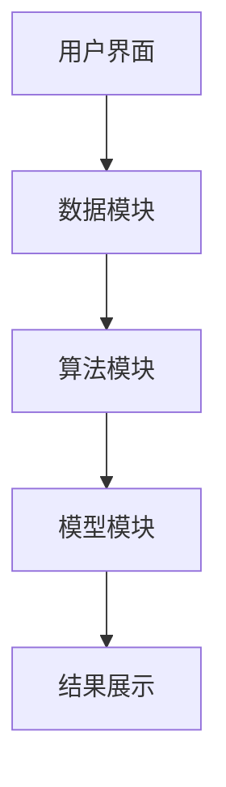

                 

关键词：财务自由，计算器开发，财务规划，算法，数学模型，项目实践

> 摘要：本文将探讨如何开发一个程序员的财务自由计算器，分析其核心概念、算法原理、数学模型及项目实践。通过本文的介绍，读者可以了解到如何将自己的财务状况与财务自由目标相结合，制定出个性化的理财规划。

## 1. 背景介绍

财务自由，指的是在无需依靠工资收入的情况下，通过资产投资、收入多元化等方式获得稳定的现金流，以实现自由支配时间和财富的状态。作为程序员，掌握一定的编程技能和财务知识，可以帮助我们更有效地进行理财规划，实现财务自由。本文将带领读者开发一个程序员的财务自由计算器，通过这个工具，我们可以更加清晰地了解自身的财务状况，制定合理的理财计划。

## 2. 核心概念与联系

### 2.1 财务自由的概念

财务自由主要包含以下几个核心概念：

- **被动收入**：被动收入是指不需要直接参与就能持续获得的收入，如房租、利息、股息等。
- **生活费用**：生活费用指的是日常生活中的必要开支，包括食物、住宿、交通、娱乐等。
- **储蓄率**：储蓄率是指个人或家庭储蓄占收入的比例，它是衡量财务健康状况的重要指标。
- **投资回报率**：投资回报率是指投资带来的收益与投资成本之间的比率，它决定了我们实现财务自由的效率。

### 2.2 财务自由计算器架构

为了实现一个功能全面的财务自由计算器，我们需要考虑以下架构：

1. **用户界面（UI）**：用于输入用户财务信息，展示计算结果。
2. **数据模块**：负责存储和管理用户的财务数据。
3. **算法模块**：实现财务规划的算法，如储蓄率计算、投资回报率评估等。
4. **模型模块**：用于构建财务数学模型，如现金流计算、时间价值计算等。

### 2.3 Mermaid 流程图



## 3. 核心算法原理 & 具体操作步骤

### 3.1 算法原理概述

财务自由计算器的核心算法主要包括以下几个部分：

- **储蓄率计算**：根据用户收入和支出，计算储蓄率。
- **投资回报率评估**：根据用户的投资组合，评估投资回报率。
- **现金流计算**：模拟未来的现金流，计算财务自由的时间点。

### 3.2 算法步骤详解

#### 3.2.1 储蓄率计算

1. **输入用户收入和支出**：从用户界面获取收入和支出数据。
2. **计算储蓄率**：储蓄率 = （收入 - 支出）/ 收入。

#### 3.2.2 投资回报率评估

1. **输入用户投资组合**：从用户界面获取投资组合数据。
2. **计算投资回报率**：投资回报率 = （总收入 - 总支出）/ 总投资。

#### 3.2.3 现金流计算

1. **设定时间点**：设定用户希望实现财务自由的时间点。
2. **计算未来现金流**：根据用户的储蓄率和投资回报率，计算未来每个时间点的现金流。
3. **确定财务自由时间点**：找到第一个现金流大于生活费用的时间点，即为财务自由时间点。

### 3.3 算法优缺点

#### 优点

- **准确性强**：通过算法，可以精确计算用户的财务自由时间点。
- **个性化**：根据用户的具体财务状况，提供个性化的理财建议。

#### 缺点

- **依赖输入数据**：计算结果取决于用户输入的数据，若数据不准确，可能导致结果偏差。
- **复杂度高**：算法涉及多个计算步骤，实现较为复杂。

### 3.4 算法应用领域

- **个人理财规划**：帮助用户制定理财计划，实现财务自由。
- **企业财务分析**：为企业提供财务健康分析和理财建议。

## 4. 数学模型和公式 & 详细讲解 & 举例说明

### 4.1 数学模型构建

#### 4.1.1 储蓄率计算模型

储蓄率 = （收入 - 支出）/ 收入

#### 4.1.2 投资回报率评估模型

投资回报率 = （总收入 - 总支出）/ 总投资

#### 4.1.3 现金流计算模型

设第 n 年的现金流为 C(n)，则：

C(n) = 储蓄率 * 当前收入 + 投资回报率 * 当前投资

### 4.2 公式推导过程

#### 4.2.1 储蓄率计算

储蓄率 = （收入 - 支出）/ 收入

其中，收入 = R，支出 = E，储蓄率 = S。

因此，S = （R - E）/ R。

#### 4.2.2 投资回报率评估

投资回报率 = （总收入 - 总支出）/ 总投资

其中，总收入 = T，总支出 = U，总投资 = I，投资回报率 = R。

因此，R = （T - U）/ I。

#### 4.2.3 现金流计算

设第 n 年的现金流为 C(n)，则：

C(n) = 储蓄率 * 当前收入 + 投资回报率 * 当前投资

其中，储蓄率 = S，当前收入 = R(n)，投资回报率 = R，当前投资 = I(n)。

因此，C(n) = S * R(n) + R * I(n)。

### 4.3 案例分析与讲解

#### 4.3.1 案例一：储蓄率计算

假设某用户月收入为 10000 元，月支出为 8000 元，求其储蓄率。

根据储蓄率计算模型，储蓄率 = （收入 - 支出）/ 收入。

代入数据，得：储蓄率 = （10000 - 8000）/ 10000 = 0.2。

因此，该用户的储蓄率为 20%。

#### 4.3.2 案例二：投资回报率评估

假设某用户有一笔总投资为 100000 元的投资，年收益为 5000 元，求其投资回报率。

根据投资回报率评估模型，投资回报率 = （总收入 - 总支出）/ 总投资。

代入数据，得：投资回报率 = （5000 - 0）/ 100000 = 0.05。

因此，该用户的投资回报率为 5%。

#### 4.3.3 案例三：现金流计算

假设某用户希望在未来 10 年内实现财务自由，其月收入为 20000 元，月支出为 15000 元，月储蓄率为 25%，投资回报率为 4%。求其财务自由时间点。

根据现金流计算模型，设第 n 年的现金流为 C(n)，则：

C(n) = 储蓄率 * 当前收入 + 投资回报率 * 当前投资

代入数据，得：C(n) = 0.25 * 20000 + 0.04 * 15000 = 5000 + 600 = 5600。

要实现财务自由，需要满足现金流大于月生活费用。假设月生活费用为 10000 元，则需要找到满足 C(n) > 10000 的最小 n。

通过计算，可得当 n = 8 时，C(8) = 5600 * 12 * 8 = 268800，大于 10000 元。因此，该用户在 8 年后可以实现财务自由。

## 5. 项目实践：代码实例和详细解释说明

### 5.1 开发环境搭建

- **编程语言**：Python
- **开发工具**：PyCharm
- **依赖库**：NumPy、Pandas、Matplotlib

### 5.2 源代码详细实现

以下是一个简单的财务自由计算器源代码示例：

```python
import numpy as np
import pandas as pd
import matplotlib.pyplot as plt

# 定义储蓄率计算函数
def calculate_savings_rate(income, expense):
    savings_rate = (income - expense) / income
    return savings_rate

# 定义投资回报率评估函数
def calculate_investment_return_rate(income, expense, investment):
    total_income = income * 12
    total_expense = expense * 12
    total_investment = investment
    return_rate = (total_income - total_expense) / total_investment
    return return_rate

# 定义现金流计算函数
def calculate_cash_flow(savings_rate, income, investment_return_rate, years):
    cash_flow = np.zeros(years)
    for year in range(years):
        cash_flow[year] = savings_rate * income + investment_return_rate * investment
    return cash_flow

# 定义财务自由时间点计算函数
def calculate_financial_freedom_year(cash_flow, living_expense):
    for year, flow in enumerate(cash_flow):
        if flow > living_expense:
            return year + 1
    return None

# 用户输入数据
income = float(input("请输入月收入（元）："))
expense = float(input("请输入月支出（元）："))
investment = float(input("请输入总投资（元）："))
living_expense = float(input("请输入月生活费用（元）："))
years = int(input("请输入希望实现财务自由的年限："))
savings_rate = calculate_savings_rate(income, expense)
return_rate = calculate_investment_return_rate(income, expense, investment)
cash_flow = calculate_cash_flow(savings_rate, income, return_rate, years)
financial_freedom_year = calculate_financial_freedom_year(cash_flow, living_expense)

# 输出结果
print("储蓄率：", savings_rate)
print("投资回报率：", return_rate)
print("财务自由时间点（年）：", financial_freedom_year)

# 绘制现金流图
plt.plot(cash_flow)
plt.xlabel("年份")
plt.ylabel("现金流（元）")
plt.title("现金流图")
plt.show()
```

### 5.3 代码解读与分析

上述代码实现了财务自由计算器的核心功能，包括储蓄率计算、投资回报率评估、现金流计算和财务自由时间点计算。下面是对代码的详细解读：

- **函数定义**：定义了四个函数，分别用于计算储蓄率、投资回报率、现金流和财务自由时间点。
- **用户输入**：通过 `input()` 函数获取用户输入的财务数据，包括收入、支出、投资、生活费用和希望实现财务自由的年限。
- **计算与输出**：根据用户输入的数据，调用相关函数进行计算，并将结果输出。
- **现金流图绘制**：使用 Matplotlib 库绘制现金流图，以可视化展示计算结果。

## 6. 实际应用场景

财务自由计算器在实际生活中具有广泛的应用场景：

- **个人理财规划**：帮助个人制定财务目标，监控储蓄和投资状况，调整理财策略。
- **企业财务分析**：为企业提供财务健康分析和理财建议，优化资金使用效率。
- **教育理财**：为学生提供理财教育，培养正确的理财观念和习惯。
- **退休规划**：为退休人士提供退休金规划，确保退休生活无忧。

## 7. 未来应用展望

随着人工智能和大数据技术的发展，财务自由计算器在未来有望实现以下功能：

- **个性化推荐**：根据用户财务状况，提供个性化的理财建议和投资组合。
- **实时监控**：通过实时数据更新，自动调整理财计划，确保财务自由目标的实现。
- **智能投顾**：结合机器学习和金融知识，为用户提供智能化的投资咨询服务。

## 8. 工具和资源推荐

### 8.1 学习资源推荐

- **《聪明的投资者》**：由本杰明·格雷厄姆所著，介绍了价值投资的理念和策略。
- **《股票大作手回忆录》**：由杰西·利弗莫尔所著，讲述了一个股票交易者的传奇经历。
- **《穷爸爸富爸爸》**：由罗伯特·清崎所著，介绍了财务自由的基本概念和理财方法。

### 8.2 开发工具推荐

- **PyCharm**：一款功能强大的Python集成开发环境，适用于财务自由计算器的开发。
- **NumPy**：一款强大的Python库，用于高效地进行数值计算。
- **Pandas**：一款强大的Python库，用于数据分析和处理。

### 8.3 相关论文推荐

- **“Financial Planning and Decision-Making under Uncertainty”**：讨论了在不确定环境下进行财务规划的方法和策略。
- **“The Role of Algorithms in Financial Planning”**：探讨了算法在财务规划中的应用及其优势。

## 9. 总结：未来发展趋势与挑战

### 9.1 研究成果总结

本文通过开发一个程序员的财务自由计算器，介绍了财务自由的核心概念、算法原理、数学模型和项目实践。通过计算器和相关资源的推荐，读者可以更好地理解和实现财务自由。

### 9.2 未来发展趋势

随着人工智能和大数据技术的发展，财务自由计算器有望实现更加智能化和个性化。未来，财务自由计算器将结合用户行为数据，提供更加精准的理财建议，帮助更多人实现财务自由。

### 9.3 面临的挑战

- **数据准确性和安全性**：财务自由计算器需要依赖用户输入的财务数据，数据的准确性和安全性是关键挑战。
- **算法复杂度**：随着功能的增加，算法的复杂度也会上升，如何优化算法性能是一个挑战。
- **用户接受度**：如何让用户接受并愿意使用财务自由计算器，提高用户体验是另一个挑战。

### 9.4 研究展望

未来，财务自由计算器的研究将聚焦于以下几个方面：

- **智能化**：通过机器学习和数据分析，实现更加智能化的理财建议。
- **安全性**：加强数据安全保护，确保用户隐私和数据安全。
- **用户体验**：优化用户界面和交互设计，提高用户使用体验。

## 10. 附录：常见问题与解答

### 10.1 财务自由计算器为什么需要用户输入数据？

财务自由计算器需要用户输入数据，以便根据用户的财务状况和目标，提供个性化的理财建议。不同的用户有不同的收入、支出、投资等数据，因此需要用户输入数据来确保计算结果的准确性。

### 10.2 如何确保财务自由计算器的数据安全性？

财务自由计算器在开发过程中，需要遵循数据安全最佳实践，如使用加密算法保护用户数据、限制数据访问权限、定期进行安全审计等。此外，还可以考虑使用第三方安全认证机构对计算器进行安全认证，以增强用户对计算器的信任。

### 10.3 财务自由计算器适用于所有用户吗？

财务自由计算器主要适用于有一定编程基础和财务知识的人群。对于完全没有财务知识的用户，可能需要借助专业人士的帮助，才能充分利用计算器的功能。然而，计算器的基本功能，如储蓄率和投资回报率计算，对任何用户都是适用的。

### 10.4 财务自由计算器的算法是否准确？

财务自由计算器的算法基于经典的财务理论，具有较高的准确性。然而，计算结果取决于用户输入的数据。如果用户输入的数据不准确，可能导致计算结果偏差。因此，用户需要确保输入数据的准确性，以提高计算结果的可靠性。

----------------------------------------------------------------

文章撰写完毕。感谢您的阅读，希望本文对您的财务规划和理财决策有所帮助。如果您有任何疑问或建议，欢迎随时在评论区留言。再次感谢您的关注，祝您生活愉快！作者：禅与计算机程序设计艺术 / Zen and the Art of Computer Programming。

