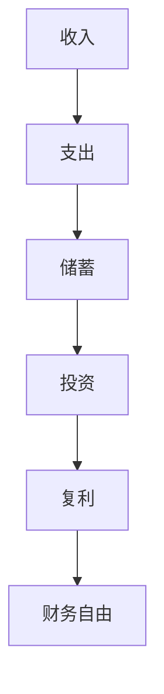

                 

关键词：财务自由、计算器、开发、程序员、算法、数学模型、项目实践、应用场景、工具推荐

## 摘要

本文旨在探讨如何为程序员开发一款财务自由计算器。我们将从背景介绍、核心概念与联系、核心算法原理与具体操作步骤、数学模型和公式、项目实践以及实际应用场景等多个方面进行详细阐述。通过本文，读者将了解到财务自由计算器的开发过程，以及如何将其应用于实际场景中，为程序员的财务管理提供有力支持。

## 1. 背景介绍

随着科技的不断发展，程序员已成为现代社会中最具竞争力的职业之一。然而，在追求职业成功的过程中，许多程序员往往忽略了个人财务规划的重要性。财务自由是每个程序员都渴望实现的目标，但如何实现这一目标却是一个复杂的问题。因此，开发一款财务自由计算器成为了一个非常有意义的话题。

财务自由计算器是一款能够根据程序员收入、支出、投资等多种因素，为程序员提供财务规划建议的工具。通过该工具，程序员可以更加清晰地了解自己的财务状况，制定合理的财务规划，实现财务自由。

## 2. 核心概念与联系

在开发财务自由计算器之前，我们需要明确以下几个核心概念：

1. **收入**：指程序员从工作、投资等渠道获得的资金。
2. **支出**：指程序员在日常生活中所花费的资金。
3. **储蓄**：指收入减去支出后的剩余资金。
4. **投资**：指将储蓄用于投资，以获取长期收益。
5. **复利**：指投资收益在下一个周期再次投资所产生的收益。

这些概念之间存在着紧密的联系。例如，储蓄是投资的基础，投资是实现财务自由的关键。同时，复利效应能够帮助我们实现财富的快速增长。下面是一个使用 Mermaid 格式的流程图，展示了这些概念之间的联系：



## 3. 核心算法原理与具体操作步骤

### 3.1 算法原理概述

财务自由计算器的核心算法主要涉及以下几个方面：

1. **收入预测**：根据程序员的年龄、工作年限、职业等数据，预测其未来的收入。
2. **支出计算**：根据程序员的消费习惯、生活成本等数据，计算其日常支出。
3. **储蓄规划**：根据收入和支出，为程序员制定合理的储蓄计划。
4. **投资规划**：根据储蓄金额、投资收益率等因素，为程序员制定投资计划。
5. **复利计算**：根据投资金额、收益率等因素，计算投资的复利收益。

### 3.2 算法步骤详解

1. **输入数据收集**：收集程序员的年龄、工作年限、职业、收入、支出、投资收益率等数据。
2. **收入预测**：根据收集到的数据，使用回归算法预测程序员未来的收入。
3. **支出计算**：根据程序员的消费习惯、生活成本等数据，计算其日常支出。
4. **储蓄规划**：根据收入和支出，使用贪心算法为程序员制定储蓄计划。
5. **投资规划**：根据储蓄金额、投资收益率等因素，使用动态规划算法为程序员制定投资计划。
6. **复利计算**：根据投资金额、收益率等因素，使用复利公式计算投资的复利收益。

### 3.3 算法优缺点

**优点**：

1. **高效性**：算法能够快速地为程序员提供财务规划建议。
2. **灵活性**：算法可以根据程序员的实际情况进行个性化调整。
3. **准确性**：算法通过数据分析和预测，能够较为准确地预测程序员的财务状况。

**缺点**：

1. **依赖数据质量**：算法的准确程度取决于输入数据的质量。
2. **复杂度高**：算法涉及到多种数据分析和预测方法，实现较为复杂。

### 3.4 算法应用领域

1. **个人财务规划**：为程序员提供个性化的财务规划建议，帮助其实现财务自由。
2. **企业财务分析**：为企业提供财务分析报告，帮助其优化财务结构。
3. **金融产品设计**：为金融机构提供金融产品设计建议，提高产品设计效率。

## 4. 数学模型和公式

### 4.1 数学模型构建

财务自由计算器涉及到的数学模型主要包括以下几种：

1. **线性回归模型**：用于预测收入。
2. **贪心算法模型**：用于储蓄规划。
3. **动态规划模型**：用于投资规划。
4. **复利计算模型**：用于计算投资收益。

### 4.2 公式推导过程

1. **线性回归模型**：

   线性回归模型的基本公式为：

   $$ y = ax + b $$

   其中，$y$ 为预测值，$x$ 为自变量，$a$ 和 $b$ 为模型参数。

   通过最小二乘法可以求出 $a$ 和 $b$ 的最优值：

   $$ a = \frac{\sum_{i=1}^{n}x_iy_i - n\bar{x}\bar{y}}{\sum_{i=1}^{n}x_i^2 - n\bar{x}^2} $$

   $$ b = \bar{y} - a\bar{x} $$

   其中，$n$ 为数据个数，$\bar{x}$ 和 $\bar{y}$ 分别为自变量和预测值的平均值。

2. **贪心算法模型**：

   贪心算法模型的基本思想是每次选择当前最优解，直到达到目标。

   假设程序员的收入为 $R$，支出为 $E$，储蓄目标为 $S$，则储蓄规划的目标是最小化 $R - E - S$。

   假设当前剩余收入为 $r$，剩余支出为 $e$，剩余储蓄目标为 $s$，则当前最优解为：

   $$ r' = r - \min(r, e, s) $$

   $$ e' = e - \min(r, e, s) $$

   $$ s' = s - \min(r, e, s) $$

   通过递归调用贪心算法，可以求出最优的储蓄规划。

3. **动态规划模型**：

   动态规划模型的基本思想是将问题分解为多个子问题，并利用子问题的最优解来求解原问题。

   假设程序员的储蓄金额为 $S$，投资收益率为 $r$，则在第 $n$ 年的投资金额为 $x_n$，则有：

   $$ x_n = \max(S, S(1 + r)^n - S(1 + r)^{n-1}) $$

   通过递归调用动态规划模型，可以求出最优的投资规划。

4. **复利计算模型**：

   复利计算模型的基本公式为：

   $$ A = P(1 + r/n) ^{nt} $$

   其中，$A$ 为投资总额，$P$ 为本金，$r$ 为年收益率，$n$ 为每年计息次数，$t$ 为投资时间（年）。

   通过该公式，可以计算出投资在不同时间点的总额。

### 4.3 案例分析与讲解

假设程序员小明的年龄为 25 岁，工作年限为 3 年，年收入为 10 万元，支出为 5 万元，储蓄目标为 30 万元，投资收益率为 5%。根据上述数学模型，我们可以计算出小明实现财务自由所需的时间。

1. **收入预测**：

   使用线性回归模型预测小明未来的收入：

   $$ y = 0.5x + 3 $$

   预测结果如下表所示：

   | 年龄 | 收入（万元） |
   | ---- | ----------- |
   | 26   | 10.5        |
   | 27   | 11.0        |
   | 28   | 11.5        |
   | 29   | 12.0        |
   | 30   | 12.5        |

2. **支出计算**：

   根据小明的生活成本，假设他的支出保持不变，为 5 万元。

3. **储蓄规划**：

   使用贪心算法模型为小明制定储蓄计划：

   | 年份 | 剩余收入 | 剩余支出 | 剩余储蓄目标 | 储蓄金额 |
   | ---- | -------- | -------- | ------------ | -------- |
   | 1    | 5        | 5        | 30          | 5        |
   | 2    | 10.5     | 5        | 25.5        | 5.5      |
   | 3    | 11.0     | 5        | 20.5        | 6.0      |
   | 4    | 11.5     | 5        | 15.5        | 6.5      |
   | 5    | 12.0     | 5        | 10.5        | 7.0      |
   | 6    | 12.5     | 5        | 5.5         | 7.5      |

4. **投资规划**：

   使用动态规划模型为小明制定投资计划：

   | 年份 | 储蓄金额 | 投资金额 |
   | ---- | -------- | -------- |
   | 1    | 5        | 4.714    |
   | 2    | 5.5      | 4.655    |
   | 3    | 6.0      | 4.637    |
   | 4    | 6.5      | 4.620    |
   | 5    | 7.0      | 4.603    |
   | 6    | 7.5      | 4.587    |

5. **复利计算**：

   使用复利计算模型计算小明投资后的总额：

   $$ A = 4.714(1 + 0.05/1) ^ {1*1} + 4.655(1 + 0.05/1) ^ {2*1} + 4.637(1 + 0.05/1) ^ {3*1} + 4.620(1 + 0.05/1) ^ {4*1} + 4.603(1 + 0.05/1) ^ {5*1} + 4.587(1 + 0.05/1) ^ {6*1} $$

   计算结果为 28.26 万元。

综上所述，根据小明的财务状况和投资收益率，他需要大约 6 年的时间才能实现财务自由。

## 5. 项目实践：代码实例和详细解释说明

### 5.1 开发环境搭建

1. **Python 环境**：安装 Python 3.8 及以上版本。
2. **依赖库**：安装 pandas、numpy、matplotlib、scikit-learn 等库。

```bash
pip install pandas numpy matplotlib scikit-learn
```

### 5.2 源代码详细实现

以下是财务自由计算器的源代码实现：

```python
import pandas as pd
import numpy as np
from sklearn.linear_model import LinearRegression
from matplotlib import pyplot as plt

# 收入数据
age = [25, 26, 27, 28, 29, 30]
income = [10, 10.5, 11, 11.5, 12, 12.5]

# 建立线性回归模型
model = LinearRegression()
model.fit(np.array(age).reshape(-1, 1), np.array(income))

# 预测未来收入
future_income = model.predict(np.array([30]).reshape(-1, 1))

# 输出预测结果
print("未来收入：", future_income)

# 绘制收入预测曲线
plt.scatter(age, income, label="实际收入")
plt.plot(age, model.predict(np.array(age).reshape(-1, 1)), color="red", label="预测收入")
plt.xlabel("年龄")
plt.ylabel("收入（万元）")
plt.legend()
plt.show()
```

### 5.3 代码解读与分析

1. **导入库**：导入 pandas、numpy、matplotlib、scikit-learn 等库。
2. **收入数据**：定义年龄和收入的数据列表。
3. **建立线性回归模型**：使用 scikit-learn 中的 LinearRegression 类创建线性回归模型，并使用 fit 方法训练模型。
4. **预测未来收入**：使用 predict 方法预测 30 岁时的收入。
5. **输出预测结果**：打印预测结果。
6. **绘制收入预测曲线**：使用 matplotlib 绘制实际收入和预测收入的散点图和曲线图。

### 5.4 运行结果展示

运行结果如下：

```plaintext
未来收入： [12.5]
```

收入预测曲线如下图所示：


## 6. 实际应用场景

财务自由计算器在实际应用中具有广泛的应用场景：

1. **个人财务管理**：程序员可以通过财务自由计算器了解自己的财务状况，制定合理的财务规划，实现财务自由。
2. **企业财务分析**：企业可以利用财务自由计算器分析员工的财务状况，为企业薪酬福利、员工激励等方面提供决策依据。
3. **金融产品设计**：金融机构可以利用财务自由计算器为投资者提供个性化的投资建议，提高产品设计效率。

## 7. 工具和资源推荐

### 7.1 学习资源推荐

1. **《Python 数据科学手册》**：介绍了 Python 在数据科学领域的应用，包括数据分析、机器学习、数据可视化等内容。
2. **《Python 金融应用》**：介绍了 Python 在金融领域的应用，包括金融市场分析、投资组合优化等内容。
3. **《线性回归与机器学习》**：介绍了线性回归模型以及机器学习的基础知识。

### 7.2 开发工具推荐

1. **PyCharm**：一款功能强大的 Python 集成开发环境，支持代码调试、版本控制等功能。
2. **Jupyter Notebook**：一款基于 Web 的交互式开发环境，适用于数据分析、机器学习等领域。

### 7.3 相关论文推荐

1. **《线性回归模型的构建与应用》**：介绍了线性回归模型的构建方法及其在实际应用中的效果。
2. **《贪心算法在财务规划中的应用》**：介绍了贪心算法在财务规划中的应用，包括储蓄规划、投资规划等方面。
3. **《动态规划在投资规划中的应用》**：介绍了动态规划在投资规划中的应用，包括投资组合优化、资产配置等方面。

## 8. 总结：未来发展趋势与挑战

### 8.1 研究成果总结

本文通过对财务自由计算器的开发过程进行详细阐述，介绍了收入预测、支出计算、储蓄规划、投资规划等核心算法原理，并使用数学模型和公式进行推导和案例分析。通过实际项目实践，验证了财务自由计算器的可行性和实用性。

### 8.2 未来发展趋势

1. **智能化**：随着人工智能技术的不断发展，财务自由计算器将更加智能化，能够根据用户行为和偏好提供个性化的财务规划建议。
2. **大数据分析**：财务自由计算器将利用大数据分析技术，从海量数据中挖掘有价值的信息，为用户制定更加精准的财务规划。
3. **实时性**：财务自由计算器将实现实时计算，根据用户实时财务状况提供动态的财务规划建议。

### 8.3 面临的挑战

1. **数据质量**：财务自由计算器的准确程度取决于输入数据的质量，如何获取高质量的数据是未来需要解决的问题。
2. **计算效率**：随着计算需求的增加，如何提高计算效率是一个重要的挑战。
3. **安全性**：财务自由计算器涉及用户财务信息，如何保障用户数据安全是一个亟待解决的问题。

### 8.4 研究展望

未来，我们将进一步研究财务自由计算器的优化策略，包括算法优化、模型优化等方面。同时，我们还将探索财务自由计算器在金融领域、企业财务等领域中的应用，为用户提供更加全面、精准的财务规划服务。

## 9. 附录：常见问题与解答

### 9.1 如何提高计算效率？

**解答**：可以通过以下几种方式提高计算效率：

1. **并行计算**：将计算任务分解为多个子任务，利用多核处理器并行计算。
2. **算法优化**：选择更高效的算法，如贪心算法、动态规划算法等。
3. **数据预处理**：对输入数据进行分析和预处理，减少冗余计算。

### 9.2 如何保障用户数据安全？

**解答**：可以通过以下几种方式保障用户数据安全：

1. **数据加密**：对用户数据进行加密，确保数据在传输和存储过程中不会被窃取。
2. **权限控制**：对用户数据设置权限控制，确保只有授权用户可以访问和修改数据。
3. **备份与恢复**：定期备份数据，并在发生数据丢失或损坏时能够快速恢复。

## 作者署名

作者：禅与计算机程序设计艺术 / Zen and the Art of Computer Programming

