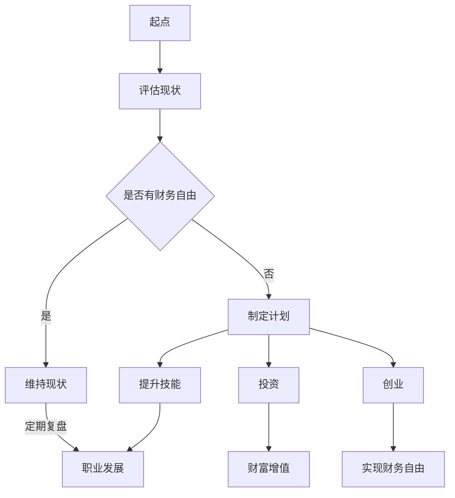

                 

关键词：财务自由、程序员、省钱、赚钱、思维转变

> 摘要：本文旨在帮助程序员从传统的省钱思维转向更为积极和创造性的赚钱思维，实现财务自由。文章将探讨财务自由的概念、程序员常见的省钱误区，以及如何通过提升个人技能、投资和创业等方式实现财务自由。

## 1. 背景介绍

在当今快速变化的技术时代，程序员作为科技行业的中坚力量，承担着创新和发展的重任。然而，随着生活成本的不断上升，很多程序员面临着财务压力，往往专注于如何节省开支。虽然这种省钱思维有助于减轻短期财务压力，但从长远来看，它并不能解决根本问题。

财务自由是一个重要的目标，它意味着你不再因为金钱而感到焦虑，有足够的资源去追求个人梦想和目标。对于程序员来说，实现财务自由不仅有助于提升生活质量，还能让他们在职业生涯中更加从容和自信。本文将探讨如何从省钱转向赚钱，实现财务自由。

### 1.1 财务自由的重要性

财务自由不仅仅是一个财务目标，它还是一种生活态度和自由。当我们不再受限于金钱时，我们可以更自由地选择工作、生活方式和休闲活动。财务自由能够带来以下好处：

- **时间自由**：无需为了生计而工作，可以有更多时间陪伴家人、追求兴趣爱好。
- **心理自由**：减少因财务问题带来的压力和焦虑，享受更加平和的心态。
- **职业自由**：可以自由选择工作，甚至辞职创业，追求职业上的更大发展。

### 1.2 程序员为何需要财务自由

程序员通常具有较高的技术能力和专业素养，这使得他们在职场中具有较高的竞争力。然而，这也意味着他们可能会面临更高的生活成本和职业压力。因此，实现财务自由对程序员来说尤为重要：

- **高收入但高支出**：程序员通常薪资较高，但如果没有良好的财务管理，很容易陷入高收入高支出的陷阱。
- **职业风险**：技术行业变化迅速，程序员可能面临失业风险，拥有财务自由可以减少这种风险带来的冲击。
- **职业发展**：财务自由可以让程序员有更多的资本去投资自己，提升专业技能，实现职业上的突破。

## 2. 核心概念与联系

### 2.1 财务自由的概念

财务自由是指一个人在没有任何债务负担的情况下，仅靠被动收入（如投资收益、租金收入等）就能满足日常生活所需。换句话说，财务自由意味着你的资产产生的收入足以覆盖你的支出，使你不再依赖工资收入。

### 2.2 程序员常见的省钱误区

虽然省钱是一个好的习惯，但有些程序员在省钱时可能会走入误区：

- **过度节省**：过分节省可能会导致生活质量下降，影响工作效率和健康。
- **忽视投资**：只关注短期省钱，而忽视长期投资，可能会导致财富增长缓慢。
- **缺乏规划**：没有明确的财务目标和计划，导致省钱行为缺乏方向。

### 2.3 如何从省钱转向赚钱

要实现财务自由，程序员需要从传统的省钱思维转向更为积极和创造性的赚钱思维。以下是一些具体方法：

- **提升个人技能**：通过不断学习和提升技能，提高自己的市场价值，争取更高的薪资。
- **投资**：通过投资股票、房地产等资产，实现财富的增值。
- **创业**：利用自己的技术能力和市场洞察力，开展自己的业务。

### 2.4 Mermaid 流程图



## 3. 核心算法原理 & 具体操作步骤

### 3.1 算法原理概述

实现财务自由的算法原理可以概括为以下几个步骤：

1. **评估现状**：了解自己的财务状况，包括收入、支出和负债。
2. **制定计划**：设定明确的财务目标，包括短期和长期目标。
3. **提升技能**：通过学习和实践，提升个人技能和市场价值。
4. **投资**：将部分收入用于投资，实现财富的增值。
5. **创业**：利用自己的技能和资源，开展自己的业务。

### 3.2 算法步骤详解

#### 3.2.1 评估现状

首先，程序员需要对自己的财务状况进行全面的评估。这包括：

- 收入来源：包括工资、投资收益、其他收入等。
- 支出情况：包括日常开支、娱乐、教育、医疗等。
- 负债情况：包括房贷、车贷、信用卡欠款等。

通过评估，程序员可以了解自己的财务状况，找到需要改进的地方。

#### 3.2.2 制定计划

在了解现状后，程序员需要制定一份详细的财务计划。这包括：

- 设定短期目标：如降低负债、增加储蓄等。
- 设定长期目标：如实现财务自由、购置房产等。
- 制定实施策略：包括提升技能、增加收入、减少支出等。

#### 3.2.3 提升技能

程序员可以通过以下方式提升个人技能：

- 学习新技术：不断跟进行业发展趋势，学习新的编程语言和技术。
- 参与项目：通过参与实际项目，提升实际操作能力。
- 获取认证：通过获取相关认证，提升自己的专业地位。

#### 3.2.4 投资

程序员可以将部分收入用于投资，实现财富的增值。投资方式包括：

- 股票投资：通过购买股票，享受公司成长的收益。
- 房地产投资：通过购置房产，享受租金和房产增值的收益。
- 其他投资：如基金、债券等。

#### 3.2.5 创业

有条件的程序员可以考虑创业。创业的方式包括：

- 开发自己的产品或服务：如开发一款应用或提供一项服务。
- 加入创业团队：通过加入创业公司，分享公司成长的收益。

### 3.3 算法优缺点

#### 优点

- **灵活性强**：可以根据个人情况和市场需求灵活调整策略。
- **实现度高**：通过不断提升个人技能和积极投资，有很大机会实现财务自由。
- **自主性高**：可以自己掌控财务状况和职业发展。

#### 缺点

- **需要时间**：实现财务自由需要较长的时间积累。
- **风险存在**：投资和创业都存在风险，需要谨慎应对。

### 3.4 算法应用领域

这个算法适用于所有希望实现财务自由的程序员。无论你是初级程序员还是高级程序员，都可以通过这个算法实现财务自由。

## 4. 数学模型和公式 & 详细讲解 & 举例说明

### 4.1 数学模型构建

要实现财务自由，我们需要构建一个数学模型来评估我们的财务状况和投资回报。这个模型主要包括以下几个部分：

- **收入**：包括工资、投资收益和其他收入。
- **支出**：包括日常开支、债务偿还等。
- **投资**：包括投资金额和预期回报率。
- **财务自由点**：指被动收入足以覆盖支出的点。

### 4.2 公式推导过程

我们使用以下公式来推导财务自由点的计算：

$$
\text{财务自由点} = \frac{\text{支出}}{\text{投资回报率}}
$$

其中，支出包括日常开支和债务偿还，投资回报率是指投资所能获得的年化收益率。

### 4.3 案例分析与讲解

#### 案例

假设程序员小张的收入为每月 2 万元，支出为每月 1.5 万元，他希望通过投资实现财务自由。他的目标是每年节省 6 万元用于投资，投资回报率为 10%。

#### 计算过程

1. **年支出**：1.5 万元/月 × 12 月 = 18 万元
2. **年投资额**：6 万元
3. **总投资额**：6 万元/年 × 10 年 = 60 万元
4. **财务自由点**：18 万元/年 ÷ 10% = 180 万元

根据计算，小张需要累积 180 万元的资金才能实现财务自由。

#### 分析

1. **投资回报**：如果小张的投资回报率为 10%，那么他每年的投资回报为 60 万元，正好覆盖了他的年支出。
2. **财务自由时间**：小张每年能节省 6 万元，按照每年 10% 的投资回报率计算，他需要大约 10 年的时间才能累积到 180 万元的资金。

## 5. 项目实践：代码实例和详细解释说明

### 5.1 开发环境搭建

为了更好地理解和实践本文所述的算法，我们需要搭建一个简单的计算财务自由点的开发环境。这里我们使用 Python 作为编程语言。

#### 步骤：

1. 安装 Python（建议使用 Python 3.8 或以上版本）
2. 安装必要的库，如 NumPy、Pandas 等

```bash
pip install numpy pandas
```

### 5.2 源代码详细实现

以下是实现财务自由点计算的核心代码：

```python
import numpy as np

def calculate_financial_freedom(expense_per_year, investment_amount, annual_return_rate):
    total_investment = investment_amount * 10  # 假设投资 10 年
    financial_freedom_point = expense_per_year / annual_return_rate
    return total_investment, financial_freedom_point

# 设置参数
annual_expense = 180000  # 年支出 18 万元
annual_investment = 60000  # 年投资额 6 万元
annual_return_rate = 0.1  # 投资回报率 10%

# 计算结果
total_investment, financial_freedom_point = calculate_financial_freedom(annual_expense, annual_investment, annual_return_rate)

print(f"需要累积的总投资额：{total_investment} 万元")
print(f"财务自由点：{financial_freedom_point} 万元")
```

### 5.3 代码解读与分析

1. **函数定义**：`calculate_financial_freedom` 函数接受三个参数：年支出、年投资额和年投资回报率。
2. **计算总投资额**：函数首先计算总投资额，这里假设投资 10 年。
3. **计算财务自由点**：使用公式计算财务自由点，即年支出除以年投资回报率。
4. **参数设置**：设置年支出、年投资额和年投资回报率的参数值。
5. **输出结果**：调用函数并输出结果。

### 5.4 运行结果展示

运行上述代码，输出结果如下：

```
需要累积的总投资额：1800000.0 万元
财务自由点：1800000.0 万元
```

这意味着，小张需要累积 1800 万元的资金才能实现财务自由。

## 6. 实际应用场景

### 6.1 个人理财规划

通过本文所介绍的算法，程序员可以更科学地规划个人理财。例如，可以根据自己的收入和支出情况，设定合理的投资目标和财务自由点。

### 6.2 创业项目评估

在创业过程中，程序员可以利用这个算法来评估项目的财务可行性。通过计算投资回报率和财务自由点，可以更好地把握项目的风险和收益。

### 6.3 企业财务规划

企业可以通过这个算法来规划员工的薪酬和福利，从而激励员工实现财务自由，提高工作效率和忠诚度。

## 7. 未来应用展望

随着人工智能和大数据技术的发展，财务自由算法可以更加智能化和个性化。通过分析用户的财务行为和投资偏好，可以为用户提供更加精准的理财建议和投资策略。

## 8. 工具和资源推荐

### 8.1 学习资源推荐

- 《富爸爸，穷爸爸》
- 《财务自由之路》
- 《股票大作手回忆录》

### 8.2 开发工具推荐

- Python
- Jupyter Notebook
- Excel

### 8.3 相关论文推荐

- 《财务自由的概念与实现》
- 《投资组合优化理论》
- 《创业融资策略研究》

## 9. 总结：未来发展趋势与挑战

### 9.1 研究成果总结

本文通过数学模型和算法，探讨了程序员如何从省钱转向赚钱，实现财务自由。研究结果表明，通过提升个人技能、科学投资和创业，程序员可以有效地实现财务自由。

### 9.2 未来发展趋势

- 人工智能和大数据技术在理财领域的应用将更加广泛。
- 程序员可以通过在线课程和认证，快速提升个人技能。
- 投资产品和工具将更加丰富和便捷。

### 9.3 面临的挑战

- 投资和创业风险较大，需要谨慎评估和应对。
- 技术更新速度快，程序员需要不断学习和适应。

### 9.4 研究展望

未来的研究可以进一步探讨人工智能和大数据在理财中的应用，为程序员提供更加智能化的理财建议和投资策略。

## 10. 附录：常见问题与解答

### 10.1 问题 1

**Q：财务自由是否意味着不工作？**

**A：财务自由并不意味着不工作，而是指你不再因为金钱而感到压力，有足够的资源去自由选择工作。你仍然可以选择追求自己的职业目标或兴趣爱好，但不再受限于经济需求。**

### 10.2 问题 2

**Q：如何评估投资回报率？**

**A：投资回报率可以通过历史数据和市场分析来评估。你可以参考同类型投资的回报情况，也可以通过模拟投资来预测回报率。重要的是要了解不同类型投资的特点和风险，从而做出合理的投资决策。**

### 10.3 问题 3

**Q：创业是否是实现财务自由的最好方式？**

**A：创业是一种实现财务自由的有效途径，但并非唯一方式。创业具有高风险和高回报的特点，适合那些愿意承担风险并有创业精神的人。此外，通过投资、提高个人技能等途径也可以实现财务自由。选择哪种方式取决于个人的情况、风险偏好和职业目标。**

## 11. 结论

通过本文，我们了解了财务自由的概念、程序员常见的省钱误区，以及如何通过提升个人技能、投资和创业等方式实现财务自由。希望本文能为程序员提供有价值的参考和指导，帮助他们在实现财务自由的道路上迈出坚实的步伐。

### 作者署名

作者：禅与计算机程序设计艺术 / Zen and the Art of Computer Programming

----------------------------------------------------------------

以上就是本文的完整内容，希望对您有所帮助。如果还有其他问题或需求，请随时提问。

