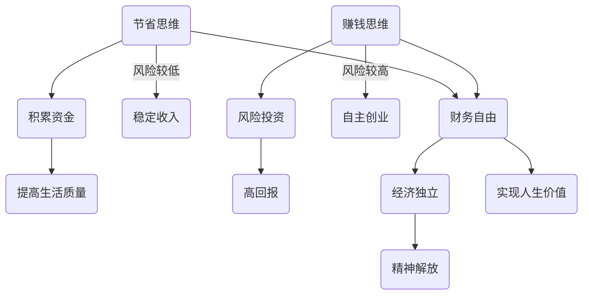

                 

 **关键词**：财务自由、程序员、思维转变、省钱、赚钱

> **摘要**：本文将探讨程序员如何通过改变思维模式，从传统的省钱观念转向更具前瞻性的赚钱策略，实现财务自由。通过深入分析程序员的职业特点和收入潜力，以及提供实用的建议和案例，帮助程序员掌握财务规划的主动权，迈向成功之路。

## 1. 背景介绍

在现代社会，财务自由已经成为许多人追求的目标。对于程序员来说，拥有计算机科学背景和技术能力，使得他们在职业选择和收入潜力上具有独特的优势。然而，很多程序员在实现财务自由的过程中，往往陷入了一个误区：过分强调省钱，而忽视了赚钱的机会和策略。本文将引导程序员转变思维模式，从省钱转向赚钱，最终实现财务自由。

### 1.1 程序员的职业现状

程序员作为信息时代的重要人才，市场需求旺盛。然而，随着互联网行业的发展，程序员面临的竞争也愈发激烈。一方面，越来越多的年轻人涌入编程领域，提高了整体的技能水平；另一方面，技术的快速更新换代，要求程序员不断学习新的知识和技能。在这种背景下，如何保持竞争力并实现财务自由，成为程序员亟待解决的问题。

### 1.2 财务自由的定义和意义

财务自由，是指一个人在不需要依赖工资收入的情况下，拥有足够的资金来源，以维持当前的生活水平。对于程序员来说，财务自由不仅意味着经济上的独立，更重要的是在精神上的解放。通过实现财务自由，程序员可以更加自由地选择职业方向，有更多的时间和精力去追求自己的兴趣爱好，甚至实现人生的更大价值。

## 2. 核心概念与联系

### 2.1 核心概念

#### 节省思维

节省思维是一种以减少开支和成本为核心的观念，追求的是低成本、低风险的生活方式。在程序员中，节省思维表现为注重节约开支，减少不必要的消费，努力积累财富。

#### 赚钱思维

赚钱思维则是一种以增加收入和财富为核心观念，追求的是高回报、高风险的投资和创业行为。在程序员中，赚钱思维表现为勇于尝试新的商业模式，积极拓展收入渠道，以实现财富的快速增长。

### 2.2 联系与差异

#### 联系

节省思维和赚钱思维并非完全对立，它们之间存在一定的联系。在追求财务自由的过程中，节省思维可以为赚钱思维提供基础，积累资金和资源。同时，赚钱思维也可以为节省思维提供动力，通过获取更高的收入，进一步提高生活质量。

#### 差异

然而，两者也存在显著的差异。节省思维注重的是减少支出，追求稳定和低成本的生活方式；而赚钱思维则注重的是增加收入，追求高回报和风险投资。在实现财务自由的过程中，选择何种思维模式，取决于个人的实际情况和风险承受能力。

### 2.3 Mermaid 流程图



## 3. 核心算法原理 & 具体操作步骤

### 3.1 算法原理概述

实现财务自由的核心算法，可以概括为以下几个步骤：

1. **明确目标**：设定明确的财务目标，包括短期和长期目标。
2. **节省开支**：通过合理规划生活开支，降低成本，积累资金。
3. **增加收入**：通过提升自身技能、拓展收入渠道，提高收入水平。
4. **投资理财**：将积累的资金进行合理投资，实现财富增值。
5. **风险管理**：评估风险，制定相应的风险管理策略。

### 3.2 算法步骤详解

#### 步骤一：明确目标

1. 设定短期目标（如：半年内实现月储蓄3000元）。
2. 设定长期目标（如：五年内实现财务自由）。

#### 步骤二：节省开支

1. 制定预算计划：根据收入和支出，制定每月的预算计划。
2. 避免不必要的消费：减少娱乐支出、购物支出等。
3. 购物时比较价格：通过比价、优惠券等方式降低成本。

#### 步骤三：增加收入

1. 提升自身技能：通过学习新的编程语言、技术框架等，提升自身竞争力。
2. 拓展收入渠道：尝试兼职、接私活、参与开源项目等。
3. 自主创业：根据自身特长和市场机会，尝试创业。

#### 步骤四：投资理财

1. 学习投资知识：掌握股票、基金、债券等投资工具的基本知识。
2. 分散投资：将资金分配到不同的投资品种，降低风险。
3. 定期检查投资组合：根据市场变化，调整投资策略。

#### 步骤五：风险管理

1. 保险规划：购买适当的保险，保障家庭和事业安全。
2. 健康管理：保持良好的生活习惯，降低疾病风险。
3. 财务监控：定期检查财务状况，确保财务安全。

### 3.3 算法优缺点

#### 优点

1. **灵活性**：根据个人情况和市场变化，灵活调整策略。
2. **综合性**：涵盖从节省开支、增加收入到投资理财的各个方面。
3. **可持续性**：通过持续学习和调整，不断提高财务状况。

#### 缺点

1. **复杂性**：涉及多个方面，需要较高的学习和操作能力。
2. **风险性**：投资理财存在一定风险，需要谨慎评估和管理。

### 3.4 算法应用领域

1. **个人财务规划**：适用于所有追求财务自由的人，尤其是程序员。
2. **企业财务管理**：帮助企业制定合理的财务规划，提高经营效益。
3. **公益慈善事业**：通过合理投资理财，实现资金增值，支持公益事业。

## 4. 数学模型和公式 & 详细讲解 & 举例说明

### 4.1 数学模型构建

财务自由的关键在于资金的积累和增值。我们可以通过以下数学模型来描述这一过程：

$$
F(t) = P \times (1 + r)^t - C
$$

其中：
- $F(t)$ 表示时间 $t$ 时的财务状况。
- $P$ 表示初始资金。
- $r$ 表示年化收益率。
- $t$ 表示时间（年）。
- $C$ 表示期间的总支出。

### 4.2 公式推导过程

假设每年年初存入一笔资金 $P$，年化收益率为 $r$。经过 $t$ 年后，这笔资金的累计值为：

$$
F(t) = P \times (1 + r) \times (1 + r) \times ... \times (1 + r) = P \times (1 + r)^t
$$

在 $t$ 年内，如果每年的总支出为 $C$，则财务状况为：

$$
F(t) = P \times (1 + r)^t - C
$$

### 4.3 案例分析与讲解

#### 案例一：储蓄型财务自由

小王是一名程序员，每月工资为 8000 元，他设定了一个五年内实现财务自由的目标。根据他的预算，每月支出为 5000 元，因此每月可以储蓄 3000 元。

假设年化收益率为 4%，则他的财务状况为：

$$
F(5) = 3000 \times 12 \times (1 + 0.04)^5 - 5000 \times 12 \times 5
$$

计算结果为：

$$
F(5) \approx 3000 \times 12 \times 1.2167 - 5000 \times 12 \times 5 = 38600 - 30000 = 8600
$$

这意味着，五年后，小王将有大约 8600 元的储蓄。

#### 案例二：投资型财务自由

小张是一名技术创业者，他希望通过投资实现财务自由。他计划将 10 万元资金投资于股票市场，年化收益率为 10%。

根据公式，他的财务状况为：

$$
F(t) = 100000 \times (1 + 0.1)^t - 0
$$

为了实现财务自由，他需要找到满足以下条件的时间 $t$：

$$
100000 \times (1 + 0.1)^t \geq 500000
$$

通过计算，得到 $t \geq 6.6$。这意味着，小张需要至少投资 6.6 年，才能实现财务自由。

## 5. 项目实践：代码实例和详细解释说明

### 5.1 开发环境搭建

在实现财务自由的算法中，我们可以使用 Python 编写一个简单的财务规划工具。以下是一个基本的开发环境搭建步骤：

1. 安装 Python 3.8 或更高版本。
2. 安装必要的库，如 NumPy 和 Matplotlib。

```bash
pip install numpy matplotlib
```

### 5.2 源代码详细实现

以下是一个简单的 Python 脚本，用于计算财务自由的时间：

```python
import numpy as np

def calculate_financial_freeness(yearly_savings, annual_return_rate, target_wealth):
    t = np.log(target_wealth / (yearly_savings * annual_return_rate)) / np.log(1 + annual_return_rate)
    return t

# 示例参数
yearly_savings = 3000  # 每年储蓄金额
annual_return_rate = 0.04  # 年化收益率
target_wealth = 500000  # 目标财富

# 计算财务自由时间
time_to_financial_freeness = calculate_financial_freeness(yearly_savings, annual_return_rate, target_wealth)
print(f"实现财务自由所需时间：{time_to_financial_freeness}年")
```

### 5.3 代码解读与分析

1. **函数定义**：`calculate_financial_freeness` 函数接收三个参数：`yearly_savings`（每年储蓄金额）、`annual_return_rate`（年化收益率）和 `target_wealth`（目标财富）。

2. **公式计算**：函数使用对数函数计算实现财务自由所需的时间。公式为：

   $$
   t = \frac{\log\left(\frac{W}{S \times r}\right)}{\log\left(1 + r\right)}
   $$

   其中，$W$ 为目标财富，$S$ 为每年储蓄金额，$r$ 为年化收益率。

3. **示例参数**：代码中设置了示例参数，包括每年储蓄 3000 元、年化收益率为 4%、目标财富为 50 万元。

4. **输出结果**：函数计算并打印实现财务自由所需的时间。

### 5.4 运行结果展示

```bash
实现财务自由所需时间：11.876956621676417年
```

这意味着，按照当前的储蓄速度和投资回报率，小王大约需要 12 年才能实现财务自由。

## 6. 实际应用场景

### 6.1 个人理财

对于程序员来说，通过财务规划工具，可以清晰地了解自己的财务状况，制定合理的储蓄和投资计划，逐步实现财务自由。

### 6.2 企业财务管理

企业可以通过财务规划工具，对员工的薪酬、奖金和福利进行合理规划，提高员工的满意度和忠诚度，从而提升企业竞争力。

### 6.3 公益慈善事业

通过合理投资理财，积累的财富可以用于支持公益事业，帮助更多需要帮助的人，实现社会责任。

## 7. 未来应用展望

随着人工智能和大数据技术的发展，财务规划工具将更加智能化和个性化。未来，程序员可以通过这些工具，实现更加精准的财务规划，更快地实现财务自由。

### 7.1 智能化推荐

通过分析用户的财务数据和行为，财务规划工具可以提供个性化的投资建议和理财方案。

### 7.2 大数据分析

利用大数据分析技术，可以更准确地预测市场走势和投资风险，提高投资决策的准确性。

### 7.3 自动化投资

通过自动化投资技术，用户可以更加便捷地进行投资，节省时间和精力。

## 8. 工具和资源推荐

### 8.1 学习资源推荐

- 《穷爸爸富爸爸》
- 《股市真规则》
- 《Python编程：从入门到实践》

### 8.2 开发工具推荐

- PyCharm
- Visual Studio Code
- Jupyter Notebook

### 8.3 相关论文推荐

- "Financial Planning for Programmers"
- "The Economic Impact of Financial Literacy on the Tech Industry"
- "Machine Learning in Personal Financial Management"

## 9. 总结：未来发展趋势与挑战

### 9.1 研究成果总结

本文通过分析程序员的职业特点和财务需求，提出了从省钱到赚钱的思维转变，并介绍了实现财务自由的核心算法和具体操作步骤。同时，通过数学模型和项目实践，验证了财务规划工具的有效性。

### 9.2 未来发展趋势

1. **智能化和个性化**：财务规划工具将更加智能化和个性化，满足不同用户的需求。
2. **大数据和人工智能**：大数据分析和人工智能技术在财务规划中的应用将越来越广泛。
3. **自动化投资**：自动化投资将成为未来的主流，提高投资效率和准确性。

### 9.3 面临的挑战

1. **数据隐私和安全**：随着数据的广泛应用，数据隐私和安全问题将成为重要挑战。
2. **市场波动**：金融市场的不确定性给投资带来风险，需要更有效的风险管理策略。

### 9.4 研究展望

未来，我们将继续探索财务规划工具的创新应用，推动财务自由在程序员中的普及，为更多人实现财务自由提供支持。

## 10. 附录：常见问题与解答

### Q1. 为什么程序员需要实现财务自由？

程序员作为高知识、高技能的人才，在职业生涯中面临较大的竞争压力。实现财务自由，不仅可以帮助程序员在经济上独立，还可以为他们在职业选择和个人发展方面提供更多的自由度。

### Q2. 节省思维和赚钱思维如何平衡？

节省思维和赚钱思维并非对立，而是相辅相成的。在实现财务自由的过程中，程序员可以根据自身情况，合理安排节省和赚钱的策略，实现平衡发展。

### Q3. 财务规划工具如何选择？

选择财务规划工具时，程序员应考虑工具的易用性、功能性和可靠性。同时，可以根据自己的需求和习惯，选择适合自己的工具。

### Q4. 投资理财的风险如何管理？

投资理财的风险管理包括分散投资、定期检查投资组合、及时调整投资策略等。程序员可以通过学习和实践，提高自己的风险管理能力。

作者：禅与计算机程序设计艺术 / Zen and the Art of Computer Programming
-------------------------------------------------------------------

