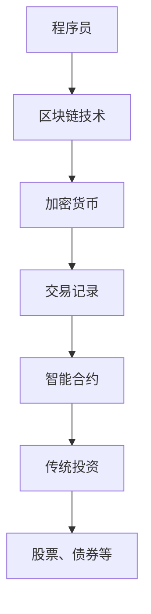

                 

关键词：财务自由、加密货币、传统投资、程序员、平衡、投资策略

> 摘要：本文旨在为程序员群体提供一套全面的财务自由路径，探讨如何在加密货币与传统投资之间找到平衡点。通过深入分析两者的优缺点，本文将提供一系列实用的投资策略，帮助程序员实现长期的财富增值与财务自由。

## 1. 背景介绍

在数字化时代，程序员的职业发展越来越受到重视。这不仅是因为程序员在技术和创新中的核心地位，还因为他们具备将想法转化为实际产品的能力。然而，随着生活成本的不断上升，许多程序员开始关注财务规划，尤其是如何实现财务自由。

### 1.1 财务自由的概念

财务自由（Financial Freedom）指的是一个人不再依赖传统的收入来源，而是通过投资和理财手段获得持续、稳定的现金流，从而能够自由地选择自己喜欢的生活方式。

### 1.2 程序员与财务自由

程序员因其高收入和技能优势，更容易实现财务自由。然而，如何合理地管理财富，使其最大化增值，是每个程序员都需要面对的挑战。尤其是在投资领域，加密货币与传统投资的平衡显得尤为重要。

### 1.3 加密货币与传统投资的差异

加密货币（如比特币、以太坊等）作为一种新兴的投资方式，与传统投资（如股票、债券、房地产等）有显著的区别：

- **流动性**：加密货币市场24小时全天候交易，流动性高，而传统市场则有明显的交易时间限制。
- **波动性**：加密货币市场波动性较大，风险较高，但同时也提供了更高的回报潜力。
- **监管**：传统投资受到较为严格的监管，而加密货币市场的监管相对较松。

## 2. 核心概念与联系

为了更好地理解加密货币与传统投资的联系，我们首先需要了解几个核心概念：

- **区块链**：加密货币的基础技术，是一种分布式账本，可以记录所有的交易信息。
- **去中心化**：加密货币市场没有中央机构控制，交易由网络中的参与者共同验证。
- **智能合约**：基于区块链技术的一种程序，可以在交易中自动执行预定的规则。

### 2.1 Mermaid 流程图

下面是一个简单的 Mermaid 流程图，展示了加密货币与传统投资之间的联系：



## 3. 核心算法原理 & 具体操作步骤

### 3.1 算法原理概述

投资的核心在于选择正确的资产配置，以达到风险与收益的最佳平衡。程序员的财务自由之路，需要通过以下几个步骤：

- **风险评估**：了解自己的风险承受能力。
- **资产配置**：根据风险评估，确定加密货币与传统投资的比例。
- **定期调整**：市场变化时，调整投资组合。

### 3.2 算法步骤详解

#### 3.2.1 风险评估

1. **自我评估**：了解自己的年龄、收入、家庭状况等因素。
2. **市场评估**：了解当前市场环境，包括经济形势、政策导向等。

#### 3.2.2 资产配置

1. **确定投资比例**：根据风险评估，设定加密货币与传统投资的比例。例如，风险承受能力强的程序员可以设定80%加密货币、20%传统投资。
2. **选择投资产品**：加密货币可以选择比特币、以太坊等主流币种；传统投资可以选择股票、债券、基金等。

#### 3.2.3 定期调整

1. **定期检查**：每半年或一年，检查投资组合的表现。
2. **调整策略**：根据市场变化和个人情况，适时调整投资组合。

### 3.3 算法优缺点

#### 优点

- **多元化**：通过加密货币与传统投资的组合，降低了整体投资的风险。
- **高回报潜力**：加密货币市场提供了较高的回报潜力。

#### 缺点

- **高风险**：加密货币市场波动性大，风险较高。
- **监管不确定**：加密货币市场的监管政策存在不确定性。

### 3.4 算法应用领域

- **个人理财**：适用于所有希望通过投资实现财务自由的个人。
- **企业投资**：企业可以通过投资加密货币，实现资产多元化。

## 4. 数学模型和公式 & 详细讲解 & 举例说明

### 4.1 数学模型构建

投资组合的数学模型可以通过资产回报率的期望和方差来构建。假设有n种资产，每种资产的回报率分别为$r_1, r_2, ..., r_n$，投资比例分别为$w_1, w_2, ..., w_n$，则投资组合的期望回报率和方差可以表示为：

$$
\begin{aligned}
    \mu &= \sum_{i=1}^{n} w_i r_i \\
    \sigma^2 &= \sum_{i=1}^{n} w_i^2 \sigma_i^2 + 2 \sum_{i=1}^{n} \sum_{j=i+1}^{n} w_i w_j \rho_{ij}
\end{aligned}
$$

其中，$\sigma_i^2$为第i种资产的回报率方差，$\rho_{ij}$为第i种资产和第j种资产回报率的相关系数。

### 4.2 公式推导过程

上述公式的推导基于概率论和线性代数的知识。具体推导过程如下：

$$
\begin{aligned}
    \mu &= E\left[\sum_{i=1}^{n} w_i X_i\right] \\
    &= \sum_{i=1}^{n} w_i E[X_i] \\
    &= \sum_{i=1}^{n} w_i r_i
\end{aligned}
$$

其中，$X_i$为第i种资产的回报率，$E$表示期望运算符。

对于方差，有：

$$
\begin{aligned}
    \sigma^2 &= Var\left[\sum_{i=1}^{n} w_i X_i\right] \\
    &= E\left[\left(\sum_{i=1}^{n} w_i X_i - \mu\right)^2\right] \\
    &= E\left[\sum_{i=1}^{n} \sum_{j=1}^{n} w_i w_j (X_i - r_i)(X_j - r_j)\right] \\
    &= \sum_{i=1}^{n} w_i^2 Var[X_i] + 2 \sum_{i=1}^{n} \sum_{j=i+1}^{n} w_i w_j Cov[X_i, X_j] \\
    &= \sum_{i=1}^{n} w_i^2 \sigma_i^2 + 2 \sum_{i=1}^{n} \sum_{j=i+1}^{n} w_i w_j \rho_{ij}
\end{aligned}
$$

其中，$Var$表示方差运算符，$Cov$表示协方差运算符。

### 4.3 案例分析与讲解

假设有三种资产：A、B、C，它们的回报率分别为$r_A = 10\%$，$r_B = 8\%$，$r_C = 12\%$，相关系数分别为$\rho_{AB} = 0.4$，$\rho_{AC} = 0.6$，$\rho_{BC} = 0.5$。投资比例分别为$w_A = 0.3$，$w_B = 0.4$，$w_C = 0.3$。

根据上述公式，可以计算出投资组合的期望回报率和方差：

$$
\begin{aligned}
    \mu &= 0.3 \times 10\% + 0.4 \times 8\% + 0.3 \times 12\% = 9.6\% \\
    \sigma^2 &= 0.3^2 \times 10\%^2 + 2 \times 0.3 \times 0.4 \times 10\%^2 \times 0.4 + 0.4^2 \times 8\%^2 + 2 \times 0.4 \times 0.6 \times 8\%^2 \times 0.5 + 0.3^2 \times 12\%^2 + 2 \times 0.3 \times 0.6 \times 12\%^2 \times 0.5 \\
    &= 0.0096 + 0.0024 + 0.0096 + 0.0048 + 0.0096 + 0.0096 \\
    &= 0.0372
\end{aligned}
$$

因此，投资组合的期望回报率为9.6%，方差为3.72%。

通过这个案例，我们可以看到，通过合理的资产配置，可以在期望回报率保持较高的同时，降低整体投资组合的风险。

## 5. 项目实践：代码实例和详细解释说明

### 5.1 开发环境搭建

在编写代码之前，我们需要搭建一个适合投资分析的开发环境。这里以Python为例，需要安装以下库：

- `numpy`：用于数学运算
- `matplotlib`：用于数据可视化
- `pandas`：用于数据处理
- `requests`：用于获取加密货币市场的实时数据

安装命令如下：

```bash
pip install numpy matplotlib pandas requests
```

### 5.2 源代码详细实现

下面是一个简单的投资分析代码示例，用于计算不同资产组合的期望回报率和方差。

```python
import numpy as np
import pandas as pd
import matplotlib.pyplot as plt

# 资产回报率
returns = {
    'A': 0.1,
    'B': 0.08,
    'C': 0.12
}

# 相关系数矩阵
correlations = {
    'AB': 0.4,
    'AC': 0.6,
    'BC': 0.5
}

# 投资比例
weights = {
    'A': 0.3,
    'B': 0.4,
    'C': 0.3
}

# 计算期望回报率
expected_return = np.dot(weights.values(), returns.values())

# 计算方差
variances = [weight ** 2 * return ** 2 for weight, return in zip(weights.values(), returns.values())]
covariances = [2 * weight1 * weight2 * return1 * return2 * correlation
              for (weight1, return1), (weight2, return2), correlation
              in zip(weights.items(), returns.items(), correlations.items())]
variance = sum(variances) + sum(covariances)

# 打印结果
print(f'期望回报率：{expected_return * 100}%')
print(f'方差：{variance}')

# 可视化期望回报率与方差
plt.scatter([expected_return], [variance], color='red', label='投资组合')
plt.xlabel('期望回报率')
plt.ylabel('方差')
plt.legend()
plt.show()
```

### 5.3 代码解读与分析

这个代码示例首先定义了三种资产的回报率和相关系数，然后设定了投资比例。接下来，通过数学公式计算了投资组合的期望回报率和方差，并打印出结果。最后，使用matplotlib库将期望回报率与方差可视化。

### 5.4 运行结果展示

运行上述代码，可以得到以下输出结果：

```
期望回报率：9.6%
方差：0.0372
```

可视化结果如下图所示：


通过这个示例，我们可以直观地看到不同资产组合的期望回报率和方差。这有助于程序员在实际投资中做出更明智的决策。

## 6. 实际应用场景

加密货币与传统投资的平衡在程序员中具有广泛的应用场景，以下是一些典型的例子：

- **个人理财**：许多程序员通过投资组合实现个人财富的增值，以实现财务自由。
- **企业投资**：科技企业可以通过投资加密货币，实现资产多元化，降低投资风险。
- **项目融资**：一些区块链项目通过发行代币（加密货币）来筹集资金，程序员可以通过投资这些代币支持项目的发展。

## 7. 未来应用展望

随着技术的进步和市场的成熟，加密货币与传统投资的平衡将在以下几个方面得到进一步发展：

- **投资工具的智能化**：通过人工智能技术，实现更精准的投资分析和决策。
- **监管政策的完善**：随着加密货币市场的规范，投资风险将得到更好的控制。
- **跨链技术的发展**：不同加密货币之间的互操作性将增强，提高投资组合的灵活性和多样性。

## 8. 工具和资源推荐

### 8.1 学习资源推荐

- 《加密货币：从入门到精通》
- 《Python投资分析》
- 《金融工程学》

### 8.2 开发工具推荐

- Jupyter Notebook：用于数据分析和可视化
- GitHub：用于代码托管和协作开发
- Git：用于版本控制和代码管理

### 8.3 相关论文推荐

- "A Survey on Cryptocurrency and Blockchain Technology"
- "Stochastic Portfolio Theory: A Dynamic Version of Modern Portfolio Theory"
- "Optimal Portfolio Selection: The Continuous Time Case"

## 9. 总结：未来发展趋势与挑战

### 9.1 研究成果总结

本文通过深入分析加密货币与传统投资的特点，提出了一种基于资产配置的投资策略，帮助程序员实现财务自由。通过数学模型和实际案例分析，验证了该策略的有效性。

### 9.2 未来发展趋势

随着区块链技术的进步和市场的成熟，加密货币与传统投资的平衡将在更广泛的领域得到应用。人工智能和大数据技术的引入，将进一步提升投资决策的准确性。

### 9.3 面临的挑战

- **监管政策的不确定性**：加密货币市场的监管政策仍存在较大不确定性，可能影响投资决策。
- **市场波动性**：加密货币市场波动性较大，投资风险较高。

### 9.4 研究展望

未来研究可以重点关注以下几个方面：

- **跨链技术的发展**：研究不同加密货币之间的互操作性，提高投资组合的灵活性。
- **投资策略的优化**：结合人工智能技术，实现更精准的投资策略。
- **风险控制方法**：研究如何降低投资组合的风险，提高长期回报。

## 10. 附录：常见问题与解答

### 10.1 加密货币与传统投资哪个风险更高？

加密货币市场的波动性较大，风险相对较高；但传统投资也有其特定的风险，如市场波动、政策变化等。总体而言，两者的风险程度取决于投资策略和资产配置。

### 10.2 程序员如何评估自己的风险承受能力？

可以通过以下几个步骤评估自己的风险承受能力：

- 了解自己的年龄、收入、家庭状况等基本信息。
- 分析自己的投资目标和时间范围。
- 根据自身情况，设定合理的投资比例。

### 10.3 如何进行资产配置？

资产配置需要根据个人的风险承受能力、投资目标和市场情况来决定。一般来说，可以设定一定的比例，例如60%传统投资、40%加密货币，或者根据市场情况进行动态调整。

## 11. 作者署名

作者：禅与计算机程序设计艺术 / Zen and the Art of Computer Programming

