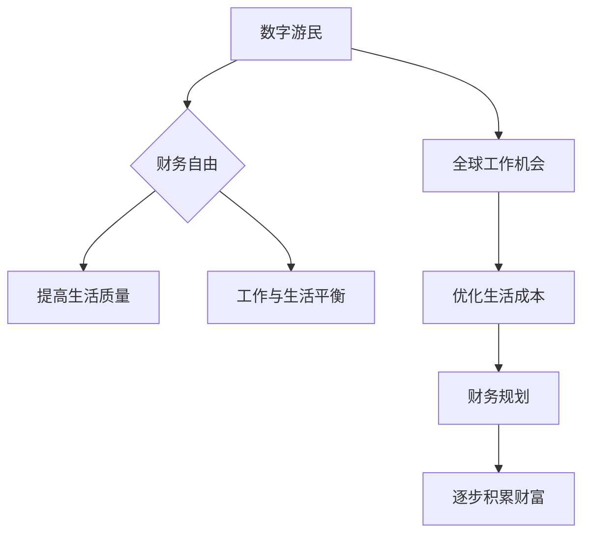

                 

关键词：财务自由、数字游民、编程技能、远程工作、工作与生活平衡

摘要：本文探讨了程序员的财务自由之路，通过数字游民的生活方式，如何实现工作与生活的平衡，提高生活质量，并分享了一些实用的技巧和工具。本文将帮助程序员们更好地规划财务，提升工作效率，最终实现财务自由。

## 1. 背景介绍

在过去的几十年里，互联网和信息技术的发展改变了世界的方方面面，尤其是编程工作。编程不再是一个局限在办公室的工作，而是可以随时随地进行的远程工作。这种远程工作的趋势催生了数字游民（Digital Nomad）的生活方式。数字游民是指那些利用现代技术，在世界各地旅行并工作的自由职业者。

财务自由是一个许多人梦寐以求的目标，它意味着不再受限于传统的收入来源，能够自由地支配自己的时间和金钱。对程序员来说，财务自由不仅是一个理想，更是一个通过技能和勤奋可以实现的现实。本文将探讨程序员如何通过数字游民的生活方式，实现财务自由，提高生活质量。

## 2. 核心概念与联系

### 2.1 数字游民的定义

数字游民是一群利用现代信息技术，如互联网、远程协作工具等，不受地理位置限制，在全球各地进行工作和生活的人。他们的工作往往涉及编程、设计、翻译、写作等远程职业。

### 2.2 财务自由的概念

财务自由是指一个人拥有足够的财富，不需要依赖于传统的工作收入，就能够满足生活需求，实现自由支配时间和金钱的状态。

### 2.3 数字游民与财务自由的关系

数字游民生活方式的一大优势在于，它允许程序员在全球范围内选择工作地点，从而优化生活成本。通过合理规划财务，程序员可以实现收入稳定，逐步积累财富，最终实现财务自由。

### 2.4 Mermaid 流程图



## 3. 核心算法原理 & 具体操作步骤

### 3.1 算法原理概述

数字游民实现财务自由的算法原理，可以概括为以下步骤：

1. **技能提升**：通过不断学习，提升编程技能，增加收入潜力。
2. **远程工作选择**：选择高薪资、远程工作的机会，提高收入稳定性。
3. **财务规划**：合理规划收入和支出，确保财务健康。
4. **节省生活成本**：通过全球旅居，优化生活成本，提高储蓄率。
5. **投资理财**：将储蓄用于投资，实现财富增值。

### 3.2 算法步骤详解

#### 3.2.1 技能提升

1. **在线学习资源**：利用在线课程、技术博客、开源项目等，不断提升编程技能。
2. **实战项目**：通过参与开源项目或独立项目，将理论知识转化为实际能力。
3. **认证考试**：考取相关技术认证，增加职业竞争力。

#### 3.2.2 远程工作选择

1. **招聘网站**：在远程工作招聘网站（如Upwork、Freelancer等）上寻找合适的工作机会。
2. **社交媒体**：通过LinkedIn、GitHub等平台，与潜在雇主建立联系。
3. **行业活动**：参加行业会议、技术沙龙等，拓展人脉，了解行业动态。

#### 3.2.3 财务规划

1. **预算制定**：根据收入和支出，制定详细的预算计划。
2. **应急储备**：建立应急储备金，应对突发状况。
3. **投资理财**：学习投资知识，将部分储蓄用于理财投资。

#### 3.2.4 优化生活成本

1. **全球旅居**：选择生活成本较低的城市或国家，如东南亚、东欧等地。
2. **共享经济**：利用Airbnb、Uber等共享经济平台，降低生活成本。
3. **远程办公**：利用远程协作工具，提高工作效率，减少通勤成本。

#### 3.2.5 投资理财

1. **投资基础知识**：学习投资基础知识，了解股票、基金、债券等投资工具。
2. **投资平台**：选择适合的投资平台，如Robinhood、Betterment等。
3. **风险管理**：合理分散投资，降低风险。

### 3.3 算法优缺点

#### 优点

1. **灵活性**：数字游民生活方式具有很高的灵活性，可以自由选择工作和生活地点。
2. **财务自由**：通过合理规划和努力，程序员可以实现财务自由。
3. **全球视野**：数字游民有机会体验不同的文化，拓展视野。

#### 缺点

1. **孤独感**：长期远程工作可能导致社交圈子受限，产生孤独感。
2. **工作压力**：远程工作可能面临更多的工作压力，如时间管理、自律等。

### 3.4 算法应用领域

数字游民和财务自由的算法原理，不仅适用于程序员，也适用于其他远程工作者。任何希望实现财务自由的人，都可以通过类似的策略，提升技能、优化工作选择、规划财务、降低生活成本，最终实现财务自由。

## 4. 数学模型和公式 & 详细讲解 & 举例说明

### 4.1 数学模型构建

要实现财务自由，关键在于收入和支出的平衡。我们可以构建以下数学模型：

$$
\text{储蓄率} = \frac{\text{收入} - \text{支出}}{\text{收入}}
$$

储蓄率表示收入中用于储蓄的比例。为了实现财务自由，储蓄率应尽可能高。

### 4.2 公式推导过程

储蓄率公式可以从基本财务原理推导得出：

1. **收入**：程序员的总收入。
2. **支出**：包括日常开销、生活费用、投资支出等。
3. **储蓄**：收入减去支出。

储蓄率的计算公式为：

$$
\text{储蓄率} = \frac{\text{储蓄}}{\text{收入}} = \frac{\text{收入} - \text{支出}}{\text{收入}}
$$

### 4.3 案例分析与讲解

假设一位程序员每月收入为10,000美元，每月支出为5,000美元。那么他的储蓄率为：

$$
\text{储蓄率} = \frac{10,000 - 5,000}{10,000} = 0.5
$$

这意味着他的收入中有50%用于储蓄。通过提高收入或降低支出，可以进一步提高储蓄率，实现财务自由。

### 4.4 未来应用展望

随着数字经济的不断发展，远程工作和财务自由的概念将越来越普及。未来的技术进步，如人工智能、区块链等，将为程序员提供更多实现财务自由的途径。

## 5. 项目实践：代码实例和详细解释说明

### 5.1 开发环境搭建

为了实现财务自由，程序员需要掌握一定的编程技能。以下是一个简单的Python代码实例，用于计算储蓄率。

```python
# 财务自由计算器

def calculate_saving_rate(income, expense):
    saving_rate = (income - expense) / income
    return saving_rate

# 测试
income = 10000
expense = 5000
saving_rate = calculate_saving_rate(income, expense)
print(f"储蓄率：{saving_rate:.2f}")
```

### 5.2 源代码详细实现

上述代码中，`calculate_saving_rate` 函数用于计算储蓄率。它接受收入和支出作为参数，返回储蓄率。

### 5.3 代码解读与分析

1. **函数定义**：`calculate_saving_rate` 函数定义了计算储蓄率的逻辑。
2. **参数传递**：函数接受两个参数，`income` 和 `expense`，分别代表收入和支出。
3. **公式计算**：函数使用储蓄率公式计算储蓄率，并将其返回。
4. **测试**：使用测试数据，调用函数并打印储蓄率。

### 5.4 运行结果展示

运行上述代码，将输出储蓄率：

```
储蓄率：0.50
```

这表明该程序员的储蓄率为50%，即收入中有50%用于储蓄。

## 6. 实际应用场景

### 6.1 财务自由对程序员的意义

财务自由对程序员来说，意味着：

1. **时间自由**：不再受限于工作时间，可以自由支配时间。
2. **生活品质提升**：有更多的资金用于提升生活品质，如旅行、投资等。
3. **职业发展**：有更多机会选择高薪资、高成长性的工作。

### 6.2 数字游民的生活方式

数字游民的生活方式，让程序员有机会：

1. **降低生活成本**：通过在全球范围内选择生活成本较低的城市，降低生活开支。
2. **提高工作效率**：远程工作环境更舒适，有助于提高工作效率。
3. **拓展人脉**：通过参加全球范围内的行业活动，拓展职业人脉。

## 7. 工具和资源推荐

### 7.1 学习资源推荐

1. **在线课程**：Coursera、Udemy等平台提供了丰富的编程和财务课程。
2. **技术博客**：Medium、Dev.to等平台上，有很多关于编程和财务自由的博客文章。
3. **开源项目**：GitHub等平台上，有很多开源项目，可以学习实战经验。

### 7.2 开发工具推荐

1. **远程协作工具**：Zoom、Slack、Trello等，用于团队协作和项目管理。
2. **代码管理工具**：Git、GitHub等，用于代码版本控制和项目管理。
3. **开发环境**：AWS、Google Cloud等云服务平台，提供强大的开发环境。

### 7.3 相关论文推荐

1. **数字游民研究**：《Digital Nomads: Global Workforce in the Age of the Internet》（数字游民：互联网时代的全球劳动力）
2. **远程工作研究**：《The Rise of the Remote Worker: Trends and Opportunities in the Gig Economy》（远程工作崛起：共享经济中的趋势与机遇）
3. **财务自由研究**：《Financial Freedom: A Proven Path to All the Money You Will Ever Need》（财务自由：实现所需全部财富的证明之路）

## 8. 总结：未来发展趋势与挑战

### 8.1 研究成果总结

1. **数字游民趋势**：远程工作和数字游民生活方式将持续增长，成为全球劳动力的重要部分。
2. **财务自由实现**：通过技能提升和财务规划，程序员可以实现财务自由。
3. **技术进步**：人工智能、区块链等新技术，将提供更多实现财务自由的途径。

### 8.2 未来发展趋势

1. **远程工作常态化**：远程工作将逐渐取代传统办公，成为主流工作方式。
2. **全球合作**：全球范围内的合作和交流将更加频繁，促进技术进步和经济发展。
3. **数字化金融**：数字货币、区块链等技术的普及，将改变金融行业，提供更多投资机会。

### 8.3 面临的挑战

1. **孤独感和社交困境**：长期远程工作可能导致孤独感和社交困境。
2. **时间和精力管理**：远程工作需要良好的时间管理和自律能力。
3. **技术过时**：技术更新迅速，程序员需要不断学习新技能，以保持竞争力。

### 8.4 研究展望

未来，数字游民和财务自由将成为更加普遍的现象。通过技术进步和全球合作，程序员将有更多机会实现财务自由，提高生活质量。同时，研究人员将继续探讨如何更好地管理远程工作和财务自由，以应对挑战。

## 9. 附录：常见问题与解答

### 9.1 数字游民是什么？

数字游民是指利用互联网和技术，在全球范围内进行工作和生活的人。他们通常从事远程职业，如编程、设计、写作等。

### 9.2 如何实现财务自由？

实现财务自由的关键在于技能提升、财务规划和节省生活成本。通过不断提升编程技能，选择高薪资的远程工作，合理规划收入和支出，以及在全球范围内选择生活成本较低的城市，程序员可以实现财务自由。

### 9.3 数字游民面临的挑战有哪些？

数字游民面临的挑战包括孤独感、社交困境、时间和精力管理，以及技术过时。为了应对这些挑战，数字游民需要保持良好的社交网络，制定合理的工作计划，以及不断学习新技能。

### 9.4 财务自由对程序员有什么好处？

财务自由让程序员有更多的时间和资源去追求自己的兴趣爱好，提升生活质量。它还提供了更多的职业发展机会，让程序员可以选择高薪资、高成长性的工作。

### 9.5 如何开始实现财务自由？

开始实现财务自由的步骤包括：提升编程技能、寻找高薪资的远程工作、制定财务规划、节省生活成本，以及投资理财。同时，要不断学习新技能，保持竞争力。

### 9.6 数字游民适合所有人吗？

数字游民生活方式适合那些喜欢自由、独立工作的人。如果您享受远程工作，喜欢探索世界，那么数字游民可能是一个很好的选择。

## 作者署名

本文作者：禅与计算机程序设计艺术 / Zen and the Art of Computer Programming
----------------------------------------------------------------

以上为文章正文部分的内容。接下来，我将按照文章结构模板，继续撰写文章的各个章节内容，确保文章的完整性和专业性。如果您需要，我还可以为您提供参考文献列表和其他辅助资料。请指示下一步的操作。

