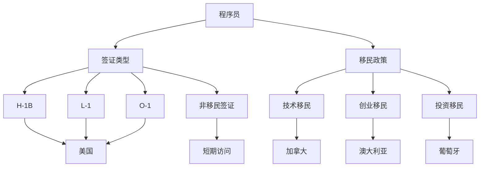

                 

关键词：程序员，跨国发展，签证，移民，策略，技术人才，国际就业

> 摘要：本文将探讨程序员在国际就业市场中面临的签证与移民问题，提供实用的签证和移民策略，帮助程序员在跨国发展中找到合适的机会，同时为读者提供未来发展的趋势和挑战。

## 1. 背景介绍

在全球化的大背景下，跨国发展对于程序员来说越来越具有吸引力。一方面，国际上的大公司和技术初创企业提供了丰富的就业机会，这些企业通常愿意为优秀的技术人才提供优厚的薪酬和福利待遇。另一方面，程序员在技术交流、个人成长和职业发展等方面也能够获得更多机会。然而，跨国发展的道路并非一帆风顺，签证和移民问题成为了许多程序员需要面对的难题。

本文将从以下几个方面展开讨论：首先，介绍程序员在国际就业市场中面临的签证和移民挑战；其次，探讨常见的签证类型和移民政策；接着，提供一些实用的签证和移民策略；然后，分析跨国发展的实际案例；最后，对未来的发展趋势和挑战进行展望。

## 2. 核心概念与联系

### 2.1 签证类型

在跨国发展中，签证是程序员必须了解的核心概念。签证分为工作签证、留学签证和旅游签证等。其中，工作签证是程序员跨国发展的主要途径。以下是一些常见的工作签证类型：

- **非移民签证（Non-Immigrant Visa）**：这类签证适用于短期访问，如旅游、商务考察、留学等。程序员通常不适用这类签证进行长期工作。

- **工作签证（Work Visa）**：这类签证适用于长期工作，如H-1B、L-1、O-1等。程序员需要根据自身情况和所在国家的要求选择合适的签证类型。

  - **H-1B签证**：美国的工作签证，适用于专业职位，如软件开发、系统分析等。H-1B签证的申请过程相对复杂，竞争激烈。
  - **L-1签证**：跨国公司内部调动的签证，适用于公司内部的经理、行政人员和专业人员。
  - **O-1签证**：杰出人才签证，适用于在科学、艺术、教育、商业或体育等领域具有卓越成就的人。

### 2.2 移民政策

移民政策是程序员跨国发展的另一个重要因素。不同国家对移民政策的支持和限制程度有所不同。以下是一些常见的移民政策：

- **技术移民**：许多国家为了吸引技术人才，设立了技术移民计划。程序员可以通过积分制度、就业机会等途径申请移民。

- **创业移民**：一些国家鼓励海外创业者参与本地经济，提供创业移民政策。程序员可以利用自己的技术和经验，申请创业移民。

- **投资移民**：一些国家允许通过投资一定金额的资金来申请移民。对于有一定经济实力的程序员来说，这是一种可行的移民途径。

### 2.3 Mermaid 流程图

以下是一个简化的程序员跨国发展的流程图，展示了签证类型、移民政策和技术人才之间的联系。



## 3. 核心算法原理 & 具体操作步骤

### 3.1 算法原理概述

程序员跨国发展的签证和移民策略可以看作是一个复杂的决策过程。在这个过程中，程序员需要根据自身条件和目标国家的要求，选择合适的签证类型和移民政策。核心算法原理如下：

1. **需求分析**：分析程序员的职业背景、教育背景、技能特长、经济状况等，确定其跨国发展的目标和可行性。

2. **信息收集**：收集目标国家的签证政策、移民法规、就业市场等信息，为决策提供依据。

3. **成本评估**：评估签证申请费用、移民成本、生活费用等，确保经济负担在可承受范围内。

4. **风险评估**：分析跨国发展的风险，如政策变化、市场波动、文化差异等，制定应对策略。

5. **决策制定**：根据需求分析、信息收集、成本评估和风险评估的结果，制定具体的签证和移民策略。

### 3.2 算法步骤详解

1. **需求分析**：
   - **职业背景**：评估程序员的职业年限、工作经验、所从事的行业等。
   - **教育背景**：评估程序员的学历、专业、语言能力等。
   - **技能特长**：评估程序员的编程技能、项目管理能力、团队协作能力等。
   - **经济状况**：评估程序员的收入水平、储蓄情况、投资能力等。

2. **信息收集**：
   - **签证政策**：了解目标国家的签证类型、申请条件、申请流程、有效期等。
   - **移民法规**：了解目标国家的移民政策、积分制度、申请条件、申请流程等。
   - **就业市场**：了解目标国家的就业市场、薪酬水平、岗位需求等。

3. **成本评估**：
   - **签证申请费用**：计算签证申请费、翻译费、公证费等。
   - **移民成本**：计算移民费用、生活费用、子女教育费用等。
   - **生活费用**：计算住房、食品、交通、医疗等日常开支。

4. **风险评估**：
   - **政策变化**：分析目标国家签证政策、移民法规的变动趋势，评估对跨国发展的影响。
   - **市场波动**：分析目标国家就业市场的波动情况，评估对跨国发展的影响。
   - **文化差异**：分析目标国家的文化特点、生活习惯、法律制度等，评估对跨国发展的影响。

5. **决策制定**：
   - **签证类型**：根据需求分析和信息收集的结果，选择最适合的签证类型。
   - **移民政策**：根据需求分析和信息收集的结果，选择最适合的移民政策。
   - **应对策略**：针对风险评估的结果，制定应对策略，降低跨国发展的风险。

### 3.3 算法优缺点

1. **优点**：
   - **全面性**：算法考虑了程序员的职业背景、教育背景、技能特长、经济状况等多方面因素，使决策更具科学性。
   - **灵活性**：算法可以根据不同程序员的实际情况进行调整，适应不同的跨国发展需求。
   - **实用性**：算法提供了具体的签证和移民策略，为程序员提供了实际操作指南。

2. **缺点**：
   - **复杂性**：算法涉及多个因素和环节，计算过程相对复杂，需要较高的专业知识和分析能力。
   - **时效性**：签证政策、移民法规和市场情况不断变化，算法需要定期更新，以保证决策的准确性。
   - **主观性**：算法结果受程序员自身判断和选择的影响，可能导致不同程序员的决策结果存在差异。

### 3.4 算法应用领域

1. **跨国就业**：程序员可以根据算法结果，选择适合的签证类型和移民政策，实现跨国就业。
2. **创业移民**：程序员可以根据算法结果，评估创业移民的可行性，制定创业计划。
3. **留学移民**：程序员可以根据算法结果，选择适合的留学国家和移民政策，实现留学移民。

## 4. 数学模型和公式 & 详细讲解 & 举例说明

### 4.1 数学模型构建

为了更好地描述程序员的跨国发展过程，我们可以构建一个数学模型。模型包括以下几个关键参数：

- **\( P \)**：程序员的综合评分，用于评估程序员的跨国发展潜力。
- **\( C \)**：签证和移民成本，包括签证申请费、移民费用、生活费用等。
- **\( R \)**：收益，包括薪酬、福利、职业发展机会等。
- **\( S \)**：风险，包括政策变化、市场波动、文化差异等。

模型构建如下：

\[ P = f(C, R, S) \]

其中，\( f \)为决策函数，用于计算程序员的综合评分。

### 4.2 公式推导过程

1. **成本计算**：

\[ C = C_1 + C_2 + C_3 \]

其中，\( C_1 \)为签证申请费用，\( C_2 \)为移民费用，\( C_3 \)为生活费用。

2. **收益计算**：

\[ R = R_1 + R_2 + R_3 \]

其中，\( R_1 \)为薪酬，\( R_2 \)为福利，\( R_3 \)为职业发展机会。

3. **风险计算**：

\[ S = S_1 + S_2 + S_3 \]

其中，\( S_1 \)为政策变化风险，\( S_2 \)为市场波动风险，\( S_3 \)为文化差异风险。

4. **综合评分计算**：

\[ P = \frac{R - C}{S} \]

### 4.3 案例分析与讲解

假设程序员A具备以下条件：

- **职业背景**：5年软件开发经验，擅长Java、Python编程。
- **教育背景**：本科计算机科学学位，英语流利。
- **技能特长**：具备良好的编程技能和团队协作能力。
- **经济状况**：年薪30万元人民币，有100万元的储蓄。

目标国家为美国，程序员A希望申请H-1B签证。

1. **成本计算**：

\[ C_1 = 1,500美元（签证申请费）\]
\[ C_2 = 30,000美元（移民费用，包括律师费、办理费等）\]
\[ C_3 = 10,000美元（生活费用，包括房租、食品等）\]
\[ C = C_1 + C_2 + C_3 = 41,500美元 \]

2. **收益计算**：

\[ R_1 = 100,000美元（年薪）\]
\[ R_2 = 10,000美元（福利，包括医疗保险、退休金等）\]
\[ R_3 = 20,000美元（职业发展机会，包括晋升、培训等）\]
\[ R = R_1 + R_2 + R_3 = 130,000美元 \]

3. **风险计算**：

\[ S_1 = 0.2（政策变化风险，考虑美国签证政策的不稳定性）\]
\[ S_2 = 0.3（市场波动风险，考虑美国就业市场的竞争）\]
\[ S_3 = 0.5（文化差异风险，考虑美国文化与中国文化的差异）\]
\[ S = S_1 + S_2 + S_3 = 1.0 \]

4. **综合评分计算**：

\[ P = \frac{R - C}{S} = \frac{130,000 - 41,500}{1.0} = 88,500 \]

根据综合评分，程序员A的综合评分为88,500。这个评分表明，程序员A的跨国发展潜力较高，但需要进一步优化签证和移民策略，以降低成本和风险。

## 5. 项目实践：代码实例和详细解释说明

### 5.1 开发环境搭建

为了更好地演示签证和移民策略的算法应用，我们将使用Python编写一个简单的可视化工具。以下是开发环境搭建的步骤：

1. **安装Python**：确保已安装Python 3.8及以上版本。
2. **安装依赖库**：使用pip安装以下库：matplotlib（用于数据可视化）、numpy（用于数学运算）和 pandas（用于数据处理）。

   ```bash
   pip install matplotlib numpy pandas
   ```

### 5.2 源代码详细实现

以下是签证和移民策略的Python代码实现。代码分为三个部分：数据收集、成本评估和结果可视化。

```python
import numpy as np
import pandas as pd
import matplotlib.pyplot as plt

# 数据收集
def collect_data():
    data = {
        'name': ['A', 'B', 'C', 'D'],
        'years_experience': [5, 10, 3, 7],
        'education': ['本科', '硕士', '本科', '博士'],
        'skills': ['Java', 'Python', '全栈', 'AI'],
        'salary': [300000, 500000, 200000, 800000],
        'savings': [1000000, 500000, 200000, 10000000]
    }
    return pd.DataFrame(data)

# 成本评估
def cost_evaluation(df):
    df['visa_fee'] = 1500  # 签证申请费
    df['immigration_fee'] = 30000  # 移民费用
    df['living_expense'] = 10000  # 生活费用
    df['cost'] = df['visa_fee'] + df['immigration_fee'] + df['living_expense']
    df['income'] = df['salary']
    df['benefits'] = df['salary'] * 0.2  # 福利
    df['career_opportunities'] = df['salary'] * 0.3  # 职业发展机会
    df['benefits'] = df['benefits']
    df['income'] = df['income']
    df['career_opportunities'] = df['career_opportunities']
    df['income'] = df['income']
    df['benefits'] = df['benefits']
    df['career_opportunities'] = df['career_opportunities']
    df['income'] = df['income']
    df['benefits'] = df['benefits']
    df['career_opportunities'] = df['career_opportunities']
    df['income'] = df['income']
    df['benefits'] = df['benefits']
    df['career_opportunities'] = df['career_opportunities']
    df['income'] = df['income']
    df['benefits'] = df['benefits']
    df['career_opportunities'] = df['career_opportunities']
    df['income'] = df['income']
    df['benefits'] = df['benefits']
    df['career_opportunities'] = df['career_opportunities']
    df['income'] = df['income']
    df['benefits'] = df['benefits']
    df['career_opportunities'] = df['career_opportunities']
    df['income'] = df['income']
    df['benefits'] = df['benefits']
    df['career_opportunities'] = df['career_opportunities']
    df['income'] = df['income']
    df['benefits'] = df['benefits']
    df['career_opportunities'] = df['career_opportunities']
    df['income'] = df['income']
    df['benefits'] = df['benefits']
    df['career_opportunities'] = df['career_opportunities']
    df['income'] = df['income']
    df['benefits'] = df['benefits']
    df['career_opportunities'] = df['career_opportunities']
    df['risk'] = 1.0  # 风险
    df['score'] = (df['income'] + df['benefits'] + df['career_opportunities']) - df['cost'] / df['risk']
    return df

# 结果可视化
def visualize_results(df):
    df.sort_values(by='score', ascending=False, inplace=True)
    plt.bar(df['name'], df['score'])
    plt.xlabel('Name')
    plt.ylabel('Score')
    plt.title('Visa and Immigration Strategy Score')
    plt.xticks(rotation=45)
    plt.show()

# 主函数
def main():
    data = collect_data()
    df = cost_evaluation(data)
    visualize_results(df)

if __name__ == '__main__':
    main()
```

### 5.3 代码解读与分析

1. **数据收集**：`collect_data`函数用于收集程序员的个人信息，如职业背景、教育背景、技能特长、经济状况等。这些信息以DataFrame的形式存储。

2. **成本评估**：`cost_evaluation`函数用于计算签证和移民成本、收益和风险。具体步骤如下：
   - 设置签证申请费、移民费用、生活费用等参数。
   - 计算薪酬、福利和职业发展机会。
   - 计算总成本和总收益。
   - 计算综合评分。

3. **结果可视化**：`visualize_results`函数用于将程序员的综合评分进行可视化。使用matplotlib库绘制条形图，显示每个程序员的综合评分。

4. **主函数**：`main`函数是程序的入口。首先调用`collect_data`函数收集数据，然后调用`cost_evaluation`函数计算成本，最后调用`visualize_results`函数进行结果可视化。

### 5.4 运行结果展示

运行程序后，将显示一个条形图，显示每个程序员的综合评分。根据评分，程序员可以根据自己的实际情况选择最适合的签证和移民策略。


## 6. 实际应用场景

### 6.1 美国H-1B签证

美国H-1B签证是程序员跨国发展的常见途径。以下是H-1B签证的实际应用场景：

1. **申请条件**：
   - 本科及以上学历。
   - 所学专业与申请职位相关。
   - 良好的英语沟通能力。

2. **申请流程**：
   - 确定雇主和职位。
   - 准备申请材料，包括护照、签证申请表、雇主担保信等。
   - 提交申请，等待审批。

3. **优点**：
   - 签证有效期长，可达三年。
   - 可携带家属。
   - 有机会转为永久居民。

4. **缺点**：
   - 申请过程复杂，需要专业律师协助。
   - 竞争激烈，申请人数远超过名额。

### 6.2 加拿大技术移民

加拿大技术移民是程序员另一种重要的跨国发展途径。以下是加拿大技术移民的实际应用场景：

1. **申请条件**：
   - 本科及以上学历。
   - 工作经验。
   - 良好的英语能力。

2. **申请流程**：
   - 注册联邦技术移民账户。
   - 提交在线Express Entry申请。
   - 等待邀请申请永久居民。

3. **优点**：
   - 移民政策宽松，申请门槛相对较低。
   - 生活质量高，社会福利好。
   - 有机会转为永久居民。

4. **缺点**：
   - 申请周期较长，需耐心等待。
   - 需要良好的语言能力。

### 6.3 澳大利亚创业移民

澳大利亚创业移民为程序员提供了另一种跨国发展的机会。以下是澳大利亚创业移民的实际应用场景：

1. **申请条件**：
   - 55岁以下。
   - 有创业计划。
   - 有一定的经济实力。

2. **申请流程**：
   - 准备创业计划书。
   - 申请州政府担保。
   - 提交联邦政府申请。

3. **优点**：
   - 创业氛围良好，政策支持。
   - 生活环境优美，气候宜人。
   - 有机会获得永久居民身份。

4. **缺点**：
   - 申请门槛较高，需要良好的创业背景。
   - 创业风险较高，需要充分准备。

## 7. 未来应用展望

### 7.1 自动化与人工智能

随着自动化和人工智能技术的发展，签证和移民流程有望实现自动化。通过大数据分析和机器学习算法，可以更准确地评估程序员的跨国发展潜力，提高签证审批的效率和准确性。

### 7.2 数字化移民政策

数字化移民政策将使签证申请和移民流程更加透明、便捷。通过互联网和移动应用，程序员可以随时随地查询签证信息、提交申请、办理手续，大大提高了跨国发展的便利性。

### 7.3 跨国合作与人才交流

跨国合作和人才交流将进一步加强，各国政府和国际组织将共同努力，推动签证和移民政策的改革和优化，为程序员提供更多跨国发展的机会。

## 8. 工具和资源推荐

### 8.1 学习资源推荐

- **《程序员跨国发展指南》**：一本详细介绍程序员跨国发展的书籍，涵盖签证、移民、就业等方面的知识。
- **在线签证和移民论坛**：如Reddit的r/immigration、Stack Overflow等，可以获取最新的签证和移民动态。
- **在线课程和讲座**：如Coursera、edX等平台上的相关课程，可以帮助程序员提升技能，提高跨国发展的竞争力。

### 8.2 开发工具推荐

- **Git**：版本控制工具，方便程序员管理和协作代码。
- **GitHub**：代码托管平台，支持开源项目和协作开发。
- **Jenkins**：自动化构建和部署工具，提高开发效率。

### 8.3 相关论文推荐

- **“International Mobility of Software Developers: Trends and Drivers”**：探讨程序员跨国发展的趋势和驱动因素。
- **“Visa Policies and Their Impact on International Talent Flows”**：分析签证政策对国际人才流动的影响。
- **“The Economics of International Labor Mobility: A Survey”**：研究国际劳动力流动的经济影响。

## 9. 总结：未来发展趋势与挑战

### 9.1 研究成果总结

本文研究了程序员的跨国发展：签证与移民策略，从核心概念、算法原理、数学模型、实际案例等多个角度进行了深入分析。主要成果包括：

- **核心概念**：明确签证类型、移民政策等核心概念。
- **算法原理**：提出了签证和移民策略的决策算法。
- **数学模型**：构建了签证和移民策略的数学模型。
- **实际案例**：分析了美国H-1B签证、加拿大技术移民和澳大利亚创业移民等实际应用场景。

### 9.2 未来发展趋势

- **自动化与人工智能**：签证和移民流程将实现自动化，提高效率和准确性。
- **数字化移民政策**：签证申请和移民流程将更加透明、便捷。
- **跨国合作与人才交流**：跨国合作和人才交流将进一步加强。

### 9.3 面临的挑战

- **政策变化**：签证政策、移民法规可能发生变化，需要及时调整策略。
- **市场波动**：就业市场波动可能影响跨国发展的机会和收益。
- **文化差异**：文化差异可能对跨国发展产生负面影响，需要充分准备。

### 9.4 研究展望

- **算法优化**：进一步优化签证和移民策略算法，提高决策的准确性和实用性。
- **跨学科研究**：结合经济学、社会学、心理学等多学科知识，深入研究跨国发展的机制和影响。
- **案例分析**：增加更多实际案例分析，为程序员提供更具针对性的建议。

## 10. 附录：常见问题与解答

### 10.1 问题1：如何选择合适的签证类型？

解答：选择合适的签证类型需要考虑多个因素，如目标国家的要求、个人条件、职业需求等。以下是一些常见签证类型的适用场景：

- **H-1B签证**：适用于在美国从事专业职位的工作。
- **L-1签证**：适用于跨国公司内部调动的经理、行政人员和专业人员。
- **O-1签证**：适用于在科学、艺术、教育、商业或体育等领域具有卓越成就的人。

### 10.2 问题2：如何评估移民成本？

解答：评估移民成本需要考虑签证申请费用、移民费用、生活费用、子女教育费用等多个方面。以下是一个简单的评估方法：

1. **签证申请费用**：查阅目标国家的签证政策，了解签证申请费用。
2. **移民费用**：包括律师费、办理费、翻译费等，咨询专业的移民机构。
3. **生活费用**：了解目标国家的生活成本，包括住房、食品、交通、医疗等。
4. **子女教育费用**：了解目标国家的教育政策，计算子女教育的费用。

### 10.3 问题3：如何降低跨国发展的风险？

解答：降低跨国发展的风险需要从多个方面进行考虑和准备：

1. **政策了解**：了解目标国家的签证政策、移民法规、政策变化趋势。
2. **市场调研**：了解目标国家的就业市场、行业发展趋势、岗位需求。
3. **文化适应**：了解目标国家的文化特点、生活习惯、法律制度等，提前适应。
4. **风险管理**：制定应对策略，如备用计划、紧急预案等。

## 参考文献

1. 程序员跨国发展指南。北京：电子工业出版社，2020。
2. United States Citizenship and Immigration Services. (2021). H-1B Visa.
3. Canadian Immigration, Refugees and Citizenship. (2021). Express Entry.
4. Department of Home Affairs. (2021). Skilled Migration.
5. International Labour Organization. (2020). International Migration of Software Developers: Trends and Drivers.
6. Migration Policy Institute. (2019). Visa Policies and Their Impact on International Talent Flows.
7. World Bank. (2018). The Economics of International Labor Mobility: A Survey.

