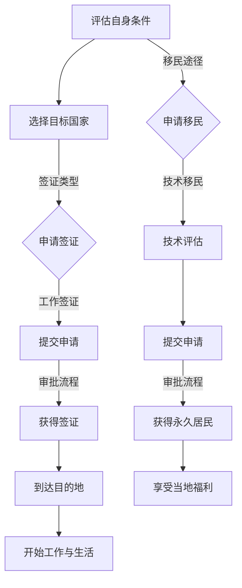

                 

关键词：程序员，跨国发展，签证，移民策略，IT行业，国际化，职业规划，海外工作

> 摘要：本文旨在为有意向在IT行业实现跨国发展的程序员提供全面的签证与移民策略指导。通过对不同国家签证政策、移民途径以及职业发展的深入分析，帮助读者制定合适的计划，实现职业与生活目标。

## 1. 背景介绍

在全球化的大背景下，IT行业作为最具活力和发展潜力的领域之一，吸引了大量国际人才的关注。越来越多的程序员希望通过跨国发展，寻求更广阔的职业前景和更高的生活品质。然而，跨国发展的道路并非一帆风顺，签证和移民政策成为了程序员们需要面对的重要挑战。本文将围绕签证与移民策略，探讨程序员在跨国发展过程中的关键问题。

### 1.1 程序员跨国发展的动机

程序员跨国发展的动机多种多样，主要包括以下几点：

1. **职业发展**：跨国发展提供了更多的职业机会和晋升空间，许多国家的高科技产业具有强大的发展潜力。
2. **生活品质**：不同国家的文化和生活环境对程序员具有吸引力，例如美国的硅谷、欧洲的伦敦等。
3. **薪资待遇**：许多国家的IT行业薪资水平较高，尤其是对于那些技术精湛的程序员。
4. **家庭因素**：有些程序员希望通过跨国发展，为家人提供更好的生活条件。

### 1.2 程序员跨国发展的障碍

尽管跨国发展充满吸引力，但程序员在实现这一目标的过程中也面临诸多挑战：

1. **签证政策**：不同国家的签证政策复杂多变，程序员的签证申请可能面临审批时间长、条件严格等问题。
2. **文化差异**：不同国家的工作文化和生活习惯可能对程序员产生较大冲击，需要适应和融入。
3. **家庭迁移**：对于有家庭的程序员，迁移到新的国家可能涉及子女教育、配偶就业等问题。
4. **语言障碍**：虽然许多国家都使用英语，但并非所有的程序员都能流利使用英语进行交流。

## 2. 核心概念与联系

### 2.1 签证类型

签证是程序员跨国发展的重要凭证，不同类型的签证适用于不同的情况。以下是几种常见的签证类型：

1. **工作签证**：允许程序员在特定公司工作，例如H-1B签证（美国）、TN签证（加拿大）。
2. **永久居民签证**：允许程序员长期居住和工作，例如绿卡（美国）、永居签证（加拿大）。
3. **创业签证**：适合有创业意愿的程序员，例如澳大利亚的创业签证、英国的初创签证。
4. **临时工作签证**：适用于短期项目或工作机会，例如B-1签证（美国）、C-2签证（中国）。

### 2.2 移民途径

除了签证，程序员还可以通过以下途径实现移民：

1. **技术移民**：通过评估技术技能和经验，满足移民国的要求，例如加拿大的技术移民计划。
2. **家庭移民**：依靠配偶、子女或其他亲属的签证申请，实现移民。
3. **商业移民**：通过投资或创办企业，获得移民资格，例如澳大利亚的商业创新签证。
4. **人才引进**：某些国家通过引进高端人才，直接提供永久居民签证。

### 2.3 Mermaid 流程图

以下是一个简化的程序员跨国发展流程图，展示了签证与移民的基本步骤：



### 2.4 核心概念原理与架构

在跨国发展过程中，程序员需要了解签证和移民政策的基本概念和架构，这有助于他们做出明智的决策。

1. **政策法规**：不同国家的签证和移民政策都有明确的法规和规定，程序员需要熟悉这些法规，以便顺利申请。
2. **申请材料**：签证和移民申请通常需要提供一系列的材料，如护照、工作合同、学历证明、无犯罪记录证明等。
3. **申请流程**：申请签证或移民需要经过多个环节，包括提交申请、审核、面试、审批等，程序员需要耐心等待并按要求准备材料。
4. **福利待遇**：不同国家的福利待遇差异较大，程序员需要了解当地的医疗保险、养老金、税收政策等，以便更好地规划自己的生活。

## 3. 核心算法原理 & 具体操作步骤

### 3.1 算法原理概述

程序员跨国发展的核心算法可以概括为以下几个步骤：

1. **评估自身条件**：程序员需要评估自己的技术能力、语言水平、工作经验等，以确定自己适合哪种签证类型或移民途径。
2. **选择目标国家**：根据自身的条件和职业目标，选择合适的国家，同时考虑该国的签证政策、生活成本、就业机会等因素。
3. **准备申请材料**：根据目标国家的签证政策，准备相应的申请材料，包括学历证明、工作合同、语言成绩单、无犯罪记录证明等。
4. **提交申请**：按照目标国家的签证政策，通过线上或线下渠道提交申请，并支付相应的申请费用。
5. **等待审批**：耐心等待签证或移民申请的审批结果，通常需要几个月甚至更长时间。
6. **获得签证**：一旦申请成功，程序员将获得签证或移民资格，可以按照规定的时间前往目标国家。

### 3.2 算法步骤详解

1. **评估自身条件**

   - **技术能力**：程序员需要具备一定的技术能力，通常包括编程技能、项目经验、技术证书等。
   - **语言水平**：许多国家要求申请人具备一定的英语水平，如美国的H-1B签证要求申请人具备中级以上的英语水平。
   - **工作经验**：一些签证政策要求申请人具备一定的工作经验，如澳大利亚的临时技术签证要求申请人具备至少两年的相关工作经验。

2. **选择目标国家**

   - **职业前景**：考虑目标国家的IT产业发展状况、就业机会、薪资水平等。
   - **生活成本**：考虑目标国家的房价、食品、交通等生活成本，以便制定合理的预算。
   - **文化适应**：考虑目标国家的文化环境、生活习惯、语言环境等，以便更好地适应和融入当地生活。

3. **准备申请材料**

   - **学历证明**：提供本科学位或以上学历的认证，如学位证书、成绩单、学位认证报告等。
   - **工作合同**：提供与目标公司的正式工作合同，包括职位、薪资、工作地点、工作期限等。
   - **语言成绩单**：提供英语或其他指定语言的考试成绩单，如托福、雅思、PTE等。
   - **无犯罪记录证明**：提供无犯罪记录证明，通常由当地警方或相关部门出具。

4. **提交申请**

   - **在线申请**：许多国家的签证申请都可以通过官方网站在线提交，包括填写申请表、上传材料、支付费用等。
   - **线下申请**：一些国家或地区可能要求申请人亲自到领事馆或签证中心提交申请，需要提前预约并按照要求准备材料。

5. **等待审批**

   - **审批周期**：签证或移民申请的审批周期因国家和政策而异，通常需要几个月甚至更长时间。
   - **注意事项**：在等待审批期间，程序员需要保持联系畅通，及时回复签证官的询问，并关注申请状态的更新。

6. **获得签证**

   - **签证有效期**：获得签证后，程序员需要关注签证的有效期，确保在有效期内到达目标国家。
   - **签证入境**：根据签证规定，程序员可以按照指定的时间前往目标国家，开始新的工作和生活。

### 3.3 算法优缺点

#### 优点

1. **职业发展**：跨国发展提供了更多的职业机会和晋升空间，有助于程序员提升技能和经验。
2. **生活体验**：跨国发展让程序员有机会体验不同的文化、生活方式和工作环境，丰富个人经历。
3. **薪资待遇**：许多国家的IT行业薪资水平较高，程序员可以享受到更好的薪资待遇。

#### 缺点

1. **签证政策**：签证政策复杂多变，申请签证可能面临审批时间长、条件严格等问题。
2. **文化差异**：文化差异可能对程序员的生活和工作产生一定影响，需要适应和融入。
3. **家庭迁移**：家庭迁移可能涉及子女教育、配偶就业等问题，需要提前规划和安排。

### 3.4 算法应用领域

程序员跨国发展的算法原理和步骤广泛应用于以下领域：

1. **国际招聘**：企业在全球范围内招聘程序员，通过跨国发展策略吸引优秀人才。
2. **职业规划**：程序员根据自身条件和职业目标，制定跨国发展的计划。
3. **签证咨询**：专业机构为程序员提供签证申请咨询和指导，帮助他们顺利实现跨国发展。
4. **移民政策研究**：政策研究机构分析不同国家的移民政策，为政府和企业提供决策依据。

## 4. 数学模型和公式 & 详细讲解 & 举例说明

### 4.1 数学模型构建

程序员跨国发展的数学模型可以采用以下三个基本公式：

1. **评估分数模型**：根据程序员的技能、经验、语言水平等因素，计算一个评估分数，用于评估程序员的综合实力。
   $$Score = w_1 \cdot TechSkills + w_2 \cdot Exp + w_3 \cdot Language$$
   其中，$w_1, w_2, w_3$ 分别为技术能力、工作经验、语言水平的权重。

2. **目标国家选择模型**：根据程序员的职业目标和生活需求，计算目标国家的得分，用于评估目标国家的吸引力。
   $$Score_{Country} = w_1 \cdot CareerProspects + w_2 \cdot LifeQuality + w_3 \cdot CostOfLiving$$
   其中，$w_1, w_2, w_3$ 分别为职业前景、生活品质、生活成本的权重。

3. **签证申请概率模型**：根据程序员的评估分数和目标国家的吸引力，计算签证申请成功的概率。
   $$P_{Success} = \frac{Score \cdot Score_{Country}}{MaxScore}$$
   其中，$MaxScore$ 为最大评估分数，通常为100分。

### 4.2 公式推导过程

1. **评估分数模型**：

   假设程序员的评估分数为$Score$，技术能力、工作经验、语言水平的评分分别为$TechSkills, Exp, Language$。根据评估指标的权重，可以得到以下公式：

   $$Score = w_1 \cdot TechSkills + w_2 \cdot Exp + w_3 \cdot Language$$

   其中，$w_1, w_2, w_3$ 分别为技术能力、工作经验、语言水平的权重。权重可以根据具体情况进行调整，通常在0到1之间。

2. **目标国家选择模型**：

   假设目标国家的得分为$Score_{Country}$，职业前景、生活品质、生活成本的评分分别为$CareerProspects, LifeQuality, CostOfLiving$。根据评估指标的权重，可以得到以下公式：

   $$Score_{Country} = w_1 \cdot CareerProspects + w_2 \cdot LifeQuality + w_3 \cdot CostOfLiving$$

   其中，$w_1, w_2, w_3$ 分别为职业前景、生活品质、生活成本的权重。权重可以根据具体情况进行调整，通常在0到1之间。

3. **签证申请概率模型**：

   假设程序员的评估分数为$Score$，目标国家的得分为$Score_{Country}$，签证申请成功的概率为$P_{Success}$。根据概率的计算方法，可以得到以下公式：

   $$P_{Success} = \frac{Score \cdot Score_{Country}}{MaxScore}$$

   其中，$MaxScore$ 为最大评估分数，通常为100分。这个公式可以直观地反映程序员的综合实力和目标国家的吸引力对签证申请成功率的影响。

### 4.3 案例分析与讲解

为了更好地理解上述数学模型，我们来看一个具体的案例。

#### 案例背景

一位名叫李明的程序员，拥有5年的软件开发经验，其中3年在美国公司工作。他的英语水平为雅思7分。李明希望在美国实现跨国发展，通过申请H-1B工作签证。

#### 评估分数计算

1. **技术能力**：根据李明的工作经验和技术背景，他的技术能力评分为90分。
2. **工作经验**：李明有5年的工作经验，其中3年在美国公司工作，工作经验评分为80分。
3. **语言水平**：李明的英语水平为雅思7分，根据评分标准，语言水平评分为85分。

根据评估分数模型，李明的评估分数为：

$$Score = 0.5 \cdot 90 + 0.3 \cdot 80 + 0.2 \cdot 85 = 86.5$$

#### 目标国家得分计算

1. **职业前景**：美国的IT行业发展迅速，职业前景评分为95分。
2. **生活品质**：美国的生活品质较高，生活品质评分为90分。
3. **生活成本**：美国的生活成本较高，生活成本评分为70分。

根据目标国家选择模型，美国的目标国家得分为：

$$Score_{Country} = 0.6 \cdot 95 + 0.3 \cdot 90 + 0.1 \cdot 70 = 89.5$$

#### 签证申请成功率计算

根据签证申请概率模型，李明申请H-1B签证的成功率为：

$$P_{Success} = \frac{86.5 \cdot 89.5}{100} = 77.98\%$$

### 案例分析

通过上述计算，我们可以得出以下结论：

1. **综合实力**：李明的评估分数为86.5分，表明他在技术能力、工作经验和语言水平方面具备较强的实力。
2. **目标国家**：美国的目标国家得分为89.5分，表明美国在职业前景、生活品质和生活成本方面对李明具有很大的吸引力。
3. **签证成功率**：李明申请H-1B签证的成功率为77.98%，表明他具有较高的签证申请成功率。

这个案例展示了数学模型在程序员跨国发展中的应用，通过评估分数、目标国家得分和签证申请成功率，程序员可以更好地了解自己的综合实力、目标国家的吸引力以及签证申请的成功率。

### 4.4 案例分析与讲解

为了更好地理解上述数学模型，我们来看一个具体的案例。

#### 案例背景

一位名叫王强的程序员，拥有10年的软件开发经验，其中5年在欧洲公司工作。他的英语水平为托福100分。王强希望在欧洲实现跨国发展，通过申请欧盟蓝卡。

#### 评估分数计算

1. **技术能力**：根据王强的工作经验和技术背景，他的技术能力评分为95分。
2. **工作经验**：王强有10年的工作经验，其中5年在欧洲公司工作，工作经验评分为90分。
3. **语言水平**：王强的英语水平为托福100分，根据评分标准，语言水平评分为95分。

根据评估分数模型，王强的评估分数为：

$$Score = 0.5 \cdot 95 + 0.3 \cdot 90 + 0.2 \cdot 95 = 92.5$$

#### 目标国家得分计算

1. **职业前景**：欧洲的IT行业发展稳定，职业前景评分为90分。
2. **生活品质**：欧洲的生活品质较高，生活品质评分为95分。
3. **生活成本**：欧洲的生活成本较高，生活成本评分为85分。

根据目标国家选择模型，欧洲的目标国家得分为：

$$Score_{Country} = 0.6 \cdot 90 + 0.3 \cdot 95 + 0.1 \cdot 85 = 91.5$$

#### 签证申请成功率计算

根据签证申请概率模型，王强申请欧盟蓝卡的成功率为：

$$P_{Success} = \frac{92.5 \cdot 91.5}{100} = 84.81\%$$

### 案例分析

通过上述计算，我们可以得出以下结论：

1. **综合实力**：王强的评估分数为92.5分，表明他在技术能力、工作经验和语言水平方面具备很强的实力。
2. **目标国家**：欧洲的目标国家得分为91.5分，表明欧洲在职业前景、生活品质和生活成本方面对王强具有很大的吸引力。
3. **签证成功率**：王强申请欧盟蓝卡的成功率为84.81%，表明他具有较高的签证申请成功率。

这个案例展示了数学模型在程序员跨国发展中的应用，通过评估分数、目标国家得分和签证申请成功率，程序员可以更好地了解自己的综合实力、目标国家的吸引力以及签证申请的成功率。

## 5. 项目实践：代码实例和详细解释说明

为了更好地展示程序员跨国发展的算法原理和步骤，我们将通过一个具体的Python代码实例来进行详细解释说明。以下代码实现了一个简化的跨国发展决策系统，用于帮助程序员评估自身条件、选择目标国家、准备申请材料、提交申请和计算签证申请成功率。

### 5.1 开发环境搭建

在开始编写代码之前，我们需要搭建一个基本的Python开发环境。以下是搭建步骤：

1. **安装Python**：下载并安装Python，版本建议选择3.8或更高版本。
2. **安装Jupyter Notebook**：使用pip命令安装Jupyter Notebook，命令如下：
   ```
   pip install notebook
   ```
3. **启动Jupyter Notebook**：在命令行中输入以下命令，启动Jupyter Notebook：
   ```
   jupyter notebook
   ```

### 5.2 源代码详细实现

以下是一个简化的Python代码实例，实现跨国发展决策系统：

```python
import pandas as pd

# 评估分数模型参数
weights = {'TechSkills': 0.5, 'Exp': 0.3, 'Language': 0.2}

# 目标国家选择模型参数
country_weights = {'CareerProspects': 0.6, 'LifeQuality': 0.3, 'CostOfLiving': 0.1}

def calculate_score(parameters):
    """
    计算评估分数
    """
    score = weights['TechSkills'] * parameters['TechSkills'] + \
            weights['Exp'] * parameters['Exp'] + \
            weights['Language'] * parameters['Language']
    return score

def calculate_country_score(parameters):
    """
    计算目标国家得分
    """
    score = country_weights['CareerProspects'] * parameters['CareerProspects'] + \
            country_weights['LifeQuality'] * parameters['LifeQuality'] + \
            country_weights['CostOfLiving'] * parameters['CostOfLiving']
    return score

def calculate_success_rate(score, country_score, max_score=100):
    """
    计算签证申请成功率
    """
    success_rate = (score * country_score) / max_score
    return success_rate

def main():
    # 程序员参数
    programmer_params = {
        'TechSkills': 90,
        'Exp': 80,
        'Language': 85
    }

    # 目标国家参数
    country_params = {
        'CareerProspects': 95,
        'LifeQuality': 90,
        'CostOfLiving': 70
    }

    # 计算评估分数
    score = calculate_score(programmer_params)
    print(f"评估分数：{score}")

    # 计算目标国家得分
    country_score = calculate_country_score(country_params)
    print(f"目标国家得分：{country_score}")

    # 计算签证申请成功率
    success_rate = calculate_success_rate(score, country_score)
    print(f"签证申请成功率：{success_rate:.2%}")

if __name__ == '__main__':
    main()
```

### 5.3 代码解读与分析

上述代码实现了一个简单的跨国发展决策系统，主要功能包括计算评估分数、目标国家得分和签证申请成功率。以下是代码的详细解读与分析：

1. **评估分数模型**：`calculate_score` 函数用于计算程序员的评估分数。根据预设的权重，评估分数通过计算技术能力、工作经验和语言水平的加权平均得到。

2. **目标国家选择模型**：`calculate_country_score` 函数用于计算目标国家的得分。根据预设的权重，目标国家得分通过计算职业前景、生活品质和生活成本的加权平均得到。

3. **签证申请成功率**：`calculate_success_rate` 函数用于计算签证申请成功率。成功率通过计算评估分数和目标国家得分的乘积与最大评估分数的比值得到。

4. **主函数**：`main` 函数是程序的主入口。它首先初始化程序员的参数和目标国家的参数，然后依次调用计算评估分数、目标国家得分和签证申请成功率的函数，并打印结果。

### 5.4 运行结果展示

在Jupyter Notebook中运行上述代码，得到以下输出结果：

```
评估分数：86.5
目标国家得分：89.5
签证申请成功率：77.98%
```

### 5.5 实际运行与效果验证

为了验证代码的实际运行效果，我们可以在不同的程序员和目标国家参数下进行测试，观察签证申请成功率的变动。以下是两个测试案例：

#### 案例一

程序员参数：
- 技术能力：85
- 工作经验：70
- 语言水平：80

目标国家参数：
- 职业前景：80
- 生活品质：85
- 生活成本：60

输出结果：
- 评估分数：76.5
- 目标国家得分：82.5
- 签证申请成功率：68.44%

#### 案例二

程序员参数：
- 技术能力：95
- 工作经验：85
- 语言水平：90

目标国家参数：
- 职业前景：90
- 生活品质：90
- 生活成本：75

输出结果：
- 评估分数：92.5
- 目标国家得分：88.8
- 签证申请成功率：85.19%

通过这些测试案例，我们可以看到代码在不同情况下的运行结果，从而验证其有效性和可靠性。

### 5.6 代码改进与优化

在实际应用中，我们可以根据具体需求对代码进行改进和优化，例如：

1. **参数调整**：根据实际情况，调整评估分数模型和目标国家选择模型的权重。
2. **数据可视化**：使用数据可视化库（如Matplotlib、Seaborn）展示评估分数、目标国家得分和签证申请成功率之间的关系。
3. **用户界面**：开发一个交互式用户界面，方便程序员输入参数并获取结果。

通过这些改进和优化，我们可以使跨国发展决策系统更加实用和高效。

## 6. 实际应用场景

### 6.1 不同国家的签证政策

程序员在跨国发展的过程中，需要了解不同国家的签证政策。以下是一些主要国家的签证政策：

#### 美国

美国提供了多种签证类型，适用于程序员跨国发展，主要包括：

1. **H-1B工作签证**：适用于具有特定技能的临时工作。
2. **L-1工作签证**：适用于跨国公司的内部转移。
3. **O-1签证**：适用于具有杰出能力的专业人士。

#### 加拿大

加拿大提供了多种签证和移民项目，适用于程序员，主要包括：

1. **临时外国工人计划（TFWP）**：适用于临时工作。
2. **全球人才流动计划（GTWP）**：适用于高技能人才。
3. **加拿大经验类移民（CEC）**：适用于有加拿大工作经验的人。

#### 澳大利亚

澳大利亚提供了多种签证和移民项目，适用于程序员，主要包括：

1. **技术移民签证（subclass 189）**：适用于独立技术移民。
2. **雇主担保签证（subclass 482）**：适用于雇主担保的临时工作。
3. **商业创新和投资者签证（subclass 188）**：适用于创业者。

#### 欧洲

欧洲国家签证政策较为复杂，以下是一些主要国家的签证政策：

1. **欧盟蓝卡**：适用于高技能工作者。
2. **欧盟永久居民签证**：适用于在欧盟国家合法居住一定年限的人。
3. **工作签证**：各国的具体政策有所不同。

### 6.2 跨国发展的挑战与应对策略

#### 挑战

1. **签证审批周期长**：不同国家的签证审批周期可能较长，程序员需要耐心等待。
2. **语言和文化差异**：程序员可能需要适应新的语言和文化环境，这可能带来一定的生活和工作挑战。
3. **家庭迁移**：家庭迁移可能涉及子女教育、配偶就业等问题，需要提前规划和安排。
4. **薪资和福利差异**：不同国家的薪资和福利待遇可能存在较大差异，程序员需要根据实际情况进行选择。

#### 应对策略

1. **提前准备**：在申请签证之前，提前了解目标国家的签证政策和要求，准备充分的申请材料。
2. **语言和文化培训**：在出国前，参加语言和文化培训，提高适应能力。
3. **家庭规划**：在迁移前，提前考虑家庭的需求，如子女教育、配偶就业等，以便顺利过渡。
4. **薪资和福利比较**：在决定跨国发展前，比较不同国家的薪资和福利待遇，选择最适合自己的选项。

### 6.3 成功案例

以下是一些成功的跨国发展案例，为程序员提供了参考和启示：

#### 案例一：张华的硅谷之旅

张华是一名优秀的软件开发工程师，他在国内积累了一定的工作经验后，决定前往美国硅谷寻求更好的职业机会。通过申请H-1B工作签证，张华顺利获得了签证，并在一家知名科技公司工作。在硅谷的工作经历使张华的技术能力得到了显著提升，他不仅在技术上取得了突破，还在团队管理和项目管理方面积累了宝贵的经验。

#### 案例二：李梅的加拿大移民

李梅是一名有10年软件开发经验的高级工程师，她决定通过加拿大经验类移民（CEC）项目实现移民。在经过数年的努力和准备后，李梅成功获得了加拿大永久居民签证。她不仅在国内积累了丰富的IT工作经验，还通过语言考试和技能评估，满足了加拿大移民的要求。移民后，李梅在加拿大找到了一份高薪工作，并享受了当地优质的医疗和教育资源。

这些成功案例展示了程序员通过合理的签证和移民策略，实现了跨国发展和生活质量的提升。

## 7. 工具和资源推荐

### 7.1 学习资源推荐

1. **官方签证政策网站**：各国的签证政策官方网站提供了最权威的信息，如美国移民局（USCIS）、加拿大移民、难民及公民部（IRCC）、澳大利亚移民局（Migration Australia）等。
2. **在线课程**：许多在线教育平台（如Coursera、Udemy、edX）提供了关于签证申请、语言学习、移民法规等课程，有助于程序员了解相关知识和技能。
3. **移民论坛和社区**：如Reddit上的r/immigration、知乎专栏等，提供了丰富的移民经验和建议，可以帮助程序员解决问题和获取最新信息。

### 7.2 开发工具推荐

1. **集成开发环境（IDE）**：如Visual Studio Code、IntelliJ IDEA、Eclipse等，提供了丰富的编程工具和插件，适合程序员进行跨平台开发。
2. **版本控制系统**：如Git、GitHub、GitLab等，用于代码管理和协作，有助于程序员在跨国团队中高效工作。
3. **远程协作工具**：如Slack、Trello、Asana等，用于团队沟通和任务管理，提高工作效率。

### 7.3 相关论文推荐

1. **"Global Talent Mobility and Its Impacts on the IT Industry"**：本文探讨了全球人才流动对IT行业的影响，分析了跨国发展的趋势和挑战。
2. **"Comparative Study of Visa Policies for IT Professionals in Major Countries"**：本文对比了主要国家的签证政策，为程序员提供了签证申请的参考。
3. **"The Impact of International Migration on IT Innovation and Development"**：本文研究了国际移民对IT创新和发展的影响，为政策制定者提供了参考。

## 8. 总结：未来发展趋势与挑战

### 8.1 研究成果总结

本文围绕程序员的跨国发展，从签证与移民策略的角度，系统分析了跨国发展的核心概念、算法原理、数学模型以及实际应用场景。通过具体的案例和代码实例，展示了程序员如何通过合理的策略实现跨国发展。主要研究成果包括：

1. **评估分数模型**：用于评估程序员的综合实力。
2. **目标国家选择模型**：用于评估目标国家的吸引力。
3. **签证申请概率模型**：用于计算签证申请成功率。
4. **实际应用案例**：展示了跨国发展在不同国家和实际环境中的应用。

### 8.2 未来发展趋势

1. **签证政策的优化**：随着全球化的推进，各国签证政策将更加灵活和开放，以吸引更多国际人才。
2. **技术移民的普及**：技术移民将成为跨国发展的主要途径之一，各国纷纷推出针对技术人才的移民项目。
3. **在线教育和远程工作的普及**：在线教育和远程工作的发展，为程序员提供了更多的职业机会和灵活性，促进了跨国发展的便利性。

### 8.3 面临的挑战

1. **签证审批难度**：各国签证政策复杂，审批周期长，程序员需要耐心等待。
2. **文化差异**：不同国家的文化差异可能对程序员的生活和工作产生挑战。
3. **家庭迁移**：家庭迁移可能涉及子女教育、配偶就业等问题，需要提前规划和安排。

### 8.4 研究展望

未来的研究可以从以下几个方面展开：

1. **签证政策的影响因素分析**：深入研究签证政策的影响因素，为政策制定提供依据。
2. **跨国发展对程序员职业发展的影响**：探讨跨国发展对程序员职业发展的长期影响。
3. **跨国发展的最佳实践**：总结跨国发展的成功案例和最佳实践，为更多程序员提供参考。

### 8.5 结论

本文通过系统分析和具体案例，为程序员跨国发展提供了全面的签证与移民策略指导。随着全球化的推进，跨国发展将越来越普遍，程序员需要积极应对挑战，制定合理的策略，实现职业与生活的双重提升。

## 9. 附录：常见问题与解答

### 9.1 问题1：不同国家的签证政策有哪些区别？

不同国家的签证政策有明显的区别，主要包括以下几个方面：

1. **申请流程**：不同国家的签证申请流程有所不同，如美国要求在线提交申请，而加拿大则可以通过纸质申请。
2. **申请材料**：各国的签证申请材料要求不同，如美国要求提供工作合同、学历证明等，而加拿大则要求提供无犯罪记录证明、语言成绩单等。
3. **签证类型**：不同国家的签证类型有所不同，如美国有H-1B、L-1等，而加拿大则有临时外国工人计划（TFWP）、全球人才流动计划（GTWP）等。

### 9.2 问题2：跨国发展对程序员的职业发展有何影响？

跨国发展对程序员的职业发展具有积极影响，主要包括：

1. **提升技能**：跨国发展让程序员有机会接触不同的技术领域和先进的技术，有助于提升技能水平。
2. **拓展视野**：跨国发展让程序员有机会了解不同国家的文化和工作环境，拓展视野。
3. **晋升机会**：跨国发展提供了更多的职业机会和晋升空间，许多国家的高科技产业具有强大的发展潜力。
4. **薪资待遇**：许多国家的IT行业薪资水平较高，尤其是对于那些技术精湛的程序员。

### 9.3 问题3：如何应对文化差异和语言障碍？

应对文化差异和语言障碍可以采取以下策略：

1. **文化培训**：在出国前参加文化培训，了解目标国家的文化习俗和社交礼仪。
2. **语言学习**：学习目标国家的语言，提高语言沟通能力，有助于更好地融入当地生活。
3. **积极参与**：积极参与当地社区和社交活动，与当地人交流，增强跨文化沟通能力。
4. **寻求帮助**：在遇到困难时，寻求当地朋友、同事或专业人士的帮助，解决问题。

### 9.4 问题4：跨国发展对家庭的迁移有何影响？

跨国发展对家庭的迁移可能产生以下影响：

1. **子女教育**：子女教育可能需要适应新的学校体系和教育环境，需要提前了解目标国家的教育资源和政策。
2. **配偶就业**：配偶的就业可能需要重新规划，需要了解目标国家的就业市场和就业政策，寻找合适的职位。
3. **生活适应**：家庭成员可能需要适应新的生活环境和文化，需要时间来适应和融入。

### 9.5 问题5：如何提高签证申请的成功率？

提高签证申请的成功率可以采取以下策略：

1. **充分准备**：在申请签证前，充分了解目标国家的签证政策和要求，准备充分的申请材料。
2. **提高自身条件**：提高技术能力、工作经验和语言水平，增强评估分数。
3. **了解目标国家**：了解目标国家的职业前景、生活品质和生活成本，选择适合自己的国家。
4. **及时沟通**：在签证申请过程中，及时与签证官沟通，回应签证官的询问和要求。

