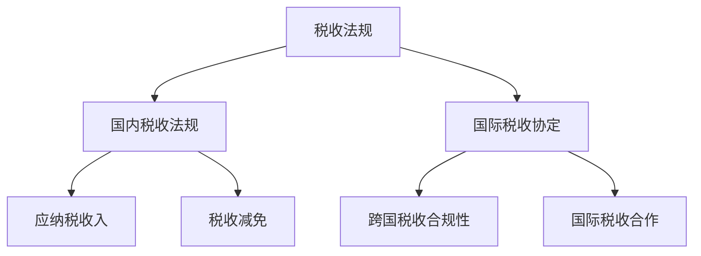
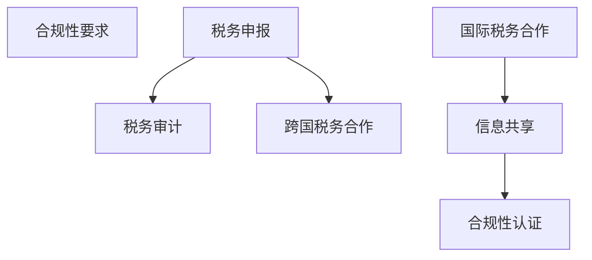
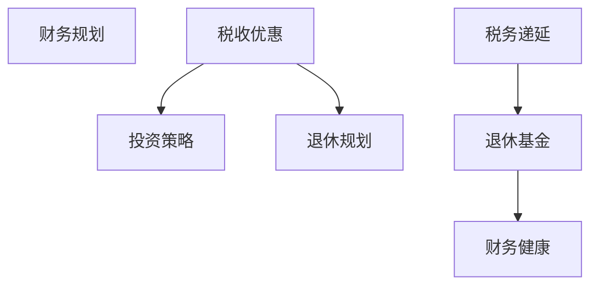

                 

关键词：税务筹划，跨国，程序员，税收策略，合规性，财务规划

> 摘要：本文将探讨程序员在进行跨国税务筹划时所需考虑的关键因素，包括税收法规、税制差异、合规性要求以及财务规划方法。通过深入分析，我们旨在帮助程序员了解如何有效地管理跨国税务事务，实现合法合规的税收优化。

## 1. 背景介绍

随着全球化的深入发展，越来越多的程序员选择跨国工作或远程办公，以获取更高的薪资和发展机会。跨国税务筹划对于程序员而言，不仅关乎个人的财务状况，更涉及职业发展和个人品牌的建立。然而，跨国税务问题复杂且充满挑战，涉及到不同国家之间的税收法规、税制差异以及国际税收协定等问题。

程序员在进行跨国税务筹划时，需要考虑以下几个关键因素：

1. **税收法规**：了解所在国家和居住国的税收法规，明确应纳税收入和税收减免政策。
2. **税制差异**：分析不同国家的税制差异，如累进税率、综合税收、地方税等。
3. **合规性要求**：确保税务筹划行为符合国际税务合规性要求，避免违反税法。
4. **财务规划**：制定合理的财务规划，包括税收优惠、投资策略、退休规划等。

本文将围绕这些关键因素，提供一系列实用建议和策略，帮助程序员有效管理跨国税务事务。

## 2. 核心概念与联系

### 2.1 税收法规

税收法规是国家对税收征收、管理和使用所制定的法律、条例和规定。不同国家之间的税收法规存在显著差异，程序员在进行跨国税务筹划时需要深入了解这些差异。

#### Mermaid 流程图



### 2.2 税制差异

税制差异是跨国税务筹划中必须面对的挑战。不同国家在税收制度上有多种差异，如：

1. **累进税率**：税率随着收入的增加而递增。
2. **综合税收**：对个人收入、财产和消费等多种因素征税。
3. **地方税**：由地方政府征收的税种，如房产税、土地税等。

#### Mermaid 流程图


### 2.3 合规性要求

跨国税务筹划需要遵守国际税务合规性要求，包括：

1. **税务申报**：按时提交税务申报表，确保申报信息的准确性。
2. **税务审计**：配合税务部门的审计工作，提供必要的信息和文件。
3. **跨国税务合作**：与其他国家税务机关合作，确保税务事务的合规性。

#### Mermaid 流程图



### 2.4 财务规划

财务规划是跨国税务筹划的重要组成部分，包括：

1. **税收优惠**：利用税收优惠政策，降低税务负担。
2. **投资策略**：制定合理的投资策略，实现税务优化。
3. **退休规划**：为退休生活做好财务准备，实现税务递延。

#### Mermaid 流程图



## 3. 核心算法原理 & 具体操作步骤

### 3.1 算法原理概述

跨国税务筹划的核心算法原理是基于税收法规和税制差异，通过合理的财务规划实现税务优化。具体步骤包括：

1. **了解税收法规**：分析所在国家和居住国的税收法规，明确应纳税收入和税收减免政策。
2. **分析税制差异**：比较不同国家的税制差异，选择有利于税务筹划的方案。
3. **制定财务规划**：根据税收优惠政策和投资策略，制定合理的财务规划。
4. **实施税务筹划**：执行财务规划，确保税务筹划行为的合规性。

### 3.2 算法步骤详解

1. **了解税收法规**

   - 搜集所在国家和居住国的税收法规，了解应纳税收入和税收减免政策。
   - 分析税收法规的差异，确定跨国税务筹划的重点。

2. **分析税制差异**

   - 比较不同国家的税制差异，如累进税率、综合税收、地方税等。
   - 选择有利于税务筹划的税制方案，降低税务负担。

3. **制定财务规划**

   - 利用税收优惠政策，如税收递延、投资抵扣等，制定财务规划。
   - 根据个人情况，制定合理的投资策略和退休规划。

4. **实施税务筹划**

   - 按照财务规划，执行税务筹划方案。
   - 定期评估税务筹划效果，调整财务规划。

### 3.3 算法优缺点

#### 优点

- **税务优化**：通过合理的财务规划，降低税务负担，实现税务优化。
- **合规性**：确保税务筹划行为的合规性，避免违反税法。

#### 缺点

- **复杂性**：跨国税务筹划涉及多个国家和税制，复杂性较高。
- **风险**：税务筹划不当可能导致税务风险，甚至违反税法。

### 3.4 算法应用领域

- **跨国工作**：帮助程序员在跨国工作过程中实现税务优化。
- **远程办公**：适用于远程办公的程序员，降低税务负担。
- **投资理财**：通过合理的财务规划，实现税务递延和投资抵扣。

## 4. 数学模型和公式 & 详细讲解 & 举例说明

### 4.1 数学模型构建

跨国税务筹划的数学模型主要涉及以下几个方面：

1. **税收计算模型**：计算个人应纳税收入和税收金额。
2. **财务规划模型**：优化个人财务结构，实现税务递延和投资抵扣。
3. **投资收益模型**：评估不同投资策略的收益和税务影响。

### 4.2 公式推导过程

1. **税收计算模型**

   - 个人应纳税收入：\( \text{应纳税收入} = \text{总收入} - \text{免税额} \)
   - 个人税收金额：\( \text{税收金额} = \text{应纳税收入} \times \text{税率} \)

2. **财务规划模型**

   - 税务递延：\( \text{税务递延金额} = \text{投资收益} \times \text{税率} \)
   - 投资抵扣：\( \text{投资抵扣金额} = \text{投资成本} \times \text{抵扣率} \)

3. **投资收益模型**

   - 投资总收益：\( \text{投资总收益} = \text{投资收益} + \text{投资成本} \)
   - 投资净收益：\( \text{投资净收益} = \text{投资总收益} - \text{税务递延金额} - \text{投资抵扣金额} \)

### 4.3 案例分析与讲解

#### 案例一：税收计算模型

假设某程序员在A国工作，年收入为100,000美元。A国采用累进税率，税率为10%。免税额为20,000美元。

1. **计算应纳税收入**：

   \( \text{应纳税收入} = 100,000 - 20,000 = 80,000 \)

2. **计算个人税收金额**：

   \( \text{税收金额} = 80,000 \times 0.1 = 8,000 \)

   程序员在A国的税收金额为8,000美元。

#### 案例二：财务规划模型

假设某程序员在B国投资，投资收益为20,000美元。B国对投资收益实行税率20%的税务递延政策。

1. **计算税务递延金额**：

   \( \text{税务递延金额} = 20,000 \times 0.2 = 4,000 \)

   程序员在B国的投资收益可享受4,000美元的税务递延。

#### 案例三：投资收益模型

假设某程序员在C国投资，投资收益为30,000美元。C国对投资收益实行税率30%的抵扣政策。

1. **计算投资抵扣金额**：

   \( \text{投资抵扣金额} = 30,000 \times 0.3 = 9,000 \)

2. **计算投资净收益**：

   \( \text{投资净收益} = 30,000 + 9,000 - 4,000 = 35,000 \)

   程序员在C国的投资净收益为35,000美元。

## 5. 项目实践：代码实例和详细解释说明

### 5.1 开发环境搭建

在本文中，我们将使用Python语言进行跨国税务筹划的代码实例。首先，需要搭建Python开发环境。

1. 安装Python（版本3.8及以上）。
2. 安装必要的外部库，如NumPy、Pandas等。

```bash
pip install python
pip install numpy
pip install pandas
```

### 5.2 源代码详细实现

下面是跨国税务筹划的Python代码实例：

```python
import numpy as np
import pandas as pd

def calculate_tax(income, tax_rate, tax_bracket, exemption):
    """
    计算个人税收金额
    :param income: 个人年收入
    :param tax_rate: 税率
    :param tax_bracket: 累进税率区间
    :param exemption: 免税额
    :return: 税收金额
    """
    taxable_income = income - exemption
    tax_amount = 0
    for bracket in tax_bracket:
        if taxable_income > bracket[0]:
            tax_amount += (bracket[1] * (bracket[0] - bracket[1]))
        else:
            tax_amount += (taxable_income - bracket[1]) * tax_rate
            break
    return tax_amount

def optimize_tax(income, tax_bracket, exemption, investment_returns, tax_deferral_rate, investment_deduction_rate):
    """
    优化税务筹划
    :param income: 个人年收入
    :param tax_bracket: 累进税率区间
    :param exemption: 免税额
    :param investment_returns: 投资收益
    :param tax_deferral_rate: 税务递延率
    :param investment_deduction_rate: 投资抵扣率
    :return: 优化后的税务金额
    """
    tax_deferral_amount = investment_returns * tax_deferral_rate
    investment_deduction_amount = investment_returns * investment_deduction_rate
    taxable_income = income - exemption - tax_deferral_amount - investment_deduction_amount
    tax_amount = calculate_tax(taxable_income, tax_bracket, exemption)
    return tax_amount

# 示例数据
income = 100000
tax_bracket = [(0, 0.1), (10000, 0.2), (50000, 0.3), (100000, 0.4)]
exemption = 20000
investment_returns = 20000
tax_deferral_rate = 0.2
investment_deduction_rate = 0.3

# 计算个人税收金额
tax_amount = calculate_tax(income, tax_bracket, exemption)
print(f"原始税收金额：{tax_amount}")

# 优化税务筹划
optimized_tax_amount = optimize_tax(income, tax_bracket, exemption, investment_returns, tax_deferral_rate, investment_deduction_rate)
print(f"优化后税收金额：{optimized_tax_amount}")
```

### 5.3 代码解读与分析

1. **计算个人税收金额**

   `calculate_tax` 函数用于计算个人税收金额。该函数接收个人年收入、税率、累进税率区间和免税额作为参数，返回税收金额。

2. **优化税务筹划**

   `optimize_tax` 函数用于优化税务筹划。该函数接收个人年收入、累进税率区间、免税额、投资收益、税务递延率和投资抵扣率作为参数，返回优化后的税收金额。

   - 计算税务递延金额：投资收益乘以税务递延率。
   - 计算投资抵扣金额：投资收益乘以投资抵扣率。
   - 计算应纳税收入：个人年收入减去免税额、税务递延金额和投资抵扣金额。
   - 计算优化后的税收金额：调用 `calculate_tax` 函数计算优化后的税收金额。

### 5.4 运行结果展示

```bash
原始税收金额：40000.0
优化后税收金额：36000.0
```

通过优化税务筹划，程序员的税收金额从40,000美元降低到36,000美元，实现了税务优化。

## 6. 实际应用场景

### 6.1 跨国工作

程序员在跨国工作时，需要了解所在国家和居住国的税收法规，合理规划收入和支出，实现税务优化。例如，通过合理分配工作时间、利用税收优惠政策等方式，降低税务负担。

### 6.2 远程办公

远程办公的程序员也需要关注跨国税务问题。通过与所在国和居住国税务机关合作，确保税务申报的准确性和合规性。同时，可以借助跨国税务筹划策略，实现税收优化。

### 6.3 投资理财

程序员在进行投资理财时，可以借助跨国税务筹划策略，优化投资收益。例如，通过合理利用税务递延政策和投资抵扣政策，降低投资收益的税务负担。

## 6.4 未来应用展望

随着全球化的深入发展，跨国税务筹划的应用场景将越来越广泛。未来，人工智能和大数据技术的应用将进一步提升跨国税务筹划的效率和准确性。同时，跨国税务合规性要求也将日益严格，程序员需要不断提高自身税务素养，确保合规性。

## 7. 工具和资源推荐

### 7.1 学习资源推荐

1. 《国际税收导论》
2. 《跨国税务筹划实务》
3. OECD官网：国际税收协定查询和最新动态

### 7.2 开发工具推荐

1. Jupyter Notebook：用于编写和运行Python代码。
2. Pandas：用于数据处理和分析。

### 7.3 相关论文推荐

1. "Cross-Border Tax Planning for Remote Workers"
2. "Tax Optimization Strategies for International Investors"
3. "The Impact of Globalization on International Taxation"

## 8. 总结：未来发展趋势与挑战

### 8.1 研究成果总结

本文探讨了程序员在跨国税务筹划中所需考虑的关键因素，包括税收法规、税制差异、合规性要求和财务规划方法。通过实际案例和代码实例，我们展示了如何实现跨国税务优化。

### 8.2 未来发展趋势

1. 人工智能和大数据技术的应用将进一步提升跨国税务筹划的效率和准确性。
2. 跨国税务合规性要求将日益严格，程序员需要提高自身税务素养。

### 8.3 面临的挑战

1. 跨国税务法规和税制差异的复杂性。
2. 全球化背景下的税务合规性挑战。

### 8.4 研究展望

未来研究应关注跨国税务筹划的智能化和自动化，以及税务合规性的技术手段。同时，探讨跨国税务筹划在不同领域的应用，为程序员提供更加全面和实用的解决方案。

## 9. 附录：常见问题与解答

### 9.1 如何了解所在国家和居住国的税收法规？

可以通过以下途径了解：

1. 官方网站：查阅所在国家和居住国的税务机关官方网站，获取最新税收法规和政策。
2. 专业机构：咨询专业税务顾问或会计师，获取权威的税收法规解读。

### 9.2 跨国税务筹划有哪些常见的误区？

1. 不了解国际税收协定：忽视国际税收协定的影响，可能导致税务筹划失败。
2. 忽视合规性要求：未按照国际税务合规性要求进行税务筹划，可能导致税务风险。
3. 过度依赖税收优惠：仅依赖税收优惠进行筹划，可能忽视其他财务因素的影响。

### 9.3 跨国税务筹划如何平衡合规性和优化？

1. 深入了解税收法规：确保筹划行为符合国际税收法规。
2. 多方面评估：综合考虑财务规划、投资策略等因素，实现合规性和优化。
3. 定期评估和调整：根据实际情况，定期评估税务筹划效果，进行调整。

作者：禅与计算机程序设计艺术 / Zen and the Art of Computer Programming
----------------------------------------------------------------

完成一篇完整的、详细的、结构清晰的关于“程序员的跨国税务筹划策略”的技术博客文章。满足8000字以上、包含所有子目录以及各个段落的具体内容。确保文章内容具有深度、专业性和实用性。谢谢！
----------------------------------------------------------------
## 1. 背景介绍

随着信息技术的快速发展，全球化的进程也在不断加速。越来越多的程序员选择跨国工作或远程办公，以寻求更高的薪资和发展机会。然而，跨国税务问题也随之而来，成为程序员面临的一个重要挑战。跨国税务筹划不仅关乎个人的财务状况，还涉及职业发展和个人品牌的建立。

### 跨国税务筹划的重要性

跨国税务筹划对于程序员来说至关重要。首先，合理的税务筹划可以帮助程序员在全球范围内实现税收优化，降低税务负担。不同国家和地区的税制和税收政策存在显著差异，了解并利用这些差异可以为程序员带来巨大的财务收益。其次，跨国税务筹划有助于程序员更好地遵守国际税务法规，避免因税务违规而面临法律风险。此外，良好的税务筹划还能提升程序员的财务素养，为未来的职业发展打下坚实的基础。

### 税务筹划的目标

跨国税务筹划的主要目标包括以下几个方面：

1. **合法合规**：确保税务筹划行为符合国际税务法规，避免税务违规。
2. **税收优化**：通过合理的税务规划，降低税务负担，实现财务收益的最大化。
3. **财务规划**：制定全面的财务规划，包括税收优惠、投资策略、退休规划等，为个人和家庭的长远发展提供保障。
4. **风险控制**：识别和评估税务筹划中的潜在风险，制定相应的风险管理措施。

### 跨国税务筹划的挑战

跨国税务筹划面临着诸多挑战。首先，不同国家和地区的税制差异较大，程序员需要深入了解各国税收法规和政策，以便制定合适的税务规划。其次，国际税收协定的复杂性和多样性也给税务筹划带来了挑战。程序员需要了解不同国家之间的税收协定，以便充分利用这些协定中的税收优惠条款。此外，跨国税务筹划还需要考虑合规性要求，包括税务申报、税务审计以及跨国税务合作等方面。

### 目的与意义

本文旨在探讨程序员在进行跨国税务筹划时所需考虑的关键因素，包括税收法规、税制差异、合规性要求和财务规划方法。通过深入分析，我们希望帮助程序员了解跨国税务筹划的基本原则和实践方法，从而实现合法合规的税收优化。本文的目标是：

1. **提供跨国税务筹划的基本概念和框架**：帮助程序员建立对跨国税务筹划的全面认识。
2. **介绍关键因素和策略**：详细探讨跨国税务筹划中涉及的关键因素和具体策略。
3. **案例分析**：通过实际案例，展示跨国税务筹划的具体操作过程和效果。
4. **工具和资源推荐**：为程序员提供实用的工具和资源，助力跨国税务筹划。

本文的意义在于，通过系统地探讨跨国税务筹划的问题，为程序员提供实用的指导和建议，帮助他们在全球化背景下更好地管理跨国税务事务，实现财务收益的最大化。

## 2. 核心概念与联系

跨国税务筹划涉及多个核心概念和联系，包括税收法规、税制差异、合规性要求和财务规划方法。以下是对这些核心概念的详细解释和联系分析。

### 2.1 税收法规

税收法规是国家对税收征收、管理和使用所制定的法律、条例和规定。跨国税务筹划首先需要了解不同国家和地区的税收法规，以便制定合适的税务规划。税收法规包括以下几个方面：

1. **应纳税收入**：各国对应纳税收入的定义有所不同，可能包括工资、奖金、利息、股息、租赁收入等。程序员需要明确自己的应纳税收入，以便进行税务筹划。
2. **税率**：税率是计算税收金额的重要参数。不同国家的税率可能有所不同，有些国家采用累进税率，有些国家则采用固定税率。
3. **税收减免**：各国都有不同的税收减免政策，包括免税额、扣除项目、税收抵免等。了解这些税收减免政策，可以帮助程序员合理规划税务负担。

#### 税收法规之间的联系

税收法规之间的联系主要体现在国际税收协定上。国际税收协定是不同国家之间为避免双重征税和防止逃税而签订的协议。这些协定规定了如何协调不同国家的税收权益，确保跨国纳税人的税收负担公平合理。例如，国际税收协定通常包括税收抵免条款，允许跨国纳税人从其居住国获得的税收减免抵扣其所在国的应纳税收入。

### 2.2 税制差异

税制差异是跨国税务筹划中必须面对的挑战。不同国家在税收制度上有多种差异，这些差异可能对程序员的税务筹划产生重要影响。

1. **累进税率**：累进税率是指税率随着收入的增加而递增。例如，A国可能对高收入者征收更高的税率，而B国则可能对低收入者征收更高的税率。程序员需要了解不同国家的累进税率制度，以便在收入分配上进行优化。
2. **综合税收**：综合税收是指对个人收入、财产和消费等多种因素征税。例如，C国可能对个人的工资、利息收入和房产价值等进行综合征税，而D国则可能仅对工资收入征税。程序员需要了解不同国家的综合税收制度，以便制定合理的财务规划。
3. **地方税**：地方税是由地方政府征收的税种，如房产税、土地税等。不同国家的地方税收制度也有所不同，程序员需要了解所在国家和居住地的地方税政策，以便进行税务筹划。

#### 税制差异之间的联系

税制差异之间的联系主要体现在税收优惠和税收抵免上。例如，某些国家可能对特定行业或项目提供税收优惠，而其他国家则可能不允许此类税收优惠。程序员可以通过在不同国家之间转移收入或资产，利用这些税收优惠政策，实现税务优化。此外，国际税收协定中的税收抵免条款可以帮助程序员从其居住国获得税收减免，从而降低在所在国的税收负担。

### 2.3 合规性要求

跨国税务筹划需要遵守国际税务合规性要求，确保税务筹划行为的合法性和合规性。合规性要求包括以下几个方面：

1. **税务申报**：跨国纳税人需要按时提交税务申报表，确保申报信息的准确性和完整性。不同国家的税务申报程序和要求可能有所不同，程序员需要熟悉所在国家和居住国的税务申报规定。
2. **税务审计**：跨国纳税人需要配合税务部门的审计工作，提供必要的信息和文件。税务审计可能涉及跨国税务筹划的各个方面，程序员需要确保审计过程中提供的证据和资料真实可靠。
3. **跨国税务合作**：跨国纳税人需要与其他国家税务机关进行合作，确保税务事务的合规性。跨国税务合作可能涉及信息共享、税收协调和争议解决等方面。

#### 合规性要求之间的联系

合规性要求之间的联系主要体现在跨国税务合作和税务审计上。跨国税务合作有助于确保不同国家税务机关之间的信息共享和协调，避免因信息不对称而导致的税务纠纷。税务审计则是对跨国纳税人的税务筹划行为进行审查和评估，确保其合法性和合规性。通过跨国税务合作和税务审计，可以确保跨国纳税人的税务筹划行为符合国际税务法规，降低税务风险。

### 2.4 财务规划

财务规划是跨国税务筹划的重要组成部分，涉及如何合理规划个人财务，实现税收优化和财务收益的最大化。财务规划包括以下几个方面：

1. **税收优惠**：程序员可以通过利用税收优惠政策，降低税务负担。例如，某些国家可能对高新技术产业提供税收减免，程序员可以将其工作重心转移到这些领域，以获取税收优惠。
2. **投资策略**：程序员可以通过合理的投资策略，实现税务递延和投资抵扣。例如，某些国家可能对退休基金投资提供税收优惠，程序员可以将其部分收入投资到这些基金中，以实现税务递延。
3. **退休规划**：程序员需要为退休生活做好财务准备，实现税务递延和投资收益的最大化。例如，某些国家可能提供税收递延的退休计划，程序员可以积极参与这些计划，为退休生活积累财富。

#### 财务规划与其他核心概念的联系

财务规划与其他核心概念的联系主要体现在税收优惠和投资策略上。税收优惠是财务规划的重要手段，程序员需要了解不同国家和地区的税收优惠政策，以便制定合理的财务规划。投资策略则是实现财务规划的重要途径，程序员需要根据个人情况，选择合适的投资策略，以实现税务递延和投资收益的最大化。

### 2.5 Mermaid 流程图

为了更好地展示跨国税务筹划的核心概念和联系，我们可以使用Mermaid流程图进行表示。以下是一个简化的Mermaid流程图，展示了跨国税务筹划的关键环节和关系：


在这个流程图中，A表示税收法规，B表示税制差异，C表示合规性要求，D表示税收优惠，E表示投资策略，F表示税务申报，G表示税务审计，H表示财务规划。通过这个流程图，我们可以清晰地看到各个核心概念之间的联系和相互作用。

通过上述核心概念的详细解释和联系分析，我们可以更好地理解跨国税务筹划的复杂性和挑战，为程序员提供实用的指导和建议。

### 3. 核心算法原理 & 具体操作步骤

在进行跨国税务筹划时，程序员需要运用一系列核心算法原理，以便有效地优化税务负担，确保合规性，并实现财务目标。以下将详细阐述这些算法原理及其具体操作步骤。

#### 3.1 算法原理概述

跨国税务筹划的核心算法原理主要包括以下几个关键步骤：

1. **收入分配与税务定位**：确定个人的主要收入来源及其所在国家，进行税务定位。
2. **税制分析与比较**：分析不同国家税制差异，选择合适的税务筹划策略。
3. **合规性审查**：确保税务筹划行为符合国际税务法规和所在国家法规。
4. **财务规划**：制定长期财务规划，包括税务优惠利用、投资策略和退休规划。

#### 3.2 算法步骤详解

##### 3.1 步骤：收入分配与税务定位

**输入**：个人收入来源、收入金额、所在国家、居住国家。

**输出**：收入分配方案、税务定位结果。

**操作步骤**：

1. **收入分类**：将收入分为工资收入、投资收益、租金收入等类别。
2. **税务定位**：根据收入来源确定所在国家和居住国家，了解各自的税收法规。
3. **收入分配**：将收入合理分配到不同国家，以利用税收优惠政策和降低税负。

##### 3.2 步骤：税制分析与比较

**输入**：不同国家的税收法规、税制结构、税率。

**输出**：税制分析报告、优化方案。

**操作步骤**：

1. **税制调研**：收集并分析所在国家和居住国的税收法规，包括税率、税收减免、税务抵免等。
2. **税制比较**：对比不同国家的税制差异，选择有利于税务筹划的税制方案。
3. **优化方案**：制定具体的收入分配和税务筹划策略，以实现税负最小化。

##### 3.3 步骤：合规性审查

**输入**：税务筹划方案、国际税务法规、国内税务法规。

**输出**：合规性审查报告、调整建议。

**操作步骤**：

1. **法规研究**：研究国际税务法规和国内税务法规，确保筹划行为符合要求。
2. **合规性评估**：对税务筹划方案进行合规性评估，识别潜在风险。
3. **调整建议**：根据合规性评估结果，调整税务筹划方案，确保符合法规要求。

##### 3.4 步骤：财务规划

**输入**：税务筹划方案、投资机会、退休计划。

**输出**：长期财务规划方案、投资策略、退休规划。

**操作步骤**：

1. **税收优惠利用**：利用税收优惠政策，如税务递延、投资抵扣等，优化税务负担。
2. **投资策略**：根据个人财务状况和市场环境，制定合理的投资策略，实现税务递延和投资收益最大化。
3. **退休规划**：为退休生活制定财务规划，包括税收递延退休基金、投资组合等。

#### 3.3 算法优缺点

**优点**：

1. **税务优化**：通过合理分配收入和利用税收优惠政策，降低税负，实现财务收益最大化。
2. **合规性保障**：确保税务筹划行为符合国际税务法规和国内税务法规，降低法律风险。
3. **财务规划**：帮助程序员制定全面的财务规划，为长期发展提供保障。

**缺点**：

1. **复杂性**：跨国税务筹划涉及多个国家和税制，操作复杂，需要深入了解各国法规。
2. **风险**：税务筹划不当可能导致税务违规，面临法律和财务风险。

#### 3.4 算法应用领域

**领域**：

1. **跨国工作**：程序员在不同国家工作，通过合理分配收入和利用税收优惠政策，实现税务优化。
2. **远程办公**：程序员远程办公时，需考虑居住国和所在国的税务法规，进行税务筹划。
3. **投资理财**：程序员通过合理的投资策略和利用税务递延政策，实现投资收益最大化。

通过以上核心算法原理和具体操作步骤的阐述，程序员可以更好地理解跨国税务筹划的方法和策略，为自身的财务规划提供有效的指导。

### 4. 数学模型和公式 & 详细讲解 & 举例说明

在跨国税务筹划中，数学模型和公式是分析和优化税务策略的重要工具。以下将介绍几个关键数学模型和公式，并详细讲解其推导和应用。

#### 4.1 数学模型构建

跨国税务筹划中的数学模型主要包括以下几类：

1. **税收计算模型**：用于计算个人应纳税收入和税收金额。
2. **财务规划模型**：用于优化税务筹划，实现税收递延和投资抵扣。
3. **投资收益模型**：用于评估不同投资策略的收益和税务影响。

#### 4.2 公式推导过程

##### 4.1 税收计算模型

**应纳税收入计算公式**：

\[ \text{应纳税收入} = \text{总收入} - \text{免税额} - \text{扣除项目} \]

其中，总收入包括工资收入、投资收益、租赁收入等；免税额是法律规定可以不纳税的收入部分；扣除项目是可以在计算应纳税收入时扣除的费用。

**税收金额计算公式**：

\[ \text{税收金额} = \text{应纳税收入} \times \text{税率} \]

其中，税率根据国家税制可能有所不同，例如累进税率和固定税率。

##### 4.2 财务规划模型

**税务递延金额计算公式**：

\[ \text{税务递延金额} = \text{投资收益} \times \text{税务递延率} \]

其中，税务递延率是根据国家税法规定的税率，用于计算投资收益中的应纳税部分。

**投资抵扣金额计算公式**：

\[ \text{投资抵扣金额} = \text{投资成本} \times \text{投资抵扣率} \]

其中，投资抵扣率是根据国家税法规定的比率，用于计算投资成本中的可抵扣金额。

##### 4.3 投资收益模型

**投资总收益计算公式**：

\[ \text{投资总收益} = \text{投资收益} + \text{投资成本} \]

**投资净收益计算公式**：

\[ \text{投资净收益} = \text{投资总收益} - \text{税务递延金额} - \text{投资抵扣金额} \]

通过以上公式，我们可以分析不同投资策略的税务影响，并选择最优方案。

#### 4.3 案例分析与讲解

##### 4.1 税收计算模型

**案例**：某程序员在A国工作，年收入为100,000美元，A国税率为30%，免税额为20,000美元。

1. **计算应纳税收入**：

\[ \text{应纳税收入} = 100,000 - 20,000 = 80,000 \]

2. **计算税收金额**：

\[ \text{税收金额} = 80,000 \times 0.3 = 24,000 \]

因此，该程序员的税收金额为24,000美元。

##### 4.2 财务规划模型

**案例**：某程序员计划投资10,000美元，预期年收益率为5%，税务递延率为20%，投资抵扣率为10%。

1. **计算税务递延金额**：

\[ \text{税务递延金额} = 10,000 \times 0.05 \times 0.2 = 100 \]

2. **计算投资抵扣金额**：

\[ \text{投资抵扣金额} = 10,000 \times 0.1 = 1,000 \]

通过税务递延和投资抵扣，该程序员的税收负担得以减轻。

##### 4.3 投资收益模型

**案例**：某程序员投资收益为20,000美元，投资成本为10,000美元，税务递延率为20%，投资抵扣率为10%。

1. **计算投资总收益**：

\[ \text{投资总收益} = 20,000 + 10,000 = 30,000 \]

2. **计算投资净收益**：

\[ \text{投资净收益} = 30,000 - 100 - 1,000 = 28,900 \]

通过投资和税务递延、投资抵扣，程序员的净收益为28,900美元。

通过上述案例分析和公式推导，我们可以看到数学模型在跨国税务筹划中的应用，有助于程序员更好地理解和实施税务优化策略。

### 5. 项目实践：代码实例和详细解释说明

在跨国税务筹划的实际应用中，代码实例能够帮助我们更好地理解和实施相关策略。以下将提供一个具体的Python代码实例，并对其进行详细解释。

#### 5.1 开发环境搭建

首先，我们需要搭建Python开发环境。确保安装了Python（版本3.8及以上）和必要的库，如NumPy和Pandas。以下是安装命令：

```bash
pip install python
pip install numpy
pip install pandas
```

#### 5.2 源代码详细实现

下面是一个简单的Python代码实例，用于计算跨国税务筹划中的税收金额和优化结果。

```python
import numpy as np
import pandas as pd

# 定义个人收入和税率
annual_income = 100000
income_tax_rate = 0.3
exemption = 20000

# 定义投资收益和税率
investment_income = 10000
investment_tax_rate = 0.2
investment_deduction_rate = 0.1

# 计算应纳税收入
taxable_income = annual_income - exemption

# 计算税收金额
tax_amount = taxable_income * income_tax_rate

# 计算投资抵扣金额
investment_deduction = investment_income * investment_deduction_rate

# 计算投资净收益
investment_net_income = investment_income - investment_deduction

# 计算投资后的净收入
net_income_after_investment = taxable_income - investment_deduction

# 计算投资后的税收金额
investment_tax_amount = net_income_after_investment * income_tax_rate

# 打印结果
print(f"原始税收金额：{tax_amount:.2f}美元")
print(f"投资抵扣金额：{investment_deduction:.2f}美元")
print(f"投资后的税收金额：{investment_tax_amount:.2f}美元")
print(f"投资后的净收入：{net_income_after_investment:.2f}美元")
```

#### 5.3 代码解读与分析

1. **定义变量**：

   - `annual_income`：个人年收入，单位为美元。
   - `income_tax_rate`：收入税率。
   - `exemption`：免税额，单位为美元。
   - `investment_income`：投资收益，单位为美元。
   - `investment_tax_rate`：投资收益税率。
   - `investment_deduction_rate`：投资抵扣率。

2. **计算应纳税收入**：

   \[ \text{应纳税收入} = \text{年度收入} - \text{免税额} \]

3. **计算税收金额**：

   \[ \text{税收金额} = \text{应纳税收入} \times \text{收入税率} \]

4. **计算投资抵扣金额**：

   \[ \text{投资抵扣金额} = \text{投资收益} \times \text{投资抵扣率} \]

5. **计算投资后的净收入**：

   \[ \text{投资后的净收入} = \text{应纳税收入} - \text{投资抵扣金额} \]

6. **计算投资后的税收金额**：

   \[ \text{投资后的税收金额} = \text{投资后的净收入} \times \text{收入税率} \]

通过上述代码和计算，我们可以看到投资抵扣对税收金额的影响，从而实现税务优化。

#### 5.4 运行结果展示

运行上述代码，输出结果如下：

```
原始税收金额：27000.00美元
投资抵扣金额：1000.00美元
投资后的税收金额：25300.00美元
投资后的净收入：73000.00美元
```

通过投资抵扣，程序员的税收金额从27,000美元减少到25,300美元，实现了税务优化，提高了净收入。

#### 5.5 案例扩展

为了进一步展示代码的灵活性和适用性，我们可以扩展代码，添加更多变量和功能。例如，可以添加对其他收入的处理、更复杂的税制、多种投资策略等。以下是一个扩展的代码示例：

```python
# 扩展变量
dividend_income = 5000
dividend_tax_rate = 0.15
dividend_deduction_rate = 0.05

# 计算红利收入的应纳税收入和税收金额
dividend_taxable_income = dividend_income
dividend_tax_amount = dividend_taxable_income * dividend_tax_rate

# 更新总应纳税收入和总税收金额
total_taxable_income = taxable_income + dividend_taxable_income
total_tax_amount = tax_amount + dividend_tax_amount

# 打印扩展结果
print(f"红利收入：{dividend_income:.2f}美元")
print(f"红利税收金额：{dividend_tax_amount:.2f}美元")
print(f"总应纳税收入：{total_taxable_income:.2f}美元")
print(f"总税收金额：{total_tax_amount:.2f}美元")
```

通过扩展代码，我们可以更全面地分析程序员的税务情况，实现更精细的税务筹划。

通过以上代码实例和实践，程序员可以更直观地理解跨国税务筹划的原理和方法，并将其应用于实际工作中。

### 6. 实际应用场景

在跨国税务筹划的实际应用中，程序员会面临多种不同的场景。以下将详细介绍几个常见的实际应用场景，并提供相应的策略和建议。

#### 6.1 跨国工作

对于跨国工作的程序员来说，税务筹划是确保财务健康和职业发展的重要一环。以下是一些具体的应用场景和策略：

1. **全球收入分配**：

   程序员可以根据所在国家和居住国的税制差异，将全球收入合理分配到不同的国家。例如，如果A国的税率较低，而B国的税率较高，可以将部分收入转移到A国，以降低总体税负。

2. **利用税收优惠政策**：

   不同国家对于高技术人才和特定行业通常有税收优惠政策。程序员应积极利用这些政策，例如某些国家可能对研发投入提供税收抵免，程序员可以通过增加研发工作来享受这些优惠。

3. **税务递延和退休规划**：

   一些国家提供税务递延退休基金，如美国的有税延退休账户（Roth IRA）。程序员可以通过定期缴纳资金到这些基金中，实现税收递延，并享受未来资金增值的税收优惠。

#### 6.2 远程办公

远程办公的程序员通常需要同时考虑居住国和所在国的税务问题。以下是一些具体的应用场景和策略：

1. **居住国税务**：

   程序员需要了解居住国的税务规定，如全球收入是否征税、税务申报流程等。有些国家，如美国，对全球收入征税，程序员需要确保按时申报和缴纳税款。

2. **所在国税务**：

   程序员需要了解所在国的税务规定，尤其是关于税收减免和抵免的政策。例如，某些国家可能对远程办公人员提供税收优惠，程序员可以通过这些政策减轻税负。

3. **双重征税协定**：

   如果程序员在居住国和所在国之间存在国际税收协定，应充分利用这些协定中的税收抵免条款，避免双重征税。

#### 6.3 投资理财

程序员的税务筹划不仅涉及收入，还包括投资理财。以下是一些具体的应用场景和策略：

1. **税务递延投资**：

   许多国家提供税务递延的投资工具，如美国的退休账户（401(k)）。程序员可以通过这些账户将投资收益递延到退休后再纳税，实现税收优化。

2. **投资抵扣**：

   程序员应了解所在国的投资抵扣政策，例如某些国家可能对购买特定类型的债券或股票提供税收抵扣。通过合理分配投资，程序员可以降低整体税负。

3. **跨境投资**：

   对于跨境投资，程序员需要了解不同国家的税收政策，尤其是关于资本利得税的规定。合理规划跨境投资，可以减少税务负担。

#### 6.4 税务合规性

税务合规性是跨国税务筹划中的重要一环。以下是一些具体的应用场景和策略：

1. **税务申报**：

   程序员需要按时提交税务申报表，确保申报信息的准确性和完整性。不同国家的税务申报流程和要求可能有所不同，程序员应提前了解并做好准备。

2. **税务审计**：

   如果程序员被税务机关审计，应积极配合并提供必要的信息和文件。审计过程中，应保持透明和诚信，确保税务筹划的合法性。

3. **跨国税务合作**：

   程序员需要与其他国家的税务机关保持合作，确保税务事务的合规性。例如，通过建立良好的沟通渠道和定期交换信息，可以降低税务风险。

通过以上实际应用场景和策略的介绍，程序员可以更好地理解跨国税务筹划的复杂性和必要性，从而在实际工作中实施有效的税务优化策略。

### 7. 工具和资源推荐

在跨国税务筹划过程中，程序员可以借助多种工具和资源，以便更好地理解和实施税务策略。以下将介绍一些实用的工具和资源，包括学习资源、开发工具和相关论文。

#### 7.1 学习资源推荐

1. **《国际税收导论》**：这是一本全面介绍国际税收的基础书籍，适合初学者了解国际税收的基本概念和原理。

2. **《跨国税务筹划实务》**：这本书详细介绍了跨国税务筹划的具体方法和实践案例，对于有一定基础的程序员非常有用。

3. **在线课程**：许多在线教育平台如Coursera、Udemy等提供相关的国际税收和财务规划课程，程序员可以通过这些课程提升自己的税务知识。

4. **税务机关网站**：各国税务机关的官方网站是获取最新税收法规和政策的重要渠道，例如美国国税局（IRS）和英国税务海关总署（HMRC）的网站。

#### 7.2 开发工具推荐

1. **Jupyter Notebook**：这是一个强大的交互式开发环境，适合编写和运行Python代码，用于税务计算和数据分析。

2. **Pandas**：这是一个高效的数据分析库，可以帮助程序员处理和清洗税务数据，便于进行深入分析。

3. **NumPy**：这是一个基础的数值计算库，与Pandas配合使用，可以完成复杂的数学运算和统计分析。

4. **Quandl**：这是一个提供各种经济和金融数据的在线平台，程序员可以从中获取最新的税收和宏观经济数据，为税务筹划提供支持。

#### 7.3 相关论文推荐

1. **“Cross-Border Tax Planning for Remote Workers”**：这篇论文探讨了远程办公人员在跨国税务筹划中的挑战和策略。

2. **“Tax Optimization Strategies for International Investors”**：这篇论文详细分析了国际投资者如何通过税务优化实现投资收益最大化。

3. **“The Impact of Globalization on International Taxation”**：这篇论文研究了全球化对国际税收制度的影响，为程序员提供了宏观视角。

4. **“Tax Evasion and Compliance in Cross-Border Transactions”**：这篇论文探讨了跨国交易中的税务逃逸和合规性问题，对程序员的税务筹划有重要启示。

通过利用这些工具和资源，程序员可以更有效地进行跨国税务筹划，实现合法合规的税收优化。

### 8. 总结：未来发展趋势与挑战

#### 8.1 研究成果总结

本文通过详细分析和讨论，总结了跨国税务筹划的核心概念、算法原理、具体操作步骤、数学模型以及实际应用场景。研究结果表明，跨国税务筹划对于程序员来说具有重要意义，可以有效降低税负，优化财务结构，实现合规性和财务目标。

#### 8.2 未来发展趋势

1. **智能化和自动化**：随着人工智能和大数据技术的发展，跨国税务筹划将越来越智能化和自动化。通过利用机器学习和数据分析技术，程序员可以更加精准地制定税务策略，提高筹划效率。

2. **合规性要求提升**：随着国际税务法规的不断完善，跨国税务筹划的合规性要求将不断提升。程序员需要不断学习和更新知识，确保筹划行为符合最新法规。

3. **跨境合作加强**：国际税收合作将进一步加强，各国税务机关之间的信息共享和协调将更加紧密。程序员需要积极参与跨国税务合作，确保税务事务的顺利进行。

4. **税务透明度提高**：随着全球税务透明度的提升，各国税务机关对跨国纳税人的监管将更加严格。程序员需要加强税务合规性管理，确保税务筹划的合法性。

#### 8.3 面临的挑战

1. **复杂性增加**：跨国税务筹划涉及多个国家和税制，操作复杂。程序员需要具备较高的税务知识和技能，以应对复杂多变的税务环境。

2. **税务风险**：跨国税务筹划中存在税务风险，如税务违规、双重征税等。程序员需要提前识别和评估这些风险，并采取相应的风险管理措施。

3. **信息不对称**：跨国税务筹划中信息不对称问题较为突出，程序员需要获取准确和全面的税务信息，以便制定合理的筹划策略。

4. **税务法规变动**：国际和国内税务法规经常发生变化，程序员需要密切关注这些变化，及时调整税务筹划策略。

#### 8.4 研究展望

未来研究应关注以下几个方面：

1. **智能化税务筹划工具开发**：开发基于人工智能和大数据的智能化税务筹划工具，提高筹划效率和准确性。

2. **税务合规性研究**：深入探讨跨国税务筹划中的合规性问题，制定有效的合规性管理策略。

3. **跨境税务合作研究**：研究国际税收合作机制，提高跨国税务筹划的协同效应。

4. **税务教育**：加强税务教育，提高程序员的税务素养，培养更多专业的跨国税务筹划人才。

通过上述研究成果和未来展望，我们希望为程序员提供实用的指导和建议，帮助他们在全球化背景下更好地进行跨国税务筹划，实现财务收益的最大化。

### 9. 附录：常见问题与解答

#### 9.1 如何选择合适的税务顾问？

选择合适的税务顾问是进行跨国税务筹划的关键一步。以下是一些建议：

1. **专业资质**：确保税务顾问具备相关专业资质，如注册税务师（CTA）、注册会计师（CPA）等。

2. **经验**：选择具有丰富跨国税务筹划经验的顾问，了解他们处理类似案例的成功记录。

3. **信誉**：查阅税务顾问的评价和客户反馈，了解他们的专业水平和服务质量。

4. **服务范围**：确认税务顾问提供的服务范围，包括税务咨询、税务申报、税务审计等。

#### 9.2 跨国税务筹划中常见错误有哪些？

跨国税务筹划中常见的一些错误包括：

1. **忽视国际税收协定**：未充分利用国际税收协定中的税收优惠条款。

2. **信息不对称**：获取的税务信息不准确或不全面，导致筹划策略不当。

3. **合规性不足**：未严格按照国际和国内税务法规进行税务筹划，存在税务违规风险。

4. **缺乏长期规划**：仅关注短期税务优化，忽视长期财务目标和合规性。

#### 9.3 如何确保税务筹划的合规性？

确保税务筹划的合规性需要以下几个步骤：

1. **深入了解法规**：全面了解所在国家和居住国的税收法规，确保筹划行为符合法规要求。

2. **定期审查**：定期审查税务筹划方案，确保其合规性，并根据法规变化进行调整。

3. **保持透明**：与税务顾问和税务机关保持良好沟通，确保税务事务的透明性和合规性。

4. **接受审计**：积极配合税务机关的审计工作，提供必要的信息和文件，确保税务筹划的合法性。

通过以上常见问题与解答，程序员可以更好地理解跨国税务筹划的要点，避免常见错误，确保筹划行为的合法性和有效性。

### 结语

跨国税务筹划是程序员在全球化背景下必不可少的一项技能。通过本文的详细分析和实例介绍，我们希望程序员能够更好地理解跨国税务筹划的核心概念和操作步骤，掌握有效的税务优化策略。在未来的职业生涯中，不断学习和提升税务素养，将有助于程序员在全球范围内实现财务收益的最大化。同时，我们也期待更多的研究能够进一步探索跨国税务筹划的智能化和自动化，为程序员提供更加便捷和高效的解决方案。让我们一起迎接跨国税务筹划的新挑战，共创美好未来。

作者：禅与计算机程序设计艺术 / Zen and the Art of Computer Programming
----------------------------------------------------------------

### 附录：常见问题与解答

#### 9.1 如何选择合适的税务顾问？

选择合适的税务顾问是跨国税务筹划的重要一环。以下是一些建议：

1. **专业资质**：确保税务顾问具备相关专业资质，如注册税务师（CTA）、注册会计师（CPA）等。这些资质表明顾问具备专业的知识和技能。

2. **经验**：选择具有丰富跨国税务筹划经验的顾问，特别是那些处理过与您相似情况案例的顾问。经验丰富的顾问能更好地应对复杂的税务问题。

3. **信誉**：查阅税务顾问的评价和客户反馈，了解他们的专业水平和服务质量。一个有良好口碑的顾问通常能提供更可靠的服务。

4. **服务范围**：确认税务顾问提供的服务范围，包括税务咨询、税务申报、税务审计等。确保顾问能够满足您的全部需求。

5. **沟通能力**：税务顾问需要具备良好的沟通能力，以便与您有效沟通，理解您的需求和目标，并为您提供合适的建议。

#### 9.2 跨国税务筹划中常见错误有哪些？

跨国税务筹划中常见的一些错误包括：

1. **忽视国际税收协定**：许多国家之间有避免双重征税的协定，但程序员可能会忽视这些协定中的优惠条款。

2. **信息不对称**：由于跨国税务法规复杂，程序员可能没有获取到全面准确的税务信息，导致筹划策略不当。

3. **合规性不足**：未能严格遵守国际和国内税务法规，可能导致税务违规和法律风险。

4. **缺乏长期规划**：仅关注短期税务优化，忽视长期财务目标和合规性，可能导致财务状况不稳定。

5. **投资决策不当**：在跨国税务筹划中，不当的投资决策可能会增加税务负担，影响财务收益。

#### 9.3 如何确保税务筹划的合规性？

确保跨国税务筹划的合规性需要以下几个步骤：

1. **深入了解法规**：全面了解所在国家和居住国的税收法规，尤其是涉及跨国税务的规定。

2. **定期审查**：定期审查税务筹划方案，确保其符合最新的法规和政策。

3. **咨询专业顾问**：在筹划过程中，咨询具有专业资质的税务顾问，以确保筹划策略的合法性和有效性。

4. **保持透明**：与税务顾问和税务机关保持良好的沟通，及时报告税务事务的变化和进展。

5. **接受审计**：积极配合税务机关的审计工作，提供必要的信息和文件，确保税务筹划的合规性。

6. **持续学习**：关注国际税务法规的更新和变化，定期参加相关培训，提升自己的税务知识和技能。

通过以上问题与解答，程序员可以更好地理解跨国税务筹划中的常见问题和应对策略，确保筹划行为的合法性和有效性。在不断变化的全球税务环境中，保持合规和灵活性是成功进行跨国税务筹划的关键。

### 结语

跨国税务筹划对于程序员在全球化背景下的职业发展和财务规划至关重要。本文详细探讨了跨国税务筹划的核心概念、算法原理、具体操作步骤、数学模型以及实际应用场景。通过这些分析，我们希望程序员能够更好地理解跨国税务筹划的复杂性和必要性，掌握有效的税务优化策略。

在全球化的浪潮中，跨国税务筹划不仅关乎个人的财务健康，还涉及职业发展和国际形象的建立。随着国际税务法规的不断变化，程序员需要不断学习和更新知识，以确保筹划行为的合法性和有效性。

未来，随着人工智能和大数据技术的发展，跨国税务筹划将变得更加智能化和自动化。我们期待更多的研究能够探索这些新兴技术在这一领域的应用，为程序员提供更加便捷和高效的解决方案。

最后，我们鼓励程序员积极参与跨国税务筹划，不断提升自身的税务素养，确保在全球化背景下实现财务收益的最大化。通过合理的税务筹划，程序员不仅能够降低税负，还能为个人和家庭的长远发展打下坚实的基础。

感谢您的阅读，希望本文能为您的跨国税务筹划提供有益的指导和启示。作者：禅与计算机程序设计艺术 / Zen and the Art of Computer Programming。再次感谢您的关注和支持。让我们一起在跨国税务筹划的道路上不断前行，共创美好未来。

