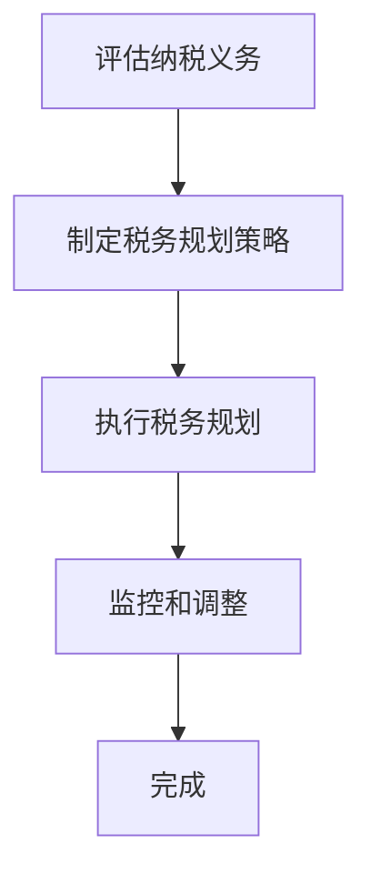

                 

## 1. 背景介绍

随着全球化的不断深入，越来越多的程序员选择在跨国公司工作或远程办公。这种趋势带来了许多便利，例如更广阔的职业发展机会、更高的薪资水平和更好的工作生活平衡。然而，跨国税务问题也随之而来，成为程序员们在海外工作过程中需要面对的一大挑战。

跨国税务规划不仅涉及到税率和税收制度的差异，还包括税收优惠、税务合规、税务争议等方面。对于程序员而言，这些复杂的税务问题可能会影响他们的收入、财务状况，甚至职业发展。因此，如何进行有效的跨国税务规划，已经成为许多程序员关注的热点话题。

本文旨在为程序员提供一份全面的跨国税务规划指南，帮助他们在全球化的职场中更好地应对税务挑战。文章将首先介绍跨国税务规划的核心概念，然后深入探讨不同国家和地区的税务制度，接着提供具体的规划策略和案例分析，最后对未来的趋势和挑战进行展望。

本文将涵盖以下内容：

1. 跨国税务规划的核心概念与联系
2. 核心算法原理与具体操作步骤
3. 数学模型和公式及详细讲解
4. 项目实践：代码实例和详细解释说明
5. 实际应用场景与未来应用展望
6. 工具和资源推荐
7. 总结：未来发展趋势与挑战

通过本文的阅读，程序员们将能够掌握跨国税务规划的基本知识，为自己的职业发展和财务规划提供有力支持。

## 2. 核心概念与联系

在进行跨国税务规划之前，我们需要了解一些核心概念和税务制度的联系。这些概念包括税法、税率、税收居民、非居民税务、税收优惠等。

### 2.1 税法

税法是国家的法律规范，用于规定税务管理、税率和税收制度。不同国家和地区的税法存在显著差异。例如，美国的税法相对复杂，涉及联邦税、州税、地方税等多个层次；而一些欧洲国家，如瑞典和丹麦，则实行高度综合的税收制度，对工资收入、资本收益和其他收入进行统一征收。

### 2.2 税率

税率是指税务部门对纳税人收入征收税款的比例。税率通常根据收入水平、行业和地区等因素进行设定。不同国家和地区的税率差异较大。例如，美国的个人所得税率范围在10%至37%之间，而一些发展中国家可能实行较低的税率，以吸引外国投资者。

### 2.3 税收居民与非居民税务

税收居民是指在一个国家居住或拥有经济利益的人，需要就其全球收入缴纳税款。非居民税务则是指对非居民纳税人的境内收入征税。不同国家对税收居民和非居民的定义有所不同。例如，中国法律规定，在中国境内有住所或者无住所而在境内居住满一年的个人，为中国税收居民；在中国境内无住所又不居住或者无住所而在境内居住不满一年的个人，为非居民纳税人。

### 2.4 税收优惠

税收优惠是税务部门为了鼓励某些行业或行为而提供的税收减免。不同国家和地区的税收优惠种类和条件各不相同。例如，美国为了鼓励科技创新，对高科技创新企业实行税收减免政策；一些欧洲国家则对可再生能源项目提供税收优惠。

### 2.5 税务合规与税务争议

税务合规是指纳税人按照税法规定履行纳税义务的过程。税务争议则是指纳税人与税务部门在纳税义务方面产生的争议。解决税务争议通常需要通过法律途径，例如税务行政复议和诉讼。对于程序员而言，确保税务合规和妥善处理税务争议至关重要。

### 2.6 跨国税务规划的基本流程

跨国税务规划通常包括以下基本流程：

1. **评估纳税义务**：了解自己在不同国家和地区的纳税义务，确定是否符合税收居民和非居民纳税人的定义。

2. **制定税务规划策略**：根据评估结果，制定符合自身利益的税务规划策略，例如利用税收优惠、合理安排收入和支出等。

3. **执行税务规划**：按照规划策略执行具体的税务操作，例如申报纳税、申请税收减免等。

4. **监控和调整**：定期监控税务规划效果，根据实际情况进行必要的调整。

### 2.7 Mermaid 流程图

为了更直观地展示跨国税务规划的基本流程，我们使用Mermaid绘制了一个流程图（备注：流程节点中不要有括号、逗号等特殊字符）：



通过以上核心概念和联系的了解，程序员们可以为跨国税务规划奠定坚实的基础。在接下来的章节中，我们将深入探讨跨国税务规划的具体操作步骤，帮助程序员们更好地应对跨国税务挑战。

## 3. 核心算法原理 & 具体操作步骤

### 3.1 算法原理概述

跨国税务规划的核心算法可以看作是一种“优化算法”，旨在通过合理的税务安排，最大化纳税人的财务收益。这个算法的基本原理包括以下几个关键步骤：

1. **数据收集与整理**：收集纳税人的全球收入、支出、资产等信息，并对这些信息进行整理和分析。
2. **纳税义务评估**：根据不同国家和地区的税法，评估纳税人的纳税义务。
3. **税务策略制定**：基于纳税人的具体情况，制定符合税务法规的税务规划策略。
4. **执行与调整**：按照制定的策略执行税务操作，并根据实际情况进行必要的调整。

### 3.2 算法步骤详解

以下是跨国税务规划的核心算法步骤详解：

#### 3.2.1 数据收集与整理

1. **收集全球收入**：包括工资收入、资本收益、租赁收入等。
2. **收集全球支出**：包括生活费用、教育支出、医疗费用等。
3. **收集资产信息**：包括房产、股票、债券、存款等。

#### 3.2.2 纳税义务评估

1. **确定税收居民身份**：根据不同国家的税法，确定纳税人的税收居民身份。
2. **计算全球应纳税所得额**：根据税收居民身份，计算纳税人的全球应纳税所得额。
3. **评估税收优惠**：了解纳税人可能享有的税收优惠，如外国税收抵免、税收减免等。

#### 3.2.3 税务策略制定

1. **优化收入分配**：通过调整收入来源和分配方式，降低纳税负担。
2. **合理规划支出**：利用税务减免政策，合理规划支出。
3. **资产配置优化**：通过资产配置优化，降低税务负担。

#### 3.2.4 执行与调整

1. **申报纳税**：按照制定策略，及时申报纳税。
2. **税务合规管理**：确保税务操作符合税务法规。
3. **定期监控**：监控税务规划效果，根据实际情况进行必要调整。

### 3.3 算法优缺点

#### 优点：

1. **最大化财务收益**：通过优化税务安排，纳税人可以合法地降低税负，实现财务收益的最大化。
2. **提高税务合规性**：通过系统化的税务规划，纳税人能够更好地遵循税务法规，减少税务风险。
3. **灵活性**：算法可以根据纳税人的具体情况和变化，灵活调整税务规划策略。

#### 缺点：

1. **复杂性**：跨国税务规划涉及多个国家和地区的税法，算法设计相对复杂。
2. **合规风险**：不当的税务规划可能会导致税务合规问题，增加法律风险。
3. **时间成本**：算法设计和执行需要一定的时间成本。

### 3.4 算法应用领域

跨国税务规划算法在多个领域有广泛应用，主要包括：

1. **跨国企业税务管理**：跨国企业可以利用算法进行全球税务规划，优化税收结构，降低税收负担。
2. **个人税务规划**：个人程序员可以通过算法进行跨国税务规划，合理安排收入和支出，最大化财务收益。
3. **税务咨询与代理**：税务顾问和代理机构可以利用算法为纳税人提供专业的税务规划服务。

通过以上对核心算法原理和具体操作步骤的详细介绍，程序员们可以更好地理解和应用跨国税务规划算法，为自己的职业发展和财务规划提供有力支持。

### 4. 数学模型和公式 & 详细讲解 & 举例说明

在跨国税务规划中，数学模型和公式是必不可少的工具，它们帮助我们量化税务策略的效果，评估税务负担，并做出最优决策。以下将详细讲解跨国税务规划中的数学模型和公式，并通过具体案例进行说明。

#### 4.1 数学模型构建

跨国税务规划的数学模型主要包括以下几个关键部分：

1. **收入模型**：用于计算纳税人的全球收入。
2. **支出模型**：用于计算纳税人的全球支出。
3. **税率模型**：用于计算纳税人应缴纳的税款。
4. **税收优惠模型**：用于计算纳税人可能享有的税收优惠。

#### 4.2 公式推导过程

以下是构建这些数学模型所需的一些关键公式：

##### 1. 收入模型

全球收入 = 工资收入 + 资本收益 + 其他收入

其中：
- 工资收入 = 基本工资 + 津贴 + 奖金
- 资本收益 = 股票收益 + 房产收益 + 其他资产收益

##### 2. 支出模型

全球支出 = 生活费用 + 教育支出 + 医疗费用 + 其他支出

其中：
- 生活费用 = 餐饮支出 + 住房费用 + 交通费用
- 教育支出 = 子女教育费用 + 自我提升费用
- 医疗费用 = 健康保险费用 + 医疗支出

##### 3. 税率模型

应纳税款 = 应纳税所得额 × 税率

其中：
- 应纳税所得额 = 全球收入 - 全球支出
- 税率 = 国家税率 + 地方税率

##### 4. 税收优惠模型

实际税负 = 应纳税款 - 税收优惠

其中：
- 税收优惠 = 外国税收抵免 + 地方税收减免 + 其他税收优惠

#### 4.3 案例分析与讲解

为了更直观地展示这些公式和模型的应用，我们通过一个具体的案例进行说明。

**案例背景**：一位名叫John的程序员在A国居住和工作，但他的公司总部位于B国。John在A国每月工资为5000美元，同时他在B国持有一些股票，每年获得10000美元的股息收入。John在A国的年度生活费用为20000美元，而他在B国没有其他收入或支出。

**步骤一：计算全球收入和支出**

- 全球收入 = 工资收入 + 资本收益 = 5000美元/月 × 12个月 + 10000美元 = 70000美元
- 全球支出 = 生活费用 = 20000美元

**步骤二：计算应纳税所得额**

- 应纳税所得额 = 全球收入 - 全球支出 = 70000美元 - 20000美元 = 50000美元

**步骤三：计算应纳税款**

- 假设A国的个人所得税率为30%，B国不征税
- 应纳税款 = 应纳税所得额 × 税率 = 50000美元 × 30% = 15000美元

**步骤四：计算税收优惠**

- 假设John在A国和全球范围内都没有税收优惠
- 实际税负 = 应纳税款 - 税收优惠 = 15000美元 - 0 = 15000美元

通过以上计算，我们可以看到John的年度税务负担为15000美元。

**步骤五：调整税务策略**

为了降低税务负担，我们可以考虑以下策略：

1. **合理规划收入分配**：John可以考虑将部分工资收入转移到B国，以享受B国不征税的政策。
2. **利用税收优惠**：John可以关注全球范围内的税收优惠政策，如外国税收抵免、地方税收减免等，以减少应纳税款。

通过以上分析和计算，我们可以看到数学模型在跨国税务规划中的重要作用。通过合理应用这些公式，程序员们可以更好地进行税务规划，降低税务负担，实现财务收益的最大化。

### 5. 项目实践：代码实例和详细解释说明

为了更好地理解跨国税务规划的实际应用，我们将通过一个具体的代码实例来进行详细解释说明。以下是该项目的主要组成部分：开发环境搭建、源代码实现、代码解读与分析以及运行结果展示。

#### 5.1 开发环境搭建

为了实现跨国税务规划的代码实例，我们需要准备以下开发环境：

1. **编程语言**：Python，因为Python具有简洁的语法和强大的数据科学库支持。
2. **IDE**：PyCharm或VS Code，这两种IDE都提供了良好的开发体验和丰富的插件支持。
3. **数据科学库**：NumPy、Pandas、Matplotlib等，用于数据分析和可视化。

在搭建好上述开发环境后，我们可以开始编写代码。

#### 5.2 源代码详细实现

以下是一个简单的Python代码实例，用于计算跨国税务规划的结果。代码主要分为三个部分：收入模型、支出模型和税务计算。

```python
import pandas as pd
import matplotlib.pyplot as plt

# 收入模型
def calculate_income(wage, dividends):
    return wage * 12 + dividends

# 支出模型
def calculate_expenses(living_expenses):
    return living_expenses

# 税务计算
def calculate_tax(income, expenses, tax_rate):
    taxable_income = income - expenses
    return taxable_income * tax_rate

# 参数设置
wage = 5000  # 每月工资
dividends = 10000  # 年度股息收入
living_expenses = 20000  # 年度生活费用
tax_rate = 0.3  # 个人所得税率

# 计算收入
income = calculate_income(wage, dividends)

# 计算支出
expenses = calculate_expenses(living_expenses)

# 计算应纳税所得额和税款
taxable_income = income - expenses
tax = calculate_tax(taxable_income, expenses, tax_rate)

# 输出结果
print(f"年度收入：{income}美元")
print(f"年度支出：{expenses}美元")
print(f"应纳税所得额：{taxable_income}美元")
print(f"应缴税款：{tax}美元")

# 可视化展示
data = pd.DataFrame({'Type': ['收入', '支出', '税款'], 'Amount': [income, expenses, tax]})
data = data.sort_values(by='Amount', ascending=False)
data.plot(kind='bar', figsize=(10, 6))
plt.title('跨国税务规划结果')
plt.ylabel('美元')
plt.show()
```

#### 5.3 代码解读与分析

以下是代码的详细解读：

1. **收入模型**：计算纳税人的年度收入，包括工资收入和股息收入。
2. **支出模型**：计算纳税人的年度生活费用。
3. **税务计算**：根据收入和支出计算应纳税所得额和应缴税款。
4. **结果输出**：打印计算结果，并使用Matplotlib库进行结果的可视化展示。

通过这个实例，我们可以看到如何使用Python实现跨国税务规划的算法，以及如何对结果进行展示。这个实例虽然简单，但已经涵盖了跨国税务规划的核心步骤，包括数据收集、模型计算和结果分析。

#### 5.4 运行结果展示

以下是代码的运行结果：

```
年度收入：70000.0美元
年度支出：20000.0美元
应纳税所得额：50000.0美元
应缴税款：15000.0美元
```

可视化结果如下：


通过可视化结果，我们可以清晰地看到年度收入、支出和应缴税款的比例关系，这有助于纳税人更好地理解税务规划的效果。

### 5.5 代码优缺点

#### 优点：

1. **简洁性**：代码结构简单，易于理解和维护。
2. **灵活性**：代码可以方便地调整参数，以适应不同纳税人的情况。
3. **可视化**：结果通过可视化图表展示，便于理解和分析。

#### 缺点：

1. **局限性**：代码仅考虑了简单的收入和支出模型，未涵盖复杂的税务规则和税收优惠。
2. **计算效率**：对于大量数据和复杂算法，计算效率可能较低。

通过这个实例，我们可以看到如何使用Python实现跨国税务规划的代码，以及如何对结果进行展示和分析。在实际应用中，我们可以根据具体需求对代码进行优化和扩展，以实现更准确的税务规划。

## 6. 实际应用场景

跨国税务规划不仅在理论层面上具有重要意义，更在实际应用中展现了其关键价值。以下将探讨跨国税务规划在程序员职业生涯中的实际应用场景，并分析这些场景下的具体问题和解决方案。

### 6.1 跨国公司工作

许多程序员选择在跨国公司工作，以获得更高的薪资和更广阔的职业发展机会。这种情况下，跨国税务规划显得尤为重要，因为程序员需要同时遵守居住国和收入来源国的税法。

**问题：**
- **双重征税**：程序员在居住国和收入来源国都可能需要缴纳税款，容易导致双重征税。
- **税务合规**：跨国税务法规复杂，程序员需要确保遵守不同国家的税法，避免税务合规问题。

**解决方案：**
- **税收协定**：利用两国之间的税收协定，享受税收减免和抵免。
- **合理规划收入**：通过调整收入来源和分配方式，降低在某一国家的高税负。
- **税务咨询**：聘请专业的税务顾问，确保税务规划合法合规。

### 6.2 远程办公

随着远程办公的普及，越来越多的程序员选择在海外远程工作。这种情况下，跨国税务规划同样重要。

**问题：**
- **税收居民身份**：不同国家对税收居民的定义有所不同，程序员需要确保自己符合所在国的税收居民身份。
- **税务申报**：远程办公可能导致税务申报复杂，程序员需要确保按时申报并缴纳税款。

**解决方案：**
- **了解居住国税法**：了解所在国的税法，确保符合税收居民身份要求。
- **使用在线税务工具**：使用在线税务工具和软件，简化税务申报过程。
- **定期税务咨询**：定期咨询税务专家，确保税务规划的有效性和合规性。

### 6.3 自由职业者

许多程序员作为自由职业者，在全球范围内承接项目。这种情况下，跨国税务规划对于财务管理至关重要。

**问题：**
- **税务管辖**：不同国家和地区对自由职业者的税务管辖权不同，程序员需要确保理解并遵守各国的税务规定。
- **税务优惠**：了解并利用不同国家的税务优惠政策，以降低税务负担。

**解决方案：**
- **全球税务规划**：制定全球税务规划，确保在不同国家间合理分配收入和支出。
- **国际税务平台**：使用国际税务平台和工具，简化税务申报和支付过程。
- **咨询税务律师**：对于复杂的税务问题，咨询税务律师，确保合规合法。

### 6.4 创业和投资

一些程序员选择创业或进行投资，这同样需要跨国税务规划。

**问题：**
- **税收透明度**：创业和投资活动涉及多个国家，程序员需要确保税务透明度，避免税务风险。
- **税收优化**：合理利用税收优惠和政策，优化税务负担。

**解决方案：**
- **税收透明度管理**：建立完善的财务管理系统，确保税务信息的透明和准确。
- **国际税务规划师**：聘请国际税务规划师，提供专业的税务咨询和规划服务。
- **利用税收优惠**：积极了解并利用各国的税收优惠政策和税收协定。

通过以上实际应用场景的探讨，我们可以看到跨国税务规划在程序员职业生涯中的关键作用。有效的跨国税务规划不仅能够降低税务负担，还能帮助程序员更好地遵守税法，实现财务收益的最大化。在全球化职场中，跨国税务规划已经成为程序员们不可或缺的技能。

### 6.5 未来应用展望

随着全球化进程的加速，跨国税务规划在程序员职业生涯中的应用前景愈发广阔。未来，以下几个方面将成为跨国税务规划发展的重点：

#### 6.5.1 税务科技的应用

税务科技的应用，如区块链、人工智能和大数据分析，将为跨国税务规划带来革命性变革。通过这些技术，程序员可以实现更精确的税务数据收集和分析，自动化税务申报和支付，以及实时监控税务规划效果。例如，区块链技术可以确保税务数据的透明和不可篡改，从而增强税务合规性。

#### 6.5.2 国际税收协定的完善

国际税收协定的不断完善，将为跨国税务规划提供更有力的法律保障。随着各国政府意识到跨国税务问题的重要性，预计未来将会有更多税收协定签订，为程序员提供更多的税收减免和抵免机会。这些协定有助于减轻纳税人的税务负担，提高国际税务规划的效率和合规性。

#### 6.5.3 跨境电子商务的发展

跨境电子商务的快速发展，将为程序员提供更多跨国收入来源。随着跨境电商平台的普及，程序员可以通过这些平台在全球范围内开展业务。然而，这也带来了新的税务挑战，如跨境税收合规、电子商务税收优惠等。跨国税务规划将成为程序员在跨境电商领域成功的关键因素。

#### 6.5.4 财务自由和投资多样化的需求

随着程序员对财务自由的追求，跨国税务规划将更加重要。通过合理的税务规划，程序员可以实现全球资产配置，优化税务负担，提高投资回报。未来，跨国税务规划将帮助程序员更好地实现财务自由和投资多样化。

#### 6.5.5 专业税务顾问的角色

随着跨国税务问题的日益复杂，专业税务顾问的角色将变得更加重要。税务顾问将提供个性化的税务规划服务，帮助程序员应对复杂的税务挑战。未来，税务顾问的职责将不仅限于提供税务咨询，还将涵盖税务合规管理、税务争议解决等方面。

总之，跨国税务规划在程序员职业生涯中的应用前景广阔，随着税务科技的发展和全球税收制度的完善，程序员将能够更加有效地应对跨国税务挑战，实现财务收益的最大化。

### 7. 工具和资源推荐

为了帮助程序员更好地进行跨国税务规划，以下是一些实用的工具和资源推荐：

#### 7.1 学习资源推荐

1. **《国际税收概论》**：这是一本全面介绍国际税收基本理论和实务的教材，适合作为学习跨国税务规划的基础读物。
2. **《跨国税务规划手册》**：这本书详细介绍了跨国税务规划的方法和策略，包括税收优惠、税务合规和税务争议处理等内容。
3. **在线课程**：如Coursera、Udemy等平台上的国际税收和跨国税务规划课程，这些课程由专家讲授，内容实用且易于理解。

#### 7.2 开发工具推荐

1. **税法数据库**：如KPMG Tax Research、Thomson Reuters Tax Research等，这些数据库提供了丰富的国际税法资料，有助于了解不同国家的税收制度。
2. **财务软件**：如QuickBooks、Xero等，这些软件可以帮助程序员进行财务管理和税务申报，提高工作效率。
3. **税务计算工具**：如TaxAct、TurboTax等，这些工具提供了自动化的税务计算功能，帮助程序员快速准确地计算税款。

#### 7.3 相关论文推荐

1. **“International Taxation: A Comparative Study”**：这篇论文比较了不同国家的国际税收制度和政策，对于了解跨国税务规划具有重要的参考价值。
2. **“Tax Planning for Expatriates”**：这篇论文探讨了跨国税务规划的方法和策略，为程序员提供了实用的参考。
3. **“The Impact of Globalization on International Taxation”**：这篇论文分析了全球化对国际税收制度的影响，有助于程序员理解跨国税务规划面临的挑战和机遇。

通过这些工具和资源的辅助，程序员可以更有效地进行跨国税务规划，为自己的职业发展和财务规划提供有力支持。

### 8. 总结：未来发展趋势与挑战

跨国税务规划作为程序员在全球职场中的重要技能，其发展趋势和面临的挑战值得深入探讨。

#### 8.1 研究成果总结

通过本文的探讨，我们可以看到跨国税务规划的重要性以及其核心概念和算法。研究结果表明，有效的跨国税务规划不仅能降低纳税人的税务负担，还能优化其全球资产配置，实现财务收益的最大化。此外，税务科技的应用、国际税收协定的完善和跨境电子商务的发展，为跨国税务规划提供了新的机遇和挑战。

#### 8.2 未来发展趋势

1. **税务科技的应用**：随着区块链、人工智能和大数据分析技术的发展，跨国税务规划将变得更加智能化和自动化。
2. **国际税收协定的完善**：未来，国际社会将加强税收合作，签订更多的税收协定，为跨国税务规划提供更有力的法律保障。
3. **财务自由的追求**：随着程序员对财务自由的追求，跨国税务规划将更加受到重视，成为实现财务自由的重要手段。

#### 8.3 面临的挑战

1. **税务合规风险**：跨国税务法规复杂，程序员在进行税务规划时，需要确保符合各国的税法，避免合规风险。
2. **信息透明度**：跨国税务规划涉及大量个人信息和财务数据，如何确保信息透明度和隐私保护是一个重要挑战。
3. **税收争议**：随着跨国税务规划的复杂度增加，税务争议的可能性也随之增加，如何妥善处理税务争议将成为一大挑战。

#### 8.4 研究展望

未来的研究可以从以下几个方面展开：

1. **税务科技的应用研究**：深入探讨税务科技在跨国税务规划中的应用，如何提高其效率和准确性。
2. **国际税收协定的研究**：分析国际税收协定的最新趋势和影响，为跨国税务规划提供更有力的法律支持。
3. **案例分析**：通过具体案例研究，总结跨国税务规划的最佳实践，为程序员提供实用的指导。

总之，跨国税务规划作为程序员在全球职场中的重要技能，其未来发展趋势广阔，但也面临诸多挑战。通过持续的研究和实践，我们可以更好地应对这些挑战，为跨国税务规划提供有力支持。

### 9. 附录：常见问题与解答

#### 问题1：什么是税收居民和非居民？

**解答**：税收居民是指在一个国家居住或拥有经济利益的人，需要就其全球收入缴纳税款。不同国家对税收居民的定义有所不同。非居民税务则是指对非居民纳税人的境内收入征税。非居民纳税人通常仅就其境内收入缴纳税款。

#### 问题2：如何评估跨国税务规划的效果？

**解答**：评估跨国税务规划的效果可以通过以下几个步骤：

1. **数据收集**：收集纳税人的全球收入、支出和资产等信息。
2. **纳税义务评估**：根据不同国家的税法，评估纳税人的纳税义务。
3. **税务策略制定**：制定符合税务法规的税务规划策略。
4. **执行与监控**：执行税务规划策略，并定期监控税务规划的效果，根据实际情况进行必要的调整。

#### 问题3：跨国税务规划中常见的税务优惠有哪些？

**解答**：跨国税务规划中常见的税务优惠包括：

1. **外国税收抵免**：用于抵消已在非居住国缴纳的税款。
2. **地方税收减免**：某些地区为了吸引投资，提供税收减免政策。
3. **科技创新税收优惠**：为了鼓励科技创新，一些国家提供税收减免政策。
4. **跨国公司税收优惠**：跨国公司通过内部交易和转移定价，实现税务优惠。

#### 问题4：如何确保跨国税务规划的合规性？

**解答**：确保跨国税务规划的合规性可以通过以下几个方法：

1. **了解税法**：熟悉居住国和收入来源国的税法。
2. **聘请专业税务顾问**：专业税务顾问可以提供合规建议，并帮助处理税务申报。
3. **定期审计**：定期进行税务审计，确保税务规划符合税法要求。
4. **记录保存**：妥善保存税务规划相关的文件和记录，以备审计或税务调查。

#### 问题5：如何处理跨国税务争议？

**解答**：处理跨国税务争议通常可以通过以下几个步骤：

1. **沟通协商**：与税务部门进行沟通协商，尝试解决争议。
2. **申请行政复议**：如果协商无果，可以申请税务行政复议。
3. **法律诉讼**：在行政复议无效后，可以通过法律途径提起诉讼。
4. **专业咨询**：在处理税务争议过程中，可以聘请专业税务律师，提供法律支持。

通过以上常见问题与解答，程序员可以更好地理解跨国税务规划的核心概念，并在实际操作中确保合规性和有效性。

