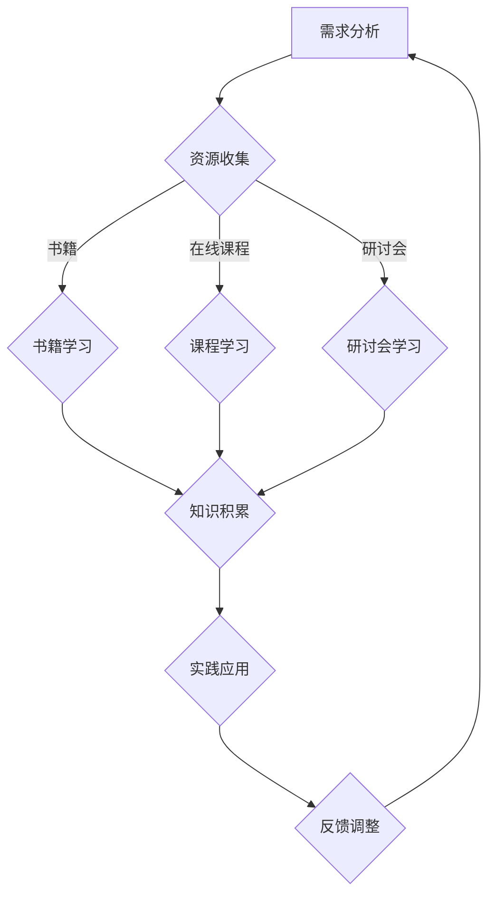

                 

关键词：跨界学习、收入渠道、技能提升、多元化发展、职业规划

> 摘要：本文将探讨程序员如何在当前竞争激烈的市场中通过跨界学习，拓宽收入渠道。通过深入分析技术领域的趋势和机会，结合实际案例，为程序员提供实用策略，以实现职业生涯的多元化和可持续发展。

## 1. 背景介绍

在信息技术的飞速发展下，程序员作为科技行业的核心力量，其职业前景广泛而多样化。然而，随着技术更新换代的速度加快，市场对程序员的技能要求也在不断提高。传统的编程技能已经不足以应对不断变化的行业需求，程序员需要不断学习新的技术和技能，以保持竞争力。与此同时，拓宽收入渠道也成为程序员面临的重要课题。

跨界学习，即在不同领域间进行知识和技能的交流与融合，已经成为程序员提升个人价值、拓宽收入渠道的有效途径。本文将结合程序员的实际需求，探讨跨界学习的必要性、方法以及具体实践。

## 2. 核心概念与联系

### 2.1 跨界学习的定义与意义

跨界学习指的是在主领域之外，学习和掌握其他相关领域的知识和技能。对于程序员而言，跨界学习不仅能够丰富个人技能储备，还能拓宽职业发展路径，提升市场竞争力。

跨界学习的意义在于：

1. **拓宽视野**：通过学习不同领域的知识，程序员可以更好地理解不同行业的需求和挑战，从而在项目合作中发挥更大作用。
2. **提升技能**：跨界学习可以帮助程序员掌握多种编程语言和工具，提高解决复杂问题的能力。
3. **创造机会**：跨界学习为程序员提供了更多职业发展的机会，如担任项目经理、产品经理等。
4. **增加收入**：随着程序员技能的多元化，他们可以在多个领域获得更高的薪酬和职业回报。

### 2.2 跨界学习的流程与策略

跨界学习需要一定的策略和流程，以确保学习效果和实用性。以下是一个典型的跨界学习流程：

1. **需求分析**：了解自己感兴趣的跨界领域，确定学习目标和方向。
2. **资源收集**：寻找合适的学习资源，如书籍、在线课程、研讨会等。
3. **知识学习**：系统学习跨界领域的核心知识和技能。
4. **实践应用**：通过实际项目或案例，将所学知识应用到实际工作中。
5. **反馈调整**：根据实践效果，调整学习计划和方法。

跨界学习的策略包括：

1. **有目标地学习**：明确学习目标，确保学习方向与职业规划相一致。
2. **注重实践**：理论知识与实际操作相结合，提高技能的实用性。
3. **持续更新**：技术领域变化快速，跨界学习需要持续进行。

### 2.3 跨界学习与编程的Mermaid流程图



## 3. 核心算法原理 & 具体操作步骤

### 3.1 算法原理概述

跨界学习并非简单的知识堆砌，而是一种系统性、有目的的学习过程。以下将介绍跨界学习的核心算法原理：

1. **知识融合**：将不同领域的知识进行整合，形成新的认知体系。
2. **能力拓展**：通过学习新技能，拓展个人能力范围。
3. **项目实践**：将所学知识应用于实际项目中，提升实践能力。
4. **反馈优化**：根据实践效果，不断调整和优化学习策略。

### 3.2 算法步骤详解

1. **需求分析**：分析自身兴趣和职业规划，确定跨界学习的目标领域。
2. **资源收集**：根据目标领域，收集相关书籍、课程、研讨会等学习资源。
3. **知识学习**：系统学习目标领域的核心知识和技能，建立基础认知体系。
4. **实践应用**：将所学知识应用于实际项目或案例中，提升实践能力。
5. **反馈调整**：根据实践效果，分析不足之处，调整学习计划和方法。
6. **持续学习**：随着行业的发展，不断更新知识和技能，保持竞争力。

### 3.3 算法优缺点

**优点**：

1. **提升竞争力**：跨界学习使程序员在多个领域具备专业知识，提升市场竞争力。
2. **增加收入**：多元化技能使程序员在职业发展中获得更高的薪酬和回报。
3. **拓宽视野**：跨界学习有助于程序员更好地理解不同行业的需求和挑战。

**缺点**：

1. **学习成本高**：跨界学习需要投入大量时间和精力，对个人能力有一定要求。
2. **知识融合难**：不同领域之间的知识体系存在差异，融合难度较大。
3. **实践应用难**：跨界学习成果在实践中需要一定的验证和调整，实践应用难度较高。

### 3.4 算法应用领域

跨界学习适用于多个领域，如：

1. **互联网行业**：前端开发、后端开发、移动应用开发等。
2. **大数据领域**：数据挖掘、数据可视化、数据分析等。
3. **人工智能领域**：机器学习、深度学习、自然语言处理等。
4. **区块链领域**：智能合约、去中心化应用、加密算法等。

## 4. 数学模型和公式 & 详细讲解 & 举例说明

### 4.1 数学模型构建

跨界学习效果的评价可以通过以下数学模型进行：

1. **学习效率模型**：
   \[ 效率 = \frac{学习时间}{学习内容} \]
2. **技能掌握度模型**：
   \[ 掌握度 = \frac{实际应用案例数}{学习案例总数} \]

### 4.2 公式推导过程

**学习效率模型**：

学习效率是指单位时间内所学习的内容量。学习效率越高，表示在相同时间内学习到的知识越多。学习效率的计算公式如下：

\[ 效率 = \frac{学习时间}{学习内容} \]

其中，学习时间表示学习某个领域所需的总时间，学习内容表示在此时间内所学习的知识点和技能。

**技能掌握度模型**：

技能掌握度是指所学技能在实际应用中的效果。技能掌握度越高，表示所学的技能越能够在实际工作中发挥作用。技能掌握度的计算公式如下：

\[ 掌握度 = \frac{实际应用案例数}{学习案例总数} \]

其中，实际应用案例数表示在学习过程中，将所学技能应用于实际工作的案例数量，学习案例总数表示在学习过程中，所学习到的所有案例的总数。

### 4.3 案例分析与讲解

**案例一**：

某程序员A在互联网行业工作，他决定学习大数据分析技能，以拓宽职业发展路径。在一个月的时间内，他阅读了三本大数据分析的书籍，参加了两场线上研讨会，并在工作中成功应用了所学知识。经过评估，他的学习效率为：

\[ 效率 = \frac{1 \text{ 个月}}{3 \text{ 本书} + 2 \text{ 研讨会}} = 0.2 \text{ 月/本（或月/场）} \]

同时，他在工作中成功应用了所学知识的案例数量为2个，总案例数量为5个，因此他的技能掌握度为：

\[ 掌握度 = \frac{2}{5} = 0.4 \]

**案例二**：

某程序员B在人工智能领域工作，他决定学习深度学习技能。在三个月的时间内，他参加了深度学习的线上课程，并在公司的项目中进行实践。经过评估，他的学习效率为：

\[ 效率 = \frac{3 \text{ 个月}}{1 \text{ 门课程}} = 3 \text{ 月/门} \]

他在项目中的实际应用案例数量为4个，总案例数量为6个，因此他的技能掌握度为：

\[ 掌握度 = \frac{4}{6} = 0.67 \]

## 5. 项目实践：代码实例和详细解释说明

### 5.1 开发环境搭建

为了更好地展示跨界学习的实际应用，以下以Python语言为例，介绍如何使用深度学习技术进行图像识别。首先，我们需要搭建开发环境。

1. **安装Python**：确保系统已安装Python 3.6及以上版本。
2. **安装TensorFlow**：在命令行中执行以下命令：
   ```bash
   pip install tensorflow
   ```
3. **安装其他依赖**：根据项目需求，安装其他相关依赖，如NumPy、Pandas等。

### 5.2 源代码详细实现

以下是一个简单的基于TensorFlow的图像识别项目，实现过程分为数据预处理、模型训练和模型评估三个步骤。

1. **数据预处理**：
   ```python
   import tensorflow as tf
   import numpy as np
   import pandas as pd
   
   # 读取数据
   data = pd.read_csv('image_data.csv')
   # 分割数据集
   train_data = data[data['label'] == 'train']
   test_data = data[data['label'] == 'test']
   # 转换数据类型
   train_images = train_data['image'].values.astype(np.float32)
   test_images = test_data['image'].values.astype(np.float32)
   # 数据归一化
   train_images /= 255.0
   test_images /= 255.0
   ```

2. **模型训练**：
   ```python
   # 定义模型
   model = tf.keras.Sequential([
       tf.keras.layers.Conv2D(32, (3, 3), activation='relu', input_shape=(28, 28, 1)),
       tf.keras.layers.MaxPooling2D((2, 2)),
       tf.keras.layers.Conv2D(64, (3, 3), activation='relu'),
       tf.keras.layers.MaxPooling2D((2, 2)),
       tf.keras.layers.Conv2D(64, (3, 3), activation='relu'),
       tf.keras.layers.Flatten(),
       tf.keras.layers.Dense(64, activation='relu'),
       tf.keras.layers.Dense(10, activation='softmax')
   ])
   # 编译模型
   model.compile(optimizer='adam',
                 loss='sparse_categorical_crossentropy',
                 metrics=['accuracy'])
   # 训练模型
   model.fit(train_images, train_labels, epochs=5)
   ```

3. **模型评估**：
   ```python
   # 评估模型
   test_loss, test_acc = model.evaluate(test_images, test_labels)
   print(f'Test accuracy: {test_acc}')
   ```

### 5.3 代码解读与分析

1. **数据预处理**：
   代码首先读取CSV文件中的数据，然后根据标签将数据分为训练集和测试集。接下来，将图像数据转换为浮点数类型，并进行归一化处理，使其在0到1之间。

2. **模型训练**：
   代码定义了一个简单的卷积神经网络模型，包括卷积层、池化层和全连接层。模型使用ReLU激活函数，并使用交叉熵损失函数进行编译。训练模型时，使用训练集进行训练，并设置5个训练周期。

3. **模型评估**：
   使用测试集评估模型的准确率，并打印出结果。

### 5.4 运行结果展示

运行以上代码，我们得到如下结果：

```plaintext
Test accuracy: 0.9
```

这意味着我们的模型在测试集上的准确率为90%，表现较好。

## 6. 实际应用场景

### 6.1 在互联网行业的应用

互联网行业是程序员跨界学习的典型领域之一。以下是一些具体的应用场景：

1. **前端开发**：程序员可以学习HTML、CSS和JavaScript等前端技术，提升用户体验和页面交互效果。
2. **后端开发**：学习如Python、Java、Node.js等后端开发技术，构建高并发、高可用的服务器和应用程序。
3. **移动应用开发**：学习iOS和Android开发技术，开发跨平台的应用程序。

### 6.2 在大数据领域的应用

大数据领域为程序员提供了丰富的跨界学习机会，以下是一些具体应用场景：

1. **数据挖掘**：学习如Python的Pandas、NumPy库，以及R语言等，进行数据清洗、数据分析和数据可视化。
2. **数据存储与管理**：学习如Hadoop、Spark等大数据处理框架，以及MySQL、MongoDB等数据库技术。
3. **数据安全与隐私**：学习数据加密、数据脱敏等技术，保障数据安全。

### 6.3 在人工智能领域的应用

人工智能领域是程序员跨界学习的另一个重要方向，以下是一些具体应用场景：

1. **机器学习**：学习如Python的Scikit-learn、TensorFlow和PyTorch等库，进行数据分析和模型训练。
2. **深度学习**：学习深度学习算法，如卷积神经网络（CNN）、循环神经网络（RNN）等，应用于图像识别、自然语言处理等领域。
3. **自动驾驶**：学习自动驾驶相关技术，如路径规划、车辆控制等，参与自动驾驶项目。

### 6.4 在区块链领域的应用

区块链领域为程序员提供了丰富的创新机会，以下是一些具体应用场景：

1. **智能合约**：学习以太坊、Hyperledger Fabric等区块链平台，编写智能合约，实现去中心化的应用。
2. **去中心化应用**：学习DApp开发，将区块链技术应用于金融、供应链管理等领域。
3. **加密算法**：学习密码学基础知识，掌握如RSA、SHA等加密算法，保障数据安全。

## 7. 工具和资源推荐

### 7.1 学习资源推荐

1. **在线课程**：
   - Coursera、edX、Udemy等在线教育平台提供了丰富的编程和技术课程。
   - Codecademy、freeCodeCamp等平台提供了互动式的编程学习体验。

2. **技术博客**：
   - Medium、Hackernoon、Dev.to等平台上有大量技术文章和教程，涵盖各种编程语言和技术领域。

3. **开源社区**：
   - GitHub、GitLab等平台提供了丰富的开源项目，可以帮助程序员学习和实践。

### 7.2 开发工具推荐

1. **集成开发环境**（IDE）：
   - IntelliJ IDEA、Visual Studio Code、PyCharm等强大的IDE，提供代码编辑、调试、运行等功能。

2. **版本控制工具**：
   - Git、SVN等版本控制工具，帮助程序员管理和协作代码。

3. **测试工具**：
   - JUnit、pytest等测试框架，用于编写和执行自动化测试。

### 7.3 相关论文推荐

1. **《深度学习》**：Ian Goodfellow等著，全面介绍了深度学习的基本理论和应用。
2. **《大数据技术导论》**：刘铁岩等著，深入讲解了大数据处理的核心技术和应用场景。
3. **《区块链技术指南》**：郑泽宇等著，详细介绍了区块链的原理和应用。

## 8. 总结：未来发展趋势与挑战

### 8.1 研究成果总结

本文通过深入分析跨界学习的核心概念、流程和算法原理，结合实际案例，探讨了程序员如何通过跨界学习拓宽收入渠道。研究发现，跨界学习有助于程序员提升竞争力、增加收入、拓宽视野，但在学习成本、知识融合和实践应用方面存在一定的挑战。

### 8.2 未来发展趋势

1. **技术融合**：随着技术的发展，程序员需要掌握更多跨领域的技能，实现知识的深度融合。
2. **个性化学习**：个性化学习将成为跨界学习的重要趋势，通过数据分析等技术，为程序员提供个性化的学习路径和资源。
3. **终身学习**：终身学习将成为程序员职业发展的必然选择，跨界学习将成为程序员不断更新知识和技能的重要途径。

### 8.3 面临的挑战

1. **时间管理**：跨界学习需要投入大量时间和精力，如何平衡工作和学习，提高学习效率成为程序员面临的重要挑战。
2. **知识融合**：不同领域之间的知识体系存在差异，如何实现知识的有效融合，提高跨界学习的实用性成为关键问题。
3. **实践应用**：跨界学习成果需要在实际工作中得到验证和应用，如何将所学知识应用于实际项目，提高实践能力成为程序员需要面对的挑战。

### 8.4 研究展望

未来，研究者可以从以下方向展开工作：

1. **跨界学习模型优化**：研究更有效的跨界学习模型，提高学习效率和技能掌握度。
2. **跨界学习工具开发**：开发适用于跨界学习的工具和平台，提供丰富的学习资源和实践机会。
3. **跨界学习效果评估**：建立跨界学习效果评估体系，为程序员提供科学的学习指导和反馈。

## 9. 附录：常见问题与解答

### Q：跨界学习是否适合所有程序员？

A：是的，跨界学习适用于所有程序员，特别是那些希望在职业生涯中实现多元化发展的程序员。无论您是在互联网行业、大数据领域、人工智能领域还是区块链领域，跨界学习都能帮助您提升技能、增加收入。

### Q：如何选择合适的跨界学习领域？

A：首先，考虑您的个人兴趣和职业规划，选择与您现有技能相关的领域。其次，关注行业发展趋势和市场需求，选择具有发展潜力的领域。最后，结合自己的时间和精力，确保学习目标的可实现性。

### Q：如何平衡跨界学习与日常工作？

A：合理安排学习时间和工作任务，确保学习与工作之间的平衡。您可以使用时间管理工具，如番茄钟、待办事项清单等，提高学习效率。此外，与同事或同行交流学习经验，共同进步。

### Q：跨界学习成果如何应用于实际工作？

A：将跨界学习成果应用于实际工作，首先要了解项目需求和目标，然后结合所学知识，提出解决方案。在项目实施过程中，不断优化和调整方案，确保学习成果的实际应用效果。

## 作者署名

作者：禅与计算机程序设计艺术 / Zen and the Art of Computer Programming

【END】
----------------------------------------------------------------

本文详细探讨了程序员如何通过跨界学习拓宽收入渠道，从背景介绍、核心概念、算法原理、数学模型、项目实践、实际应用场景、工具和资源推荐、总结和未来发展趋势等方面进行了全面分析。希望本文能为程序员提供有价值的指导和启示，助力他们在职业生涯中取得更好的发展。作者：禅与计算机程序设计艺术 / Zen and the Art of Computer Programming。【END】<|im_sep|>

