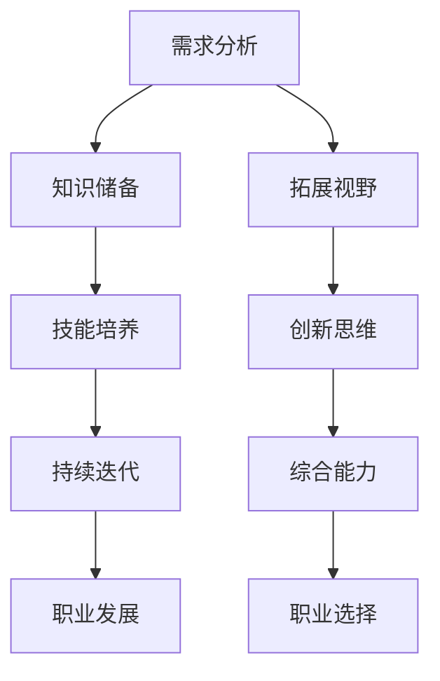

                 

关键词：跨界学习、职业发展、技能扩展、技术深度、创新思维、知识整合、技术趋势、综合能力

> 摘要：随着技术的飞速发展和职场竞争的日益激烈，程序员们越来越意识到，仅仅掌握单一编程语言或技术栈并不能满足长期职业发展的需求。跨界学习已成为程序员提升自身竞争力的关键途径。本文将探讨程序员如何通过跨界学习，拓宽职业发展道路，并在新的技术领域中找到自己的独特价值。

## 1. 背景介绍

### 技术发展速度

在过去几年中，科技行业经历了前所未有的快速发展。人工智能、大数据、云计算等新兴技术不断涌现，对程序员的专业技能提出了更高的要求。单线程的程序员往往难以应对这些复杂的技术挑战，跨界学习成为必然选择。

### 职场竞争加剧

随着技术水平的提升，职场竞争也日益激烈。程序员们不仅要掌握编程语言，还需要具备系统架构、项目管理、数据分析和软技能等多方面的能力。跨界学习可以帮助程序员在竞争中脱颖而出。

### 综合能力需求

现代企业越来越重视员工的综合能力，单一的编程技能已无法满足企业对于复合型人才的需求。跨界学习能够帮助程序员提升多领域知识储备，成为企业所需的“全栈”人才。

### 跨界学习的意义

跨界学习不仅能够拓宽程序员的知识面，提升技能水平，还能激发创新思维，促进个人职业发展。本文将围绕跨界学习的核心概念、方法与应用，为程序员提供实用的指导。

## 2. 核心概念与联系

### 技术跨界与职业发展

技术跨界是指程序员在掌握核心编程技能的基础上，扩展到其他相关或相邻的技术领域。这种跨界不仅有助于提升个人能力，还能为职业发展提供更多的可能性。

### 跨界学习的目标

跨界学习的目标主要包括：

1. **拓展技术视野**：了解和掌握新兴技术，紧跟行业趋势。
2. **增强综合能力**：提升项目管理和团队协作能力。
3. **创新思维激发**：通过跨学科学习，培养创新意识和解决问题的能力。
4. **职业发展机遇**：跨界技能使程序员具备更多职业选择。

### 跨界学习的流程

1. **需求分析**：明确跨界学习的目的和目标。
2. **知识储备**：学习相关领域的知识体系。
3. **技能培养**：通过实践和项目积累经验。
4. **持续迭代**：不断更新知识和技能，保持竞争力。

### 跨界学习的架构

跨界学习架构可以分为三个层次：

1. **基础知识层**：包括编程语言、数据结构、算法等核心技能。
2. **应用层**：涉及数据库、前端开发、后端开发、人工智能等领域。
3. **高级层**：包括架构设计、项目管理、团队协作等高级技能。

## 2.1 核心概念原理与架构流程

下面是一个基于Mermaid流程图的架构流程示例，展示了跨界学习的核心概念和架构：



### 2.2 跨界学习的关键要素

1. **目标明确**：明确跨界学习的目标和预期成果，有助于制定合理的学习计划。
2. **资源整合**：整合各类学习资源，包括在线课程、书籍、实践项目等。
3. **实践应用**：通过实际项目或实验，将所学知识应用到具体场景中。
4. **持续学习**：保持对新技术的好奇心和求知欲，不断更新知识储备。

## 3. 核心算法原理 & 具体操作步骤

### 3.1 算法原理概述

跨界学习中的核心算法原理主要包括：

1. **迁移学习**：将已掌握的知识迁移到新的领域。
2. **知识融合**：将不同领域的知识进行整合，形成新的知识体系。
3. **案例学习**：通过分析成功案例，学习他人的经验和教训。
4. **持续优化**：对学习方法和过程进行持续优化，提高学习效果。

### 3.2 算法步骤详解

1. **需求分析**：明确跨界学习的具体需求和目标。
2. **知识储备**：学习相关领域的知识体系，包括基础理论和实践技能。
3. **技能培养**：通过实践项目或实验，将所学知识应用到具体场景中。
4. **反馈与调整**：根据实际应用效果，对学习方法进行调整和优化。
5. **持续迭代**：不断更新知识和技能，保持竞争力。

### 3.3 算法优缺点

**优点**：

- 提升个人技能和知识储备。
- 增加职业发展机会。
- 促进创新思维和解决问题的能力。

**缺点**：

- 学习过程可能较为复杂和耗时。
- 需要具备较强的自我驱动和学习能力。

### 3.4 算法应用领域

跨界学习算法的应用领域非常广泛，包括但不限于：

- **人工智能**：通过迁移学习，将算法应用于图像识别、自然语言处理等领域。
- **大数据分析**：通过知识融合，提高数据处理的效率和准确性。
- **前端开发**：通过案例学习，掌握最新的前端技术和框架。
- **后端开发**：通过持续迭代，提升项目管理和架构设计能力。

## 4. 数学模型和公式 & 详细讲解 & 举例说明

### 4.1 数学模型构建

跨界学习中的数学模型主要包括：

1. **知识迁移模型**：通过相似度计算，将一个领域的知识迁移到另一个领域。
2. **知识融合模型**：通过向量空间模型，将不同领域的知识进行融合。
3. **案例学习模型**：通过贝叶斯网络，分析成功案例的概率分布。

### 4.2 公式推导过程

以知识迁移模型为例，其核心公式如下：

$$
Similarity(A, B) = \frac{Distance(A, B)}{Max(Distance(A, B))}
$$

其中，$Similarity(A, B)$ 表示两个领域 $A$ 和 $B$ 的相似度，$Distance(A, B)$ 表示 $A$ 和 $B$ 的距离，$Max(Distance(A, B))$ 表示 $A$ 和 $B$ 的最大距离。

### 4.3 案例分析与讲解

假设我们有两个领域：领域 $A$（编程语言）和领域 $B$（机器学习）。通过相似度计算，我们可以评估程序员在领域 $A$ 和领域 $B$ 的知识掌握情况。

例如，假设领域 $A$ 的距离为 $50$，领域 $B$ 的距离为 $30$，最大距离为 $100$。根据公式，我们得到：

$$
Similarity(A, B) = \frac{Distance(A, B)}{Max(Distance(A, B))} = \frac{30}{100} = 0.3
$$

这意味着程序员在领域 $A$ 和领域 $B$ 的知识相似度为 $30\%$。通过分析相似度，程序员可以了解自己在不同领域的学习效果，并制定相应的学习计划。

## 5. 项目实践：代码实例和详细解释说明

### 5.1 开发环境搭建

在本文的示例项目中，我们将使用 Python 编程语言，结合 TensorFlow 框架，实现一个简单的神经网络模型。以下是搭建开发环境的步骤：

1. 安装 Python 3.8 或以上版本。
2. 安装 TensorFlow：

```bash
pip install tensorflow
```

### 5.2 源代码详细实现

以下是一个简单的神经网络模型实现，用于分类任务：

```python
import tensorflow as tf

# 创建神经网络模型
model = tf.keras.Sequential([
    tf.keras.layers.Dense(128, activation='relu', input_shape=(784,)),
    tf.keras.layers.Dropout(0.2),
    tf.keras.layers.Dense(10)
])

# 编译模型
model.compile(optimizer='adam',
              loss=tf.keras.losses.SparseCategoricalCrossentropy(from_logits=True),
              metrics=['accuracy'])

# 加载数据集
(x_train, y_train), (x_test, y_test) = tf.keras.datasets.mnist.load_data()

# 预处理数据
x_train = x_train.reshape(-1, 784).astype('float32') / 255
x_test = x_test.reshape(-1, 784).astype('float32') / 255

# 训练模型
model.fit(x_train, y_train, epochs=5)

# 评估模型
test_loss, test_acc = model.evaluate(x_test, y_test, verbose=2)
print('\nTest accuracy:', test_acc)
```

### 5.3 代码解读与分析

上述代码实现了一个简单的神经网络模型，用于手写数字分类任务。以下是关键步骤的解读和分析：

1. **创建模型**：使用 `tf.keras.Sequential` 创建一个线性堆叠的模型，包含一个全连接层（`Dense`）和一个输出层。
2. **编译模型**：配置优化器、损失函数和评估指标，准备训练。
3. **加载数据集**：使用 `tf.keras.datasets.mnist.load_data()` 加载 MNIST 数据集。
4. **预处理数据**：对数据进行归一化处理，以便神经网络更好地学习。
5. **训练模型**：使用 `model.fit()` 进行模型训练。
6. **评估模型**：使用 `model.evaluate()` 评估模型在测试数据集上的性能。

通过实际项目实践，程序员可以巩固所学知识，提高实践能力，并为跨界学习提供有力的支持。

## 6. 实际应用场景

### 6.1 前端开发与后端开发的跨界

前端开发与后端开发的跨界是程序员常见的跨领域学习实践。掌握前端技术（如 React、Vue.js 等）和后端技术（如 Node.js、Django 等），可以让程序员在项目开发中发挥更全面的作用。

### 6.2 数据科学与机器学习的跨界

数据科学与机器学习的跨界是程序员提升自身价值的重要途径。通过学习数据预处理、数据分析和机器学习算法，程序员可以在大数据和人工智能领域找到自己的位置。

### 6.3 云计算与物联网的跨界

云计算和物联网（IoT）的结合为程序员提供了新的发展空间。掌握云计算技术（如 AWS、Azure 等）和物联网开发（如 MQTT、IoT Hub 等），程序员可以在智能硬件和物联网项目中发挥关键作用。

### 6.4 跨界学习的应用案例

1. **全栈开发**：程序员通过学习前端、后端、数据库等多个领域，成为全栈开发工程师，提高项目交付效率。
2. **数据分析师**：程序员通过学习数据分析技能，成为数据分析师，帮助企业提取数据价值。
3. **AI工程师**：程序员通过学习机器学习算法，成为 AI 工程师，开发智能应用和算法。

## 7. 未来应用展望

### 7.1 新兴技术的推动

随着人工智能、区块链、量子计算等新兴技术的发展，程序员将面临更多的跨界学习机会。这些技术将深刻影响各行各业，程序员需要不断提升自身技能，以应对未来挑战。

### 7.2 跨界学习的深化

跨界学习将不再局限于技术领域，还将扩展到管理、营销、设计等多个领域。程序员需要具备更全面的知识体系，以适应多样化的职业需求。

### 7.3 终身学习的理念

跨界学习将成为程序员终身学习的理念。持续学习、不断迭代将使程序员在职业发展中保持竞争力，实现持续成长。

## 8. 总结：未来发展趋势与挑战

### 8.1 研究成果总结

本文探讨了程序员跨界学习的意义、核心算法原理、数学模型构建、项目实践以及实际应用场景。通过跨界学习，程序员可以提升综合能力，拓宽职业发展道路。

### 8.2 未来发展趋势

未来，跨界学习将继续深化，涉及更多领域和技能。程序员需要紧跟技术发展趋势，不断提升自身竞争力。

### 8.3 面临的挑战

跨界学习过程中，程序员将面临知识储备不足、学习难度大、时间成本高等挑战。如何有效整合知识、提高学习效率是关键。

### 8.4 研究展望

未来研究应重点关注跨界学习的最佳实践、学习策略优化以及跨界学习的量化评估方法。通过深入研究，为程序员提供更有价值的指导。

## 9. 附录：常见问题与解答

### Q1: 跨界学习需要多长时间？

A1: 跨界学习的时间因人而异，取决于学习目标、学习能力和投入的时间。一般来说，至少需要几个月到一年的时间才能掌握一个新的领域。

### Q2: 跨界学习是否有必要？

A2: 非常有必要。随着技术的快速发展和职场竞争的加剧，跨界学习已成为程序员提升自身竞争力的关键途径。掌握多领域技能，将有助于您在职场中脱颖而出。

### Q3: 跨界学习如何规划？

A3: 制定明确的学习目标，选择适合自己的学习资源，结合实际项目进行实践，不断调整和优化学习方法。保持持续学习的动力，逐步实现跨界学习的目标。

作者：禅与计算机程序设计艺术 / Zen and the Art of Computer Programming
----------------------------------------------------------------

以上是一篇关于程序员跨界学习，拓宽职业发展的完整技术博客文章。文章涵盖了跨界学习的背景介绍、核心概念、算法原理、数学模型、项目实践、实际应用场景、未来展望以及常见问题解答等内容。通过阅读本文，读者可以了解到跨界学习的重要性、方法以及实际应用，为自身职业发展提供有益的指导。

