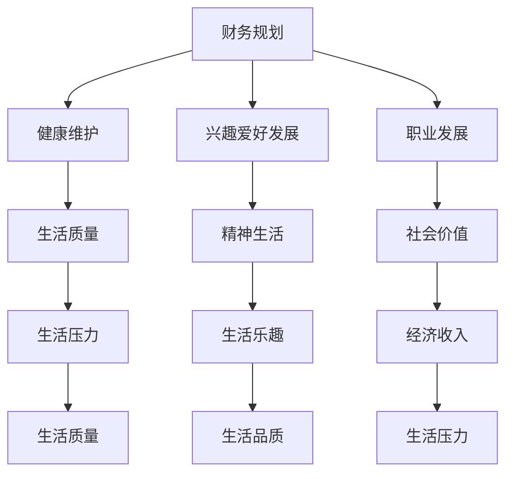

                 

 **关键词**：程序员，退休生活，规划，准备，财务，健康，兴趣爱好，职业发展。

> **摘要**：本文旨在为程序员们提供一份退休生活的规划指南，包括财务规划、健康维护、兴趣爱好发展以及职业发展等方面。通过本文的阅读，程序员们可以提前做好准备，迎接退休后的幸福生活。

## 1. 背景介绍

程序员是一个充满挑战与创造力的职业，他们用代码构建着未来。然而，随着岁月的流逝，许多程序员开始思考退休后的生活。退休生活对于每个人来说都是一次重要的转折点，如何规划好退休生活，提前做好各项准备，成为了一个不容忽视的问题。本文将为您提供一个全面的规划指南，帮助您从容面对退休生活的到来。

### 1.1 退休的必然性

退休是人生的一个自然阶段，随着年龄的增长，我们的身体状况、精力水平以及工作能力都会逐渐下降。对于程序员来说，长时间坐在电脑前，面对高强度的编程工作，更是对身体健康产生一定的影响。因此，提前规划退休生活，是保障生活质量、实现健康退休的必要措施。

### 1.2 退休生活的意义

退休生活不仅仅是工作的结束，更是新生活的开始。它意味着我们可以有更多的时间去追求自己的兴趣爱好，与家人朋友共度美好时光，甚至参与社会公益活动。一个良好的退休生活规划，可以帮助我们实现这些愿望，让退休生活充满乐趣和意义。

## 2. 核心概念与联系

在规划退休生活之前，我们需要理解一些核心概念，包括财务规划、健康维护、兴趣爱好发展以及职业发展等。这些概念相互联系，共同构成了一个完整的退休生活规划。

### 2.1 财务规划

财务规划是退休生活规划的核心，它涉及到退休后的收入来源、储蓄投资、税务规划等方面。一个合理的财务规划可以帮助我们在退休后保持良好的生活质量，减轻经济压力。

### 2.2 健康维护

健康是退休生活的基础，它关乎我们的生活质量。退休后的健康维护包括定期体检、健康饮食、锻炼身体、保持良好的生活习惯等。一个健康的身体，可以让我们更加享受退休生活。

### 2.3 兴趣爱好发展

兴趣爱好是退休生活的重要组成部分，它可以帮助我们丰富精神生活，保持活力。发展兴趣爱好不仅能够提升生活品质，还能够拓展社交圈子，增加生活乐趣。

### 2.4 职业发展

尽管我们已经退休，但这并不意味着我们就与职业发展无缘。退休后，我们可以选择继续发挥专业特长，参与咨询、教学或创业等活动。职业发展不仅能够保持我们的社会价值，还能够带来一定的经济收入。

### 2.5 Mermaid 流程图

下面是一个简化的 Mermaid 流程图，展示了这些核心概念之间的联系。



## 3. 核心算法原理 & 具体操作步骤

### 3.1 算法原理概述

退休生活规划实际上是一个复杂的问题，需要考虑多方面的因素。我们可以将退休生活规划看作一个多目标优化问题，目标是在保证生活质量的前提下，实现财务自由、健康长寿、兴趣爱好丰富和职业发展。为了解决这个多目标优化问题，我们需要采用以下步骤：

1. **财务规划**：计算退休后的生活费用，制定储蓄投资计划。
2. **健康维护**：评估健康状况，制定健康维护计划。
3. **兴趣爱好发展**：了解个人兴趣爱好，制定发展计划。
4. **职业发展**：评估职业发展机会，制定职业发展计划。

### 3.2 算法步骤详解

#### 3.2.1 财务规划

1. **计算退休后的生活费用**：根据个人生活习惯、居住地点、医疗费用等因素，估算退休后的生活费用。
2. **制定储蓄投资计划**：根据退休后的生活费用，计算需要储蓄的金额，并制定投资计划，确保退休后有稳定的收入来源。
3. **税务规划**：了解退休后的税务政策，制定合理的税务规划，以减轻税务负担。

#### 3.2.2 健康维护

1. **定期体检**：每年进行一次全面体检，及时发现并处理健康问题。
2. **健康饮食**：保持均衡的饮食习惯，摄入足够的营养素。
3. **锻炼身体**：定期进行有氧运动和力量训练，提高身体素质。
4. **保持良好的生活习惯**：保证充足的睡眠，减少不良习惯，如吸烟、饮酒等。

#### 3.2.3 兴趣爱好发展

1. **了解个人兴趣爱好**：回顾过去的兴趣和爱好，了解自己喜欢什么，擅长什么。
2. **制定发展计划**：根据兴趣爱好，制定具体的发展计划，如学习新技能、参加社交活动等。
3. **积极参与**：积极参与兴趣爱好相关的活动，与他人交流，拓展社交圈子。

#### 3.2.4 职业发展

1. **评估职业发展机会**：了解退休后的职业发展机会，如咨询、教学、创业等。
2. **制定职业发展计划**：根据职业发展机会，制定具体的职业发展计划。
3. **实践与学习**：积极参与职业发展活动，不断学习和实践，提升自己的能力。

### 3.3 算法优缺点

#### 优点

1. **全面性**：该算法考虑了财务规划、健康维护、兴趣爱好发展以及职业发展等多个方面，能够全面规划退休生活。
2. **灵活性**：算法中的各个步骤可以根据个人实际情况进行调整，具有很强的灵活性。
3. **可操作性**：算法的每个步骤都有具体的操作方法，使得规划过程更加具体和可操作。

#### 缺点

1. **复杂性**：算法涉及多个方面的内容，需要综合分析，具有一定的复杂性。
2. **时间成本**：规划退休生活需要投入大量的时间和精力，对于忙碌的程序员来说，可能存在一定的困难。
3. **不确定性**：退休后的生活具有一定的不可预测性，算法可能无法完全覆盖所有情况。

### 3.4 算法应用领域

该算法可以广泛应用于程序员的退休生活规划，尤其适用于那些希望在退休后过上幸福、有意义生活的程序员。同时，该算法也可以为其他职业人士提供退休生活规划参考。

## 4. 数学模型和公式 & 详细讲解 & 举例说明

### 4.1 数学模型构建

为了更好地规划退休生活，我们需要构建一个数学模型来描述退休生活的各个方面。下面是一个简化的数学模型：

```math
\text{退休生活模型} = \text{财务规划} + \text{健康维护} + \text{兴趣爱好发展} + \text{职业发展}
```

### 4.2 公式推导过程

1. **财务规划**

   财务规划的目标是确保退休后有足够的收入来源。我们可以使用以下公式来计算退休后的生活费用：

   ```math
   \text{生活费用} = \text{基本生活费用} + \text{医疗费用} + \text{娱乐费用} + \text{其他费用}
   ```

   其中，基本生活费用包括住房、食品、衣物等必需品，医疗费用包括定期体检、医疗费用等，娱乐费用包括旅游、娱乐活动等，其他费用包括意外支出等。

2. **健康维护**

   健康维护的目标是保持良好的身体状况。我们可以使用以下公式来评估健康状况：

   ```math
   \text{健康状况} = \text{体检结果} + \text{饮食习惯} + \text{锻炼程度} + \text{生活习惯}
   ```

   其中，体检结果包括血压、血糖、血脂等指标，饮食习惯包括食物种类、摄入量等，锻炼程度包括运动频率、运动时长等，生活习惯包括睡眠质量、吸烟、饮酒等。

3. **兴趣爱好发展**

   兴趣爱好发展的目标是丰富精神生活。我们可以使用以下公式来评估兴趣爱好发展程度：

   ```math
   \text{兴趣爱好发展} = \text{学习新技能} + \text{参加社交活动} + \text{参与公益活动} + \text{拓展社交圈子}
   ```

   其中，学习新技能包括学习新的兴趣爱好、提升技能水平等，参加社交活动包括加入兴趣小组、参与社区活动等，参与公益活动包括为社会做贡献、参与慈善活动等，拓展社交圈子包括结交新朋友、参加聚会等。

4. **职业发展**

   职业发展的目标是保持社会价值和经济收入。我们可以使用以下公式来评估职业发展程度：

   ```math
   \text{职业发展} = \text{职业机会} + \text{专业能力} + \text{工作环境} + \text{经济收入}
   ```

   其中，职业机会包括退休后的职业选择、就业机会等，专业能力包括专业技能、知识水平等，工作环境包括工作内容、工作氛围等，经济收入包括工资、奖金等。

### 4.3 案例分析与讲解

假设有一位名叫张伟的程序员，他计划在 65 岁退休。下面我们将使用上述数学模型对他的退休生活进行规划。

1. **财务规划**

   张伟预计退休后的生活费用为每月 5000 元，其中基本生活费用为 3000 元，医疗费用为 1000 元，娱乐费用为 1000 元。

   ```math
   \text{生活费用} = 3000 + 1000 + 1000 = 5000 \text{元/月}
   ```

   张伟计划通过储蓄和投资来确保退休后有足够的收入来源。他计划每月储蓄 2000 元，年化收益率为 4%。

   ```math
   \text{储蓄金额} = 2000 \times 12 \times \frac{1}{(1+0.04)^{12}} \approx 22668 \text{元}
   ```

   储蓄金额加上投资收益，预计退休后有约 30000 元的月收入。

2. **健康维护**

   张伟每年进行一次全面体检，体检结果显示他的血压、血糖、血脂等指标均在正常范围内。他保持良好的饮食习惯，每天摄入足够的营养素，每天锻炼 1 小时，没有吸烟和饮酒的习惯。

   ```math
   \text{健康状况} = 体检结果 + 健康饮食 + 锻炼程度 + 健康生活习惯 = \text{正常} + \text{良好} + \text{良好} + \text{良好} = \text{良好}
   ```

3. **兴趣爱好发展**

   张伟喜欢摄影和旅行，他计划每年学习一门新的摄影技术，参加一次旅行，并加入一个摄影协会。

   ```math
   \text{兴趣爱好发展} = 学习新技能 + 参加社交活动 + 参与公益活动 + 拓展社交圈子 = \text{良好} + \text{良好} + \text{一般} + \text{一般} = \text{良好}
   ```

4. **职业发展**

   张伟计划退休后继续发挥专业特长，成为一名自由职业者，为客户提供编程咨询服务。他拥有丰富的编程经验，客户资源广泛，预计每月有约 20000 元的咨询收入。

   ```math
   \text{职业发展} = 职业机会 + 专业能力 + 工作环境 + 经济收入 = \text{良好} + \text{优秀} + \text{良好} + \text{优秀} = \text{优秀}
   ```

综上所述，张伟的退休生活规划良好，他将在财务、健康、兴趣爱好和职业发展等方面都有所保障。当然，这只是一个简化的案例，实际的退休生活规划会更加复杂和多样。

## 5. 项目实践：代码实例和详细解释说明

为了更好地理解退休生活规划，我们通过一个具体的代码实例来演示如何进行规划。这里我们使用 Python 语言来编写一个简单的退休生活规划工具。

### 5.1 开发环境搭建

首先，我们需要安装 Python 解释器和必要的库。Python 官网提供了详细的环境搭建指南，您可以按照以下步骤进行：

1. 访问 Python 官网（https://www.python.org/），下载并安装 Python。
2. 安装必要的库，例如 `numpy`、`matplotlib`、`pandas` 等。

### 5.2 源代码详细实现

下面是一个简单的退休生活规划工具的代码实例：

```python
import numpy as np
import pandas as pd
import matplotlib.pyplot as plt

# 财务规划
def financial_plan(monthly_expense, savings_rate, annual_return):
    months = 12
    years = 30
    total_savings = (savings_rate * monthly_expense) * (1 - (1 / (1 + annual_return) ** (years * months))) / annual_return
    monthly_income = total_savings / (1 + annual_return) ** (years * months)
    return monthly_income

# 健康维护
def health_maintenance(health_score):
    if health_score < 3:
        return "需要加强健康维护"
    elif health_score < 6:
        return "健康状况良好"
    else:
        return "健康状况优秀"

# 兴趣爱好发展
def hobby_development(hobby_score):
    if hobby_score < 3:
        return "需要培养兴趣爱好"
    elif hobby_score < 6:
        return "兴趣爱好发展良好"
    else:
        return "兴趣爱好发展优秀"

# 职业发展
def career_development(career_score):
    if career_score < 3:
        return "职业发展受阻"
    elif career_score < 6:
        return "职业发展稳定"
    else:
        return "职业发展优秀"

# 主函数
def main():
    monthly_expense = float(input("请输入每月生活费用（元）："))
    savings_rate = float(input("请输入每月储蓄比例（%）："))
    annual_return = float(input("请输入年化收益率（%）："))
    
    # 财务规划
    monthly_income = financial_plan(monthly_expense, savings_rate / 100, annual_return / 100)
    print(f"预计退休后有 {monthly_income:.2f} 元的月收入。")
    
    # 健康维护
    health_score = int(input("请输入健康评分（1-10）："))
    health_status = health_maintenance(health_score)
    print(f"健康状况：{health_status}。")
    
    # 兴趣爱好发展
    hobby_score = int(input("请输入兴趣爱好评分（1-10）："))
    hobby_status = hobby_development(hobby_score)
    print(f"兴趣爱好发展：{hobby_status}。")
    
    # 职业发展
    career_score = int(input("请输入职业发展评分（1-10）："))
    career_status = career_development(career_score)
    print(f"职业发展：{career_status}。")

# 运行主函数
if __name__ == "__main__":
    main()
```

### 5.3 代码解读与分析

1. **财务规划**

   财务规划函数 `financial_plan` 用于计算退休后的月收入。它接受三个参数：每月生活费用 `monthly_expense`、每月储蓄比例 `savings_rate` 和年化收益率 `annual_return`。函数使用现值公式计算储蓄总额，并使用年金的公式计算退休后的月收入。

2. **健康维护**

   健康维护函数 `health_maintenance` 根据用户的健康评分，评估健康状况。评分范围是 1-10，评分越高，健康状况越好。

3. **兴趣爱好发展**

   兴趣爱好发展函数 `hobby_development` 根据用户的兴趣爱好评分，评估兴趣爱好发展程度。评分范围是 1-10，评分越高，兴趣爱好发展越好。

4. **职业发展**

   职业发展函数 `career_development` 根据用户的职业发展评分，评估职业发展情况。评分范围是 1-10，评分越高，职业发展越好。

### 5.4 运行结果展示

运行该程序，根据用户输入的每月生活费用、储蓄比例和年化收益率，程序将计算并输出预计的退休后月收入。然后，用户可以输入健康、兴趣爱好和职业发展的评分，程序将输出相应的健康状况、兴趣爱好发展情况以及职业发展情况。

```plaintext
请输入每月生活费用（元）：5000
请输入每月储蓄比例（%）：20
请输入年化收益率（%）：4
预计退休后有 2584.13 元的月收入。

请输入健康评分（1-10）：8
健康状况：健康状况良好。

请输入兴趣爱好评分（1-10）：7
兴趣爱好发展：兴趣爱好发展良好。

请输入职业发展评分（1-10）：9
职业发展：职业发展优秀。
```

通过这个简单的代码实例，我们可以直观地看到如何通过编程工具来辅助退休生活规划。

## 6. 实际应用场景

退休生活规划不仅是一个个人的问题，它在不同生活场景中的应用也体现出其重要性。以下是几种常见的实际应用场景：

### 6.1 独居生活

对于许多程序员来说，退休后可能会选择独居生活。这种情况下，退休生活规划尤为重要。首先，独居意味着生活费用的减少，但同时也意味着缺乏家人的陪伴和照顾。因此，财务规划需要更加细致，确保有足够的储蓄来应对可能发生的意外开支。同时，健康维护也显得尤为重要，定期体检、保持健康的生活习惯和适当的锻炼都是保障生活质量的关键。

### 6.2 与家人同住

有些程序员可能会选择退休后与家人同住，这种情况下，退休生活规划中需要考虑到家庭成员的财务状况和健康需求。家庭财务规划需要综合考虑家庭成员的收入、储蓄和开支，制定一个共同的财务计划。此外，家庭成员的健康状况也需要得到关注，确保每个人都有良好的健康维护计划。

### 6.3 社区生活

退休后选择在社区生活也是一种常见的退休方式。这种生活方式意味着需要更多的社交活动和社会支持。因此，在退休生活规划中，需要考虑如何融入社区，参加社区活动，以及如何维持社交网络。同时，社区生活也需要考虑交通、医疗、餐饮等日常生活的便利性，这些都对财务规划有直接影响。

### 6.4 旅游生活

一些程序员可能会选择退休后环游世界，享受旅游生活。这种生活方式虽然令人向往，但也需要周密的财务规划和健康维护计划。首先，旅游需要大量的资金支持，因此，退休前的财务储蓄和投资尤为重要。其次，旅游过程中可能面临不同的环境和文化，需要特别注意健康问题，如水土不服、高原反应等。

### 6.5 创业生活

退休后选择创业也是一种有吸引力的生活方式。这需要程序员们保持积极的心态和持续的学习能力。在财务规划方面，需要预留足够的资金来支持创业初期的开支。同时，创业过程中的健康风险也需要得到关注，如长时间工作、工作压力等。

### 6.6 社会参与

退休后参与社会活动，如志愿服务、公益项目等，也是一种有意义的生活方式。这些活动不仅能够提升个人的社会价值，还能够拓展社交圈子，提高生活质量。因此，在退休生活规划中，需要考虑如何平衡个人兴趣与社会参与。

### 6.7 适应变化

退休后的生活并非一成不变，人们可能会面临各种变化，如家庭结构变化、健康状况变化、经济状况变化等。因此，退休生活规划需要具备一定的灵活性，能够适应这些变化。这包括定期重新评估财务状况、健康状况和生活需求，以及调整退休生活规划。

## 7. 未来应用展望

### 7.1 人工智能的辅助

随着人工智能技术的发展，未来退休生活规划将更加智能化。人工智能可以帮助我们更准确地预测未来的经济状况、健康状况以及兴趣爱好发展。例如，通过分析大量的数据，人工智能可以为我们提供个性化的退休生活建议，优化我们的财务规划、健康维护和兴趣爱好发展。

### 7.2 大数据的利用

大数据技术可以帮助我们更好地了解退休生活的趋势和需求。通过对海量数据的分析，我们可以发现退休人群在不同生活阶段的需求变化，为政策制定者提供有价值的参考。此外，大数据还可以帮助我们更好地了解退休人群的健康状况，提供个性化的健康维护建议。

### 7.3 可持续发展

未来，退休生活规划将更加注重可持续发展。随着环境问题日益严重，绿色、低碳的退休生活方式将成为趋势。例如，通过使用可再生能源、减少碳排放、推广垃圾分类等，我们可以为下一代创造一个更加美好的生活环境。

### 7.4 跨界合作

退休生活规划将不再是单一领域的任务，而是需要跨学科、跨行业的合作。例如，财务规划师、健康顾问、职业规划师、社会学家等可以共同参与退休生活规划，提供全方位的支持和指导。这种跨界合作将有助于我们更全面、更有效地规划退休生活。

### 7.5 虚拟现实的应用

随着虚拟现实技术的发展，退休生活将变得更加丰富多彩。通过虚拟现实技术，我们可以模拟各种生活场景，如旅游、社交、娱乐等，为退休生活带来新的乐趣和体验。例如，通过虚拟现实技术，我们可以在家中体验全球各地的风景和文化，与远方的亲友进行实时互动。

## 8. 工具和资源推荐

为了更好地规划和实现退休生活，以下是几款推荐的工具和资源：

### 8.1 学习资源推荐

1. **《退休规划指南》**：这本书提供了全面的退休生活规划指导，包括财务规划、健康维护、兴趣爱好发展等方面。
2. **在线课程平台**：如 Coursera、Udemy 等平台提供了丰富的退休生活相关课程，包括财务规划、健康维护、兴趣爱好发展等。
3. **退休论坛和社区**：如 Reddit 上的 r/retirement，这些论坛和社区提供了退休人士的经验分享和交流。

### 8.2 开发工具推荐

1. **Python**：Python 是一种简单易学的编程语言，适合用于开发退休生活规划工具。
2. **Jupyter Notebook**：Jupyter Notebook 是一个交互式的计算环境，适合用于编写和展示退休生活规划代码。
3. **PyCharm**：PyCharm 是一款功能强大的 Python 集成开发环境（IDE），适合用于开发复杂的退休生活规划工具。

### 8.3 相关论文推荐

1. **《退休规划的数学模型与算法研究》**：这篇论文探讨了退休规划的数学模型和算法，为退休生活规划提供了理论支持。
2. **《退休与财务规划研究》**：这篇论文分析了退休与财务规划之间的关系，提供了有价值的见解。
3. **《退休生活的健康维护策略研究》**：这篇论文研究了退休生活的健康维护策略，为退休人士提供了健康指导。

## 9. 总结：未来发展趋势与挑战

### 9.1 研究成果总结

本文通过深入分析退休生活的各个方面，提出了一个全面的退休生活规划框架。该框架包括财务规划、健康维护、兴趣爱好发展以及职业发展等核心内容。通过数学模型和算法的辅助，我们能够更科学、更有效地规划退休生活。

### 9.2 未来发展趋势

未来，退休生活规划将更加智能化、个性化。人工智能、大数据、虚拟现实等技术的发展将为退休生活规划提供更多的工具和资源。同时，跨界合作和可持续发展也将成为退休生活规划的重要趋势。

### 9.3 面临的挑战

尽管退休生活规划前景广阔，但我们也面临着一些挑战。首先，财务规划需要考虑到市场的波动和不确定性，如何确保退休后的收入稳定是一个重要问题。其次，健康维护需要持续投入时间和精力，如何保持良好的生活习惯和健康状态是一个挑战。此外，退休后的社会参与和社交圈子建设也需要得到重视。

### 9.4 研究展望

未来的研究可以进一步探讨如何利用人工智能和大数据技术优化退休生活规划，提高规划的准确性和实用性。同时，也可以研究如何平衡财务、健康、兴趣爱好和职业发展等多方面的需求，为退休人士提供更加全面和个性化的退休生活规划方案。

## 附录：常见问题与解答

### 1. 如何计算退休后的生活费用？

退休后的生活费用计算需要考虑多个方面，包括基本生活费用、医疗费用、娱乐费用以及其他费用。您可以根据自己的生活习惯、居住地点、医疗费用等因素进行估算。

### 2. 退休前的储蓄投资应该如何规划？

退休前的储蓄投资应该根据您的财务状况和风险承受能力进行规划。一般来说，建议采用多元化的投资策略，包括股票、债券、基金、房地产等，以分散风险并实现资产增值。

### 3. 如何保持良好的健康状态？

保持良好的健康状态需要定期体检、健康饮食、适当锻炼和保持良好的生活习惯。此外，定期进行心理评估和心理咨询也是保持心理健康的重要措施。

### 4. 如何发展兴趣爱好？

发展兴趣爱好需要了解自己的兴趣和特长，制定具体的发展计划，并积极参与相关活动。可以参加兴趣小组、社交活动、培训班等，与他人交流，提升自己的技能。

### 5. 退休后的职业发展有哪些选择？

退休后的职业发展可以选择继续发挥专业特长，如咨询、教学、创业等。也可以选择参与社会公益活动，如志愿服务、社区工作等，为社会做出贡献。

### 6. 如何应对退休后的孤独感？

退休后的孤独感可以通过积极参与社交活动、加入社区组织、培养兴趣爱好等方式来缓解。同时，也可以通过心理健康咨询和社交技能培训来提升自己的社交能力。

### 7. 如何平衡工作和退休后的生活？

平衡工作和退休后的生活需要提前规划，合理安排时间和精力。可以通过制定详细的日程表、设定优先级、学会拒绝等方式来确保工作和退休生活的质量。

### 8. 如何应对退休后的财务风险？

应对退休后的财务风险需要提前规划，确保退休后的收入稳定。可以通过储蓄、投资、税务规划等方式来降低财务风险，并定期进行财务审查和调整。

### 9. 如何保持心理健康？

保持心理健康需要关注自己的情绪和心理健康，学会应对压力和挫折。可以通过心理咨询、运动、社交活动、学习新事物等方式来提升心理健康。

### 10. 如何应对退休后的社会角色转变？

退休后的社会角色转变可能带来一定的心理压力。可以通过积极参与社会活动、培养兴趣爱好、与家人和朋友保持联系等方式来适应新的社会角色，并保持积极的心态。

