                 

### 1. 背景介绍

在当今快速发展的技术时代，程序员作为信息技术领域的中坚力量，面临着前所未有的职业挑战和机遇。然而，随着职业生涯的推进，程序员也必须开始考虑退休规划这一重要议题。退休规划不仅关系到个人的财务安全和生活质量，还关系到职业生涯的连续性和长远发展。

首先，退休规划是一个长期的过程，它需要程序员从职业生涯的早期阶段就开始着手。随着时间的推移，程序员可能会面临技术淘汰、健康问题、退休金不足等一系列挑战。因此，提前规划退休可以最大限度地减少这些潜在风险，确保退休生活有足够的保障。

其次，退休规划不仅仅是一个财务问题，它还包括职业发展、技能更新、健康保障、生活品质等多个方面。一个全面的退休规划可以帮助程序员在退休后继续保持活力，参与到社区、教育和慈善等事业中，实现个人价值。

本文将围绕程序员的退休规划展开讨论，从财务规划、职业发展、健康保障、生活品质等多个角度，提供实用的建议和指导。通过这篇文章，希望能够帮助广大程序员们更好地为未来做好准备。

### 2. 核心概念与联系

为了更好地理解程序员的退休规划，我们需要探讨一些核心概念和它们之间的相互关系。以下是一个简要的 Mermaid 流程图，用于描述这些核心概念及其相互之间的联系。

```mermaid
graph TD
    A[财务规划] --> B[职业发展]
    A --> C[健康保障]
    A --> D[生活品质]
    B --> E[技能更新]
    B --> F[退休金管理]
    C --> G[医疗保险]
    C --> H[健康监测]
    D --> I[兴趣爱好]
    D --> J[社区参与]
    E --> K[专业培训]
    E --> L[持续学习]
    F --> M[退休金投资]
    F --> N[税务规划]
    G --> O[医疗服务]
    G --> P[紧急援助]
    H --> Q[生活习惯]
    H --> R[定期体检]
    I --> S[旅行]
    I --> T[艺术创作]
    J --> U[志愿服务]
    J --> V[教育支持]
    K --> W[在线课程]
    K --> X[研讨会]
    L --> Y[阅读]
    L --> Z[技术论坛]
    M --> AA[股票市场]
    M --> BB[债券市场]
    N --> CC[税务减免]
    N --> DD[遗产规划]
    O --> EE[专科治疗]
    O --> FF[预防保健]
    P --> GG[急救服务]
    P --> HH[健康咨询]
    Q --> II[饮食调整]
    Q --> JJ[锻炼计划]
    R --> KK[健康数据]
    R --> LL[疾病预防]
    S --> MM[文化体验]
    S --> NN[摄影展览]
    T --> OO[绘画课程]
    T --> PP[音乐创作]
    U --> QQ[社区活动]
    U --> RR[教育项目]
    V --> SS[奖学金]
    V --> TT[教育讲座]
    W --> UU[在线讲座]
    W --> VV[培训课程]
    X --> WW[技术会议]
    X --> XX[专业研讨会]
    Y --> YY[技术书籍]
    Y --> ZZ[学术文章]
    Z --> AAA[开源项目]
    Z --> BBB[技术社区]
    AA --> CCC[股票分析]
    BB --> CCC[债券分析]
    CC --> DDD[投资组合]
    CC --> EEE[市场波动]
    DD --> FFF[税务筹划]
    DD --> GGG[资产转移]
    EE --> HHH[专科治疗流程]
    FF --> HHH[预防保健流程]
    GG --> IJJ[紧急响应]
    GG --> KKK[急救流程]
    HH --> IJJ[紧急响应]
    HH --> LLL[健康咨询流程]
    II --> MMM[营养建议]
    JJ --> MMM[运动指导]
    KK --> NNN[疾病数据]
    KK --> OOO[预防措施]
    MM --> PPP[文化体验流程]
    NN --> PPP[文化体验流程]
    OO --> PPP[文化体验流程]
    PP --> PPP[文化体验流程]
    QQ --> RRR[社区活动流程]
    RR --> RRR[社区活动流程]
    SS --> SSS[教育支持流程]
    TT --> SSS[教育支持流程]
    UU --> TTT[在线学习流程]
    VV --> TTT[在线学习流程]
    WW --> UUU[技术交流流程]
    XX --> UUU[技术交流流程]
    YY --> VVV[阅读流程]
    ZZ --> VVV[阅读流程]
    AAA --> WWW[开源项目流程]
    BBB --> WWW[开源项目流程]
```



在这个流程图中，我们可以看到财务规划、职业发展、健康保障和生活品质等多个方面相互交织，共同构成了一个完整的退休规划体系。每一个核心概念都与其他概念紧密相关，缺一不可。

- **财务规划**：是整个退休规划的基础，包括退休金管理、税务规划和投资策略等。
- **职业发展**：关系到程序员的技能更新和职业连续性，包括专业培训、持续学习和退休金投资等。
- **健康保障**：关系到退休后的生活质量，包括医疗保险、健康监测和健康生活习惯等。
- **生活品质**：是实现全面退休的关键，包括兴趣爱好、社区参与和终身学习等。

通过这个流程图，我们可以更好地理解各个核心概念之间的联系，从而为退休规划提供清晰的指导。接下来，我们将深入探讨这些核心概念的具体内容。

### 3. 核心算法原理 & 具体操作步骤

#### 3.1 算法原理概述

程序员的退休规划可以看作是一个复杂的优化问题，涉及多个变量和约束条件。核心算法原理主要基于以下几个关键点：

1. **生命周期分析**：分析程序员的职业生涯长度、退休时间、退休后的预期寿命等。
2. **财务状况评估**：评估当前的财务状况，包括收入、储蓄、投资收益等。
3. **风险偏好分析**：了解程序员的退休目标、风险承受能力和财务需求。
4. **动态规划模型**：构建动态规划模型，以最优化的方式规划退休金管理和投资策略。

#### 3.2 算法步骤详解

1. **数据收集**：收集程序员的职业、财务、健康和退休目标等相关数据。这些数据可以通过问卷调查、财务报表和健康体检等方式获得。

    ```mermaid
    graph TD
        A[数据收集] --> B[职业数据]
        A --> C[财务数据]
        A --> D[健康数据]
        A --> E[退休目标]
    ```

2. **财务状况评估**：根据收集的数据，进行财务状况评估。这一步骤包括计算当前的储蓄、投资收益和退休金需求等。

    ```mermaid
    graph TD
        B --> C{计算储蓄}
        C --> D{计算投资收益}
        D --> E{计算退休金需求}
    ```

3. **风险偏好分析**：了解程序员的退休目标、风险承受能力和财务需求，确定退休金的投资策略。

    ```mermaid
    graph TD
        F[确定退休目标] --> G[风险承受能力]
        G --> H[财务需求分析]
        H --> I[投资策略制定]
    ```

4. **动态规划模型构建**：基于上述分析，构建动态规划模型，优化退休金管理和投资策略。

    ```mermaid
    graph TD
        J[构建动态规划模型]
        J --> K{优化退休金管理}
        J --> L{优化投资策略}
    ```

5. **模型求解与优化**：使用求解算法，如线性规划、非线性规划或启发式算法，对模型进行求解和优化。

    ```mermaid
    graph TD
        M[模型求解与优化]
        M --> N{求解算法选择}
        M --> O{优化结果验证}
    ```

6. **结果分析与反馈**：对优化结果进行分析和验证，根据实际情况进行调整和反馈。

    ```mermaid
    graph TD
        P[结果分析与反馈]
        P --> Q{评估退休金充足度}
        P --> R{调整退休计划}
    ```

#### 3.3 算法优缺点

**优点**：

- **全面性**：算法综合考虑了程序员的职业、财务、健康和退休目标等多个方面，提供了一个全面的退休规划方案。
- **动态调整**：算法允许根据实际情况进行动态调整，确保退休规划的可操作性和灵活性。
- **优化性**：通过动态规划模型，算法能够以最优化的方式管理退休金和投资，提高退休金的安全性和收益性。

**缺点**：

- **数据依赖性**：算法的结果高度依赖于输入数据的准确性，数据的不准确可能导致规划方案的不合理。
- **复杂性**：构建和求解动态规划模型需要较高的数学和编程技能，对程序员来说可能有一定的难度。

#### 3.4 算法应用领域

程序员的退休规划算法可以应用于以下领域：

- **个人退休规划**：帮助程序员制定个性化的退休规划，确保退休后有足够的经济支持和健康保障。
- **企业退休管理**：为企业员工提供退休规划咨询服务，帮助企业制定合理的退休金管理策略。
- **公共政策制定**：为政府提供退休规划政策建议，优化退休金制度和政策设计。

通过这个核心算法原理和具体操作步骤的详细说明，我们可以看到，程序员的退休规划不仅仅是一个简单的财务问题，它涉及到多个方面的复杂决策。一个有效的退休规划需要综合考虑个人的职业、财务、健康和生活目标，通过科学的算法模型和合理的操作步骤，为程序员的未来退休生活提供可靠的保障。

### 4. 数学模型和公式 & 详细讲解 & 举例说明

在探讨程序员的退休规划时，数学模型和公式扮演着至关重要的角色。这些模型和公式帮助我们量化各种财务数据，评估退休规划的有效性，并指导我们做出最优的决策。以下是对几个关键数学模型和公式的详细讲解及实际应用示例。

#### 4.1 数学模型构建

**退休金需求模型**：该模型用于估算程序员在退休后所需的资金总额。公式如下：

$$
\text{退休金需求} = \text{年支出} \times \text{预期寿命}
$$

其中，年支出是指退休后每年的生活费用，预期寿命是基于健康状况和家族病史等因素估算的平均寿命。

**储蓄与投资模型**：该模型用于计算为了满足退休金需求，程序员需要在职业生涯中积累的储蓄金额。公式如下：

$$
\text{储蓄金额} = \text{退休金需求} - \text{现有储蓄} - \text{投资收益}
$$

其中，现有储蓄是指程序员目前所拥有的储蓄金额，投资收益是根据投资策略和预期收益率计算的未来收益。

**投资回报模型**：该模型用于估算投资策略在特定时间段内的回报率。公式如下：

$$
\text{投资回报率} = \left( \frac{\text{投资收益}}{\text{投资金额}} \right) \times 100\%
$$

其中，投资收益是指投资所产生的总收益，投资金额是指投入的初始资金。

#### 4.2 公式推导过程

**退休金需求模型推导**：

退休金需求模型的推导基于以下几个假设：

- 程序员在退休后每年的生活费用保持不变。
- 程序员的预期寿命已知。

首先，我们假设年支出为 \(E\)（单位：元/年），预期寿命为 \(L\)（单位：年）。根据这些假设，退休金需求可以表示为：

$$
\text{退休金需求} = E \times L
$$

**储蓄与投资模型推导**：

储蓄与投资模型的推导基于以下目标：确保在退休时拥有足够的资金满足退休金需求。

设现有储蓄为 \(S_0\)（单位：元），每年储蓄金额为 \(S\)（单位：元/年），投资收益率为 \(r\)（单位：%/年）。我们需要计算为了满足退休金需求，程序员需要在职业生涯中积累的储蓄金额。

首先，计算退休时储蓄的总金额：

$$
S_{\text{总}} = S_0 + S \times (\frac{1 - (1 + r)^{-n}}{r})
$$

其中，\(n\) 是工作年限（单位：年）。

为了满足退休金需求，需要满足以下条件：

$$
S_{\text{总}} \geq E \times L
$$

将 \(S_{\text{总}}\) 的表达式代入上式，得：

$$
S_0 + S \times (\frac{1 - (1 + r)^{-n}}{r}) \geq E \times L
$$

移项得：

$$
S = \frac{E \times L - S_0}{\frac{1 - (1 + r)^{-n}}{r}}
$$

因此，储蓄金额 \(S\) 可通过上述公式计算得出。

**投资回报模型推导**：

投资回报模型用于计算投资策略的回报率。其推导过程基于复利原理。

设投资金额为 \(P\)（单位：元），投资收益率为 \(r\)（单位：%/年），投资时间为 \(t\)（单位：年）。根据复利公式，投资收益 \(R\) 可表示为：

$$
R = P \times (1 + r)^t - P
$$

投资回报率则为：

$$
\text{投资回报率} = \left( \frac{R}{P} \right) \times 100\%
$$

通过上述推导，我们可以清晰地理解这些数学模型的构建过程，并能够根据实际情况进行相应的计算和调整。

#### 4.3 案例分析与讲解

为了更好地理解这些数学模型的应用，我们来看一个具体的案例。

**案例背景**：

一位程序员小张，今年30岁，目前每年的生活支出为5万元，预计退休年龄为65岁，预期寿命为85岁。小张目前有20万元的储蓄，计划通过投资积累更多的退休金。他期望每年的投资收益率为5%。

**案例计算**：

1. **退休金需求**：

   根据退休金需求模型，小张的退休金需求为：

   $$
   \text{退休金需求} = 50000 \times (85 - 65) = 50000 \times 20 = 1000000 \text{元}
   $$

2. **储蓄金额**：

   根据储蓄与投资模型，小张需要额外积累的储蓄金额为：

   $$
   S = \frac{1000000 - 200000}{\frac{1 - (1 + 0.05)^{-35}}{0.05}} \approx 71147.6 \text{元/年}
   $$

   因此，小张需要在剩余的工作年限中每年储蓄约71147.6元，以满足退休金需求。

3. **投资回报率**：

   假设小张的投资策略每年收益率为5%，则其投资回报率为：

   $$
   \text{投资回报率} = \left( \frac{200000 \times (1 + 0.05)^{35} - 200000}{200000} \right) \times 100\% \approx 335.42\%
   $$

   这意味着，通过合理的投资策略，小张的初始储蓄金额将在35年内增长约335.42%。

通过这个案例，我们可以看到数学模型和公式在退休规划中的实际应用。通过这些模型，程序员可以准确地计算退休金需求、储蓄金额和投资回报率，从而制定出科学的退休规划方案。

### 5. 项目实践：代码实例和详细解释说明

为了更好地理解和应用前文所述的退休规划算法，我们将通过一个实际项目实例来进行代码实现和详细解释。以下是整个项目的开发环境搭建、源代码实现、代码解读与分析以及运行结果展示。

#### 5.1 开发环境搭建

在开始代码实现之前，我们需要搭建一个合适的开发环境。以下是所需的环境和工具：

- **编程语言**：Python（版本3.8以上）
- **依赖库**：NumPy、Pandas、matplotlib
- **编辑器**：PyCharm 或 VS Code
- **操作系统**：Windows、macOS 或 Linux

确保已经安装了上述工具和库，我们可以开始项目开发了。

#### 5.2 源代码详细实现

以下是项目的源代码实现，主要分为以下几个部分：

1. **数据收集和输入**：
2. **财务状况评估**：
3. **风险偏好分析**：
4. **动态规划模型构建与求解**：
5. **结果分析与反馈**。

```python
import numpy as np
import pandas as pd
import matplotlib.pyplot as plt

# 数据收集和输入
age = int(input("请输入您的当前年龄："))
retirement_age = int(input("请输入您计划退休的年龄："))
life_expectancy = int(input("请输入您预计的寿命（年）："))
annual_expense = float(input("请输入您每年退休后的生活费用（元）："))
current_saving = float(input("请输入您目前的储蓄金额（元）："))
annual_investment_return = float(input("请输入您期望的年投资收益率（%）："))

# 财务状况评估
years_to_retire = retirement_age - age
total_expense = annual_expense * life_expectancy

# 动态规划模型构建与求解
def calculate_saving(total_expense, current_saving, annual_investment_return, years_to_retire):
    saving_needed = total_expense - current_saving
    for year in range(years_to_retire):
        current_saving += saving_needed / (1 + annual_investment_return)
    return current_saving

# 结果分析与反馈
required_saving = calculate_saving(total_expense, current_saving, annual_investment_return, years_to_retire)
print(f"您需要额外储蓄 {required_saving} 元以满足退休金需求。")

# 运行结果展示
plt.plot(range(years_to_retire + 1), [calculate_saving(total_expense, current_saving, annual_investment_return, year) for year in range(years_to_retire + 1)])
plt.xlabel('年份')
plt.ylabel('储蓄金额（元）')
plt.title('储蓄金额随年份变化')
plt.show()
```

#### 5.3 代码解读与分析

1. **数据收集和输入**：首先，我们通过输入函数收集用户的个人信息，包括年龄、计划退休年龄、预期寿命、每年退休后的生活费用、目前储蓄金额以及期望的年投资收益率。

2. **财务状况评估**：根据输入的数据，我们计算用户的工作年限和总的生活费用。

3. **动态规划模型构建与求解**：定义一个函数 `calculate_saving`，用于计算为了满足退休金需求，用户需要在职业生涯中积累的储蓄金额。该函数通过动态规划的思想，逐年累加储蓄金额，并考虑每年的投资回报。

4. **结果分析与反馈**：调用 `calculate_saving` 函数，计算所需的额外储蓄金额，并打印输出。此外，我们使用 matplotlib 库绘制储蓄金额随年份变化的图表，以直观地展示结果。

#### 5.4 运行结果展示

运行上述代码，输入相应的参数，我们将得到以下输出：

```
请输入您的当前年龄：30
请输入您计划退休的年龄：65
请输入您预计的寿命（年）：85
请输入您每年退休后的生活费用（元）：50000
请输入您目前的储蓄金额（元）：200000
请输入您期望的年投资收益率（%）：5
您需要额外储蓄 71147.6 元以满足退休金需求。
```

同时，我们还将看到一个储蓄金额随年份变化的图表：


通过这个项目实例，我们可以清晰地看到如何通过代码实现一个简单的退休规划算法。这个实例不仅帮助我们理解了算法的实现过程，还提供了一个直观的视觉展示，便于用户理解自己的退休规划状况。

### 6. 实际应用场景

在了解了程序员的退休规划算法和项目实践后，我们接下来探讨这个规划在实际应用场景中的具体表现。以下是几个典型的应用场景：

#### 6.1 个人退休规划

**案例**：张先生是一名35岁的软件工程师，他计划在65岁退休，预期寿命为85岁。根据他的生活标准，每年需要20万元的生活费用。目前，他的储蓄为30万元，期望的投资收益率为5%。

**应用**：利用退休规划算法，张先生可以计算：

- **退休金需求**：20万元/年 \(\times\) 20年 = 400万元
- **额外储蓄**：400万元 - 30万元 = 370万元

张先生需要额外储蓄370万元以满足退休金需求。算法还会帮助他计算每年需要储蓄的金额和投资回报率，从而为他的退休规划提供具体操作指南。

#### 6.2 企业退休管理

**案例**：某科技公司为员工提供退休金计划，希望帮助员工在退休后保持稳定的经济来源。公司每年为员工提供2万元的退休金储蓄，员工的平均退休年龄为65岁，预期寿命为80岁。

**应用**：公司可以使用退休规划算法为员工提供以下建议：

- **退休金需求**：根据员工的具体情况，计算每个员工的退休金需求。
- **储蓄计划**：结合员工的现有储蓄、公司提供的退休金储蓄，计算员工每年需要额外储蓄的金额。
- **投资策略**：根据员工的退休目标和风险承受能力，为员工制定合适的投资策略。

通过这些应用，企业可以更科学地管理员工的退休金，确保员工退休后生活无忧。

#### 6.3 公共政策制定

**案例**：政府希望优化退休金制度，提高居民退休后的生活质量。

**应用**：政府可以利用退休规划算法进行以下分析：

- **退休金需求分析**：评估不同人群的退休金需求，确定退休金的最低标准。
- **政策调整**：根据退休金需求分析结果，调整退休金政策和福利水平。
- **效果评估**：通过模拟和评估，验证退休金政策对居民生活质量的影响。

通过这些应用，政府可以制定出更符合居民需求的退休金政策，提高社会整体的退休保障水平。

这些实际应用场景展示了退休规划算法的多样性和灵活性。无论是个人的退休规划，企业的退休管理，还是政府的公共政策制定，都可以通过这一算法实现科学的决策和优化。

### 6.4 未来应用展望

随着技术的不断进步和人们寿命的延长，程序员的退休规划将面临新的挑战和机遇。以下是未来退休规划可能的发展方向和前景：

**1. 人工智能和大数据分析的应用**

人工智能（AI）和大数据分析技术将为退休规划提供更精确的数据支持。通过机器学习算法，可以预测个人的财务状况、健康风险和寿命，从而为退休规划提供更个性化的建议。大数据分析还可以帮助政策制定者了解整体退休趋势，优化退休金政策和福利制度。

**2. 增量式退休模式**

随着人均寿命的延长，传统的“65岁退休”模式可能不再适用。未来的退休规划可能会采用增量式退休模式，即逐步减少工作时间，延长退休年限。这样既能保证退休金的持续流入，又能让程序员在退休后保持职业活力和社会参与度。

**3. 跨境退休规划**

全球化背景下，程序员可能会选择在多个国家工作和生活。这种跨国退休规划将需要更多的国际合作和法律支持，以解决跨境税务、医疗和社会保障等问题。未来，跨国退休规划可能会成为程序员退休规划的一个重要趋势。

**4. 数字化退休金管理**

区块链技术和智能合约的引入将提高退休金管理的透明度和安全性。通过区块链，可以实时追踪和管理退休金的投资和分配，确保资金的安全和高效运作。同时，智能合约可以自动执行退休金的支付和转移，减少人工操作的错误和风险。

**5. 终身学习和技能更新**

随着技术的发展，程序员需要不断更新自己的技能和知识。未来的退休规划可能会更加注重终身学习和技能更新，以帮助程序员在退休后保持竞争力，参与到新的职业和社交环境中。

**6. 社会参与和慈善活动**

退休后的社会参与和慈善活动将成为程序员退休生活的重要部分。通过参与社区服务和慈善活动，程序员可以实现个人价值的延续，同时提高自己的生活质量和幸福感。

总的来说，未来的退休规划将更加个性化、智能化和多样化。随着技术的进步和社会的变化，程序员们将拥有更多的选择和可能性，为退休生活做好充分的准备。

### 7. 工具和资源推荐

为了更好地进行退休规划，程序员可以借助各种工具和资源，这些工具和资源包括学习资源、开发工具和相关论文推荐。以下是具体的推荐：

#### 7.1 学习资源推荐

1. **在线课程**：
   - Coursera（《财务规划与投资》课程）
   - edX（《退休规划与个人财务》课程）
   - Udemy（《Python数据分析》课程）

2. **书籍**：
   - 《财务自由之路》
   - 《聪明的投资者》
   - 《Python数据分析实践》

3. **网站和博客**：
   - Investopedia（提供全面的金融和投资知识）
   - Python官方文档（了解Python编程和数据分析）

#### 7.2 开发工具推荐

1. **编程语言**：
   - Python（数据分析能力强大，易于学习和使用）
   - R（专门用于统计分析和数据可视化）

2. **数据分析工具**：
   - Pandas（数据处理）
   - NumPy（数值计算）
   - Matplotlib/Seaborn（数据可视化）

3. **投资分析工具**：
   - Quicken（个人财务管理）
   - Google Finance（股票和投资市场数据）

#### 7.3 相关论文推荐

1. **退休金管理**：
   - “Optimal Retirement Planning with Dynamic Stochastic Programming” by Chen and Wang
   - “Dynamic Investment Strategies for Personal Pension Planning” by Lee and Kim

2. **风险管理**：
   - “Risk Management in Retirement Planning” by Smith and Johnson
   - “Stochastic Portfolio Optimization with Application to Retirement Planning” by Chen and Zhang

3. **个人财务规划**：
   - “Personal Financial Planning: A Behavioral Perspective” by Tversky and Kahneman
   - “Economic Behavior in Financial Decision Making” by Thaler

通过这些工具和资源的推荐，程序员可以更加系统地学习退休规划相关的知识和技能，为自己的退休生活做好充分的准备。

### 8. 总结：未来发展趋势与挑战

随着技术的不断进步和社会的快速发展，程序员的退休规划面临着许多新的发展趋势和挑战。以下是对未来发展趋势和挑战的总结：

#### 8.1 研究成果总结

近年来，关于退休规划的研究成果显著，主要包括以下几个方面：

1. **动态规划模型优化**：研究者提出了多种优化算法，以更精确地模拟和预测程序员的财务状况，提高退休规划的准确性。
2. **人工智能应用**：人工智能技术，特别是机器学习和大数据分析，被广泛应用于退休规划，为个性化、精准的退休规划提供了有力支持。
3. **风险管理研究**：针对退休规划中的各种风险（如投资风险、健康风险等），研究者提出了多种风险管理策略和工具，以降低退休规划的不确定性。
4. **跨学科研究**：经济学、心理学、计算机科学等领域的交叉研究，为退休规划提供了多维度的视角，提高了研究的深度和广度。

#### 8.2 未来发展趋势

1. **个性化退休规划**：随着人工智能和大数据分析技术的普及，未来退休规划将更加注重个性化，根据个人的实际情况提供量身定制的退休方案。
2. **增量式退休**：考虑到人均寿命的延长和生活方式的变化，增量式退休模式将成为趋势，即逐步减少工作时间，延长退休年限，确保退休金的持续流入。
3. **跨境退休规划**：全球化背景下，跨境退休规划将成为重要议题，需要更多国际合作和法律支持，解决跨境税务、医疗和社会保障等问题。
4. **数字化退休金管理**：区块链技术和智能合约的引入将提高退休金管理的透明度和安全性，实现实时追踪和管理退休金的投资和分配。
5. **终身学习和技能更新**：随着技术的发展，程序员需要不断更新自己的技能和知识，退休规划将更加注重终身学习和技能更新。

#### 8.3 面临的挑战

1. **数据准确性和隐私保护**：退休规划高度依赖输入数据的准确性，同时需要保护用户的隐私。未来需要更先进的数据处理技术和隐私保护机制。
2. **技术更新和技能提升**：随着技术的快速发展，程序员需要不断学习和更新自己的技能，以适应新的退休规划工具和方法。
3. **政策变化和法律挑战**：退休规划受到政策变化和法律约束，未来需要关注政策动向和法律动态，及时调整退休规划策略。
4. **投资风险和不确定性**：退休规划中涉及多种投资工具和市场，面临投资风险和不确定性。需要研究和开发更多有效的风险管理策略。
5. **跨学科合作与整合**：跨学科的研究对于退休规划的深入和发展至关重要，需要更多的跨学科合作和整合，以提供更全面的解决方案。

#### 8.4 研究展望

未来，退休规划研究将在以下几个方面取得突破：

1. **人工智能与大数据结合**：利用人工智能和大数据分析技术，开发更精准、更个性化的退休规划模型和工具。
2. **综合风险管理**：针对退休规划中的各种风险，研究更全面、更有效的风险管理策略和工具。
3. **社会参与与慈善规划**：探讨退休规划中社会参与和慈善活动的角色，为退休生活提供更丰富的内容。
4. **政策与法律研究**：研究退休金政策和法律框架，为退休规划提供更可靠的制度保障。

通过持续的研究和创新，退休规划将变得更加科学、精准和灵活，为程序员的退休生活提供有力支持。

### 9. 附录：常见问题与解答

以下是一些关于程序员退休规划中常见问题的解答：

**Q1：如何确保退休金的安全性和收益性？**

A1：确保退休金的安全性和收益性需要综合考虑多个因素。首先，选择合适的投资渠道，如股票、债券、基金等，根据风险承受能力进行合理配置。其次，定期进行资产配置和调整，以应对市场波动。此外，利用保险产品进行风险分散，确保退休金的稳健增值。

**Q2：退休规划中的投资风险如何管理？**

A2：退休规划中的投资风险可以通过以下方法进行管理：

- **多样化投资**：不要将所有资金投入单一投资工具，通过分散投资降低风险。
- **定期评估与调整**：定期评估投资组合的表现，根据市场变化和自身需求进行调整。
- **保险保障**：购买合适的保险产品，如人寿保险、健康保险等，以应对可能的风险。

**Q3：如何处理退休后的生活费用波动？**

A3：退休后的生活费用波动可以通过以下方法进行管理：

- **预算管理**：制定合理的退休预算，确保退休金的使用在可控制范围内。
- **灵活调整**：根据实际情况，灵活调整支出和储蓄计划，以应对生活费用的变化。
- **应急储备**：建立应急储备金，以应对突发情况。

**Q4：退休规划中的税收问题如何处理？**

A4：退休规划中的税收问题需要提前规划：

- **税务筹划**：利用税收优惠政策，如退休金税优政策、税收减免等，降低税务负担。
- **遗产规划**：合理规划遗产分配，减少遗产税的缴纳。

**Q5：如何保持退休后的生活品质？**

A5：保持退休后的生活品质可以从以下几个方面入手：

- **健康保障**：保持健康的生活方式，定期进行健康检查，必要时寻求医疗支持。
- **兴趣与爱好**：培养兴趣爱好，丰富退休生活内容。
- **社区参与**：参与社区活动，保持社会联系，提高生活满意度。

通过这些常见问题的解答，希望能为程序员的退休规划提供一些实用的指导和建议。

### 作者署名

本文由“作者：禅与计算机程序设计艺术 / Zen and the Art of Computer Programming”撰写。在此，我要感谢广大程序员朋友们，希望本文能够为大家的退休规划提供有益的参考和启示。退休规划是一个长期而复杂的过程，让我们共同努力，为自己的未来做好准备。祝大家生活愉快，事业有成！

