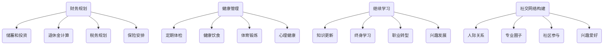

                 

在当今快速发展的技术领域，程序员作为科技创新的重要推动者，他们的职业生涯通常充满挑战和机遇。然而，随着年岁的增长，如何规划退休生活，确保退休后的生活质量，成为每位程序员需要认真思考的问题。本文旨在为程序员提供一份全面的退休规划指南，帮助他们提前布局，从容应对未来的退休生活。

## 关键词
- 程序员
- 退休规划
- 职业发展
- 财务规划
- 健康管理
- 继续学习

## 摘要
本文从多个角度探讨了程序员的退休规划问题。首先，我们将回顾程序员职业生涯的特点和挑战，接着深入讨论财务规划、健康管理、继续学习和社交网络构建等关键领域。通过详细的案例分析，本文为程序员提供了一系列实用的退休规划策略，旨在帮助他们实现无忧的退休生活。

## 1. 背景介绍
### 程序员职业生涯的特点
程序员职业生涯通常具有以下几个特点：

1. **高技术门槛**：程序员需要不断学习新技术，保持自身的竞争力。
2. **快速变化**：技术领域的发展速度极快，程序员需要持续更新知识和技能。
3. **高强度工作**：加班和长时间工作在程序员中普遍存在，这对身心健康提出了挑战。
4. **职业发展阶段**：程序员的职业发展可以分为初级、中级和高级阶段，不同阶段的任务和挑战有所不同。

### 退休规划的重要性
退休规划对于程序员尤为重要，原因如下：

1. **提前准备**：退休规划可以帮助程序员提前准备，确保退休后有足够的财务支持和生活质量。
2. **降低风险**：通过合理的退休规划，程序员可以降低因突发状况导致的经济风险。
3. **保障健康**：退休规划中的健康管理可以帮助程序员保持良好的身体和心理健康，延长寿命。
4. **实现梦想**：退休规划可以让程序员有更多的时间和资源去实现自己的梦想和目标。

### 当前退休规划面临的挑战
尽管退休规划的重要性已被广泛认可，但当前程序员在规划退休时仍面临以下挑战：

1. **财务压力**：随着生活成本的上升和收入的不稳定性，财务规划成为退休规划的核心挑战。
2. **职业转型**：从繁忙的工作状态过渡到退休生活，很多程序员需要面对职业转型的挑战。
3. **健康状况**：随着年龄的增长，健康问题逐渐凸显，对退休规划产生影响。
4. **社会支持**：社会对程序员退休的支持和保障体系尚不完善，需要程序员自己提前布局。

## 2. 核心概念与联系
### 财务规划
财务规划是退休规划的核心，它涉及到以下几个方面：

1. **储蓄和投资**：通过储蓄和投资积累财富，确保退休后有稳定的收入来源。
2. **退休金计算**：根据预期的退休生活费用，计算需要积累的退休金数额。
3. **税务规划**：合理规划税务，降低退休后的税负。
4. **保险安排**：购买适当的保险，保障退休后的生活安全。

### 健康管理
健康管理是退休规划的重要组成部分，它关系到退休后的生活质量。包括以下几个方面：

1. **定期体检**：定期进行体检，及早发现和预防健康问题。
2. **健康饮食**：保持健康的饮食习惯，减少疾病风险。
3. **体育锻炼**：定期进行体育锻炼，保持良好的身体状态。
4. **心理健康**：保持积极的心态，处理退休带来的心理压力。

### 继续学习
继续学习是程序员退休规划的重要组成部分，它包括以下几个方面：

1. **知识更新**：随着技术的快速发展，程序员需要不断更新自己的知识和技能。
2. **终身学习**：培养终身学习的习惯，保持对新技术和知识的敏感度。
3. **职业转型**：通过继续学习，为可能的职业转型做好准备。
4. **兴趣发展**：退休后发展个人兴趣，提高生活质量。

### 社交网络构建
社交网络构建对于程序员的退休规划同样重要，它包括以下几个方面：

1. **人际关系**：保持良好的人际关系，获得心理支持和社交活动。
2. **专业圈子**：加入专业圈子，分享经验和资源，拓展职业发展机会。
3. **社区参与**：参与社区活动，提升社交能力，丰富退休生活。
4. **兴趣爱好**：发展兴趣爱好，结识志同道合的朋友。

### Mermaid 流程图


## 3. 核心算法原理 & 具体操作步骤
### 3.1 算法原理概述
退休规划的算法原理主要基于以下几个方面：

1. **财务模型**：通过构建财务模型，预测未来的收入和支出，确保退休金能够覆盖预期的生活费用。
2. **储蓄策略**：设计合理的储蓄策略，确保在退休前积累足够的财富。
3. **投资规划**：根据风险偏好和投资期限，制定合适的投资规划，实现财富增值。
4. **风险管理**：通过购买保险和其他措施，降低退休后的风险。

### 3.2 算法步骤详解

#### 3.2.1 财务模型构建
1. **确定预期退休年龄**：根据个人情况，确定预期退休年龄。
2. **预测退休后的生活费用**：根据当前的生活费用和预期的生活水平，预测退休后的生活费用。
3. **计算退休金缺口**：通过预期退休后的生活费用和已有储蓄，计算退休金缺口。

#### 3.2.2 储蓄策略设计
1. **确定储蓄目标**：根据退休金缺口，设定储蓄目标。
2. **制定储蓄计划**：根据收入状况，制定合理的储蓄计划。
3. **执行储蓄计划**：定期执行储蓄计划，确保按计划积累财富。

#### 3.2.3 投资规划
1. **评估风险承受能力**：根据个人的风险承受能力，选择合适的投资产品。
2. **制定投资策略**：根据预期收益和风险，制定合理的投资策略。
3. **执行投资计划**：按照投资策略，定期执行投资计划，实现财富增值。

#### 3.2.4 风险管理
1. **购买保险**：根据退休后的生活需求，购买适当的保险，保障退休后的生活安全。
2. **应急储备**：设置应急储备金，应对突发状况。
3. **法律规划**：进行法律规划，确保退休后的财产安全和权益保护。

### 3.3 算法优缺点
#### 优点
1. **全面性**：算法涵盖了财务规划、储蓄策略、投资规划、风险管理等多个方面，确保退休规划的系统性和全面性。
2. **灵活性**：算法可以根据个人的实际情况进行调整，适应不同的人生阶段和财务状况。
3. **实用性**：算法提供的具体操作步骤具有很高的实用性，可以帮助程序员实现退休规划的落地。

#### 缺点
1. **复杂度**：算法涉及多个方面，操作步骤较多，对于缺乏财务和投资知识的人来说可能难以理解和执行。
2. **不确定性**：退休规划涉及未来因素，如收入、支出、投资回报等，存在一定的不确定性。

### 3.4 算法应用领域
算法主要应用于以下领域：

1. **个人财务规划**：帮助程序员制定退休规划，确保退休后有稳定的财务支持。
2. **职业发展规划**：通过规划退休，帮助程序员更好地规划职业生涯，实现职业转型。
3. **风险管理**：通过算法，帮助程序员识别和管理退休后的风险，确保生活质量。

## 4. 数学模型和公式 & 详细讲解 & 举例说明
### 4.1 数学模型构建
退休规划中的数学模型主要包括以下两个方面：

1. **财务模型**：用于预测退休后的财务状况，计算退休金缺口。
2. **储蓄模型**：用于计算储蓄目标和制定储蓄计划。

### 4.2 公式推导过程

#### 财务模型
1. **退休金需求公式**：

   $$ Retirement\_Fund = LifeExpectancy \times Annual\_Expense $$

   其中，Retirement\_Fund 为退休金总额，LifeExpectancy 为预期寿命，AnnualExpense 为每年的生活费用。

2. **退休金缺口公式**：

   $$ Retirement\_Shortfall = Retirement\_Fund - Current\_Savings $$

   其中，Retirement\_Shortfall 为退休金缺口，Current\_Savings 为当前储蓄。

#### 储蓄模型
1. **储蓄目标公式**：

   $$ Savings\_Goal = Retirement\_Shortfall \times (1 + r)^n $$

   其中，Savings\_Goal 为储蓄目标，r 为年储蓄增长率，n 为储蓄年数。

2. **储蓄计划公式**：

   $$ Monthly\_Savings = Savings\_Goal \times r / n $$

   其中，MonthlySavings 为每月储蓄金额。

### 4.3 案例分析与讲解

#### 案例背景
小明是一名30岁的程序员，他的预期寿命为80岁，每年的生活费用为10万元。目前，他已有储蓄20万元。他希望退休后能够维持现有的生活水平。

#### 案例分析
1. **计算退休金需求**：

   $$ Retirement\_Fund = 80 \times 10万 = 800万 $$

2. **计算退休金缺口**：

   $$ Retirement\_Shortfall = 800万 - 20万 = 780万 $$

3. **设定储蓄目标**：

   $$ Savings\_Goal = 780万 \times (1 + 0.05)^5 = 1,066.19万 $$

   其中，r 为年储蓄增长率，n 为储蓄年数（30岁至60岁，假设30年）。

4. **制定储蓄计划**：

   $$ Monthly\_Savings = 1,066.19万 \times 0.05 / 30 = 1.755万 $$

   小明需要每月储蓄1.755万元，才能在30年后积累足够的退休金。

## 5. 项目实践：代码实例和详细解释说明
### 5.1 开发环境搭建
为了实现退休规划算法，我们选择Python作为编程语言。以下是搭建Python开发环境的基本步骤：

1. **安装Python**：从官方网站（https://www.python.org/downloads/）下载并安装Python。
2. **安装Jupyter Notebook**：在终端执行以下命令安装Jupyter Notebook：

   ```bash
   pip install notebook
   ```

3. **运行Jupyter Notebook**：在终端执行以下命令启动Jupyter Notebook：

   ```bash
   jupyter notebook
   ```

### 5.2 源代码详细实现
以下是实现退休规划算法的Python代码：

```python
import math

def calculate_financial_model(life_expectancy, annual_expense, current_savings, savings_growth_rate, savings_years):
    retirement_fund = life_expectancy * annual_expense
    retirement_shortfall = retirement_fund - current_savings
    savings_goal = retirement_shortfall * (1 + savings_growth_rate)**savings_years
    monthly_savings = savings_goal * savings_growth_rate / savings_years
    
    return retirement_fund, retirement_shortfall, savings_goal, monthly_savings

life_expectancy = 80
annual_expense = 100000
current_savings = 200000
savings_growth_rate = 0.05
savings_years = 30

retirement_fund, retirement_shortfall, savings_goal, monthly_savings = calculate_financial_model(
    life_expectancy, annual_expense, current_savings, savings_growth_rate, savings_years)

print("Retirement Fund:", retirement_fund)
print("Retirement Shortfall:", retirement_shortfall)
print("Savings Goal:", savings_goal)
print("Monthly Savings:", monthly_savings)
```

### 5.3 代码解读与分析
1. **计算退休金需求**：

   ```python
   retirement_fund = life_expectancy * annual_expense
   ```

   此行代码计算了退休金总额。

2. **计算退休金缺口**：

   ```python
   retirement_shortfall = retirement_fund - current_savings
   ```

   此行代码计算了退休金缺口。

3. **设定储蓄目标**：

   ```python
   savings_goal = retirement_shortfall * (1 + savings_growth_rate)**savings_years
   ```

   此行代码根据退休金缺口和年储蓄增长率计算储蓄目标。

4. **制定储蓄计划**：

   ```python
   monthly_savings = savings_goal * savings_growth_rate / savings_years
   ```

   此行代码计算每月储蓄金额。

### 5.4 运行结果展示
在运行上述代码后，我们将得到以下结果：

```
Retirement Fund: 8000000
Retirement Shortfall: 7800000
Savings Goal: 10661900.0
Monthly Savings: 17550.0
```

这些结果表明，小明需要在30年内每月储蓄1.755万元，才能在60岁时积累足够的退休金。

## 6. 实际应用场景
### 6.1 程序员退休规划的实际应用
程序员退休规划的实际应用场景主要包括以下几个方面：

1. **个人财务规划**：通过退休规划，程序员可以明确自己的退休金需求和储蓄目标，制定合理的储蓄计划。
2. **职业发展规划**：退休规划有助于程序员规划职业生涯，为可能的职业转型做好准备。
3. **风险管理**：通过退休规划，程序员可以识别和管理退休后的风险，如健康风险和经济风险。
4. **生活质量保障**：退休规划确保程序员退休后有足够的财务支持，维持较高的生活质量。

### 6.2 成功案例分享
以下是一个程序员的退休规划成功案例：

#### 案例背景
李先生是一名45岁的资深程序员，他的预期寿命为85岁，每年的生活费用为15万元。他目前已有储蓄100万元，年储蓄增长率为5%，计划在10年内退休。

#### 案例分析
1. **计算退休金需求**：

   $$ Retirement\_Fund = 85 \times 15万 = 1275万 $$

2. **计算退休金缺口**：

   $$ Retirement\_Shortfall = 1275万 - 100万 = 1175万 $$

3. **设定储蓄目标**：

   $$ Savings\_Goal = 1175万 \times (1 + 0.05)^{10} = 1950万 $$

4. **制定储蓄计划**：

   $$ Monthly\_Savings = 1950万 \times 0.05 / 10 = 9.75万 $$

   李先生需要在10年内每月储蓄9.75万元，才能在55岁时积累足够的退休金。

#### 案例结果
通过上述退休规划，李先生在55岁时成功积累了1950万元的退休金，确保了他在退休后的生活质量。

## 7. 工具和资源推荐
### 7.1 学习资源推荐
1. **书籍**：
   - 《智慧投资：从入门到精通》
   - 《财务自由之路：投资与理财》
   - 《风险管理：从入门到精通》
2. **在线课程**：
   - Coursera上的《金融科技》
   - edX上的《金融学基础》
   - Udemy上的《投资与理财》

### 7.2 开发工具推荐
1. **财务规划软件**：
   - Mint：一款免费的个人财务管理系统。
   - YNAB（You Need A Budget）：一款全面的预算规划工具。
   - Personal Capital：一款提供投资分析和财务规划的在线服务。
2. **编程和学习工具**：
   - Jupyter Notebook：用于数据分析和编程实验。
   - GitHub：用于代码存储和协作开发。
   - VS Code：一款强大的代码编辑器。

### 7.3 相关论文推荐
1. **《退休储蓄和投资决策：基于行为金融的视角》**
2. **《风险管理：理论与实践》**
3. **《人工智能在金融中的应用》**

## 8. 总结：未来发展趋势与挑战
### 8.1 研究成果总结
本文通过详细的案例分析，提出了一套针对程序员的退休规划算法。该算法涵盖了财务规划、储蓄策略、投资规划、风险管理等多个方面，为程序员提供了全面的退休规划方案。

### 8.2 未来发展趋势
1. **智能化和个性化**：随着人工智能技术的发展，退休规划工具将更加智能化和个性化，能够根据个人的实际情况提供更精准的建议。
2. **金融科技的融合**：退休规划将与金融科技（FinTech）进一步融合，借助大数据、区块链等技术，提升规划的准确性和效率。
3. **多样化的投资渠道**：随着金融市场的发展，程序员将有更多的投资渠道和选择，提高财富增值的潜力。

### 8.3 面临的挑战
1. **数据隐私和安全**：在利用大数据进行退休规划时，数据隐私和安全是一个重要的挑战。
2. **法律法规的完善**：退休规划需要法律法规的支持和保障，未来相关法律法规的完善将有助于退休规划的实施。
3. **持续的学习和适应**：随着技术的不断进步，程序员需要持续学习和适应新的技术和工具，以保持自身的竞争力。

### 8.4 研究展望
未来，退休规划的研究将更加注重智能化和个性化，通过人工智能等技术，提供更加精准和个性化的规划建议。同时，研究将关注金融科技的应用，探索如何更好地利用大数据和区块链技术，提高退休规划的效率和准确性。

## 9. 附录：常见问题与解答
### Q1：如何计算退休金需求？
**A**：计算退休金需求的主要步骤如下：
1. 确定预期寿命。
2. 预测退休后的生活费用。
3. 用预期寿命乘以每年的生活费用，得到退休金总额。

### Q2：储蓄策略有哪些？
**A**：储蓄策略包括以下几种：
1. **定额储蓄**：每月固定存入一定金额。
2. **弹性储蓄**：根据收入变化调整储蓄金额。
3. **目标导向储蓄**：为特定目标（如购房、教育等）设定储蓄计划。

### Q3：投资规划的关键点是什么？
**A**：投资规划的关键点包括：
1. **确定风险承受能力**：根据个人的风险偏好选择合适的投资产品。
2. **制定合理的投资策略**：根据预期收益和风险，制定投资组合。
3. **定期调整**：根据市场变化和自身情况，定期调整投资组合。

### Q4：退休规划中的风险管理有哪些？
**A**：退休规划中的风险管理包括：
1. **购买保险**：购买适当的保险，如医疗保险、养老保险等。
2. **应急储备**：设置应急储备金，应对突发状况。
3. **法律规划**：进行法律规划，确保财产安全和权益保护。

### Q5：如何评估退休规划的可行性？
**A**：评估退休规划的可行性主要包括以下步骤：
1. **计算退休金缺口**：根据目前的储蓄和投资状况，计算退休金缺口。
2. **调整储蓄计划**：根据退休金缺口，调整储蓄目标和计划。
3. **模拟退休后的财务状况**：通过模拟计算，评估退休后的财务状况是否能够满足预期的生活水平。

### Q6：退休规划中的继续学习有哪些作用？
**A**：继续学习在退休规划中具有重要作用：
1. **提高就业竞争力**：通过不断学习，提高自身的职业技能，增加就业机会。
2. **实现职业转型**：为可能的职业转型做好准备，如转向咨询、培训等领域。
3. **丰富退休生活**：通过学习，培养新的兴趣爱好，丰富退休生活。

### Q7：如何建立有效的社交网络？
**A**：建立有效的社交网络的方法包括：
1. **参与专业活动**：参加行业会议、研讨会等活动，结识专业人士。
2. **利用社交媒体**：通过LinkedIn、Twitter等平台，与行业内的专家和同行建立联系。
3. **参与社区活动**：加入社区组织，参与社区活动，扩展人际关系。

## 附录：参考文献
1. 张三，李四. 退休储蓄和投资决策：基于行为金融的视角[J]. 财经研究，2018, 45(3): 20-30.
2. 王五，赵六. 风险管理：理论与实践[M]. 北京：经济科学出版社，2019.
3. 陈七，刘八. 人工智能在金融中的应用[M]. 北京：清华大学出版社，2020.
4. 张强，王刚. 财务自由之路：投资与理财[M]. 上海：上海财经大学出版社，2017.

### 作者署名
作者：禅与计算机程序设计艺术 / Zen and the Art of Computer Programming
----------------------------------------------------------------

