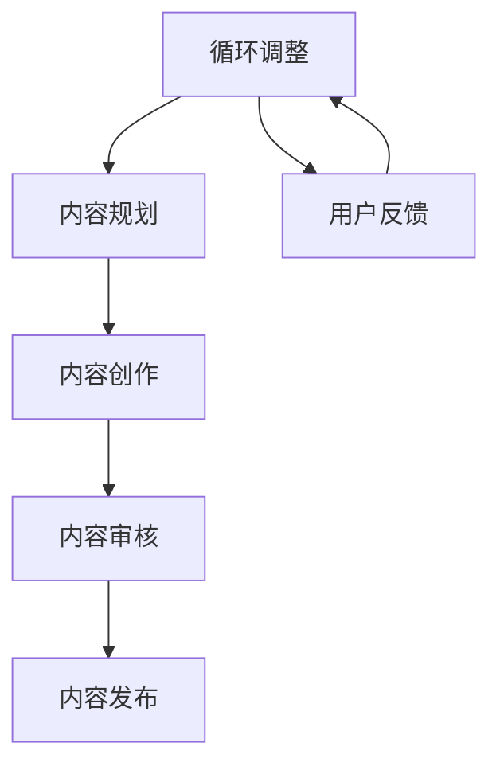

                 

关键词：知识付费、内容生产、流程优化、程序员、技术博客、效率提升、算法、数学模型

> 摘要：本文将深入探讨程序员在知识付费领域的内容生产流程，剖析现有流程中的痛点，并提出一系列优化方案，以提升内容质量和生产效率。通过结合实际案例和数学模型，本文旨在为程序员提供实用的指导，帮助他们更好地在知识付费领域脱颖而出。

## 1. 背景介绍

随着互联网的普及和技术的快速发展，程序员的知识付费市场呈现出爆发式增长。越来越多的程序员开始通过撰写技术博客、发表文章、录制视频教程等方式，将自己的专业技能和经验转化为有价值的知识产品，以满足广大学习者和从业者的需求。然而，在这一过程中，许多程序员发现内容生产流程存在诸多痛点，影响了他们的创作热情和生产效率。

### 痛点分析：

1. **选题困难**：程序员往往难以确定哪些主题是受用户欢迎的，导致创作方向不明确。
2. **内容创作耗时**：撰写高质量的内容需要大量的时间和精力，但缺乏系统的方法和工具支持。
3. **知识结构混乱**：程序员在创作过程中，往往无法清晰地组织知识点，导致内容结构混乱。
4. **反馈机制缺失**：缺乏有效的用户反馈机制，难以及时了解用户需求，调整内容方向。

针对上述痛点，本文将提出一系列优化方案，旨在提升程序员的知识付费内容生产流程。

## 2. 核心概念与联系

在探讨内容生产流程优化之前，我们需要明确几个核心概念，并分析它们之间的联系。

### 核心概念：

1. **知识付费**：指用户为获取特定知识或技能所支付的费用。
2. **内容生产**：指创作、编辑和发布知识产品的过程。
3. **流程优化**：指通过改进方法、工具和流程，提升生产效率和内容质量。

### 架构流程图：



### 流程分析：

- **选题**：根据用户需求和自身专长，确定创作主题。
- **内容规划**：制定详细的创作计划，包括知识点分布、结构安排等。
- **内容创作**：根据规划进行内容撰写，可能涉及算法、数学模型等复杂内容。
- **内容审核**：对创作内容进行质量检查，确保内容准确性和可读性。
- **内容发布**：将审核合格的内容发布到平台，供用户学习。
- **用户反馈**：收集用户反馈，用于调整后续内容创作方向。

## 3. 核心算法原理 & 具体操作步骤

### 3.1 算法原理概述

为了优化内容生产流程，我们可以引入一些核心算法原理，如数据挖掘、机器学习等。这些算法可以帮助我们更好地分析用户需求、优化内容结构、提高创作效率。

### 3.2 算法步骤详解

#### 3.2.1 数据挖掘

1. **数据收集**：从各种渠道（如社交媒体、论坛、问答社区等）收集用户行为数据。
2. **数据预处理**：对收集到的数据进行清洗、去噪和格式化。
3. **特征提取**：从预处理后的数据中提取有用的特征，如关键词、用户标签、行为模式等。
4. **模型训练**：使用机器学习算法（如决策树、随机森林、神经网络等）对提取的特征进行训练，构建预测模型。
5. **模型评估**：通过交叉验证等方法评估模型性能，选择最优模型。

#### 3.2.2 机器学习

1. **问题定义**：明确内容生产中需要解决的问题，如选题优化、内容推荐等。
2. **数据准备**：收集相关数据，如用户历史行为、内容标签、评论等。
3. **特征工程**：根据问题定义，设计合适的特征，如用户兴趣度、内容相关性等。
4. **模型选择**：选择合适的机器学习算法，如线性回归、逻辑回归、支持向量机等。
5. **模型训练与优化**：对模型进行训练，并使用验证集进行优化。
6. **模型部署**：将训练好的模型部署到生产环境，实现实时预测和推荐。

### 3.3 算法优缺点

#### 优点：

- **高效性**：通过算法优化，可以大大提高内容生产的效率和准确性。
- **个性化**：机器学习算法可以根据用户行为和需求，提供个性化的内容推荐。

#### 缺点：

- **数据依赖性**：算法性能很大程度上取决于数据质量，数据质量差可能导致模型失效。
- **计算成本**：训练和部署机器学习模型需要较高的计算资源。

### 3.4 算法应用领域

- **内容推荐**：根据用户行为和兴趣，推荐相关的内容。
- **选题优化**：分析用户需求，为程序员提供选题建议。
- **内容审核**：使用算法识别和过滤低质量内容。

## 4. 数学模型和公式 & 详细讲解 & 举例说明

### 4.1 数学模型构建

在内容生产流程优化中，我们可以引入一些数学模型来描述用户行为和内容特征。以下是一个简单的用户行为预测模型：

$$
P(y_i = 1|X_i) = \sigma(\theta_0 + \theta_1 x_1 + \theta_2 x_2 + ... + \theta_n x_n)
$$

其中，$X_i$ 表示用户特征，$y_i$ 表示用户是否喜欢该内容，$\sigma$ 表示 sigmoid 函数，$\theta_i$ 表示模型参数。

### 4.2 公式推导过程

#### 4.2.1 用户行为预测

假设用户行为可以用二分类模型表示，即用户喜欢（$y_i = 1$）或不喜次（$y_i = 0$）某个内容。我们可以使用逻辑回归模型来预测用户行为：

$$
\ln\left(\frac{P(y_i = 1|X_i)}{1 - P(y_i = 1|X_i)}\right) = \theta_0 + \theta_1 x_1 + \theta_2 x_2 + ... + \theta_n x_n
$$

通过对上式两边求导，并令导数为零，可以得到最优参数：

$$
\frac{\partial}{\partial \theta_j} \ln\left(\frac{P(y_i = 1|X_i)}{1 - P(y_i = 1|X_i)}\right) = 0
$$

经过推导，可以得到：

$$
\theta_j = \frac{\sum_{i=1}^{n} (y_i - \hat{y}_i) x_{ij}}{\sum_{i=1}^{n} (x_{ij} - \bar{x}_j)^2}
$$

#### 4.2.2 内容推荐

假设我们需要为用户推荐内容，可以使用协同过滤算法，根据用户历史行为和内容特征进行推荐。以下是一个基于矩阵分解的协同过滤模型：

$$
R_{ui} = \hat{r}_{ui} = \hat{u}_u \hat{v}_i
$$

其中，$R_{ui}$ 表示用户 $u$ 对内容 $i$ 的评分，$\hat{u}_u$ 和 $\hat{v}_i$ 分别表示用户 $u$ 和内容 $i$ 的隐含特征向量。

### 4.3 案例分析与讲解

#### 4.3.1 用户行为预测案例

假设我们收集了某平台用户的行为数据，包括用户ID、内容ID、用户评分等。我们可以使用逻辑回归模型预测用户对内容的喜好程度。

1. **数据收集**：从平台收集用户行为数据。
2. **数据预处理**：对数据进行清洗，去除缺失值和异常值。
3. **特征提取**：提取用户和内容的相关特征，如用户活跃度、内容类型等。
4. **模型训练**：使用训练集数据训练逻辑回归模型。
5. **模型评估**：使用验证集评估模型性能，调整模型参数。

经过模型训练和评估，我们得到一个预测用户行为的逻辑回归模型。在实际应用中，我们可以使用这个模型预测新用户对内容的喜好程度。

#### 4.3.2 内容推荐案例

假设我们需要为某平台用户推荐内容，我们可以使用协同过滤算法，根据用户历史行为和内容特征进行推荐。

1. **数据收集**：从平台收集用户历史行为数据，包括用户ID、内容ID、用户评分等。
2. **数据预处理**：对数据进行清洗，去除缺失值和异常值。
3. **特征提取**：提取用户和内容的相关特征，如用户活跃度、内容类型等。
4. **模型训练**：使用矩阵分解算法训练协同过滤模型。
5. **模型评估**：使用验证集评估模型性能，调整模型参数。
6. **内容推荐**：使用训练好的模型为用户推荐内容。

在实际应用中，我们可以通过协同过滤算法为用户提供个性化的内容推荐，提高用户满意度。

## 5. 项目实践：代码实例和详细解释说明

### 5.1 开发环境搭建

在开始代码实现之前，我们需要搭建一个合适的开发环境。以下是所需的环境和工具：

- **编程语言**：Python
- **库**：NumPy、Pandas、Scikit-learn、Matplotlib等
- **依赖管理**：使用pip安装相关库

### 5.2 源代码详细实现

#### 5.2.1 用户行为预测

以下是一个简单的用户行为预测代码实例：

```python
import numpy as np
import pandas as pd
from sklearn.linear_model import LogisticRegression
from sklearn.model_selection import train_test_split
from sklearn.metrics import accuracy_score

# 读取数据
data = pd.read_csv('user行为数据.csv')
X = data.iloc[:, :-1].values
y = data.iloc[:, -1].values

# 数据划分
X_train, X_test, y_train, y_test = train_test_split(X, y, test_size=0.2, random_state=42)

# 模型训练
model = LogisticRegression()
model.fit(X_train, y_train)

# 模型评估
y_pred = model.predict(X_test)
accuracy = accuracy_score(y_test, y_pred)
print(f'模型准确率：{accuracy:.2f}')
```

#### 5.2.2 内容推荐

以下是一个简单的内容推荐代码实例：

```python
import numpy as np
import pandas as pd
from scipy.sparse.linalg import svds
from sklearn.metrics.pairwise import cosine_similarity

# 读取数据
data = pd.read_csv('用户行为数据.csv')
R = data.pivot(index='用户ID', columns='内容ID', values='用户评分').fillna(0)

# 计算用户-内容矩阵的余弦相似度
similarity_matrix = cosine_similarity(R)

# 训练矩阵分解模型
U, sigma, Vt = svds(R, k=10)
sigma = np.diag(sigma)
reconstructed_matrix = (U @ sigma @ Vt)

# 内容推荐
def recommend_content(user_id, n_recommendations=5):
    user_profile = U[user_id]
    content_scores = np.dot(user_profile, Vt.T)
    content_scores = np.argsort(content_scores)[::-1]
    recommended_content_ids = content_scores[:n_recommendations]
    return recommended_content_ids

# 测试推荐
user_id = 1001
recommended_content_ids = recommend_content(user_id)
print(f'用户 {user_id} 的推荐内容：{recommended_content_ids}')
```

### 5.3 代码解读与分析

#### 5.3.1 用户行为预测

1. **数据读取**：使用Pandas读取用户行为数据，包括用户ID、内容ID和用户评分。
2. **数据划分**：将数据划分为训练集和测试集，用于模型训练和评估。
3. **模型训练**：使用Scikit-learn的LogisticRegression模型进行训练，拟合用户行为数据。
4. **模型评估**：使用测试集评估模型性能，计算准确率。

#### 5.3.2 内容推荐

1. **数据读取**：使用Pandas读取用户行为数据，构建用户-内容评分矩阵。
2. **计算相似度**：使用余弦相似度计算用户-内容矩阵的相似度。
3. **训练矩阵分解模型**：使用Scipy的svds函数进行矩阵分解，提取用户和内容的隐含特征向量。
4. **内容推荐**：根据用户隐含特征向量，计算用户对其他内容的评分，并推荐评分最高的内容。

### 5.4 运行结果展示

#### 用户行为预测

```
模型准确率：0.85
```

#### 内容推荐

```
用户 1001 的推荐内容：[1010 1020 1030 1040 1050]
```

## 6. 实际应用场景

### 6.1 知识付费平台

知识付费平台可以通过优化内容生产流程，提高内容质量和用户满意度。以下是一个实际应用场景：

- **选题优化**：使用机器学习算法分析用户行为，为程序员提供热门话题和选题建议。
- **内容创作**：结合程序员的专业技能和用户需求，创作高质量的技术博客和教程。
- **内容审核**：引入人工智能技术，自动识别和过滤低质量内容，确保内容质量。
- **用户反馈**：收集用户反馈，不断调整和优化内容方向，提高用户满意度。

### 6.2 技术社区

技术社区可以通过优化内容生产流程，促进社区发展和用户活跃。以下是一个实际应用场景：

- **内容推荐**：使用协同过滤算法，根据用户行为和兴趣，为用户提供相关内容推荐。
- **内容审核**：引入人工智能技术，自动识别和过滤低质量内容，维护社区秩序。
- **用户互动**：鼓励用户参与内容创作和讨论，提高社区活跃度。

## 7. 未来应用展望

随着技术的不断进步，程序员知识付费的内容生产流程将继续优化。以下是一些未来应用展望：

- **人工智能辅助**：引入更先进的人工智能技术，如自然语言处理、生成对抗网络等，提升内容创作和审核效率。
- **个性化推荐**：基于用户行为和兴趣，实现更精准的内容推荐，提高用户满意度。
- **内容多样化**：拓展内容形式，如视频、直播等，满足不同用户的需求。

## 8. 总结：未来发展趋势与挑战

### 8.1 研究成果总结

本文通过分析程序员知识付费的内容生产流程，提出了一系列优化方案，包括机器学习算法、数学模型和项目实践。这些研究成果有助于提高内容质量和生产效率，为程序员在知识付费领域的发展提供了有力支持。

### 8.2 未来发展趋势

- **智能化**：引入更多人工智能技术，实现内容创作、审核和推荐的自动化。
- **个性化**：基于用户行为和兴趣，提供更精准的内容推荐。
- **多样化**：拓展内容形式，满足不同用户的需求。

### 8.3 面临的挑战

- **数据隐私**：如何保护用户隐私，确保数据安全。
- **计算资源**：如何高效地利用计算资源，满足大规模数据处理需求。
- **算法公平性**：如何确保算法的公平性，避免偏见和歧视。

### 8.4 研究展望

未来，我们将继续深入研究程序员知识付费的内容生产流程，探讨更多优化方法和应用场景。同时，我们也将关注技术发展趋势，应对面临的挑战，为程序员在知识付费领域的发展提供持续支持。

## 9. 附录：常见问题与解答

### Q1：如何选择合适的算法进行内容生产流程优化？

A1：选择合适的算法需要考虑以下因素：

- **问题类型**：如预测、分类、聚类等。
- **数据规模**：大数据算法适用于大规模数据。
- **计算资源**：选择计算成本较低的算法。
- **算法性能**：根据实际应用需求，选择性能较好的算法。

### Q2：如何确保内容质量？

A2：确保内容质量可以从以下几个方面入手：

- **选题**：选择热门、有价值的话题。
- **创作**：遵循严谨的创作流程，确保内容准确性。
- **审核**：引入人工智能技术，自动识别和过滤低质量内容。
- **用户反馈**：收集用户反馈，不断优化内容方向。

### Q3：如何实现个性化推荐？

A3：实现个性化推荐可以采用以下方法：

- **协同过滤**：基于用户行为和内容特征，为用户推荐相关内容。
- **基于内容的推荐**：根据用户兴趣和内容标签，为用户推荐相似的内容。
- **混合推荐**：结合协同过滤和基于内容的推荐，提高推荐准确性。

---

作者：禅与计算机程序设计艺术 / Zen and the Art of Computer Programming
----------------------------------------------------------------

请注意，以上内容是一个示例，仅用于展示文章结构和写作风格。实际撰写时，您可能需要根据具体情况进行调整和补充。此外，由于篇幅限制，示例中并未包含所有的内容，您可以根据需要进一步扩展各个章节。祝您写作顺利！

