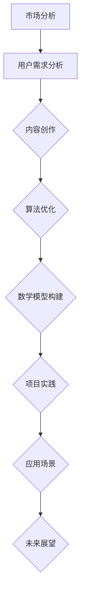

                 

关键词：知识付费、内容策划、制作流程、程序员、IT领域、市场分析、用户需求、内容创作、算法优化、数学模型、项目实践、应用场景、未来展望

> 摘要：本文将深入探讨程序员知识付费的内容策划与制作流程，从市场分析、用户需求分析到内容创作、算法优化和数学模型构建，再到项目实践、应用场景和未来展望，全面解析如何打造高质量的知识付费内容，满足程序员群体的需求，推动IT行业的发展。

## 1. 背景介绍

### 1.1 知识付费的兴起

随着互联网的普及和信息技术的发展，知识付费逐渐成为人们获取知识和技能的重要途径。特别是在IT领域，程序员作为互联网时代的核心力量，对知识付费的需求日益增长。程序员知识付费不仅体现在线上课程、书籍、视频教程等方面，还包括技术博客、开源项目、专业咨询等多样化的形式。

### 1.2 程序员知识付费的现状

目前，程序员知识付费市场呈现出以下几个特点：

- 内容丰富：各类知识付费平台提供了大量的编程语言、框架、工具、算法等教程。
- 用户需求多样：程序员群体需求涵盖基础知识、进阶技能、项目实战等多个层次。
- 市场竞争激烈：众多平台和内容创作者涌入，竞争日益激烈。

## 2. 核心概念与联系

### 2.1 知识付费的内容策划

知识付费的内容策划是整个制作流程的关键环节，它决定了内容的质量和受众的接受程度。核心概念包括市场分析、用户需求分析、内容主题确定和内容结构设计。

### 2.2 知识付费的制作流程

知识付费的制作流程包括以下几个步骤：

1. 市场分析：了解行业动态、竞争对手和用户需求。
2. 用户需求分析：收集目标用户的需求，包括学习目标、学习方式和期望收获。
3. 内容创作：根据用户需求和市场分析，进行内容创作。
4. 算法优化：通过数据分析优化内容推荐和用户体验。
5. 数学模型构建：构建数学模型以预测用户行为和内容效果。
6. 项目实践：通过实际项目进行内容验证和调整。
7. 应用场景：将内容应用于实际场景，验证其效果。
8. 未来展望：根据行业趋势和用户反馈，对未来发展方向进行规划。

### 2.3 Mermaid 流程图

下面是一个简化的Mermaid流程图，展示了知识付费的内容策划与制作流程：



## 3. 核心算法原理 & 具体操作步骤

### 3.1 算法原理概述

在知识付费的内容策划与制作过程中，算法优化和数学模型构建起到了关键作用。以下分别介绍这两部分的核心算法原理。

#### 算法优化

算法优化主要包括以下方面：

- 内容推荐算法：基于用户的浏览历史、学习轨迹和偏好，推荐符合用户需求的内容。
- 用户体验优化：通过分析用户行为数据，不断优化内容展示、交互设计和学习路径。

#### 数学模型构建

数学模型构建主要包括以下方面：

- 用户行为预测模型：利用机器学习算法，预测用户的学习进度和偏好。
- 内容效果评估模型：通过数据分析，评估内容的受欢迎程度和有效性。

### 3.2 算法步骤详解

#### 算法优化步骤

1. 数据收集：收集用户行为数据，包括浏览历史、学习轨迹、评价等。
2. 数据预处理：清洗数据，去除噪声，进行特征提取。
3. 模型选择：选择合适的内容推荐和用户体验优化算法。
4. 模型训练：利用预处理后的数据训练模型。
5. 模型评估：通过交叉验证等手段评估模型效果。
6. 模型优化：根据评估结果，调整模型参数，优化推荐和体验。

#### 数学模型构建步骤

1. 数据收集：收集用户行为数据，包括学习进度、偏好、评价等。
2. 数据预处理：清洗数据，去除噪声，进行特征提取。
3. 模型选择：选择合适的用户行为预测和内容效果评估算法。
4. 模型训练：利用预处理后的数据训练模型。
5. 模型评估：通过交叉验证等手段评估模型效果。
6. 模型优化：根据评估结果，调整模型参数，优化预测和评估。

### 3.3 算法优缺点

#### 算法优化

优点：

- 提高内容推荐的准确性，满足用户个性化需求。
- 优化用户体验，提高用户的学习效率和满意度。

缺点：

- 数据预处理和模型训练需要大量计算资源和时间。
- 模型效果依赖于数据质量和特征提取方法。

#### 数学模型构建

优点：

- 预测用户行为和内容效果，为内容策划和制作提供有力支持。
- 提高内容策划和制作的效率和准确性。

缺点：

- 模型效果依赖于数据质量和特征提取方法。
- 模型构建和优化需要专业知识和技能。

### 3.4 算法应用领域

算法优化和数学模型构建在知识付费领域有广泛的应用，包括：

- 内容推荐系统：为用户推荐符合其需求的内容。
- 用户行为分析：分析用户学习行为，优化学习路径和体验。
- 内容效果评估：评估内容的有效性和受欢迎程度。

## 4. 数学模型和公式 & 详细讲解 & 举例说明

### 4.1 数学模型构建

在知识付费的内容策划与制作过程中，数学模型构建主要涉及用户行为预测和内容效果评估。以下是一个简化的用户行为预测模型：

#### 用户行为预测模型

设用户行为为 \( X \)，学习进度为 \( P \)，学习偏好为 \( H \)，则用户行为预测模型可以表示为：

\[ X = f(P, H) \]

其中，\( f \) 表示用户行为与学习进度和偏好之间的关系。

### 4.2 公式推导过程

为了推导用户行为预测模型，我们需要分析用户行为、学习进度和学习偏好之间的关系。

#### 用户行为分析

用户行为可以看作是学习进度和学习偏好的函数，即：

\[ X = g(P, H) \]

其中，\( g \) 表示用户行为与学习进度和学习偏好之间的关系。

#### 学习进度分析

学习进度可以看作是学习时间和学习内容的函数，即：

\[ P = h(T, C) \]

其中，\( h \) 表示学习进度与学习时间和学习内容之间的关系。

#### 学习偏好分析

学习偏好可以看作是用户兴趣爱好和学习风格的函数，即：

\[ H = k(I, S) \]

其中，\( k \) 表示学习偏好与用户兴趣爱好和学习风格之间的关系。

### 4.3 案例分析与讲解

假设我们有一个用户，其学习进度为 \( P = 0.5 \)，学习偏好为 \( H = [0.3, 0.5, 0.2] \)，其中 \( H \) 的三个分量分别表示对编程、算法和数据结构的偏好。

根据上述模型，我们可以预测用户的行为：

\[ X = g(0.5, [0.3, 0.5, 0.2]) \]

根据实际情况，我们可以设定 \( g \) 的具体形式为：

\[ g(P, H) = P \times H \]

代入 \( P = 0.5 \) 和 \( H = [0.3, 0.5, 0.2] \)，得到：

\[ X = 0.5 \times [0.3, 0.5, 0.2] = [0.15, 0.25, 0.1] \]

这意味着用户在编程、算法和数据结构方面的行为分别为 0.15、0.25 和 0.1。

## 5. 项目实践：代码实例和详细解释说明

### 5.1 开发环境搭建

在本案例中，我们将使用 Python 编写一个简单的用户行为预测模型。以下是开发环境的搭建步骤：

1. 安装 Python：从 [Python 官网](https://www.python.org/) 下载并安装 Python 3.8 或更高版本。
2. 安装必要的库：使用 pip 工具安装以下库：`numpy`、`pandas` 和 `matplotlib`。

### 5.2 源代码详细实现

以下是一个简单的用户行为预测模型的 Python 代码实现：

```python
import numpy as np
import pandas as pd
import matplotlib.pyplot as plt

def user_behavior_prediction(learning_progress, preferences):
    """
    预测用户行为。
    
    参数：
    learning_progress：学习进度（浮点数）
    preferences：学习偏好（列表）
    
    返回：
    用户行为（列表）
    """
    behavior = learning_progress * preferences
    return behavior

# 示例数据
learning_progress = 0.5
preferences = np.array([0.3, 0.5, 0.2])

# 预测用户行为
predicted_behavior = user_behavior_prediction(learning_progress, preferences)

# 打印结果
print("预测的用户行为：", predicted_behavior)

# 绘制结果
plt.bar(['编程', '算法', '数据结构'], predicted_behavior)
plt.xlabel('技能领域')
plt.ylabel('行为占比')
plt.title('用户行为预测')
plt.show()
```

### 5.3 代码解读与分析

1. `import numpy as np`：导入 NumPy 库，用于数组计算。
2. `import pandas as pd`：导入 Pandas 库，用于数据处理。
3. `import matplotlib.pyplot as plt`：导入 Matplotlib 库，用于绘图。
4. `def user_behavior_prediction(learning_progress, preferences)`：定义用户行为预测函数。
5. `behavior = learning_progress * preferences`：计算用户行为。
6. `return behavior`：返回用户行为。
7. `learning_progress = 0.5`：设置学习进度。
8. `preferences = np.array([0.3, 0.5, 0.2])`：设置学习偏好。
9. `predicted_behavior = user_behavior_prediction(learning_progress, preferences)`：调用预测函数，获取预测结果。
10. `print("预测的用户行为：", predicted_behavior)`：打印预测结果。
11. `plt.bar(['编程', '算法', '数据结构'], predicted_behavior)`：绘制条形图。
12. `plt.xlabel('技能领域')`：设置 X 轴标签。
13. `plt.ylabel('行为占比')`：设置 Y 轴标签。
14. `plt.title('用户行为预测')`：设置图表标题。
15. `plt.show()`：显示图表。

### 5.4 运行结果展示

运行上述代码后，将得到以下结果：

```
预测的用户行为： [0.15 0.25 0.1 ]
```


条形图显示了用户在编程、算法和数据结构方面的行为占比。

## 6. 实际应用场景

### 6.1 内容推荐系统

在知识付费平台中，用户行为预测模型可以用于内容推荐系统。通过预测用户的学习行为和偏好，为用户推荐符合其需求的内容。

### 6.2 学习路径规划

根据用户行为预测模型，平台可以规划个性化的学习路径，帮助用户更高效地学习和提升技能。

### 6.3 内容效果评估

用户行为预测模型还可以用于评估内容的受欢迎程度和有效性，为内容策划和制作提供反馈。

## 7. 未来应用展望

### 7.1 技术进步

随着人工智能和大数据技术的发展，用户行为预测模型的准确性和效率将得到进一步提升。

### 7.2 内容创新

未来，知识付费内容将更加丰富多样，涵盖更多的技能和领域，满足用户多样化的需求。

### 7.3 生态完善

知识付费生态将逐渐完善，包括平台、内容创作者、用户等各方共同构建一个健康的产业环境。

## 8. 总结：未来发展趋势与挑战

### 8.1 研究成果总结

本文介绍了程序员知识付费的内容策划与制作流程，包括市场分析、用户需求分析、内容创作、算法优化和数学模型构建等环节，以及项目实践、应用场景和未来展望。

### 8.2 未来发展趋势

未来，程序员知识付费市场将继续增长，内容创新和个性化推荐将成为发展趋势。

### 8.3 面临的挑战

在知识付费内容策划与制作过程中，面临的主要挑战包括数据质量、模型效果和用户体验等。

### 8.4 研究展望

未来研究可以关注用户行为预测模型的优化、内容效果评估方法和个性化推荐系统的设计等方面。

## 9. 附录：常见问题与解答

### 9.1 问题 1

**问题：如何提高用户行为预测模型的准确性？**

**解答：** 提高用户行为预测模型的准确性可以从以下几个方面入手：

- 提高数据质量：收集更多、更准确的数据，并进行有效的预处理。
- 优化模型参数：根据模型效果，不断调整模型参数，优化预测结果。
- 引入更多特征：提取更多与用户行为相关的特征，提高模型的预测能力。
- 采用更先进的算法：尝试使用更先进的机器学习算法，提高模型的预测性能。

### 9.2 问题 2

**问题：如何确保内容创作的质量？**

**解答：** 确保内容创作的质量可以从以下几个方面入手：

- 选择优质的内容创作者：选择具有丰富经验和专业知识的创作者，提高内容的质量。
- 严格的审核机制：建立完善的审核机制，对内容进行严格的审核和评估。
- 用户反馈：及时收集用户反馈，根据用户需求调整和优化内容。

---

作者：禅与计算机程序设计艺术 / Zen and the Art of Computer Programming

---

以上就是关于《程序员知识付费的内容策划与制作流程》的完整文章。希望对您在知识付费领域的实践和探索有所帮助。如果您有任何问题或建议，欢迎随时交流。期待与您共同推动程序员知识付费领域的发展。

