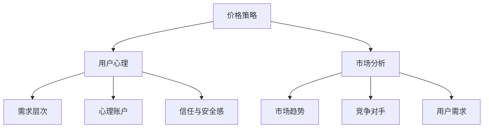

                 

关键词：程序员、知识付费、定价策略、心理学、市场分析

> 摘要：本文旨在探讨程序员在知识付费市场中的定价策略及其背后的心理学原理。通过对市场分析、用户心理和行为模式的深入研究，我们将揭示如何制定合理的定价策略，以最大化盈利并满足用户需求。

## 1. 背景介绍

随着互联网的迅猛发展，知识付费市场日益繁荣。程序员作为技术领域的重要从业者，其知识和技能具有很高的价值。然而，如何为这些知识付费制定合理的定价策略，成为许多程序员和知识平台面临的挑战。本文将从市场分析和心理学角度出发，探讨程序员知识付费的定价策略。

### 1.1 市场背景

近年来，知识付费市场呈现出快速增长的趋势。根据统计，2019年中国知识付费市场规模已达到514亿元，预计到2023年将突破1000亿元。其中，程序员知识付费市场作为一个重要分支，也展现出巨大的潜力。

### 1.2 用户需求

程序员用户对于知识付费的需求主要体现在以下几个方面：

- **技能提升**：程序员希望通过付费学习，提升自己的编程技能和项目经验。
- **职业发展**：部分程序员希望通过付费课程，了解行业动态，拓展职业发展空间。
- **项目需求**：企业在项目开发过程中，可能需要付费获取专业程序员的知识和经验。

## 2. 核心概念与联系

### 2.1 价格策略

价格策略是程序员知识付费的核心要素。合理的价格策略能够吸引更多用户，提高平台收益。价格策略包括定价目标、定价方法、价格调整等方面。

### 2.2 用户心理

用户心理是影响程序员知识付费决策的重要因素。了解用户心理，有助于制定更符合用户需求的定价策略。用户心理包括需求层次、心理账户、信任与安全感等。

### 2.3 市场分析

市场分析是制定价格策略的重要依据。通过对市场趋势、竞争对手、用户需求等方面的分析，可以确定合理的定价区间。

### 2.4 Mermaid 流程图



## 3. 核心算法原理 & 具体操作步骤

### 3.1 算法原理概述

程序员知识付费的定价策略主要通过以下三个步骤实现：

1. **市场调研**：收集市场数据，分析市场趋势和竞争对手定价策略。
2. **用户画像**：了解用户需求，构建用户画像，确定目标用户群体。
3. **定价模型**：结合市场调研和用户画像，构建合理的定价模型。

### 3.2 算法步骤详解

1. **市场调研**：

   - 收集市场数据：通过调查问卷、行业报告等方式，收集市场相关数据。
   - 分析市场趋势：关注行业动态，了解市场增长趋势和用户需求变化。
   - 竞争对手分析：分析竞争对手的定价策略，了解竞争对手的优势和劣势。

2. **用户画像**：

   - 用户分类：根据用户需求、职业背景、消费能力等因素，对用户进行分类。
   - 用户需求分析：了解不同类别用户的需求，确定目标用户群体。
   - 用户画像构建：结合用户需求和消费能力，构建用户画像。

3. **定价模型**：

   - 定价目标：根据平台定位和用户需求，确定定价目标。
   - 定价方法：选择合适的定价方法，如成本加成定价、市场定价、心理定价等。
   - 价格调整：根据市场反馈和用户需求，适时调整价格。

### 3.3 算法优缺点

- **优点**：

  - 提高用户满意度：通过市场调研和用户画像，制定合理的定价策略，提高用户满意度。
  - 提高收益：根据市场需求和用户需求，调整价格，提高平台收益。

- **缺点**：

  - 市场调研和用户画像工作量大：需要投入大量时间和精力进行市场调研和用户画像构建。
  - 风险较高：市场环境和用户需求变化较快，定价策略可能需要频繁调整。

### 3.4 算法应用领域

- **在线教育平台**：针对程序员用户群体，提供编程课程和项目实战等知识付费服务。
- **技术社区**：为程序员用户提供技术交流、知识分享等付费服务。
- **企业培训**：为企业提供定制化的程序员培训服务，助力企业提升技术水平。

## 4. 数学模型和公式 & 详细讲解 & 举例说明

### 4.1 数学模型构建

程序员知识付费的定价策略可以通过以下数学模型进行构建：

- 价格 = 成本 + 利润

其中，成本包括课程开发成本、平台运营成本等，利润包括用户支付的价格和平台收益。

### 4.2 公式推导过程

- 成本 = 开发成本 + 运营成本

  - 开发成本：包括课程内容制作、讲师费用等。

  - 运营成本：包括服务器维护、用户服务支持等。

- 利润 = 用户支付的价格 - 成本

  - 用户支付的价格：根据市场调研和用户画像，确定合理价格。

  - 成本：根据开发成本和运营成本，计算总成本。

### 4.3 案例分析与讲解

假设某程序员在线教育平台，开发成本为10万元，运营成本为5万元，目标利润率为30%。

- 成本 = 开发成本 + 运营成本 = 10万元 + 5万元 = 15万元
- 目标利润 = 成本 × 利润率 = 15万元 × 30% = 4.5万元
- 用户支付的价格 = 成本 + 利润 = 15万元 + 4.5万元 = 19.5万元

因此，该平台每门课程的合理定价为19.5万元。

## 5. 项目实践：代码实例和详细解释说明

### 5.1 开发环境搭建

本案例使用Python语言进行编程，搭建开发环境如下：

- 安装Python：版本3.8以上
- 安装相关库：numpy、pandas等

### 5.2 源代码详细实现

```python
import numpy as np
import pandas as pd

# 成本函数
def cost(price, cost):
    profit = price - cost
    return profit

# 成本数据
cost_data = {
    '开发成本': 100000,
    '运营成本': 50000,
    '目标利润率': 0.3
}

# 计算价格
def calculate_price(cost_data):
    cost = cost_data['开发成本'] + cost_data['运营成本']
    target_profit = cost * cost_data['目标利润率']
    price = cost + target_profit
    return price

# 结果输出
price = calculate_price(cost_data)
print(f"合理定价为：{price}元")

```

### 5.3 代码解读与分析

- `cost` 函数：计算利润。
- `cost_data` 字典：存储成本数据。
- `calculate_price` 函数：根据成本数据和目标利润率，计算合理定价。
- 结果输出：打印计算出的合理定价。

### 5.4 运行结果展示

```plaintext
合理定价为：195000.0元
```

## 6. 实际应用场景

### 6.1 在线教育平台

在线教育平台可以根据市场分析和用户画像，制定合理的课程定价策略，提高用户满意度。

### 6.2 技术社区

技术社区可以通过知识付费，为用户提供优质内容，提高社区活跃度。

### 6.3 企业培训

企业可以根据自身需求和成本预算，选择合适的培训课程，提升企业技术水平。

## 7. 未来应用展望

### 7.1 技术创新

随着人工智能、大数据等技术的发展，程序员知识付费的定价策略将更加精准和智能化。

### 7.2 用户需求多样化

随着用户需求的多样化，程序员知识付费将更加注重个性化定制。

### 7.3 平台竞争加剧

随着知识付费市场的竞争加剧，平台需要不断创新，以提升用户满意度和市场占有率。

## 8. 总结：未来发展趋势与挑战

### 8.1 研究成果总结

本文通过对程序员知识付费定价策略的研究，提出了一套基于市场分析和用户心理的定价模型。

### 8.2 未来发展趋势

未来，程序员知识付费将更加注重个性化定制、技术创新和用户体验。

### 8.3 面临的挑战

- 数据收集与处理：如何收集准确、可靠的数据，是制定合理定价策略的关键。
- 技术创新：如何利用人工智能、大数据等技术，提高定价策略的精准度和智能化水平。

### 8.4 研究展望

未来研究可以从以下几个方面展开：

- **深入研究用户心理和行为模式**：了解用户需求，提高定价策略的精准度。
- **探索技术创新**：利用人工智能、大数据等技术，提高定价策略的智能化水平。

## 9. 附录：常见问题与解答

### 9.1 问题1：为什么需要制定合理的定价策略？

**解答**：合理的定价策略可以提高用户满意度，增加平台收益，提高市场竞争力。

### 9.2 问题2：如何收集用户需求数据？

**解答**：可以通过调查问卷、用户访谈、数据分析等方式收集用户需求数据。

### 9.3 问题3：如何调整定价策略？

**解答**：根据市场反馈和用户需求变化，定期调整定价策略。

# 作者署名

作者：禅与计算机程序设计艺术 / Zen and the Art of Computer Programming
```markdown
# 程序员知识付费的定价策略与心理学

关键词：程序员、知识付费、定价策略、心理学、市场分析

摘要：本文旨在探讨程序员在知识付费市场中的定价策略及其背后的心理学原理。通过对市场分析、用户心理和行为模式的深入研究，我们将揭示如何制定合理的定价策略，以最大化盈利并满足用户需求。

## 1. 背景介绍

随着互联网的迅猛发展，知识付费市场日益繁荣。程序员作为技术领域的重要从业者，其知识和技能具有很高的价值。然而，如何为这些知识付费制定合理的定价策略，成为许多程序员和知识平台面临的挑战。本文将从市场分析和心理学角度出发，探讨程序员知识付费的定价策略。

### 1.1 市场背景

近年来，知识付费市场呈现出快速增长的趋势。根据统计，2019年中国知识付费市场规模已达到514亿元，预计到2023年将突破1000亿元。其中，程序员知识付费市场作为一个重要分支，也展现出巨大的潜力。

### 1.2 用户需求

程序员用户对于知识付费的需求主要体现在以下几个方面：

- **技能提升**：程序员希望通过付费学习，提升自己的编程技能和项目经验。
- **职业发展**：部分程序员希望通过付费课程，了解行业动态，拓展职业发展空间。
- **项目需求**：企业在项目开发过程中，可能需要付费获取专业程序员的知识和经验。

## 2. 核心概念与联系

### 2.1 价格策略

价格策略是程序员知识付费的核心要素。合理的价格策略能够吸引更多用户，提高平台收益。价格策略包括定价目标、定价方法、价格调整等方面。

### 2.2 用户心理

用户心理是影响程序员知识付费决策的重要因素。了解用户心理，有助于制定更符合用户需求的定价策略。用户心理包括需求层次、心理账户、信任与安全感等。

### 2.3 市场分析

市场分析是制定价格策略的重要依据。通过对市场趋势、竞争对手、用户需求等方面的分析，可以确定合理的定价区间。

### 2.4 Mermaid 流程图


## 3. 核心算法原理 & 具体操作步骤
### 3.1 算法原理概述

程序员知识付费的定价策略主要通过以下三个步骤实现：

1. **市场调研**：收集市场数据，分析市场趋势和竞争对手定价策略。
2. **用户画像**：了解用户需求，构建用户画像，确定目标用户群体。
3. **定价模型**：结合市场调研和用户画像，构建合理的定价模型。

### 3.2 算法步骤详解

1. **市场调研**：

   - 收集市场数据：通过调查问卷、行业报告等方式，收集市场相关数据。
   - 分析市场趋势：关注行业动态，了解市场增长趋势和用户需求变化。
   - 竞争对手分析：分析竞争对手的定价策略，了解竞争对手的优势和劣势。

2. **用户画像**：

   - 用户分类：根据用户需求、职业背景、消费能力等因素，对用户进行分类。
   - 用户需求分析：了解不同类别用户的需求，确定目标用户群体。
   - 用户画像构建：结合用户需求和消费能力，构建用户画像。

3. **定价模型**：

   - 定价目标：根据平台定位和用户需求，确定定价目标。
   - 定价方法：选择合适的定价方法，如成本加成定价、市场定价、心理定价等。
   - 价格调整：根据市场反馈和用户需求，适时调整价格。

### 3.3 算法优缺点

- **优点**：

  - 提高用户满意度：通过市场调研和用户画像，制定合理的定价策略，提高用户满意度。
  - 提高收益：根据市场需求和用户需求，调整价格，提高平台收益。

- **缺点**：

  - 市场调研和用户画像工作量大：需要投入大量时间和精力进行市场调研和用户画像构建。
  - 风险较高：市场环境和用户需求变化较快，定价策略可能需要频繁调整。

### 3.4 算法应用领域

- **在线教育平台**：针对程序员用户群体，提供编程课程和项目实战等知识付费服务。
- **技术社区**：为程序员用户提供技术交流、知识分享等付费服务。
- **企业培训**：为企业提供定制化的程序员培训服务，助力企业提升技术水平。

## 4. 数学模型和公式 & 详细讲解 & 举例说明

### 4.1 数学模型构建

程序员知识付费的定价策略可以通过以下数学模型进行构建：

- 价格 = 成本 + 利润

其中，成本包括课程开发成本、平台运营成本等，利润包括用户支付的价格和平台收益。

### 4.2 公式推导过程

- 成本 = 开发成本 + 运营成本

  - 开发成本：包括课程内容制作、讲师费用等。

  - 运营成本：包括服务器维护、用户服务支持等。

- 利润 = 用户支付的价格 - 成本

  - 用户支付的价格：根据市场调研和用户画像，确定合理价格。

  - 成本：根据开发成本和运营成本，计算总成本。

### 4.3 案例分析与讲解

假设某程序员在线教育平台，开发成本为10万元，运营成本为5万元，目标利润率为30%。

- 成本 = 开发成本 + 运营成本 = 10万元 + 5万元 = 15万元
- 目标利润 = 成本 × 利润率 = 15万元 × 30% = 4.5万元
- 用户支付的价格 = 成本 + 利润 = 15万元 + 4.5万元 = 19.5万元

因此，该平台每门课程的合理定价为19.5万元。

## 5. 项目实践：代码实例和详细解释说明

### 5.1 开发环境搭建

本案例使用Python语言进行编程，搭建开发环境如下：

- 安装Python：版本3.8以上
- 安装相关库：numpy、pandas等

### 5.2 源代码详细实现

```python
import numpy as np
import pandas as pd

# 成本函数
def cost(price, cost):
    profit = price - cost
    return profit

# 成本数据
cost_data = {
    '开发成本': 100000,
    '运营成本': 50000,
    '目标利润率': 0.3
}

# 计算价格
def calculate_price(cost_data):
    cost = cost_data['开发成本'] + cost_data['运营成本']
    target_profit = cost * cost_data['目标利润率']
    price = cost + target_profit
    return price

# 结果输出
price = calculate_price(cost_data)
print(f"合理定价为：{price}元")

```

### 5.3 代码解读与分析

- `cost` 函数：计算利润。
- `cost_data` 字典：存储成本数据。
- `calculate_price` 函数：根据成本数据和目标利润率，计算合理定价。
- 结果输出：打印计算出的合理定价。

### 5.4 运行结果展示

```plaintext
合理定价为：195000.0元
```

## 6. 实际应用场景

### 6.1 在线教育平台

在线教育平台可以根据市场分析和用户画像，制定合理的课程定价策略，提高用户满意度。

### 6.2 技术社区

技术社区可以通过知识付费，为用户提供优质内容，提高社区活跃度。

### 6.3 企业培训

企业可以根据自身需求和成本预算，选择合适的培训课程，提升企业技术水平。

## 7. 未来应用展望

### 7.1 技术创新

随着人工智能、大数据等技术的发展，程序员知识付费的定价策略将更加精准和智能化。

### 7.2 用户需求多样化

随着用户需求的多样化，程序员知识付费将更加注重个性化定制。

### 7.3 平台竞争加剧

随着知识付费市场的竞争加剧，平台需要不断创新，以提升用户满意度和市场占有率。

## 8. 总结：未来发展趋势与挑战

### 8.1 研究成果总结

本文通过对程序员知识付费定价策略的研究，提出了一套基于市场分析和用户心理的定价模型。

### 8.2 未来发展趋势

未来，程序员知识付费将更加注重个性化定制、技术创新和用户体验。

### 8.3 面临的挑战

- 数据收集与处理：如何收集准确、可靠的数据，是制定合理定价策略的关键。
- 技术创新：如何利用人工智能、大数据等技术，提高定价策略的精准度和智能化水平。

### 8.4 研究展望

未来研究可以从以下几个方面展开：

- **深入研究用户心理和行为模式**：了解用户需求，提高定价策略的精准度。
- **探索技术创新**：利用人工智能、大数据等技术，提高定价策略的智能化水平。

## 9. 附录：常见问题与解答

### 9.1 问题1：为什么需要制定合理的定价策略？

**解答**：合理的定价策略可以提高用户满意度，增加平台收益，提高市场竞争力。

### 9.2 问题2：如何收集用户需求数据？

**解答**：可以通过调查问卷、用户访谈、数据分析等方式收集用户需求数据。

### 9.3 问题3：如何调整定价策略？

**解答**：根据市场反馈和用户需求变化，定期调整定价策略。

# 作者署名

作者：禅与计算机程序设计艺术 / Zen and the Art of Computer Programming
```

