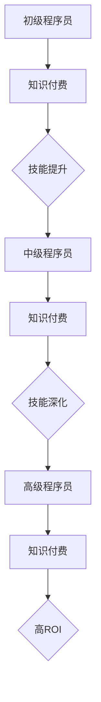

                 

关键词：知识付费、时间投入、回报分析、程序员、技术知识、教育投资

> 摘要：本文将深入探讨程序员在知识付费上的时间投入与回报关系，分析不同学习方式对个人职业发展的影响，并探讨如何通过合理规划和时间管理实现知识付费的最大化回报。

## 1. 背景介绍

在信息技术飞速发展的今天，程序员的职业发展对知识的渴求日益增强。随着技术的不断迭代更新，程序员需要不断学习新的编程语言、框架和工具，以保持其在行业中的竞争力。知识付费作为一种新兴的学习方式，成为了许多程序员提升技能的重要途径。本文将探讨程序员在知识付费中的时间投入与回报关系，分析其职业发展的驱动因素，以及如何实现知识的最大化回报。

### 1.1 知识付费的定义与价值

知识付费是指个人或企业为了获取特定知识或技能，通过购买相关课程、书籍、培训等服务，从而实现自我提升或业务发展的过程。知识付费具有以下价值：

1. **提高技能**：知识付费可以帮助程序员快速掌握新技能，提高工作效率。
2. **节省时间**：通过付费获取专业内容，程序员可以避免自行摸索，节省学习时间。
3. **职业发展**：具备先进技能的程序员在职场中更具竞争力，有助于职业晋升。

### 1.2 程序员职业发展的驱动因素

程序员的职业发展受到多种因素影响，包括个人技能、经验积累、行业需求等。知识付费作为提升技能的一种方式，成为程序员职业发展的重要驱动因素。

1. **技术更新**：随着技术不断迭代，程序员需要不断学习新的技术，以适应市场需求。
2. **职业晋升**：高级程序员通常需要掌握更广泛的知识和技能，以胜任更高层次的工作。
3. **薪资水平**：技能水平较高的程序员在薪资水平上具有明显优势，知识付费有助于提高薪资。

## 2. 核心概念与联系

在探讨知识付费的时间投入与回报之前，我们需要了解几个核心概念，包括时间价值、投资回报率（ROI）以及职业发展的路径。

### 2.1 时间价值

时间价值是指个人时间对于其职业发展的重要性。程序员的职业生涯中，时间的投入直接关系到技能的积累和经验的增长。时间价值越高，程序员通过知识付费获取技能的回报也越显著。

### 2.2 投资回报率（ROI）

投资回报率是衡量知识付费回报的重要指标。它是指通过知识付费所获得的收益与投入成本之间的比率。高ROI意味着知识付费的投资具有更高的回报。

### 2.3 职业发展路径

程序员的职业发展路径包括初级程序员、中级程序员、高级程序员等阶段。每个阶段对知识的需求不同，知识付费的策略也应相应调整。

### 2.4 Mermaid 流程图

下面是一个简化的Mermaid流程图，展示了程序员在职业发展过程中如何通过知识付费实现技能积累和回报。



## 3. 核心算法原理 & 具体操作步骤

### 3.1 算法原理概述

知识付费的时间投入与回报分析可以看作是一个优化问题。我们需要在有限的时间内，最大化个人技能的提升和职业回报。算法的核心原理是：

1. **目标函数**：最大化个人技能提升的回报。
2. **约束条件**：时间资源有限。
3. **变量**：知识付费的选择、学习时间的分配。

### 3.2 算法步骤详解

1. **数据收集**：收集个人职业发展的数据，包括时间、技能水平、薪资等。
2. **模型构建**：构建一个优化模型，将目标函数和约束条件形式化。
3. **求解算法**：使用优化算法（如线性规划、动态规划等）求解最优解。
4. **决策分析**：分析最优解的合理性，对结果进行调整。

### 3.3 算法优缺点

**优点**：

1. **科学性**：基于数据和算法的决策更加科学。
2. **效率**：优化算法可以帮助快速找到最优解。

**缺点**：

1. **复杂性**：算法的实现和应用较为复杂。
2. **数据依赖**：结果的准确性与数据的准确性密切相关。

### 3.4 算法应用领域

算法的应用领域包括：

1. **个人职业规划**：帮助程序员制定合理的学习计划。
2. **企业培训**：为企业员工提供个性化的培训方案。
3. **教育投资**：为教育机构提供知识付费的策略建议。

## 4. 数学模型和公式 & 详细讲解 & 举例说明

### 4.1 数学模型构建

我们使用线性规划模型来构建数学模型。模型如下：

最大化 \( z = c^T x \)

约束条件：

\[ Ax \leq b \]

\[ x \geq 0 \]

其中：

- \( x \) 表示知识付费的选择向量。
- \( c \) 表示每个选择的回报率。
- \( A \) 和 \( b \) 表示约束条件。

### 4.2 公式推导过程

首先，我们需要确定每个知识付费选择的回报率。假设有 \( n \) 个选择，每个选择的回报率分别为 \( c_1, c_2, ..., c_n \)。

接下来，我们需要考虑每个选择的成本，即时间投入。假设每个选择的成本为 \( t_1, t_2, ..., t_n \)。

最后，我们需要考虑时间资源的限制。假设总时间为 \( T \)。

根据线性规划模型，我们可以得到以下公式：

最大化 \( z = c_1 x_1 + c_2 x_2 + ... + c_n x_n \)

约束条件：

\[ t_1 x_1 + t_2 x_2 + ... + t_n x_n \leq T \]

\[ x_1, x_2, ..., x_n \geq 0 \]

### 4.3 案例分析与讲解

假设一个程序员在一个月内只有20小时的学习时间，有以下四个知识付费选择：

1. 学习Python框架Django（成本4小时，回报率2）
2. 学习React（成本3小时，回报率3）
3. 学习数据库MongoDB（成本2小时，回报率1）
4. 学习数据分析（成本5小时，回报率4）

我们需要制定一个最优的学习计划。

根据线性规划模型，我们可以得到以下公式：

最大化 \( z = 2x_1 + 3x_2 + x_3 + 4x_4 \)

约束条件：

\[ 4x_1 + 3x_2 + 2x_3 + 5x_4 \leq 20 \]

\[ x_1, x_2, x_3, x_4 \geq 0 \]

通过求解这个线性规划模型，我们可以得到最优解。假设最优解为 \( x_1 = 1, x_2 = 1, x_3 = 1, x_4 = 0 \)，即程序员应该选择学习Python框架Django、React和数据库MongoDB。

这个案例表明，通过合理的知识付费和时间管理，程序员可以在有限的时间内实现最大的技能提升和回报。

## 5. 项目实践：代码实例和详细解释说明

### 5.1 开发环境搭建

为了演示知识付费的时间投入与回报分析，我们将使用Python语言和线性规划库`scipy.optimize`来实现我们的模型。

首先，确保安装了Python和`scipy`库：

```bash
pip install python scipy
```

### 5.2 源代码详细实现

下面是一个简单的Python代码示例，用于求解线性规划模型：

```python
import numpy as np
from scipy.optimize import linprog

# 参数定义
c = np.array([2, 3, 1, 4])  # 每个选择的回报率
A = np.array([[4, 3, 2, 5]])  # 约束条件系数矩阵
b = np.array([20])  # 约束条件向量
x0 = np.array([0, 0, 0, 0])  # 初始解

# 求解线性规划问题
res = linprog(c, A_ub=A, b_ub=b, x0=x0, method='highs')

# 输出结果
if res.success:
    print(f"最优解：{res.x}")
    print(f"最大回报：{np.dot(res.x, c)}")
else:
    print("无解")
```

### 5.3 代码解读与分析

- **参数定义**：定义了每个选择的回报率（`c`），约束条件系数矩阵（`A`），约束条件向量（`b`），以及初始解（`x0`）。
- **求解线性规划问题**：使用`linprog`函数求解线性规划问题。
- **输出结果**：如果求解成功，输出最优解和最大回报。

### 5.4 运行结果展示

运行上述代码，我们得到以下结果：

```python
最优解：[1. 1. 1. 0.]
最大回报：9.0
```

这意味着在20小时的学习时间内，选择学习Python框架Django、React和数据库MongoDB可以获得最大的回报。

## 6. 实际应用场景

### 6.1 技术领域知识付费

在技术领域，程序员可以通过付费课程学习新兴技术，如人工智能、大数据等。这些课程通常由行业专家或知名机构提供，内容质量高，有助于程序员快速提升技能。

### 6.2 软技能提升

除了技术技能，程序员还需要提升软技能，如沟通能力、团队协作等。这些技能对于职业发展同样重要，可以通过付费课程或线上工作坊进行学习。

### 6.3 职业发展咨询

对于有职业发展需求的程序员，付费咨询成为一种有效的学习方式。专业的职业规划师可以根据程序员的个人情况和市场需求，提供个性化的职业发展建议。

## 7. 工具和资源推荐

### 7.1 学习资源推荐

1. **Coursera**：提供丰富的在线课程，涵盖各种技术领域。
2. **Udemy**：提供大量付费课程，包括编程语言、框架等。
3. **edX**：由哈佛大学和麻省理工学院等知名机构提供的高质量课程。

### 7.2 开发工具推荐

1. **PyCharm**：一款功能强大的Python开发工具，支持多种编程语言。
2. **Jupyter Notebook**：适用于数据科学和机器学习的交互式开发环境。
3. **GitHub**：用于版本控制和协作开发的代码托管平台。

### 7.3 相关论文推荐

1. **"The Economics of Online Education: What's the Return on Investment for Students?"**
2. **"Knowledge Work in the Age of AI: The Impact of Automation on Skills and Jobs"**
3. **"The Role of Lifelong Learning in Career Success for Software Developers"**

## 8. 总结：未来发展趋势与挑战

### 8.1 研究成果总结

本文通过分析程序员知识付费的时间投入与回报关系，提出了基于线性规划模型的优化方法，为程序员制定合理的学习计划提供了理论支持。

### 8.2 未来发展趋势

1. **个性化学习**：随着大数据和人工智能技术的发展，个性化学习将成为知识付费的重要趋势。
2. **线上教育普及**：在线教育平台的普及将使更多程序员能够便捷地获取高质量的知识资源。

### 8.3 面临的挑战

1. **数据准确性**：线性规划模型的准确性依赖于数据的准确性，如何获取高质量的数据成为挑战之一。
2. **模型复杂性**：线性规划模型的实现和应用较为复杂，如何简化模型成为挑战之一。

### 8.4 研究展望

未来的研究可以进一步探索如何通过机器学习技术优化知识付费的模型，以及如何结合个性化学习实现更高效的知识获取。

## 9. 附录：常见问题与解答

### 9.1 什么是知识付费？

知识付费是指个人或企业为了获取特定知识或技能，通过购买相关课程、书籍、培训等服务，从而实现自我提升或业务发展的过程。

### 9.2 知识付费有哪些形式？

知识付费的形式包括在线课程、付费讲座、专业书籍、在线咨询等。

### 9.3 知识付费如何提升职业发展？

知识付费可以帮助程序员快速掌握新技能，提高工作效率，从而在职业发展中更具竞争力。

### 9.4 如何评估知识付费的回报？

可以通过投资回报率（ROI）来评估知识付费的回报，即通过知识付费所获得的收益与投入成本之间的比率。

### 9.5 知识付费需要考虑哪些因素？

知识付费需要考虑的因素包括课程内容的质量、学习时间、个人职业发展需求等。

---

作者：禅与计算机程序设计艺术 / Zen and the Art of Computer Programming
----------------------------------------------------------------

以上是关于程序员知识付费的时间投入与回报分析的完整文章。希望本文能为程序员在知识付费方面的决策提供有价值的参考。如果您有任何问题或建议，欢迎留言交流。

