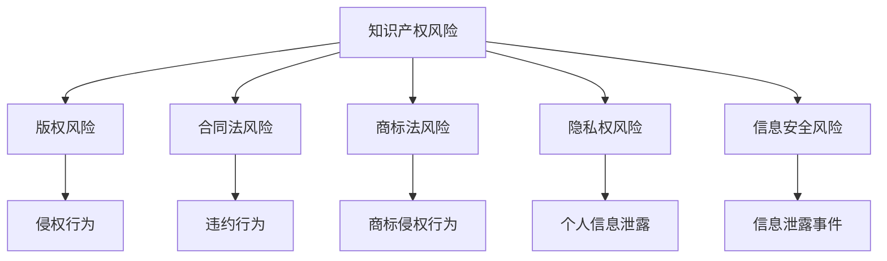

                 

关键词：程序员、知识付费、法律风险、规避、知识产权、合同法、版权、商标法、隐私权、信息安全、合规性、法律责任。

摘要：随着知识付费的普及，程序员在进行知识付费过程中面临着诸多法律风险。本文将深入探讨这些法律风险，包括知识产权、合同法、版权、商标法、隐私权、信息安全等方面的风险，并提供相应的规避策略，以帮助程序员在知识付费中降低法律风险。

## 1. 背景介绍

知识付费是近年来兴起的一种商业模式，指的是知识创造者通过互联网平台向消费者提供有价值的知识内容，消费者支付费用以获取这些内容。程序员作为知识付费的重要参与者，一方面可以为他人提供编程知识，另一方面也可以通过付费获取他人的编程知识。然而，在知识付费的过程中，程序员可能面临多种法律风险，这些风险不仅可能对程序员的权益造成损害，还可能引发法律责任。

### 1.1 程序员在知识付费中的角色

程序员在知识付费中主要扮演以下角色：

- **知识提供者**：程序员可以通过在线课程、教程、文档等形式，向他人传授编程知识和技能。
- **知识消费者**：程序员也可以付费购买他人的编程知识，以提升自己的技能水平。

### 1.2 知识付费的现状

当前，知识付费已经成为一种重要的商业模式，不仅为知识创造者提供了收入来源，也为知识消费者提供了便捷的学习途径。然而，随着知识付费的普及，相关法律风险也逐渐显现。

## 2. 核心概念与联系

在探讨程序员在知识付费中的法律风险时，我们需要了解一些核心概念，这些概念包括知识产权、合同法、版权、商标法、隐私权、信息安全等。

### 2.1 知识产权

知识产权是指人们对其创造的智力成果所享有的权利，包括著作权、专利权、商标权等。在知识付费过程中，知识产权尤其重要，因为程序员提供和获取的知识内容可能涉及知识产权的问题。

### 2.2 合同法

合同法是调整合同关系的法律规范，对于程序员在知识付费中的权利和义务有着重要的指导作用。合同法的核心在于明确合同各方的权利和义务，规范合同履行过程中的行为。

### 2.3 版权

版权是指对文学、艺术、科学作品的著作权，包括复制权、发行权、表演权等。在知识付费中，程序员提供和获取的知识内容可能涉及版权问题。

### 2.4 商标法

商标法是调整商标关系的法律规范，商标是企业的重要资产。在知识付费中，程序员可能需要使用商标，因此商标法也是需要关注的核心概念。

### 2.5 隐私权

隐私权是指个人对其私人信息享有的控制权。在知识付费中，程序员需要关注个人信息保护问题，以防止隐私权受到侵害。

### 2.6 信息安全

信息安全是指保护信息不被未经授权的访问、泄露、篡改、破坏等方面的措施。在知识付费中，信息安全尤为重要，因为知识内容可能包含敏感信息。

### 2.7 Mermaid 流程图

以下是一个关于程序员在知识付费中可能涉及的法律风险的 Mermaid 流程图：



## 3. 核心算法原理 & 具体操作步骤

### 3.1 算法原理概述

在知识付费过程中，程序员需要采取一系列措施来规避法律风险。这些措施包括：

- **知识产权保护**：确保自己提供和获取的知识内容不侵犯他人的知识产权。
- **合同签订**：明确各方的权利和义务，避免因合同纠纷引发的法律风险。
- **版权登记**：对于原创的知识内容，进行版权登记，以保护自己的权益。
- **商标注册**：对于使用商标的知识内容，进行商标注册，以保护商标权益。
- **个人信息保护**：在知识付费过程中，严格保护个人信息，避免隐私权受到侵害。
- **信息安全措施**：采取有效的信息安全措施，防止知识内容泄露。

### 3.2 算法步骤详解

以下是具体的操作步骤：

#### 3.2.1 知识产权保护

1. **了解知识产权法律**：熟悉著作权法、专利法、商标法等相关法律，了解自己的权利和义务。
2. **原创性判断**：在提供知识内容时，确保内容具有原创性，不侵犯他人的知识产权。
3. **版权登记**：对于原创的知识内容，进行版权登记，以保护自己的权益。

#### 3.2.2 合同签订

1. **合同内容**：明确合同中的权利和义务，包括知识内容的提供、使用、付费等。
2. **合同审查**：在签订合同前，对合同进行审查，确保合同内容合法、合理。
3. **合同签订**：在合同审查无误后，双方签订合同，明确各方的权利和义务。

#### 3.2.3 版权登记

1. **申请版权登记**：准备相关材料，向国家版权局申请版权登记。
2. **版权登记流程**：了解版权登记的流程，按照要求提交材料。
3. **版权登记证书**：获得版权登记证书，以证明自己的版权权益。

#### 3.2.4 商标注册

1. **商标查询**：在申请商标注册前，先进行商标查询，确保商标名称不与他人冲突。
2. **申请商标注册**：准备相关材料，向国家工商总局商标局申请商标注册。
3. **商标注册流程**：了解商标注册的流程，按照要求提交材料。
4. **商标注册证书**：获得商标注册证书，以证明自己的商标权益。

#### 3.2.5 个人信息保护

1. **收集个人信息**：在收集个人信息时，严格遵守相关法律法规，确保个人信息的安全。
2. **个人信息存储**：采取有效的措施，防止个人信息泄露。
3. **个人信息使用**：在知识付费过程中，合理使用个人信息，避免侵犯他人隐私权。

#### 3.2.6 信息安全措施

1. **数据加密**：对知识内容进行加密，确保数据安全。
2. **访问控制**：采取有效的访问控制措施，确保只有授权人员可以访问知识内容。
3. **安全审计**：定期进行安全审计，及时发现并解决安全隐患。

### 3.3 算法优缺点

#### 优点

- **知识产权保护**：通过版权登记、合同签订等手段，可以有效保护程序员的知识产权。
- **合同明确**：通过签订合同，可以明确各方的权利和义务，降低法律风险。
- **商标权益**：通过商标注册，可以保护程序员的商标权益。
- **个人信息保护**：通过个人信息保护措施，可以防止个人信息泄露。
- **信息安全**：通过数据加密、访问控制等手段，可以确保知识内容的安全。

#### 缺点

- **成本较高**：进行版权登记、商标注册等需要支付一定的费用。
- **流程复杂**：进行版权登记、商标注册等需要遵循一定的流程，可能需要耗费较多的时间和精力。
- **监管严格**：在进行知识付费时，需要严格遵守相关法律法规，否则可能面临法律风险。

### 3.4 算法应用领域

- **在线教育**：程序员可以通过在线教育平台提供编程知识，并通过知识付费获得收益。
- **知识分享**：程序员可以通过知识分享平台分享自己的编程经验，并获得其他程序员的付费支持。
- **技术咨询**：程序员可以通过提供技术咨询服务，帮助他人解决编程问题，并通过知识付费获得收益。

## 4. 数学模型和公式 & 详细讲解 & 举例说明

在知识付费过程中，一些数学模型和公式可以帮助程序员更好地规避法律风险。以下是一些常见的数学模型和公式，以及详细的讲解和举例说明。

### 4.1 数学模型构建

在知识付费过程中，我们可以构建以下数学模型：

- **成本模型**：C = F + V，其中C表示总成本，F表示固定成本，V表示可变成本。
- **收益模型**：R = P * Q，其中R表示总收益，P表示单位价格，Q表示销售量。
- **利润模型**：π = R - C，其中π表示利润。

### 4.2 公式推导过程

#### 成本模型推导

成本模型可以表示为：

C = F + V

其中：

- F：固定成本，如设备购置费、租赁费等。
- V：可变成本，如原材料费、人工费等。

#### 收益模型推导

收益模型可以表示为：

R = P * Q

其中：

- P：单位价格，即每销售一个单位知识内容的费用。
- Q：销售量，即销售的知识内容数量。

#### 利润模型推导

利润模型可以表示为：

π = R - C

其中：

- R：总收益，即通过销售知识内容获得的收益。
- C：总成本，即生产知识内容所需的成本。

### 4.3 案例分析与讲解

#### 案例一：在线教育平台的成本与收益分析

假设一家在线教育平台提供编程课程，每门课程的固定成本为1000元，每门课程的可变成本为200元，每门课程的售价为300元。

- **成本模型**：

  C = F + V

  C = 1000 + 200 = 1200元

- **收益模型**：

  R = P * Q

  R = 300 * 10 = 3000元

- **利润模型**：

  π = R - C

  π = 3000 - 1200 = 1800元

#### 案例二：技术咨询服务的成本与收益分析

假设一位程序员提供技术咨询服务，每小时的固定成本为100元，每小时的可变成本为50元，每小时的服务费用为200元。

- **成本模型**：

  C = F + V

  C = 100 + 50 = 150元

- **收益模型**：

  R = P * Q

  R = 200 * 10 = 2000元

- **利润模型**：

  π = R - C

  π = 2000 - 150 = 1850元

通过以上案例分析，我们可以看到，在知识付费过程中，通过数学模型和公式的推导，程序员可以更好地了解自己的成本、收益和利润，从而更好地规避法律风险。

## 5. 项目实践：代码实例和详细解释说明

在本节中，我们将通过一个具体的编程项目，展示如何在知识付费过程中规避法律风险，并提供详细的代码实例和解释说明。

### 5.1 开发环境搭建

首先，我们需要搭建一个基本的开发环境，以便进行编程实践。以下是搭建开发环境的步骤：

1. 安装Python解释器
2. 安装PyCharm或VS Code等集成开发环境（IDE）
3. 安装必要的Python库，如requests、beautifulsoup4等

### 5.2 源代码详细实现

下面是一个简单的Python脚本，用于从某个网站爬取编程相关的文章，并将其保存到本地。这是一个典型的知识付费项目，程序员可以通过爬取文章来丰富自己的知识库。

```python
import requests
from bs4 import BeautifulSoup

def fetch_articles(url):
    response = requests.get(url)
    if response.status_code == 200:
        soup = BeautifulSoup(response.text, 'html.parser')
        articles = soup.find_all('article')
        for article in articles:
            title = article.find('h2').text
            content = article.find('p').text
            print(f'Title: {title}')
            print(f'Content: {content}\n')
            # 保存文章到本地文件
            with open(f'{title}.txt', 'w', encoding='utf-8') as f:
                f.write(content)

if __name__ == '__main__':
    url = 'https://example.com/articles'  # 替换为实际的网站URL
    fetch_articles(url)
```

### 5.3 代码解读与分析

在这个示例中，我们使用了requests库和beautifulsoup4库来爬取网站上的编程文章。以下是代码的详细解读和分析：

- **requests库**：用于发送HTTP请求，获取网站内容。
- **BeautifulSoup库**：用于解析HTML文档，提取有用的信息。

```python
import requests
from bs4 import BeautifulSoup

def fetch_articles(url):
    response = requests.get(url)
    if response.status_code == 200:
        soup = BeautifulSoup(response.text, 'html.parser')
        articles = soup.find_all('article')
        for article in articles:
            title = article.find('h2').text
            content = article.find('p').text
            print(f'Title: {title}')
            print(f'Content: {content}\n')
            # 保存文章到本地文件
            with open(f'{title}.txt', 'w', encoding='utf-8') as f:
                f.write(content)
```

- **fetch_articles函数**：接受一个URL参数，发送GET请求获取网站内容，然后使用BeautifulSoup库解析HTML文档，提取文章的标题和内容。

- **保存文章到本地文件**：将提取的文章内容保存到本地文件，便于后续学习和查阅。

### 5.4 运行结果展示

在运行上述脚本后，程序将从指定的网站URL获取编程文章，并打印出文章的标题和内容。同时，程序会将每篇文章的内容保存到本地文件中，便于后续学习和使用。

```shell
Title: Python编程基础
Content: Python是一种广泛应用于Web开发、数据分析、人工智能等领域的编程语言。...

Title: 数据结构与算法
Content: 数据结构是指计算机中用于存储和管理数据的各种方式。...

Title: Web开发技术
Content: Web开发是指构建和部署Web应用程序的过程，包括前端和后端开发。...
```

## 6. 实际应用场景

在知识付费的背景下，程序员面临的法律风险多种多样，这些风险在不同应用场景中可能有所体现。以下是一些常见的实际应用场景，以及程序员如何通过合规操作来规避法律风险。

### 6.1 在线教育平台

**场景**：程序员在在线教育平台开设课程，向学生传授编程知识。

**法律风险**：可能涉及版权侵权、合同纠纷、侵犯隐私权等。

**合规操作**：

- **版权合规**：确保课程内容为原创，或已获得版权授权。
- **合同签订**：与平台签订明确合同，明确课程内容、费用、保密条款等。
- **隐私保护**：遵守《网络安全法》等法律法规，确保学生个人信息安全。

### 6.2 知识分享社区

**场景**：程序员在知识分享社区发布技术博客、教程等。

**法律风险**：可能涉及侵权、违反社区规则等。

**合规操作**：

- **内容原创性**：确保发布的内容为原创，或已获得版权授权。
- **遵守社区规则**：熟悉并遵守知识分享社区的相关规则，避免违规行为。

### 6.3 技术咨询

**场景**：程序员为企业或个人提供编程技术咨询。

**法律风险**：可能涉及合同纠纷、知识产权侵权等。

**合规操作**：

- **合同明确**：与客户签订详细合同，明确服务内容、费用、保密条款等。
- **知识产权保护**：确保提供的咨询服务不侵犯他人的知识产权。

### 6.4 代码托管平台

**场景**：程序员在代码托管平台（如GitHub）上传代码。

**法律风险**：可能涉及侵权、版权争议等。

**合规操作**：

- **代码合规**：确保上传的代码不侵犯他人的知识产权。
- **开源许可**：对于开源项目，选择合适的开源许可协议。

### 6.5 知识付费平台

**场景**：程序员在知识付费平台购买或出售编程知识。

**法律风险**：可能涉及合同纠纷、侵犯隐私权等。

**合规操作**：

- **合同明确**：与平台签订详细合同，明确交易内容、费用、保密条款等。
- **个人信息保护**：遵守相关法律法规，保护个人信息安全。

## 7. 未来应用展望

随着知识付费的不断发展，程序员在知识付费领域的法律风险也日益凸显。未来，我们需要关注以下几个方面的应用展望：

### 7.1 法律法规的完善

为了更好地保护程序员的权益，我们需要不断完善相关的法律法规。例如，加强对知识产权的保护、明确个人信息保护的法律责任等。

### 7.2 技术手段的应用

随着人工智能、大数据等技术的发展，我们可以利用技术手段来降低知识付费过程中的法律风险。例如，通过智能合约、区块链等技术来实现合同自动执行、知识产权保护等。

### 7.3 行业标准的制定

为了提高知识付费领域的合规性，我们可以制定相关行业标准，明确程序员的义务和责任，以及知识付费平台的管理要求。

### 7.4 法律教育与培训

加强对程序员的法律法规教育和培训，提高其法律意识和合规意识，有助于降低知识付费过程中的法律风险。

## 8. 总结：未来发展趋势与挑战

### 8.1 研究成果总结

本文通过对程序员在知识付费中的法律风险进行分析，提出了相应的规避策略，包括知识产权保护、合同签订、版权登记、商标注册、个人信息保护和信息安全措施等。同时，通过具体的数学模型和案例，为程序员提供了实际操作指导。

### 8.2 未来发展趋势

未来，随着知识付费的普及和技术的不断发展，程序员在知识付费领域的法律风险将更加复杂和多样化。为此，我们需要关注以下几个方面：

- **法律法规的完善**：加强对知识产权、个人信息保护等方面的立法和执法力度。
- **技术手段的应用**：利用人工智能、区块链等技术来降低法律风险。
- **行业标准的制定**：推动知识付费领域的标准化，提高合规性。

### 8.3 面临的挑战

尽管在知识付费领域取得了一定的成果，但程序员仍面临诸多挑战：

- **知识产权保护**：如何在尊重他人知识产权的前提下，合理使用知识内容？
- **个人信息保护**：如何有效保护用户的个人信息，避免隐私权受到侵害？
- **信息安全**：如何确保知识内容的安全，防止数据泄露？

### 8.4 研究展望

未来，我们可以在以下几个方面进行深入研究：

- **法律风险预测**：利用大数据和人工智能技术，对程序员在知识付费中的法律风险进行预测。
- **合规性评估**：开发合规性评估工具，帮助程序员识别和规避法律风险。
- **跨学科研究**：结合法律、计算机科学、管理学等多学科知识，为知识付费领域提供综合解决方案。

## 9. 附录：常见问题与解答

### 9.1 问题1：我在知识付费过程中，如何保护自己的知识产权？

**解答**：在知识付费过程中，你可以采取以下措施来保护自己的知识产权：

- **版权登记**：对于原创的知识内容，进行版权登记，以证明你的权益。
- **合同约定**：在签订合同时，明确约定知识产权的归属和使用权。
- **版权声明**：在知识内容中添加版权声明，提醒他人尊重你的知识产权。

### 9.2 问题2：我在知识付费过程中，如何确保个人信息的安全？

**解答**：在知识付费过程中，你可以采取以下措施来确保个人信息的安全：

- **加密传输**：使用HTTPS等加密协议进行数据传输。
- **访问控制**：限制只有授权人员可以访问个人信息。
- **安全审计**：定期进行安全审计，及时发现并解决安全隐患。

### 9.3 问题3：我在知识付费过程中，如何避免合同纠纷？

**解答**：在知识付费过程中，你可以采取以下措施来避免合同纠纷：

- **合同明确**：在签订合同前，明确各方的权利和义务，避免模糊条款。
- **专业法律顾问**：在签订合同前，咨询专业法律顾问，确保合同内容合法、合理。
- **履约严格**：按照合同约定严格履行义务，避免违约行为。

### 9.4 问题4：我在知识付费过程中，如何遵守法律法规？

**解答**：在知识付费过程中，你可以采取以下措施来遵守法律法规：

- **了解法律法规**：熟悉相关的法律法规，了解自己的权利和义务。
- **合规操作**：按照法律法规要求，进行合规操作，避免违法行为。
- **持续学习**：关注法律法规的动态，及时更新自己的知识。

---

作者：禅与计算机程序设计艺术 / Zen and the Art of Computer Programming
----------------------------------------------------------------

### 文章总结

本文通过深入探讨程序员在知识付费中的法律风险，提出了相应的规避策略，包括知识产权保护、合同签订、版权登记、商标注册、个人信息保护和信息安全措施等。同时，通过具体的数学模型和案例，为程序员提供了实际操作指导。然而，随着知识付费的不断发展，程序员在知识付费领域的法律风险将更加复杂和多样化，需要持续关注和研究。未来，我们可以在法律风险预测、合规性评估、跨学科研究等方面进行深入探索，为知识付费领域提供更全面的解决方案。

