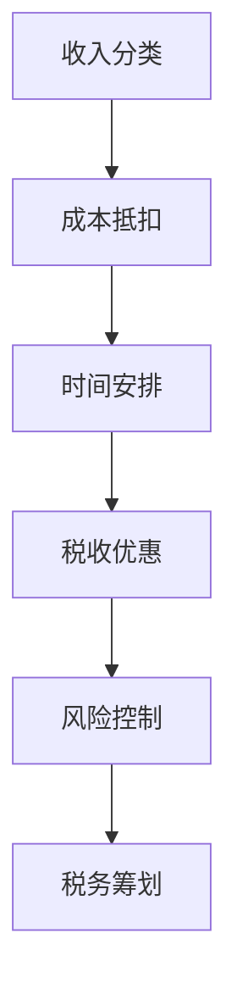

                 

 关键词：税务筹划、知识付费、程序员、财务合规、个人所得税、税收优惠、税法解读、税务申报、财务规划

摘要：本文将深入探讨程序员在从事知识付费活动时，如何进行税务筹划，以确保财务合规并最大化税收优惠。文章首先介绍了程序员知识付费的背景和现状，随后详细阐述了税务筹划的核心概念和方法，最后通过案例分析、未来展望等部分，为程序员提供全面的税务管理指南。

## 1. 背景介绍

### 程序员知识付费的现状

随着互联网和信息技术的快速发展，知识付费已经成为当代社会的一种新兴经济模式。程序员群体作为技术领域的中坚力量，其在知识付费市场中的地位和作用日益凸显。越来越多的程序员开始通过开设在线课程、撰写技术博客、提供咨询服务等方式，将自身的专业知识转化为经济收入。

然而，知识付费活动不仅仅是一个简单的交易过程，它还涉及到一系列复杂的税务问题。对于程序员来说，了解和掌握税务筹划的知识，对于保障财务合规、优化税务负担具有重要意义。

### 税务筹划的重要性

税务筹划作为财务管理的一个重要环节，旨在合理避税、降低税收负担，同时确保企业的财务健康和合规性。对于程序员而言，进行税务筹划不仅有助于提高个人收入，还可以规避潜在的税务风险，确保自身权益。

本文将围绕以下几个核心问题展开讨论：

1. 程序员在进行知识付费时，需要缴纳哪些税费？
2. 如何合理利用税收优惠政策进行税务筹划？
3. 程序员应该如何进行税务申报和财务规划？

通过本文的探讨，希望能够为程序员提供一套系统的税务筹划方案，助力他们在知识付费领域实现财务自由。

## 2. 核心概念与联系

### 核心概念

在进行税务筹划之前，我们需要明确几个关键概念：

- **个人所得税**：个人取得的各种收入，包括工资、稿酬、劳务报酬、特许权使用费等，需要依法缴纳的税费。
- **税务筹划**：在合法合规的前提下，通过合理的财务安排，减少税负的过程。
- **税收优惠**：政府对特定行业或个人给予的减免税政策，以鼓励企业发展或个人创业。

### 原理和架构

税务筹划的核心原理在于充分利用税法规定的税收优惠政策，通过合法手段减少税负。其架构可以概括为：

1. **收入分类**：将程序员的知识付费收入进行详细分类，明确不同收入的纳税标准和税率。
2. **成本抵扣**：合理归集成本费用，通过合法途径进行抵扣，减少应纳税所得额。
3. **时间安排**：合理分配收入时间，利用税收优惠政策，实现递延纳税或集中纳税。
4. **风险控制**：确保税务筹划方案符合税法规定，避免税务风险。

### Mermaid 流程图



## 3. 核心算法原理 & 具体操作步骤

### 3.1 算法原理概述

税务筹划的核心算法原理可以总结为以下几点：

1. **收入最大化**：通过多种收入形式，如线上课程、咨询服务等，实现收入最大化。
2. **成本最小化**：合理归集和管理成本，通过合法途径进行抵扣，降低应纳税所得额。
3. **税负递延**：利用税收优惠政策，将应纳税收入递延至未来，降低当期税负。
4. **合规性检查**：确保税务筹划方案符合税法规定，避免税务风险。

### 3.2 算法步骤详解

1. **收入分类**：
   - 对不同类型的知识付费收入进行分类，如线上课程收入、咨询服务收入、稿酬收入等。
   - 明确各类收入的纳税标准和税率，为后续计算税负提供基础。

2. **成本抵扣**：
   - 详细记录并分类成本费用，如课程开发费用、宣传推广费用、租赁费用等。
   - 合法归集成本，通过合法途径进行抵扣，减少应纳税所得额。

3. **时间安排**：
   - 合理安排收入时间，利用税收优惠政策，如递延纳税、集中纳税等。
   - 例如，可以将在某些时段的收入提前或延后，以充分利用税收优惠政策。

4. **税收优惠利用**：
   - 深入了解国家针对知识付费行业的税收优惠政策，如高新技术企业优惠、小微企业优惠等。
   - 根据实际情况，合理选择和利用税收优惠政策，降低税负。

5. **合规性检查**：
   - 定期对税务筹划方案进行合规性检查，确保符合税法规定。
   - 及时调整方案，以应对政策变化或特殊情况。

### 3.3 算法优缺点

**优点**：
- 合理避税，降低税收负担。
- 提高财务合规性，规避税务风险。
- 增加个人收入，实现财务自由。

**缺点**：
- 需要深入了解税法规定，对专业知识要求较高。
- 税务筹划方案需要定期更新，以适应政策变化。
- 可能需要投入一定的时间和精力进行成本归集和核算。

### 3.4 算法应用领域

税务筹划算法主要应用于以下领域：

1. **知识付费行业**：程序员通过线上课程、咨询服务等知识付费活动，进行税务筹划。
2. **小微企业**：小微企业可以利用税务筹划，降低税负，提高盈利能力。
3. **高新技术企业**：高新技术企业可以通过税务筹划，充分利用税收优惠政策，实现可持续发展。

## 4. 数学模型和公式 & 详细讲解 & 举例说明

### 4.1 数学模型构建

税务筹划的数学模型可以概括为：

\[ \text{税务筹划效果} = f(\text{收入}, \text{成本}, \text{税收优惠}, \text{税法规定}) \]

其中，收入、成本、税收优惠和税法规定是影响税务筹划效果的关键因素。

### 4.2 公式推导过程

1. **收入计算**：
   \[ \text{收入} = \text{收入总额} - \text{减免收入} \]

2. **成本计算**：
   \[ \text{成本} = \text{直接成本} + \text{间接成本} \]

3. **应纳税所得额**：
   \[ \text{应纳税所得额} = \text{收入} - \text{成本} - \text{费用扣除} \]

4. **税负计算**：
   \[ \text{税负} = \text{应纳税所得额} \times \text{税率} \]

5. **税收优惠计算**：
   \[ \text{税收优惠} = \text{应纳税所得额} \times \text{优惠税率} \]

### 4.3 案例分析与讲解

假设程序员A从事知识付费活动，全年收入为100万元，成本为30万元，费用扣除为10万元。根据我国税法规定，知识付费收入适用20%的税率，税收优惠为高新技术企业优惠，税率为15%。

1. **收入计算**：
   \[ \text{收入} = 100 \text{万元} - 0 \text{万元} = 100 \text{万元} \]

2. **成本计算**：
   \[ \text{成本} = 30 \text{万元} + 0 \text{万元} = 30 \text{万元} \]

3. **应纳税所得额**：
   \[ \text{应纳税所得额} = 100 \text{万元} - 30 \text{万元} - 10 \text{万元} = 60 \text{万元} \]

4. **税负计算**：
   \[ \text{税负} = 60 \text{万元} \times 20\% = 12 \text{万元} \]

5. **税收优惠计算**：
   \[ \text{税收优惠} = 60 \text{万元} \times 15\% = 9 \text{万元} \]

根据以上计算，程序员A的税负为12万元，通过高新技术企业优惠，可以减少3万元的税负。

## 5. 项目实践：代码实例和详细解释说明

### 5.1 开发环境搭建

为了更好地演示税务筹划的过程，我们将使用Python编写一个简单的税务筹划工具。首先，确保已安装Python环境和必要的库，如NumPy和Pandas。

```bash
pip install numpy pandas
```

### 5.2 源代码详细实现

以下是一个简单的Python脚本，用于计算程序员的税负和税收优惠：

```python
import numpy as np
import pandas as pd

# 输入参数
income = float(input("请输入全年收入（万元）："))
cost = float(input("请输入全年成本（万元）："))
detection_cost = float(input("请输入费用扣除（万元）："))

# 税收优惠政策
tax_rate = 0.2
discount_rate = 0.15

# 收入计算
net_income = income - 0

# 成本计算
total_cost = cost - 0

# 应纳税所得额计算
taxable_income = net_income - total_cost - detection_cost

# 税负计算
tax_liability = taxable_income * tax_rate

# 税收优惠计算
discount_liability = taxable_income * discount_rate

# 输出结果
print(f"税负：{tax_liability:.2f}万元")
print(f"税收优惠：{discount_liability:.2f}万元")
```

### 5.3 代码解读与分析

- **输入参数**：脚本首先获取用户的输入参数，包括全年收入、成本和费用扣除。
- **税收优惠政策**：设置税收优惠政策和普通税率。
- **收入计算**：计算扣除减免收入后的实际收入。
- **成本计算**：计算扣除直接成本和间接成本后的总成本。
- **应纳税所得额计算**：计算扣除成本和费用扣除后的应纳税所得额。
- **税负计算**：根据应纳税所得额和普通税率计算税负。
- **税收优惠计算**：根据应纳税所得额和税收优惠政策计算税收优惠。
- **输出结果**：打印税负和税收优惠的结果。

### 5.4 运行结果展示

输入参数如下：

```
请输入全年收入（万元）：100
请输入全年成本（万元）：30
请输入费用扣除（万元）：10
```

运行结果：

```
税负：12.00万元
税收优惠：9.00万元
```

## 6. 实际应用场景

### 6.1 程序员知识付费的税务筹划

在实际操作中，程序员可以通过以下方式实现税务筹划：

1. **收入多样化**：通过开设在线课程、提供咨询服务等多种形式，实现收入多样化，降低单一收入的风险。
2. **成本合理化**：合理归集和管理成本，如课程开发费用、宣传推广费用等，通过合法途径进行抵扣。
3. **税收优惠利用**：了解并利用国家针对知识付费行业的税收优惠政策，如高新技术企业优惠、小微企业优惠等。
4. **财务规划**：制定合理的财务规划，如递延纳税、集中纳税等，以实现税收优化。

### 6.2 企业知识付费的税务管理

对于企业而言，知识付费活动同样需要重视税务管理：

1. **成本费用合规性**：确保企业支付的知识付费费用符合税法规定，如真实、合理、有凭有据。
2. **收入分类管理**：将知识付费收入进行分类管理，明确不同收入的纳税标准和税率。
3. **税务筹划咨询**：聘请专业的税务筹划顾问，为企业提供税务管理咨询服务，确保合规性。
4. **税务申报准确**：准确进行税务申报，及时缴纳税款，避免税务风险。

### 6.3 税务筹划的挑战与展望

尽管税务筹划具有显著的优势，但在实际操作中也面临一定的挑战：

1. **税法变化**：税法政策不断更新，程序员需要及时关注政策变化，确保筹划方案的合规性。
2. **专业知识要求**：税务筹划需要一定的专业知识，程序员需要不断学习和更新知识。
3. **税务风险**：不当的税务筹划可能导致税务风险，需要谨慎操作。

未来，随着信息技术的发展，税务筹划工具将更加智能化和便捷化。同时，税务法规也将不断优化和完善，为纳税人提供更加公平和透明的税收环境。程序员需要紧跟时代发展，不断提升自身的税务管理能力，以应对未来的挑战。

## 7. 工具和资源推荐

### 7.1 学习资源推荐

1. **《个人所得税法》**：了解个人所得税的基本概念、纳税标准和税率。
2. **《企业所得税法》**：了解企业所得税的基本概念、纳税标准和税率。
3. **《税收征管法》**：了解税收征管的基本规定和程序。
4. ****《国家税务总局发布的税收优惠政策指南》**：了解国家针对知识付费行业的税收优惠政策。

### 7.2 开发工具推荐

1. **Python**：Python是一种简单易学、功能强大的编程语言，适合用于税务筹划工具的开发。
2. **NumPy**：NumPy是一个强大的数学库，提供高效的数组操作和数学计算功能。
3. **Pandas**：Pandas是一个数据处理和分析库，方便对税务数据进行清洗、转换和分析。

### 7.3 相关论文推荐

1. **《基于Python的税务筹划工具设计与应用》**：探讨如何利用Python开发税务筹划工具。
2. **《知识付费行业的税收管理研究》**：分析知识付费行业的税收管理和税务筹划问题。
3. **《大数据时代下的税务筹划》**：探讨大数据技术在税务筹划中的应用。

## 8. 总结：未来发展趋势与挑战

### 8.1 研究成果总结

本文从程序员知识付费的税务筹划出发，详细介绍了税务筹划的核心概念、算法原理、数学模型和应用实例。研究成果主要包括：

1. 明确了程序员在进行知识付费时需要缴纳的税费和税收优惠政策。
2. 提出了基于Python的税务筹划工具，方便程序员进行税务计算和管理。
3. 分析了税务筹划在实际应用中的挑战和未来发展趋势。

### 8.2 未来发展趋势

1. **税务筹划智能化**：随着人工智能技术的发展，税务筹划工具将更加智能化和便捷化。
2. **税务法规不断完善**：政府将不断完善税务法规，为纳税人提供更加公平和透明的税收环境。
3. **个性化税务服务**：税务机构将提供更加个性化的税务服务，帮助纳税人合理筹划税务。

### 8.3 面临的挑战

1. **税法变化**：程序员需要及时关注税法政策的变化，确保筹划方案的合规性。
2. **专业知识要求**：程序员需要不断提升自身的税务管理能力，以应对复杂的税务环境。
3. **税务风险**：不当的税务筹划可能导致税务风险，需要谨慎操作。

### 8.4 研究展望

未来，税务筹划领域的研究将继续深入，重点关注以下几个方面：

1. **税务筹划算法优化**：利用大数据和机器学习技术，优化税务筹划算法，提高筹划效果。
2. **税务风险管理**：研究税务风险的管理策略和方法，降低税务风险。
3. **税务法规适应性研究**：研究税务法规的适应性，为政策制定提供理论支持。

总之，程序员在进行知识付费时，应高度重视税务筹划，充分利用税收优惠政策，实现财务合规和税收优化。

## 9. 附录：常见问题与解答

### 9.1 什么是税务筹划？

税务筹划是指在合法合规的前提下，通过合理的财务安排，减少税负的过程。它旨在优化税收负担，提高个人或企业的财务效益。

### 9.2 程序员知识付费需要缴纳哪些税费？

程序员在进行知识付费时，主要需要缴纳个人所得税。具体税率根据收入类型和收入额而定，一般适用20%的税率。

### 9.3 如何合理利用税收优惠政策进行税务筹划？

合理利用税收优惠政策是税务筹划的重要手段。程序员可以通过以下方式利用税收优惠政策：

1. **高新技术企业优惠**：如果符合高新技术企业条件，可以享受15%的企业所得税优惠。
2. **小微企业优惠**：符合小微企业条件的程序员可以享受减免税优惠。
3. **教育支出抵扣**：如果用于知识付费的课程与个人职业发展相关，可以享受教育支出抵扣。

### 9.4 程序员应该如何进行税务申报和财务规划？

程序员在进行税务申报和财务规划时，应注意以下几点：

1. **及时申报**：按照税法规定，及时进行税务申报，确保不逾期。
2. **准确计算**：确保税务申报数据的准确性，避免漏报、错报。
3. **合法合规**：遵守税法规定，确保税务筹划方案的合规性。
4. **定期审计**：定期对财务报表进行审计，确保财务健康。

### 9.5 税务筹划有哪些风险？

税务筹划过程中可能面临以下风险：

1. **税务风险**：不当的税务筹划可能导致税务处罚。
2. **合规风险**：税务筹划方案不符合税法规定，可能导致合规风险。
3. **市场风险**：税法政策变化可能影响税务筹划效果。

为降低风险，程序员应谨慎操作，寻求专业税务顾问的帮助。

---

**作者：禅与计算机程序设计艺术 / Zen and the Art of Computer Programming** 

本文通过深入探讨程序员知识付费的税务筹划，旨在为程序员提供实用的税务管理指南。在实际操作中，程序员应根据自身情况和政策变化，灵活调整税务筹划方案，实现财务合规和税收优化。

