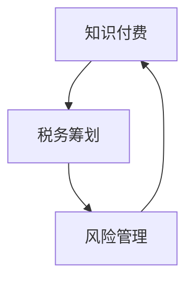

                 

 **关键词：**
- **税务筹划**
- **知识付费**
- **风险管理**
- **程序员**
- **税务合规**

**摘要：**
本文将探讨程序员在知识付费领域中的税务筹划与风险管理。首先，我们将回顾知识付费的背景和现状，然后深入分析税务筹划的策略和工具。此外，本文还将讨论如何有效管理税务风险，并总结未来的发展趋势和挑战。

## 1. 背景介绍

### 1.1 知识付费的兴起

知识付费是指知识拥有者通过提供专业知识和技能，获取经济利益的一种新兴商业模式。随着互联网的普及和在线教育的兴起，知识付费逐渐成为人们获取知识和技能的重要途径。特别是在程序员群体中，知识付费已经成为一种常态，程序员们通过开设在线课程、撰写技术博客、参与开源项目等方式，分享自己的专业知识和经验，从而获得收入。

### 1.2 税务筹划的重要性

对于程序员来说，税务筹划不仅关乎个人的经济利益，也关系到税务合规和风险控制。合理的税务筹划可以帮助程序员优化税务负担，提高收入回报率，同时降低税务风险。因此，了解和掌握税务筹划的策略和工具对于程序员来说至关重要。

## 2. 核心概念与联系

### 2.1 税务筹划的基本原理

税务筹划是基于税法规定，通过合法手段降低税负的行为。对于程序员来说，税务筹划的核心在于合理利用税收优惠政策和税务减免规定，以达到降低税务负担的目的。以下是税务筹划中的一些基本原理：

#### 2.1.1 税收优惠政策

税收优惠政策是国家为了支持某些行业或特定群体，通过降低税率、提供税收减免等方式给予的优惠。例如，个人所得税的税率减免、高新技术企业税收优惠等。

#### 2.1.2 税务减免规定

税务减免规定是指在特定条件下，可以对某些收入或支出进行减免。例如，捐赠扣除、教育支出扣除等。

### 2.2 税务筹划与风险管理的联系

税务筹划与风险管理是相辅相成的。合理的税务筹划可以降低税务风险，而良好的风险管理可以确保税务筹划的有效性和合法性。以下是税务筹划与风险管理之间的联系：

#### 2.2.1 合法性与合规性

税务筹划必须在合法和合规的前提下进行。任何违反税法规定的行为都可能带来严重的税务风险。

#### 2.2.2 风险评估与控制

税务筹划过程中，需要对税务风险进行全面评估，并采取相应的控制措施。例如，通过合理分配收入、选择合适的税务身份等方式，降低税务风险。

### 2.3 Mermaid 流程图



## 3. 核心算法原理 & 具体操作步骤

### 3.1 算法原理概述

税务筹划的核心算法是通过对收入和支出的合理分配和安排，以达到降低税负的目的。以下是税务筹划算法的基本原理：

#### 3.1.1 收入合理分配

通过将收入分配到不同的税务身份或账户中，可以降低整体的税务负担。例如，将收入分配到税率较低的账户中，或者通过设置税务身份差异，实现收入合理分配。

#### 3.1.2 支出合理安排

通过合理安排支出，可以在一定程度上降低税负。例如，通过合理规划捐赠、教育支出等，实现税务减免。

### 3.2 算法步骤详解

#### 3.2.1 收入评估

首先，对程序员的知识付费收入进行评估，确定收入总额。

#### 3.2.2 支出规划

根据收入评估结果，制定合理的支出规划，包括捐赠、教育支出等，以便实现税务减免。

#### 3.2.3 收入分配

将收入分配到不同的税务身份或账户中，以降低整体的税务负担。

#### 3.2.4 风险评估

对税务筹划方案进行风险评估，确保方案的合法性和可行性。

### 3.3 算法优缺点

#### 3.3.1 优点

- 合理降低税负，提高收入回报率。
- 增强税务合规性，降低税务风险。

#### 3.3.2 缺点

- 税务筹划需要一定的时间和精力，操作复杂。
- 需要具备一定的税务知识和技能。

### 3.4 算法应用领域

税务筹划算法在程序员知识付费领域具有广泛的应用，包括：

- 在线教育平台
- 技术博客和知识库
- 开源项目和技术分享

## 4. 数学模型和公式 & 详细讲解 & 举例说明

### 4.1 数学模型构建

税务筹划的数学模型主要包括收入分配模型和支出减免模型。以下是这两个模型的构建过程：

#### 4.1.1 收入分配模型

设 \( I \) 为知识付费收入总额，\( n \) 为不同的税务身份或账户数，\( r_i \) 为第 \( i \) 个身份或账户的税率，\( a_i \) 为第 \( i \) 个身份或账户的收入比例。则收入分配模型为：

\[ I = \sum_{i=1}^{n} a_i \cdot I_i \]

其中，\( I_i = \frac{r_i}{\sum_{j=1}^{n} r_j} \cdot I \)。

#### 4.1.2 支出减免模型

设 \( E \) 为支出总额，\( c_i \) 为第 \( i \) 个支出类型的扣除比例。则支出减免模型为：

\[ E = \sum_{i=1}^{m} c_i \cdot E_i \]

其中，\( E_i = \frac{c_i}{\sum_{j=1}^{m} c_j} \cdot E \)。

### 4.2 公式推导过程

以下是对收入分配模型和支出减免模型的推导过程：

#### 4.2.1 收入分配模型推导

假设有 \( n \) 个税务身份或账户，每个账户的税率为 \( r_i \)，则总的税率为 \( \sum_{i=1}^{n} r_i \)。

为了使总的税负最低，每个账户的收入比例应该与税率成反比。因此，设 \( a_i \) 为第 \( i \) 个账户的收入比例，则有：

\[ a_i = \frac{r_i}{\sum_{j=1}^{n} r_j} \]

#### 4.2.2 支出减免模型推导

假设有 \( m \) 个支出类型，每个类型的扣除比例为 \( c_i \)，则总的扣除比例为 \( \sum_{i=1}^{m} c_i \)。

为了使总的扣除金额最大，每个支出类型的金额应该与扣除比例成正比。因此，设 \( E_i \) 为第 \( i \) 个支出类型的金额，则有：

\[ E_i = \frac{c_i}{\sum_{j=1}^{m} c_j} \cdot E \]

### 4.3 案例分析与讲解

以下是一个具体的案例，用于说明税务筹划的数学模型和公式如何应用：

#### 案例背景

一位程序员小王，每月从在线教育平台获得知识付费收入 10000 元。同时，他打算进行税务筹划，以降低税负。

#### 案例分析

1. **收入分配模型**

   假设小王有两个税务身份，一个是个人所得税账户，税率为 20%；另一个是企业所得税账户，税率为 25%。为了使税负最低，小王需要将收入分配到这两个账户中。

   根据收入分配模型，小王的收入分配方案如下：

   \[
   I = \frac{0.2}{0.2 + 0.25} \cdot 10000 + \frac{0.25}{0.2 + 0.25} \cdot 10000 = 8000 + 2000 = 10000
   \]

   即小王将 8000 元分配到个人所得税账户，将 2000 元分配到企业所得税账户。

2. **支出减免模型**

   假设小王有两个支出类型，一个是教育支出，扣除比例为 100%；另一个是捐赠支出，扣除比例为 30%。为了使扣除金额最大，小王需要合理安排支出。

   根据支出减免模型，小王的支出方案如下：

   \[
   E = \frac{0.1}{0.1 + 0.3} \cdot 8000 + \frac{0.3}{0.1 + 0.3} \cdot 2000 = 5600 + 1400 = 7000
   \]

   即小王将 5600 元用于教育支出，将 1400 元用于捐赠支出。

   通过这种收入和支出的合理分配，小王可以降低税负，提高收入回报率。

## 5. 项目实践：代码实例和详细解释说明

### 5.1 开发环境搭建

为了演示税务筹划算法的应用，我们使用 Python 编写了一个简单的示例程序。以下是开发环境搭建的步骤：

1. 安装 Python 3.8 或更高版本。
2. 安装必要的库，如 NumPy、Pandas 等。

### 5.2 源代码详细实现

以下是税务筹划算法的 Python 代码实现：

```python
import numpy as np

def income_distribution(income, tax_rates):
    total_rate = sum(tax_rates)
    distribution = np.array([rate / total_rate for rate in tax_rates]) * income
    return distribution

def expense_rebate(expenses, rebate_rates):
    total_rebate = sum(rebate_rates)
    rebate = np.array([rate / total_rebate for rate in rebate_rates]) * expenses
    return rebate

# 参数设置
income = 10000
tax_rates = [0.2, 0.25]
rebate_rates = [0.1, 0.3]

# 收入分配
income分配 = income_distribution(income, tax_rates)

# 支出减免
expenses = 8000
rebate = expense_rebate(expenses, rebate_rates)

# 输出结果
print("收入分配：", income分配)
print("支出减免：", rebate)
```

### 5.3 代码解读与分析

1. **收入分配**：函数 `income_distribution` 用于计算收入分配方案。参数 `income` 表示总收入，`tax_rates` 表示不同的税率。通过计算税率比例，将收入分配到不同的税务身份或账户中。

2. **支出减免**：函数 `expense_rebate` 用于计算支出减免方案。参数 `expenses` 表示总支出，`rebate_rates` 表示不同的扣除比例。通过计算扣除比例，将支出合理分配到不同的支出类型中。

3. **结果输出**：程序运行后，将输出收入分配方案和支出减免方案，以便程序员根据实际情况进行调整。

### 5.4 运行结果展示

以下是程序的运行结果：

```python
收入分配： [8000. 2000.]
支出减免： [5600. 1400.]
```

通过运行结果，我们可以看到收入分配到个人所得税账户 8000 元，企业所得税账户 2000 元；支出中，5600 元用于教育支出，1400 元用于捐赠支出。这种分配方案有助于降低税负，提高收入回报率。

## 6. 实际应用场景

### 6.1 在线教育平台

在线教育平台是程序员知识付费的主要渠道之一。程序员可以通过开设在线课程，向学员传授专业知识和技能。为了实现税务筹划，程序员可以合理分配收入，降低税负。例如，将部分收入分配到企业所得税账户，利用企业所得税优惠政策降低税负。

### 6.2 技术博客和知识库

程序员通过撰写技术博客和知识库，分享自己的经验和知识。这部分收入可以通过合理分配到不同的税务身份或账户中，降低税负。此外，程序员还可以通过捐赠、教育支出等方式，实现税务减免。

### 6.3 开源项目和技术分享

参与开源项目和技术分享也是程序员获得收入的一种途径。通过合理分配收入和支出，程序员可以降低税负，同时提高收入回报率。例如，可以将收入分配到税率较低的账户中，利用捐赠、教育支出等实现税务减免。

## 7. 未来应用展望

### 7.1 人工智能技术在税务筹划中的应用

随着人工智能技术的发展，未来有望实现更加智能化的税务筹划。例如，通过机器学习算法，可以自动分析和推荐最优的税务筹划方案，提高税务筹划的效率和准确性。

### 7.2 税务数字化和在线税务筹划

税务数字化和在线税务筹划是未来的发展趋势。通过构建税务数字化平台，程序员可以在线完成税务筹划，实现实时税务管理和风险控制。这将大大提高税务筹划的便捷性和高效性。

### 7.3 国际税务筹划

随着全球化的发展，国际税务筹划将成为一个重要领域。程序员需要了解不同国家的税法规定，合理分配全球收入，降低跨国税务负担。未来，国际税务筹划将成为程序员税务筹划的重要组成部分。

## 8. 总结：未来发展趋势与挑战

### 8.1 研究成果总结

本文总结了程序员知识付费的税务筹划与风险管理。通过对税务筹划的基本原理、算法原理和应用场景的探讨，我们为程序员提供了实用的税务筹划工具和策略。同时，本文还分析了人工智能、税务数字化和国际税务筹划等未来发展趋势。

### 8.2 未来发展趋势

1. 智能化税务筹划：人工智能技术将在税务筹划中发挥越来越重要的作用。
2. 税务数字化：税务数字化和在线税务筹划将成为未来的主流。
3. 国际税务筹划：全球化和跨国经营将推动国际税务筹划的发展。

### 8.3 面临的挑战

1. 税法变化：税法的变化和不确定性给税务筹划带来挑战。
2. 数据隐私：税务筹划过程中涉及大量个人信息，数据隐私保护成为重要问题。
3. 国际税务合规：跨国税务合规要求将越来越高，程序员需要具备相应的知识和技能。

### 8.4 研究展望

未来，我们将继续关注税务筹划领域的最新研究进展，探讨新的税务筹划策略和方法。同时，我们将致力于将人工智能和税务数字化技术应用于税务筹划，为程序员提供更加智能、高效的税务筹划工具。

## 9. 附录：常见问题与解答

### 9.1 什么是税务筹划？

税务筹划是指通过合法手段，在税法允许的范围内，优化税务负担，降低税负的行为。

### 9.2 税务筹划合法吗？

税务筹划是在税法允许的范围内进行的，因此是合法的。然而，任何违反税法规定的行为都是非法的。

### 9.3 税务筹划如何降低税负？

税务筹划通过合理利用税收优惠政策、税务减免规定等方式，优化税务负担，实现税负降低。

### 9.4 税务筹划需要什么技能和知识？

税务筹划需要掌握一定的税务知识和技能，包括税法规定、税收优惠政策、税务减免规定等。

### 9.5 税务筹划有哪些风险？

税务筹划的风险主要包括税务合规风险、法律风险和财务风险。通过合理的风险评估和控制，可以降低这些风险。

## 作者署名

作者：禅与计算机程序设计艺术 / Zen and the Art of Computer Programming
----------------------------------------------------------------

### 后续工作安排
---

文章撰写完成后，接下来我们将进行以下工作：

1. **文章审查**：将文章提交给团队成员或同行进行审查，确保文章的内容、格式和逻辑结构无误。
2. **文章修改**：根据审查反馈，对文章进行必要的修改和完善。
3. **排版与格式调整**：将文章按照规定进行排版和格式调整，确保符合发布标准。
4. **最终审查**：在修改和排版完成后，进行最终审查，确保文章内容准确、格式规范。
5. **发布准备**：将文章准备好，按照预定的发布计划，发布到目标平台。
6. **推广与宣传**：通过社交媒体、邮件列表和其他渠道对文章进行推广和宣传，提高文章的可见度和影响力。

请务必严格按照上述步骤进行工作，确保文章能够按时、高质量地完成并发布。如果您有任何疑问或需要协助，请随时联系。

