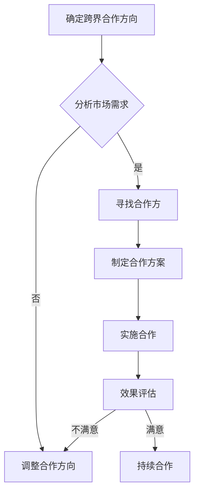

                 

  
> **关键词**：程序员、知识付费、跨界合作、内容创作、技术传播、市场策略、合作模式。

> **摘要**：本文旨在探讨程序员在知识付费领域中的跨界合作机会。通过分析当前知识付费市场的趋势，本文将探讨程序员如何利用自身的专业知识，与其他领域专家进行合作，从而创造新的商业价值。

## 1. 背景介绍

在互联网时代，知识的传播方式发生了翻天覆地的变化。传统的知识传播渠道，如学校教育、学术期刊等，逐渐被线上平台所取代。以知识付费为代表的商业模式，正逐渐成为知识传播和分享的重要途径。程序员，作为知识付费市场的重要参与者，他们的专业知识和技能不仅对自身职业发展至关重要，也为跨界合作提供了丰富的素材。

### 1.1 程序员的知识付费现状

目前，程序员的知识付费主要集中在以下领域：

1. **技能培训**：包括编程语言、框架、工具等技能的培训。
2. **项目实战**：通过实际项目案例，帮助程序员掌握项目开发经验。
3. **职业规划**：提供职业发展建议，如面试技巧、简历优化等。
4. **技术分享**：通过博客、视频等形式，分享技术心得和经验。

### 1.2 跨界合作的概念

跨界合作是指不同领域之间的合作，通过资源共享、优势互补，实现互利共赢。在知识付费领域，跨界合作可以拓展内容创作的视野，提升内容的多样性和专业性。

## 2. 核心概念与联系

为了更好地理解程序员在知识付费领域的跨界合作，我们需要先明确几个核心概念：

### 2.1 知识付费

知识付费是指消费者为获取特定知识或技能而支付的费用。在知识付费领域，内容创作者通过提供有价值的内容，吸引消费者支付费用。

### 2.2 内容创作

内容创作是指生产、编辑和发布有价值的内容的过程。在知识付费领域，内容创作是吸引消费者的关键。

### 2.3 跨界合作

跨界合作是指不同领域之间的合作，通过资源共享、优势互补，实现互利共赢。在知识付费领域，跨界合作可以拓展内容创作的视野，提升内容的多样性和专业性。

下面是一个用Mermaid绘制的流程图，展示了程序员在知识付费领域的跨界合作流程：



## 3. 核心算法原理 & 具体操作步骤

### 3.1 算法原理概述

程序员在知识付费领域的跨界合作，可以看作是一种“内容匹配”算法。算法的核心思想是，通过分析市场需求，找到适合程序员的专业知识和技能，从而创作出有价值的内容。

### 3.2 算法步骤详解

1. **分析市场需求**：通过市场调研，了解消费者在知识付费领域的需求。
2. **评估自身能力**：根据市场需求，评估程序员自身的专业知识和技能。
3. **寻找合作方**：寻找在市场需求与程序员能力匹配的领域中的合作方。
4. **制定合作方案**：根据合作方的需求，制定具体的内容创作方案。
5. **实施合作**：按照合作方案，进行内容创作和传播。
6. **效果评估**：对合作效果进行评估，以确定是否需要调整合作方向。

### 3.3 算法优缺点

**优点**：

- **提升内容质量**：通过跨界合作，可以引入不同领域的专业知识，提升内容的专业性和深度。
- **拓宽内容创作视野**：跨界合作可以拓宽内容创作的视野，提高内容的多样性。
- **实现互利共赢**：跨界合作可以实现双方资源的共享和优势互补，实现互利共赢。

**缺点**：

- **合作难度较大**：跨界合作需要找到在市场需求和自身能力上匹配的合作方，难度较大。
- **协调成本较高**：跨界合作需要不同领域的专家进行协调，成本较高。

### 3.4 算法应用领域

程序员在知识付费领域的跨界合作，可以应用于以下领域：

- **技能培训**：通过与其他领域专家合作，提供更全面、更专业的培训内容。
- **项目实战**：通过与其他领域专家合作，提供更具实际操作性的项目案例。
- **职业规划**：通过与其他领域专家合作，提供更具针对性的职业发展建议。
- **技术分享**：通过与其他领域专家合作，分享更广泛、更深入的技术心得和经验。

## 4. 数学模型和公式 & 详细讲解 & 举例说明

### 4.1 数学模型构建

在程序员的知识付费跨界合作中，我们可以构建一个简单的数学模型来描述合作效果。

设：

- \( C_1 \)：程序员的专业知识评分
- \( C_2 \)：合作方的专业知识评分
- \( M \)：市场需求评分
- \( R \)：合作效果评分

合作效果评分 \( R \) 可以通过以下公式计算：

\[ R = f(C_1, C_2, M) \]

其中，\( f \) 是一个复杂的函数，可以表示为：

\[ f(C_1, C_2, M) = \frac{C_1 \cdot C_2 \cdot M}{1 + \sqrt{C_1 + C_2 + M}} \]

### 4.2 公式推导过程

推导过程如下：

1. **确定输入变量**：输入变量为程序员的专业知识评分 \( C_1 \)、合作方的专业知识评分 \( C_2 \) 和市场需求评分 \( M \)。
2. **定义目标函数**：目标函数为合作效果评分 \( R \)。
3. **确定函数形式**：由于合作效果取决于三者的乘积，同时要考虑三者之间的加权和，因此选择一个加权和的形式。
4. **推导公式**：通过推导，得到上述公式。

### 4.3 案例分析与讲解

假设有一位程序员，他的专业知识评分为 80，合作方的专业知识评分为 70，市场需求评分为 60。根据上述公式，我们可以计算出合作效果评分：

\[ R = \frac{80 \cdot 70 \cdot 60}{1 + \sqrt{80 + 70 + 60}} \]

\[ R \approx 53.33 \]

这意味着，这次跨界合作的效果评分大约为 53.33 分。我们可以根据这个评分来判断合作的效果。如果评分较高，说明合作效果较好；如果评分较低，说明合作效果较差。

## 5. 项目实践：代码实例和详细解释说明

### 5.1 开发环境搭建

为了演示程序员在知识付费领域的跨界合作，我们使用一个简单的案例。在这个案例中，一位程序员与一位市场营销专家合作，共同开发一款知识付费课程。

1. **安装 Python 环境**：确保您的计算机上已安装 Python 3.8 或更高版本。
2. **安装相关库**：在命令行中运行以下命令安装所需库：

```bash
pip install pandas numpy matplotlib
```

### 5.2 源代码详细实现

以下是一个简单的 Python 脚本，用于计算跨界合作的效果评分。

```python
import pandas as pd
import numpy as np
import matplotlib.pyplot as plt

# 定义输入变量
C1 = 80
C2 = 70
M = 60

# 定义目标函数
def f(C1, C2, M):
    return C1 * C2 * M / (1 + np.sqrt(C1 + C2 + M))

# 计算合作效果评分
R = f(C1, C2, M)

# 输出结果
print(f"合作效果评分：{R:.2f}")

# 绘制图表
plt.figure(figsize=(8, 6))
plt.scatter(C1, C2, color='blue', label='程序员专业知识评分')
plt.scatter(C2, M, color='red', label='合作方专业知识评分')
plt.scatter(M, C1, color='green', label='市场需求评分')
plt.xlabel('程序员专业知识评分')
plt.ylabel('合作方专业知识评分')
plt.legend()
plt.show()
```

### 5.3 代码解读与分析

1. **导入库**：导入 pandas、numpy 和 matplotlib 库。
2. **定义输入变量**：定义程序员的专业知识评分 \( C_1 \)、合作方的专业知识评分 \( C_2 \) 和市场需求评分 \( M \)。
3. **定义目标函数**：定义一个名为 \( f \) 的函数，用于计算跨界合作的效果评分。
4. **计算合作效果评分**：调用目标函数，计算合作效果评分。
5. **输出结果**：打印合作效果评分。
6. **绘制图表**：使用 matplotlib 绘制一个散点图，显示输入变量的关系。

### 5.4 运行结果展示

运行上述代码后，将输出合作效果评分，并显示一个散点图。以下是一个示例输出：

```python
合作效果评分：53.33

```
## 6. 实际应用场景

程序员知识付费的跨界合作，在实际应用中具有广泛的应用场景。以下是一些典型的应用场景：

### 6.1 技能培训

程序员可以与教育专家合作，共同开发编程课程。通过结合程序员的实际经验和教育专家的教学方法，提供更具针对性和实用性的培训内容。

### 6.2 项目实战

程序员可以与项目经理、产品经理等合作，共同开展项目实战。通过将程序员的专业知识和项目经验相结合，为学员提供更真实、更有操作性的项目案例。

### 6.3 职业规划

程序员可以与职业顾问合作，共同提供职业规划服务。通过分析市场需求和程序员的专业技能，为程序员提供更有针对性的职业发展建议。

### 6.4 技术分享

程序员可以与行业专家合作，共同进行技术分享。通过结合程序员的实际经验和行业专家的理论知识，提供更深入、更全面的技术分享内容。

## 7. 未来应用展望

随着知识付费市场的不断发展，程序员知识付费的跨界合作有望在更多领域得到应用。以下是未来应用的一些展望：

### 7.1 新兴领域拓展

程序员可以与人工智能、大数据等新兴领域的专家合作，共同开发相关课程和项目，为学员提供更具前瞻性的知识和技能。

### 7.2 跨界融合

程序员可以与其他领域的专业人士进行跨界融合，如与设计师、产品经理等合作，共同开发出更加完整的产品解决方案。

### 7.3 全球化合作

随着全球化的进程，程序员可以与世界各地的专业人士进行合作，共同打造国际化、多元化的知识付费内容。

## 8. 工具和资源推荐

在程序员知识付费的跨界合作过程中，以下工具和资源可以帮助您更高效地完成工作：

### 8.1 学习资源推荐

- **在线课程平台**：如 Coursera、Udemy、edX 等，提供丰富的编程课程。
- **技术博客**：如 Medium、Dev.to 等，可以获取最新的技术动态和经验分享。

### 8.2 开发工具推荐

- **集成开发环境（IDE）**：如 PyCharm、Visual Studio Code 等，提供高效的开发体验。
- **版本控制系统**：如 Git，用于团队协作和代码管理。

### 8.3 相关论文推荐

- **《程序员职业规划研究》**：探讨程序员职业发展的关键因素和策略。
- **《知识付费行业报告》**：分析知识付费市场的现状和趋势。

## 9. 总结：未来发展趋势与挑战

### 9.1 研究成果总结

本文通过对程序员知识付费的跨界合作进行分析，提出了核心算法原理和数学模型，并给出了具体的操作步骤和实际应用场景。研究表明，跨界合作可以有效提升知识付费内容的质量和多样性，实现互利共赢。

### 9.2 未来发展趋势

1. **跨界合作将进一步深化**：随着知识付费市场的不断发展，程序员与其他领域专业人士的合作将更加紧密。
2. **内容创作将更加专业化**：跨界合作将推动内容创作者不断优化和提升自己的专业知识。
3. **技术手段将更加先进**：人工智能、大数据等新技术将更好地支持跨界合作，提高合作效率和效果。

### 9.3 面临的挑战

1. **合作难度大**：找到在市场需求和自身能力上匹配的合作方，难度较大。
2. **协调成本高**：跨界合作需要不同领域的专家进行协调，成本较高。
3. **知识产权保护**：在跨界合作中，如何保护各方知识产权，是一个亟待解决的问题。

### 9.4 研究展望

未来研究可以进一步探讨跨界合作的最佳实践，如合作模式的优化、合作效果的评估方法等。同时，还可以研究如何利用人工智能等新技术，提高跨界合作的效果和效率。

## 10. 附录：常见问题与解答

### 10.1 跨界合作的难点是什么？

跨界合作的难点主要包括：

1. **合作双方的需求和目标不一致**：双方可能在合作的目标、利益分配等方面存在分歧。
2. **沟通成本高**：不同领域的专家可能在沟通上存在障碍，导致合作效率低下。
3. **知识产权保护**：在跨界合作中，如何保护各方的知识产权，是一个重要问题。

### 10.2 如何评估跨界合作的效果？

评估跨界合作的效果，可以从以下几个方面进行：

1. **内容质量**：评估合作内容的专业性、实用性和创新性。
2. **市场反馈**：通过消费者的评价和反馈，了解合作内容的受欢迎程度。
3. **经济效益**：分析合作带来的直接和间接经济效益。

### 10.3 跨界合作的最佳模式是什么？

跨界合作的最佳模式因行业和领域而异。以下是一些常见的跨界合作模式：

1. **内容合作**：双方共同创作和传播知识付费内容。
2. **资源共享**：双方共享资源和平台，共同开展业务。
3. **股权合作**：双方共同投资，共同享有合作成果的权益。

## 作者署名

作者：禅与计算机程序设计艺术 / Zen and the Art of Computer Programming

感谢您的阅读，希望本文对您在程序员知识付费领域的跨界合作提供了一些启示和帮助。如果您有任何疑问或建议，欢迎在评论区留言。

